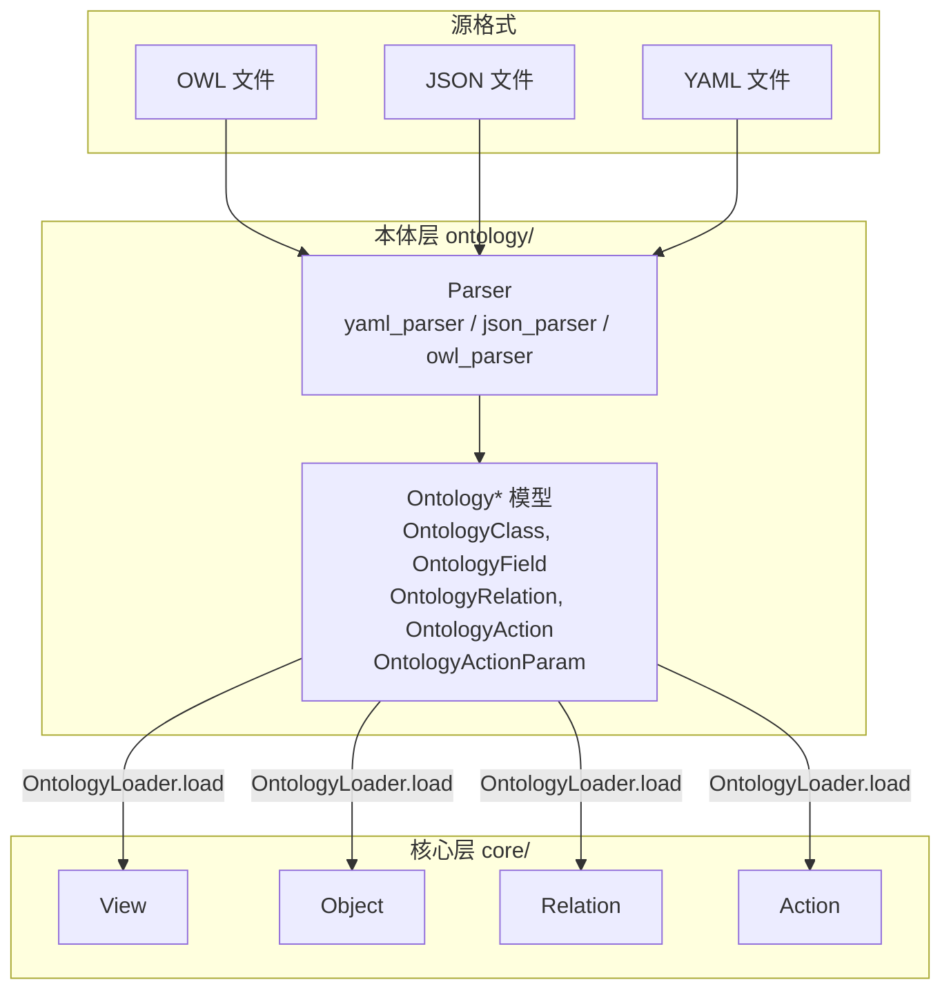

# OWL/JSON/YAML → 本体层 → 核心层 数据流与完整示例

> **设计日期**：2026-03-06  
> **关联文档**：《数据服务详细设计2.0》第 6.1.4 节（OntologyLoader 使用与数据流）、《本地对象标准格式规范（JSON、YAML、OWL）》

---

## 1 设计目标

说明 OWL/JSON/YAML 本体文件如何转换为**本体层（Ontology* 模型）**，再如何转换为**核心层（View/Object/Relation/Action）**，并给出**从 OWL 到执行动作查询**的完整示例。**OntologyLoader 的加载方式与本体层/核心层 API 已整合至《数据服务详细设计2.0》6.1.4 节**，本文档提供详细示例与 OWL 解析要点。

---

## 2 三层关系总览



| 层级 | 目录 | 职责 |
|------|------|------|
| **源格式** | resources/ontology/*.yaml / *.json / *.owl | 业务定义，遵循《本地对象标准格式规范》 |
| **本体层** | ontology/models.py, loader.py, parser | 解析为 Ontology* 中立模型，格式无关 |
| **核心层** | view.py, object.py, action.py, relation.py | 运行时实体，供 query()、invoke_action() 使用 |

---

## 3 本体层通过 Loader 的使用

除 `load_from_path` 外，Loader 还支持 `load_from_service`（知识服务）、`load_from_content`（内存内容）。加载后：

- **本体层**：`get_ontology_class`、`get_ontology_classes`、`get_ontology_relations` 直接返回 Ontology* 模型，供 ObjectViewBuilder、适配层、校验逻辑使用。
- **核心层**：`get_object`、`get_view`、`get_action` 返回 View/Object/Action，供 query()、invoke_action() 使用。

**本体层使用示例**（ObjectViewBuilder 内部逻辑）：

```python
loader = OntologyLoader()
loader.load_from_service(view_id="employee_opportunity_view")  # 或 load_from_path / load_from_content

# 直接使用 Ontology* 构建 ObjectViewPayload
classes = loader.get_ontology_classes(object_ids=["sales_person", "sales_business_opportunity"])
relations = loader.get_ontology_relations()
for cls in classes:
    # cls 为 OntologyClass，含 fields、actions
    for action in cls.actions:
        fn = loader.get_function_config(action.function_refs[0])  # 获取 api_schema
# 将 classes + relations 转为 ObjectViewPayload
```

详见《数据服务详细设计2.0》6.1.4。

---

## 4 转换流程详解

### 4.1 第一步：源格式 → Ontology* 模型（本体层）

**Parser** 根据文件扩展名或 Content-Type 选择解析器：

| 格式 | 解析器 | 输出 |
|------|--------|------|
| `.yaml` / `.yml` | yaml_parser | 解析为 dict，再映射为 Ontology* |
| `.json` | json_parser | 解析为 dict，再映射为 Ontology* |
| `.owl` | owl_parser | 解析 RDF/XML，提取 dc: 命名空间，映射为 Ontology* |

**映射规则**（与《本地对象标准格式规范》对应）：

| 源格式节点 | Ontology* 模型 |
|------------|----------------|
| `objects[]` | OntologyClass（含 OntologyField、OntologyAction） |
| `objects[].properties[]` | OntologyField |
| `relations[]` | OntologyRelation |
| `objects[].actions[]` | OntologyAction |
| `actions[].params[]` | OntologyActionParam |
| `functions[]` | 内部 Function 配置（供 Action 的 function_refs 引用） |

**OntologyLoader** 内部调用 Parser，产出 `List[OntologyClass]`、`List[OntologyRelation]` 等，暂存于内存。

### 4.2 第二步：Ontology* → View/Object/Relation/Action（核心层）

**OntologyLoader.load(view_id=None, object_ids=None)** 的转换逻辑：

```
1. 从 Parser 得到 OntologyClass[]、OntologyRelation[]
2. 对每个 OntologyClass：
   - 构造 Object 实例（object_id=class_id, fields=OntologyField[], actions=Action[]）
   - 每个 OntologyAction → 封装为 Action 实例（execute, get_schema）
3. 对每个 OntologyRelation：
   - 构造 Relation 实例（from_object, to_object, cardinality, join_keys）
   - 挂到对应 Object 的 relations 列表
4. 若指定 view_id：
   - 从 views[] 找到视图定义，取 core_object_ref、related_objects
   - 构造 View 实例（objects=[核心对象+关联对象], relations=视图内关系）
5. 返回 View 或 Object(s)
```

---

## 5 完整示例：从 YAML 到执行动作查询

### 5.1 本体文件（YAML，等价于 JSON/OWL）

文件：`resources/ontology/opportunity.yaml`

```yaml
$schema: "https://datacloud.io/schemas/ontology/v1.0"
version: "1.0"
scope: OBJECT
metadata:
  name: 商机对象定义
  tenant_id: TENANT_001
  domain_ref: crm

functions:
  - function_code: fn_query_mysql
    function_type: API
    api_schema:
      openapi: "3.0.3"
      paths:
        /api/v1/query:
          post:
            operationId: fn_query_mysql
            requestBody:
              content:
                application/json:
                  schema:
                    required: [sql, datasource_id]
                    properties:
                      sql: { type: string }
                      datasource_id: { type: string, default: ds_sales }
                      sql_param_emp_no: { type: string }
            responses:
              "200":
                content:
                  application/json:
                    schema:
                      properties:
                        result_set: { type: array, items: { type: object } }

objects:
  - object_code: sales_business_opportunity
    object_name: 商机对象
    object_type: ANALYTICS_DB
    domain_ref: crm
    source_config:
      connector_type: mysql
      datasource_id: ds_sales
      table_name: sales_business_opportunity
      primary_key: id
    properties:
      - property_code: id
        property_name: 商机ID
        property_type: STRING
        is_primary_key: true
      - property_code: bo_name
        property_name: 商机名称
        property_type: STRING
      - property_code: iwhale_cbm_emp_no
        property_name: 负责人工号
        property_type: STRING
    actions:
      - action_code: query_opportunity_by_emp
        action_name: 按员工查商机
        action_type: BUSINESS
        function_refs: [fn_query_mysql]
        params:
          - param_code: emp_no
            param_name: 员工工号
            param_type: STRING
            direction: IN
            required: true
            mapping_path: $.requestBody.sql_param_emp_no
          - param_code: datasource_id
            param_name: 数据源
            param_type: STRING
            direction: IN
            required: false
            mapping_path: $.requestBody.datasource_id
            default_value: ds_sales
          - param_code: opportunity_list
            param_name: 商机列表
            param_type: LIST
            direction: OUT
            required: true
            mapping_path: $.response.result_set
```

### 5.2 转换后的 Ontology* 模型（内存结构，示意）

```python
# ontology/models.py 中的结构（示意）
OntologyClass(
    class_id="sales_business_opportunity",
    name="商机对象",
    source_config={...},
    fields=[
        OntologyField(name="id", type="STRING", is_primary_key=True),
        OntologyField(name="bo_name", type="STRING"),
        OntologyField(name="iwhale_cbm_emp_no", type="STRING"),
    ],
    actions=[
        OntologyAction(
            action_code="query_opportunity_by_emp",
            params=[
                OntologyActionParam(param_code="emp_no", direction="IN", mapping_path="$.requestBody.sql_param_emp_no"),
                OntologyActionParam(param_code="datasource_id", direction="IN", default_value="ds_sales"),
                OntologyActionParam(param_code="opportunity_list", direction="OUT", mapping_path="$.response.result_set"),
            ],
            function_refs=["fn_query_mysql"],
        ),
    ],
)
```

### 5.3 核心层 Object 与 Action 的使用

Loader 支持多种加载方式（见《数据服务详细设计2.0》6.1.4.1）；此处以 `load_from_path` 为例：

```python
from datacloud_data_sdk.ontology.loader import OntologyLoader
from datacloud_data_sdk.context import InvocationContext

# 1. 加载本体（也可用 load_from_service、load_from_content）
loader = OntologyLoader()
loader.load_from_path("resources/ontology/opportunity.yaml")
obj = loader.get_object("sales_business_opportunity")

# 2. 查看对象能力
print(obj.get_description())  # Markdown：字段、动作、关联

# 3. 获取动作的 inputSchema（供 MCP 工具定义）
action = obj.get_action("query_opportunity_by_emp")
schema = action.get_schema()
# schema = {"input": {"type": "object", "required": ["emp_no"], "properties": {...}}, "output": {...}}

# 4. 设置请求上下文（token 等供 ApiExecutor 使用）
with InvocationContext(tenant_id="TENANT_001", token="xxx", user_id="user_001"):
    # 5. 执行动作：按员工工号查商机
    result = obj.invoke_action("query_opportunity_by_emp", {"emp_no": "E001"})
    # result = {"opportunity_list": [{"id": "OPP1", "bo_name": "5G专线", ...}, ...]}
```

### 5.4 自然语言查询（走 View.query）

```python
# 若有视图定义（views[]），可加载 View
view = loader.get_view("employee_opportunity_view")

with InvocationContext(tenant_id="TENANT_001", token="xxx"):
    # 自然语言 → LLM 生成计划 → 执行 → 聚合
    records = view.query("查询员工 E001 负责的商机有哪些")
    # records = [{"emp_no": "E001", "bo_name": "5G专线", ...}, ...]
```

### 5.5 MCP tools/call 的等价流程

当智能体调用 `tools/call` 且工具名为 `query_opportunity_by_emp` 时：

```
1. Gateway 识别为操作类工具 → 转发 ActionExecutor
2. ActionExecutor 根据 action_code 查找 Object 与 Action
3. 参数流水线：arguments → 逻辑名映射 → 术语转换 → 物理参数写入
4. 构造 ApiExecTask（url、method、body 来自 function 的 api_schema + mapping_path）
5. ApiExecutor 执行 HTTP 请求，解析响应
6. 按 OUT 参数的 mapping_path 提取 result_set，返回 MCP content
```

---

## 6 OWL 格式的解析要点

OWL 使用 RDF/XML，dataCloud 通过 `dc:` 命名空间扩展：

| OWL 元素 | 提取方式 | 映射到 Ontology* |
|----------|----------|------------------|
| `owl:Class` + `dc:objectCode` | 遍历 rdf:about，取 dc:objectCode | OntologyClass.class_id |
| `owl:DatatypeProperty` + `rdfs:domain` | 关联到对应 Class | OntologyField |
| `owl:ObjectProperty` + `dc:cardinality` | 取 source/range | OntologyRelation |
| `dc:Action` + `dc:actionCode` | 取 dc:belongsToObject、dc:invokesFunction | OntologyAction |
| `dc:Parameter` | dc:hasParameter 子节点 | OntologyActionParam |
| `dc:apiSchema`（xsd:string） | JSON 解析 | Function 的 api_schema |

**OWL Parser 伪代码**：

```python
def parse_owl(path: str) -> tuple[list[OntologyClass], list[OntologyRelation]]:
    graph = rdflib.Graph().parse(path)
    classes = []
    for s, p, o in graph.triples((None, RDF.type, OWL.Class)):
        if (s, DC.objectCode, None) in graph:
            code = graph.value(s, DC.objectCode)
            # 构建 OntologyClass...
            classes.append(ont_class)
    # 同理解析 ObjectProperty → OntologyRelation, dc:Action → OntologyAction
    return classes, relations
```

---

## 7 数据流小结

| 阶段 | 输入 | 输出 | 负责模块 |
|------|------|------|----------|
| 解析 | OWL/JSON/YAML 文件 | dict / RDF Graph | ontology/parser（或 loader 内嵌） |
| 映射 | dict / Graph | OntologyClass[], OntologyRelation[] | ontology/loader |
| 构建 | Ontology* | View, Object, Relation, Action | ontology/loader |
| 使用 | Object.invoke_action(code, params) | records / result | executor/api_executor |
| 查询 | View.query(question) | records | plan/ + executor/ + aggregator/ |

---

## 8 实施建议

1. **Parser 实现**：优先支持 YAML/JSON（结构直接映射），OWL 可后续补充（依赖 rdflib）。
2. **Loader 缓存**：按文件路径或 view_id 缓存 Ontology* 与 View/Object，避免重复解析。
3. **术语转换**：Action 参数若绑定 term_set，执行前由 term_resolver 将标签转为 code。

---

*文档版本：1.0 | 设计日期：2026-03-06*
