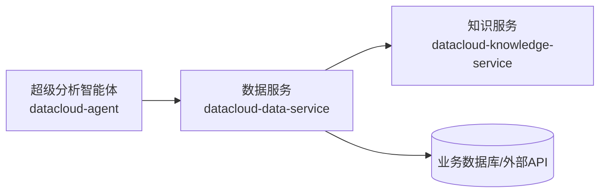
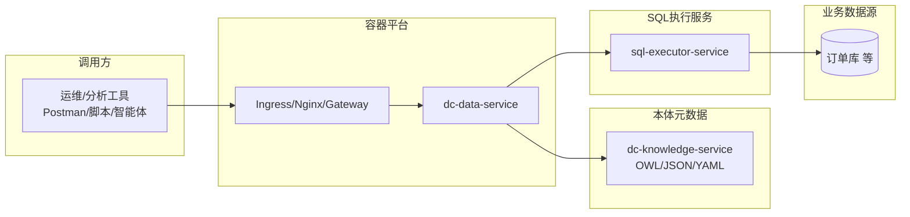
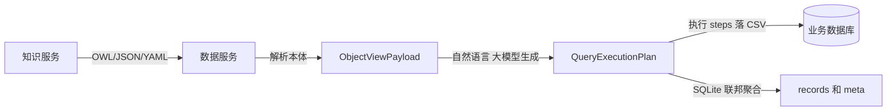
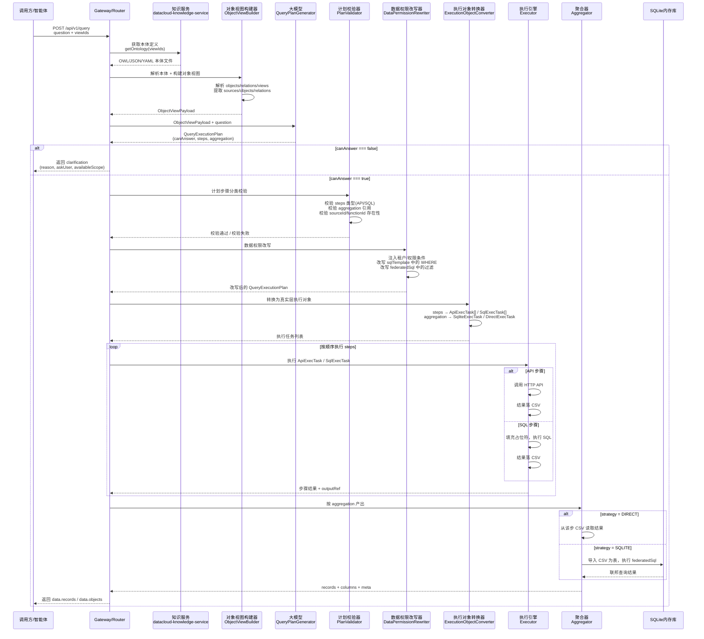
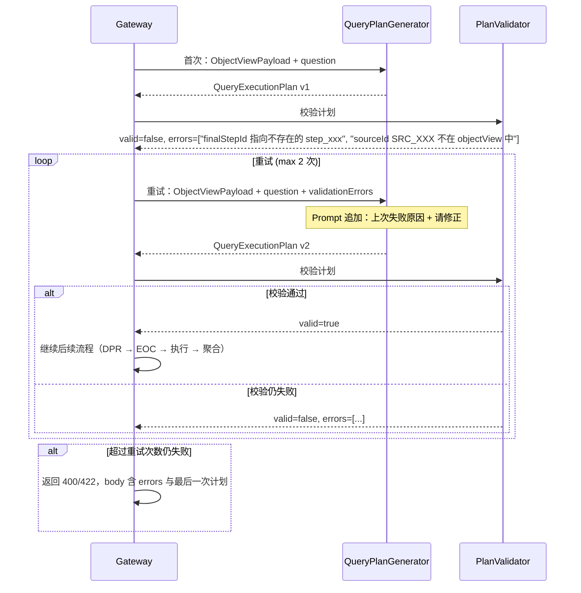
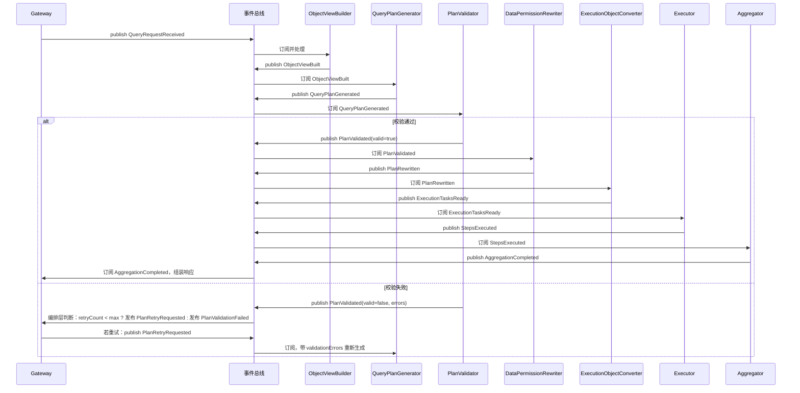
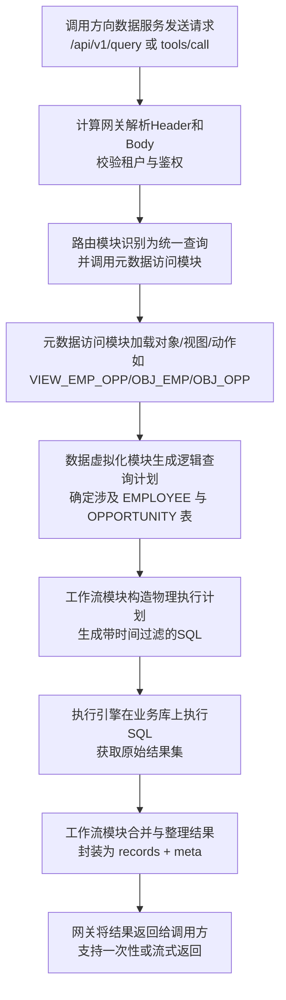

# dataCloud 2.0 详细设计：数据服务（dc-data-service）

本文档在《dataCloud2.0_详细设计_服务拆分与接口》和《本体服务_模块设计》的基础上，**只针对数据服务（datacloud-data-service）** 给出可落地的详细设计，重点覆盖：

1. 功能架构：模块划分及主要 API / MCP 能力  
2. 技术架构：技术栈、中间件依赖与关键设计点  
3. 部署架构：服务实例、端口与依赖组件拓扑  
4. 数据建模：依赖的本体元数据（OWL/JSON/YAML 文件）、业务数据源映射与数据源配置模型  
5. 测试用例：围绕数据服务的端到端场景推演（含 mermaid 流程）

---

## 1 功能架构设计（仅数据服务）

### 1.1 数据服务在整体架构中的位置

从 dataCloud 总体视角来看，数据服务位于「服务层」中间位置，对上承接智能体/应用，对下连接本体元数据与业务数据源，整体关系可简化为：



说明：

- 智能体通过 **MCP** 或 **REST** 调用数据服务，执行统一数据查询或具体动作工具。
- 数据服务从 **知识服务（datacloud-knowledge-service）** 获取 **本体元数据**（OWL/JSON/YAML 格式，含对象/属性/关系/视图/动作/函数）作为配置驱动。
- 数据服务根据元数据与请求参数，访问一个或多个 **业务数据源**，执行 SQL / HTTP 调用并返回统一结构结果。

### 1.2 内部模块划分

数据服务（dc-data-service）内部划分为若干子模块，模块间关系如下：

```mermaid
flowchart TB
    subgraph EB[事件总线 Event Bus]
        direction TB
    end

    GW[Gateway] -->|1. QueryRequestReceived| EB
    EB -->|2. subscribe| OVB[对象视图构建器]
    OVB -->|3. ObjectViewBuilt| EB
    EB -->|4. subscribe| QPG[查询计划生成器]
    QPG -->|5. QueryPlanGenerated| EB
    EB -->|6. subscribe| PV[计划校验器]
    PV -->|7a. valid=true PlanValidated| EB
    PV -->|7b. valid=false PlanValidated| EB
    EB -->|8a. subscribe| DPR[数据权限改写器]
    EB -->|8b. subscribe| ORCH[编排层]
    ORCH -->|9a. 重试 PlanRetryRequested| EB
    ORCH -->|9b. 超限 PlanValidationFailed| EB
    EB -.->|9a. 反馈 validationErrors| QPG
    EB -.->|9b. 失败返回| GW
    DPR -->|10. PlanRewritten| EB
    EB -->|11. subscribe| EOC[执行对象转换器]
    EOC -->|12. ExecutionTasksReady| EB
    EB -->|13. subscribe| EXEC[执行引擎]
    EXEC -->|14. StepsExecuted| EB
    EB -->|15. subscribe| AG[聚合器]
    AG -->|16. AggregationCompleted| EB
    EB -->|17. 响应| GW
```



**说明**：各模块通过**事件总线**解耦，以事件发布/订阅方式驱动流水线。**计划校验失败**时：编排层订阅 `PlanValidated(valid=false)`，若 `retryCount < max_plan_retries` 则发布 `PlanRetryRequested`（含 `validationErrors`），QPG 重试生成计划；超过次数则发布 `PlanValidationFailed` 返回 Gateway。

- **计算网关模块（Gateway）**
  - 统一接收 HTTP（REST）与 MCP（JSON-RPC 2.0 over HTTP）请求。
  - 负责：
    - 鉴权（API Key / Token 校验）。
    - 租户解析（从 Header：`X-Tenant-Id` 等）。
    - 请求日志与审计（记录调用者、工具名、时长、错误码）。
    - 针对统一数据查询接口 `/api/v1/query`，将请求标准化为内部 `QueryRequest`，交由 ObjectViewBuilder + QueryPlanGenerator 等模块处理。
- **请求解析与路由模块（Router）**
  - 统一解析：
    - MCP：`tools/list`、`tools/call`、`unified_data_query`。
    - REST：`/api/v1/query`、`/api/v1/query/federated`、`/api/v1/skills/package`。
  - 根据 method / path 以及参数将请求路由到对应子模块。
- **对象视图构建器（ObjectViewBuilder）**
  - 从 OWL/JSON/YAML 本体解析并生成 **ObjectViewPayload**（sources、objects、relations）。
  - 输入：本体文件、视图 ID。
  - 输出：ObjectViewPayload，供 QueryPlanGenerator 使用。
- **查询计划生成器（QueryPlanGenerator）**
  - 调用大模型，将 ObjectViewPayload + 自然语言问题转换为 **QueryExecutionPlan**（含 canAnswer、steps、aggregation）。
  - 输入：ObjectViewPayload、question。
  - 输出：QueryExecutionPlan（JSON）。
- **元数据访问模块（Metadata Client）**
  - 通过 **datacloud-knowledge-service** 获取本体元数据，支持 **OWL、JSON、YAML** 三种标准格式：
    - 对象（objects）、属性（properties）、关系（relations）、视图（views）
    - 动作（actions）、参数（params）、函数（functions）
  - 文件结构遵循《本地对象标准格式规范（JSON、YAML、OWL）》，提供缓存能力，减少重复访问。
- **计划校验器（PlanValidator）**
  - 对 QueryExecutionPlan 做步骤分类校验与引用完整性校验。
  - 输出：valid、errors、suggestions；校验失败时可反馈给 QueryPlanGenerator 重试。
- **数据权限改写器（DataPermissionRewriter）**
  - 根据租户、用户角色、权限策略改写 SQL 与 API 参数，注入数据权限条件。
- **执行对象转换器（ExecutionObjectConverter）**
  - 将 QueryExecutionPlan 的 steps 与 aggregation 转换为 ApiExecTask、SqlExecTask、AggregationTask。
- **工作流与联邦查询模块（Workflow/Federation）**
  - 负责按顺序执行 steps（API 与 SQL 结果均落 CSV），再按 aggregation 配置产出最终结果。
  - 聚合阶段：DIRECT 从 CSV 读取；SQLITE 将 CSV 导入 SQLite 内存库后执行 federatedSql。
- **执行引擎/执行适配器模块（Executor）**
  - 不直接暴露给上层，仅由 Workflow 调用。
  - 按 QueryExecutionPlan 的 steps 执行：API 步骤调用 HTTP 接口并落 CSV；SQL 步骤调用外部「SQL 执行服务」执行并落 CSV。
  - **不直接连接业务数据库**，SQL 类查询统一通过 SQL 执行服务执行。

### 1.3 对外能力与接口清单（数据服务专用）

#### 1.3.1 MCP 能力

- **方法：`tools/list`**
  - 功能：根据 Header 中传入的对象/视图 ID，列出当前可用工具列表。
  - 典型调用：
    - 请求头：`X-Tenant-Id`、`X-Object-Ids`、`X-View-Ids`。
    - 请求体：
      ```json
      { "jsonrpc": "2.0", "id": "1", "method": "tools/list", "params": {} }
      ```
    - 响应：`result.tools[]` 中包含：
      - 由对象动作映射的工具（如 `query_emp_opp`）。
      - 统一数据查询工具 `unified_data_query`。

- **方法：`tools/call`**
  - 功能：执行指定工具（动作），返回结构化结果或错误。
  - 典型调用：
    - `params.name`：工具名称（如 `query_emp_opp` / `unified_data_query`）。
    - `params.arguments`：JSON 对象，包含工具入参。
  - 响应：
    - `result.content[]`：MCP Content（`type=text`、`text` 中封装 JSON 字符串）。
    - `result.isError`：是否为错误。

#### 1.3.2 REST 能力

- **统一数据查询：`POST /api/v1/query`**
  - 用途：被智能体或前端直接调用，进行自然语言驱动的数据查询。
  - 关键点：
    - Header：`X-Tenant-Id`、`X-Object-Ids`、`X-View-Ids`。
    - Body：`question`、`maxRows`、`stream`。
    - 支持 SSE 流式返回执行进度。

- **Skill 生成：`GET /api/v1/skills/package`**
  - 用途：围绕单个视图或对象生成 skill 压缩包（包含 SKILL.md、script.sh、references.json、schema.json）。

- **联邦查询：`POST /api/v1/query/federated`**
  - 用途：执行跨多数据源的 SQL 查询。
  - Body 中包含：
    - `sql`：联邦 SQL。
    - `dataSources[]`：数据源配置（`alias`、`type`、`config.jdbcUrl` 等）。

---

## 2 技术架构设计

### 2.1 数据服务技术栈

| 组件 | 技术选型 | 说明 |
|------|----------|------|
| Web 框架 | FastAPI + Uvicorn | 提供高性能异步 HTTP 服务，天然支持 OpenAPI 文档 |
| 数据访问 | SQLAlchemy / asyncpg / PyMySQL 等 | 通过统一抽象适配多种关系型数据库 |
| 结果计算 | Pandas / DuckDB / Dask | 承载联邦查询结果合并与聚合计算 |
| 配置管理 | Pydantic 配置模型 + 外部配置中心 | 解析数据源配置（包括 JDBC URL）与运行参数 |
| 序列化 | 标准 JSON + 可选 orjson | 提高大结果集序列化性能 |

### 2.2 与外部组件交互

- **知识服务（datacloud-knowledge-service）**
  - 通过 REST 调用获取本体元数据，支持 **OWL、JSON、YAML** 三种标准格式，可在本服务内部做缓存。
  - 本体文件结构遵循《本地对象标准格式规范（JSON、YAML、OWL）》，包含 objects、relations、views、functions 等完整定义。
- **SQL 执行服务（外部服务）**
  - 用于执行所有与业务数据库相关的 SQL 查询，数据服务**不直接连接业务数据库**：
    - 数据服务将 `dataSourceAlias`、SQL 文本、参数列表封装为请求体；
    - 通过 REST/HTTP 调用 SQL 执行服务的统一接口（如 `POST /api/v1/sql/execute`）；
    - 由 SQL 执行服务根据 `dataSourceAlias` 查找数据源配置、建立连接、执行 SQL 并返回结果。
  - 好处：
    - 将连接池管理、SQL 超时控制、慢查询审计集中在一处；
    - 数据服务只关心「要查什么」，不关心「怎么连」。
- **消息队列（可选）**
  - 用于接收元数据变更通知（如新对象/视图发布），触发本地缓存刷新。
- **业务数据库/数据源**
  - 数据服务不直接保存业务数据，仅作为访问入口。
  - 所有数据源通过统一配置模型管理（见 4.4 小节），并由 SQL 执行服务在执行时使用。

### 2.3 关键技术设计点

- **统一数据源配置（JDBC URL 风格）**
  - 所有数据库类数据源统一通过 `jdbcUrl` 描述连接信息，其余如 `user`、`password`、`credentialId` 等作为辅助字段。
  - Python 端在运行时解析 `jdbcUrl`，将其转换为对应驱动的连接参数。
- **查询计划与执行解耦**
  - 数据服务内部将一次统一查询拆成：
    - **QueryExecutionPlan**：由大模型根据 ObjectViewPayload + 自然语言生成，含 steps（API/SQL）、aggregation（DIRECT/SQLITE）。
    - **执行任务**：由 ExecutionObjectConverter 将计划转为 ApiExecTask、SqlExecTask、AggregationTask。
  - 执行引擎按 steps 顺序执行，结果落 CSV；聚合阶段按 aggregation 配置从 CSV 或 SQLite 产出最终 records。
- **安全控制**
  - 对外只暴露「预定义对象/视图/动作」所允许的字段与条件，防止注入与越权访问。
  - 联邦查询接口应限制可执行的 SQL 子集，禁止 DDL/DML 等破坏性语句。

### 2.4 核心运行时数据与缓存

为支撑自然语言 → 执行链路，数据服务内部需要维护若干核心运行时数据结构与缓存：

- **ObjectViewPayload 缓存**
  - Key：`view_code` / `viewId`。
  - Value：对应视图的 ObjectViewPayload（sources、objects、relations）。
  - 构建时机：从知识服务获取 OWL/JSON/YAML 本体后，由 ObjectViewBuilder 解析生成；服务启动时批量加载或首次访问时懒加载；本体变更时通过消息或定时刷新。
- **计划执行上下文**
  - 每次统一查询创建一个上下文，内部包含：
    - `requestId`、`tenantId`、`objectView`；
    - `QueryExecutionPlan`；
    - 各 steps 的 CSV 路径；
    - 改写后的计划与执行任务；
  - 上下文生命周期：随一次请求创建并在响应后销毁，用于链路日志与调试。
- **统计与审计数据**
  - 记录每次查询中：
    - 选用了哪些视图/对象（ObjectViewPayload 级别）；  
    - 调用了哪些 API / SQL（steps 级别）；  
    - API/SQL 耗时与行数；  
    - 聚合后的 records 条数。
  - 用于后续优化计划生成、执行策略。

---

## 3 部署架构设计

### 3.1 服务与上下文

数据服务自身的部署信息如下：

| 项目 | 说明 |
|------|------|
| 服务名称 | `datacloud-data-service` |
| 默认端口 | 8082 |
| 上下文路径 | 根路径 `/`，REST 在 `/api/v1/*`，MCP 在 `/api/v1/mcp`（示例） |
| 依赖组件 | 知识服务（datacloud-knowledge-service）、一个或多个业务数据源、配置中心、日志/监控组件 |

### 3.2 典型部署拓扑（Kubernetes 环境）



### 3.3 部署方式建议

- **开发与测试环境**
  - 使用 Docker Compose 起多容器环境，端口直接映射至宿主机。
  - 知识服务与数据服务可独立部署，业务库使用测试 schema。
- **生产环境**
  - 使用 Kubernetes：
    - `dc-data-service` 独立 Deployment，至少 2 副本，配置 HPA（基于 CPU/QPS）。
    - 使用 ConfigMap / Secret 管理数据源配置与敏感凭证。
    - 使用 Ingress 暴露 `/api/v1/query`、`/api/v1/query/federated`、`/api/v1/mcp` 等入口。

---

## 4 数据建模设计

数据服务的数据建模**不依赖数据库表**，而是基于 **OWL、JSON、YAML** 三种标准格式的本体定义文件。这些本体文件由 **datacloud-knowledge-service**（知识服务）提供，其结构遵循《本地对象标准格式规范（JSON、YAML、OWL）》文档。

### 4.1 本体文件来源与数据流



- 数据服务通过 **datacloud-knowledge-service** 的 API 获取本体定义，支持 **OWL、JSON、YAML** 三种格式。
- 本体文件为**自包含**结构，包含对象、属性、关系、视图、动作、函数等完整元数据。
- 数据服务解析本体文件后构建 ObjectViewPayload，由大模型生成 QueryExecutionPlan，经校验、权限改写后执行；中间结果落 CSV，最终通过 SQLite 内存库联邦聚合产出 records。

### 4.2 本体文件结构摘要（与数据服务直接相关）

> 完整格式规范见《本地对象标准格式规范（JSON、YAML、OWL）》，此处仅列出与查询计划密切相关的结构要素。

本体文件支持两种粒度：**视图级（scope: VIEW）** 与 **对象级（scope: OBJECT）**。

| 顶层节点 | 说明 | 数据服务用途 |
|---------|------|-------------|
| **metadata** | 元信息（name、tenant_id、domain_ref 等） | 租户与领域识别 |
| **functions** | 全局函数/工具定义 | 动作绑定的 API/PLUGIN 调用规范 |
| **objects** | 对象定义（含 domain_ref、source_config、properties、actions） | 构建 ObjectViewPayload，映射到物理数据源 |
| **relations** | 对象间关系（source_object_ref、target_object_ref、source_property_ref、target_property_ref、cardinality、action_ref） | 生成 JOIN 信息与联邦查询 |
| **views** | 视图定义（仅视图级文件；含 view_code、core_object_ref、related_objects） | 逻辑视图与多对象聚合 |

**对象（objects）关键字段：**

- `object_code`、`object_name`、`object_type`（API / ANALYTICS_DB / KNOWLEDGE_BASE）
- `domain_ref`、`source_system`、`source_config`（connector_type、datasource_id、table_name、primary_key 等）
- `properties`：`property_code`、`property_name`、`property_type`、`is_primary_key`、`source_column`
- `actions`：`action_code`、`action_type`、`function_refs`、`params`（含 mapping_path）

**关系（relations）关键字段：**

- `source_object_ref`、`target_object_ref`、`source_property_ref`、`target_property_ref`
- `relation_type`、`cardinality`（ONE_TO_MANY、MANY_TO_ONE 等）、`action_ref`（可选）

**视图（views）关键字段：**

- `view_code`、`view_name`、`core_object_ref`、`related_objects`（含 object_ref、relation_path）

### 4.3 业务示例：基于本体文件的员工-商机映射

为支撑后文**数据服务测试场景**，假定 **datacloud-knowledge-service** 提供如下本体定义（JSON/YAML/OWL 格式），数据服务据此构建 ObjectViewPayload。业务数据仍存储在 `crm_db` 的物理表中，但**元数据全部来自本体文件**，无独立元数据表。

#### 4.3.1 对象定义（来自本体文件 objects 节点）

- **对象 sales_person（员工对象）**
  - `object_type`: ANALYTICS_DB
  - `source_config`: connector_type=mysql, datasource_id=ds_sales, table_name=sales_person, primary_key=emp_no
  - 关键属性：`emp_no`、`name`、`org_id`、`status`（通过 properties 的 source_column 映射到物理列）
- **对象 sales_business_opportunity（商机对象）**
  - `source_config`: table_name=sales_business_opportunity, primary_key=id
  - 关键属性：`id`、`bo_name`、`iwhale_cbm_emp_no`、`business_opportunity_process`、`contract_scale`

#### 4.3.2 关系定义（来自本体文件 relations 节点）

- **员工负责商机**
  - `source_object_ref`: sales_person，`target_object_ref`: sales_business_opportunity
  - `source_property_ref`: emp_no，`target_property_ref`: iwhale_cbm_emp_no
  - `cardinality`: ONE_TO_MANY，`action_ref`: query_opportunity_by_emp

#### 4.3.3 视图定义（来自本体文件 views 节点，视图级文件）

- **employee_view（员工视图）**
  - `core_object_ref`: sales_person
  - `related_objects`: 含 sales_business_opportunity，relation_path 描述关联路径
  - 数据服务将 employee_view 视为「逻辑视图」，根据本体中的 source_config 与 relations 生成跨表的 SQL。

### 4.4 数据源配置模型（config 示例）

数据服务通过配置中心或管理后端获取数据源配置，统一使用 JDBC URL 形式描述数据库连接：

```json
{
  "alias": "crm_db",
  "type": "MYSQL",
  "config": {
    "jdbcUrl": "jdbc:mysql://mysql.example.com:3306/crm_db?useUnicode=true&characterEncoding=utf8mb4",
    "user": "readonly",
    "password": "***",
    "connectionPool": {
      "maxPoolSize": 10,
      "minPoolSize": 1,
      "connectionTimeout": 3000
    }
  }
}
```

数据服务在启动时加载这些配置，构建连接池，并在执行阶段根据对象/视图映射找到对应数据源 `alias`，从而确定物理执行位置。

### 4.5 自然语言 → 查询计划 → API + SQL 混合执行流程（模型驱动 + CSV 暂存 + SQLite 内存联邦）

本小节给出数据服务**统一查询**的完整实现方案：基于 OWL/JSON/YAML 本体生成**对象视图数据**，由大模型根据对象视图与自然语言直接生成 **QueryExecutionPlan**（含 steps、aggregation），经校验、权限改写后执行；**中间步骤（API 与 DB）结果均落 CSV 暂存**，最终通过 **SQLite 内存数据库** 导入 CSV 并执行联邦 SQL（JOIN/聚合），产出 records + meta。

#### 4.5.1 方案概述与定位

以下均以「邹海天签了合同的商机有哪些」为例，说明对象视图输入、计划结构与执行路径。

| 维度 | 说明 |
|------|------|
| 计划生成 | 模型直接根据「对象视图」生成结构化执行计划（API 调用 + SQL + 最终联邦 SQL） |
| 输入 | **对象视图数据（Object View Payload）** + 自然语言 → **QueryExecutionPlan** |
| 跨源聚合 | **CSV 暂存 + SQLite 内存**：API 与 DB 结果均落 CSV，SQLite 内存库导入 CSV 后执行联邦 SQL（JOIN/聚合） |
| 适用 | 数据源/函数较多、希望模型灵活选择数据源，且统一用 SQLite 内存库做最终关联 |

#### 4.5.2 对象视图数据：给模型的结构化输入

**目标**：用尽量少的结构化元数据，让模型能判断「用哪个数据源/函数、生成哪段 SQL、是否需要 SQLite 联邦（多 CSV 表 JOIN）」。

**对象视图（Object View）** 建议只保留三块关键数据：`sources`（数据源）、`objects`（对象字段与能力）、`relations`（对象间关联）。其余如长描述、接口地址等均可作为可选字段延后补齐，不影响计划生成。

下面给出 **精简版（关键字段）** 示例（员工 API + 商机/合同同源 DB）：

```json
{
  "viewId": "emp_opp_contract_view",
  "sources": [
    { "sourceId": "SRC_EMP_API", "type": "API" },
    { "sourceId": "SRC_CRM_DB", "type": "DB", "dataSourceAlias": "crm_db", datasourceId:"mysql" }
  ],
  "objects": [
    {
      "objectId": "OBJ_EMP_API",
      "sourceId": "SRC_EMP_API",
      "fields": [
        { "name": "emp_id", "type": "string" },
        { "name": "emp_name", "type": "string", "aliases": ["员工名称", "负责人"] }
      ],
      "functions": [
        { "functionId": "ACT_GET_EMP_BY_NAME", "params": ["emp_name"], "returns": ["emp_id", "emp_name"] }
      ]
    },
    {
      "objectId": "OBJ_OPP_DB",
      "sourceId": "SRC_CRM_DB",
      "table": "t_opportunity",
      "fields": [
        { "name": "opp_id", "type": "string" },
        { "name": "emp_id", "type": "string" },
        { "name": "opp_name", "type": "string", "aliases": ["商机标题", "项目名称"] }
      ]
    },
    {
      "objectId": "OBJ_CONT_DB",
      "sourceId": "SRC_CRM_DB",
      "table": "t_contract",
      "fields": [
        { "name": "contract_id", "type": "string" },
        { "name": "opp_id", "type": "string" },
        { "name": "emp_id", "type": "string" },
        { "name": "sign_status", "type": "string", "aliases": ["签署状态", "签了合同"] }
      ]
    }
  ],
  "relations": [
    {
      "fromObject": "OBJ_OPP_DB",
      "toObject": "OBJ_CONT_DB",
      "cardinality": "ONE_TO_MANY",
      "joinKeys": [
        { "fromField": "opp_id", "toField": "opp_id" },
        { "fromField": "emp_id", "toField": "emp_id" }
      ]
    }
  ]
}
```

**说明（精简要点）**：

- **sources.type** 用于区分 API/DB；同一 DB 下多表共用一个 `sourceId`，便于模型输出“同源多表一条 SQL”。  
- **objects.functions / objects.table + relations** 决定“调用哪个函数”与“如何 JOIN 生成 SQL（含多字段 joinKeys 与 cardinality）”。

**给模型时的用法**：将上述 JSON 作为「对象视图数据」与「自然语言问题」一起放入 Prompt（或结构化入参），要求模型输出统一的 **QueryExecutionPlan**（见下）。

**生成计划的提示词（Prompt）**

以下提示词供调用大模型生成 QueryExecutionPlan 时使用，可直接作为 system 或 user 段的一部分；占位符 `{{objectView}}`、`{{question}}` 由执行层在运行时替换为实际的对象视图 JSON 与用户问题。

```
你是一个数据查询计划生成器。根据「对象视图」和「用户问题」，生成一份结构化的查询执行计划（QueryExecutionPlan）。

## 输入

1. **对象视图（objectView）**：描述当前可用的数据源与对象能力，包括 sources（API/DB）、objects（字段与函数/表）、relations（对象间关联与 joinKeys）。
2. **用户问题（question）**：用户的自然语言查询，例如「邹海天签了合同的商机有哪些」「查询所有商机列表」。

## 输出要求

请**仅输出一份合法的 JSON**，即 QueryExecutionPlan，不要包含其他解释或 markdown 代码块标记。结构约定如下：

- **canAnswer**（必填）：若根据对象视图可以回答该问题，输出 `true`；若缺少必要字段/表/API 或无法映射条件，输出 `false`。
- 当 **canAnswer 为 false** 时：
  - 必须输出 **clarification** 对象，包含三项：**reason**（为什么不能回答）、**askUser**（反问用户需要什么信息）、**availableScope**（本视图/对象可以查询什么数据）。不输出 steps、aggregation。
- 当 **canAnswer 为 true** 时：
  - **steps**（可选）：前置步骤数组，每项为一次 API 调用（type: "API", functionId, params, outputRef, outputFormat: "CSV"）或 DB 查询（type: "SQL", dataSourceAlias, sqlTemplate, outputRef, outputFormat: "CSV"）。**中间步骤结果均落 CSV 暂存**。若无需前置步骤（如仅一条 SQL 即结果），可为 `[]`。sqlTemplate 中可用占位符 `{api_join_values}` 表示由前序 API 步骤结果填充的 IN 列表。
  - **aggregation**（必填）：可为单个对象或对象数组。
    - 单个对象：最终结果来自一步或 SQLite 联邦；需包含 **strategy**（"DIRECT" 或 "SQLITE"）、**columns**（name/label/type）。DIRECT 时需 **finalStepId** 指向 steps 中某步（从该步的 CSV 读取）；SQLITE 时需 **federatedSql**，各步骤 CSV 以 outputRef 为表名导入 SQLite 内存库后执行。
    - 对象数组：一个问题返回多个数据对象；每项结构同上，建议每项带 **name** 标识（如「员工信息」「商机列表」）。

请严格根据 objectView 中的 sources、objects、relations 决定：调用哪个 functionId、生成哪条 SQL、是否需要 SQLite 联邦（多 CSV 表 JOIN）、最终输出的 columns。若问题无法用当前视图回答，务必 canAnswer=false 并填写完整的 clarification。

## 输入内容

**对象视图：**
{{objectView}}

**用户问题：**
{{question}}

请直接输出 QueryExecutionPlan 的 JSON，不要输出其他内容。
```

实现时可将上述提示词中的 `{{objectView}}`、`{{question}}` 替换为实际值后调用大模型，并对返回内容做 JSON 解析与校验（canAnswer、clarification/aggregation 与 steps 的合法性）。

#### 4.5.3 模型输出：统一查询执行计划（QueryExecutionPlan）

**计划结构约定**

**最终结果一律由 aggregation 定义**，执行引擎只从 aggregation 得到「最终输出是什么」；steps 为可选前置步骤，可为空。当**现有数据/视图无法回答用户问题时**，计划需通过兼容性标识与澄清内容告知调用方，不执行查询、直接返回澄清说明。

| 字段 | 是否必填 | 说明 |
|------|----------|------|
| **canAnswer** | **必填** | 布尔值。`true` 表示当前视图与数据源可回答该问题，按 steps + aggregation 执行；`false` 表示无法回答，需配合 **clarification** 返回澄清内容，不执行 steps/aggregation。 |
| **clarification** | **当 canAnswer 为 false 时必填** | 结构化澄清，包含三部分：**reason**（为什么不能回答）、**askUser**（反问用户需要什么信息）、**availableScope**（本视图/对象可查询什么数据）。执行引擎将澄清内容返回给用户，引导其重新提问或补充需求。 |
| **aggregation** | **当 canAnswer 为 true 时必填** | 可为**单个对象**或**对象数组**。单个对象表示一个问题返回一个数据对象（一份 records）；**数组表示一个问题返回多个数据对象**，每项对应一个独立结果集（如「员工列表」+「商机列表」）。通过 **strategy** 区分如何产出每项结果。 |
| **steps** | **可选，可为空数组** | 前置步骤（API 调用、DB 查询），为 aggregation 提供中间数据；若无需前置步骤（如直接一条 DB 查询即结果），则 steps 为 `[]`。当 canAnswer 为 false 时，steps 可省略或为空。多个 aggregation 可共享同一批 steps。 |

- **aggregation**：必填。可为**单个对象**（返回一个数据对象）或**对象数组**（返回多个数据对象）。
  - **单个对象**：与现有约定一致，最终响应为一个数据对象（一份 `records` + `columns` + `meta`）。
  - **对象数组**：一个问题返回**多个数据对象**，执行引擎按顺序执行每一项 aggregation，响应中返回多份结果集；每项建议带 **name**（或 **label**）标识该数据对象（如「员工列表」「商机列表」），便于前端区分展示。
  - 每项 aggregation 结构相同：除 **strategy** 外，需包含 **columns**；多数据对象时每项可增加 **name** / **label**（可选）。**strategy** 取值决定该项结果从哪来（DIRECT / SQLITE）；**columns** 为该结果集的列元数据。多 aggregation 时，不同项可引用同一 steps 的不同 step（如一项 DIRECT 取 step_1，另一项 DIRECT 取 step_2），或混合 SQLITE 与 DIRECT。
- **steps**：可为空。多个 aggregation 可共享同一批 steps，各 aggregation 通过 `finalStepId` 或 federatedSql 引用 steps 的输出。

这样**不会出现「不知道最终输出在 steps 还是 aggregation」**：**始终看 aggregation**；steps 仅表示「要不要先跑一些步骤再把结果交给 aggregation」。当 **canAnswer = false** 时，不执行任何步骤与聚合，**仅返回 clarification**，且澄清内容需同时：**说明为什么不能回答**、**反问用户需要什么信息**、**说明本视图/对象可以查询什么数据**，保证输出计划与「可答/不可答」兼容同一套结构。

**不可回答时的计划形态（兼容澄清）**

当模型根据对象视图判断「现有数据无法满足用户问题」时（如缺少某表/某字段、缺少某 API、条件无法映射等），应输出 `canAnswer: false` 并填写 **clarification**。clarification 为**结构化对象**，必须包含三部分，缺一不可：

1. **reason**（为什么不能回答）：说明无法回答的原因，例如缺哪些字段/表/数据源、条件无法映射等。
2. **askUser**（反问用户需要什么信息）：引导用户补充或重新描述需求，例如「您需要按时间统计还是按部门统计？」「请说明要统计的时间范围或筛选条件。」便于用户重新提问或收敛到当前视图能支持的问题。
3. **availableScope**（本视图/对象可查询什么数据）：说明当前视图和对象**能查什么**——可查哪些表/对象、哪些字段、支持哪些筛选条件或示例问题，让用户知道「在这个视图下能问什么」。

steps/aggregation 可省略或留空。执行引擎据此不执行查询，将 clarification 的 reason、askUser、availableScope 写入响应（可分别对应 `data.clarification.reason`、`data.clarification.askUser`、`data.clarification.availableScope`，或由前端拼接成一段完整说明展示），并可选设置 `data.records = []`、`meta.total = 0`。

示例：用户问「按合同签署日期统计每个月的签约金额」，但当前视图仅有员工、商机、合同 ID 与签署状态，无签署日期、无金额字段。

```json
{
  "question": "按合同签署日期统计每个月的签约金额",
  "canAnswer": false,
  "clarification": {
    "reason": "当前视图未包含合同签署日期与合同金额字段，无法按签署日期或金额进行统计。",
    "askUser": "您是否希望改为按「员工」或「商机」维度统计？如需按签署日期或金额分析，请说明具体时间范围或统计口径，我们可评估是否需接入其他数据源。",
    "availableScope": "本视图（员工-商机-合同）当前可查询：按员工姓名查员工信息、按员工查其关联商机列表、按员工与合同签署状态查「某员工已签/未签合同的商机」及合同 ID；支持按员工姓名、合同签署状态（已签/未签）等条件筛选。不支持按签署日期、金额、月份聚合。"
  }
}
```

执行：执行层检测到 `canAnswer === false` 时直接返回 `clarification`（reason/askUser/availableScope），不执行查询。

**strategy 说明**

1. **`aggregation.strategy = "DIRECT"`**  
   最终结果 = 指定步骤的输出。aggregation 中需提供 `finalStepId`，指向 steps 中的某一步；执行引擎执行该步骤后，将其输出作为最终 `records` 返回。该步结果已落 CSV，可直接从 CSV 读取。
2. **`aggregation.strategy = "SQLITE"`**
   最终结果 = 在 **SQLite 内存数据库** 上执行 `aggregation.federatedSql` 的结果。先执行 steps（API 与 DB 结果均落 CSV），再将各 CSV 导入 SQLite 内存库为临时表（表名对应 outputRef），执行 federatedSql 做 JOIN/聚合；若 steps 为空，则 federatedSql 仅引用单表或无需执行。

**示例一：单步即结果（aggregation.strategy = DIRECT）**

自然语言：「查询所有商机列表」或「查员工邹海天的基本信息」。

最终结果 = 唯一一步的执行结果，故 aggregation 必填且 strategy 为 `DIRECT`，`finalStepId` 指向该步；steps 仅 1 个。

仅 DB 示例：

```json
{
  "question": "查询所有商机列表",
  "canAnswer": true,
  "steps": [
    {
      "stepId": "step_1_sql",
      "type": "SQL",
      "sourceId": "SRC_CRM_DB",
      "dataSourceAlias": "crm_db",
      "sqlTemplate": "SELECT opp_id, emp_id, opp_name FROM t_opportunity",
      "outputRef": "opp_list"
    }
  ],
  "aggregation": {
    "strategy": "DIRECT",
    "finalStepId": "step_1_sql",
    "columns": [
      { "name": "opp_id", "label": "商机ID", "type": "string" },
      { "name": "emp_id", "label": "员工ID", "type": "string" },
      { "name": "opp_name", "label": "商机名称", "type": "string" }
    ]
  }
}
```

仅 API 示例：

```json
{
  "question": "查员工邹海天的基本信息",
  "canAnswer": true,
  "steps": [
    {
      "stepId": "step_1_api",
      "type": "API",
      "sourceId": "SRC_EMP_API",
      "functionId": "ACT_GET_EMP_BY_NAME",
      "params": { "emp_name": "邹海天" },
      "outputRef": "emp_info"
    }
  ],
  "aggregation": {
    "strategy": "DIRECT",
    "finalStepId": "step_1_api",
    "columns": [
      { "name": "emp_id", "label": "员工ID", "type": "string" },
      { "name": "emp_name", "label": "员工姓名", "type": "string" }
    ]
  }
}
```

**示例二：无需前置步骤（steps 为空，单步 SQL 落 CSV 后 SQLite 查询）**

自然语言：「查询所有商机列表」。

无 API、无多步联邦时，可令 steps 含一条 SQL 落 CSV，aggregation 为 DIRECT 取该步；或 steps 为空且 aggregation 为 SQLITE 时，需至少有一个 step 产出 CSV。为简化，此处 steps 含单步 SQL，aggregation 为 DIRECT。

```json
{
  "question": "查询所有商机列表",
  "canAnswer": true,
  "steps": [
    {
      "stepId": "step_1_sql",
      "type": "SQL",
      "sourceId": "SRC_CRM_DB",
      "dataSourceAlias": "crm_db",
      "sqlTemplate": "SELECT opp_id, emp_id, opp_name FROM t_opportunity",
      "outputRef": "opp_list",
      "outputFormat": "CSV"
    }
  ],
  "aggregation": {
    "strategy": "DIRECT",
    "finalStepId": "step_1_sql",
    "columns": [
      { "name": "opp_id", "label": "商机ID", "type": "string" },
      { "name": "emp_id", "label": "员工ID", "type": "string" },
      { "name": "opp_name", "label": "商机名称", "type": "string" }
    ]
  }
}
```

**示例三：多步 + SQLite 内存联邦聚合**

自然语言：「邹海天签了合同的商机有哪些」

**模型生成的 QueryExecutionPlan**：

```json
{
  "question": "邹海天签了合同的商机有哪些",
  "canAnswer": true,
  "steps": [
    {
      "stepId": "step_1_api",
      "type": "API",
      "sourceId": "SRC_EMP_API",
      "functionId": "ACT_GET_EMP_BY_NAME",
      "params": { "emp_name": "邹海天" },
      "joinKey": "emp_id",
      "outputRef": "api_emp",
      "outputFormat": "CSV"
    },
    {
      "stepId": "step_2_sql",
      "type": "SQL",
      "sourceId": "SRC_CRM_DB",
      "dataSourceAlias": "crm_db",
      "sqlTemplate": "SELECT o.emp_id, o.opp_id, o.opp_name, c.contract_id FROM t_opportunity o INNER JOIN t_contract c ON o.emp_id = c.emp_id AND o.opp_id = c.opp_id WHERE o.emp_id IN ({api_join_values}) AND c.sign_status = 'SIGNED'",
      "bindFromStep": "step_1_api",
      "bindKey": "emp_id",
      "outputRef": "db_opp_contract",
      "outputFormat": "CSV"
    }
  ],
  "aggregation": {
    "strategy": "SQLITE",
    "description": "SQLite 内存联邦：api_emp.csv 与 db_opp_contract.csv 按 emp_id 关联",
    "federatedSql": "SELECT e.emp_name, d.opp_id, d.opp_name, d.contract_id FROM api_emp e JOIN db_opp_contract d ON e.emp_id = d.emp_id",
    "columns": [
      { "name": "emp_name", "label": "员工姓名", "type": "string" },
      { "name": "opp_id", "label": "商机ID", "type": "string" },
      { "name": "opp_name", "label": "商机名称", "type": "string" },
      { "name": "contract_id", "label": "合同ID", "type": "string" }
    ]
  }
}
```

说明：

- **steps[0]**：API 步骤，执行后结果写入 CSV（路径如 `{workspace}/csv/{requestId}/api_emp.csv`）。
- **steps[1]**：同源 DB 步骤，在 `crm_db` 上执行；结果同样落 CSV（`db_opp_contract.csv`），占位符 `{api_join_values}` 由 step_1 的 emp_id 列填充。
- **aggregation**：**strategy=SQLITE**。执行引擎创建 SQLite 内存数据库，将 `api_emp.csv`、`db_opp_contract.csv` 导入为表（表名对应 outputRef：`api_emp`、`db_opp_contract`），执行 `federatedSql` 做 JOIN，得到最终结果；**columns** 描述最终输出的字段信息。若为聚合查询（如「商机有多少个」），columns 可包含聚合列，例如 `{ "name": "opp_count", "label": "商机数量", "type": "number" }`。

**SQLite 联邦执行流程**：

1. 按顺序执行 steps，API 与 SQL 结果均落 CSV。
2. 创建 `sqlite3.connect(":memory:")` 内存库。
3. 将各 CSV 导入为表：`api_emp`、`db_opp_contract`（表名 = outputRef）。
4. 执行 `federatedSql`，从 SQLite 获取最终 records。

**示例四：一个问题返回多个数据对象（aggregation 为数组）**

自然语言：「查邹海天的基本信息和他的商机列表」——用户期望同时得到「员工信息」与「商机列表」两份数据，即**一个问题返回多个数据对象**。

计划中 **aggregation 为数组**，每项对应一个数据对象；每项可带 **name** / **label** 标识，便于响应与前端区分。steps 可被多个 aggregation 共享（如先查员工 API、再查商机 SQL，两项结果分别作为两个数据对象返回）。

```json
{
  "question": "查邹海天的基本信息和他的商机列表",
  "canAnswer": true,
  "steps": [
    {
      "stepId": "step_1_api",
      "type": "API",
      "sourceId": "SRC_EMP_API",
      "functionId": "ACT_GET_EMP_BY_NAME",
      "params": { "emp_name": "邹海天" },
      "outputRef": "api_emp"
    },
    {
      "stepId": "step_2_sql",
      "type": "SQL",
      "sourceId": "SRC_CRM_DB",
      "dataSourceAlias": "crm_db",
      "sqlTemplate": "SELECT opp_id, emp_id, opp_name FROM t_opportunity WHERE emp_id IN ({api_join_values})",
      "bindFromStep": "step_1_api",
      "bindKey": "emp_id",
      "outputRef": "db_opp"
    }
  ],
  "aggregation": [
    {
      "name": "员工信息",
      "strategy": "DIRECT",
      "finalStepId": "step_1_api",
      "columns": [
        { "name": "emp_id", "label": "员工ID", "type": "string" },
        { "name": "emp_name", "label": "员工姓名", "type": "string" }
      ]
    },
    {
      "name": "商机列表",
      "strategy": "DIRECT",
      "finalStepId": "step_2_sql",
      "columns": [
        { "name": "opp_id", "label": "商机ID", "type": "string" },
        { "name": "emp_id", "label": "员工ID", "type": "string" },
        { "name": "opp_name", "label": "商机名称", "type": "string" }
      ]
    }
  ]
}
```

执行：先执行 step_1_api、step_2_sql（step_2 的占位符由 step_1 的 emp_id 填充）；再按 aggregation 数组顺序，第一项取 step_1 结果、第二项取 step_2 结果，得到两个数据对象。响应结构建议为 **多对象** 形态，例如：

```json
{
  "data": {
    "answer": "已查询到邹海天的基本信息及其商机列表。",
    "objects": [
      { "name": "员工信息", "columns": [{ "name": "emp_id", "label": "员工ID", "type": "string" }], "records": [], "total": 0 },
      { "name": "商机列表", "columns": [{ "name": "opp_id", "label": "商机ID", "type": "string" }], "records": [], "total": 0 }
    ]
  }
}
```

约定：当 **aggregation 为数组** 时，响应使用 **data.objects**（或等价结构）返回多个数据对象，每项含 **name**、**columns**、**records**、**total**；当 aggregation 为单个对象时，仍可使用原有 **data.records** + **data.meta** 单表形态，以保持向后兼容。

#### 4.5.4 执行流程（方案二）：以 aggregation 为唯一出口，兼容不可答时澄清

1. **解析请求**：自然语言 + 视图范围 → 从元数据/缓存组装 **对象视图数据**（如上 4.5.2）。
2. **调用模型**：对象视图 + 问题 → 模型输出 **QueryExecutionPlan**（含 **canAnswer**；canAnswer 为 true 时 aggregation 必填，steps 可为空）。
3. **兼容性判断**：若 **canAnswer === false**，不执行任何步骤与聚合，将 **clarification**（含 reason、askUser、availableScope）作为响应返回（如 `data.clarification.reason` / `askUser` / `availableScope` 或组合为一段说明），可选 `data.records = []`、`meta.total = 0`，流程结束。
4. **执行步骤（canAnswer 为 true 且 steps 非空时）**：按顺序执行各 step（API 或 SQL）；**API 与 SQL 结果均落 CSV 暂存**，SQL 占位符由前序步骤结果填充。若 steps 为空，跳过本步。
5. **按 aggregation 产出最终结果**（**最终输出只来自 aggregation**）：
   - 若 **aggregation 为单个对象**：按该项的 strategy（DIRECT / SQLITE）产出一份结果，响应形态为单数据对象（如 `data.records` + `data.meta`）。
   - 若 **aggregation 为数组**：按顺序对每一项执行——**DIRECT** 从该步的 CSV 读取结果，**SQLITE** 将相关 CSV 导入 SQLite 内存库后执行 `federatedSql`；将每项结果与该项的 name、columns 组装为一个数据对象，响应形态为 **data.objects** 数组，每项含 name、columns、records、total。
   - 单对象时：strategy = DIRECT 从该步 CSV 读取；strategy = SQLITE 导入 CSV 至 SQLite 内存库后执行 federatedSql。

**小结**：计划与「可答/不可答」兼容；可答时 **aggregation 可为单个或多个**——单个即一个数据对象，多个即一个问题返回多个数据对象（data.objects），steps 可被多个 aggregation 共享。

#### 4.5.5 小结：对象视图数据与计划形态

- **对象视图数据**：以 `sources` + `objects`（含 API 的 functions、DB 的 table/joinKey）+ `relations` 的形式提供给模型，使模型能区分「哪个是 API、哪个是同源 DB、谁和谁可 JOIN」。
- **执行计划结构**：
  - **canAnswer**：**必填**。`true` 表示可回答，按 steps + aggregation 执行；`false` 表示现有数据无法回答，需 **clarification** 澄清内容，不执行查询。
  - **clarification**：当 canAnswer 为 false 时必填，为结构化对象，包含 **reason**（为什么不能回答）、**askUser**（反问用户需要什么信息）、**availableScope**（本视图/对象可查询什么数据）；执行引擎将三者返回，引导用户重新提问或了解当前能力边界。
  - **aggregation**：当 canAnswer 为 true 时必填。可为**单个对象**（返回一个数据对象）或**对象数组**（一个问题返回多个数据对象）；每项含 strategy、columns，多对象时每项建议带 **name** 标识；通过 strategy（DIRECT / SQLITE）定义每项结果的来源。
  - **steps**：可选，可为空。多个 aggregation 可共享同一批 steps；canAnswer 为 true 时先执行 steps（若非空），再按 aggregation 单/多项产出结果。
- **执行语义**：**先看 canAnswer**——为 false 则仅返回 clarification；为 true 则执行步骤与 aggregation，**最终数据只来自 aggregation**。aggregation 为数组时响应为 **data.objects**（多数据对象），为单对象时可为 **data.records + meta**（向后兼容）。输出计划与「可答/不可答」及「单/多数据对象」兼容同一套结构。

#### 4.5.6 方案二完整时序图：OWL/JSON/YAML → 对象视图 → 查询计划 → 校验 → 权限改写 → 执行 → 聚合

以下时序图展示方案二的**端到端流程**：从本体文件生成对象视图，经模型产出查询计划，再经校验、权限改写、转换为执行对象，最终执行并聚合。



**流程说明**：

| 阶段 | 模块 | 输入 | 输出 |
|------|------|------|------|
| 1. 对象视图构建 | OVB | OWL/JSON/YAML 本体 | ObjectViewPayload（sources + objects + relations） |
| 2. 查询计划生成 | LLM | ObjectViewPayload + question | QueryExecutionPlan（canAnswer, steps, aggregation） |
| 3. 计划步骤校验 | PV | QueryExecutionPlan | 校验通过 / 校验失败 + 错误详情 |
| 4. 数据权限改写 | DPR | QueryExecutionPlan + 租户/权限上下文 | 改写后的 QueryExecutionPlan |
| 5. 执行对象转换 | EOC | QueryExecutionPlan | ApiExecTask[]、SqlExecTask[]、SqliteExecTask |
| 6. 执行 | EXEC | 执行任务列表 | 各步骤结果（API 与 SQL 均落 CSV） |
| 7. 聚合 | AG | 步骤结果 + aggregation 配置 | records + columns + meta |

#### 4.5.7 各模块实现逻辑

**1. 对象视图构建器（ObjectViewBuilder）**

- **职责**：从 OWL/JSON/YAML 本体解析并生成 `ObjectViewPayload`（4.5.2 约定结构）。
- **输入**：本体文件（JSON 对象或解析后的 YAML/OWL 结构）、视图 ID 或 view_code。
- **输出**：`{ viewId, sources, objects, relations }`。
- **逻辑**：
  - 解析 `metadata`、`objects`、`relations`、`views`（若为视图级）。
  - 从 `objects` 提取：object_code → objectId，source_config → sourceId（API/DB）、table、functions。
  - 从 `objects[].properties` 生成：`fields`（name、type、aliases）。
  - 从 `objects[].actions` 提取：`functions`（functionId、params、returns）。
  - 从 `relations` 生成：`relations`（fromObject、toObject、joinKeys、cardinality）。
  - 从 `objects[].source_config` 推断 `sources`：connector_type=API / mysql 等 → type=API/DB。

**2. 查询计划生成器（QueryPlanGenerator）**

- **职责**：调用大模型，将 ObjectViewPayload + question 转为 QueryExecutionPlan。
- **输入**：ObjectViewPayload、question、可选 model 配置。
- **输出**：QueryExecutionPlan（JSON）。
  - **逻辑**：使用 4.5.2 的 Prompt 模板，替换 `{{objectView}}`、`{{question}}`；重试时追加 `{{validationErrors}}`（见 4.5.9）。调用 LLM API，解析 JSON 并校验 canAnswer、steps、aggregation 结构。

**3. 计划校验器（PlanValidator）**

- **职责**：对 QueryExecutionPlan 做步骤分类校验与引用完整性校验。
- **输入**：QueryExecutionPlan、ObjectViewPayload（用于校验引用）。
- **输出**：`{ valid: boolean, errors?: string[], suggestions?: string[] }`。errors 为具体失败项，供重试时反馈给 LLM；suggestions 为可选的修复建议。
- **逻辑**：
  - 校验 `canAnswer` 必填；若 false 则必须有 `clarification`（reason、askUser、availableScope）。
  - 若 canAnswer 为 true：校验 `aggregation` 必填；若为数组则每项含 strategy、columns。
  - 校验 `steps` 中每项：type 为 API 或 SQL；API 需 functionId、sourceId、params、outputRef；SQL 需 dataSourceAlias、sqlTemplate、outputRef；bindFromStep 若存在则需指向有效 stepId。
  - 校验 `aggregation` 中 finalStepId 指向 steps 中存在的 step；strategy=SQLITE 时 federatedSql 中引用的表名需与 steps 的 outputRef 一致（CSV 导入 SQLite 时的表名）。
  - 校验 sourceId、functionId、objectId 在 ObjectViewPayload 中存在。

**4. 数据权限改写器（DataPermissionRewriter）**

- **职责**：根据租户、用户角色、权限策略改写 SQL 与 API 参数，注入数据权限条件。
- **输入**：QueryExecutionPlan、租户 ID、用户 ID、权限策略（如行级过滤规则）。
- **输出**：改写后的 QueryExecutionPlan。
- **逻辑**：
  - 对 steps 中 type=SQL 的项：在 sqlTemplate 的 WHERE 子句中追加权限条件（如 `tenant_id = $tenant`、`org_id IN (...)`）；占位符由上下文填充。
  - 对 aggregation.strategy=SQLITE 的 federatedSql：在 WHERE 中追加相同权限条件（SQLite 中执行的 SQL）。
  - 对 steps 中 type=API 的项：在 params 中注入 `X-Tenant-Id`、`X-User-Id` 等 Header 参数（若 API 支持）。
  - 若权限策略为「不可访问」则返回错误，不执行。

**5. 执行对象转换器（ExecutionObjectConverter）**

- **职责**：将 QueryExecutionPlan 的 steps 与 aggregation 转换为可执行的内部任务对象。
- **输入**：改写后的 QueryExecutionPlan、前序步骤结果缓存（执行时动态填充）。
- **输出**：`ApiExecTask[]`、`SqlExecTask[]`、`AggregationTask[]`（含 strategy、finalStepId、federatedSql 等）。
- **逻辑**：
  - steps 中 type=API → `ApiExecTask`：functionId、params、outputRef、outputFormat（CSV）。
  - steps 中 type=SQL → `SqlExecTask`：dataSourceAlias、sqlTemplate、bindFromStep、bindKey、outputRef。
  - aggregation 单对象或数组 → 每项 `AggregationTask`：strategy（DIRECT/SQLITE）、finalStepId、federatedSql 等。

**6. 执行引擎（Executor）**

- **职责**：按顺序执行 ApiExecTask、SqlExecTask，**API 与 SQL 结果均落 CSV 暂存**。
- **输入**：执行任务列表、上下文（租户、请求 ID）。
- **输出**：各步骤的 outputRef → CSV 路径。
- **逻辑**：
  - ApiExecTask：根据 functionId 从本体解析 api_schema，构造 HTTP 请求，执行后写入 CSV（路径如 `{workspace}/csv/{requestId}/{outputRef}.csv`）。
  - SqlExecTask：若 bindFromStep 存在，从该步 CSV 读取 bindKey 列值，填充 sqlTemplate 的 `{api_join_values}`；调用 SQL 执行服务执行；结果写入 CSV（`{outputRef}.csv`）。

**7. 聚合器（Aggregator）**

- **职责**：按 aggregation 配置产出最终 records。
- **输入**：步骤结果 Map、AggregationTask 配置。
- **输出**：`{ records, columns, meta }` 或 `{ objects: [{ name, columns, records, total }] }`。
- **逻辑**：
  - strategy=DIRECT：从 finalStepId 对应步骤的 CSV 读取结果，按 columns 过滤列。
  - strategy=SQLITE：创建 SQLite 内存库（`sqlite3.connect(":memory:")`），将相关 steps 的 CSV 导入为表（表名=outputRef），执行 federatedSql，获取最终 records。
  - aggregation 为数组时：对每项分别执行，组装为 data.objects。

#### 4.5.8 代码目录结构

方案二相关模块建议放在 `datacloud-data-service` 的如下目录下：

```
datacloud-data-service/
├── src/
│   └── datacloud_data_service/
│       ├── __init__.py
│       ├── api/                          # REST/MCP 入口
│       │   ├── query_v2.py                # 方案二统一查询入口
│       │   └── ...
│       ├── plan_v2/                       # 方案二：模型驱动计划
│       │   ├── __init__.py
│       │   ├── object_view_builder.py     # 对象视图构建器
│       │   ├── query_plan_generator.py    # 查询计划生成器（LLM）
│       │   ├── plan_validator.py          # 计划校验器
│       │   ├── data_permission_rewriter.py # 数据权限改写器
│       │   ├── execution_object_converter.py # 执行对象转换器
│       │   ├── models.py                 # QueryExecutionPlan、ObjectViewPayload 等 Pydantic 模型
│       │   └── retry_config.py            # 重试配置与 Prompt 模板（max_plan_retries、retry_prompt_template）
│       ├── executor/                      # 执行层
│       │   ├── __init__.py
│       │   ├── api_executor.py           # API 调用执行
│       │   ├── sql_executor.py           # SQL 执行（含占位符填充）
│       │   ├── sqlite_executor.py         # SQLite 内存库联邦执行
│       │   └── csv_storage_manager.py    # CSV 落盘与路径管理
│       ├── aggregator/                    # 聚合层
│       │   ├── __init__.py
│       │   ├── direct_aggregator.py      # DIRECT 策略取步骤结果
│       │   └── sqlite_aggregator.py      # SQLITE 策略：导入 CSV 至 SQLite 后执行 federatedSql
│       ├── ontology/                      # 本体解析（与知识服务对接）
│       │   ├── __init__.py
│       │   ├── parser.py                 # OWL/JSON/YAML 解析
│       │   └── knowledge_service_client.py # 知识服务 API 客户端
│       ├── events/                        # 事件驱动（可选）
│       │   ├── __init__.py
│       │   ├── bus.py                    # 事件总线接口
│       │   ├── events.py                 # 事件类型定义（QueryRequestReceived、PlanValidated 等）
│       │   └── handlers.py               # 各模块事件处理器注册
│       └── config.py
├── tests/
│   └── plan_v2/
│       ├── test_object_view_builder.py
│       ├── test_plan_validator.py
│       ├── test_data_permission_rewriter.py
│       └── test_execution_flow.py
└── pyproject.toml
```

**模块职责与文件对应**：

| 模块 | 文件 | 说明 |
|------|------|------|
| 对象视图构建器 | `plan_v2/object_view_builder.py` | 从 ontology 解析生成 ObjectViewPayload |
| 查询计划生成器 | `plan_v2/query_plan_generator.py` | 调用 LLM 生成 QueryExecutionPlan |
| 计划校验器 | `plan_v2/plan_validator.py` | 校验 steps、aggregation、引用完整性 |
| 数据权限改写器 | `plan_v2/data_permission_rewriter.py` | 注入租户/权限条件到 SQL 与 API |
| 执行对象转换器 | `plan_v2/execution_object_converter.py` | 转为 ApiExecTask、SqlExecTask、AggregationTask |
| 执行引擎 | `executor/` | API、SQL 执行；结果均落 CSV 暂存 |
| 聚合器 | `aggregator/` | DIRECT 从 CSV 读取；SQLITE 导入 CSV 至 SQLite 内存库后执行 federatedSql |

#### 4.5.9 校验失败重试机制：失败原因反馈与计划重新生成

当 **PlanValidator** 校验失败时，可将失败原因反馈给 **QueryPlanGenerator**，由大模型根据错误信息重新生成计划，形成「生成 → 校验 → 失败则反馈重试」的闭环。

**设计要点**

| 项目 | 说明 |
|------|------|
| **失败原因结构** | PlanValidator 输出 `{ valid: false, errors: string[], suggestions?: string[] }`，errors 为具体校验失败项（如「step_2 的 bindFromStep 指向不存在的 step_xxx」），suggestions 为可选的修复建议 |
| **重试 Prompt 增强** | 重试时在 Prompt 中追加 `{{validationErrors}}`，格式如「上次计划校验失败，原因如下：\n1. xxx\n2. xxx\n请根据上述错误修正计划并重新输出。」 |
| **最大重试次数** | 可配置（如 `max_plan_retries = 2`），避免无限重试；超过次数则返回「计划生成失败」及最后一次的 errors |
| **重试条件** | 仅当 canAnswer 为 true 且 PlanValidator 返回 valid=false 时触发重试；canAnswer=false 或 DPR/EOC 阶段失败不触发计划重试 |

**重试流程（含失败原因反馈）**



**校验失败原因示例（供 LLM 修正参考）**

| 错误类型 | errors 示例 | suggestions 示例 |
|---------|-------------|------------------|
| 引用不存在 | `finalStepId "step_1" 在 steps 中不存在` | 请确保 finalStepId 与 steps[].stepId 一致 |
| 数据源无效 | `sourceId "SRC_XXX" 不在 objectView.sources 中` | 请使用 objectView.sources 中的 sourceId |
| 函数无效 | `functionId "ACT_XXX" 在 objectView 中未定义` | 请使用 objects[].functions 中的 functionId |
| 表名不一致 | `federatedSql 引用的表 "xxx" 与 steps 的 outputRef 不匹配` | SQLITE 策略时，federatedSql 中的表名需与 steps 的 outputRef 一致 |
| 结构缺失 | `canAnswer=true 时 aggregation 必填` | 请补充 aggregation 对象 |

**配置项建议**

```yaml
# config
plan_v2:
  max_plan_retries: 2
  retry_prompt_template: |
    上次生成的计划校验失败，原因如下：
    {{validationErrors}}
    请根据上述错误修正计划，确保：1) 所有 stepId、sourceId、functionId 在 objectView 中存在；2) finalStepId 指向有效的 step；3) SQLITE 时 federatedSql 表名与 outputRef 一致。请重新输出完整的 QueryExecutionPlan JSON。
```

#### 4.5.10 事件驱动架构设计：模块间事件总线通信

各模块可通过**事件总线**解耦，实现异步、可扩展的流水线。Gateway 或编排层发布领域事件，各模块订阅并处理，完成后发布下一阶段事件，由后续模块消费。

**事件类型与流转**

| 事件类型 | 发布者 | 订阅者 | 载荷（payload） |
|---------|--------|--------|----------------|
| `QueryRequestReceived` | Gateway | ObjectViewBuilder | requestId, question, viewIds, tenantId |
| `ObjectViewBuilt` | ObjectViewBuilder | QueryPlanGenerator | requestId, objectView, question |
| `QueryPlanGenerated` | QueryPlanGenerator | PlanValidator | requestId, plan, objectView |
| `PlanValidated` | PlanValidator | 编排层（判断重试）或 DataPermissionRewriter（若通过） | requestId, valid, plan?, objectView, question, errors?, retryCount |
| `PlanRetryRequested` | Gateway/编排层 | QueryPlanGenerator | requestId, objectView, question, validationErrors, retryCount |
| `PlanRewritten` | DataPermissionRewriter | ExecutionObjectConverter | requestId, rewrittenPlan |
| `ExecutionTasksReady` | ExecutionObjectConverter | Executor | requestId, tasks |
| `StepsExecuted` | Executor | Aggregator | requestId, stepResults, aggregationConfig |
| `AggregationCompleted` | Aggregator | Gateway | requestId, records, columns, meta |
| `PlanValidationFailed` | PlanValidator | Gateway（超重试时） | requestId, errors, lastPlan |

**事件驱动时序图**



**事件总线实现选型**

| 选型 | 适用场景 | 说明 |
|------|----------|------|
| **内存事件总线（同步）** | 单机、低延迟、简单部署 | 进程内发布/订阅，如 `python-dispatch`、自实现 `EventBus`；各 handler 顺序执行，无持久化 |
| **内存事件总线（异步）** | 单机、希望执行与响应解耦 | 使用 `asyncio.Queue` 或 `celery` 本地 worker，handler 异步消费 |
| **Redis Streams / Pub-Sub** | 多实例、需水平扩展 | 事件持久化，多消费者组；适合 Gateway 与 Worker 分离部署 |
| **Kafka / Pulsar** | 高吞吐、审计、重放 | 事件持久化、分区、消费者组；适合大规模、多租户 |

**模块与事件职责**

| 模块 | 订阅事件 | 发布事件 | 说明 |
|------|----------|----------|------|
| ObjectViewBuilder | QueryRequestReceived | ObjectViewBuilt | 从知识服务取本体，构建 ObjectViewPayload |
| QueryPlanGenerator | ObjectViewBuilt, PlanRetryRequested | QueryPlanGenerated | 调用 LLM 生成/重试计划 |
| PlanValidator | QueryPlanGenerated | PlanValidated | 校验计划，输出 valid + errors |
| DataPermissionRewriter | PlanValidated（valid=true） | PlanRewritten | 注入权限条件 |
| ExecutionObjectConverter | PlanRewritten | ExecutionTasksReady | 转为执行任务 |
| Executor | ExecutionTasksReady | StepsExecuted | 执行 API/SQL，落 CSV |
| Aggregator | StepsExecuted | AggregationCompleted | 按 aggregation 产出 records |
| Gateway/编排层 | QueryRequestReceived, PlanValidated, AggregationCompleted, PlanValidationFailed | QueryRequestReceived, PlanRetryRequested | 接收请求、判断重试、组装响应 |

**编排层重试逻辑（伪代码）**

```python
# 编排层订阅 PlanValidated
def on_plan_validated(event: PlanValidated):
    if event.valid:
        # 无需发布，DataPermissionRewriter 已订阅 PlanValidated(valid=true)
        pass
    else:
        if event.retry_count < config.max_plan_retries:
            bus.publish(PlanRetryRequested(
                request_id=event.request_id,
                object_view=event.object_view,
                question=event.question,
                validation_errors=event.errors,
                retry_count=event.retry_count + 1
            ))
        else:
            bus.publish(PlanValidationFailed(
                request_id=event.request_id,
                errors=event.errors,
                last_plan=event.plan
            ))
```

**与同步调用的关系**

- **同步模式**：Gateway 直接顺序调用各模块，校验失败时在循环内重试 LLM，实现简单，适合 MVP。
- **事件驱动模式**：各模块通过事件解耦，可独立扩展、替换、异步化；适合多实例部署、需要审计与重放的场景。
- **混合模式**：核心路径保持同步（如单实例快速响应），将「执行」「聚合」等耗时步骤异步化，通过事件触发，Gateway 轮询或 WebSocket 推送结果。

#### 4.5.11 API 入参与出参「同义不同名」的处理

当外部 API 的**请求参数名**或**响应字段名**与数据服务内部使用的**逻辑名**不一致（同一含义、不同名称）时，需在调用边界做「逻辑名 ↔ 物理名」的映射，保证 QueryExecutionPlan 的 steps 中 API 步骤的 `params` 及 aggregation 的 `columns` 始终使用逻辑名，而真实 HTTP 请求/响应使用 API 约定的物理名。

**原则**

- **逻辑层**（ObjectViewPayload.objects[].fields、QueryExecutionPlan.steps[].params、aggregation.columns）**统一使用逻辑名**（如 `emp_name`、`emp_id`）。
- **物理名**（API 实际入参名、响应 JSON 的 key）**仅在 Executor 构造请求与解析响应时使用**，通过映射表或本体中的 mapping_path 解析得到。

**映射来源（二选一或并存）**

1. **本体 params + mapping_path（推荐）**  
   本体中该 API 对应动作的 IN/OUT 参数已定义：  
   - `param_code`：逻辑名（与 ObjectView 字段名、QueryExecutionPlan.steps[].params 的 key 一致）。  
   - `mapping_path`：在 OpenAPI 文档中的位置。  
   - **IN**：如 `$.requestBody.employeeName` → 构造请求时，用物理名 `employeeName` 作为 key 发送。  
   - **OUT**：如 `$.response.data.userId` → 解析响应时，从 `response.data.userId` 取值，并以逻辑名 `emp_id` 写入标准化结果（落 CSV 时列名为逻辑名）。  
   执行层根据 `functions[].api_schema`（OpenAPI）解析 mapping_path，得到「逻辑名 → 物理路径/物理键名」的映射。

2. **对象元数据上的显式映射（简化实现）**  
   若暂不解析 OpenAPI，可在 ObjectView 的 objects[].functions 或该 API 对象的元数据中增加：
   - **requestParamMap**：`{ "逻辑名": "API 入参物理名" }`。  
   - **responseFieldMap**：`{ "API 出参物理名": "逻辑名" }`。  
   Executor 构造请求时：对 steps 中 type=API 的 `params[逻辑名]`，用 requestParamMap 得到物理名后写入请求体；解析响应时：遍历 responseFieldMap，用物理名从响应中取值，以逻辑名写入 CSV（列名为逻辑名），供后续 SQLite 联邦使用。

**Executor 行为小结**

| 阶段       | 输入               | 行为                                                                 |
|------------|--------------------|----------------------------------------------------------------------|
| 构造请求   | steps[].params（key 为逻辑名） | 查 requestParamMap 或 mapping_path → 得到物理名 → 按物理名组请求体/QueryString。 |
| 解析响应   | API 原始响应 JSON  | 查 responseFieldMap 或 mapping_path → 按路径取值 → 以逻辑名写入 CSV，保证 joinKey 列名为逻辑名。 |

**示例（同义不同名）**

- API 约定：入参为 `employeeName`，响应为 `{ "data": { "userId": "E1001", "userName": "邹海天" } }`。  
- 逻辑层：ObjectView 字段名为 `emp_id`、`emp_name`，QueryExecutionPlan.steps[].params 为 `{ "emp_name": "邹海天" }`。  
- **请求**：Executor 通过 requestParamMap 或 mapping_path 得知 `emp_name` → `employeeName`，发送 `{ "employeeName": "邹海天" }`。  
- **响应**：Executor 从 `response.data` 读取 `userId`、`userName`，经 responseFieldMap 写回为 `emp_id`、`emp_name`，落 CSV 时列名为 `emp_id`、`emp_name`，供 SQLite 联邦 JOIN 使用。

这样，QueryExecutionPlan 与聚合层始终只看到逻辑名，API 的命名差异被隔离在 Executor 的映射逻辑中。

---

## 5 测试用例设计（围绕数据服务）

本节从「调用方 → 数据服务 → 业务库」视角出发，给出一个可以验证**数据服务核心能力**的端到端场景，便于联调与回归。

### 5.1 场景描述

- **场景名称**：按员工查询近 30 天商机列表。
- **业务背景**：
  - 销售经理希望快速查看某个销售员工在最近 30 天内的所有商机及金额，用于绩效评估。
- **输入**：
  - 调用方向数据服务发起统一查询请求（REST 或 MCP），问题为：  
    「帮我查一下员工张三近 30 天的商机列表及金额。」
- **预期行为（数据服务视角）**：
  1. 调用方向数据服务发起统一查询请求。
  2. 数据服务根据 Header 中的视图范围（包含 `VIEW_EMP_OPP`）与问题语义识别到需要使用该视图。
  3. 数据服务基于本体元数据与数据源配置生成 SQL，查询 `EMPLOYEE` 与 `OPPORTUNITY` 两张表并返回结果。

### 5.2 测试数据准备

#### 5.2.1 元数据（管理后端数据库）

在术语与本体元数据库中准备以下数据（可通过管理前端配置或直接导入 YAML/JSON）：

- 对象：
  - `OBJ_EMP`：员工对象，`object_type = API` 或 `ANALYTICS_DB`，`source_system = "crm_db"`。
  - `OBJ_OPP`：商机对象，`source_system = "crm_db"`。
- 属性：
  - `OBJ_EMP` 的属性包含 `emp_id`、`emp_name`、`region` 等。
  - `OBJ_OPP` 的属性包含 `opp_id`、`emp_id`、`amount`、`stage`、`created_at` 等。
- 关系：
  - `REL_EMP_OPP` 记录员工与商机之间的 `ONE_TO_MANY` 关系。
- 视图：
  - `VIEW_EMP_OPP`：核心对象为 `OBJ_EMP`，通过 `DC_OBJECT_VIEW_MAPPING` 关联 `OBJ_OPP`，并在 `relation_path` 中记录 `REL_EMP_OPP`。
- 动作与函数：
  - 动作 `ACT_QUERY_EMP_OPP`：作用于对象 `OBJ_EMP`，语义为「按员工查询商机」。
  - 函数 `FN_QUERY_EMP_OPP_MYSQL`：底层 MySQL 查询函数，内部封装具体 SQL。
  - `DC_ACTION_FUNCTION` 将动作与函数绑定。

#### 5.2.2 业务数据（业务数据库）

在业务库（如 `crm_db`）中准备最少数据集：

- `EMPLOYEE` 表：
  - 张三：`emp_id = 'E001'`、`emp_name = '张三'`、`region = '华东'`。
  - 李四：`emp_id = 'E002'`、`emp_name = '李四'`、`region = '华南'`。
- `OPPORTUNITY` 表：
  - 为张三插入 3 条近 30 天商机记录（金额不等）。
  - 为李四插入 2 条近 30 天商机记录。
  - 为张三插入 1 条 60 天前的商机记录（用于验证时间过滤）。

### 5.3 Mock 策略（专注数据服务）

- **服务内单元测试**
  - 使用内存数据库（如 DuckDB）或 Sqlite 模拟 `EMPLOYEE` / `OPPORTUNITY` 表。
  - Mock 本体元数据读取（直接在测试中构造 DC_* 内存结构）。
  - 对 MCP 与 REST 分别编写单测，断言：
    - `tools/list` 返回的工具集中包含 `ACT_QUERY_EMP_OPP` 和 `unified_data_query`。
    - 对 `tools/call` 或 `/api/v1/query` 传入「张三」「近 30 天」时，生成的 SQL 包含正确的 JOIN 与时间过滤。

- **集成测试（数据服务 + 管理后端 + 真实测试库）**
  - 不 Mock 业务数据库与管理后端，仅在测试环境中使用专用 schema。
  - 通过管理后端导入本体 YAML，数据服务从元数据中构建查询计划。

### 5.4 测试流程（Mermaid 流程图，聚焦数据服务）



### 5.5 关键断言与验收标准（数据服务）

- **数据服务层**：
  - 实际执行 SQL 中包含：
    - `EMPLOYEE.emp_name = '张三'` 或经由 ID 映射的等价条件。
    - `OPPORTUNITY.created_at >= 当前日期 - 30 天` 的时间过滤。
  - 返回的 records 仅包含张三近 30 天内的商机记录，不包含张三 60 天前的记录，也不包含李四的记录。
- **端到端（调用方 + 数据服务 + 业务库）**：
  - 响应中的结构化数据条数与业务数据库中张三近 30 天商机记录条数一致。
  - 若将「张三」替换为不存在的员工名，则结果 records 为空，并给出友好提示。

---

## 6 小结

- 本文档聚焦 dataCloud 2.0 中的 **数据服务（dc-data-service）**，从功能、技术、部署、数据建模与测试五个方面给出了可落地的详细设计。
- 实施时可优先落地：统一数据源配置解析、ObjectViewPayload + 大模型驱动的 QueryExecutionPlan 生成、CSV 暂存 + SQLite 内存联邦聚合，以及本文所述的员工-商机测试场景，用于验证核心链路；其他业务场景可在此基础上按对象/视图扩展。

---

## 7 数据服务接口设计（MCP + REST）

本节同步《dataCloud2.0_详细设计_服务拆分与接口.md》中与数据服务相关的接口设计，并结合本文件前文的实现细节，作为数据服务的**统一接口说明**。

### 7.1 概览

数据服务（`dc-data-service`，端口 8082，Python）以 **MCP（Model Context Protocol）** 与 **REST API** 两种方式对外提供能力。

- **MCP 方式**：采用 JSON-RPC 2.0，方法名为 `tools/list` 与 `tools/call`，工具定义与调用结果格式遵循 MCP 规范。  
- **REST 方式**：提供统一数据查询、生成 skill 压缩包、多数据源联邦查询等接口。  
- **Base URL 示例**：`http://localhost:8082`（以实际部署为准）。  
- **租户与范围**：通过请求头传递（如 `X-Tenant-Id`、`X-Object-Ids`、`X-View-Ids`）。

**数据服务 API 总览**

| 类别 | 方式 | 说明 |
|------|------|------|
| **MCP** | `tools/list` | 根据 Header 对象/视图 ID 列表，返回基于动作生成的工具列表（符合 MCP 工具定义） |
| **MCP** | `tools/call` | 根据 Header 范围执行指定工具（动作），返回符合 MCP 的 content + isError |
| **MCP** | `tools/list` + `tools/call` | 同一协议下暴露「统一数据查询」工具（name 如 `unified_data_query`），入参仅 question |
| **REST** | POST `/api/v1/query` | **统一数据查询**：传入 question + 对象/视图范围，返回结构化结果；支持 stream=true 流式返回 |
| **REST** | GET `/api/v1/skills/package` | **生成 skill 压缩包**：根据单个对象或单个视图生成 skill 目录和内容（含 script、SKILL.md、references），返回 zip |
| **REST** | POST `/api/v1/query/federated` | 多数据源联邦查询：传入联邦查询 SQL 及数据源信息，由数据服务调度外部 SQL 执行服务等完成联邦查询 |

**传输约定**

- MCP 使用 HTTP 传输：`POST /api/v1/mcp`（或 `POST /mcp`），Body 为 JSON-RPC 2.0 单条请求；可选支持批量 `rpc` 数组。Content-Type: `application/json`。  
- 请求头携带 `X-Tenant-Id`、`X-Object-Ids`、`X-View-Ids` 以限定租户与工具/数据范围。  
- REST 接口同样通过 Header 传递租户与范围。

### 7.2 MCP 协议接口

#### 7.2.1 协议约定

- 协议版本：JSON-RPC 2.0。  
- 请求体：`{ "jsonrpc": "2.0", "id": "<request_id>", "method": "<method>", "params": { ... } }`。  
- 成功响应：`{ "jsonrpc": "2.0", "id": "<request_id>", "result": { ... } }`。  
- 错误响应：`{ "jsonrpc": "2.0", "id": "<request_id>", "error": { "code": <number>, "message": "<string>" } }`。  
- 请求头（扩展）：  
  - `X-Tenant-Id`：租户 ID；  
  - `X-Object-Ids`：对象 ID 列表，逗号分隔；  
  - `X-View-Ids`：视图 ID 列表，逗号分隔。  
   以上头信息用于限定当前 `tools/list` 和 `tools/call` 的工具范围与数据范围。

#### 7.2.2 按对象/视图动作生成的工具（tools/list + tools/call）

通过请求头传入**对象 ID 列表**或**视图 ID 列表**（或二者兼有），数据服务根据这些对象下的**动作**生成可用工具，通过 MCP 标准方法 `tools/list` 与 `tools/call` 暴露。

##### tools/list

| 项目 | 说明 |
|------|------|
| MCP 方法 | `tools/list` |
| 说明 | 根据请求头中的对象 ID 或视图 ID 列表，从本体元数据解析对应对象下的动作，生成并返回符合 MCP 规范的工具列表。 |

- 请求头：`X-Tenant-Id`、`X-Object-Ids`（与 `X-View-Ids` 至少传其一）、`X-View-Ids`。  
- 请求体：`{ "jsonrpc": "2.0", "id": 1, "method": "tools/list", "params": {} }`。  
- 响应 `result`：`tools` 数组（每项含 `name`、`description`、`inputSchema`）、可选 `nextCursor`。

##### tools/call

| 项目 | 说明 |
|------|------|
| MCP 方法 | `tools/call` |
| 说明 | 根据请求头中的对象/视图 ID 列表确定工具集合，执行指定工具（动作），返回符合 MCP 的 result。 |

- 请求体：  
  - `params.name`：工具名称（与 `tools/list` 返回的 `name` 一致）；  
  - `params.arguments`：本次调用的参数键值对。  
- 响应 `result`：  
  - `content` 数组（MCP Content 对象，`type`/`text`/`mimeType`）；  
  - `isError`（boolean）。

#### 7.2.3 MCP 统一数据查询工具（unified_data_query）

在请求头传入**对象 ID 列表**与**视图 ID 列表**限定范围后，数据服务在 `tools/list` 中暴露**统一数据查询工具**（工具名称如 `unified_data_query`），入参仅「问题」；客户端通过 `tools/call` 调用该工具，服务端根据对象视图与问题生成 QueryExecutionPlan，并在给定对象/视图范围内执行查询，结果以 MCP 的 `result.content` 形式返回。

- `inputSchema`：仅包含 `question` 字段（string，必填）。  
- `params.arguments` 示例：`{ "question": "2025年华东区销售金额前10的订单" }`。  
- `content.text` 结构（JSON 解析后）：  
  - `answer`：文本化回答；  
  - `records`：结构化数据列表；  
  - `meta`：objectId、objectName、viewId、columns、total 等元数据。

### 7.3 统一数据查询 REST API

#### 7.3.1 接口定义

| 项目 | 说明 |
|------|------|
| 请求方式 | POST |
| 请求地址 | `/api/v1/query` |
| 说明 | 传入自然语言问题 + 对象/视图范围，服务端解析意图并执行查询，返回结构化结果。支持流式返回执行步骤与正在查询的对象。 |

**请求头（Header）**

| Header 名 | 必填 | 说明 |
|-----------|------|------|
| X-Tenant-Id | 是 | 租户 ID |
| Content-Type | 是 | `application/json` |
| X-Object-Ids | 条件必填 | 对象 ID 列表，逗号分隔。与 X-View-Ids 至少传其一 |
| X-View-Ids | 条件必填 | 视图 ID 列表，逗号分隔 |

**请求体（Body，JSON）**

| 字段 | 类型 | 必填 | 说明 |
|------|------|------|------|
| question | string | 是 | 用户自然语言问题（将用于 QueryPlanGenerator 生成 QueryExecutionPlan） |
| maxRows | number | 否 | 返回行数上限，默认由服务端配置 |
| stream | boolean | 否 | 是否流式返回，默认 `false`。为 `true` 时采用 SSE 流式响应，中间输出执行步骤与正在查询的对象，最后输出最终结果 |

**响应方式**

| stream | Content-Type | 说明 |
|--------|--------------|------|
| false | `application/json` | 一次性返回完整结果 |
| true | `text/event-stream` | SSE 流式返回，先输出 progress 事件，最后输出 result 事件 |

#### 7.3.2 响应结构

**非流式响应（stream=false，200 OK）**

| 字段 | 类型 | 说明 |
|------|------|------|
| code | int | 0 表示成功 |
| message | string | 提示信息 |
| data.answer | string | 对问题的文本化回答或摘要（可选） |
| data.records | array | 查询得到的结构化数据列表 |
| data.meta | object | 元数据（objectId、objectName、viewId、columns、total 等） |

**流式响应（stream=true）**

采用 Server-Sent Events (SSE) 格式，每行 `data:` 后跟 JSON 字符串，事件类型如下：

| 事件 type | 说明 |
|-----------|------|
| `progress` | 执行进度，输出当前步骤及正在查询的对象 |
| `result` | 最终结果，与非流式 data 结构一致 |

`progress` 事件示例：

```json
{
  "type": "progress",
  "step": 1,
  "stepName": "解析意图",
  "message": "正在解析查询意图...",
  "objectId": null,
  "objectName": null
}
```

`result` 事件示例：

```json
{
  "type": "result",
  "code": 0,
  "message": "ok",
  "data": {
    "answer": "共查询到 10 条销售记录。",
    "records": [{"order_id": "001", "region": "华东", "amount": 1000}],
    "meta": {
      "objectId": "OBJ_ORDER",
      "objectName": "订单",
      "viewId": "VIEW_SALES_001",
      "columns": [...],
      "total": 10
    }
  }
}
```

**请求示例**

```json
POST /api/v1/query
X-Tenant-Id: tenant_001
X-View-Ids: VIEW_EMP_001,VIEW_SALES_001
Content-Type: application/json

{
  "question": "2025年华东区销售金额前10的订单",
  "maxRows": 10,
  "stream": true
}
```

### 7.4 Skill 生成接口（REST）

#### 7.4.1 接口定义

| 项目 | 说明 |
|------|------|
| 请求方式 | GET |
| 请求地址 | `/api/v1/skills/package` |
| 说明 | 根据单个对象 ID 或单个视图 ID 生成 skill 目录和内容，返回 zip 压缩包（`application/zip`） |

**请求头（Header）**

| Header 名 | 必填 | 说明 |
|-----------|------|------|
| X-Tenant-Id | 是 | 租户 ID |
| X-Object-Id | 条件必填 | 单个对象 ID。与 X-View-Id 二选一 |
| X-View-Id | 条件必填 | 单个视图 ID。与 X-Object-Id 二选一 |

**请求参数（Query）**

| 参数名 | 类型 | 必填 | 说明 |
|--------|------|------|------|
| packageName | string | 否 | 压缩包文件名（不含 .zip），默认 `datacloud_skill_{viewCode|objectCode}_{timestamp}` |

**响应结果（200 OK）**

| 项目 | 说明 |
|------|------|
| Content-Type | `application/zip` |
| Content-Disposition | `attachment; filename="datacloud_skill_xxx.zip"` |
| Body | zip 二进制流 |

zip 包内目录结构示例：

```text
{view_code}/
├── SKILL.md          # 技能说明：名称、描述、调用方式、示例
├── script.sh         # 可执行脚本，仅调用数据服务统一查询 API 查询数据
├── references.json   # 引用信息：数据服务 URL、视图/对象元数据、字段说明
└── schema.json       # 数据模型：视图/对象、属性的 JSON Schema（可选）
```

### 7.5 多数据源联邦查询接口（REST）

#### 7.5.1 接口定义

| 项目 | 说明 |
|------|------|
| 请求方式 | POST |
| 请求地址 | `/api/v1/query/federated` |
| 说明 | 提供多数据源联邦查询能力：调用方传入联邦查询 SQL 及数据源信息，由数据服务路由到外部 SQL 执行服务等执行并汇总结果后返回。 |

**请求头**

- `X-Tenant-Id`：租户 ID；  
- `Content-Type: application/json`。

**请求体（关键字段）**

- `sql`：联邦查询 SQL，语法与表引用方式（如 `alias.schema.table`）由数据服务实现的查询引擎统一约定；  
- `dataSources[]`：数据源列表，每项包含：  
  - `alias`：数据源别名；  
  - `type`：数据源类型（如 MYSQL / POSTGRESQL / CLICKHOUSE / HTTP_API）；  
  - `config`：各类型特定的连接/访问配置（如 `jdbcUrl`、`user/password`、`baseUrl`、`headers` 等）；  
- `timeout`：超时时间（秒）；  
- `maxRows`：返回行数上限。

**数据库类数据源 config（统一 JDBC URL）**

| 字段 | 类型 | 必填 | 说明 |
|------|------|------|------|
| jdbcUrl | string | 是 | 完整 JDBC 连接 URL，格式如 `jdbc:mysql://host:3306/db?...` |
| user | string | 条件 | 用户名；若 jdbcUrl 中已含则可不传 |
| password | string | 条件 | 明文密码；可与 passwordEncrypted、credentialId 二选一 |
| passwordEncrypted | string | 条件 | 密文密码，由服务端解密后注入连接 |
| credentialId | string | 条件 | 凭证 ID，由服务端拉取密文或密钥后建连 |
| connectionPool | object | 否 | 连接池配置，如 `{ maxPoolSize, minPoolSize, connectionTimeout }` |

**响应结果（200 OK）**

| 字段 | 类型 | 说明 |
|------|------|------|
| code | int | 0 表示成功 |
| message | string | 提示信息 |
| data.records | array | 结果行列表，每项为键值对对象，键为列名 |
| data.meta | object | 描述 records 的元数据，包括 `columns[]`（列名/类型）、`total`（总行数，可选） |

**错误响应（4xx/5xx）**

- 参数校验失败、SQL 解析失败、某数据源连接/执行失败时，返回相应 HTTP 状态码及 body 中的 `code`、`message`；  
- 可选 `data.detail` 包含具体失败数据源 alias 或错误片段。

> 与本文件前文的实现设计一致：联邦查询时，数据服务自身不直接持久化业务数据，而是根据 `dataSources.config` 将执行下发给外部 SQL 执行服务或对应的数据访问模块，并负责整合返回结果。

#### 7.6 典型接口入参/出参样例

本小节对本章中最常用的几个接口，给出更加紧凑的「请求参数 + 响应结果」样例，便于前后端和调用方对齐。

##### 7.6.1 统一数据查询（REST：POST /api/v1/query）

**请求示例**

```http
POST /api/v1/query HTTP/1.1
Host: dc-data-service.example.com
X-Tenant-Id: tenant_001
X-View-Ids: VIEW_EMP_OPP_001
Content-Type: application/json

{
  "question": "查询邹海天签了合同的商机有哪些",
  "maxRows": 50,
  "stream": false
}
```

**响应示例（非流式）**

```json
{
  "code": 0,
  "message": "ok",
  "data": {
    "answer": "共为员工「邹海天」查询到 2 条已签署合同的商机。",
    "records": [
      {
        "emp_name": "邹海天",
        "opp_id": "OPP001",
        "opp_name": "5G 专线项目",
        "contract_id": "CT001"
      },
      {
        "emp_name": "邹海天",
        "opp_id": "OPP002",
        "opp_name": "数据中心托管",
        "contract_id": "CT005"
      }
    ],
    "meta": {
      "viewId": "VIEW_EMP_OPP_001",
      "viewName": "员工-商机-合同视图",
      "columns": [
        { "name": "emp_name", "label": "员工姓名", "type": "string" },
        { "name": "opp_id", "label": "商机ID", "type": "string" },
        { "name": "opp_name", "label": "商机名称", "type": "string" },
        { "name": "contract_id", "label": "合同ID", "type": "string" }
      ],
      "total": 2
    }
  }
}
```

##### 7.6.2 MCP 统一查询（tools/list + tools/call）

**tools/list 请求示例**

```http
POST /api/v1/mcp HTTP/1.1
Host: dc-data-service.example.com
X-Tenant-Id: tenant_001
X-View-Ids: VIEW_EMP_OPP_001
Content-Type: application/json

{
  "jsonrpc": "2.0",
  "id": "1",
  "method": "tools/list",
  "params": {}
}
```

**tools/call 请求示例**

```http
POST /api/v1/mcp HTTP/1.1
Host: dc-data-service.example.com
X-Tenant-Id: tenant_001
X-View-Ids: VIEW_EMP_OPP_001
Content-Type: application/json

{
  "jsonrpc": "2.0",
  "id": "2",
  "method": "tools/call",
  "params": {
    "name": "unified_data_query",
    "arguments": {
      "question": "查询邹海天签了合同的商机有哪些"
    }
  }
}
```

**tools/call 响应示例（省略部分字段）**

```json
{
  "jsonrpc": "2.0",
  "id": "2",
  "result": {
    "content": [
      {
        "type": "text",
        "text": "{\"answer\":\"共为员工「邹海天」查询到 2 条已签署合同的商机。\",\"records\":[{\"emp_name\":\"邹海天\",\"opp_id\":\"OPP001\",\"opp_name\":\"5G 专线项目\",\"contract_id\":\"CT001\"}],\"meta\":{\"viewId\":\"VIEW_EMP_OPP_001\",\"total\":2}}"
      }
    ],
    "isError": false
  }
}
```

##### 7.6.3 多数据源联邦查询（POST /api/v1/query/federated）

**请求示例**

```http
POST /api/v1/query/federated HTTP/1.1
Host: dc-data-service.example.com
X-Tenant-Id: tenant_001
Content-Type: application/json

{
  "sql": "SELECT a.id, a.name, b.amount FROM ds_orders.orders a JOIN ds_crm.customer_amount b ON a.customer_id = b.id WHERE a.created_at >= '2025-01-01' LIMIT 100",
  "dataSources": [
    {
      "alias": "ds_orders",
      "type": "MYSQL",
      "config": {
        "jdbcUrl": "jdbc:mysql://mysql.example.com:3306/order_db",
        "credentialId": "cred_mysql_order_readonly"
      }
    },
    {
      "alias": "ds_crm",
      "type": "POSTGRESQL",
      "config": {
        "jdbcUrl": "jdbc:postgresql://pg.example.com:5432/crm_db",
        "credentialId": "cred_pg_crm_readonly"
      }
    }
  ],
  "timeout": 30,
  "maxRows": 1000
}
```

**响应示例**

```json
{
  "code": 0,
  "message": "ok",
  "data": {
    "records": [
      { "id": 1, "name": "订单A", "amount": 1000 },
      { "id": 2, "name": "订单B", "amount": 2000 }
    ],
    "meta": {
      "columns": [
        { "name": "id", "type": "number" },
        { "name": "name", "type": "string" },
        { "name": "amount", "type": "number" }
      ],
      "total": 2
    }
  }
}
```

