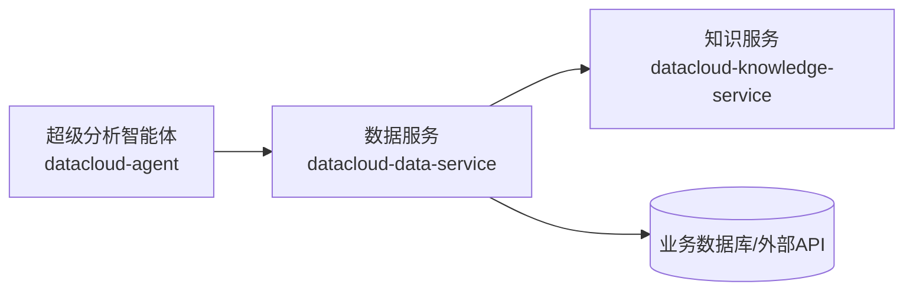
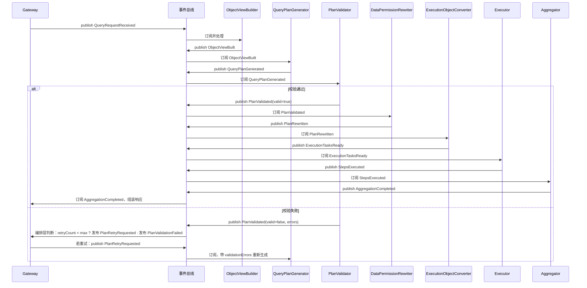
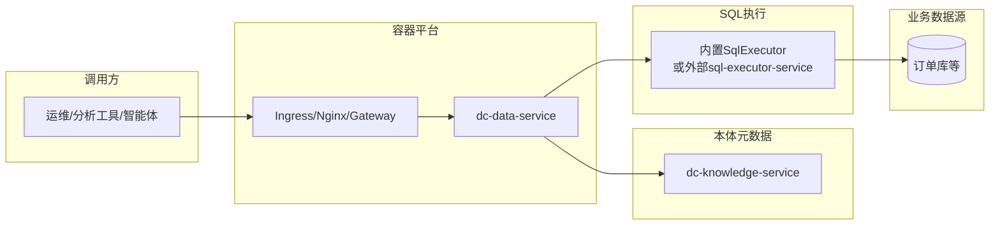
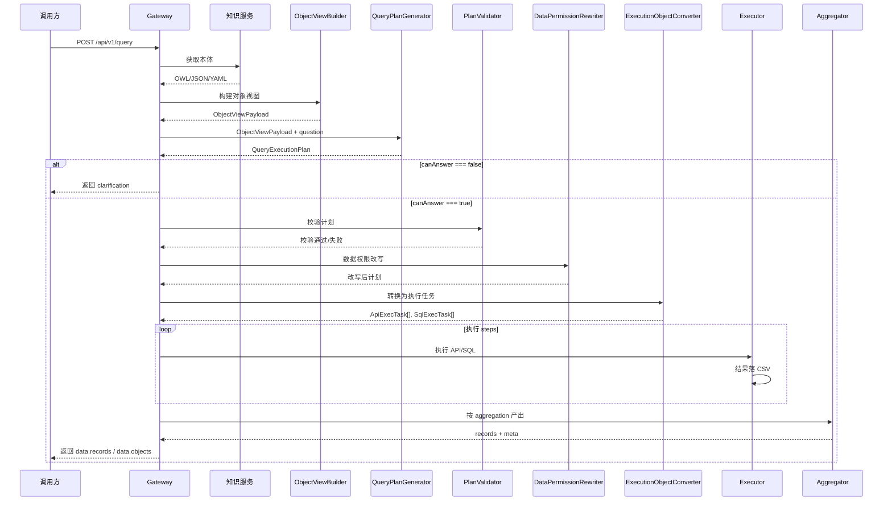
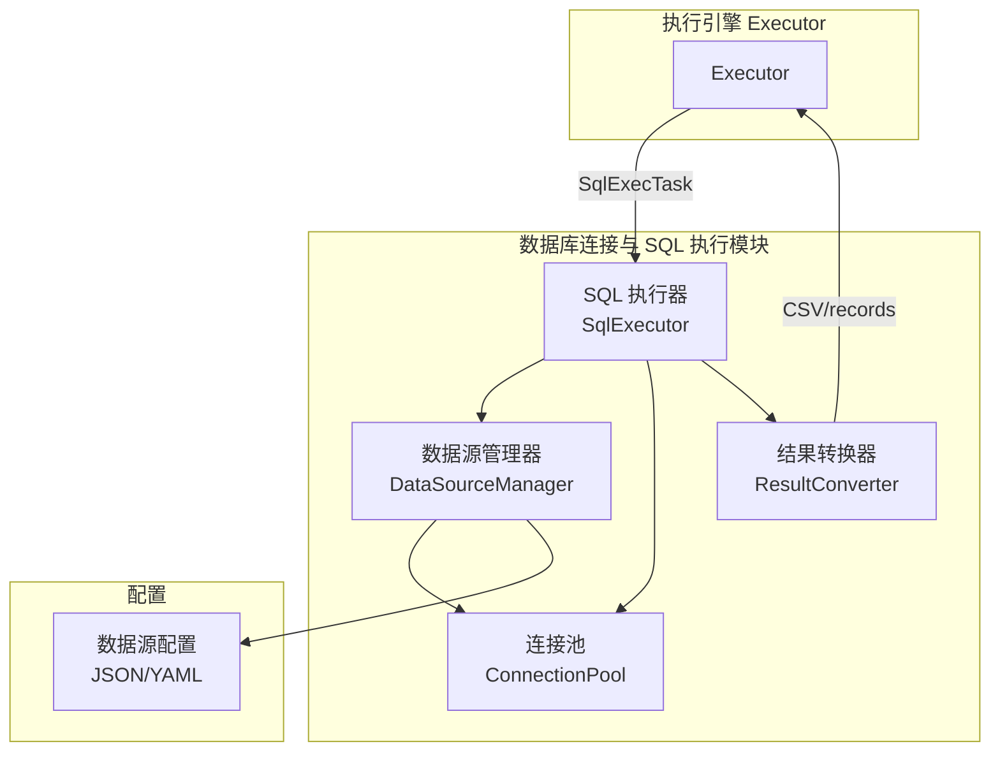
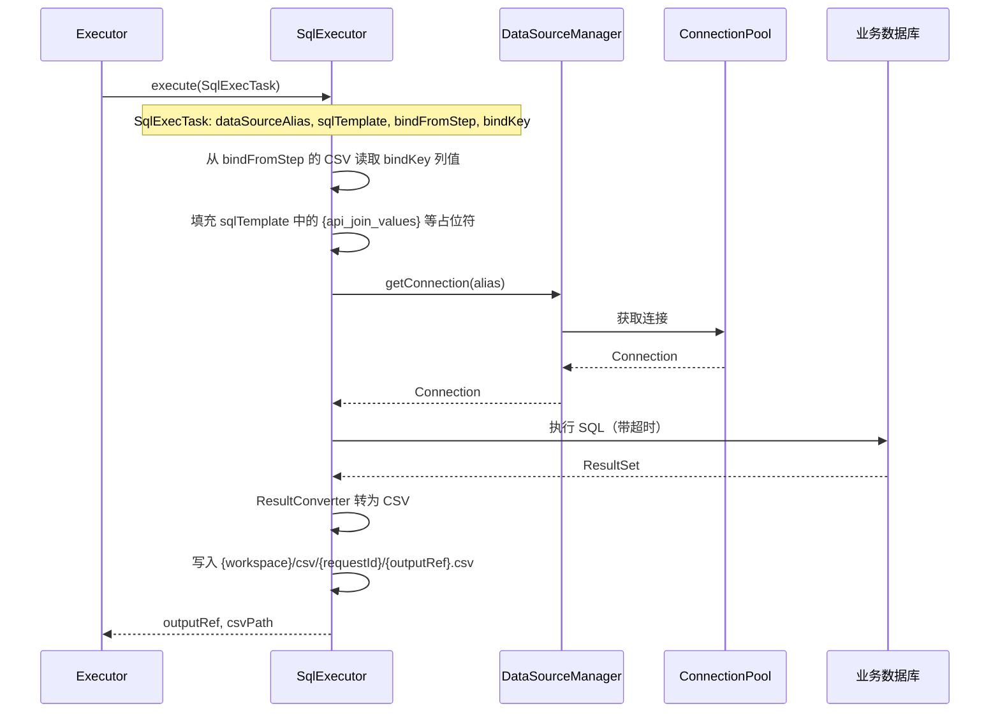
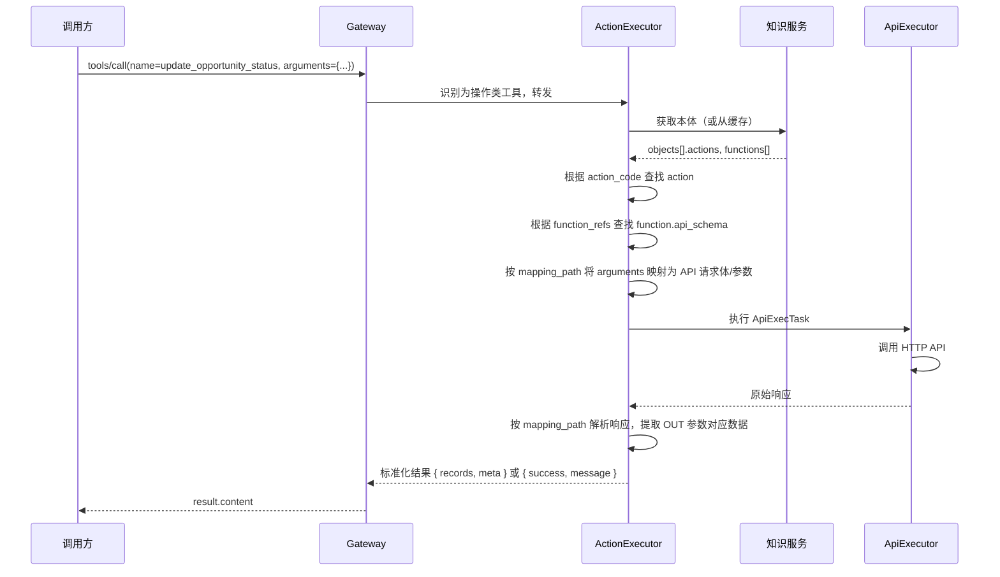
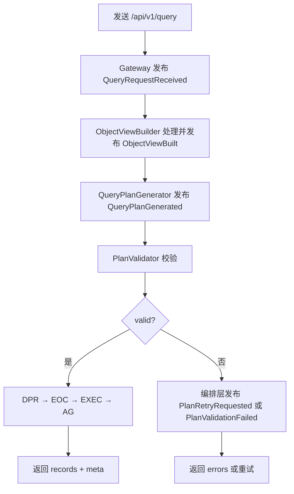

# dataCloud 2.0 详细设计：数据服务（dc-data-service）v2.0

> **版本说明**：本文档为数据服务详细设计 2.0 版本，以**事件驱动架构**为核心设计原则，在 v1.0 基础上完善目录结构、强化事件流设计、整合接口规范，并修复已知问题。

---

## 目录

- [1 文档定位与设计原则](#1-文档定位与设计原则)
- [2 事件驱动架构设计（核心）](#2-事件驱动架构设计核心)
- [3 功能架构设计](#3-功能架构设计)
- [4 技术架构设计](#4-技术架构设计)
- [5 部署架构设计](#5-部署架构设计)
- [6 数据建模设计](#6-数据建模设计)
- [7 数据库连接与 SQL 执行模块](#7-数据库连接与-sql-执行模块)
- [8 数据服务接口设计（MCP + REST）](#8-数据服务接口设计mcp--rest)
- [9 测试用例设计](#9-测试用例设计)
- [10 小结与实施建议](#10-小结与实施建议)

---

## 1 文档定位与设计原则

### 1.1 文档范围

本文档在《dataCloud2.0_详细设计_服务拆分与接口》和《本体服务_模块设计》的基础上，**只针对数据服务（datacloud-data-service）** 给出可落地的详细设计，重点覆盖：

| 维度 | 内容 |
|------|------|
| **功能架构** | 模块划分及主要 API / MCP 能力 |
| **技术架构** | 技术栈、中间件依赖与关键设计点 |
| **部署架构** | 服务实例、端口与依赖组件拓扑 |
| **数据建模** | 依赖的本体元数据（OWL/JSON/YAML）、业务数据源映射与数据源配置模型 |
| **测试用例** | 围绕数据服务的端到端场景推演（含 mermaid 流程） |

### 1.2 核心设计原则

- **事件驱动优先**：数据服务查询全链路基于**事件总线**驱动，各模块通过发布/订阅解耦，支持异步扩展与水平伸缩。
- **本体驱动**：从知识服务获取 OWL/JSON/YAML 本体元数据，作为配置驱动查询计划生成与执行。
- **SQL 执行双模式**：支持**内置数据库连接与 SQL 执行模块**（推荐）或**外部 SQL 执行服务**；内置模块负责连接池管理、SQL 执行、结果集转换，便于一体化部署。

### 1.3 数据服务在整体架构中的位置



- 智能体通过 **MCP** 或 **REST** 调用数据服务，执行统一数据查询或具体动作工具。
- 数据服务从 **知识服务** 获取 **本体元数据**（OWL/JSON/YAML 格式）作为配置驱动。
- 数据服务根据元数据与请求参数，访问一个或多个 **业务数据源**，执行 SQL / HTTP 调用并返回统一结构结果。

---

## 2 事件驱动架构设计（核心）

### 2.1 设计理念

数据服务查询链路**完全基于事件驱动**：Gateway 接收请求后发布 `QueryRequestReceived`，各模块订阅相应事件、处理完成后发布下一阶段事件，由后续模块消费。该设计带来：

- **解耦**：模块间无直接调用依赖，可独立演进与替换
- **可观测**：事件可持久化、审计、重放，便于排查与优化
- **可扩展**：支持多实例、异步执行、水平伸缩

### 2.2 事件总线与模块拓扑

```mermaid
flowchart TB
    subgraph EB[事件总线 Event Bus]
        direction TB
    end

    GW[Gateway] -->|1. QueryRequestReceived| EB
    EB -->|2. subscribe| OVB[对象视图构建器]
    OVB -->|3. ObjectViewBuilt| EB
    EB -->|4. subscribe| QPG[查询计划生成器]
    QPG -->|5. QueryPlanGenerated| EB
    EB -->|6. subscribe| PV[计划校验器]
    PV -->|7a. valid=true PlanValidated| EB
    PV -->|7b. valid=false PlanValidated| EB
    EB -->|8a. subscribe| DPR[数据权限改写器]
    EB -->|8b. subscribe| ORCH[编排层]
    ORCH -->|9a. 重试 PlanRetryRequested| EB
    ORCH -->|9b. 超限 PlanValidationFailed| EB
    EB -.->|9a. 反馈 validationErrors| QPG
    EB -.->|9b. 失败返回| GW
    DPR -->|10. PlanRewritten| EB
    EB -->|11. subscribe| EOC[执行对象转换器]
    EOC -->|12. ExecutionTasksReady| EB
    EB -->|13. subscribe| EXEC[执行引擎]
    EXEC -->|14. StepsExecuted| EB
    EB -->|15. subscribe| AG[聚合器]
    AG -->|16. AggregationCompleted| EB
    EB -->|17. 响应| GW
```



**计划校验失败处理**：编排层订阅 `PlanValidated(valid=false)`，若 `retryCount < max_plan_retries` 则发布 `PlanRetryRequested`（含 `validationErrors`），QPG 重试生成计划；超过次数则发布 `PlanValidationFailed` 返回 Gateway。

### 2.3 事件类型与流转

| 事件类型 | 发布者 | 订阅者 | 载荷（payload） |
|---------|--------|--------|----------------|
| `QueryRequestReceived` | Gateway | ObjectViewBuilder | requestId, question, viewIds, tenantId |
| `ObjectViewBuilt` | ObjectViewBuilder | QueryPlanGenerator | requestId, objectView, question |
| `QueryPlanGenerated` | QueryPlanGenerator | PlanValidator | requestId, plan, objectView |
| `PlanValidated` | PlanValidator | 编排层 / DataPermissionRewriter | requestId, valid, plan?, objectView, question, errors?, retryCount |
| `PlanRetryRequested` | 编排层 | QueryPlanGenerator | requestId, objectView, question, validationErrors, retryCount |
| `PlanRewritten` | DataPermissionRewriter | ExecutionObjectConverter | requestId, rewrittenPlan |
| `ExecutionTasksReady` | ExecutionObjectConverter | Executor | requestId, tasks |
| `StepsExecuted` | Executor | Aggregator | requestId, stepResults, aggregationConfig |
| `AggregationCompleted` | Aggregator | Gateway | requestId, records, columns, meta |
| `PlanValidationFailed` | 编排层 | Gateway | requestId, errors, lastPlan |

### 2.4 事件驱动时序图



### 2.5 事件总线实现选型

| 选型 | 适用场景 | 说明 |
|------|----------|------|
| **内存事件总线（同步）** | 单机、低延迟、简单部署 | 进程内发布/订阅，如 `python-dispatch`、自实现 `EventBus`；各 handler 顺序执行，无持久化 |
| **内存事件总线（异步）** | 单机、执行与响应解耦 | 使用 `asyncio.Queue` 或 `celery` 本地 worker，handler 异步消费 |
| **Redis Streams / Pub-Sub** | 多实例、需水平扩展 | 事件持久化，多消费者组；适合 Gateway 与 Worker 分离部署 |
| **Kafka / Pulsar** | 高吞吐、审计、重放 | 事件持久化、分区、消费者组；适合大规模、多租户 |

### 2.6 编排层重试逻辑（伪代码）

```python
def on_plan_validated(event: PlanValidated):
    if event.valid:
        pass  # DataPermissionRewriter 已订阅 PlanValidated(valid=true)
    else:
        if event.retry_count < config.max_plan_retries:
            bus.publish(PlanRetryRequested(
                request_id=event.request_id,
                object_view=event.object_view,
                question=event.question,
                validation_errors=event.errors,
                retry_count=event.retry_count + 1
            ))
        else:
            bus.publish(PlanValidationFailed(
                request_id=event.request_id,
                errors=event.errors,
                last_plan=event.plan
            ))
```

### 2.7 同步模式与事件驱动模式对比

| 维度 | 同步模式 | 事件驱动模式 |
|------|----------|--------------|
| **实现复杂度** | 低，直接顺序调用 | 中，需事件总线与编排 |
| **扩展性** | 单实例为主 | 多实例、水平伸缩 |
| **可观测性** | 依赖日志 | 事件可审计、重放 |
| **适用阶段** | MVP、快速验证 | 生产、多租户、高并发 |

**建议**：核心路径优先采用事件驱动；MVP 阶段可先用内存同步事件总线，后续按需切换 Redis/Kafka。

### 2.8 事件链路追踪与模块耗时监控

#### 2.8.1 设计目标

- **调用链路可视化**：按 requestId 还原完整事件流（QueryRequestReceived → ObjectViewBuilt → … → AggregationCompleted）
- **模块耗时统计**：记录各模块从「接收事件」到「发布下一事件」的耗时，定位性能瓶颈
- **输入输出记录**：记录各模块的输入（接收的事件载荷）与输出（发布的事件载荷），便于问题复现、审计与调试
- **可观测性**：支持日志聚合、APM、分布式追踪系统对接

#### 2.8.2 追踪上下文（Trace Context）

每次请求在 Gateway 入口生成**追踪上下文**，随事件在整条链路中透传：

| 字段 | 类型 | 说明 |
|------|------|------|
| **trace_id** | string | 全链路唯一标识，与 requestId 可复用或独立生成（如 UUID） |
| **request_id** | string | 请求 ID，用于业务日志与响应关联 |
| **span_id** | string | 当前 span 标识，每个模块处理时生成 |
| **parent_span_id** | string | 父 span，用于构建调用树 |
| **tenant_id** | string | 租户 ID |
| **started_at** | ISO8601 | 请求开始时间 |

事件载荷中**必须携带** `trace_id`、`request_id`；各模块在处理时生成并传递 `span_id`、`parent_span_id`。

#### 2.8.3 事件 Span 模型

每个「模块接收事件 → 处理 → 发布下一事件」构成一个 **Span**：

| 字段 | 说明 |
|------|------|
| span_id | 当前 span 唯一 ID |
| parent_span_id | 父 span（触发本模块的事件对应 span） |
| module | 模块名（ObjectViewBuilder、QueryPlanGenerator 等） |
| event_in | 接收的事件类型 |
| event_out | 发布的事件类型（若失败则为空） |
| started_at | 开始处理时间 |
| finished_at | 处理完成时间 |
| duration_ms | 耗时（毫秒） |
| status | ok / error |
| error_message | 失败时的错误信息（可选） |
| **input** | 模块输入（事件 payload 摘要或完整内容，见 2.8.3.1） |
| **output** | 模块输出（下一事件 payload 摘要或完整内容） |
| extra | 扩展字段（如 step_count、retry_count） |

##### 2.8.3.1 输入输出记录策略

| 记录级别 | 说明 | 适用场景 |
|----------|------|----------|
| **none** | 不记录 input/output | 生产环境、敏感数据、高吞吐 |
| **summary** | 仅记录关键字段摘要（如 question 前 50 字、viewIds、step_count、record_count） | 默认推荐，平衡可观测与存储 |
| **full** | 记录完整 payload（受 size_limit 与 sanitize 约束） | 调试、问题复现、开发环境 |

**摘要字段约定**（summary 级别）：

| 模块 | input 摘要 | output 摘要 |
|------|-------------|-------------|
| ObjectViewBuilder | question, viewIds | viewId, sourceCount, objectCount, relationCount |
| QueryPlanGenerator | question 前 100 字, viewId | canAnswer, stepCount, aggregationStrategy |
| PlanValidator | canAnswer, stepCount | valid, errorCount |
| DataPermissionRewriter | stepCount | stepCount（改写后） |
| ExecutionObjectConverter | stepCount | taskCount, taskTypes |
| Executor | taskTypes, taskCount | stepResults（outputRef → rowCount） |
| Aggregator | aggregationStrategy | recordCount, columnCount |

**安全与存储约束**：

| 约束 | 说明 |
|------|------|
| **size_limit** | 单条 input/output 最大字节数（如 64KB），超限则截断并标记 `truncated: true` |
| **sanitize** | 对 SQL、params、records 中的敏感字段脱敏（如 password、token 替换为 `***`） |
| **exclude_fields** | 可配置不记录字段（如 `trace_context`、`objectView.objects[].source_config`） |

#### 2.8.4 追踪实现方式

**方式一：事件总线中间件（推荐）**

事件总线在派发事件前后自动记录 span，对业务代码无侵入：

```python
# 伪代码：事件总线中间件（含 input/output 记录）
async def dispatch_with_tracing(event_type: str, payload: dict):
    trace_ctx = payload.get("trace_context", {})
    span_id = generate_span_id()
    started_at = now()
    input_snapshot = extract_io_snapshot(payload, level="input")  # 按配置提取 input

    # 调用实际 handler
    try:
        result = await handlers[event_type](payload)
        output_snapshot = extract_io_snapshot(result.payload, level="output")
        record_span(
            span_id=span_id,
            parent_span_id=trace_ctx.get("span_id"),
            module=handlers[event_type].__module_name__,
            event_in=event_type,
            event_out=result.next_event_type,
            started_at=started_at,
            finished_at=now(),
            duration_ms=(now() - started_at).total_seconds() * 1000,
            status="ok",
            input=input_snapshot,
            output=output_snapshot,
        )
        result.payload["trace_context"]["parent_span_id"] = trace_ctx.get("span_id")
        result.payload["trace_context"]["span_id"] = span_id
        return result
    except Exception as e:
        record_span(..., status="error", error_message=str(e), input=input_snapshot)
        raise
```

**方式二：OpenTelemetry 集成**

采用 OpenTelemetry 标准，与 Jaeger、Zipkin、Prometheus 等生态对接：

| 概念 | 映射 |
|------|------|
| Trace | 一次完整查询请求（trace_id） |
| Span | 每个模块的一次处理（ObjectViewBuilder、QueryPlanGenerator 等） |
| Span Attributes | module、event_in、event_out、tenant_id |

```python
# 使用 OpenTelemetry 的伪代码
from opentelemetry import trace

tracer = trace.get_tracer("datacloud-data-service", "1.0")

async def on_object_view_built(event: ObjectViewBuilt):
    with tracer.start_as_current_span(
        "ObjectViewBuilder",
        parent=event.trace_context.span_context,
    ) as span:
        span.set_attribute("event_in", "ObjectViewBuilt")
        # ... 处理逻辑 ...
        span.set_attribute("event_out", "QueryPlanGenerated")
```

#### 2.8.5 耗时记录与上报

| 阶段 | 记录内容 |
|------|----------|
| **发布事件时** | 在 payload 中注入 `trace_context.started_at`（若尚未设置） |
| **模块处理完成时** | 计算 `duration_ms = (now - started_at) * 1000`，写入 span |
| **上报** | 写入结构化日志（JSON）、或推送到 OpenTelemetry Collector、或写入本地 trace 存储 |

**结构化日志示例**（含 input/output 摘要）：

```json
{
  "timestamp": "2025-03-02T10:00:01.123Z",
  "level": "INFO",
  "trace_id": "tr_abc123",
  "request_id": "req_xyz789",
  "span_id": "sp_001",
  "parent_span_id": "sp_000",
  "module": "QueryPlanGenerator",
  "event_in": "ObjectViewBuilt",
  "event_out": "QueryPlanGenerated",
  "duration_ms": 1250,
  "status": "ok",
  "tenant_id": "tenant_001",
  "input": {
    "question": "查询邹海天签了合同的商机有哪些",
    "viewId": "emp_opp_contract_view",
    "sourceCount": 2,
    "objectCount": 3
  },
  "output": {
    "canAnswer": true,
    "stepCount": 2,
    "aggregationStrategy": "SQLITE_MEM"
  }
}
```

#### 2.8.6 链路还原与耗时汇总

一次完整查询的**典型链路**与**耗时占比**示意：

```mermaid
gantt
    title 查询请求事件链路耗时分布
    dateFormat X
    axisFormat %L ms

    section ObjectViewBuilder
    ObjectViewBuilder : 0, 80

    section QueryPlanGenerator
    QueryPlanGenerator : 80, 1330

    section PlanValidator
    PlanValidator : 1330, 1350

    section DataPermissionRewriter
    DataPermissionRewriter : 1350, 1380

    section ExecutionObjectConverter
    ExecutionObjectConverter : 1380, 1390

    section Executor
    Executor : 1390, 2500

    section Aggregator
    Aggregator : 2500, 2550
```



**按 trace_id 聚合后的耗时汇总**：

| 模块 | 耗时 (ms) | 占比 |
|------|-----------|------|
| ObjectViewBuilder | 80 | 3.1% |
| QueryPlanGenerator | 1250 | 49.0% |
| PlanValidator | 20 | 0.8% |
| DataPermissionRewriter | 30 | 1.2% |
| ExecutionObjectConverter | 10 | 0.4% |
| Executor | 1110 | 43.5% |
| Aggregator | 50 | 2.0% |
| **合计** | **2550** | 100% |

便于快速定位：QueryPlanGenerator（LLM 调用）与 Executor（SQL/API 执行）为主要耗时环节。

#### 2.8.7 配置与开关

```yaml
# config
tracing:
  enabled: true
  mode: "log"           # log | otlp | both
  sample_rate: 1.0      # 采样率，1.0 表示全量
  log_level: "INFO"     # 追踪日志级别

  # 输入输出记录
  io_recording:
    level: "summary"    # none | summary | full
    size_limit: 65536   # 单条 input/output 最大字节数（full 时生效）
    sanitize: true     # 是否对敏感字段脱敏
    exclude_fields:    # 不记录的字段路径
      - "trace_context"
      - "objectView.objects[*].source_config"

  # OpenTelemetry（mode 含 otlp 时生效）
  otlp:
    endpoint: "http://otel-collector:4317"
    service_name: "datacloud-data-service"
```

#### 2.8.8 事件链路追踪数据模型

```python
# 追踪记录（可落库或仅日志）
@dataclass
class EventSpan:
    trace_id: str
    request_id: str
    span_id: str
    parent_span_id: Optional[str]
    module: str
    event_in: str
    event_out: Optional[str]
    started_at: datetime
    finished_at: datetime
    duration_ms: float
    status: str  # ok | error
    error_message: Optional[str] = None
    tenant_id: Optional[str] = None
    input: Optional[dict] = None   # 模块输入摘要或完整 payload
    output: Optional[dict] = None   # 模块输出摘要或完整 payload
    extra: Optional[dict] = None
```

#### 2.8.9 与事件总线的集成点

| 集成点 | 说明 |
|--------|------|
| **发布前** | 若 payload 无 trace_context，Gateway 生成 trace_id、request_id、started_at |
| **派发前** | 事件总线记录 event_in、started_at，按 io_recording.level 提取 **input** 快照 |
| **派发后** | handler 返回时记录 event_out、finished_at、duration_ms，提取 **output** 快照，完成 span |
| **异常时** | 捕获异常，记录 status=error、error_message、input（若有），仍完成 span |

---

## 3 功能架构设计

### 3.1 内部模块划分

| 模块 | 职责 | 订阅事件 | 发布事件 |
|------|------|----------|----------|
| **Gateway** | 接收 HTTP/MCP 请求，鉴权、租户解析、审计 | - | QueryRequestReceived |
| **ObjectViewBuilder** | 从本体解析生成 ObjectViewPayload | QueryRequestReceived | ObjectViewBuilt |
| **QueryPlanGenerator** | 调用 LLM 生成 QueryExecutionPlan | ObjectViewBuilt, PlanRetryRequested | QueryPlanGenerated |
| **PlanValidator** | 校验计划步骤与引用完整性 | QueryPlanGenerated | PlanValidated |
| **DataPermissionRewriter** | 注入租户/权限条件到 SQL 与 API | PlanValidated(valid=true) | PlanRewritten |
| **ExecutionObjectConverter** | 转为 ApiExecTask、SqlExecTask、AggregationTask | PlanRewritten | ExecutionTasksReady |
| **Executor** | 执行 API/SQL，结果落 CSV | ExecutionTasksReady | StepsExecuted |
| **SqlExecutor** | 数据库连接与 SQL 执行（连接池、执行、结果转换） | Executor 调用 | - |
| **Aggregator** | 按 aggregation 产出 records | StepsExecuted | AggregationCompleted |
| **编排层** | 判断重试、失败返回 | PlanValidated | PlanRetryRequested, PlanValidationFailed |
| **ActionToolGenerator** | 从 actions 生成 MCP 工具定义（inputSchema） | tools/list 时调用 | - |
| **ActionExecutor** | 操作类工具执行：action → ApiExecTask → 直接调用 API 返回 | tools/call 时调用 | - |

### 3.2 模块职责详解

- **计算网关模块（Gateway）**
  - 统一接收 HTTP（REST）与 MCP（JSON-RPC 2.0 over HTTP）请求。
  - 鉴权（Token 校验）、租户解析（`X-Tenant-Id`）、会话与用户解析（`X-Session-Id`、`X-User-Id`）、系统标识（`X-System-Code`）、请求日志与审计。
  - 将请求标准化为内部 `QueryRequest`，发布 `QueryRequestReceived`。

- **对象视图构建器（ObjectViewBuilder）**
  - 从 OWL/JSON/YAML 本体解析并生成 **ObjectViewPayload**（sources、objects、relations）。
  - 输入：本体文件、视图 ID。输出：ObjectViewPayload。

- **查询计划生成器（QueryPlanGenerator）**
  - 调用大模型，将 ObjectViewPayload + 自然语言问题转换为 **QueryExecutionPlan**。

- **计划校验器（PlanValidator）**
  - 对 QueryExecutionPlan 做步骤分类校验与引用完整性校验。
  - 输出：valid、errors、suggestions；校验失败时可反馈给 QueryPlanGenerator 重试。

- **数据权限改写器（DataPermissionRewriter）**
  - 根据租户、用户角色、权限策略改写 SQL 与 API 参数。

- **执行对象转换器（ExecutionObjectConverter）**
  - 将 steps 与 aggregation 转换为 ApiExecTask、SqlExecTask、AggregationTask。

- **执行引擎（Executor）**
  - 按 steps 执行 API 与 SQL；SQL 步骤通过 **SqlExecutor 模块**（内置）或外部 SQL 执行服务执行；结果均落 CSV。

- **数据库连接与 SQL 执行模块（SqlExecutor）**
  - 管理数据源连接池、解析 JDBC URL、执行 SQL、将结果集转换为 CSV/records；支持 MySQL、PostgreSQL、ClickHouse 等。

- **聚合器（Aggregator）**
  - 按 aggregation 配置：DIRECT 从 CSV 读取；SQLITE 将 CSV 导入 SQLite 内存库后执行 federatedSql。

- **ActionToolGenerator（操作类工具生成器）**
  - 从 OWL/JSON/YAML 本体的 `objects[].actions` 解析动作，生成 MCP 工具定义（name、description、inputSchema）。
  - 工具名 = action_code；inputSchema 由 action.params 中 direction=IN 的参数转换而来。

- **ActionExecutor（操作类工具执行器）**
  - 收到 tools/call 且工具名为操作类时，根据 action 的 function_refs 与 params 的 mapping_path，**直接构造 ApiExecTask**，调用 ApiExecutor 执行并返回结果；**不经过** ObjectViewBuilder、QueryPlanGenerator、PlanValidator 等查询流水线。

### 3.3 对外能力与接口清单

#### 3.3.1 MCP 能力

- **`tools/list`**：根据 Header 中对象/视图 ID，列出可用工具，包括：
  - **统一数据查询工具** `unified_data_query`：自然语言驱动的数据查询
  - **操作类工具**：由 OWL/JSON/YAML 中对象的 **actions** 生成，如 `query_opportunity_by_emp`、`update_opportunity_status` 等
- **`tools/call`**：执行指定工具；操作类工具**直接生成 API 执行任务**并返回结果，不经过 LLM 与查询计划流水线。

#### 3.3.2 REST 能力

- **`POST /api/v1/query`**：统一数据查询，支持 SSE 流式返回。
- **`GET /api/v1/skills/package`**：生成 skill 压缩包。
- **`POST /api/v1/query/federated`**：多数据源联邦查询。

---

## 4 技术架构设计

### 4.1 技术栈

| 组件 | 技术选型 | 说明 |
|------|----------|------|
| Web 框架 | FastAPI + Uvicorn | 高性能异步 HTTP 服务 |
| 数据访问 | SQLAlchemy / asyncpg / PyMySQL | 通过统一抽象适配多种数据库 |
| 结果计算 | Pandas / DuckDB / Dask | 联邦查询结果合并与聚合 |
| 配置管理 | Pydantic + 外部配置中心 | 数据源配置与运行参数 |
| 序列化 | JSON + 可选 orjson | 大结果集序列化优化 |

### 4.2 与外部组件交互

- **知识服务**：REST 获取本体元数据（OWL/JSON/YAML），支持缓存。
- **SQL 执行**：支持两种模式——**内置 SqlExecutor 模块**（数据服务内建连接池与执行能力）或**外部 SQL 执行服务**（集中管理连接、审计）；可通过配置切换。
- **消息队列（可选）**：接收元数据变更通知，触发缓存刷新。

### 4.3 核心运行时数据与缓存

- **ObjectViewPayload 缓存**：Key 为 viewId，Value 为 ObjectViewPayload。
- **计划执行上下文**：requestId、tenantId、QueryExecutionPlan、各 steps 的 CSV 路径等。
- **统计与审计数据**：记录视图选用、API/SQL 调用、耗时与行数。
- **事件追踪数据**：按 trace_id 聚合的 EventSpan 列表，用于链路还原与模块耗时分析；可写入结构化日志或 OpenTelemetry。

---

## 5 部署架构设计

| 项目 | 说明 |
|------|------|
| 服务名称 | `datacloud-data-service` |
| 默认端口 | 8082 |
| 上下文路径 | REST `/api/v1/*`，MCP `/api/v1/mcp` |
| 依赖组件 | 知识服务、数据源配置、配置中心、日志/监控；可选：外部 SQL 执行服务 |



---

## 6 数据建模设计

### 6.1 本体文件来源与数据流

数据服务通过知识服务获取本体定义（OWL/JSON/YAML），解析后构建 ObjectViewPayload，由大模型生成 QueryExecutionPlan，经校验、权限改写后执行；中间结果落 CSV，最终通过 SQLite 内存库联邦聚合产出 records。

### 6.2 对象视图数据（ObjectViewPayload）示例

```json
{
  "viewId": "emp_opp_contract_view",
  "sources": [
    { "sourceId": "SRC_EMP_API", "type": "API" },
    { "sourceId": "SRC_CRM_DB", "type": "DB", "dataSourceAlias": "crm_db", "datasourceId": "mysql" }
  ],
  "objects": [
    {
      "objectId": "OBJ_EMP_API",
      "sourceId": "SRC_EMP_API",
      "fields": [
        { "name": "emp_id", "type": "string" },
        { "name": "emp_name", "type": "string", "aliases": ["员工名称", "负责人"] }
      ],
      "functions": [
        { "functionId": "ACT_GET_EMP_BY_NAME", "params": ["emp_name"], "returns": ["emp_id", "emp_name"] }
      ]
    }
  ],
  "relations": [
    {
      "fromObject": "OBJ_OPP_DB",
      "toObject": "OBJ_CONT_DB",
      "cardinality": "ONE_TO_MANY",
      "joinKeys": [
        { "fromField": "opp_id", "toField": "opp_id" },
        { "fromField": "emp_id", "toField": "emp_id" }
      ]
    }
  ]
}
```

> **修复说明**：原文档中 `datasourceId:"mysql"` 缺少引号，已修正为 `"datasourceId": "mysql"`。

### 6.3 QueryExecutionPlan 结构约定

| 字段 | 必填 | 说明 |
|------|------|------|
| **canAnswer** | 是 | `true` 可执行；`false` 需 clarification，不执行 |
| **clarification** | canAnswer=false 时 | reason、askUser、availableScope |
| **aggregation** | canAnswer=true 时 | 单个对象或对象数组，定义最终输出 |
| **steps** | 是 | 前置步骤（API/SQL），可为空 |

### 6.4 完整执行流程（事件驱动 + 时序）



### 6.5 QueryExecutionPlan 完整示例

#### 示例一：单步即结果（DIRECT）

```json
{
  "question": "查询所有商机列表",
  "canAnswer": true,
  "steps": [
    {
      "stepId": "step_1_sql",
      "type": "SQL",
      "sourceId": "SRC_CRM_DB",
      "dataSourceAlias": "crm_db",
      "sqlTemplate": "SELECT opp_id, emp_id, opp_name FROM t_opportunity",
      "outputRef": "opp_list"
    }
  ],
  "aggregation": {
    "strategy": "DIRECT",
    "finalStepId": "step_1_sql",
    "columns": [
      { "name": "opp_id", "label": "商机ID", "type": "string" },
      { "name": "emp_id", "label": "员工ID", "type": "string" },
      { "name": "opp_name", "label": "商机名称", "type": "string" }
    ]
  }
}
```

#### 示例二：多步 + SQLite 联邦聚合

```json
{
  "question": "邹海天签了合同的商机有哪些",
  "canAnswer": true,
  "steps": [
    {
      "stepId": "step_1_api",
      "type": "API",
      "sourceId": "SRC_EMP_API",
      "functionId": "ACT_GET_EMP_BY_NAME",
      "params": { "emp_name": "邹海天" },
      "outputRef": "api_emp",
      "outputFormat": "CSV"
    },
    {
      "stepId": "step_2_sql",
      "type": "SQL",
      "sourceId": "SRC_CRM_DB",
      "dataSourceAlias": "crm_db",
      "sqlTemplate": "SELECT o.emp_id, o.opp_id, o.opp_name, c.contract_id FROM t_opportunity o INNER JOIN t_contract c ON o.emp_id = c.emp_id AND o.opp_id = c.opp_id WHERE o.emp_id IN ({api_join_values}) AND c.sign_status = 'SIGNED'",
      "bindFromStep": "step_1_api",
      "bindKey": "emp_id",
      "outputRef": "db_opp_contract",
      "outputFormat": "CSV"
    }
  ],
  "aggregation": {
    "strategy": "SQLITE_MEM",
    "federatedSql": "SELECT e.emp_name, d.opp_id, d.opp_name, d.contract_id FROM api_emp e JOIN db_opp_contract d ON e.emp_id = d.emp_id",
    "columns": [
      { "name": "emp_name", "label": "员工姓名", "type": "string" },
      { "name": "opp_id", "label": "商机ID", "type": "string" },
      { "name": "opp_name", "label": "商机名称", "type": "string" },
      { "name": "contract_id", "label": "合同ID", "type": "string" }
    ]
  }
}
```

#### 示例三：不可回答时的 clarification

```json
{
  "question": "按合同签署日期统计每个月的签约金额",
  "canAnswer": false,
  "clarification": "内容需整合以下三类信息且表述完整：
    1. 无法回答的原因（明确说明缺少哪个字段/表/能力）；
    2. 向用户澄清需要补充的信息；
    3. 当前视图可查询的内容范围；"
}
```

### 6.6 LLM Prompt 模板摘要

调用大模型生成 QueryExecutionPlan 时，将 `{{objectView}}`、`{{question}}` 替换为实际值；重试时追加 `{{validationErrors}}`：

```
你是一个严格遵循元数据的数据查询计划生成器，**绝对禁止编造对象视图中不存在的表、字段、函数、条件**。所有SQL、条件、列必须100%来源于给定的 objectView，不允许脑补、推测、新增任何元数据中没有的内容。

根据「对象视图」和「用户问题」，生成一份结构化的查询执行计划（QueryExecutionPlan）。

## 输入
1. **对象视图（objectView）**：描述当前可用的数据源与对象能力，包括 sources（API/DB）、objects（字段与函数/表）、relations（对象间关联与 joinKeys）。
2. **用户问题（question）**：用户的自然语言查询。

## 输出要求
请**仅输出一份合法的 JSON**，即 QueryExecutionPlan，不要包含其他解释或 markdown 代码块标记。结构约定如下：

- **canAnswer**（必填）：
  - 只有**所有查询条件、过滤字段、返回列都能在对象视图中找到**时，才为 true；
  - 只要缺少必要表、字段、API，或需要使用视图中**不存在的字段/条件**才能回答，一律为 false。

- 当 canAnswer 为 false 时：
  - 必须输出 **clarification** 字段（字符串类型，必填），内容需整合以下三类信息且表述完整：
    1. 无法回答的原因（明确说明缺少哪个字段/表/能力）；
    2. 向用户澄清需要补充的信息；
    3. 当前视图可查询的内容范围；
  - 禁止输出 steps、aggregation 字段，禁止输出除 canAnswer、clarification 外的任何多余字段。

- 当 canAnswer 为 true 时：
  - **steps**（必填）：查询步骤数组，不能为空。
    - 单DB表查询：生成 1 条 type:"SQL" 步骤，**只使用视图中已声明的表和字段**。
    - 同数据源多表关联查询（如同一DB下的多张表JOIN）：仅生成 1 条 type:"SQL" 步骤，直接在SQL中完成多表关联，**禁止拆分为多条SQL步骤**。
    - 跨数据源查询（API+DB/不同DB）：仅为每个数据源生成数据导出步骤（API步骤/DB查询步骤），标记csvTableName（CSV表名），**禁止生成额外的SQLITE_MEM类型步骤**。
  - **aggregation**（必填）：最终结果聚合规则。
    - 单个对象结构：
      - strategy：
        - "DIRECT"：结果直接来自某条SQL（包括同数据源多表关联的SQL），无跨数据源计算。
        - "SQLITE_MEM"：跨数据源/API+DB 关联，基于各数据源导出步骤的CSV结果，在SQLite内存数据库中执行关联查询。
      - "DIRECT" 必须包含 finalStepId（指向唯一的SQL步骤ID）。
      - "SQLITE_MEM" 仅需包含 sqliteSql（基于steps中各CSV表名的SQLite关联查询语句），**禁止输出csvTables字段**。
      - columns：数组，每一项 {name, label, type}，**列必须来自视图已有字段**。
  - 禁止输出 clarification 字段，禁止输出除 canAnswer、steps、aggregation 外的任何多余字段。

## 铁律约束（必须严格遵守）
1. **严禁编造**：
   - 不允许使用对象视图中**不存在的表名、字段名、函数**。
   - 不允许凭空增加时间字段、状态字段、过滤条件。
2. 单表/同数据源多表查询：
   - steps 仅输出 1 条SQL，**只查声明过的字段**，多表关联直接在该SQL中通过JOIN实现。
   - aggregation 使用 strategy=DIRECT，指向该唯一的SQL步骤。
3. 跨数据源/多数据源关联：
   - 必须使用 strategy=SQLITE_MEM，禁止使用TRINO相关表述。
   - steps 仅包含各数据源的导出步骤，无额外关联步骤，关联逻辑仅体现在aggregation的sqliteSql中。
   - aggregation 中禁止输出csvTables字段，仅保留sqliteSql。
4. 禁止空步骤 steps=[] 且 finalStepId=null。
5. 禁止将同数据源的多表关联查询拆分为多条SQL步骤。
6. 输出的JSON中仅包含约定的字段，禁止出现任何未约定的多余字段（如多余的嵌套对象、额外的说明字段等）。

## 当前时间：
2026-03-01 00:00:00

## 输入内容

**对象视图：**
{
  "viewId": "emp_opp_contract_view",
  "sources": [
    { "sourceId": "SRC_EMP_API", "type": "API" },
    { "sourceId": "SRC_CRM_DB", "type": "DB", "dataSourceAlias": "crm_db" }
  ],
  "objects": [
    {
      "objectId": "OBJ_EMP_API",
      "sourceId": "SRC_EMP_API",
      "fields": [
        { "name": "emp_id", "type": "string" },
        { "name": "emp_name", "type": "string", "aliases": ["员工名称", "负责人"] }
      ],
      "functions": [
        { "functionId": "ACT_GET_EMP_BY_NAME", "params": ["emp_name"], "returns": ["emp_id", "emp_name"] }
      ]
    },
    {
      "objectId": "OBJ_OPP_DB",
      "sourceId": "SRC_CRM_DB",
      "table": "t_opportunity",
      "fields": [
        { "name": "opp_id", "type": "string" },
        { "name": "emp_id", "type": "string" },
        { "name": "opp_name", "type": "string", "aliases": ["商机标题", "项目名称"] }
      ]
    },
    {
      "objectId": "OBJ_CONT_DB",
      "sourceId": "SRC_CRM_DB",
      "table": "t_contract",
      "fields": [
        { "name": "contract_id", "type": "string" },
        { "name": "opp_id", "type": "string" },
        { "name": "emp_id", "type": "string" },
        { "name": "sign_status", "type": "string", "aliases": ["签署状态", "签了合同"] }
      ]
    }
  ],
  "relations": [
    {
      "fromObject": "OBJ_OPP_DB",
      "toObject": "OBJ_CONT_DB",
      "cardinality": "ONE_TO_MANY",
      "joinKeys": [
        { "fromField": "opp_id", "toField": "opp_id" },
        { "fromField": "emp_id", "toField": "emp_id" }
      ]
    }
  ]
}

**用户问题：**
查询签了合同的商机

请直接输出 QueryExecutionPlan 的 JSON，不要输出其他内容。
```

### 6.7 校验失败重试配置

```yaml
plan_v2:
  max_plan_retries: 2
  retry_prompt_template: |
    上次生成的计划校验失败，原因如下：
    {{validationErrors}}
    请根据上述错误修正计划并重新输出完整的 QueryExecutionPlan JSON。
```

### 6.8 API 同义不同名映射

当 API 入参/出参名与逻辑名不一致时，通过本体 `mapping_path` 或 ObjectView 的 `requestParamMap`/`responseFieldMap` 做映射，保证 QueryExecutionPlan 与聚合层始终使用逻辑名，物理名仅在 Executor 构造请求与解析响应时使用。

### 6.9 代码目录结构（完整）

```
datacloud-data-service/
├── src/
│   └── datacloud_data_service/
│       ├── __init__.py
│       ├── config.py                      # 配置加载
│       │
│       ├── api/                           # REST/MCP 入口
│       │   ├── __init__.py
│       │   ├── routes.py                  # REST 路由注册
│       │   ├── query.py                   # POST /api/v1/query
│       │   ├── federated.py               # POST /api/v1/query/federated
│       │   ├── skills.py                  # GET /api/v1/skills/package
│       │   └── mcp_handler.py             # MCP tools/list、tools/call 入口
│       │
│       ├── tools/                         # MCP 工具（统一查询 + 操作类）
│       │   ├── __init__.py
│       │   ├── registry.py                # 工具注册，tools/list 返回
│       │   ├── unified_query.py           # unified_data_query 工具
│       │   ├── action_tool_generator.py  # 从 actions 生成工具定义与 inputSchema
│       │   ├── action_executor.py         # 操作类工具执行
│       │   ├── input_schema_builder.py   # params → inputSchema 转换
│       │   └── param_mapper.py            # arguments → API 请求映射
│       │
│       ├── plan/                          # 查询计划（统一查询流水线）
│       │   ├── __init__.py
│       │   ├── models.py                  # QueryExecutionPlan、ObjectViewPayload 等
│       │   ├── object_view_builder.py
│       │   ├── query_plan_generator.py
│       │   ├── plan_validator.py
│       │   ├── data_permission_rewriter.py
│       │   └── execution_object_converter.py
│       │
│       ├── executor/                      # 执行层
│       │   ├── __init__.py
│       │   ├── executor.py                # 主执行入口，调度 API/SQL
│       │   ├── api_executor.py            # API 调用（查询 steps + 操作类工具）
│       │   └── sql_executor_adapter.py    # 调用 sql_executor 或外部服务
│       │
│       ├── sql_executor/                  # 数据库连接与 SQL 执行
│       │   ├── __init__.py
│       │   ├── models.py                  # SqlExecTask、DataSourceConfig
│       │   ├── data_source_manager.py
│       │   ├── connection_pool.py
│       │   ├── sql_executor.py
│       │   ├── result_converter.py
│       │   └── jdbc_parser.py
│       │
│       ├── aggregator/                    # 聚合层
│       │   ├── __init__.py
│       │   ├── direct_aggregator.py
│       │   └── sqlite_aggregator.py
│       │
│       ├── ontology/                      # 本体解析
│       │   ├── __init__.py
│       │   ├── parser.py                  # OWL/JSON/YAML 解析
│       │   └── knowledge_service_client.py
│       │
│       ├── events/                        # 事件驱动
│       │   ├── __init__.py
│       │   ├── bus.py
│       │   ├── events.py
│       │   ├── handlers.py
│       │   └── tracing.py
│       │
│       └── csv_storage/                   # CSV 暂存
│           ├── __init__.py
│           └── manager.py                 # CSV 路径管理与读写
│
├── tests/
│   ├── plan/
│   ├── executor/
│   ├── tools/
│   └── ...
│
├── pyproject.toml
└── README.md
```

---

## 7 数据库连接与 SQL 执行模块

### 7.1 模块定位与职责

**SqlExecutor** 是数据服务内部负责**数据库连接管理**与 **SQL 执行**的核心模块，为 Executor 提供统一的 SQL 执行能力。该模块支持：

- 数据源配置加载与连接池管理
- JDBC URL 解析与多数据库驱动适配
- SQL 执行（含占位符填充、超时控制）
- 结果集转换为 CSV / records 格式

### 7.2 架构与调用关系



- **Executor** 收到 `ExecutionTasksReady` 后，对 type=SQL 的步骤调用 **SqlExecutor**。
- **SqlExecutor** 通过 **DataSourceManager** 获取连接，执行 SQL，经 **ResultConverter** 转为 CSV 落盘。

### 7.3 子模块职责

| 子模块 | 职责 | 说明 |
|--------|------|------|
| **DataSourceManager** | 数据源配置管理、连接池生命周期 | 加载配置中心/本地配置，按 dataSourceAlias 查找连接池；支持多租户隔离 |
| **ConnectionPool** | 连接池创建与维护 | 基于 SQLAlchemy 或 asyncpg/PyMySQL 创建连接池；支持 maxPoolSize、minPoolSize、connectionTimeout |
| **SqlExecutor** | SQL 执行入口 | 接收 `SqlExecTask`（dataSourceAlias、sqlTemplate、bindFromStep、bindKey），填充占位符后执行；执行超时、慢查询日志 |
| **ResultConverter** | 结果集转换 | 将 ResultSet 转为 CSV 或 records 列表；支持流式输出大结果集 |

### 7.4 数据源配置模型

```json
{
  "alias": "crm_db",
  "type": "MYSQL",
  "config": {
    "jdbcUrl": "jdbc:mysql://mysql.example.com:3306/crm_db?useUnicode=true&characterEncoding=utf8mb4",
    "user": "readonly",
    "password": "***",
    "connectionPool": {
      "maxPoolSize": 10,
      "minPoolSize": 1,
      "connectionTimeout": 3000,
      "idleTimeout": 600
    }
  }
}
```

| 字段 | 必填 | 说明 |
|------|------|------|
| alias | 是 | 数据源别名，与 QueryExecutionPlan.steps[].dataSourceAlias 对应 |
| type | 是 | MYSQL / POSTGRESQL / CLICKHOUSE / DORIS 等 |
| config.jdbcUrl | 是 | 完整 JDBC 连接 URL |
| config.user | 条件 | 用户名；若 jdbcUrl 中已含则可不传 |
| config.password | 条件 | 密码；可与 credentialId 二选一 |
| config.connectionPool | 否 | 连接池参数 |

### 7.5 JDBC URL 解析与驱动映射

| type | 驱动 | Python 库 | 连接 URL 格式 |
|------|------|------------|---------------|
| MYSQL | MySQL Connector | PyMySQL / mysqlclient | `mysql+pymysql://...` |
| POSTGRESQL | PostgreSQL | asyncpg / psycopg2 | `postgresql+asyncpg://...` |
| CLICKHOUSE | ClickHouse | clickhouse-driver | `clickhouse://...` |
| DORIS | MySQL 兼容 | PyMySQL | `mysql+pymysql://...` |

SqlExecutor 内部将 `jdbc:mysql://...` 解析为 SQLAlchemy 可用的 `mysql+pymysql://...` 等形式。

### 7.6 SQL 执行流程



### 7.7 执行参数与安全控制

| 参数 | 说明 | 默认值 |
|------|------|--------|
| timeout | SQL 执行超时（秒） | 30 |
| maxRows | 单次查询最大返回行数 | 10000 |
| readOnly | 是否强制只读（SELECT 限制） | true |

- **SQL 白名单**：仅允许 SELECT 语句；禁止 DDL、DML、存储过程调用。
- **占位符注入**：`{api_join_values}` 等占位符由前序步骤结果填充，禁止用户直接拼接 SQL。

### 7.8 与外部 SQL 执行服务的关系

| 模式 | 适用场景 | 配置 |
|------|----------|------|
| **内置 SqlExecutor** | 一体化部署、简化运维 | `sql_execution.mode: "internal"` |
| **外部 SQL 执行服务** | 集中连接管理、审计、多服务共享 | `sql_execution.mode: "external"`，`sql_execution.endpoint: "http://sql-executor:8083"` |

当 `mode=external` 时，Executor 将 SqlExecTask 封装为 HTTP 请求，调用外部服务的 `POST /api/v1/sql/execute`，由外部服务负责连接与执行。

### 7.9 代码目录结构（SqlExecutor 模块）

SqlExecutor 相关代码位于 `sql_executor/` 与 `executor/` 目录，完整结构见 [6.9 代码目录结构（完整）](#69-代码目录结构完整)。

### 7.10 接口定义（供 Executor 调用）

```python
class SqlExecutor:
    async def execute(
        self,
        task: SqlExecTask,
        request_id: str,
        step_results: dict[str, str],  # stepId -> csvPath
        timeout: int = 30,
        max_rows: int = 10000,
    ) -> SqlExecResult:
        """
        执行 SQL 任务，返回结果 CSV 路径。
        - task.dataSourceAlias: 数据源别名
        - task.sqlTemplate: SQL 模板，含 {api_join_values} 等占位符
        - task.bindFromStep: 前序步骤 ID，用于填充占位符
        - task.bindKey: 绑定列名
        - task.outputRef: 输出 CSV 文件名（不含路径）
        """
        ...
```

---

## 8 数据服务接口设计（MCP + REST）

### 8.1 概览与通用请求头

**所有接口（REST 与 MCP）均需在请求头中携带以下通用 Header：**

| Header 名 | 必填 | 说明 |
|-----------|------|------|
| X-Tenant-Id | 是 | 租户 ID |
| X-Session-Id | 是 | 会话 ID |
| X-User-Id | 是 | 用户 ID |
| Authorization | 是 | 鉴权 Token，格式：`Bearer <token>` |
| X-System-Code | 是 | 系统编码 |
| Content-Type | 是 | `application/json`（REST 请求体为 JSON 时） |

**接口能力概览**

| 类别 | 方式 | 说明 |
|------|------|------|
| MCP | `tools/list` | 返回统一数据查询 + 操作类工具（由 actions 生成） |
| MCP | `tools/call` | 执行指定工具；操作类工具直接调用 API 返回 |
| REST | POST `/api/v1/query` | 统一数据查询，支持 stream |
| REST | GET `/api/v1/skills/package` | 生成 skill 压缩包 |
| REST | POST `/api/v1/query/federated` | 多数据源联邦查询 |

### 8.2 统一数据查询（POST /api/v1/query）

**请求头**：通用 Header（见 8.1）+ 以下接口专用 Header：

| Header 名 | 必填 | 说明 |
|-----------|------|------|
| X-Object-Ids | 条件必填 | 对象 ID 列表，逗号分隔。与 X-View-Ids 至少传其一 |
| X-View-Ids | 条件必填 | 视图 ID 列表，逗号分隔 |

**请求体**：

| 字段 | 类型 | 必填 | 说明 |
|------|------|------|------|
| question | string | 是 | 自然语言问题 |
| maxRows | number | 否 | 行数上限 |
| stream | boolean | 否 | 是否 SSE 流式返回 |

**响应**：`data.answer`、`data.records`、`data.meta`；多对象时为 `data.objects`。

### 8.3 典型请求/响应示例

**请求**：

```http
POST /api/v1/query HTTP/1.1
X-Tenant-Id: tenant_001
X-Session-Id: sess_abc123
X-User-Id: user_001
Authorization: Bearer <token>
X-System-Code: datacloud
X-View-Ids: VIEW_EMP_OPP_001
Content-Type: application/json

{"question": "查询邹海天签了合同的商机有哪些", "maxRows": 50, "stream": false}
```

**响应**：

```json
{
  "code": 0,
  "message": "ok",
  "data": {
    "answer": "共为员工「邹海天」查询到 2 条已签署合同的商机。",
    "records": [
      {"emp_name": "邹海天", "opp_id": "OPP001", "opp_name": "5G 专线项目", "contract_id": "CT001"}
    ],
    "meta": {
      "viewId": "VIEW_EMP_OPP_001",
      "columns": [...],
      "total": 2
    }
  }
}
```

> 完整接口定义（MCP 协议、Skill 生成、联邦查询等）参见原文档，此处仅摘要核心接口。

### 8.4 其他 REST 接口请求头

**GET /api/v1/skills/package**、**POST /api/v1/query/federated** 及 MCP（`tools/list`、`tools/call`）均使用 8.1 定义的**通用请求头**（X-Tenant-Id、X-Session-Id、X-User-Id、Authorization、X-System-Code、Content-Type），并在此基础上增加接口专用 Header（如 X-Object-Id、X-View-Id、X-Object-Ids、X-View-Ids 等）。

### 8.5 操作类 MCP 工具设计

#### 8.5.1 设计目标

对象和视图除**统一数据查询**（`unified_data_query`）外，还需提供**操作类 MCP 工具**，用于执行预定义动作（如按员工查商机、更新商机状态）。操作类工具：

- 由 OWL/JSON/YAML 中 `objects[].actions` 定义
- 根据 action 的 `params`（direction=IN）生成 MCP 的 `inputSchema`
- 执行时**直接生成 API 执行任务**，调用 function 绑定的 HTTP 接口，返回结果；**不经过** LLM、QueryPlanGenerator、CSV 暂存等查询流水线

#### 8.5.2 工具类型对比

| 维度 | 统一数据查询工具 | 操作类工具 |
|------|------------------|------------|
| **工具名** | `unified_data_query` | action_code（如 `query_opportunity_by_emp`、`update_opportunity_status`） |
| **入参** | `question`（自然语言） | action.params 中 IN 参数（结构化） |
| **执行路径** | ObjectViewBuilder → LLM → PlanValidator → DPR → EOC → Executor → Aggregator | ActionExecutor → ApiExecutor（直接调用） |
| **数据来源** | 多步 API/SQL + CSV + SQLite 联邦 | 单次 API 调用或单次 SQL |
| **适用场景** | 自然语言问答、复杂多源关联 | 预定义动作、参数明确的增删改查 |

#### 8.5.3 Action → inputSchema 转换规则

从 action 的 `params` 中筛选 `direction=IN` 的参数，转换为 MCP 工具 `inputSchema`（JSON Schema）：

| 本体 param 字段 | MCP inputSchema 字段 | 说明 |
|-----------------|----------------------|------|
| param_code | properties.{param_code} | 属性名 |
| param_name | properties.{param_code}.description | 描述（可选） |
| param_type | properties.{param_code}.type | 见下表 |
| required | required[] | 若 required=true 则加入 required 数组 |
| default_value | properties.{param_code}.default | 默认值 |
| ext_attrs.term_type_* | 可选 enum | 若有枚举则生成 enum |

**param_type → JSON Schema type 映射**：

| 本体 param_type | JSON Schema type | 备注 |
|-----------------|------------------|------|
| STRING | string | - |
| NUMBER / DECIMAL | number | - |
| INTEGER | integer | - |
| BOOLEAN | boolean | - |
| DATE / DATETIME | string | format: date / date-time |
| ARRAY / LIST | array | items 根据 children 或默认 object |
| OBJECT | object | - |

**示例**：action `update_opportunity_status` 的 params：

```json
{
  "params": [
    { "param_code": "opportunity_id", "param_name": "商机ID", "param_type": "STRING", "direction": "IN", "required": true },
    { "param_code": "new_status", "param_name": "新状态", "param_type": "STRING", "direction": "IN", "required": true, "ext_attrs": { "term_type_code": "opportunity_status" } }
  ]
}
```

生成的 inputSchema：

```json
{
  "type": "object",
  "required": ["opportunity_id", "new_status"],
  "properties": {
    "opportunity_id": { "type": "string", "description": "商机ID" },
    "new_status": { "type": "string", "description": "新状态" }
  }
}
```

#### 8.5.4 tools/list 中的操作类工具

`tools/list` 响应中，除 `unified_data_query` 外，还需包含所有可见的 action 映射工具：

```json
{
  "jsonrpc": "2.0",
  "id": "1",
  "result": {
    "tools": [
      {
        "name": "unified_data_query",
        "description": "自然语言驱动的统一数据查询",
        "inputSchema": {
          "type": "object",
          "required": ["question"],
          "properties": { "question": { "type": "string", "description": "自然语言问题" } }
        }
      },
      {
        "name": "query_opportunity_by_emp",
        "description": "按员工查商机：根据员工工号查询其负责的商机列表",
        "inputSchema": {
          "type": "object",
          "required": ["emp_no"],
          "properties": {
            "emp_no": { "type": "string", "description": "员工工号" },
            "datasource_id": { "type": "string", "description": "数据源", "default": "ds_sales" }
          }
        }
      },
      {
        "name": "update_opportunity_status",
        "description": "更新商机状态：调用CRM外部API更新商机的业务状态",
        "inputSchema": {
          "type": "object",
          "required": ["opportunity_id", "new_status"],
          "properties": {
            "opportunity_id": { "type": "string", "description": "商机ID" },
            "new_status": { "type": "string", "description": "新状态" }
          }
        }
      }
    ]
  }
}
```

#### 8.5.5 操作类工具执行流程



#### 8.5.6 参数映射与 API 调用

| 步骤 | 说明 |
|------|------|
| **arguments → 请求** | 将 `params.arguments`（key=param_code）按 action.params 的 `mapping_path` 填入 API 请求：`$.requestBody.xxx` → request body；`$.parameters.xxx` → path/query/header |
| **默认值** | 若 arguments 未传某 IN 参数且 action 有 default_value，使用默认值 |
| **租户与上下文注入** | 自动注入 `X-Tenant-Id`、`X-Session-Id`、`X-User-Id`、`Authorization`、`X-System-Code`（来自 Header）到下游 API 的对应参数 |
| **响应解析** | 按 OUT 参数的 mapping_path（如 `$.response.result_set`）从 API 响应中提取数据，封装为 MCP content |

#### 8.5.7 代码目录结构（操作类工具）

操作类工具与统一查询工具均位于 `tools/` 目录，完整结构见 [6.9 代码目录结构（完整）](#69-代码目录结构完整)。

#### 8.5.8 与统一数据查询的 Gateway 分流

Gateway 在 `tools/call` 时根据工具名分流：

| 工具名 | 分流目标 |
|--------|----------|
| `unified_data_query` | 发布 QueryRequestReceived，走事件驱动查询流水线 |
| 其他（action_code） | 调用 ActionExecutor，直接执行 API 并返回 |

---

## 9 测试用例设计

### 9.1 场景：按员工查询近 30 天商机列表

- **输入**：「帮我查一下员工张三近 30 天的商机列表及金额。」
- **预期**：SQL 包含 `emp_name = '张三'` 及 `created_at >= 当前日期 - 30 天`；records 仅含张三近 30 天商机。

### 9.2 事件驱动测试流程



### 9.3 关键断言

- 执行 SQL 包含正确 JOIN 与时间过滤
- 返回 records 条数与业务库一致
- 不存在的员工名返回空 records 及友好提示

---

## 10 小结与实施建议

### 10.1 核心要点

- **事件驱动**：数据服务查询全链路基于事件总线，各模块通过事件解耦；支持**事件链路追踪与模块耗时监控**，便于定位瓶颈与审计。
- **本体驱动**：从知识服务获取 OWL/JSON/YAML 本体，构建 ObjectViewPayload，由 LLM 生成 QueryExecutionPlan。
- **数据库连接与 SQL 执行**：内置 SqlExecutor 模块负责连接池、SQL 执行、结果转换；支持切换为外部 SQL 执行服务。
- **CSV 暂存 + SQLite 联邦**：API 与 DB 结果落 CSV，最终通过 SQLite 内存库执行 federatedSql 产出 records。
- **操作类 MCP 工具**：由 OWL/JSON/YAML 的 actions 生成 inputSchema，执行时直接构造 ApiExecTask 调用 API 返回，不经过查询流水线。

### 10.2 实施优先级

1. **Phase 1**：统一数据源配置、ObjectViewPayload 构建、QueryExecutionPlan 生成、**SqlExecutor 模块**（连接池 + SQL 执行）、CSV + SQLite 聚合、**操作类 MCP 工具**（ActionToolGenerator + ActionExecutor）
2. **Phase 2**：事件总线（内存同步）、计划校验重试、数据权限改写、**事件链路追踪与模块耗时监控**（日志模式）
3. **Phase 3**：Redis/Kafka 事件总线、多实例部署、OpenTelemetry 对接、审计与监控

### 10.3 参考文档

- 《本地对象标准格式规范（JSON、YAML、OWL）》
- 《dataCloud2.0_详细设计_服务拆分与接口》
- 《本体服务_模块设计》

---

*文档版本：2.0 | 更新日期：2025-03-02*
