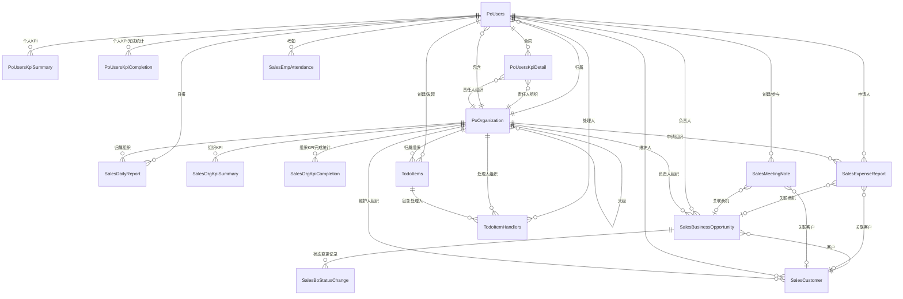

# dataCloud应用场景设计

## 1 场景设计原则

应用场景必须同时以下三个原则：

1、刚需：该场景是必须的，不是可有可无的，不是锦上添花。

2、高价值：该场景是具有很高的业务价值。

3、领先性：实现该场景后，可以体现决策分析产品(dataCloud)的技术先进性。

4、本体论：用例必须要体现本体论中，数字孪生的理念。


## 2 销售分析场景

### 2.1 ER关系

#### 2.1.1 ER图



#### 2.1.2 ER清单

| 实体编码 | 实体名称 | 系统 | 备注 |
| -------- | -------- | -------- | -------- |
| PoUsers | 人员表 | 主数据系统来源 |  |
| PoOrganization | 组织表 | 主数据系统来源 |  |
| PoUsersKpiSummary | 个人KPI表 | 宜搭CRM |  |
| PoUsersKpiCompletion | 个人KPI完成统计表 | 宜搭CRM，按周/月汇总 |  |
| PoUsersKpiDetail | 合同表 | 宜搭CRM |  |
| SalesOrgKpiSummary | 组织KPI表 | 宜搭CRM |  |
| SalesOrgKpiCompletion | 组织KPI完成统计表 | 宜搭CRM，按周/月汇总 |  |
| SalesBusinessOpportunity | 商机表 | 宜搭CRM |  |
| SalesBoStatusChange | 商机状态变更表 | 宜搭CRM，状态变更流水 |  |
| SalesCustomer | 客户表 | 宜搭CRM |  |
| SalesEmpAttendance | 员工考勤表 | 考勤系统 |  |
| SalesDailyReport | 日报记录表 | 钉钉来源 |  |
| SalesMeetingNote | 会议纪要记录表 | 钉钉来源 |  |
| SalesExpenseReport | 费用报备表 | 宜搭CRM |  |
| TodoItems | 待办事项表 | 待办系统 |  |
| TodoItemHandlers | 待办处理人表 | 待办系统 |  |

#### **2.1.3 ER关系**

| 实体编码 | 实体名称 | 关联实体 | 关系说明 | 备注 |
| -------- | -------- | -------- | -------- | -------- |
| PoUsers | 人员表 | PoOrganization（组织表） | 人员通过 org_id 归属到组织，组织包含多个人员 | 海天 |
| PoOrganization | 组织表 | PoOrganization（组织表） | 组织之间存在父子层级关系 | 海天 |
| PoUsers | 人员表 | PoUsersKpiSummary（个人KPI表） | 一个人员有多个个人KPI记录 | emp_no、user_id |
| PoUsers | 人员表 | PoUsersKpiCompletion（个人KPI完成统计表） | 根据个人合同按周/月汇总的KPI完成统计，一个人员有多条账期记录 | emp_no |
| PoUsers | 人员表 | PoUsersKpiDetail（合同表） | 一个人员有多个合同记录 | emp_no、user_id |
| PoOrganization | 组织表 | PoUsersKpiDetail（合同表） | 合同通过责任人组织ID关联到组织 | emp_org_id → org_id |
| PoOrganization | 组织表 | SalesOrgKpiCompletion（组织KPI完成统计表） | 根据组织及下属合同按周/月汇总的KPI完成统计，一个组织有多条账期记录 | org_id |
| PoUsers | 人员表 | SalesEmpAttendance（员工考勤表） | 一个人员有多个考勤记录 | emp_no、user_id |
| PoUsers | 人员表 | SalesDailyReport（日报记录表） | 一个人员有多个日报记录 | belong_emp_no |
| PoOrganization | 组织表 | SalesDailyReport（日报记录表） | 日报通过归属组织ID关联到组织 | belong_emp_org_id → org_id |
| PoOrganization | 组织表 | SalesOrgKpiSummary（组织KPI表） | 一个组织有多个组织KPI记录 | org_id |
| SalesBusinessOpportunity | 商机表 | SalesBoStatusChange（商机状态变更表） | 一条商机有多条状态变更记录 | bo_id → sales_business_opportunity.id |
| SalesBusinessOpportunity | 商机表 | PoUsers（人员表） | 商机通过负责人工号关联到人员 | iwhale_cbm_emp_no |
| SalesBusinessOpportunity | 商机表 | PoOrganization（组织表） | 商机通过负责人组织ID关联到组织 | iwhale_cbm_org_id |
| SalesBusinessOpportunity | 商机表 | SalesCustomer（客户表） | 商机通过客户名称关联到客户 | customer_name |
| SalesCustomer | 客户表 | PoUsers（人员表） | 客户通过维护人工号关联到人员 | iwhale_cbm_emp_no |
| SalesCustomer | 客户表 | PoOrganization（组织表） | 客户通过维护人组织ID关联到组织 | iwhale_cbm_org_id |
| SalesExpenseReport | 费用报备表 | PoUsers（人员表） | 费用通过申请人工号关联到人员 | applicant_emp_no |
| SalesExpenseReport | 费用报备表 | PoOrganization（组织表） | 费用通过申请组织ID关联到组织 | applicant_org_id |
| SalesExpenseReport | 费用报备表 | SalesBusinessOpportunity（商机表） | 费用通过关联商机ID关联到商机 | related_bo_id |
| SalesExpenseReport | 费用报备表 | SalesCustomer（客户表） | 费用通过关联客户名称/ID关联到客户 | related_customer_id |
| TodoItems | 待办事项表 | PoUsers（人员表） | 待办表通过创建人和发起人关联到人员 | created_by、promoter |
| TodoItems | 待办事项表 | PoOrganization（组织表） | 待办表通过组织ID关联到归属组织 | org_id |
| TodoItemHandlers | 待办处理人表 | TodoItems（待办事项表） | 处理人表通过待办ID关联到主待办事项下 | todo_item_id |
| TodoItemHandlers | 待办处理人表 | PoUsers（人员表） | 处理人表通过处理人ID关联到人员 | handler_id |
| TodoItemHandlers | 待办处理人表 | PoOrganization（组织表） | 处理人表通过组织ID关联到处理人所在的组织 | org_id |
| SalesMeetingNote | 会议纪要记录表 | PoUsers（人员表） | 会议纪要通过创建人获取相关的人员实体，可通过参与人员工号列表多态关联 | created_by、participant_emp_nos |
| SalesMeetingNote | 会议纪要记录表 | SalesBusinessOpportunity（商机表） | 会议纪要通过关联商机ID关联到对应商机实体 | related_bo_id |
| SalesMeetingNote | 会议纪要记录表 | SalesCustomer（客户表） | 会议纪要通过关联客户ID关联到所属客户实体 | related_customer_id |


### 2.2 数据来源

#### 2.2.1 主数据系统来源-API

##### 2.2.1 人员表(po_users) 

```sql
-- byai.po_users definition

-- Drop table

-- DROP TABLE byai.po_users;

CREATE TABLE byai.po_users (
	user_id int8 NOT NULL, -- 用户唯一标识
	user_name varchar(255) NOT NULL, -- 用户名称
	email varchar(255) NULL, -- 用户邮箱
	phone varchar(255) NULL, -- 用户电话
	user_code varchar(255) NOT NULL, -- 用户登录标识
	pwd varchar(255) NOT NULL, -- 用户密码(md5加密)
	address text NULL, -- 用户地址
	remark varchar(255) NULL, -- 用户备注
	user_eff_date timestamp NULL, -- 预留
	user_exp_date timestamp NULL, -- 用户过期日期
	create_date timestamp NOT NULL, -- 记录创建日期
	update_date timestamp NULL, -- 记录更新日期
	state bpchar(1) NOT NULL DEFAULT 'A'::bpchar, -- 用户状态：A-正常;X-禁用
	state_time timestamp NULL,
	is_locked bpchar(1) NOT NULL, -- 是否锁定，Y-锁定，N-没有锁定，null表示'N'
	last_login_date timestamp NULL, -- 用户最后一次登录时间
	security_question_id int8 NULL, -- 用户忘记密码找回密码问题
	security_answer varchar(120) NULL, -- 用户忘记密码安全提示问题
	thumbnail_uri varchar(400) NULL, -- 用户头像URL地址
	ext_attr varchar(1000) NULL, -- 用户扩展信息
	assistant_id int8 NULL, -- 一个员工对应一个超级助手
	user_number varchar(30) NULL, -- 工号
	station_id int8 NULL, -- 所属驻地
	register_type int2 NULL, -- 注册类型 1-手机号注册
	apple_user_id varchar(255) NULL DEFAULT NULL::character varying, -- 苹果用户ID，用于苹果登录关联
	CONSTRAINT po_users_pkey PRIMARY KEY (user_id),
	CONSTRAINT uk_users_apple_user_id UNIQUE (apple_user_id)
)
WITH (
	orientation=row,
	compression=no
);
CREATE INDEX idx_assistant_id ON byai.po_users (assistant_id);
CREATE INDEX idx_state_create_date_desc ON byai.po_users (state,create_date DESC);
CREATE INDEX idx_users_apple_user_id ON byai.po_users (apple_user_id);
COMMENT ON TABLE byai.po_users IS '用户表';

-- Column comments

COMMENT ON COLUMN byai.po_users.user_id IS '用户唯一标识';
COMMENT ON COLUMN byai.po_users.user_name IS '用户名称';
COMMENT ON COLUMN byai.po_users.email IS '用户邮箱';
COMMENT ON COLUMN byai.po_users.phone IS '用户电话';
COMMENT ON COLUMN byai.po_users.user_code IS '用户登录标识';
COMMENT ON COLUMN byai.po_users.pwd IS '用户密码(md5加密)';
COMMENT ON COLUMN byai.po_users.address IS '用户地址';
COMMENT ON COLUMN byai.po_users.remark IS '用户备注';
COMMENT ON COLUMN byai.po_users.user_eff_date IS '预留';
COMMENT ON COLUMN byai.po_users.user_exp_date IS '用户过期日期';
COMMENT ON COLUMN byai.po_users.create_date IS '记录创建日期';
COMMENT ON COLUMN byai.po_users.update_date IS '记录更新日期';
COMMENT ON COLUMN byai.po_users.state IS '用户状态：A-正常;X-禁用';
COMMENT ON COLUMN byai.po_users.is_locked IS '是否锁定，Y-锁定，N-没有锁定，null表示''N''';
COMMENT ON COLUMN byai.po_users.last_login_date IS '用户最后一次登录时间';
COMMENT ON COLUMN byai.po_users.security_question_id IS '用户忘记密码找回密码问题';
COMMENT ON COLUMN byai.po_users.security_answer IS '用户忘记密码安全提示问题';
COMMENT ON COLUMN byai.po_users.thumbnail_uri IS '用户头像URL地址';
COMMENT ON COLUMN byai.po_users.ext_attr IS '用户扩展信息';
COMMENT ON COLUMN byai.po_users.assistant_id IS '一个员工对应一个超级助手';
COMMENT ON COLUMN byai.po_users.user_number IS '工号';
COMMENT ON COLUMN byai.po_users.station_id IS '所属驻地';
COMMENT ON COLUMN byai.po_users.register_type IS '注册类型 1-手机号注册';
COMMENT ON COLUMN byai.po_users.apple_user_id IS '苹果用户ID，用于苹果登录关联';
```


##### 2.2.2 组织表(po_organization)

```sql
-- byai.po_organization definition

-- Drop table

-- DROP TABLE byai.po_organization;

CREATE TABLE byai.po_organization (
	org_id int8 NOT NULL, -- 组织ID
	org_code varchar(250) NOT NULL, -- 组织编码
	org_name varchar(100) NOT NULL, -- 组织名称
	org_type varchar(4) NOT NULL DEFAULT '0'::character varying, -- 组织类型(0：内部组织；1：外部组织)
	parent_org_id int8 NOT NULL, -- 父标识，-1代表顶层
	org_level int4 NULL, -- 组织层级(0: 顶级； 1-9往后递增)
	org_index int4 NULL, -- 同层级内排序字段
	create_date timestamp NULL, -- 创建时间
	update_date timestamp NULL, -- 更新时间
	path_code varchar(500) NULL, -- 组织路径
	org_desc varchar(1000) NULL, -- 组织描述
	CONSTRAINT po_organization_pkey PRIMARY KEY (org_id)
)
WITH (
	orientation=row,
	compression=no
);
COMMENT ON TABLE byai.po_organization IS '组织信息表';

-- Column comments

COMMENT ON COLUMN byai.po_organization.org_id IS '组织ID';
COMMENT ON COLUMN byai.po_organization.org_code IS '组织编码';
COMMENT ON COLUMN byai.po_organization.org_name IS '组织名称';
COMMENT ON COLUMN byai.po_organization.org_type IS '组织类型(0：内部组织；1：外部组织)';
COMMENT ON COLUMN byai.po_organization.parent_org_id IS '父标识，-1代表顶层';
COMMENT ON COLUMN byai.po_organization.org_level IS '组织层级(0: 顶级； 1-9往后递增)';
COMMENT ON COLUMN byai.po_organization.org_index IS '同层级内排序字段';
COMMENT ON COLUMN byai.po_organization.create_date IS '创建时间';
COMMENT ON COLUMN byai.po_organization.update_date IS '更新时间';
COMMENT ON COLUMN byai.po_organization.path_code IS '组织路径';
COMMENT ON COLUMN byai.po_organization.org_desc IS '组织描述';
```


#### 2.2.2 宜搭CRM系统来源-DB

##### 2.2.2.1 商机表(sales_business_opportunity)

```sql
CREATE TABLE `sales_business_opportunity` (
  `id` bigint NOT NULL AUTO_INCREMENT COMMENT '主键ID',
  `bo_name` varchar(64) CHARACTER SET utf8mb4 COLLATE utf8mb4_0900_ai_ci NOT NULL COMMENT '商机名称',
  `belong_depart` varchar(32) CHARACTER SET utf8mb4 COLLATE utf8mb4_0900_ai_ci DEFAULT NULL COMMENT '所属营销部',
  `customer_name` varchar(64) CHARACTER SET utf8mb4 COLLATE utf8mb4_0900_ai_ci NOT NULL COMMENT '客户名称',
  `order_date` date DEFAULT NULL COMMENT '落单时间',
  `bid_opening_time` date DEFAULT NULL COMMENT '主标开标时间',
  `iwhale_cbm_emp_no` varchar(32) CHARACTER SET utf8mb4 COLLATE utf8mb4_0900_ai_ci NOT NULL COMMENT '商机负责人工号',
  `iwhale_cbm_name` varchar(32) CHARACTER SET utf8mb4 COLLATE utf8mb4_0900_ai_ci NOT NULL COMMENT '商机负责人名称',
  `iwhale_cbm_org_id` varchar(32) CHARACTER SET utf8mb4 COLLATE utf8mb4_0900_ai_ci DEFAULT NULL COMMENT '商机负责人组织',
  `software_income_time` date DEFAULT NULL COMMENT '软收计入时间',
  `it_investment_scale` varchar(32) CHARACTER SET utf8mb4 COLLATE utf8mb4_0900_ai_ci NOT NULL COMMENT '客户IT投资规模（万元）',
  `win_bid` tinyint NOT NULL COMMENT '是否中标：1为中标，0为未中标',
  `iwhale_sc_emp_no` varchar(32) CHARACTER SET utf8mb4 COLLATE utf8mb4_0900_ai_ci DEFAULT NULL COMMENT '支撑sc工号',
  `iwhale_sc_name` varchar(32) CHARACTER SET utf8mb4 COLLATE utf8mb4_0900_ai_ci DEFAULT NULL COMMENT '浩鲸sc名称',
  `diliver_content` varchar(32) CHARACTER SET utf8mb4 COLLATE utf8mb4_0900_ai_ci DEFAULT NULL COMMENT '合同交付内容',
  `type` varchar(32) CHARACTER SET utf8mb4 COLLATE utf8mb4_0900_ai_ci DEFAULT NULL COMMENT '商机类型',
  `performance_type` varchar(32) CHARACTER SET utf8mb4 COLLATE utf8mb4_0900_ai_ci DEFAULT NULL COMMENT '业绩类型',
  `early_diliver` tinyint DEFAULT NULL COMMENT '是否提前交付：1为提前，0为未提前',
  `business_opportunity_process` varchar(32) CHARACTER SET utf8mb4 COLLATE utf8mb4_0900_ai_ci NOT NULL COMMENT '商机状态',
  `contract_scale` varchar(32) CHARACTER SET utf8mb4 COLLATE utf8mb4_0900_ai_ci DEFAULT NULL COMMENT '合同额（万）',
  `software_sale_scale` varchar(32) CHARACTER SET utf8mb4 COLLATE utf8mb4_0900_ai_ci DEFAULT NULL COMMENT '软销规模（万元）',
  `software_income_scale` varchar(32) CHARACTER SET utf8mb4 COLLATE utf8mb4_0900_ai_ci DEFAULT NULL COMMENT '软收计入规模（万元）',
  `order_rate` varchar(32) CHARACTER SET utf8mb4 COLLATE utf8mb4_0900_ai_ci NOT NULL COMMENT '落单几率',
  `business_opportunity_desc` varchar(32) CHARACTER SET utf8mb4 COLLATE utf8mb4_0900_ai_ci DEFAULT NULL COMMENT '商机具体进展描述',
  `submit_person` varchar(32) CHARACTER SET utf8mb4 COLLATE utf8mb4_0900_ai_ci DEFAULT NULL COMMENT '提交人',
  `submit_organization` varchar(32) CHARACTER SET utf8mb4 COLLATE utf8mb4_0900_ai_ci DEFAULT NULL COMMENT '提交组织',
  `is_ali_integrated` tinyint(1) DEFAULT '0' COMMENT '是否集成阿里产品: 0-否, 1-是',
  `opportunity_nature` varchar(32) CHARACTER SET utf8mb4 COLLATE utf8mb4_0900_ai_ci DEFAULT NULL COMMENT '商机性质：新增',
  `opportunity_source` varchar(100) CHARACTER SET utf8mb4 COLLATE utf8mb4_0900_ai_ci DEFAULT NULL COMMENT '商机来源',
  `source_description` varchar(255) CHARACTER SET utf8mb4 COLLATE utf8mb4_0900_ai_ci DEFAULT NULL COMMENT '来源说明',
  `opportunity_stage` varchar(100) CHARACTER SET utf8mb4 COLLATE utf8mb4_0900_ai_ci DEFAULT NULL COMMENT '商机进展：初步接触',
  `opportunity_id` varchar(50) CHARACTER SET utf8mb4 COLLATE utf8mb4_0900_ai_ci DEFAULT NULL COMMENT '商机ID, 业务唯一标识',
  `instance_id` varchar(50) CHARACTER SET utf8mb4 COLLATE utf8mb4_0900_ai_ci DEFAULT NULL COMMENT '实例ID',
  `instance_title` varchar(200) CHARACTER SET utf8mb4 COLLATE utf8mb4_0900_ai_ci DEFAULT NULL COMMENT '实例标题',
  `prepay_expected_date` date DEFAULT NULL COMMENT '预测回款时间【预付款】',
  `prepay_expected_amount` varchar(20) CHARACTER SET utf8mb4 COLLATE utf8mb4_0900_ai_ci DEFAULT NULL COMMENT '预测回款金额【预付款】(万元)',
  `customer_tax_id` varchar(128) CHARACTER SET utf8mb4 COLLATE utf8mb4_0900_ai_ci DEFAULT NULL COMMENT '客户纳税号',
  `created_by` varchar(100) CHARACTER SET utf8mb4 COLLATE utf8mb4_0900_ai_ci NOT NULL COMMENT '创建人',
  `created_time` datetime NOT NULL DEFAULT CURRENT_TIMESTAMP COMMENT '创建时间',
  `updated_by` varchar(100) CHARACTER SET utf8mb4 COLLATE utf8mb4_0900_ai_ci DEFAULT NULL COMMENT '更新人',
  `updated_time` datetime DEFAULT CURRENT_TIMESTAMP ON UPDATE CURRENT_TIMESTAMP COMMENT '更新时间',
  `is_deleted` tinyint(1) NOT NULL DEFAULT '0' COMMENT '逻辑删除标识(0:正常,1:删除)',
  PRIMARY KEY (`id`) USING BTREE
) ENGINE=InnoDB AUTO_INCREMENT=95 DEFAULT CHARSET=utf8mb4 COLLATE=utf8mb4_0900_ai_ci ROW_FORMAT=DYNAMIC COMMENT='商机表';
```


##### 2.2.2.2 商机状态变更表(sales_bo_status_change)

记录商机状态每次变更的前后状态、变更说明、变更人、变更时间等，用于审计与行为轨迹分析。

```sql
CREATE TABLE `sales_bo_status_change` (
  `id` bigint NOT NULL AUTO_INCREMENT COMMENT '主键ID',
  `bo_id` bigint NOT NULL COMMENT '商机主键ID，关联 sales_business_opportunity.id',
  `opportunity_id` varchar(50) CHARACTER SET utf8mb4 COLLATE utf8mb4_0900_ai_ci DEFAULT NULL COMMENT '商机业务唯一标识，关联 sales_business_opportunity.opportunity_id',
  `status_before` varchar(64) CHARACTER SET utf8mb4 COLLATE utf8mb4_0900_ai_ci DEFAULT NULL COMMENT '变更前状态',
  `status_after` varchar(64) CHARACTER SET utf8mb4 COLLATE utf8mb4_0900_ai_ci NOT NULL COMMENT '变更后状态',
  `change_remark` varchar(512) CHARACTER SET utf8mb4 COLLATE utf8mb4_0900_ai_ci DEFAULT NULL COMMENT '变更说明',
  `changed_by` varchar(100) CHARACTER SET utf8mb4 COLLATE utf8mb4_0900_ai_ci NOT NULL COMMENT '变更人',
  `changed_time` datetime NOT NULL DEFAULT CURRENT_TIMESTAMP COMMENT '变更时间',
  `created_by` varchar(100) CHARACTER SET utf8mb4 COLLATE utf8mb4_0900_ai_ci NOT NULL COMMENT '创建人',
  `created_time` datetime NOT NULL DEFAULT CURRENT_TIMESTAMP COMMENT '创建时间',
  `updated_by` varchar(100) CHARACTER SET utf8mb4 COLLATE utf8mb4_0900_ai_ci DEFAULT NULL COMMENT '更新人',
  `updated_time` datetime DEFAULT CURRENT_TIMESTAMP ON UPDATE CURRENT_TIMESTAMP COMMENT '更新时间',
  `is_deleted` tinyint(1) NOT NULL DEFAULT '0' COMMENT '逻辑删除标识(0:正常,1:删除)',
  PRIMARY KEY (`id`) USING BTREE,
  KEY `idx_bo_id` (`bo_id`) USING BTREE,
  KEY `idx_changed_time` (`changed_time`) USING BTREE
) ENGINE=InnoDB DEFAULT CHARSET=utf8mb4 COLLATE=utf8mb4_0900_ai_ci ROW_FORMAT=DYNAMIC COMMENT='商机状态变更表';
```


##### 2.2.2.3 合同表(sales_person_kpi_summary)

```sql
CREATE TABLE `sales_person_kpi_summary` (
  `id` bigint NOT NULL AUTO_INCREMENT COMMENT '主键ID',
  `user_id` varchar(32) CHARACTER SET utf8mb4 COLLATE utf8mb4_0900_ai_ci DEFAULT NULL COMMENT '责任人ID',
  `emp_no` varchar(32) CHARACTER SET utf8mb4 COLLATE utf8mb4_0900_ai_ci NOT NULL COMMENT '责任人工号',
  `name` varchar(255) CHARACTER SET utf8mb4 COLLATE utf8mb4_0900_ai_ci DEFAULT NULL COMMENT '责任人姓名',
  `emp_org_id` varchar(32) CHARACTER SET utf8mb4 COLLATE utf8mb4_0900_ai_ci DEFAULT NULL COMMENT '责任人组织',
  `contact_no` varchar(255) CHARACTER SET utf8mb4 COLLATE utf8mb4_0900_ai_ci NOT NULL COMMENT '合同号',
  `contact_name` varchar(255) CHARACTER SET utf8mb4 COLLATE utf8mb4_0900_ai_ci NOT NULL COMMENT '合同名称',
  `contact_date` date NOT NULL COMMENT '合同时间',
  `soft_sell` varchar(255) DEFAULT NULL COMMENT '软销金额',
  `contact_scale` varchar(255) CHARACTER SET utf8mb4 COLLATE utf8mb4_0900_ai_ci NOT NULL COMMENT '合同金额',
  `created_by` varchar(100) CHARACTER SET utf8mb4 COLLATE utf8mb4_0900_ai_ci NOT NULL COMMENT '创建人',
  `created_time` datetime NOT NULL DEFAULT CURRENT_TIMESTAMP COMMENT '创建时间',
  `updated_by` varchar(100) CHARACTER SET utf8mb4 COLLATE utf8mb4_0900_ai_ci DEFAULT NULL COMMENT '更新人',
  `updated_time` datetime DEFAULT CURRENT_TIMESTAMP ON UPDATE CURRENT_TIMESTAMP COMMENT '更新时间',
  `is_deleted` tinyint(1) NOT NULL DEFAULT '0' COMMENT '逻辑删除标识(0:正常,1:删除)',
  PRIMARY KEY (`id`) USING BTREE,
  UNIQUE KEY `uk_user_id` (`user_id`) USING BTREE
) ENGINE=InnoDB AUTO_INCREMENT=846 DEFAULT CHARSET=utf8mb4 COLLATE=utf8mb4_0900_ai_ci ROW_FORMAT=DYNAMIC COMMENT='合同表';
```


##### 2.2.2.4 客户表(sales_customer)

```sql
CREATE TABLE `sales_customer` (
  `id` bigint NOT NULL AUTO_INCREMENT COMMENT '主键ID',
  `customer_name` varchar(64) CHARACTER SET utf8mb4 COLLATE utf8mb4_0900_ai_ci NOT NULL COMMENT '客户名称',
  `belong_depart` varchar(32) CHARACTER SET utf8mb4 COLLATE utf8mb4_0900_ai_ci NOT NULL COMMENT '所属营销部',
  `type` varchar(32) CHARACTER SET utf8mb4 COLLATE utf8mb4_0900_ai_ci NOT NULL COMMENT '客户类别：新增',
  `build_content` varchar(32) CHARACTER SET utf8mb4 COLLATE utf8mb4_0900_ai_ci DEFAULT NULL COMMENT '建设类容',
  `iwhale_cbm_emp_no` varchar(32) CHARACTER SET utf8mb4 COLLATE utf8mb4_0900_ai_ci NOT NULL COMMENT '客户维护人工号',
  `iwhale_cbm_name` varchar(32) CHARACTER SET utf8mb4 COLLATE utf8mb4_0900_ai_ci NOT NULL COMMENT '客户维护人名称',
  `iwhale_cbm_org_id` varchar(32) CHARACTER SET utf8mb4 COLLATE utf8mb4_0900_ai_ci DEFAULT NULL COMMENT '客户维护人组织',
  `belong_industry` varchar(32) CHARACTER SET utf8mb4 COLLATE utf8mb4_0900_ai_ci DEFAULT NULL COMMENT '所属行业',
  `it_investment_scale` varchar(32) CHARACTER SET utf8mb4 COLLATE utf8mb4_0900_ai_ci DEFAULT NULL COMMENT '客户IT投资规模（万元）',
  `data_year` year NOT NULL COMMENT '数据年份，如：2024',
  `software_sale_scale` varchar(32) CHARACTER SET utf8mb4 COLLATE utf8mb4_0900_ai_ci DEFAULT NULL COMMENT '软销规模（万元）',
  `next_year_predict_scale` varchar(32) CHARACTER SET utf8mb4 COLLATE utf8mb4_0900_ai_ci DEFAULT NULL COMMENT '明年预计软销规模',
  `contract_scale` varchar(32) CHARACTER SET utf8mb4 COLLATE utf8mb4_0900_ai_ci DEFAULT NULL COMMENT '合同额（万元）',
  `process` varchar(32) CHARACTER SET utf8mb4 COLLATE utf8mb4_0900_ai_ci DEFAULT NULL COMMENT '目前进展',
  `main_business` varchar(255) CHARACTER SET utf8mb4 COLLATE utf8mb4_0900_ai_ci DEFAULT NULL COMMENT '主营业务',
  `submit_person` varchar(32) CHARACTER SET utf8mb4 COLLATE utf8mb4_0900_ai_ci DEFAULT NULL COMMENT '提交人',
  `submit_organization` varchar(32) CHARACTER SET utf8mb4 COLLATE utf8mb4_0900_ai_ci DEFAULT NULL COMMENT '提交组织',
  `business_opportunity_process` varchar(32) CHARACTER SET utf8mb4 COLLATE utf8mb4_0900_ai_ci DEFAULT NULL COMMENT '商机进展',
  `customer_tax_id` varchar(128) CHARACTER SET utf8mb4 COLLATE utf8mb4_0900_ai_ci DEFAULT NULL COMMENT '客户纳税号',
  `instance_id` varchar(128) CHARACTER SET utf8mb4 COLLATE utf8mb4_0900_ai_ci DEFAULT NULL COMMENT '实例ID',
  `created_by` varchar(100) CHARACTER SET utf8mb4 COLLATE utf8mb4_0900_ai_ci NOT NULL COMMENT '创建人',
  `created_time` datetime NOT NULL DEFAULT CURRENT_TIMESTAMP COMMENT '创建时间',
  `updated_by` varchar(100) CHARACTER SET utf8mb4 COLLATE utf8mb4_0900_ai_ci DEFAULT NULL COMMENT '更新人',
  `updated_time` datetime DEFAULT CURRENT_TIMESTAMP ON UPDATE CURRENT_TIMESTAMP COMMENT '更新时间',
  `is_deleted` tinyint(1) NOT NULL DEFAULT '0' COMMENT '逻辑删除标识(0:正常,1:删除)',
  PRIMARY KEY (`id`) USING BTREE
) ENGINE=InnoDB AUTO_INCREMENT=92 DEFAULT CHARSET=utf8mb4 COLLATE=utf8mb4_0900_ai_ci ROW_FORMAT=DYNAMIC COMMENT='客户表';
```


##### 2.2.2.5 费用报备表(sales_expense_report)

```sql
CREATE TABLE `sales_expense_report` (
  `id` bigint NOT NULL AUTO_INCREMENT COMMENT '主键ID',
  `applicant_emp_no` varchar(32) CHARACTER SET utf8mb4 COLLATE utf8mb4_0900_ai_ci NOT NULL COMMENT '申请人工号',
  `applicant_name` varchar(64) CHARACTER SET utf8mb4 COLLATE utf8mb4_0900_ai_ci NOT NULL COMMENT '申请人姓名',
  `applicant_org_id` varchar(32) CHARACTER SET utf8mb4 COLLATE utf8mb4_0900_ai_ci NOT NULL COMMENT '申请组织ID',
  `expense_amount` decimal(10,2) NOT NULL COMMENT '申请金额（元）',
  `expense_desc` varchar(512) CHARACTER SET utf8mb4 COLLATE utf8mb4_0900_ai_ci DEFAULT NULL COMMENT '申请说明',
  `related_bo_id` varchar(50) CHARACTER SET utf8mb4 COLLATE utf8mb4_0900_ai_ci DEFAULT NULL COMMENT '关联商机ID',
  `related_customer_id` varchar(128) CHARACTER SET utf8mb4 COLLATE utf8mb4_0900_ai_ci DEFAULT NULL COMMENT '关联客户ID',
  `apply_time` datetime NOT NULL DEFAULT CURRENT_TIMESTAMP COMMENT '申请时间',
  `created_by` varchar(100) CHARACTER SET utf8mb4 COLLATE utf8mb4_0900_ai_ci NOT NULL COMMENT '创建人',
  `created_time` datetime NOT NULL DEFAULT CURRENT_TIMESTAMP COMMENT '创建时间',
  `updated_by` varchar(100) CHARACTER SET utf8mb4 COLLATE utf8mb4_0900_ai_ci DEFAULT NULL COMMENT '更新人',
  `updated_time` datetime DEFAULT CURRENT_TIMESTAMP ON UPDATE CURRENT_TIMESTAMP COMMENT '更新时间',
  `is_deleted` tinyint(1) NOT NULL DEFAULT '0' COMMENT '逻辑删除标识(0:正常,1:删除)',
  PRIMARY KEY (`id`) USING BTREE
) ENGINE=InnoDB DEFAULT CHARSET=utf8mb4 COLLATE=utf8mb4_0900_ai_ci ROW_FORMAT=DYNAMIC COMMENT='费用报备表';
```


##### 2.2.2.6 个人kpi表(po_users_kpi_summary)

```sql
CREATE TABLE `po_users_kpi_summary` (
  `id` bigint NOT NULL AUTO_INCREMENT COMMENT '主键ID',
  `user_id` varchar(32) CHARACTER SET utf8mb4 COLLATE utf8mb4_0900_ai_ci DEFAULT NULL COMMENT '责任人id',
  `emp_no` varchar(32) CHARACTER SET utf8mb4 COLLATE utf8mb4_0900_ai_ci NOT NULL COMMENT '责任人工号',
  `kpi_year` varchar(32) CHARACTER SET utf8mb4 COLLATE utf8mb4_0900_ai_ci DEFAULT NULL COMMENT 'kpi年度',
  `kpi_sum` varchar(255) CHARACTER SET utf8mb4 COLLATE utf8mb4_0900_ai_ci DEFAULT NULL COMMENT 'KPI目标金额',
  `created_by` varchar(100) CHARACTER SET utf8mb4 COLLATE utf8mb4_0900_ai_ci NOT NULL COMMENT '创建人',
  `created_time` datetime NOT NULL DEFAULT CURRENT_TIMESTAMP COMMENT '创建时间',
  `updated_by` varchar(100) CHARACTER SET utf8mb4 COLLATE utf8mb4_0900_ai_ci DEFAULT NULL COMMENT '更新人',
  `updated_time` datetime DEFAULT CURRENT_TIMESTAMP ON UPDATE CURRENT_TIMESTAMP COMMENT '更新时间',
  `is_deleted` tinyint(1) NOT NULL DEFAULT '0' COMMENT '逻辑删除标识(0:正常,1:删除)',
  PRIMARY KEY (`id`) USING BTREE
) ENGINE=InnoDB AUTO_INCREMENT=87 DEFAULT CHARSET=utf8mb4 COLLATE=utf8mb4_0900_ai_ci ROW_FORMAT=DYNAMIC COMMENT='个人kpi表';
```


##### 2.2.2.7 组织kpi表(sales_org_kpi_summary)

```sql
CREATE TABLE `sales_org_kpi_summary` (
  `id` bigint NOT NULL AUTO_INCREMENT COMMENT '主键ID',
  `org_id` varchar(32) CHARACTER SET utf8mb4 COLLATE utf8mb4_0900_ai_ci NOT NULL COMMENT '组织ID',
  `org_name` varchar(255) CHARACTER SET utf8mb4 COLLATE utf8mb4_0900_ai_ci DEFAULT NULL COMMENT '组织名称',
  `kpi_year` year NOT NULL COMMENT 'kpi年度',
  `kpi_sum` varchar(255) CHARACTER SET utf8mb4 COLLATE utf8mb4_0900_ai_ci NOT NULL COMMENT 'KPI目标',
  `created_by` varchar(100) CHARACTER SET utf8mb4 COLLATE utf8mb4_0900_ai_ci NOT NULL COMMENT '创建人',
  `created_time` datetime NOT NULL DEFAULT CURRENT_TIMESTAMP COMMENT '创建时间',
  `updated_by` varchar(100) CHARACTER SET utf8mb4 COLLATE utf8mb4_0900_ai_ci DEFAULT NULL COMMENT '更新人',
  `updated_time` datetime DEFAULT CURRENT_TIMESTAMP ON UPDATE CURRENT_TIMESTAMP COMMENT '更新时间',
  `is_deleted` tinyint(1) NOT NULL DEFAULT '0' COMMENT '逻辑删除标识(0:正常,1:删除)',
  PRIMARY KEY (`id`) USING BTREE
) ENGINE=InnoDB AUTO_INCREMENT=25 DEFAULT CHARSET=utf8mb4 COLLATE=utf8mb4_0900_ai_ci ROW_FORMAT=DYNAMIC COMMENT='组织KPI目标表';
```


##### 2.2.2.8 个人KPI完成统计表(po_users_kpi_completion)

根据个人合同（po_users_kpi_detail）统计个人 KPI 完成情况，按**周、月**两个账期落表，用于达成率、排名等分析。

```sql
CREATE TABLE `po_users_kpi_completion` (
  `id` bigint NOT NULL AUTO_INCREMENT COMMENT '主键ID',
  `emp_no` varchar(32) CHARACTER SET utf8mb4 COLLATE utf8mb4_0900_ai_ci NOT NULL COMMENT '责任人工号',
  `user_id` varchar(32) CHARACTER SET utf8mb4 COLLATE utf8mb4_0900_ai_ci DEFAULT NULL COMMENT '责任人用户ID',
  `period_type` varchar(16) CHARACTER SET utf8mb4 COLLATE utf8mb4_0900_ai_ci NOT NULL COMMENT '账期类型：WEEK-周，MONTH-月',
  `period_value` varchar(32) CHARACTER SET utf8mb4 COLLATE utf8mb4_0900_ai_ci NOT NULL COMMENT '账期值：周如2025-W01，月如2025-01',
  `kpi_year` varchar(32) CHARACTER SET utf8mb4 COLLATE utf8mb4_0900_ai_ci DEFAULT NULL COMMENT '对应KPI年度',
  `completed_contract_amount` decimal(20,2) DEFAULT NULL COMMENT '该账期已完成合同金额（万元）',
  `completed_soft_sell` decimal(20,2) DEFAULT NULL COMMENT '该账期已完成软销金额（万元）',
  `contract_count` int DEFAULT NULL COMMENT '该账期签约合同笔数',
  `created_by` varchar(100) CHARACTER SET utf8mb4 COLLATE utf8mb4_0900_ai_ci NOT NULL COMMENT '创建人',
  `created_time` datetime NOT NULL DEFAULT CURRENT_TIMESTAMP COMMENT '创建时间',
  `updated_by` varchar(100) CHARACTER SET utf8mb4 COLLATE utf8mb4_0900_ai_ci DEFAULT NULL COMMENT '更新人',
  `updated_time` datetime DEFAULT CURRENT_TIMESTAMP ON UPDATE CURRENT_TIMESTAMP COMMENT '更新时间',
  `is_deleted` tinyint(1) NOT NULL DEFAULT '0' COMMENT '逻辑删除标识(0:正常,1:删除)',
  PRIMARY KEY (`id`) USING BTREE,
  UNIQUE KEY `uk_emp_period` (`emp_no`,`period_type`,`period_value`) USING BTREE
) ENGINE=InnoDB DEFAULT CHARSET=utf8mb4 COLLATE=utf8mb4_0900_ai_ci ROW_FORMAT=DYNAMIC COMMENT='个人KPI完成统计表（按周/月）';
```


##### 2.2.2.9 组织KPI完成统计表(sales_org_kpi_completion)

根据组织 KPI 目标及下属人员合同汇总，统计组织 KPI 完成情况，按**周、月**两个账期落表，用于组织达成率、缺口预警等分析。

```sql
CREATE TABLE `sales_org_kpi_completion` (
  `id` bigint NOT NULL AUTO_INCREMENT COMMENT '主键ID',
  `org_id` varchar(32) CHARACTER SET utf8mb4 COLLATE utf8mb4_0900_ai_ci NOT NULL COMMENT '组织ID',
  `org_name` varchar(255) CHARACTER SET utf8mb4 COLLATE utf8mb4_0900_ai_ci DEFAULT NULL COMMENT '组织名称',
  `period_type` varchar(16) CHARACTER SET utf8mb4 COLLATE utf8mb4_0900_ai_ci NOT NULL COMMENT '账期类型：WEEK-周，MONTH-月',
  `period_value` varchar(32) CHARACTER SET utf8mb4 COLLATE utf8mb4_0900_ai_ci NOT NULL COMMENT '账期值：周如2025-W01，月如2025-01',
  `kpi_year` varchar(32) CHARACTER SET utf8mb4 COLLATE utf8mb4_0900_ai_ci DEFAULT NULL COMMENT '对应KPI年度',
  `completed_amount` decimal(20,2) DEFAULT NULL COMMENT '该账期组织汇总完成金额（万元）',
  `completed_soft_sell` decimal(20,2) DEFAULT NULL COMMENT '该账期组织汇总软销金额（万元）',
  `contract_count` int DEFAULT NULL COMMENT '该账期组织签约合同笔数',
  `created_by` varchar(100) CHARACTER SET utf8mb4 COLLATE utf8mb4_0900_ai_ci NOT NULL COMMENT '创建人',
  `created_time` datetime NOT NULL DEFAULT CURRENT_TIMESTAMP COMMENT '创建时间',
  `updated_by` varchar(100) CHARACTER SET utf8mb4 COLLATE utf8mb4_0900_ai_ci DEFAULT NULL COMMENT '更新人',
  `updated_time` datetime DEFAULT CURRENT_TIMESTAMP ON UPDATE CURRENT_TIMESTAMP COMMENT '更新时间',
  `is_deleted` tinyint(1) NOT NULL DEFAULT '0' COMMENT '逻辑删除标识(0:正常,1:删除)',
  PRIMARY KEY (`id`) USING BTREE,
  UNIQUE KEY `uk_org_period` (`org_id`,`period_type`,`period_value`) USING BTREE
) ENGINE=InnoDB DEFAULT CHARSET=utf8mb4 COLLATE=utf8mb4_0900_ai_ci ROW_FORMAT=DYNAMIC COMMENT='组织KPI完成统计表（按周/月）';
```


#### 2.2.3 钉钉来源

##### 2.2.3.1 日报记录表(sales_daily_report)

```sql
CREATE TABLE `sales_daily_report` (
  `id` bigint NOT NULL AUTO_INCREMENT COMMENT '主键ID',
  `report_date` date NOT NULL COMMENT '日报日期',
  `report_title` varchar(128) CHARACTER SET utf8mb4 COLLATE utf8mb4_0900_ai_ci NOT NULL COMMENT '日报标题',
  `report_content` json DEFAULT NULL COMMENT '日报内容(JSON格式，灵活存储)',
  `report_status` tinyint NOT NULL DEFAULT '0' COMMENT '日报状态(0: 未反馈, 1:已反馈)',
  `belong_emp_no` varchar(32) CHARACTER SET utf8mb4 COLLATE utf8mb4_0900_ai_ci NOT NULL COMMENT '员工工号',
  `belong_user_name` varchar(32) CHARACTER SET utf8mb4 COLLATE utf8mb4_0900_ai_ci NOT NULL COMMENT '员工姓名',
  `belong_emp_org_id` varchar(32) CHARACTER SET utf8mb4 COLLATE utf8mb4_0900_ai_ci DEFAULT NULL COMMENT '归属用户所在的组织ID',
  `created_by` varchar(32) CHARACTER SET utf8mb4 COLLATE utf8mb4_0900_ai_ci NOT NULL COMMENT '创建人',
  `created_time` datetime NOT NULL DEFAULT CURRENT_TIMESTAMP COMMENT '创建时间',
  `updated_by` varchar(32) CHARACTER SET utf8mb4 COLLATE utf8mb4_0900_ai_ci DEFAULT NULL COMMENT '更新人',
  `updated_time` datetime DEFAULT CURRENT_TIMESTAMP ON UPDATE CURRENT_TIMESTAMP COMMENT '更新时间',
  `is_deleted` tinyint(1) NOT NULL DEFAULT '0' COMMENT '逻辑删除标识(0:正常,1:删除)',
  PRIMARY KEY (`id`) USING BTREE,
  KEY `idx_belong_user_report_date` (`belong_emp_no`,`report_date`) USING BTREE
) ENGINE=InnoDB AUTO_INCREMENT=84 DEFAULT CHARSET=utf8mb4 COLLATE=utf8mb4_0900_ai_ci ROW_FORMAT=DYNAMIC COMMENT='日报记录表';
```


##### 2.2.3.2 会议纪要记录表(sales_meeting_note)

```sql
CREATE TABLE `sales_meeting_note` (
  `id` bigint NOT NULL AUTO_INCREMENT COMMENT '主键ID',
  `meeting_title` varchar(255) CHARACTER SET utf8mb4 COLLATE utf8mb4_0900_ai_ci NOT NULL COMMENT '会议纪要标题',
  `meeting_content` text CHARACTER SET utf8mb4 COLLATE utf8mb4_0900_ai_ci COMMENT '会议内容',
  `start_time` datetime NOT NULL COMMENT '发起时间',
  `related_bo_id` varchar(50) CHARACTER SET utf8mb4 COLLATE utf8mb4_0900_ai_ci DEFAULT NULL COMMENT '关联商机ID',
  `related_customer_id` varchar(128) CHARACTER SET utf8mb4 COLLATE utf8mb4_0900_ai_ci DEFAULT NULL COMMENT '关联客户ID',
  `participant_emp_nos` json DEFAULT NULL COMMENT '会议参与人员工号（多个）',
  `created_by` varchar(100) CHARACTER SET utf8mb4 COLLATE utf8mb4_0900_ai_ci NOT NULL COMMENT '会议创建人',
  `created_time` datetime NOT NULL DEFAULT CURRENT_TIMESTAMP COMMENT '创建时间',
  `updated_by` varchar(100) CHARACTER SET utf8mb4 COLLATE utf8mb4_0900_ai_ci DEFAULT NULL COMMENT '更新人',
  `updated_time` datetime DEFAULT CURRENT_TIMESTAMP ON UPDATE CURRENT_TIMESTAMP COMMENT '更新时间',
  `is_deleted` tinyint(1) NOT NULL DEFAULT '0' COMMENT '逻辑删除标识(0:正常,1:删除)',
  PRIMARY KEY (`id`) USING BTREE
) ENGINE=InnoDB DEFAULT CHARSET=utf8mb4 COLLATE=utf8mb4_0900_ai_ci ROW_FORMAT=DYNAMIC COMMENT='会议纪要表';
```


#### 2.2.4 考勤系统-DB

##### 2.2.4.1 员工考勤表(sales_emp_attendance)

```sql
CREATE TABLE `sales_emp_attendance` (
  `id` bigint NOT NULL AUTO_INCREMENT COMMENT '主键ID',
  `user_id` varchar(32) CHARACTER SET utf8mb4 COLLATE utf8mb4_0900_ai_ci DEFAULT NULL COMMENT '用户id',
  `emp_no` varchar(32) CHARACTER SET utf8mb4 COLLATE utf8mb4_0900_ai_ci NOT NULL COMMENT '工号',
  `attendance_date` date NOT NULL COMMENT '考勤日',
  `bill_date` year NOT NULL COMMENT '账期',
  `forenoon_status` varchar(32) CHARACTER SET utf8mb4 COLLATE utf8mb4_0900_ai_ci DEFAULT NULL COMMENT '上午打卡结果',
  `afternoon_status` varchar(32) CHARACTER SET utf8mb4 COLLATE utf8mb4_0900_ai_ci DEFAULT NULL COMMENT '下午打卡结果',
  `forenoon_time` datetime DEFAULT NULL COMMENT '上午实际打卡时间',
  `afternoon_time` datetime DEFAULT NULL COMMENT '下午实际打卡时间',
  `created_by` varchar(100) CHARACTER SET utf8mb4 COLLATE utf8mb4_0900_ai_ci NOT NULL COMMENT '创建人',
  `created_time` datetime NOT NULL DEFAULT CURRENT_TIMESTAMP COMMENT '创建时间',
  `updated_by` varchar(100) CHARACTER SET utf8mb4 COLLATE utf8mb4_0900_ai_ci DEFAULT NULL COMMENT '更新人',
  `updated_time` datetime DEFAULT CURRENT_TIMESTAMP ON UPDATE CURRENT_TIMESTAMP COMMENT '更新时间',
  `is_deleted` tinyint(1) NOT NULL DEFAULT '0' COMMENT '逻辑删除标识(0:正常,1:删除)',
  `forenoon_location` varchar(1024) DEFAULT NULL COMMENT '上午打卡地点',
  `afternoon_location` varchar(1024) DEFAULT NULL COMMENT '下午打卡地点',
  PRIMARY KEY (`id`) USING BTREE,
  UNIQUE KEY `uk_user_id` (`user_id`) USING BTREE
) ENGINE=InnoDB AUTO_INCREMENT=5431 DEFAULT CHARSET=utf8mb4 COLLATE=utf8mb4_0900_ai_ci ROW_FORMAT=DYNAMIC COMMENT='员工考勤表';
```

#### 2.2.5 待办系统-API

##### 2.2.4.1 待办处理人(todo_item_handlers)

```
CREATE TABLE todo_item_handlers (
	id int8 NOT NULL, -- 关联ID（自增）
	todo_item_id int8 NOT NULL, -- 待办ID
	org_id int8 NOT NULL, -- 组织ID
	handler_id varchar(64) NOT NULL, -- 处理人ID
	assigned_at timestamptz(6) NULL DEFAULT pg_systimestamp(), -- 分配时间
	handled_at timestamptz(6) NULL, -- 处理时间
	handle_comment text NULL, -- 处理意见/备注
	progress_percentage int4 NULL DEFAULT 0 -- 该处理人的处理进度0-100，100时可变为待审核
)
```


##### 2.2.4.2 待办事项(todo_items)

```sql
CREATE TABLE todo_items (
	id int8 NOT NULL, -- 待办ID（自增）
	title varchar(512) NOT NULL, -- 待办标题
	todo_content text NULL, -- 待办内容
	deadline_at timestamptz(6) NULL, -- 截止时间
	todo_priority varchar(64) NULL DEFAULT 'Normal'::character varying, -- 优先级：Low(低)、Normal(普通)、High(高)、Urgent(紧急)
	todo_status varchar(64) NULL DEFAULT 'Pending'::character varying, -- 状态：Pending(待处理)、Approving(待审批)、Rejected(已审批拒绝)、Completed(已完成)、Cancelled(已取消)
	created_by varchar(64) NOT NULL, -- 创建人ID
	promoter varchar(64) NOT NULL, -- 发起人ID
	org_id int8 NOT NULL, -- 组织ID
	handler_id varchar(64) NULL, -- 处理人ID（主处理人）
	created_at timestamptz(6) NULL DEFAULT pg_systimestamp(), -- 创建时间
	updated_at timestamptz(6) NULL DEFAULT pg_systimestamp(), -- 更新时间
	completed_at timestamptz(6) NULL, -- 完成时间
	cancelled_at timestamptz(6) NULL, -- 取消时间
	cancelled_reason text NULL, -- 取消原因
	approved_at timestamptz(6) NULL, -- 审批通过时间
	rejected_at timestamptz(6) NULL, -- 审批拒绝时间
	approval_comment text NULL, -- 审批意见
	urgency_level varchar(64) NULL,
	remark varchar(2048) NULL, -- 备注
	meeting_note_id int8 NULL, -- 关联的会议纪要id
	return_reason varchar(5000) NULL, -- 退回理由
	returned_at timestamptz(6) NULL -- 退回时间
)
```


### 2.3 现有销售管理概述

#### 2.3.1销售商机管理

1、商机生命周期管理要点

- **阶段划分**：商机分为线索、有效商机、招投标及签单等多个阶段，需明确客户需求与预算方可认定为有效商机
- **流程跟踪**：商机进展通过固定字段选择更新，支持从客户接触、需求沟通到投标签约的全流程跟踪
- **定期评审**：每双周或每月召开三级评审会，结合商机漏斗分析转化率与时间周期，识别推进缓慢或延期项目并进行跟进

2、客户信息标准化要求

在登记商机时，必须标准化输入客户信息，包括以下字段。

- **核心字段**：客户信息包含名称、纳税识别号、行业分类、客户类别（新增/存量）等字段
- **唯一标识**：纳税识别号作为唯一标识确保数据不重复
- **行业分类**：采用下拉选项划分，涵盖高校、央国企、民营企业、政府及其他类别
- **系统绑定**：重点客户信息与商机绑定，每条记录可查看详情，且必须在系统中完成录入才能提交费用报备


#### 2.3.2销售费用管理

一、费用报备要求

1、前置要求：所有营销费用（如招待、交通）须提前在系统中申请报备，关联具体客户或商机，否则无法进入后续报销流程。

2、**金额管控**：报备金额需合理预估，实际花销允许一定容差，但超出2000元需升级至高层审批

3、适用对象：包括营销团队、大客户经理虚拟组织、解决方案部等不同业务单元


二、费用数据应用

1、费用与客户、商机联动，可用于分析资源投放效率

2、反向验证产单来源是否匹配投入方向。


#### 2.3.3销售行为管理

销售行为管理主要通过日报、周报、考勤打卡三种方式进行管理。

1、日报周报模板 

○ 销售每日填写固定模板日报，内容包括重点客户维护、商机进展、学习创新、问题建议等，全区统一格式。 

○ 区域负责人每周提交周报，内容更全面，聚焦团队整体运营情况。 

○ 日报目前仍通过钉钉填写，尚未迁移至新助手工具。


2、行为轨迹分析 

○ 通过考勤打卡位置判断销售工作状态，重点关注长期在家打卡、频繁在非办公场所（如商场、酒店）打卡等异常行为。 

○ 结合日报周报、费用发生地、客户拜访记录等多维数据综合评估员工履职情况。 

○ 发现异常后先由运营主管与业务主管沟通，必要时HRBP介入谈话，并可能启动对赌管理机制。


#### 2.3.4运营分析实践

○ 运营团队每月生成人员立体画像报告，整合日报周报、考勤、费用、业绩等多维度数据，供管理层做人事决策参考。

○ 对持续三个月无实质性进展的商机，启动对赌管理，扣减绩效10%-20%，达成目标后返还。

○ 管理层可通过客户侧反馈了解销售表现，但此类信息未系统化记录，仅在高层会议中口头传达。


#### 2.3.5管理机制改进方向

现有管理手段，主要是实施《对赌管理制度》，该机制实施两年以上了，针对业绩不达标或数据异常人员设定奖惩机制。 后续希望能够强化以下机制：

○ 后续计划将月度奖罚、绩效考核与数据表现进一步挂钩，强化过程管理。

○ 增强日报内容质量管控，推动关键动作（如会议纪要、拜访佐证）留痕，弥补当前过程信息缺失问题。 

○ 推动销售日常行为数据与商机、客户系统深度关联，提升分析穿透力与决策支撑能力。


### 2.4 用户角色

1）销售员工: 承担个人KPI，负责具体的商机、合同、客户。
2）销售主管：承担组织KPI，负责具体的商机、合同、客户。
3）销售总监：承担组织KPI，负责具体的商机、合同、客户。
4）运营专员：基于销售数据进行数据分析，提供决策建议。

5）企业高管：制定整体目标，制度管理等。


### 2.4 场景用例

#### 2.4.1 在线查数分析

##### 2.4.1.1 使用角色

任意角色

##### 2.4.1.2 场景简介

对标传统的数据分析，BI、chatBI系统能够实现简单小数据量查询、  简单大数据量查询、知识理解检索、同库跨表联合检索、跨库联合检索、  非结构化融合检索场景。


##### 2.4.1.3 价值说明

| 维度                                                         | 说明             | dataCloud前                | dataCloud后                                                  |
| ------------------------------------------------------------ | ---------------- | -------------------------- | ------------------------------------------------------------ |
| 查询一下我跟进的商机，标记一下本周哪些有进展，哪些没有进展。 | 简单小数据量查询 | 无                         | 无                                                           |
| 帮我导出整个“云智能公司”过去1年跟进的商机                    | 简单大数据量查询 | 无法支持或很慢，无权限过滤 | 支持，较快实现，并且有权限自动过滤。                         |
| 王小明作为销售是否优秀？                                     | 知识理解检索     | 不一定能够理解优秀是什么。 | 可以根据知识准确理解优秀是什么，并查询王小明的KPI完成排名，在公司的占比。 |
| 帮我找出有合同成交的商机，并且成交额大于100万，成交的客户是政府行业的。 | 同库跨表联合检索 | 无法直接生成SQL下推        | 可直接生成SQL下推                                            |
| 帮我找出有合同成交的商机，并且成交额大于100万，成交的客户是政府行业的。并且看下这些商机负责人本周的考勤是否有异常。 | 跨库联合检索     | 无法联邦计算               | 可以联邦计算                                                 |
| 帮我找出有派发了待办任务，并且待办任务延期了的商机，跟进这些商机的员工，检查下他们的是否按时参加考勤，同时查看下他们本周的日志都在干什么。 | 非结构化融合检索 | 无法实现结构化非结构化融合 | 可实现结构化非结构化融合                                     |


##### 2.4.1.4 领先性说明

一、普通的数据分析、BI 与 ChatBI 在“王小明作为销售是否优秀”这类问题上存在明显短板：

**1、是语义开放**，不同企业对“优秀”的定义依赖内部规章或管理办法，系统难以自动理解并固化为可执行标准；

**2、是多源归纳难**，结论需同时依赖个人 KPI、商机转化、合同达成、考勤与日报等跨多模块数据，传统工具多为单报表或简单联合查询，难以在一问之下完成“知识理解 + 同库/跨库联合 + 非结构化融合”的完整链路；

**3、是缺乏相对基准**，优秀与否往往需对照组织均线或公司占比，普通 BI 不擅长自动拉取组织 KPI 并做相对排名与占比计算。


二、dataCloud 通过**术语/知识库解析“优秀”定义**、**多源结构化与非结构化数据联邦抽取**、以及**组织 KPI 基准下的对照与占比计算**，在单次自然语言提问中完成从标准理解到数据抽取再到等级判定的闭环，在知识理解检索与复杂开放型主观问题上领先于传统数据分析与 ChatBI。

##### 2.4.1.5 用例步骤

###### 2.4.1.5.1 用例步骤

| 步骤  | 角色     | 行为说明                                                     | 关联数据实体                       |
| ----- | -------- | ------------------------------------------------------------ | ---------------------------------- |
| 步骤1 | 任意角色 | 按以下操作，<br />1、输入："查询一下我跟进的商机，标记一下本周哪些有进展，哪些没有进展。"<br />2、系统：以 md 格式返回商机列表，并为每一条商机标记进展情况。 | 商机（sales_business_opportunity） |

###### 2.4.1.5.2 用例步骤

| 步骤  | 角色     | 行为说明                                                     | 关联数据实体 |
| ----- | -------- | ------------------------------------------------------------ | ------------ |
| 步骤2 | 销售主管 | 按以下操作，<br />1、输入："帮我导出整个「云智能公司」过去1年跟进的商机。"<br />2、系统：按当前用户权限过滤后，导出该组织过去1年跟进的商机列表，以表格或文件形式较快返回。 | 商机（sales_business_opportunity）、组织（po_organization） |

###### 2.4.1.5.3 用例步骤

| 步骤  | 角色     | 行为说明                                                     | 关联数据实体 |
| ----- | -------- | ------------------------------------------------------------ | ------------ |
| 步骤3 | 任意角色 | 按以下操作，<br />1、输入："王小明作为销售是否优秀？"<br />2、系统：根据企业知识解析「优秀」标准，查询王小明的 KPI 完成排名及在公司/组织内占比，输出是否优秀的判定结论及依据摘要。 | 人员（po_users）、个人KPI汇总（po_users_kpi_summary）、商机（sales_business_opportunity）、合同表（po_users_kpi_detail）、组织KPI（sales_org_kpi_summary）、企业知识/规章 |

###### 2.4.1.5.4 用例步骤

| 步骤  | 角色     | 行为说明                                                     | 关联数据实体 |
| ----- | -------- | ------------------------------------------------------------ | ------------ |
| 步骤4 | 任意角色 | 按以下操作，<br />1、输入："帮我找出有合同成交的商机，并且成交额大于100万，成交的客户是政府行业的。"<br />2、系统：同库跨表联合检索后，以列表形式返回符合条件的商机，支持下钻到合同与客户明细。 | 商机（sales_business_opportunity）、合同表（po_users_kpi_detail）、客户（sales_customer） |

###### 2.4.1.5.5 用例步骤

| 步骤  | 角色     | 行为说明                                                     | 关联数据实体 |
| ----- | -------- | ------------------------------------------------------------ | ------------ |
| 步骤5 | 任意角色 | 按以下操作，<br />1、输入："帮我找出有合同成交的商机，并且成交额大于100万，成交的客户是政府行业的。并且看下这些商机负责人本周的考勤是否有异常。"<br />2、系统：跨库联邦计算后，返回上述商机列表，并附带各商机负责人本周考勤异常标记。 | 商机（sales_business_opportunity）、合同表（po_users_kpi_detail）、客户（sales_customer）、员工考勤（sales_emp_attendance） |

###### 2.4.1.5.6 用例步骤

| 步骤  | 角色     | 行为说明                                                     | 关联数据实体 |
| ----- | -------- | ------------------------------------------------------------ | ------------ |
| 步骤6 | 任意角色 | 按以下操作，<br />1、输入："帮我找出有派发了待办任务，并且待办任务延期了的商机，跟进这些商机的员工，检查下他们的是否按时参加考勤，同时查看下他们本周的日志都在干什么。"<br />2、系统：结构化与非结构化融合检索后，返回商机及跟进员工列表，并附带待办延期情况、考勤是否按时、本周日报/日志摘要。 | 商机（sales_business_opportunity）、待办事项（todo_items）、待办处理人（todo_item_handlers）、员工考勤（sales_emp_attendance）、日报记录（sales_daily_report） |

#### 2.4.2 销售行为管理

##### 2.4.2.1 使用角色

销售员工、销售主管

##### 2.4.2.2 场景简介
面向销售员工与销售主管，通过 dataCloud 将日常行为与业务对象一体化管理：
1、销售员工用自然语言完成打卡、待办处理、费用申请、会议纪要上传与日报生成，系统自动把日报与商机、客户、待办、考勤等本体关联；
2、主管可基于多源数据（日报、考勤、会议纪要、待办）做异常检测与待办派发，并沉淀为可复用的“检查日报”技能与定时推送，形成“行为—数据—管理”闭环。

##### 2.4.2.3 价值说明
| 维度            | 销售员工                                        | 销售主管                                       |
| --------------- | ----------------------------------------------- | ---------------------------------------------- |
| 使用dataCloud前 | 1、日报编写麻烦，编写随意。<br />2、待办、费用、会议纪要分散在各系统，写日报需多处翻找。 | 1、日报审批工作量大，难以逐条核验。<br />2、难以跨日报/考勤/待办/会议纪要做异常发现与闭环。 |
| 使用dataCloud后 | 1、自然语言查工作轨迹，自动生成日报，并与商机、客户、待办等本体自动关联。<br />2、可沉淀个人日报生成偏好，后续一键生成。 | 1、Agent 代查、代检日报与考勤/待办/会议纪要，自动产出员工简报与异常说明。<br />2、可将分析过程固化为技能并定时推送，异常一键转待办派发，形成管理闭环。 |


##### 2.4.2.4 技术领先性

1、普通的数据分析工具与 BI 主要面向预定义报表和固定维度查询：
1）无法用自然语言按“今天的工作轨迹”从多系统（待办、费用、会议纪要、考勤）做意图化聚合，
2）无法把日报与商机、客户、待办等业务对象自动关联为可追溯的本体关系；
3）分析动作与业务动作割裂，无法“记住我的分析过程并每天推送”或把异常直接转为待办派发。

2、dataCloud 基于**业务本体 + Agent + 多源联邦与语义理解**，实现从自然语言意图到多源数据聚合、再到日报/待办等写回动作的闭环，并支持将分析流程沉淀为可复用技能与定时触发，从而在“行为—数据—管理”一体化上领先于传统数据分析与 ChatBI。

##### 2.4.2.5 用例步骤
| 步骤 | 角色 | 行为说明 | 关联数据实体 |
| ---- | ---- | ---- | ---- |
| 步骤1 | 销售员工 | 销售员工，王小明进行上班打卡。 | 人员（PoUsers）、员工考勤（sales_emp_attendance） |
| 步骤2 | 销售员工 | 按以下操作，处理主管之前派发下来的待办:《申请借阅最近dataCloud相关的项目建设合同》<br />1、输入：“查询我要处理的待办，借阅dataCloud合同的"。<br />2、系统：系统展示待办列表，其中第二条为该条待办。<br />3、输入：第二条待办已完成，帮我提交完成。 | 待办事项（todo_items）、待办处理人（todo_item_handlers） |
| 步骤3 | 销售员工 | 按以下操作申请销售费用：<br />1、输入：帮我发起销售费用申请，理由是：明天宴请客户吃饭，关联商机是【dataCloud数智化建设】，关联【广东移动】客户，申请金额为1000元。<br />2、系统：<br />1）追问【广东移动】是指“中国*移动*通信集团*广东*有限公司”吗？<br />2）追问：【审批人】默认为 李大强【你的主管】<br />3、输入：是的。<br />4、系统：创建成功。<br / | 费用报备（sales_expense_report）、商机（sales_business_opportunity）、客户（sales_customer） |
| 步骤4 | 销售主管 | 按以下操作申请销售费用：<br />1、输入：查询需要我审批的待办。<br />2、系统：系统展示待办列表，其中第二条为该条待办。<br />3、输入：第二条待办销售主管审批通过。 | 待办事项（todo_items）、待办处理人（todo_item_handlers） |
| 步骤5 | 销售员工 | 销售员工王小明，拜访了客户，并进行了一次会议，会后王小明上传一份会议纪要。会议纪要中提到：下周三要组织一次dataCloud的深入技术交流。<br />1、输入：帮我上传一份会议纪要。<br />2、系统：系统自动解析，并返回保存成功。<br />3、系统：系统推荐是否根据会议内容生成派发待办。<br />4、输入：销售员工选择不生成。 | 会议纪要（sales_meeting_note） |
| 步骤6 | 销售员工 | 到了下午17：00，销售打下班卡。 | 员工考勤（sales_emp_attendance） |
| 步骤7 | 销售员工 | 晚上销售员工王小明，宴请客户吃晚饭。 | 无（线下行为，可后续在日报/费用中关联客户） |
| 步骤8 | 销售员工 | 销售员工-王小明按以下操作写当天销售日报：<br />1、输入：帮我查询一下今天的工作轨迹。<br />2、系统：系统返回当天的待办处理、费用申请、会议纪要。<br />3、输入：增加以下内容：宴请【宴请客户吃饭】，并帮我生成日报。<br />4、系统：宴请那一个客户，该客户在系统中没有找到。<br />5、输入：广东移动客户-李大鹏。<br />6、系统：系统生成日报。<br />7、输入：请记住我这几步的操作，后续新增日报统一这样处理。<br />8、系统：收到，已为你生成专属的日报生成动作。 | 日报记录（sales_daily_report）；可关联待办、会议纪要、费用、客户等本体 |
| 步骤9 | 销售主管 | 销售员工-黄小二，按以下操作审阅和分析销售日报：<br />1、输入：<br /> # 数据查询<br />查询我名下所有员工的昨天日报数据、昨天考勤数据、昨天员工会议纪要数据和下周六前应完成的待办数据。<br /># 分析逻辑<br />1）找出没有编写日报的员工。<br />2）找出日报以下异常点：<br />异常检查1：当天的考勤不足8小时的或没有打卡的员工。<br />异常检查2：当天的日报内容和本周的待办任务均无关系。<br />异常检查3：当天的会议纪要中提到了待办事项，但是员工没有形成待办落实。<br />异常检查4：当天的日报内容和昨天高度重复。<br /> # 报告格式<br />1）正常员工：生成一句话简报。<br />2）异常员工：在一句话简报后列上异常说明。<br /><br />2、系统：返回员工简报，其中发现王小明的会议纪要中有待办没有落实。《下周三要组织一次dataCloud的深入技术交流》。<br />3、输入：记住我的分析过程，每天08：00给我推送员工的日报。<br />4、系统：好的，我记住了，并生成了一检查日报的技能，下次可直接调用。<br />5、输入：帮我把王小明的待办生成出来，并派发下去。<br />6、系统：好的已给你生成《下周三要组织一次dataCloud的深入技术交流》，并派发給王小明了。 | 日报记录（sales_daily_report）、员工考勤（sales_emp_attendance）、会议纪要（sales_meeting_note）、待办事项（todo_items）、待办处理人（todo_item_handlers） |
| 步骤10 | 销售主管 | 后续早上08：00收到dataCloud自动检查的日报。 | 同步骤9（读取日报、考勤、会议纪要、待办等，无新增写入实体） |
|        |          |                                                              |                            |


#### 2.4.3 销售洞察分析

##### 2.4.3.1 使用角色

销售总监、运营专员

##### 2.4.3.2 场景简介
基于已有的数据做销售洞察分析，包括：
1、运营团队每月生成人员立体画像报告，整合日报周报、考勤、费用、业绩等多维度数据，供管理层做人事决策参考。

2、商机预警&商机管理：对持续三个月无实质性进展的商机，启动对赌管理，扣减绩效10%-20%，达成目标后返还。


##### 2.4.3.3 领先性说明

1、**传统分析的痛点**：传统BI工具通常只能对单一业务模块或通过固定大宽表进行静态指标展示，无法动态打通CRM结果数据（商机、业绩）与OA过程行为数据（考勤、非结构化日报、会议记录）。同时，发现异常后缺乏行动闭环，如遇到“商机长期停滞”依然严重依赖线下人工排查定责、人工发起惩处或对赌协议。

2、**dataCloud的技术优势**：
1）**基于本体论的全息透视**：通过打通组织内部的结构化实体与非结构化文本，只需一句话便能实时勾勒包含业绩达成、工作勤勉度、资源利用率（ROI）及工作重心重构的【人员立体画像】，大幅降低运营统计成本；
2）**数据洞察驱动管理闭环**：通过长周期的商机推进过程与日常行动佐证（是否有会议纪要、日报是否有反馈等）进行智能交叉验证，精准捕捉缺乏实质交互的“沉睡/停滞商机”；并能一键将诊断结论转化为管理动作（如派发对赌整改待办、联动绩效管控），实现了“智能洞察 -> 异常预警 -> 自动触发干预 -> 效果追踪”的全链路管理闭环体系。

##### 2.4.3.4 用例步骤-人员画像

| 步骤 | 角色 | 行为说明 | 关联数据实体 |
| ---- | ---- | ---- | ---- |
| 步骤1 | 运营专员 | 业绩结果查询：<br />1、输入：“查询销售王小明本月的个人KPI指标和实际签订的合同金额，计算业绩完成率基准。”<br />2、系统：进行意图识别后，通过多表联合查询，返回其业绩达成情况。 | 人员表（po_users）、个人KPI表（po_users_kpi_summary）、合同表（po_users_kpi_detail） |
| 步骤2 | 运营专员 | 过程与行为查询：<br />1、输入：“查询王小明本月的员工考勤情况，并结合他的日报和会议纪要，归纳一下他最近的核心工作方向。”<br />2、系统：全自动关联考勤数据判断在岗活跃度；同时检索并解析非结构化文本，提炼工作方向总结。 | 员工考勤表（sales_emp_attendance）、日报记录表（sales_daily_report）、会议纪要表（sales_meeting_note） |
| 步骤3 | 运营专员 | 资源投入与ROI比对：<br />1、输入：“下钻分析王小明名下维护跟进的商机推进状态与客户分布；对比这段时间他产生的报销（如招待费、差旅费）数据，核算下他的资源投入产出比。”<br />2、系统：执行数据交叉比对，输出相应ROI参考值及资源利用情况。 | 商机表（sales_business_opportunity）、客户表（sales_customer）、费用报备表（sales_expense_report） |
| 步骤4 | 运营专员 | 固化分析技能：<br />1、输入：“请记住上述分析王小明工作表现的完整推演过程。后续当我要求‘生成某某的立体画像报告’时，都按此流程执行，并将数据编排输出为长文报告。”<br />2、系统：收到，已为你固化【生成人员画像】技能动作。同时将刚刚分析的内容生成可视化《人员立体画像概览》发给你。 | 以上涉及的所有数据实体 |
| 步骤5 | 销售总监 | 调用技能与派发待办：<br />1、输入：“使用【生成人员画像】技能，帮我拉一下销售李大强的报告。”<br />2、系统：直接调用已固化的技能，一键快速返回李大强的人员画像长文报告。<br />3、销售总监审阅后，认为其本月客情异常，输入：“把李大强拜访量过低的问题，生成一个整改提醒的待办任务下发给他。”<br />4、系统：生成对应的整改待办任务自动派发。 | 以上实体及 待办事项表（todo_items）、待办处理人（todo_item_handlers） |

##### 2.4.3.5 用例步骤-商机&对赌分析

| 步骤 | 角色 | 行为说明 | 关联数据实体 |
| ---- | ---- | ---- | ---- |
| 步骤1 | 运营专员 | 风险排查分析：<br />1、输入：“扫描全局，帮我找出持续三个月无实质性阶段推进、且预估金额超过50万的风险商机。”<br />2、系统：执行数据查询并在商机表内对比状态流转时间截点，返回对应的滞留商机列表清单。 | 商机表（sales_business_opportunity） |
| 步骤2 | 运营专员 | 原因交叉下钻分析：<br />1、输入：“排查一下这些停滞商机负责人的跟进情况，沿着这些商机检查他们这段时间内的日报和会议记录，看看有没有耗费不合理的客情费用。”<br />2、系统：自动化溯源检查并多维度比对，输出高危预警商机及详细诊断清单。 | 商机表（sales_business_opportunity）、日报记录表（sales_daily_report）、会议纪要表（sales_meeting_note）、费用报备表（sales_expense_report） |
| 步骤3 | 运营专员 | 固化分析技能：<br />1、输入：“请记住刚才从排查滞留预警、到下钻分析原因的完整流程，保存为技能。后续我说‘执行商机滞留预警分析’时，直接自动跑一遍数据并返回高危清单。”<br />2、系统：好的，已成功固化为【商机滞留预警分析】技能。 | 以上涉及的所有数据实体 |
| 步骤4 | 销售总监 | 调用技能研判：<br />1、输入：“帮我执行一次部门当月的商机滞留预警分析。”<br />2、系统：调用该技能，拉取符合排查条件的滞留清单及高危特征供总监审阅。 | 同上 |
| 步骤5 | 销售总监 | 触发管控与待办指令：<br />1、总监根据返回的预警列表认为有必要干预，输入：“针对清单里存在高危风险的商机及对应负责人，在系统中派发为期1个月的对赌冲刺待办任务，若完不成就扣除10%绩效。”<br />2、系统：即刻创建对应的事务，通过待办体系为对应业务负责人派生【商机突击对赌指令】待办。 | 待办事项表（todo_items）、待办处理人表（todo_item_handlers） |
| 步骤6 | 销售员工 | 自动化闭环追踪：<br />1、销售员工：业务人员在对赌期限内成功促成签约，并在系统录入成单状态。<br />2、系统：系统监测对应商机转化成功后，触发回调动作：自动冲销待办，并主动汇报“该商机对赌目标达成，建议返还此前可能扣留的绩效”。 | 商机表（sales_business_opportunity）、合同表（po_users_kpi_detail）、待办事项表（todo_items）、待办处理人表（todo_item_handlers） |


#### 2.4.4 销售决策推演

##### 2.4.4.1 使用角色

销售总监、公司高管。


##### 2.4.4.2 场景简介

针对公司的决策管理层次对已有管理政策进行效果分析及推演，针对突发事件提供决策推演。


##### 2.4.4.3 领先性说明

传统的数据平台和BI主要应对“已知问题”的可视化呈现，对于验证“无形管理手段（政策）”的转化效果及“未知突发危机”的应对缺乏推演能力。
dataCloud借由**基于时间线与因果链的多源数据融合**：
1、在**政策推演**上，可以自动比对被政策波及面（纳入对赌人员）前后的业绩落差与动作（如考勤日报）激增特征，进而穿透表象给出政策执行好坏的边际效用分析；
2、在**突发事件推演**上（如人员离职/竞对异动），能够瞬间聚拢风险资产（商机、客户），利用全量的员工标签与人效数据智能指派接力人选，并将止损策略一步转换为待办派发，实现从“应急盘点”到“闭环减损”的秒级响应。


##### 2.4.4.4 用例步骤-对赌政策执行效果分析

| 步骤 | 角色 | 行为说明 | 关联数据实体 |
| ---- | ---- | ---- | ---- |
| 步骤1 | 公司高管 | 提出政策复盘诉求：<br />1、输入：“帮我分析一下公司今年开始实施的‘商机停滞对赌机制’的整体执行效果，这套制度到底有没有起到应有的催化作用？” | 无（意图识别触发） |
| 步骤2 | 系统（Agent） | 过去效果总结：<br />1、系统：对比这些商机在处罚前后的转化金额分布、员工打卡记录与日报。输出复盘报告：“目前看来对赌政策在中小规模（小于50万）商机转化率提升40%；但对于100万级大型商机，业务员往往表现出悲观怠工情绪，日报更新锐减反而导致丢单加速。” | 商机表（sales_business_opportunity）、合同表（po_users_kpi_detail）、考勤与日报 |
| 步骤3 | 公司高管 | 提出假设与方案推演：<br />1、输入：“这不行，假如现在把对赌强压的红线改为只针对50万以下的商机，对于50万以上的滞留商机，改为向其主管自动下发‘协助定点攻坚’待办，公司全年的目标缺口是否能好转？” | 待办事项表（todo_items）等 |
| 步骤4 | 系统（Agent） | 结论推演与汇报：<br />1、系统：引入历史大型商机在主管介入后的平均胜率系数和转化周期。<br />2、生成报告：“推演测算显示，若改为该【新政策】：<br />1）基层执行内耗将降低，大额商机的死单率预估可下降15%；<br />2）由于主管定点协助，预计季度末整体营收缺口将额外填补约200万。<br />是否确认生效该新对赌规则库？” | 跨系统合并实体 |


##### 2.4.4.5 用例步骤-突发事件应对推演

| 步骤 | 角色 | 行为说明 | 关联数据实体 | 备注 |
| ---- | ---- | ---- | ---- | ---- |
| 步骤1 | 销售总监 | 发起危机减损推演：<br />1、输入：“华南区大客户经理张某突然提交离职，以他目前手里的盘子，如果我们不做干预，推演一下本季度的损失。” | 人员表（po_users） |  |
| 步骤2 | 系统（Agent） | 流失风险推演：<br />1、系统：提取张某名下高价值商机及历史掉单率。<br />2、系统汇报：“若不立即响应，预计其名下的【中国移动】等3个核心客户的跟进将断档，本季度已预测回款的120万大概率滑单流失。” | 商机表（sales_business_opportunity）、客户表（sales_customer） | **掉单率计算口径**：基于商机表（sales_business_opportunity）。分子：该负责人（iwhale_cbm_emp_no）名下满足「未中标」的商机条数，即 win_bid=0；或商机状态（business_opportunity_process）为流标/丢单等终态的条数（具体枚举以业务配置为准）。分母：该负责人名下在统计周期内已结案或参与统计的商机总条数。掉单率 = 掉单商机数 / 总商机数（可按时段、客户等维度再细分）。 |
| 步骤3 | 系统（Agent） | 匹配推荐与方案生成：<br />1、系统：交叉检索同战区员工属性，给出接盘预案。<br />2、系统：“建议让【李大强】接管中国移动，让【王小明】接管剩余商机。” | 组织表（po_organization）、会议纪要表（sales_meeting_note）等 |  |
| 步骤4 | 销售总监 | 假设条件与模拟推演：<br />1、输入：“假如让【李大强】接管的话，他目前自己手上的大项目能兼顾得过来吗？换成【赵小云】接管效果会不会更好？” | 人员表、KPI表、商机表 |  |
| 步骤5 | 系统（Agent） | 变量比较推演与派发：<br />1、系统：“推演显示：【李大强】目前虽然具备相似度，但他名下的项目正处冲刺期，同时接管可能会导致两个项目成功率均下降10%；<br />如果换作【赵小云】：她的历史相似签单率为20%，且目前空余精力较多。综合评估换【赵小云】接管能最大化保全120万的回款。<br />2、总监输入：“那就按赵小云的方案下发紧急过渡交接待办！”<br />3、系统生成紧急任务落发执行。 | 待办事项表（todo_items） |  |


## 3、其它


#### 3.1.4 用例4-王小明作为销售是否优秀？

##### 5.1.3.1 问题

```markdown

```

##### 5.1.3.2 数据实例

###### 5.1.3.2.1 员工表

以 `po_users` 表为例，给出与“王小明作为销售是否优秀”相关的样例数据：

| id   | user_id     | emp_no     | org_id | name   | emp_level | emp_time   | status | base_city | role   |
| ---- | ----------- | ---------- | ------ | ------ | --------- | ---------- | ------ | --------- | ------ |
| 101  | U0027028836 | 0027028836 | ORG100 | 王小明 | M1        | 2021-03-15 | 在岗   | 杭州      | COMMON |

> 说明：王小明作为一名销售员工，工号为 0027028836，归属组织 ORG100（如“华东大区-政企一部”）。

###### 5.1.3.2.2 合同表

以 `po_users_kpi_detail`（合同表）为例，给出王小明负责的合同样例数据：

| id   | user_id     | emp_no     | name   | emp_org_id | contact_no  | contact_name              | contact_date | contact_scale | soft_sell |
| ---- | ----------- | ---------- | ------ | ---------- | ----------- | ------------------------- | ------------ | ------------- | --------- |
| 501  | U0027028836 | 0027028836 | 王小明 | ORG100     | HT2025-0001 | 2025年A省政企云项目合同   | 2025-03-10   | 3,000,000     | 500,000   |
| 502  | U0027028836 | 0027028836 | 王小明 | ORG100     | HT2025-0045 | 2025年B市数智运营项目合同 | 2025-09-21   | 5,500,000     | 800,000   |

> 说明：这些合同记录用于统计王小明在评估周期内的签单数量、合同总金额等关键结果指标。

###### 5.1.3.2.3 商机表

以 `sales_business_opportunity`（商机表）为例，给出王小明负责的商机样例数据：

| id   | bo_name                 | customer_name | order_date | iwhale_cbm_emp_no | iwhale_cbm_name | iwhale_cbm_org_id | win_bid | business_opportunity_process | contract_scale | software_sale_scale |
| ---- | ----------------------- | ------------- | ---------- | ----------------- | --------------- | ----------------- | ------- | ---------------------------- | -------------- | ------------------- |
| 801  | A省政企云一期商机       | A省电信       | 2025-01-15 | 0027028836        | 王小明          | ORG100            | 1       | 成交                         | 3,000,000      | 600,000             |
| 802  | B市数智运营平台升级商机 | B市移动       | 2025-06-02 | 0027028836        | 王小明          | ORG100            | 1       | 成交                         | 5,500,000      | 900,000             |
| 803  | C市云网络改造商机       | C市联通       | 2025-08-19 | 0027028836        | 王小明          | ORG100            | 0       | 立项评估中                   | 4,000,000      | 700,000             |

> 说明：商机数据用于衡量王小明的“销售过程表现”，如商机总数、成交率、商机阶段分布等。

###### 5.1.3.2.4 客户表

以 `sales_customer`（客户表）为例，给出与王小明相关的客户样例数据：

| id   | customer_name | belong_depart | type     | iwhale_cbm_emp_no | iwhale_cbm_name | iwhale_cbm_org_id | data_year | software_sale_scale | contract_scale |
| ---- | ------------- | ------------- | -------- | ----------------- | --------------- | ----------------- | --------- | ------------------- | -------------- |
| 301  | A省电信       | ORG100        | 重点客户 | 0027028836        | 王小明          | ORG100            | 2025      | 6,000,000           | 8,500,000      |
| 302  | B市移动       | ORG100        | 成长客户 | 0027028836        | 王小明          | ORG100            | 2025      | 5,000,000           | 7,000,000      |

> 说明：客户数据可作为补充分析维度（如客户结构、重点客户覆盖情况），在“优秀”评估的扩展场景中使用。

###### 5.1.3.2.5 日报表

以 `sales_daily_report`（日报记录表）为例，给出王小明在评估周期内的日报样例数据：

| id   | report_date | report_title                    | report_status | belong_emp_no | belong_user_name | belong_emp_org_id | remark(简要内容)                              |
| ---- | ----------- | ------------------------------- | ------------- | ------------- | ---------------- | ----------------- | --------------------------------------------- |
| 901  | 2025-03-11  | A省政企云项目推进情况           | 1             | 0027028836    | 王小明           | ORG100            | 拜访省电信客户，推进一期项目技术方案评审      |
| 902  | 2025-06-03  | B市数智运营平台需求澄清会议纪要 | 1             | 0027028836    | 王小明           | ORG100            | 与客户架构/运维团队完成需求澄清，确认一期范围 |
| 903  | 2025-09-22  | B市项目签约与后续实施计划       | 1             | 0027028836    | 王小明           | ORG100            | 完成合同签署，协同交付团队制定实施和回款计划  |

> 说明：日报表样例用于分析王小明的“销售行为/执行力”，如是否持续跟进、关键节点是否有充分记录等，可作为“优秀”评估的辅助证据。


##### 5.1.3.3 知识实例

###### 5.1.3.2.1 列表术语

本小节列出与用例强相关的一些“列表术语”，这些术语均来源于员工表、组织表、合同表、商机表、客户表中的名称字段：  
若术语本身不是表头（如具体姓名、客户名称等），则通过“上级术语”指向其所属的概念术语（如王小明→员工、A省电信→客户）。  
“标签”列默认留空；“用途”列用序号说明该术语关联了哪些视图/对象/属性/动作/函数。

| **领域** | **术语名称**        | 上级术语名称 | **术语类型名称** | 类型 | 标签 | **用途**                                                     | 描述                                            | **同义词(名称)**           |
| -------- | ------------------- | ------------ | ---------------- | ---- | ---- | ------------------------------------------------------------ | ----------------------------------------------- | -------------------------- |
| 员工管理 | 王小明              | XX主管       | 员工             | 实体 | 销售 | 1、关联员工对象实例（emp_no=0027028836）<br/>2、作为员工视图下各查询动作的 emp_no 入参 | 销售员工王小明，归属 ORG100，是本用例的评估主体 | 小王、销售王小明           |
| 员工管理 | 员工                |              | 员工             | 概念 |      |                                                              | 表示员工姓名列，对应员工对象的主显示名称        | 员工姓名                   |
| 组织管理 | 华东大区            | 组织         | 组织             |      |      | 1、组织对象实例（org_id=ORG100）<br/>                        | 华东区域销售组织实例，可用于组织层面的分析      | 华东区域、华东大区政企一部 |
| 组织管理 | 组织名称            | 组织         | 组织             |      |      | 1、组织对象的名称字段（`po_organization.org_name`）          | 组织对象的人类可读名称                          | 部门名称、区域名称         |
| 销售业务 | A省政企云项目合同   | 合同         | 合同             |      |      | 1、合同对象实例（合同名称字段）<br/>                         | 王小明负责的合同之一，对应 HT2025-0001          | A省云项目合同              |
| 销售业务 | B市数智运营项目合同 | 合同         | 合同             |      |      | 1、合同对象实例（合同名称字段）<br/>                         | 王小明负责的合同之一，对应 HT2025-0045          | B市运营项目合同            |
| 销售业务 | 商机名称            | 商机         | 商机             |      |      | 1、商机对象的名称字段（`sales_business_opportunity.bo_name`） | 商机的人类可读名称，用于列表展示与模糊查询      | 商机标题                   |
| 客户管理 | A省电信             | 客户         | 客户             |      |      | 1、客户对象实例（customer_name 字段）<br/>                   | 王小明负责的重点客户之一                        | A省电信公司                |
| 客户管理 | B市移动             | 客户         | 客户             |      |      | 1、客户对象实例（customer_name 字段）<br/>                   | 王小明负责的成长客户之一                        | B市移动公司                |
| 客户管理 | 客户名称            | 客户         | 客户             |      |      | 1、客户对象的名称字段（`sales_customer.customer_name`）      | 客户对象的人类可读名称，用于客户选择与展示      | 客户名                     |


###### 5.1.3.2.1 字典术语

字典术语主要用于捕获用户自然语言中常见的通用词汇，并将其归一到业务域或对象上。

| **领域** | **术语名称** | 上级术语 | **术语类型编码** | 标签 | **用途** | 描述                                                         | **同义词(名称)** |
| -------- | ------------ | -------- | ---------------- | ---- | -------- | ------------------------------------------------------------ | ---------------- |
| 销售业务 | 销售         |          | 通用术语         |      |          | 用户口语中的“做销售/销售工作/销售表现”等。<br />**1、销售评优管理办法.<br />1）**S 级（标杆级）**：日报全勤且高质量完成，订单 / 合同量超额≥20%，核心 KPI 完成率≥120%；客户满意度 100%，无任何投诉，且新增优质核心客户，客户维护成效突出。<br/>2）**A + 级（优秀级）**：日报全勤无遗漏，订单 / 合同量超额 10%-19%，核心 KPI 完成率 110%-119%；客户无投诉，日常维护到位，客户复购 / 转介绍有正向表现。<br/>3）**A 级（良好级）**：日报按时完成、内容完整，订单 / 合同量足额完成，核心 KPI 完成率 100%；客户基本无投诉，常规维护达标，无客户流失问题。<br/>4）**A - 级（基本达标级）**：日报偶有遗漏但均及时补报，订单 / 合同量完成 80%-99%，核心 KPI 完成率 80%-99%；客户有轻微投诉且均及时解决，无重大客户流失。<br/>5）**B 级（未达标级）**：日报缺漏频次高、内容不完整，订单 / 合同量完成率＜80%，核心 KPI 完成率＜80%；客户投诉多且处理不及时，存在重大客户流失情况。<br /><br />2、**销售考勤管理办法**.<br /> | sales, 做销售    |


###### 4.1.3.2.1 本体术语

本体术语描述 dataCloud 中建模时涉及的视图、对象、属性、动作等概念，用于支撑知识图谱与动作编排。  
其中，若术语是“视图的实例”，则其上级术语为对应视图，标签列留空，“用途”列统一标记为“视图”。

| **领域** | **术语名称**       | 上级术语 | **术语类型编码** | 标签 | **用途 **             | 描述                                                         | **同义词(名称)**                                   |
| -------- | ------------------ | -------- | ---------------- | ---- | --------------------- | ------------------------------------------------------------ | -------------------------------------------------- |
| 视图建模 | 员工视图           |          | 视图             |      | 1、员工视图           | 以员工为中心聚合员工、商机、合同、KPI、日报、考勤等对象      | 员工全景视图、个人数据视图                         |
| 视图建模 | 组织视图           |          | 视图             |      | 1、组织视图           | 以组织为中心聚合组织、商机、合同、KPI、客户等对象            | 部门视图、区域视图、团队视图                       |
| 对象建模 | 员工对象           | 对象     | 对象             |      | 1、员工对象           | 描述员工实体的本体对象，对应 `po_users` 表                   | 承载员工基本信息（工号、姓名、组织等）             |
| 对象建模 | 商机对象           | 对象     | 对象             |      | 1、商机对象           | 描述商机实体的本体对象，对应 `sales_business_opportunity` 表 | 承载销售机会数据                                   |
| 对象建模 | 合同对象           | 对象     | 对象             |      | 1、合同对象           | 描述合同/签单实体的本体对象，对应 `po_users_kpi_detail` 表   | 承载已签订合同及金额等结果类数据                   |
| 对象建模 | 客户对象           | 对象     | 对象             |      | 1、客户对象           | 描述客户实体的本体对象，对应 `sales_customer` 表             | 承载客户属性与年度销售规模等信息                   |
| 对象建模 | 个人KPI对象        | 对象     | 对象             |      | 1、个人KPI对象        | 描述个人KPI实体的本体对象，对应 `po_users_kpi_summary` 表    | 承载员工年度KPI目标与完成值                        |
| 对象建模 | 日报对象           | 对象     | 对象             |      | 1、日报对象           | 描述日报实体的本体对象，对应 `sales_daily_report` 表         | 承载员工每日工作汇报                               |
| 对象建模 | 考勤对象           | 对象     | 对象             |      | 1、考勤对象           | 描述考勤实体的本体对象，对应 `sales_emp_attendance` 表       | 承载员工出勤/打卡数据                              |
| 属性建模 | 合同金额           | 属性     | 属性             |      | 1、合同金额           | 合同对象上的金额属性，用于统计签单总额、客单价等             | 对应合同表中的 `contact_scale` 字段                |
| 属性建模 | 商机状态           | 属性     | 属性             |      | 1、商机状态           | 商机对象上的阶段/状态属性，用于统计商机阶段分布、成交率等    | 对应商机表中的 `business_opportunity_process` 字段 |
| 属性建模 | KPI完成率          | 属性     | 属性             |      | 1、KPI完成率          | KPI对象上的衍生属性，用于评估员工是否完成业绩目标            | 由实际完成值/目标值计算得到                        |
| 动作建模 | 商机查询（按员工） | 动作     | 动作             |      | 1、商机查询（按员工） | 对应“商机查询动作（员工视角）”，根据 emp_no、时间范围查询员工负责的商机数据 | 返回商机明细及商机总数/阶段分布等                  |
| 动作建模 | 合同查询（按员工） | 动作     | 动作             |      | 1、合同查询（按员工） | 对应“合同查询动作（员工视角）”，根据 emp_no、时间范围查询员工负责的合同数据 | 返回合同明细及合同数量/总金额                      |
| 动作建模 | KPI查询（按员工）  | 动作     | 动作             |      | 1、KPI查询（按员工）  | 对应“个人KPI查询动作（员工视角）”，根据 emp_no、kpi_year 查询KPI目标与完成值 | 返回指定年度的KPI目标、实际完成值及完成率          |
| 动作建模 | 日报查询（按员工） | 动作     | 动作             |      | 1、日报查询（按员工） | 对应“日报查询动作（员工视角）”，根据 emp_no、日期范围查询日报记录 | 返回员工在时间范围内的日报明细及填写情况统计       |
| 动作建模 | 考勤查询（按员工） | 动作     | 动作             |      | 1、考勤查询（按员工） | 对应“考勤查询动作（员工视角）”，根据 emp_no、日期范围查询考勤记录 | 返回员工在时间范围内的考勤明细及迟到/缺勤统计      |


