# 超级分析智能体模块设计

## 1 模块定义

超级分析智能体，提供数据查询、数据分析的智能体。

## 2 模块定位

【阐述本模块与周边模块的关系，需要别人提供什么能力，你提供什么能力出来】


## 3 架构设计

### 3.1功能架构

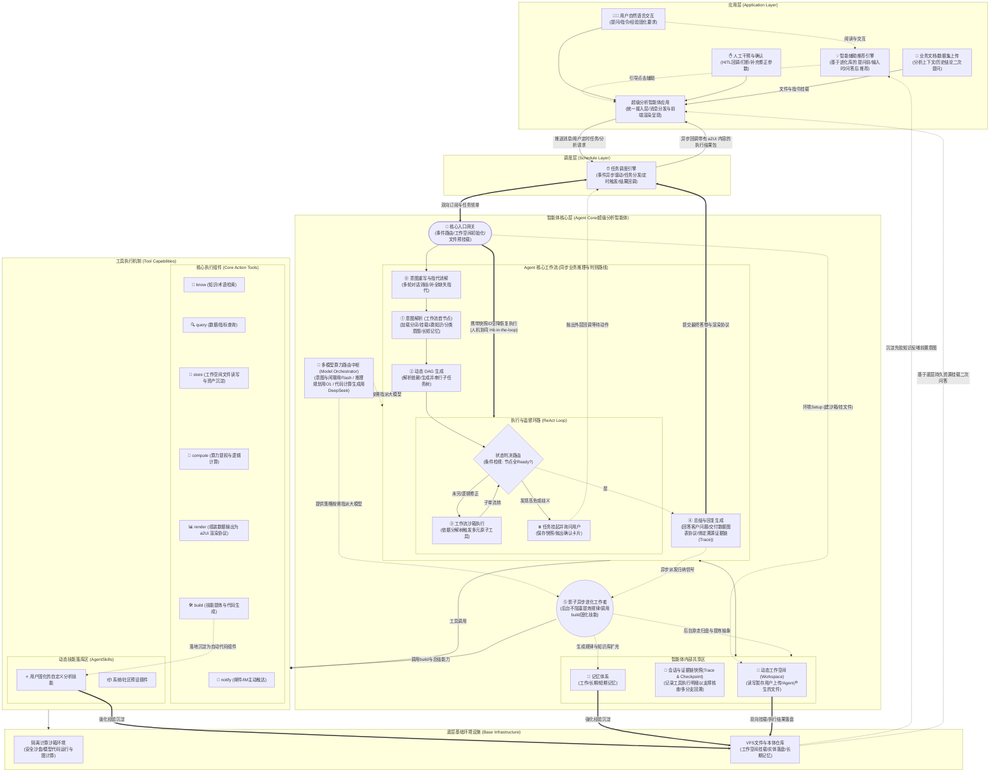

### 3.3技术架构

本节阐述《3.1功能架构》中各逻辑模块“如何被真实技术栈支撑落地”。整个系统以 **Deep Agent (核心智能组件) + LangGraph (图状态流转编排)** 为底座。下面逐一解构功能模块到技术栈的映射实现。

#### 3.3.1 技术架构四层模型与选型全景

在这套技术架构中，系统通过严格解耦被划分为自上而下的 **四大结构层** 以及一条 **旁路进化辅助线**。我们将《3.1 功能架构》中的所有业务结节，落盘到这四层的商用/开源技术栈图谱中：

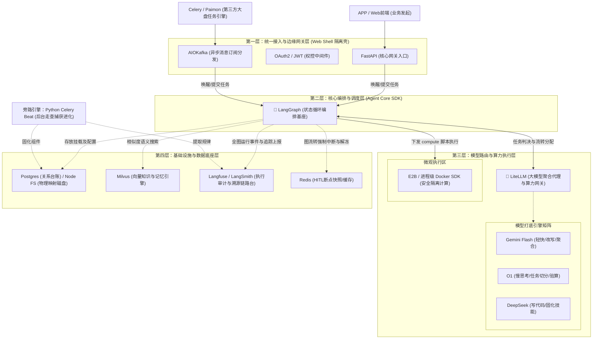

针对业务关切的核心技术如何落地，系统在这**四大结构层级**中，采用了以下技术组合予以实现：

**1. 统一接入与边缘网关层（外壳）**
*   **(解答) 核心网关入口用什么支撑**：使用 `FastAPI` (处理 HTTP 长连接与 Webhook) 配合 `AIOKafka` (长轮询消费底座)。网关本身不处理智能推理，只负责在 `Chroot` 限制下创建该会话的真实Linux沙盒目录空间，随后调用底层图引擎。

**2. 核心编排与调度层（中枢神经）**
*   **(解答) 回答溯源用什么实现**：强制引入 `Langfuse`（或 `LangSmith`）。LangGraph 的每一个微小流转、Prompt生成与原子工具的返回值，都会被监听器原生上报给平台，并凝结为一个带 UI 界面展示的 TraceID 随协议包返回前端供客户查证。
*   **(解答) HITL 与恢复用什么实现**：这是 `LangGraph` 最强大的原生特性 (`interrupt_before` 节点阻断机制) + `RedisSaver (检查点切片存储)`。发现高危判定直接挂起，状态永久存入 Redis；等待前台指令传来后沿原 `Thread_ID` 完美续跑。

**3. 模型路由与算力执行层（大脑前额叶与手脚）**
*   **(解答) 多模型协同与路由用什么实现**：通过 `LiteLLM` 万能聚合代理进行路由。上层不用写好几套模型 API SDK，统一调用 LiteLLM，由其内部代理规则根据传入任务的 `tag`（如：复杂推理路由给 O1，写代码发送给 DeepSeek），实现无缝分切重组。
*   **(解答) 分词和意图重写用什么支撑**：采用 “极速小模型（Qwen/Gemini）+ BM25检索字典”组合方案。不把这么轻的活交给超大模型，省时省钱，且通过结合企业既定检索词典防止术语越界。
*   **(解答) 核心执行与动态落库用什么支撑**：8 大原子工具基于 LangChain 的 `@tool` 标准书写。而在 `T_COMPUTE` 环节执行逻辑或用户存入的自定义脚本，必须调用 `E2B`（专为受限AI代码打造的沙盒云）或者在轻量 `Docker SDK` 内封闭演算。动态技能通过 Python 标准的 `importlib` 热更挂载。

**4. 基础设施与数据底座层（基底）**
*   **(解答) 召回记忆用什么支撑**：使用 `LangChain VectorStores` 封装类直接对接 `Milvus` 高性能向量引擎。长文本与历史规律落库转交向量映射，需要提取时执行 `Hybrid Search (混合近似度查找)` 喂改大模型。

**附加旁路线**
*   **(解答) 自我进化用什么支撑**：系统严防进化阻塞业务，通过引入 `Celery Beat`（或原生 Crontab）构成旁路微服务引擎。它在闲时深夜自动爬取 Langfuse 追踪台中的高分调用套路日志，反刍给代码大模型分析封装成 `.py` 后写入虚拟文件系统存储。

#### 3.3.2 内部工作流底座缝合 (Deep Agent 映射)

在智能体核心区 `AGENT_CORE`，所有节点（意图解析、DAG规划、沙箱执行等）都不采用传统的线性业务代码书写，而是 **以图代码**。
*   `AgentState (数据总线)`：全局的 TypeDict 大字典，用于挂载会话中转的所有资源。
*   `Nodes (流转节点)`：架构图上的圆圈即为封装好的纯异步 Python 任务函数。
*   `Conditional Edges (逻辑判定)`：`CHECKER` 就是有向图上根据 `AgentState` 挂件状态进行判决的条件路由分支。

#### 3.3.3 第三方大盘调度与虚拟路径挂载机制

*   **对接 `TASK_ENGINE`** : 外部大盘（如 Paimon/Celery 等成熟任务队列）负责全局算力限流和波峰削减。当外部放宽算力门限塞入任务包，`AGENT_GATEWAY` 通过 HTTP长连或 MQ 消费拉起本地的 LangGraph 图谱运行。运行完成后，网关只负责将组装好的图表组件通过 Webhook 回调推送走，不参与分布式锁和重试调度。
*   **挂载 `VFS 工作区`** :大模型不懂绝对物理路径的穿透管理。必须在架构入口的 `Setup` 步骤中拦截。网关基于本次 `Session_ID`，在磁盘按规范（参考4.2）划割 `/data/users/...` 的新目录，然后以硬编码 `state["workspace_root"]` 的形式传接入图状态字典。之后系统内无论是 `store` 还是 `compute` 工具，全部强制被“圈禁”在这个挂载路径下进行读写（如果走沙箱，则直接作为挂载卷 `/app/workspace/` 映射），完美隔绝租户脏数据泄漏。

#### 3.3.4 双代码仓库物理隔离部署规划

为了保证该 AI 中后台底座可以在多业务线高频复用，工程必须在物理层面进行防腐架构隔离设计，严禁合在同一个单体项目库中维护：

1. **引擎核心库：`whale_agent_engine`（深层逻辑/可发行 SDK）**
   * 定位：沉淀 Agent 所有原子工具、多模型路由策略分发、LangGraph 图流程声明与 `EVO_WORKER` 的骨架代码。
   * 防腐红线：此仓库中严禁存在任何业务级权限（Login/SSO）、API Route（路由注册）、以及非通用的特定业务表的直接业务实现逻辑，保持绝对的正交属性。
2. **Web 通讯壳工程：`whale_data_cloud_app`（外设接入与鉴权）**
   * 定位：对外接客的服务应用微服务端口（FastAPI/Spring Boot等技术栈部署节点）。
   * 业务实现：利用 Python 的包依赖挂载 `whale_agent_engine` 进行使用。负责接听外侧 `TASK_ENGINE` 的调度指令；处理租户并发限流与 Web 端的数据返回转化等业务脏活。


### 3.5 仓库规划

为严格贯彻《3.3.4 双代码仓库物理隔离部署规划》中的“防腐层”设计理念，系统项目代码将被组织在两个完全独立的 Git 仓库中。其目录结构范例如下：

#### 3.5.1 引擎核心库：`whale_agent_engine`

**[重构说明]**：在审视了最新的技术生态后，本仓库放弃从零重写状态图，转而引入功能强大且完全解耦的 **Deep Agents SDK (Agent Harness)**。由于 Deep Agents 原生内置了“多步规划、沙箱文件流转(Backends)、长短记忆池、底层原子工具调度”这些能力缝合，我们不再手搓底层的 `Nodes / Edges`。

本核心库的定位变更为：**基于 Deep Agents API 进行重载与企业特色能力编排，对外提供标准化调用接口。**

```text
whale_agent_engine/
├── whale_agent_engine/         # 核心代码包
│   ├── gateway/                # [映射 AGENT_GATEWAY 核心网关] SDK 提供的开箱即用网关代理层
│   │   ├── http_server.py      # 事件路由与同步调用 HTTP 代理器 (供外部快速拉起)
│   │   ├── mq_consumer.py      # 异步订阅消费者桥接器 (接驳外部 TASK_ENGINE)
│   │   └── sandbox_init.py     # 负责先序执行 [工作空间初始化/文件预挂载]，随后点火核心图
│   ├── agent_factory.py        # [映射 AGENT_ORCH 核心工作流] 调用 create_deep_agent() 组装完整图流转
│   ├── orchestration/          # [映射 LLM_ROUTER 模型协同器]
│   │   └── llm_router.py       # (多模型路由中枢) 意图闲聊切 Flash/算理切 O1/代码切 DeepSeek
│   ├── backends/               # [映射 Agent 记忆/工作区/会话管理 三部曲] 重载 DeepAgents 虚拟环境
│   │   ├── workspace_vfs.py    # (映射 WORKSPACE) 动态工作空间，接管 agent 的文件存取落在沙箱
│   │   ├── session_trace.py    # (映射 SESSION_TREE) 桥接 LangSmith/Postgres 记录执行明细支持回溯
│   │   └── memory_manager.py   # (映射 MEM_MGR) 桥接 Milvus 的长短期记忆调度池
│   ├── core_tools/             # [映射 CORE_TOOLS 工具箱] 注入给智能体的企业重度业务原子工具 (@tool)
│   │   ├── compute.py          # E2B 沙箱投递与专属代码执行器
│   │   ├── query.py            # 连接企业云数仓打通权限的聚合查询器
│   │   └── store.py            # 高级 VFS 文件锁与分发机制
│   ├── skills/                 # [映射 DYNAMIC_SKILLS 动态技能区] (供 Agent 面向任务流做自动挂载)
│   │   ├── standard_charts/    # 企业图表组件规范技能 (.md)
│   │   └── ...                 
│   ├── mcp_servers/            # [外部工具生态集成] Model Context Protocol 配置区
│   │   └── .mcp.json           # 配置第三方外部无穷能力库 (如大盘信息、搜索引擎等)
│   └── shadow_worker/          # 旁路进化辅助线
│   │   └── celery_tasks.py     # 夜间捞取运行 Trace 分析总结并固化注册回 skills/
├── tests/                      # 单元测试 (纯逻辑演算模拟测试)
├── requirements.txt            # 包含 deepagents, langchain, litellm 等核心依赖
└── setup.py                    # 标记此项目可被打包发布，供应用层 install
```

#### 3.5.2 外部业务壳工程示例：`whale_data_cloud_app`

**[定位特例说明]**：必须明确，本仓库**不再属于核心层资产**。它类似于调用 `langchain / deepagents` 这些工具的一个外围独立业务工程。它可以由任何外包团队开发，可以使用 `FastAPI` 也可以使用 Java 的 `Spring Boot` 乃至前端 `Next.js` 全栈实现。其开发自由度极高，只需通过 `pip install whale_agent_engine` 进行对接即可。下面仅给出一种 Python Web 宿主的参考形态：

```text
whale_data_cloud_app/           # (面向 C 端业务的独立应用，想怎么写怎么写)
├── app/                        
│   ├── api/                    
│   │   └── chat_routes.py      # 面向 C 端浏览器的自定义 HTTP 对话报文接口
│   ├── middleware/             
│   │   ├── auth.py             # 千人千态的 JWT / 企业 SSO 单点登录验证
│   │   └── billing.py          # 企业租户计费拦截、API 并发限流模块
│   ├── services/               
│   │   └── do_analysis.py      # [业务对接] 引入 `whale_agent_engine.gateway`，调用下层核心分析能力
│   └── main.py                 # APP 服务启动脚手架
├── Dockerfile                  # 打包业务容器
└── requirements.txt            # 记录业务所需的各类 Web 框架包
```

## 4 模块设计


### 4.1 极简工具集机制

#### **4.1.1 核心原子工具**

| 工具名称   | 功能描述           | Token消耗  | 使用场景                                         | 对应功能模块           |
| ---------- | ------------------ | ---------- | ------------------------------------------------ | ---------------------- |
| `know`     | 知识检索与规划工具 | ~50 tokens | 检索业务知识/本体知识，生成数据查询计划          | **2.1 知识服务**       |
| `query`    | 数据查询工具       | ~50 tokens | 执行结构化/非结构化数据查询，支持DSL和自然语言   | **2.2 数据服务**       |
| `compute`  | 计算执行工具       | ~50 tokens | 执行Python代码、数据分析、模型计算               | **1.2 计算与中间件**   |
| `simulate` | 沙箱推演工具       | ~50 tokens | 提供What-If推演场景下的数据隔离计算与模拟        | **1.2 沙箱引擎**       |
| `render`   | 渲染生成工具       | ~50 tokens | 生成可视化组件配置、排版，并产出标准a2Ui渲染协议       | **4.1 分析界面**       |
| `notify`   | 通知与触达工具     | ~50 tokens | 往企微、钉钉或邮箱发送邮件或预警消息             | **消息推送模块**       |
| `build`    | 工具抽象固化工具   | ~50 tokens | 分析上下文步骤，生成标准Python执行流注册为Skill | **自举与动态技能库**   |
| `store`    | 存储管理工具       | ~50 tokens | 保存/读取会话状态、中间结果、资产沉淀            | **3.1 资产沉淀**       |

#### 4.1.2 Skill扩展机制

- **Skills目录**：`~/.datacloud/skills/` 存放可复用的技能包
- **按需加载**：agent需要时才读取Skill的README，理解如何使用
- **自动注册**：Skill执行后自动注册为临时工具，可在当前会话中使用
- **Token效率**：不需要的Skill不占用上下文窗口

**示例：**

```markdown
# ~/.datacloud/skills/advanced-chart.md
## Advanced Chart Generator
生成复杂的数据可视化图表，支持多维度分析。

用法：`advanced-chart <data> <chart-type> <options>`
- data: 数据源（JSON或文件路径）
- chart-type: 图表类型（heatmap, sankey, treemap等）
- options: 图表配置选项

示例：
advanced-chart sales_data.json heatmap --x-axis=month --y-axis=region
```


#### 4.1.3 渐进式工具加载机制

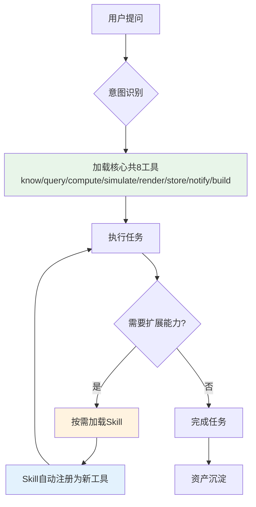

### 4.2 文件管理机制

#### 4.2.1 文件管理规范

文件空间目录规范,

1、固化根目录：

- public/ 所有应用共享目录
- {userId}_public/   用户内共享的目录
- {userId}_private   用户内不共享的目录

2、按1的三个根目录，再按 应用级、用户、会话、任务分为四层组织。

```
|public/                               # 应用级
├── .datacloud/                        # dataCloud 应用自带技能
│   ├── skills/                        # 5个原子技能
│   │   ├── time-series.py
│   │   └── time-series.md

|── {userId}_public/                   # 用户级
├── memory/
│   ├── memory.md 					   # 公共长期记忆
│   ├── memory-datacloud.md            # 公共长期记忆(dataCloud)
├──session-${session_id}/			   # 会话级（持久化）
│   │── short-memory.jsonl 	   		   # 短期记忆
│   ├── user-data/                     # 用户上传的数据（跨任务共享）
|   |── time-series.doc
├── .datacloud/                        # dataCloud 应用（用户生成技能）
│   ├── skills/                        # 5个原子技能
│   │   ├── time-series.py
│   │   └── time-series.md

|{userId}_private/.datacloud/workspaces/   # 用户级
├── session-{session_id}/              # 会话级（持久化）
│   ├── skills/                        # 会话中生成的Skills（跨任务共享）
│   │   ├── time-series.py
│   │   └── time-series.md
│   ├── cache/                         # 缓存数据（跨任务共享）
│   ├── state.json                     # 会话状态（持久化）
│   └── tasks/                         # 任务目录
│       ├── task-{task_id}/            # 任务级（临时）
│       │   ├── temp/                  # 任务临时文件
│       │   │   ├── data.csv
│       │   │   └── intermediate.json
│       │   ├── output/                # 任务输出结果
│       │   │   ├── result.json
│       │   │   └── chart.png
│       │   ├── branches/              # 分支目录
│       │   │   ├── branch-{branch_id}/ # 分支级（临时）
│       │   │   │   ├── temp/          # 分支临时文件
│       │   │   │   └── result.json    # 分支结果
│       │   │   └── ...
│       │   └── state.json             # 任务状态
│       └── ...
└── ...
```

#### 4.2.2 文件读写工具


#### 4.2.3 沙箱管理工具【待补充】


### 4.3 会话管理机制

#### 4.3.1 通信协议(SSE)


#### 4.3.2 会话分支机制

**树状会话结构：**

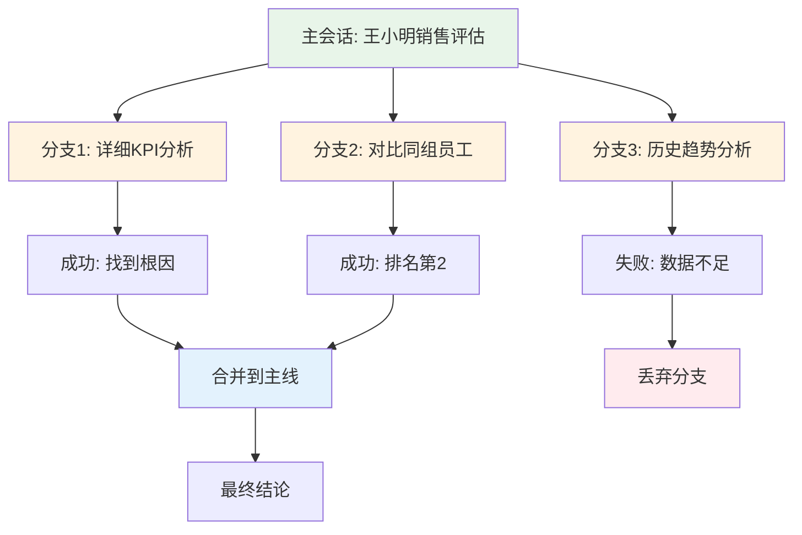

**分支机制特性：**

1. **任意节点分叉**：用户或agent可以在执行过程中创建新分支
2. **独立探索**：分支拥有独立的上下文和执行环境
3. **并行执行**：多个分支可以并行探索不同假设
4. **智能合并**：成功的分支自动合并到主线，失败的分支可丢弃
5. **回溯能力**：可以回到任意历史节点重新探索

**分支创建场景：**

- 用户说"等等，我想看看另一种分析方法"
- Agent遇到不确定情况，创建多个假设分支并行验证
- 某个工具调用失败，创建替代方案分支

#### 4.3.3 【补充】跨模型协同机制

**多模型协作机制：**

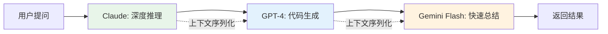

**上下文交接流程：**

1. **自动序列化**：将当前模型的上下文（包括思考过程、工具调用历史）转换为标准格式
2. **格式转换**：根据目标模型的API格式自动转换
3. **无缝传递**：新模型接收完整上下文，无需重新解释
4. **成本优化**：复杂推理用Claude，代码生成用GPT，总结用Gemini Flash

**使用场景：**

- 复杂分析任务：Claude做规划 → GPT生成代码 → Gemini总结
- 成本敏感场景：简单任务用便宜模型，复杂任务用强模型
- 能力互补：结合不同模型的优势

### 4.4 事件驱动机制

对接基础设置，通过事件驱动执行。

#### 4.4.1 事件驱动机制

一、事件类型：

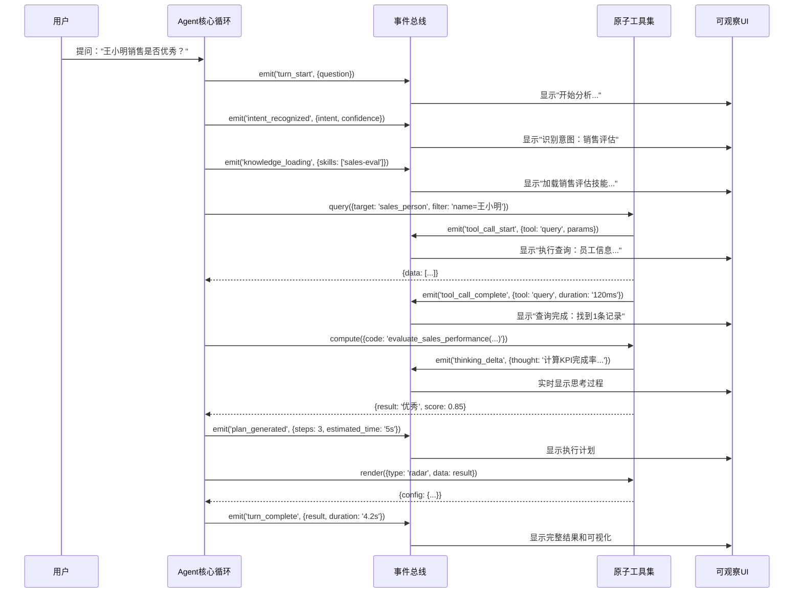

**细粒度事件类型：**

| 事件类型             | 描述         | 用途                       |
| -------------------- | ------------ | -------------------------- |
| `turn_start`         | 新回合开始   | 重置UI状态，显示加载动画   |
| `intent_recognized`  | 意图识别完成 | 显示识别的意图和置信度     |
| `knowledge_loading`  | 知识加载中   | 显示正在加载的Skills/知识  |
| `plan_generated`     | 计划生成完成 | 显示执行计划和预估时间     |
| `tool_call_start`    | 工具调用开始 | 显示正在执行的工具和参数   |
| `tool_call_complete` | 工具调用完成 | 显示执行结果和耗时         |
| `thinking_delta`     | 思考过程更新 | 实时显示agent的思考内容    |
| `error_occurred`     | 错误发生     | 显示错误信息和自动修正尝试 |
| `branch_created`     | 创建分支     | 显示新的探索路径           |
| `branch_merged`      | 分支合并     | 显示合并的结果             |
| `turn_complete`      | 回合完成     | 显示最终结果和总结         |


#### 4.4.2 事件中断恢复

**消息队列设计：**

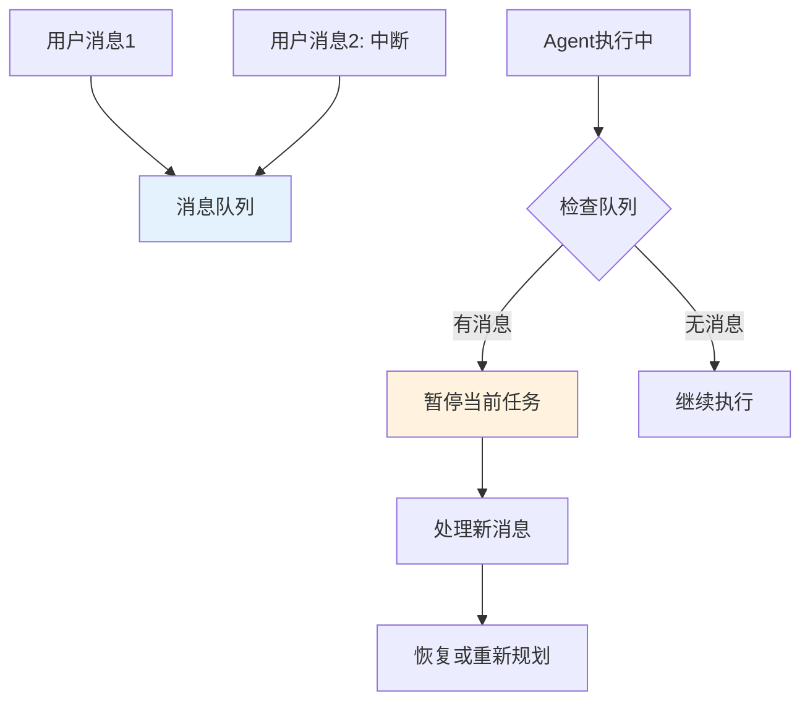

**特性：**

1. **随时插入**：用户可以在agent执行时发送新消息
2. **安全中断**：支持Ctrl+C等中断信号，安全停止当前任务
3. **状态保存**：中断时保存当前状态，可恢复执行
4. **优先级处理**：紧急消息可以打断当前任务


### 4.6 agent进化机制

**设计目标：** 让Agent能够从每次执行中学习，积累经验，持续优化决策能力和工具使用效率，实现"越用越聪明"的自我进化。

**核心机制：**

###### **6.5.3.7.1 执行反馈学习机制**

每次工具调用后自动记录执行反馈，用于优化后续的工具选择和使用策略。

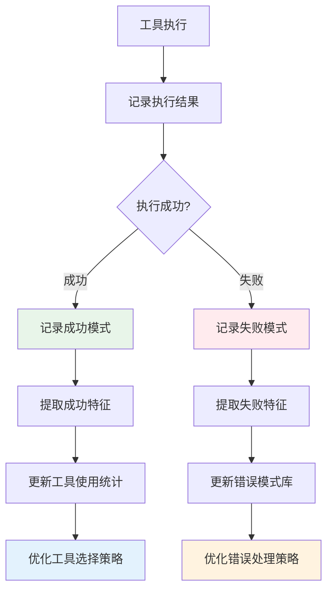

**执行记录结构：**

```json
{
  "execution_id": "exec-20260201-001",
  "timestamp": "2026-02-01T10:30:00Z",
  "tool": "query",
  "params": {
    "target": "sales_person",
    "filter": "name=王小明"
  },
  "execution_time_ms": 120,
  "result": {
    "status": "success",
    "row_count": 1,
    "data_size_kb": 2.5
  },
  "user_feedback": "satisfied",
  "context": {
    "session_id": "session-001",
    "task_id": "task-001",
    "problem_type": "销售评估"
  }
}
```

###### **6.5.3.7.2. 决策模式沉淀机制**

将成功的决策过程抽象为可复用的模式，支持相似问题的快速解决。

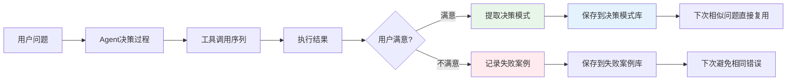

**决策模式结构：**

```json
{
  "pattern_id": "sales-evaluation-pattern-001",
  "pattern_name": "销售员工评估模式",
  "problem_type": "销售评估",
  "problem_template": "{employee_name}作为销售是否优秀？",
  "tool_sequence": [
    {
      "step": 1,
      "tool": "know",
      "purpose": "理解问题，检索销售评估知识",
      "expected_output": "评估标准和查询计划"
    },
    {
      "step": 2,
      "tool": "query",
      "purpose": "查询员工基本信息",
      "dsl_template": "SELECT * FROM sales_person WHERE name = '{employee_name}'"
    },
    {
      "step": 3,
      "tool": "query",
      "purpose": "查询KPI目标",
      "dsl_template": "SELECT kpi_sum FROM sales_person_kpi_summary WHERE emp_no = ? AND kpi_year = ?"
    },
    {
      "step": 4,
      "tool": "query",
      "purpose": "查询实际完成",
      "dsl_template": "SELECT SUM(contact_scale) FROM sales_person_kpi_detail WHERE emp_no = ? AND YEAR(contact_date) = ?"
    },
    {
      "step": 5,
      "tool": "compute",
      "purpose": "计算KPI完成率",
      "code_template": "completion_rate = actual / target * 100"
    },
    {
      "step": 6,
      "tool": "render",
      "purpose": "生成雷达图可视化",
      "chart_type": "radar"
    }
  ],
  "success_rate": 0.95,
  "avg_execution_time_seconds": 4.2,
  "usage_count": 23,
  "last_used": "2026-02-01T10:30:00Z",
  "tags": ["销售", "员工评估", "KPI"]
}
```

###### **6.5.3.7.3. 术语自动发现与沉淀机制**

从用户提问和执行过程中自动发现新术语，并沉淀到术语库中。

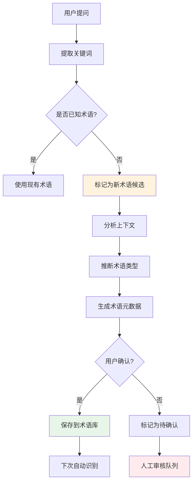

**术语发现规则：**

- **高频出现**：同一词汇在多个问题中出现 → 候选术语
- **共现分析**：与已知术语经常一起出现 → 相关术语
- **实体识别**：用户明确指代的实体（如"王小明"） → 实例术语
- **上下文推断**：根据上下文推断术语类型（概念/实例/属性）

**术语沉淀结构：**

```json
{
  "term_id": "term-20260201-001",
  "term_name": "王小明",
  "term_type": "实例术语",
  "parent_term": "员工",
  "discovery_source": "用户提问",
  "discovery_context": "王小明作为销售是否优秀？",
  "usage_count": 5,
  "first_seen": "2026-02-01T10:00:00Z",
  "last_seen": "2026-02-01T15:30:00Z",
  "confidence": 0.9,
  "status": "confirmed"
}
```

###### **6.5.3.7.4. 查询逻辑自动沉淀机制**

将成功的查询逻辑抽象为可复用的查询模板。

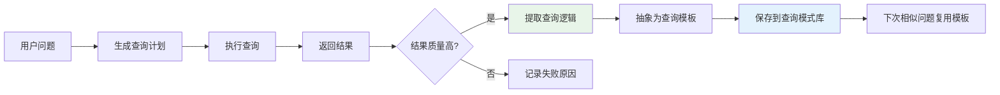

**查询逻辑模板结构：**

```json
{
  "query_template_id": "employee-kpi-query-001",
  "template_name": "员工KPI完成情况查询",
  "description": "查询指定员工在指定年度的KPI目标与实际完成情况",
  "input_params": [
    {
      "name": "employee_name",
      "type": "string",
      "description": "员工姓名"
    },
    {
      "name": "year",
      "type": "integer",
      "description": "年度"
    }
  ],
  "query_steps": [
    {
      "step": 1,
      "tool": "know",
      "action": "识别员工实体",
      "param_mapping": {
        "employee_name": "input.employee_name"
      },
      "output": "employee_entity"
    },
    {
      "step": 2,
      "tool": "query",
      "action": "查询KPI目标",
      "dsl": "SELECT kpi_sum FROM sales_person_kpi_summary WHERE emp_no = ? AND kpi_year = ?",
      "param_mapping": {
        "emp_no": "step1.employee_entity.emp_no",
        "kpi_year": "input.year"
      },
      "output": "kpi_target"
    },
    {
      "step": 3,
      "tool": "query",
      "action": "查询实际完成金额",
      "dsl": "SELECT SUM(contact_scale) as actual FROM sales_person_kpi_detail WHERE emp_no = ? AND YEAR(contact_date) = ?",
      "param_mapping": {
        "emp_no": "step1.employee_entity.emp_no",
        "year": "input.year"
      },
      "output": "kpi_actual"
    }
  ],
  "success_rate": 0.98,
  "avg_execution_time_ms": 350,
  "usage_count": 156,
  "last_used": "2026-02-01T15:30:00Z"
}
```

**6.5.3.7.5. 跨会话经验复用机制**

将经验沉淀到全局经验库，支持跨会话复用。

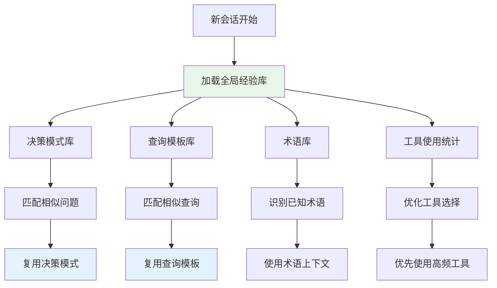

**经验库目录结构：**

```
~/.datacloud/experience/
├── decision-patterns/          # 决策模式库（跨会话共享）
│   ├── sales-evaluation.json
│   ├── trend-analysis.json
│   └── root-cause-analysis.json
├── query-templates/             # 查询模板库（跨会话共享）
│   ├── employee-kpi.json
│   ├── org-performance.json
│   └── customer-relationship.json
├── tool-statistics/             # 工具使用统计（跨会话共享）
│   ├── tool-usage.json         # 工具使用频率统计
│   ├── tool-combinations.json  # 工具组合成功率
│   └── tool-performance.json   # 工具性能统计
├── terminology/                 # 术语库（跨会话共享）
│   └── terms.db
└── failure-cases/               # 失败案例库（用于避免重复错误）
    ├── query-failures.json
    └── tool-failures.json
```

**工具使用统计结构：**

```json
{
  "tool_statistics": {
    "know": {
      "total_calls": 1250,
      "success_count": 1180,
      "failure_count": 70,
      "avg_execution_time_ms": 150,
      "success_rate": 0.944,
      "common_failures": [
        {
          "error_type": "knowledge_not_found",
          "count": 45,
          "solution": "扩展知识库"
        }
      ]
    },
    "query": {
      "total_calls": 3200,
      "success_count": 3100,
      "failure_count": 100,
      "avg_execution_time_ms": 120,
      "success_rate": 0.969,
      "common_failures": [
        {
          "error_type": "permission_denied",
          "count": 60,
          "solution": "检查权限配置"
        }
      ]
    }
  },
  "tool_combinations": [
    {
      "sequence": ["know", "query", "compute"],
      "usage_count": 450,
      "success_rate": 0.96,
      "avg_total_time_ms": 420
    },
    {
      "sequence": ["know", "query", "query", "render"],
      "usage_count": 320,
      "success_rate": 0.94,
      "avg_total_time_ms": 580
    }
  ]
}
```

###### **6.5.3.7.6. 主动优化与推荐机制**

定期分析执行数据，主动优化工具使用策略和决策模式。

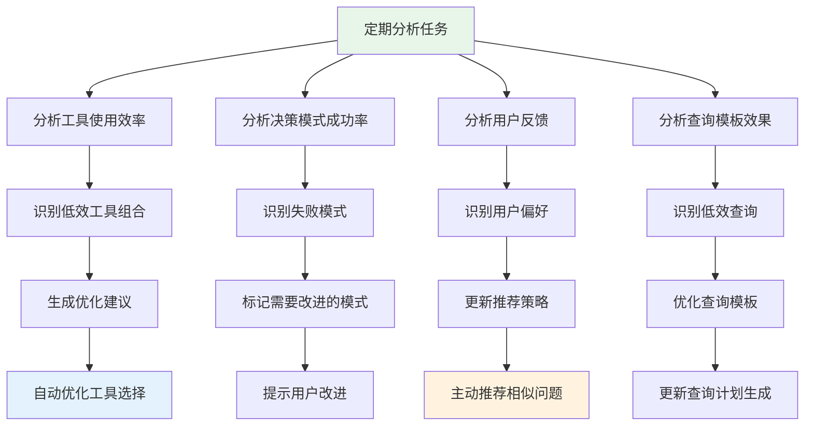

**优化策略示例：**

- **工具选择优化**：优先使用成功率>95%的工具组合
- **查询计划优化**：复用成功率>90%的查询模板
- **错误预防**：识别常见错误模式，提前规避
- **性能优化**：优先使用平均执行时间<200ms的工具组合

###### **6.5.3.7.7. 学习循环完整流程**

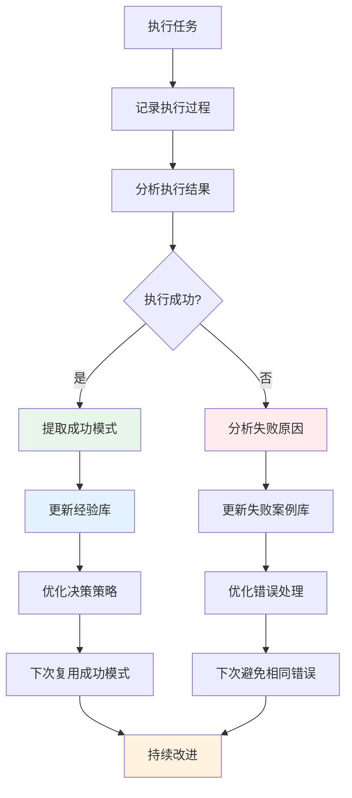

**8. 与OpenClaw/Pi-Mono的对比**

| 进化机制         | OpenClaw/Pi-Mono  | dataCloud 2.0（极简主义设计） |
| ---------------- | ----------------- | ----------------------------- |
| **代码生成自举** | ✅ Agent自己写工具 | ✅ 已包含                      |
| **会话级经验**   | ✅ 会话内工具复用  | ✅ 完整设计                    |
| **跨会话经验**   | ❌ 不支持          | ✅ 经验库共享                  |
| **决策模式沉淀** | ❌ 不支持          | ✅ 完整设计                    |
| **术语自动发现** | ❌ 不支持          | ✅ 完整设计                    |
| **查询逻辑沉淀** | ❌ 不支持          | ✅ 完整设计                    |
| **主动优化**     | ❌ 不支持          | ✅ 定期分析优化                |
| **社区共享**     | ✅ Pi Packages     | ⚠️ 可选（企业内共享）          |


### 4.7 完整闭环流程图

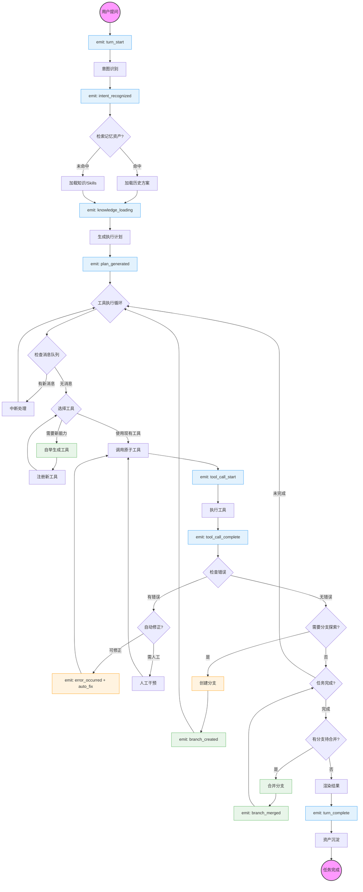

## 5 其它

1、考虑本体的服务日志。

2、自动调度运营人员。分析解决不了的，调度运营人员解决。

3、用终端来展示数据，其实和用markdown展示数据是一样的。


4、如何是面向ai的架构：测试用例构建机制。

5、复测机制。

6、api内部提供的是否有价值？

--agent如何评估？

7、我们到底能够孪生啥？

```
1. 孪生实体与网络
实体：全球 3000 + 家快递公司、数百万个网点、运输车辆 / 航班 / 班列、分拣中心、驿站等。
网络：实体之间的连接关系（比如北京→上海的运输线路、某网点到小区的配送路径），形成一张覆盖全球的物流拓扑网。
2. 孪生状态与事件
实时状态：包裹当前位置、运输工具的位置与负载、网点的拥堵度、天气对线路的影响。
历史事件：过去 15 年里每一次快递查询、每一条包裹轨迹、每一次延误 / 异常的记录。
3. 孪生规则与规律
业务规则：不同快递公司的价格体系、时效承诺、禁运物品规则。
数据规律：从海量历史数据中挖掘出的规律，比如 “双十一期间某线路平均延误 24 小时”、“雨季华南地区配送时效下降 30%”。
4. 孪生未来与预测
这是它最核心的价值，也是和传统地图 / 数据库的本质区别：
```

7、临时存储是用来存储历史记录的内容的，可能是记忆，也可以知识或数据。

8、洞察几个需要孪生岗位的日常工作，介入并赋能他们。

9、

## 6 开发计划
