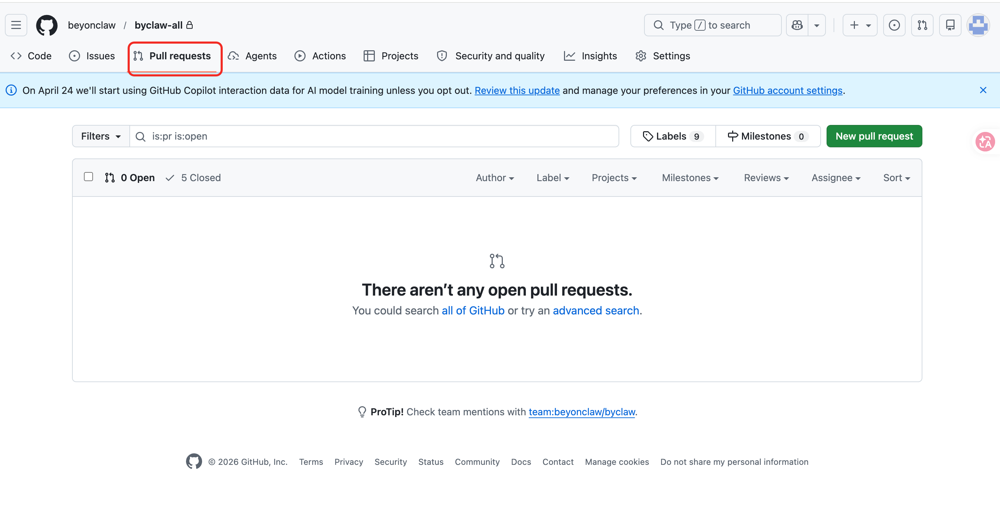
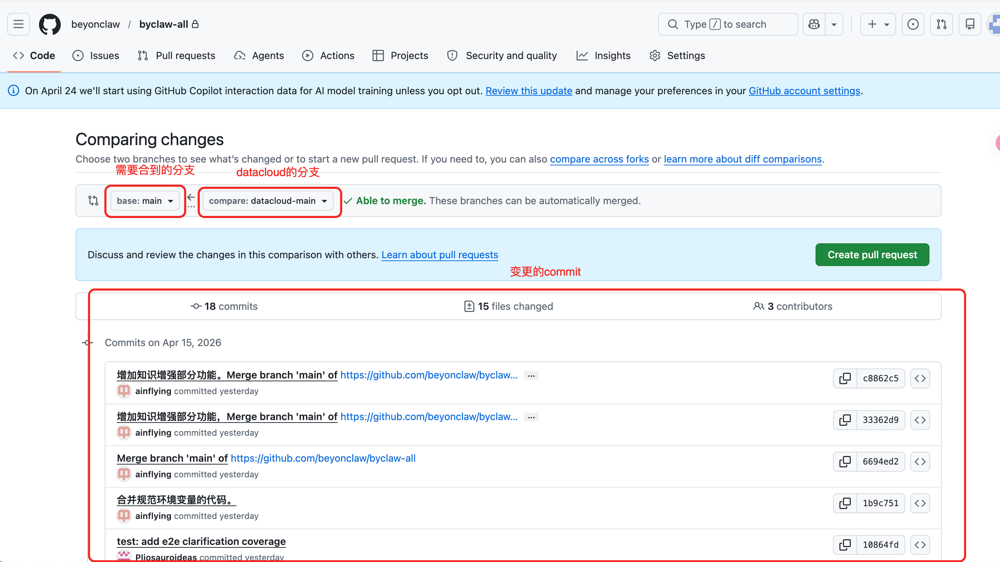

# 发包部署说明

本文档为简化移交版。

当前仓库的 PyPI 自动发布流程已经配置完成，日常发版不需要本地手工执行 `uv publish`。只要本地验证通过，推送 GitHub tag 即可自动发布。

## 前置说明

- 发布包名：`by-datacloud`
- GitHub 自动发布工作流：`.github/workflows/publish-pypi.yml`
- tag 触发规则：`by-datacloud-v*`
- 发布目标：PyPI

说明：

- PyPI Trusted Publisher 和 GitHub workflow 已配置完成。
- 发版人员只需要完成版本更新、本地验证、提交代码、推送 tag。

## 标准发版流程

### 1. 更新版本号

发布前至少同步以下版本：

```toml
# pyproject.toml
[project]
version = "x.y.z"
```

```python
# src/by_datacloud/__init__.py
__version__ = "x.y.z"
```


### 2. 本地验证

在仓库根目录执行：

```bash
uv sync
uv run ruff check src/by_datacloud packages
uv build
```


本地构建成功后，说明发包产物基本正常。

### 3. 提交代码

```bash
git commit -m "chore(release): 发布 by-datacloud x.y.z"
git push origin main
```

### 4. 打 tag 触发自动发布

```bash
git tag by-datacloud-vx.y.z
git push origin by-datacloud-vx.y.z
```

推送成功后，GitHub Actions 会自动：

1. 构建 `by-datacloud`
2. 上传构建产物
3. 发布到 PyPI

### 发布结果查看
发布后登录pypi看是否更新即可
https://pypi.org/project/by-datacloud/

## 构建镜像部署流程
在byclaw-all项目
### 先把 byclaw-data/pyproject.toml 改成：
```toml
by-datacloud>=0.1.5
```

### 升级uv-lock并检测
进入到byclaw-data执行以下命令
```bash
uv lock --upgrade-package by-datacloud
uv sync --dev
uv run ruff check .
```

### 提交代码
```bash
git commit -m "chore(byclaw-data): upgrade by-datacloud to x.y.z"
git push origin datacloud-main
```

### 在github上请求pr
1、去到pr页面



2、点击new pull request 创建新的pr


3、点击create pull request即可，看检测是否有问题，没问题等合并即可

### 部署
等构建完镜像后登录服务器执行pull.sh, stop-data.sh, start-data.sh

#### 环境变量变更
https://github.com/beyonai/byclaw-middleware/blob/main/envs/8888/.env
https://github.com/beyonclaw/byclaw-all/blob/main/.env.example
/data/byai/byaiAll/.env