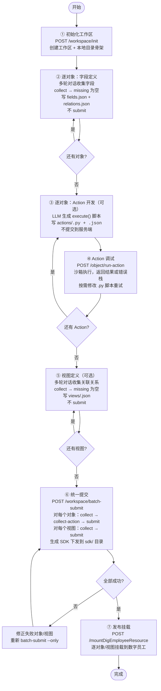

# 本体开发方案 — 对话式全流程设计

> 版本：3.0 | 更新：2026-06-25

## 目录

1. [设计总览](#一设计总览)
2. [工作区结构](#二工作区结构)
3. [整体开发流程](#三整体开发流程)
4. [服务端接口设计](#四服务端接口设计)
5. [生成式对象 SDK](#五生成式对象-sdk)
6. [Skill 设计](#六skill-设计)
7. [脚本层设计](#七脚本层设计)
8. [场景演示：差旅报销](#八场景演示差旅报销)

---

## 一、设计总览

### 1.1 核心思路

开发者全程通过自然语言与 `ontology-builder` Skill 对话，Skill（LLM 行为规范文件）将对话意图转化为 Bash 脚本调用，脚本调用服务端 API，**所有数据和状态都持久化在服务端工作区文件中**。

```
开发者（自然语言）
      ↕ 多轮对话
ontology-builder SKILL.md（LLM 行为规范）
      ↓ Bash 脚本调用
scripts/ 薄封装层（参数组装 + stdout JSON 解析）
      ↓ Redis 服务发现
byclaw-datacloud 服务（REST API）
      ↓
  ┌──────────────────────────────────────────────────────┐
  │  服务端工作区文件                  SQLite              │
  │  workspaces/{user}/{workspace}/   personal_object.db  │
  │  与本地目录结构完全镜像            对象数据持久存储      │
  └──────────────────────────────────────────────────────┘
```

### 1.2 关键设计决策

| 决策 | 说明 |
|------|------|
| 工作区统一管理 | 一个工作区对应一个业务模块，包含多个对象和视图，统一提交 |
| 服务端与本地镜像 | 服务端工作区目录结构与本地完全一致，collect 操作直接写服务端文件，无 Redis 暂存 |
| 视图在提交前开发 | 视图定义和对象定义一起维护在工作区，batch-submit 时统一提交 |
| 生成式 SDK | submit 时根据字段定义自动生成 `<entity_code>_sdk.py`，Action 脚本通过强类型 Mapper 操作数据 |
| SDK 注入而非 import | ScriptExecutor 运行 Action 脚本时自动注入 mapper 实例和实体类，脚本无需 import |
| 服务端调试 | `run-action` 接口在服务端用沙箱 SQLite 执行脚本，调试结果实时返回 |

### 1.3 与现有 structured-ontology-manager 的关系

`ontology-builder` 是在现有 Skill 之上的**编排层**，不替代现有 Skill：

- 现有 `structured-ontology-manager`：单对象单步操作，面向已有对象的维护
- `ontology-builder`：多对象工作区开发，面向从零开始的业务模块建设

脚本层复用现有脚本（`create_object.py`、`create_view.py` 等），新增工作区管理和批量操作脚本。

---

## 二、工作区结构

### 2.1 目录结构

服务端和本地采用**完全相同的目录结构**，collect 操作直接写服务端对应文件，本地目录是服务端的镜像（通过脚本同步拉取）。

服务端根路径：`{FILE_STORAGE_MINIO_MOUNT_PATH}/byclaw-datacloud/workspaces/{user_code}/`
本地根路径：`workspace/`（开发者工作目录下）

```
<workspace_name>/                  # 一个工作区 = 一个业务模块
├── workspace.json                 # 工作区元数据 + 各对象/视图提交状态
├── objects/
│   └── <entity_code>/
│       ├── definition.json        # 对象基本信息（名称、描述）
│       ├── fields.json            # 字段定义列表
│       ├── relations.json         # 出向关联关系（供视图推导用）
│       └── actions/
│           ├── <action_code>.py   # Action 执行脚本（含 execute 函数）
│           └── <action_code>.json # Action 元数据（入参/出参/权限）
├── views/
│   └── <view_code>.json           # 视图定义（含对象关联关系）
└── sdk/                           # batch-submit 后由服务端生成并下发
    └── <entity_code>_sdk.py       # 强类型 Mapper + 实体类
```

### 2.2 workspace.json 格式

`workspace.json` 只存元数据和提交状态，**不包含对象/视图的字段定义**——定义存在各自的文件中。

```json
{
  "workspace_name": "travel_reimbursement",
  "description": "差旅报销业务模块",
  "created_at": "2026-06-25T10:00:00Z",
  "objects": {
    "travel_application": {
      "status": "submitted",
      "actual_code": "p_travel_application_u001_a3f2c1",
      "resource_id": "res-abc123",
      "submitted_at": "2026-06-25T11:30:00Z"
    },
    "travel_itinerary": {
      "status": "draft",
      "actual_code": null,
      "resource_id": null,
      "submitted_at": null
    },
    "travel_expense": {
      "status": "failed",
      "actual_code": null,
      "error": "字段 expense_type 缺少 term_type_code 绑定"
    }
  },
  "views": {
    "v_travel_full": {
      "status": "draft",
      "actual_code": null,
      "resource_id": null
    }
  }
}
```

对象/视图状态机：`draft` → `submitted`（成功）或 `failed`（失败，含 error）
- 状态只由 `batch-submit` 写入，collect 阶段不改变状态
- 修正本地文件后重新执行 `batch-submit` 时，`failed` 条目自动重置为 `draft` 再重试

### 2.3 关键文件格式

**fields.json：**

```json
[
  {
    "property_code": "applicant_code",
    "property_name": "申请人",
    "data_type": "STRING",
    "ext_property": {
      "property_role_rule": {
        "property_role": "DIMENSION",
        "rule_type": "name"
      }
    },
    "term_type_code": "user_name",
    "rel_term_codeorname": "name"
  },
  {
    "property_code": "status",
    "property_name": "申请状态",
    "data_type": "STRING",
    "ext_property": {
      "property_role_rule": {
        "property_role": "DIMENSION",
        "rule_type": "status"
      }
    },
    "term_values": ["草稿", "已提交", "审批中", "已批准", "已拒绝"]
  },
  {
    "property_code": "total_amount",
    "property_name": "总金额",
    "data_type": "FLOAT",
    "ext_property": {
      "property_role_rule": {
        "property_role": "MEASURE",
        "rule_type": "amount"
      }
    }
  }
]
```

**relations.json**（当前对象的出向外键，供视图推导）：

```json
[
  {
    "source_field_code": "app_id",
    "target_object_code": "travel_application",
    "target_field_code": "id",
    "relation_type": "MANY_TO_ONE",
    "description": "行程归属的申请单"
  }
]
```

**views/v_travel_full.json：**

```json
{
  "view_code": "v_travel_full",
  "view_name": "差旅全视图",
  "view_desc": "申请关联行程和费用的聚合视图",
  "object_codes": ["travel_application", "travel_itinerary", "travel_expense"],
  "object_relations": [
    {
      "source_object_code": "travel_itinerary",
      "source_object_field_code": "app_id",
      "target_object_code": "travel_application",
      "target_object_field_code": "id",
      "relation_type": "MANY_TO_ONE"
    },
    {
      "source_object_code": "travel_expense",
      "source_object_field_code": "app_id",
      "target_object_code": "travel_application",
      "target_object_field_code": "id",
      "relation_type": "MANY_TO_ONE"
    }
  ]
}
```

---

## 三、整体开发流程

### 3.1 流程图



### 3.2 阶段说明

| 阶段 | 操作 | 服务端接口 | 本地产物 |
|------|------|-----------|---------|
| ① 初始化工作区 | 创建工作区 | `POST /workspace/init` | `workspace.json`、目录骨架 |
| ② 字段定义 | collect 字段（多轮） | `POST /object/collect` | `fields.json`、`relations.json` |
| ③ Action 开发 | LLM 生成脚本，collect-action 暂存 | `POST /object/collect-action` | `actions/<code>.py`、`.json` |
| ④ Action 调试 | 沙箱执行脚本 | `POST /object/run-action` | 修正后的 `.py` |
| ⑤ 视图定义 | collect 视图（多轮） | `POST /view/collect` | `views/<code>.json` |
| ⑥ 统一提交 | 批量提交全工作区 | `POST /workspace/batch-submit` | `sdk/<entity>_sdk.py` |
| ⑦ 发布挂载 | 挂载到数字员工 | `POST /mountDigEmployeeResource` | — |

**关键原则：** 阶段 ②③⑤ 的 collect 调用只是验证格式和暂存状态，**不 submit**。统一提交在阶段 ⑥ 一次性完成。

---

## 四、服务端接口设计

所有接口挂载在 byclaw-datacloud 服务，通过 Redis 服务发现访问。

**公共 Header：**

| Header | 说明 | 必填 |
|--------|------|------|
| `Beyond-Token` | 用户认证 token | 是 |
| `X-User-Code` | 用户工号，服务端从此 header 读取，不进入请求体 | 是 |

**存储路径约定：**

```
STORAGE_ROOT = {FILE_STORAGE_MINIO_MOUNT_PATH}/byclaw-datacloud/workspaces
工作区根目录  = {STORAGE_ROOT}/{user_code}/{workspace_name}/
```

**向后兼容：** 旧客户端只传 `session_id` 不传 `workspace_name` 时，继续走 Redis 暂存路径，行为不变。

### 4.1 接口总览

| 分类 | 方法 | 路径 | 说明 |
|------|------|------|------|
| 工作区 | GET  | `/api/v1/ontology-manager/workspace/list` | 列出当前用户所有工作区 |
| 工作区 | POST | `/api/v1/ontology-manager/workspace/init` | 初始化工作区 |
| 工作区 | GET  | `/api/v1/ontology-manager/workspace/{workspace_name}` | 查询工作区状态 |
| 工作区 | POST | `/api/v1/ontology-manager/workspace/batch-submit` | 批量提交 |
| 对象开发 | POST | `/api/v1/ontology-manager/object/collect` | 收集对象字段定义 |
| 对象开发 | POST | `/api/v1/ontology-manager/object/collect-action` | 收集 Action 定义 |
| 对象开发 | POST | `/api/v1/ontology-manager/object/run-action` | 调试 Action 脚本 |
| 对象开发 | POST | `/api/v1/ontology-manager/object/delete` | 删除对象 |
| 视图开发 | POST | `/api/v1/ontology-manager/view/collect` | 收集视图定义 |
| 视图开发 | POST | `/api/v1/ontology-manager/view/delete` | 删除视图 |
| 查询 | GET  | `/api/v1/ontology-manager/object/list` | 对象列表 |
| 查询 | GET  | `/api/v1/ontology-manager/object/{entity_code}` | 对象完整定义 |
| 查询 | GET  | `/api/v1/ontology-manager/object/{entity_code}/fields` | 对象字段列表 |
| 查询 | GET  | `/api/v1/ontology-manager/object/{entity_code}/actions` | 对象 Action 列表 |
| 查询 | GET  | `/api/v1/ontology-manager/object/{entity_code}/action/{action_code}` | 单个 Action 详情 |
| 查询 | GET  | `/api/v1/ontology-manager/view/list` | 视图列表 |
| 查询 | GET  | `/api/v1/ontology-manager/view/{view_code}` | 视图完整定义 |
| SDK  | GET  | `/api/v1/ontology-manager/workspace/{workspace_name}/sdk/{entity_code}` | 获取 SDK 文件 |
| 术语 | POST | `/api/v1/ontology-manager/term-types/list` | 术语类型列表（无需 workspace_name） |
| 术语 | POST | `/api/v1/ontology-manager/term-types/values` | 术语枚举值（无需 workspace_name） |
| 术语同步 | POST | `/api/v1/ontology-manager/object/sync-terms` | 全量同步虚拟表记录到术语库 |

### 4.2 列出用户工作区

**`GET /api/v1/ontology-manager/workspace/list`**

无请求参数，用户身份从 `X-User-Code` Header 读取。

响应：
```json
{
  "ok": true,
  "total": 2,
  "workspaces": [
    {
      "workspace_name": "travel_reimbursement",
      "workspace_desc": "差旅报销业务模块",
      "object_count": 4,
      "view_count": 1,
      "pending_count": 2,
      "has_pending": true,
      "pending_objects": ["travel_expense", "travel_invoice"],
      "pending_views": []
    },
    {
      "workspace_name": "hr_onboarding",
      "workspace_desc": "入职流程业务模块",
      "object_count": 3,
      "view_count": 0,
      "pending_count": 0,
      "has_pending": false,
      "pending_objects": [],
      "pending_views": []
    }
  ]
}
```

字段说明：

| 字段 | 类型 | 说明 |
|------|------|------|
| `workspace_name` | string | 工作区名称 |
| `workspace_desc` | string | 工作区描述 |
| `object_count` | int | 工作区内对象总数（含所有状态） |
| `view_count` | int | 工作区内视图总数（含所有状态） |
| `pending_count` | int | 未提交条目总数（`draft` + `failed` 的对象和视图之和） |
| `has_pending` | bool | 是否存在未提交条目，`true` 时应执行 `batch-submit` |
| `pending_objects` | string[] | 未提交对象编码列表 |
| `pending_views` | string[] | 未提交视图编码列表 |

服务端行为：扫描 `{STORAGE_ROOT}/{user_code}/` 下所有子目录，读取各 `workspace.json`，统计未提交（非 `submitted`）的对象和视图数量，按工作区名称排序返回。

---

### 4.3 工作区初始化

**`POST /api/v1/ontology-manager/workspace/init`**

请求参数：

| 参数 | 类型 | 必填 | 说明 |
|------|------|------|------|
| `workspace_name` | string | 是 | 工作区名称，snake_case，同一用户下唯一 |
| `description` | string | 否 | 工作区描述 |
| `objects` | string[] | 否 | 预声明的对象编码列表，创建时初始化目录 |

请求体：
```json
{
  "workspace_name": "travel_reimbursement",
  "description": "差旅报销业务模块",
  "objects": ["travel_application", "travel_itinerary", "travel_expense", "travel_invoice"]
}
```

响应：
```json
{
  "ok": true,
  "workspace_name": "travel_reimbursement",
  "objects": {
    "travel_application": {"status": "draft"},
    "travel_itinerary":   {"status": "draft"},
    "travel_expense":     {"status": "draft"},
    "travel_invoice":     {"status": "draft"}
  },
  "views": {}
}
```

服务端行为：
- 在 `{STORAGE_ROOT}/{user_code}/{workspace_name}/` 下创建目录骨架
- 写入 `workspace.json`（元数据 + 各对象 status=draft）
- 为每个声明的对象创建 `objects/{entity_code}/actions/` 目录

---

### 4.4 查询工作区状态

**`GET /api/v1/ontology-manager/workspace/{workspace_name}`**

路径参数：

| 参数 | 类型 | 必填 | 说明 |
|------|------|------|------|
| `workspace_name` | string | 是 | 工作区名称 |

响应：
```json
{
  "ok": true,
  "workspace_name": "travel_reimbursement",
  "description": "差旅报销业务模块",
  "created_at": "2026-06-25T10:00:00Z",
  "objects": {
    "travel_application": {
      "status": "submitted",
      "actual_code": "p_travel_application_u001_a3f2c1",
      "resource_id": "res-abc123",
      "submitted_at": "2026-06-25T11:30:00Z"
    },
    "travel_itinerary": {
      "status": "draft",
      "actual_code": null,
      "resource_id": null
    },
    "travel_expense": {
      "status": "failed",
      "actual_code": null,
      "error": "字段 expense_type 缺少 term_type_code 绑定"
    }
  },
  "views": {
    "v_travel_full": {
      "status": "draft",
      "actual_code": null,
      "resource_id": null
    }
  }
}
```

对象/视图状态机：

```
draft   ──→ submitted   （batch-submit 成功）
draft   ──→ failed      （batch-submit 失败，error 字段记录原因）
failed  ──→ submitted   （修正后重新 batch-submit 成功）
submitted ──→ dirty     （collect_object 写入字段变更后自动标记）
dirty   ──→ submitted   （re-submit 成功，执行增量 DDL 后）
dirty   ──→ failed      （re-submit 失败）
```

- `draft`：初始状态，表不存在，提交时执行 `CREATE TABLE`
- `submitted`：已提交且无待处理变更
- `dirty`：已提交但 fields.json 与上次快照不一致，需 re-submit
- `failed`：提交失败，error 字段记录原因

`collect_object` 写字段时，若对象已是 `submitted`，服务端自动对比字段快照，有变更则置为 `dirty`。`batch-submit` 时 `submitted` 状态的对象直接跳过。

---

### 4.5 收集对象字段定义

**`POST /api/v1/ontology-manager/object/collect`**

请求参数：

| 参数 | 类型 | 必填 | 说明 |
|------|------|------|------|
| `workspace_name` | string | 是* | 工作区名称，与 session_id 二选一，优先 |
| `session_id` | string | 否 | 旧客户端兼容，传此字段走 Redis 路径 |
| `entity_code` | string | 是 | 对象编码，snake_case |
| `entity_name` | string | 否 | 对象中文名 |
| `entity_desc` | string | 否 | 对象描述 |
| `fields` | object[] | 否 | 字段定义列表，多次调用按 property_code 合并 |

fields 单项结构：

| 字段 | 类型 | 必填 | 说明 |
|------|------|------|------|
| `property_code` | string | 是 | 字段编码，snake_case |
| `property_name` | string | 是 | 字段中文名 |
| `data_type` | string | 是 | STRING / INTEGER / FLOAT / BOOLEAN / DATE |
| `ext_property.property_role_rule.property_role` | string | 否 | DIMENSION 或 MEASURE |
| `ext_property.property_role_rule.rule_type` | string | 否 | 语义角色，如 owner / status / amount |
| `term_type_code` | string | 否 | 绑定已有术语类型（与 term_values 互斥） |
| `term_values` | string[] | 否 | 内联枚举值（与 term_type_code 互斥） |
| `required` | boolean | 否 | 是否必填，默认 false |

请求体：
```json
{
  "workspace_name": "travel_reimbursement",
  "entity_code": "travel_application",
  "entity_name": "出差申请",
  "entity_desc": "记录员工一次完整出差报销的主单据",
  "fields": [
    {
      "property_code": "applicant_code",
      "property_name": "申请人",
      "data_type": "STRING",
      "ext_property": {"property_role_rule": {"property_role": "DIMENSION", "rule_type": "owner"}},
      "required": true
    },
    {
      "property_code": "status",
      "property_name": "申请状态",
      "data_type": "STRING",
      "ext_property": {"property_role_rule": {"property_role": "DIMENSION", "rule_type": "status"}},
      "term_values": ["草稿", "已提交", "审批中", "已批准", "已拒绝"]
    },
    {
      "property_code": "total_amount",
      "property_name": "总金额",
      "data_type": "FLOAT",
      "ext_property": {"property_role_rule": {"property_role": "MEASURE", "rule_type": "amount"}}
    }
  ]
}
```

响应：
```json
{
  "ok": true,
  "entity_code": "travel_application",
  "fields_count": 3,
  "missing": []
}
```

`missing` 列出尚未填写的必要字段（如 `entity_name`），为空表示可以提交。

服务端行为：传 `workspace_name` 时写入 `objects/{entity_code}/definition.json` 和 `fields.json`（按 property_code 合并）；传 `session_id` 时走旧 Redis 路径（向后兼容）。

---

### 4.6 收集视图定义

**`POST /api/v1/ontology-manager/view/collect`**

请求参数：

| 参数 | 类型 | 必填 | 说明 |
|------|------|------|------|
| `workspace_name` | string | 是* | 工作区名称，与 session_id 二选一，优先 |
| `session_id` | string | 否 | 旧客户端兼容 |
| `view_code` | string | 是 | 视图编码，snake_case |
| `view_name` | string | 否 | 视图中文名 |
| `view_desc` | string | 否 | 视图描述 |
| `object_codes` | string[] | 否 | 参与视图的对象编码列表 |
| `object_relations` | object[] | 否 | 对象间关联关系列表 |
| `fields` | object[] | 否 | 自定义字段映射（不填时自动从对象字段推导） |

object_relations 单项结构：

| 字段 | 类型 | 必填 | 说明 |
|------|------|------|------|
| `source_object_code` | string | 是 | 从表对象编码 |
| `source_object_field_code` | string | 是 | 从表外键字段 |
| `target_object_code` | string | 是 | 主表对象编码 |
| `target_object_field_code` | string | 是 | 主表关联字段（通常为 id） |
| `relation_type` | string | 否 | 默认 MANY_TO_ONE |

请求体：
```json
{
  "workspace_name": "travel_reimbursement",
  "view_code": "v_travel_full",
  "view_name": "差旅全视图",
  "view_desc": "申请关联行程和费用的聚合视图",
  "object_codes": ["travel_application", "travel_itinerary", "travel_expense"],
  "object_relations": [
    {
      "source_object_code": "travel_itinerary",
      "source_object_field_code": "app_id",
      "target_object_code": "travel_application",
      "target_object_field_code": "id"
    },
    {
      "source_object_code": "travel_expense",
      "source_object_field_code": "app_id",
      "target_object_code": "travel_application",
      "target_object_field_code": "id"
    }
  ]
}
```

响应：
```json
{
  "ok": true,
  "view_code": "v_travel_full",
  "fields_count": 14,
  "missing": []
}
```

服务端行为：写入 `views/{view_code}.json`；`object_codes` 传入后自动从 `objects/*/fields.json` 推导字段列表（若 `fields` 未显式传入）。

---

### 4.7 收集 Action 定义

**`POST /api/v1/ontology-manager/object/collect-action`**

请求参数：

| 参数 | 类型 | 必填 | 说明 |
|------|------|------|------|
| `workspace_name` | string | 是* | 工作区名称，与 session_id 二选一，优先 |
| `session_id` | string | 否 | 旧客户端兼容 |
| `entity_code` | string | 是 | 所属对象编码 |
| `action_code` | string | 是 | Action 编码，snake_case |
| `action_name` | string | 是 | Action 中文名 |
| `action_desc` | string | 否 | Action 描述 |
| `script` | string | 是 | Python 脚本，包含 `execute(params: dict) -> dict` 函数 |
| `params` | object[] | 是 | 入参和出参定义列表 |
| `object_references` | string[] | 否 | 脚本依赖的其他对象编码列表（同工作区内），用于声明跨对象访问 |
| `permission_roles` | string[] | 否 | 允许调用的角色列表 |

params 单项结构：

| 字段 | 类型 | 必填 | 说明 |
|------|------|------|------|
| `paramCode` | string | 是 | 参数编码 |
| `paramName` | string | 是 | 参数中文名 |
| `type` | string | 是 | string / integer / float / boolean / date |
| `isRequired` | boolean | 否 | 默认 false |
| `direction` | string | 是 | input 或 output |

请求体：
```json
{
  "workspace_name": "travel_reimbursement",
  "entity_code": "travel_application",
  "action_code": "submit_application",
  "action_name": "提交申请",
  "action_desc": "汇总费用、校验审批人、更新状态为已提交",
  "object_references": ["travel_expense", "travel_itinerary"],
  "script": "def execute(params: dict) -> dict:\n    app_id = int(params.get('app_id', 0))\n    ...",
  "params": [
    {"paramCode": "app_id",  "paramName": "申请ID",   "type": "string",  "isRequired": true,  "direction": "input"},
    {"paramCode": "success", "paramName": "是否成功",  "type": "boolean", "isRequired": false, "direction": "output"},
    {"paramCode": "app_id",  "paramName": "申请ID",   "type": "string",  "isRequired": false, "direction": "output"}
  ],
  "permission_roles": ["employee"]
}
```

响应：
```json
{"ok": true, "action_code": "submit_application", "file": "objects/travel_application/actions/submit_application.py"}
```

服务端行为：写入 `objects/{entity_code}/actions/{action_code}.json`（元数据，含 `object_references`）和 `{action_code}.py`（脚本）；校验 `object_references` 中的对象编码均存在于同一工作区内，否则返回错误；同一 action_code 多次调用直接覆盖。

---

### 4.8 调试 Action 脚本

**`POST /api/v1/ontology-manager/object/run-action`**

请求参数：

| 参数 | 类型 | 必填 | 说明 |
|------|------|------|------|
| `workspace_name` | string | 是* | 工作区名称，与 session_id 二选一，优先 |
| `session_id` | string | 否 | 旧客户端兼容 |
| `entity_code` | string | 是 | 所属对象编码 |
| `action_code` | string | 是 | Action 编码 |
| `script` | string | 否 | 临时覆盖脚本，不填则读工作区文件中已保存的脚本 |
| `params` | object | 是 | Action 入参 key-value |

请求体：
```json
{
  "workspace_name": "travel_reimbursement",
  "entity_code": "travel_application",
  "action_code": "submit_application",
  "params": {"app_id": 1, "submit_time": "2026-06-25"}
}
```

响应（成功）：
```json
{
  "ok": true,
  "result": {
    "records": [{"success": true, "app_id": 1, "total_amount": 680.0}],
    "total": 1,
    "meta": {"columns": [{"name": "success"}, {"name": "app_id"}, {"name": "total_amount"}], "total": 1}
  },
  "elapsed_ms": 42
}
```

响应（脚本报错）：
```json
{
  "ok": false,
  "error": "AttributeError: 'NoneType' object has no attribute 'approver_l1'",
  "traceback": "Traceback (most recent call last):\n  File \"<action>\", line 8, in execute\n    if not app.approver_l1:\nAttributeError: ...",
  "elapsed_ms": 15
}
```

服务端行为：
1. 从工作区 `objects/<entity_code>/fields.json` 读取**当前对象**字段，再读取 `object_references` 中每个对象的 `fields.json`，仅将这些对象构建实体类和 `DebugMapper`——**不全量注入工作区所有对象**，保证调试行为与生产一致：脚本里用了未声明的 mapper 会立刻 `NameError`
2. 所有读写操作指向调试专用库 `{workspace_root}/debug.db`，该文件在工作区生命周期内**持久保留**，多次调用共享同一份数据
3. 用 `run_action_debug()` 执行脚本，注入 `Q`/`A`/mapper 实例/实体类/params，命名空间与生产执行完全一致
4. 捕获所有异常，返回完整 traceback

> **调试数据管理**：`debug.db` 跨调用保留，开发者可通过直接操作 SQLite 或在脚本中预先写入测试数据；batch-submit 完成后 `debug.db` 自动清除。
>
> **无需 SDK 文件**：调试执行从 `fields.json` 动态构建等价的实体类和 mapper，**不依赖 batch-submit 生成的 SDK 文件**，开发 Action 脚本期间可随时调试。
>
> **object_references 与调试行为对齐**：调试执行只注入 `entity_code` 本身 + `object_references` 声明的对象，不全量注入工作区。这样漏填 `object_references` 时调试就会报 `NameError`，与生产执行一致，开发阶段即可发现问题。

### 4.9 批量提交

**`POST /api/v1/ontology-manager/workspace/batch-submit`**

请求参数：

| 参数 | 类型 | 必填 | 说明 |
|------|------|------|------|
| `workspace_name` | string | 是 | 工作区名称 |
| `only` | string[] | 否 | 指定只提交的对象/视图编码列表，不填则提交全部非 submitted 条目 |
| `confirm_drop_columns` | boolean | 否 | 确认删除字段（有删列变更时必须为 true，默认 false） |

请求体：
```json
{
  "workspace_name": "travel_reimbursement",
  "only": ["travel_application", "v_travel_full"]
}
```

**正常响应：**
```json
{
  "ok": true,
  "submitted_objects": ["travel_application", "travel_itinerary"],
  "submitted_views": ["v_travel_full"],
  "failed": [],
  "sdk_files": {
    "travel_application": "# AUTO-GENERATED...",
    "travel_itinerary": "# AUTO-GENERATED..."
  }
}
```

**需要确认删列时的响应（`confirm_drop_columns` 未传或为 false）：**
```json
{
  "ok": false,
  "need_confirm": true,
  "message": "以下对象存在字段删除变更，删除后数据不可恢复，请确认后重试（传 confirm_drop_columns: true）",
  "drop_columns": [
    {"entity_code": "travel_expense", "columns": ["old_remark", "deprecated_field"]}
  ]
}
```

收到 `need_confirm: true` 后，用户确认删除无误，重新提交时带 `confirm_drop_columns: true`：
```json
{
  "workspace_name": "travel_reimbursement",
  "only": ["travel_expense"],
  "confirm_drop_columns": true
}
```

服务端处理顺序（对象，按状态分支）：
```
draft / failed（首次提交）：
  1. 读取 definition.json + fields.json + actions/
  2. CREATE TABLE（建表）
  3. submit_object()：生成 OWL → 打包 → 上传门户 → 术语入库
  4. 写字段快照到 definition.submitted_fields
  5. 生成 SDK 文件，写入 sdk/{entity_code}_sdk.py
  6. workspace.json: status=submitted

dirty（字段有变更，re-submit）：
  1. diff_fields(submitted_fields 快照, 当前 fields.json)
  2. 新增字段：ALTER TABLE ADD COLUMN（安全，幂等）
  3. 删除字段：confirm_drop_columns=true 时执行 ALTER TABLE DROP COLUMN，否则跳过
  4. 类型变更：仅 widening（INTEGER→FLOAT 等）自动执行；narrowing 记录 warning，不执行
  5. 重新 submit_object()：更新 OWL 和术语库
  6. 更新字段快照，生成 SDK 文件
  7. workspace.json: status=submitted

submitted（无变更）：
  直接跳过，不重复提交
```

服务端处理顺序（视图）：
```
1. 读取 views/{view_code}.json
2. submit_view()：生成视图 OWL → 打包 → 上传门户 → 术语入库
3. workspace.json: status=submitted
```

`batch_submit.py` 脚本在收到响应后将 sdk_files 写入本地 `workspace/<name>/sdk/`，并同步服务端 workspace.json 到本地。

> **SDK 文件的定位**：`sdk/<entity_code>_sdk.py` 是 **LLM 开发 Action 脚本的参考文档**，包含字段名、字段类型、F 内部类常量、mapper 方法签名等信息，便于 LLM 准确生成脚本。SDK 文件不会在 Action 调试或生产执行时被 import 或加载。

---

### 4.10 删除对象


**`POST /api/v1/ontology-manager/object/delete`**

请求参数：

| 参数 | 类型 | 必填 | 说明 |
|------|------|------|------|
| `workspace_name` | string | 是 | 工作区名称 |
| `entity_code` | string | 是 | 要删除的对象编码（actual_code） |

请求体：
```json
{
  "workspace_name": "travel_reimbursement",
  "entity_code": "p_travel_application_u001_a3f2c1"
}
```

响应：
```json
{"ok": true}
```

服务端行为：从门户下架对象、删除术语、删除 ontology_metadata 记录、回写 workspace.json 状态。

---

### 4.11 删除视图

**`POST /api/v1/ontology-manager/view/delete`**

请求参数：

| 参数 | 类型 | 必填 | 说明 |
|------|------|------|------|
| `workspace_name` | string | 是 | 工作区名称 |
| `view_code` | string | 是 | 要删除的视图编码（actual_code） |

请求体：
```json
{
  "workspace_name": "travel_reimbursement",
  "view_code": "pv_travel_full_u001_c5a1b2"
}
```

响应：
```json
{"ok": true}
```

---

### 4.12 对象列表查询

**`GET /api/v1/ontology-manager/object/list`**

Query 参数：

| 参数 | 类型 | 必填 | 说明 |
|------|------|------|------|
| `workspace_name` | string | 是 | 工作区名称 |
| `keyword` | string | 否 | 名称关键词过滤 |

响应：
```json
{
  "ok": true,
  "data": [
    {
      "entity_code": "p_travel_application_u001_a3f2c1",
      "entity_name": "出差申请",
      "resource_id": "res-abc123",
      "workspace_name": "travel_reimbursement",
      "submitted_at": "2026-06-25T11:30:00Z"
    },
    {
      "entity_code": "p_travel_expense_u001_b7e9d2",
      "entity_name": "出差费用",
      "resource_id": "res-def456",
      "workspace_name": "travel_reimbursement",
      "submitted_at": "2026-06-25T11:31:00Z"
    }
  ]
}
```

---

### 4.13 对象完整定义查询

**`GET /api/v1/ontology-manager/object/{entity_code}`**

路径参数：`entity_code`（actual_code）

Query 参数：

| 参数 | 类型 | 必填 | 说明 |
|------|------|------|------|
| `workspace_name` | string | 是 | 工作区名称 |

响应：
```json
{
  "ok": true,
  "entity_code": "p_travel_application_u001_a3f2c1",
  "entity_name": "出差申请",
  "entity_desc": "记录员工一次完整出差报销的主单据",
  "workspace_name": "travel_reimbursement",
  "resource_id": "res-abc123",
  "submitted_at": "2026-06-25T11:30:00Z",
  "fields": [
    {
      "property_code": "applicant_code", "property_name": "申请人",
      "data_type": "STRING", "property_role": "DIMENSION", "rule_type": "owner", "required": true
    },
    {
      "property_code": "total_amount", "property_name": "总金额",
      "data_type": "FLOAT", "property_role": "MEASURE", "rule_type": "amount"
    }
  ],
  "actions": ["submit_application", "approve_application"]
}
```

---

### 4.14 对象字段列表查询

**`GET /api/v1/ontology-manager/object/{entity_code}/fields`**

路径参数：`entity_code`

Query 参数：

| 参数 | 类型 | 必填 | 说明 |
|------|------|------|------|
| `workspace_name` | string | 是 | 工作区名称 |

响应：
```json
{
  "ok": true,
  "entity_code": "p_travel_application_u001_a3f2c1",
  "fields": [
    {"property_code": "applicant_code", "property_name": "申请人", "data_type": "STRING",
     "property_role": "DIMENSION", "rule_type": "owner", "required": true},
    {"property_code": "status", "property_name": "申请状态", "data_type": "STRING",
     "property_role": "DIMENSION", "rule_type": "status",
     "term_values": ["草稿", "已提交", "审批中", "已批准", "已拒绝"]},
    {"property_code": "total_amount", "property_name": "总金额", "data_type": "FLOAT",
     "property_role": "MEASURE", "rule_type": "amount"}
  ]
}
```

---

### 4.15 对象 Action 列表查询

**`GET /api/v1/ontology-manager/object/{entity_code}/actions`**

路径参数：`entity_code`

Query 参数：

| 参数 | 类型 | 必填 | 说明 |
|------|------|------|------|
| `workspace_name` | string | 是 | 工作区名称 |

响应：
```json
{
  "ok": true,
  "entity_code": "p_travel_application_u001_a3f2c1",
  "actions": [
    {
      "action_code": "submit_application",
      "action_name": "提交申请",
      "action_desc": "汇总费用、校验审批人、更新状态为已提交",
      "params_count": 2,
      "permission_roles": ["employee"]
    },
    {
      "action_code": "approve_application",
      "action_name": "审批申请",
      "action_desc": "主管审批通过或拒绝申请",
      "params_count": 3,
      "permission_roles": ["manager"]
    }
  ]
}
```

---

### 4.16 单个 Action 详情查询

**`GET /api/v1/ontology-manager/object/{entity_code}/action/{action_code}`**

路径参数：`entity_code`、`action_code`

Query 参数：

| 参数 | 类型 | 必填 | 说明 |
|------|------|------|------|
| `workspace_name` | string | 是 | 工作区名称 |

响应：
```json
{
  "ok": true,
  "action_code": "submit_application",
  "action_name": "提交申请",
  "action_desc": "汇总费用、校验审批人、更新状态为已提交",
  "script": "def execute(params: dict) -> dict:\n    app_id = int(params.get('app_id', 0))\n    ...",
  "params": [
    {"paramCode": "app_id",  "paramName": "申请ID",   "type": "string",  "isRequired": true,  "direction": "input"},
    {"paramCode": "success", "paramName": "是否成功",  "type": "boolean", "isRequired": false, "direction": "output"}
  ],
  "permission_roles": ["employee"]
}
```

---

### 4.17 视图列表查询

**`GET /api/v1/ontology-manager/view/list`**

Query 参数：

| 参数 | 类型 | 必填 | 说明 |
|------|------|------|------|
| `workspace_name` | string | 是 | 工作区名称 |
| `keyword` | string | 否 | 名称关键词过滤 |

响应：
```json
{
  "ok": true,
  "data": [
    {
      "view_code": "pv_travel_full_u001_c5a1b2",
      "view_name": "差旅全景视图",
      "resource_id": "res-view-001",
      "workspace_name": "travel_reimbursement",
      "object_codes": ["travel_application", "travel_itinerary", "travel_expense"],
      "submitted_at": "2026-06-25T11:35:00Z"
    }
  ]
}
```

---

### 4.18 视图完整定义查询

**`GET /api/v1/ontology-manager/view/{view_code}`**

路径参数：`view_code`（actual_code）

Query 参数：

| 参数 | 类型 | 必填 | 说明 |
|------|------|------|------|
| `workspace_name` | string | 是 | 工作区名称 |

响应：
```json
{
  "ok": true,
  "view_code": "pv_travel_full_u001_c5a1b2",
  "view_name": "差旅全景视图",
  "workspace_name": "travel_reimbursement",
  "resource_id": "res-view-001",
  "object_codes": ["travel_application", "travel_itinerary", "travel_expense"],
  "object_relations": [
    {
      "source_object_code": "travel_itinerary",
      "source_object_field_code": "app_id",
      "target_object_code": "travel_application",
      "target_object_field_code": "id",
      "relation_type": "MANY_TO_ONE"
    },
    {
      "source_object_code": "travel_expense",
      "source_object_field_code": "app_id",
      "target_object_code": "travel_application",
      "target_object_field_code": "id",
      "relation_type": "MANY_TO_ONE"
    }
  ],
  "fields": [
    {"property_code": "applicant_code", "property_name": "申请人",
     "data_type": "STRING", "_source_object_code": "travel_application"},
    {"property_code": "from_city", "property_name": "出发城市",
     "data_type": "STRING", "_source_object_code": "travel_itinerary"},
    {"property_code": "amount", "property_name": "费用金额",
     "data_type": "FLOAT", "_source_object_code": "travel_expense"}
  ],
  "submitted_at": "2026-06-25T11:35:00Z"
}
```

---

### 4.19 获取 SDK 文件

**`GET /api/v1/ontology-manager/workspace/{workspace_name}/sdk/{entity_code}`**

路径参数：`workspace_name`、`entity_code`（actual_code）

响应：
```json
{
  "ok": true,
  "entity_code": "p_travel_application_u001_a3f2c1",
  "sdk_content": "# AUTO-GENERATED SDK\n@dataclass\nclass TravelApplication:\n    ..."
}
```

---

### 4.20 术语类型列表

**`POST /api/v1/ontology-manager/term-types/list`**

（无需 workspace_name）

请求体：
```json
{"keyword": "status"}
```

响应：
```json
{
  "ok": true,
  "data": [
    {"type_code": "travel_app_status", "samples": [{"term_code": "draft", "term_name": "草稿"}]},
    {"type_code": "expense_type",      "samples": [{"term_code": "transport", "term_name": "交通"}]}
  ]
}
```

---

### 4.21 术语枚举值查询

**`POST /api/v1/ontology-manager/term-types/values`**

（无需 workspace_name）

请求体：
```json
{"term_type_code": "travel_app_status", "keyword": ""}
```

响应：
```json
{
  "ok": true,
  "data": [
    {"term_code": "draft",    "term_name": "草稿"},
    {"term_code": "submitted","term_name": "已提交"},
    {"term_code": "approved", "term_name": "已批准"},
    {"term_code": "rejected", "term_name": "已拒绝"}
  ]
}
```

---

## 五、生成式对象 SDK

### 5.1 设计目标

根据对象字段定义**自动生成**强类型 Mapper，提供 CRUD 和语义化查询方法，Action 脚本通过 mapper 操作数据，不了解底层 HTTP 接口细节。

| 概念 | 本体 SDK 实现 |
|------|-------------|
| 实体类 | `@dataclass` TravelApplication |
| 字段名常量 | `TravelApplication.F.status`（生成的 `F` 内部类） |
| 对象 Mapper | `TravelApplicationMapper` |
| 主键查询 | `select_by_id(id)` |
| 条件列表查询 | `select(Q.eq(...).order_by(...))` |
| 单条查询 | `select_one(Q)` |
| 计数 | `count(Q)` |
| 插入 | `insert(entity)` |
| 按主键更新 | `update_by_id(entity)` |
| 按主键删除 | `delete_by_id(id)` |
| 链式条件构造 | `QueryWrapper`（注入为 `Q`） |
| 链式聚合构造 | `AggWrapper`（注入为 `A`） |
| 按字段快捷查询 | `select_by_<field>(value)` 自动生成（语法糖） |
| 度量字段快捷统计 | `sum_<field>()` / `avg_<field>()` 自动生成（语法糖） |

### 5.2 生成的 SDK 结构

以 `travel_application_sdk.py` 为例：

```python
# AUTO-GENERATED — DO NOT EDIT MANUALLY
# Entity: travel_application (出差申请)
# Generated at: 2026-06-25T10:00:00
from __future__ import annotations
from dataclasses import dataclass, asdict
from typing import Any


# ── 实体类 ─────────────────────────────────────────────────────────
@dataclass
class TravelApplication:
    """出差申请 实体类（对应服务端 travel_application 表）"""
    id: int | None = None
    applicant_code: str | None = None      # 申请人
    reason: str | None = None              # 出差事由
    status: str | None = None              # 申请状态: 草稿|已提交|审批中|已批准|已拒绝
    total_amount: float | None = None      # 总金额
    approver_l1: str | None = None         # 一级审批人
    approver_l2: str | None = None         # 二级审批人
    finance_reviewer: str | None = None    # 财务审核人
    submit_time: str | None = None         # 提交时间

    def to_dict(self) -> dict[str, Any]:
        return {k: v for k, v in asdict(self).items() if v is not None}

    class F:
        """字段名常量，配合 Q / A 使用，避免拼写错误。"""
        id              = "id"
        applicant_code  = "applicant_code"
        reason          = "reason"
        status          = "status"
        total_amount    = "total_amount"
        approver_l1     = "approver_l1"
        approver_l2     = "approver_l2"
        finance_reviewer = "finance_reviewer"
        submit_time     = "submit_time"


# ── Mapper ─────────────────────────────────────────────────────────
class TravelApplicationMapper:
    """出差申请 Mapper — 通过 loader SDK 访问服务端数据。

    Action 脚本中通过注入的全局变量 travel_application_mapper 使用，无需手动实例化。
    底层由 byclaw-datacloud 路由到 SQLite personal_object.db。
    """

    def __init__(self, loader: Any) -> None:
        self._loader = loader

    async def _obj(self) -> Any:
        return await self._loader.get_object("travel_application")

    # ── 基础 CRUD ──────────────────────────────────────────────────

    async def select_by_id(self, record_id: int) -> TravelApplication | None:
        """按主键查询，不存在返回 None。"""
        obj = await self._obj()
        result = await obj.invoke_action("get_travel_application", {"id": record_id})
        rows = result.get("records", [])
        return TravelApplication(**rows[0]) if rows else None

    async def insert(self, entity: TravelApplication) -> int:
        """插入记录，返回新记录 id。"""
        obj = await self._obj()
        result = await obj.invoke_action("create_travel_application", entity.to_dict())
        return int(result["records"][0]["id"])

    async def update_by_id(self, entity: TravelApplication) -> bool:
        """按主键更新（只更新非 None 字段）。"""
        if entity.id is None:
            raise ValueError("update_by_id 需要 id 字段")
        obj = await self._obj()
        result = await obj.invoke_action("update_travel_application", entity.to_dict())
        return bool(result["records"][0].get("success", False))

    async def delete_by_id(self, record_id: int) -> bool:
        """按主键删除。"""
        obj = await self._obj()
        result = await obj.invoke_action("delete_travel_application", {"id": record_id})
        return bool(result["records"][0].get("success", False))

    # ── 条件查询（QueryWrapper）──────────────────────────────────────

    async def select(self, wrapper: "QueryWrapper | None" = None) -> list[TravelApplication]:
        """条件查询，返回记录列表。wrapper 为 None 时返回全部（慎用）。

        Examples:
            # 等值 + 范围过滤 + 排序
            rows = await travel_application_mapper.select(
                Q.eq(TravelApplication.F.status, "草稿")
                 .gte(TravelApplication.F.total_amount, 1000)
                 .order_by(TravelApplication.F.submit_time, desc=True)
                 .page(1, 20)
            )
        """
        obj = await self._obj()
        payload = wrapper.to_payload() if wrapper else {"page": 1, "page_size": 20}
        result = await obj.invoke_action("list_travel_application", payload)
        return [TravelApplication(**r) for r in result.get("records", [])]

    async def select_one(self, wrapper: "QueryWrapper") -> TravelApplication | None:
        """条件查询第一条，不存在返回 None。"""
        rows = await self.select(wrapper.page(1, 1))
        return rows[0] if rows else None

    async def count(self, wrapper: "QueryWrapper | None" = None) -> int:
        """条件计数。"""
        obj = await self._obj()
        payload = wrapper.to_payload() if wrapper else {}
        payload.update({"page": 1, "page_size": 1})
        result = await obj.invoke_action("list_travel_application", payload)
        return int(result.get("total", 0))

    # ── 统计聚合（AggWrapper）────────────────────────────────────────

    async def agg(self, wrapper: "AggWrapper") -> list[dict[str, Any]]:
        """聚合 / 分组统计，返回结果列表。全表聚合时返回单元素列表。

        Examples:
            # 全表聚合（返回单行）
            rows = await travel_application_mapper.agg(
                A.sum(TravelApplication.F.total_amount)
                 .count("id")
                 .where(Q.eq(TravelApplication.F.status, "已批准"))
            )
            # → [{"total_amount": 58600.0, "id": 12}]

            # 分组统计（返回多行）
            rows = await travel_expense_mapper.agg(
                A.sum("amount").count("id")
                 .group_by("expense_type")
                 .where(Q.eq("app_id", app_id))
                 .order_by("amount", desc=True)
            )
            # → [{"expense_type": "交通", "amount": 3200.0, "id": 5}, ...]
        """
        obj = await self._obj()
        result = await obj.invoke_action("list_travel_application", wrapper.to_payload())
        return result.get("records", [])

    # ── 语义化快捷查询（按 DIMENSION 字段自动生成）────────────────────

    async def select_by_applicant_code(self, applicant_code: str) -> list[TravelApplication]:
        """按申请人查询。"""
        return await self.select(Q.eq(TravelApplication.F.applicant_code, applicant_code))

    async def select_by_status(self, status: str) -> list[TravelApplication]:
        """按申请状态查询。可选值：草稿|已提交|审批中|已批准|已拒绝"""
        return await self.select(Q.eq(TravelApplication.F.status, status))

    async def select_by_approver_l1(self, approver_l1: str) -> list[TravelApplication]:
        """按一级审批人查询。"""
        return await self.select(Q.eq(TravelApplication.F.approver_l1, approver_l1))

    # ── 度量字段快捷统计（MEASURE 字段由生成器自动生成）─────────────

    async def sum_total_amount(self, wrapper: "QueryWrapper | None" = None) -> float:
        """统计总金额之和。"""
        rows = await self.agg(
            A.sum(TravelApplication.F.total_amount)
             .where(wrapper) if wrapper else A.sum(TravelApplication.F.total_amount)
        )
        return float((rows[0] if rows else {}).get("total_amount") or 0)

    async def avg_total_amount(self, wrapper: "QueryWrapper | None" = None) -> float:
        """统计总金额平均值。"""
        rows = await self.agg(
            A.avg(TravelApplication.F.total_amount)
             .where(wrapper) if wrapper else A.avg(TravelApplication.F.total_amount)
        )
        return float((rows[0] if rows else {}).get("total_amount") or 0)
```

生成后每个 Mapper 提供的完整方法集：

```
基础 CRUD
  select_by_id(id)  /  insert(entity)  /  update_by_id(entity)  /  delete_by_id(id)

核心查询（QueryWrapper）
  select(Q)          → list[Entity]    支持 eq/ne/gt/gte/lt/lte/like/in_/is_null/is_not_null + order_by + page
  select_one(Q)      → Entity | None
  count(Q)           → int

统计聚合（AggWrapper）
  agg(A)             → list[dict]      支持 sum/avg/count/max/min + group_by + where + order_by + limit

语义化快捷查询（每个 DIMENSION 字段自动生成，语法糖）
  select_by_<field>(value)

度量字段快捷统计（每个 MEASURE 字段自动生成，语法糖）
  sum_<field>(wrapper?)  /  avg_<field>(wrapper?)
```

### 5.3 跨对象依赖问题与执行范围设计

#### 问题背景

业务场景中，一个对象的 Action 脚本往往需要访问其他对象的数据。例如申请单的 `submit_application` Action 要读取费用明细、更新行程状态，脚本中会使用 `travel_expense_mapper` 和 `travel_itinerary_mapper`。

**挂载维度与执行维度的差异**导致了以下问题：数字员工挂载时，开发者可能只将 `travel_application` 挂载给某个数字员工（因为该员工只需要执行申请提交操作），但 `submit_application` 的脚本却依赖 `travel_expense` 和 `travel_itinerary` 的 mapper。如果 `ScriptExecutor` 仅从 agent 挂载的对象中构建命名空间，执行时会报 `NameError: travel_expense_mapper`。

**调试路径无此问题**：`debug_executor.py` 读取工作区下所有 `fields.json`（工作区维度），所有对象的 mapper 都被注入，与生产不一致会掩盖问题。

#### 设计原则：按 object_references 按需加载，来源仅限 submitted 对象

> **不能用工作区文件（workspace files）作为生产执行的 loader 来源**，否则 draft/failed 状态的未提交对象定义会污染生产执行环境——字段未提交意味着数据库表结构尚不存在或不一致，mapper 操作会产生不可预期的错误。

两条路径的 loader 来源：

| | 调试执行 | 生产执行 |
|---|---|---|
| 当前对象 | 工作区 `fields.json` | ontology 元数据存储（仅 submitted） |
| object_references 对象 | 工作区 `fields.json`（含 draft，开发阶段可调试未提交的对象） | ontology 元数据存储按 entity_code 动态加载（仅 submitted） |
| 未声明的其他对象 | **不注入**，脚本用了会 `NameError` | **不注入**，与调试一致 |

生产执行时，`ActionExecutor` 读取 action 元数据中的 `object_references`，通过 `OntologyLoader.with_extra_classes()` 构建一个**扩展副本 loader**，在副本中加入按需加载的依赖对象，原始 loader 不受影响。`OntologyLoader` 只能加载已 submitted 的对象，确保不会载入任何未提交的 draft 定义。

#### object_references：Action 级跨对象依赖声明

在 `<action_code>.json` 元数据中新增可选字段 `object_references`，**显式声明脚本依赖的其他对象编码**：

```json
{
  "action_code": "submit_application",
  "action_name": "提交申请",
  "entity_code": "travel_application",
  "object_references": ["travel_expense", "travel_itinerary"],
  "params": [...],
  "permission_roles": ["employee"]
}
```

`object_references` 的作用：
- **文档化**：让开发者和 LLM 清楚声明脚本的对象依赖边界
- **校验锚点**：`collect-action` 接口校验列出的 `entity_code` 是否在同一工作区内
- **执行保障**：`ScriptExecutor` 在执行前基于原始 loader 构建扩展副本，补充注入 `object_references` 中的对象，原始 loader 不被修改
- **不影响 agent 可见性**：仅影响脚本执行时的命名空间，与 agent 挂载逻辑完全隔离

#### object_references 完整链路

`object_references` 需要贯穿从 Skill 到生产执行的完整链路，每个环节都有变更：

```
① Skill（collect_action.py）
      ↓ object_references: ["travel_expense"] 传入请求体
② collect-action 服务端
      ↓ 写入 actions/<action_code>.json（action 元数据文件）
③ batch-submit → submit_object()
      ↓ 读 actions/<action_code>.json → 构建 ActionConfig（新增 object_references 字段）
      ↓ → ActionDef（新增 object_references: tuple[str, ...]）
      ↓ → graph_builder._add_action()（序列化为 OWL Literal: JSON 数组字符串）
④ OWL → owl_parser._parse_action_definition()
      ↓ 读取 object_references Literal → 解析回 list[str]
      ↓ → ParsedAction（新增 object_references: list[str]）
⑤ OntologyLoader._parse_actions()
      ↓ a.get("object_references", []) 读取
      ↓ → OntologyAction（新增 object_references: list[str]）
⑥ ActionExecutor.execute()
      ↓ 读取 action.object_references
      ↓ loader.with_extra_classes([loader.load_by_entity_code(c) for c in refs])
      ↓ → exec_loader（副本，原始 loader 不变）
⑦ ScriptExecutor(exec_loader).execute()
      ↓ 遍历 exec_loader，注入所有实体类 + mapper
```

各环节需要的具体变更见下方各小节。

### 5.4 ScriptExecutor 注入机制

Action 脚本有两条执行路径，**脚本本身和注入接口完全相同**，区别仅在于 mapper 后端指向哪个数据源：

| | 调试执行 | 生产执行 |
|---|---|---|
| 触发方 | `POST /object/run-action`（开发阶段） | 数字员工对话，平台调度 |
| 脚本来源 | 工作区文件 `actions/<code>.py` | 已提交的平台 Action 定义（batch-submit 后） |
| mapper 后端 | `DebugLoader`，操作工作区 `debug.db`（持久，跨调用共享） | `ProductionMapper`，通过 `DynamicQueryExecutor`/`DynamicTableExecutor` 操作真实数据源 |
| 主对象 loader 来源 | 工作区 `fields.json`（含 draft，开发阶段可用） | ontology 元数据存储（仅 submitted） |
| object_references loader 来源 | 工作区 `fields.json`（开发阶段 draft 也可调试） | ontology 元数据存储按 entity_code 动态加载（仅 submitted） |
| 实体类 / mapper 构建时机 | 调用时动态构建，**无需 SDK 文件** | 调用时动态构建，**无需 SDK 文件** |
| 数据隔离 | 与生产完全隔离 | 按行级权限（`applicant_code = current_user`）隔离 |
| 错误处理 | 返回完整 traceback | 返回业务错误，不暴露 traceback |

> **关键设计**：`QueryWrapper`、`AggWrapper` 定义在 `datacloud_data_sdk/wrappers.py`，调试和生产共享同一实现。实体类（含 `F` 内部类）和 mapper 均在脚本执行时**动态构建于内存**，不依赖 batch-submit 生成的 SDK 文件。
>
> **SDK 文件的用途**：batch-submit 生成的 `<entity_code>_sdk.py` 是 **LLM 开发 Action 脚本时的参考文档**，用于提示字段名、方法签名和 `F` 常量。SDK 文件**不会**在运行时被加载或 import。

两条路径都由 `ScriptExecutor.execute()` 统一入口，注入相同的变量集合：

```python
# datacloud_data_sdk/executor/script_executor.py — 注入逻辑（调试/生产共用）

# ── 构建扩展 loader 副本，不修改原始 loader ──────────────────────────
# object_references 中声明的依赖对象从 ontology 元数据存储按需加载，
# 合并到原始 loader 的副本中，保证原始 loader 的状态和其他调用不受影响。
exec_loader = self._loader
ref_codes: list[str] = action_meta.get("object_references", [])
if ref_codes:
    extra_classes: list[OntologyClass] = []
    existing_codes = {cls.object_code for cls in self._loader.get_ontology_classes()}
    for dep_code in ref_codes:
        if dep_code in existing_codes:
            continue  # 原始 loader 中已有，无需补充
        dep_cls = self._loader.load_by_entity_code(dep_code)  # 仅返回 submitted 对象
        if dep_cls is None:
            raise RuntimeError(f"object_references 中的对象 {dep_code!r} 未提交或不存在")
        extra_classes.append(dep_cls)
    if extra_classes:
        exec_loader = self._loader.with_extra_classes(extra_classes)  # 返回副本，不修改原始

namespace: dict[str, Any] = {
    "context": ctx,
    "loader": exec_loader,
    # ── 平台公共工具（来自 datacloud_data_sdk.wrappers，非生成，直接注入） ──
    "Q": QueryWrapper(),   # 链式条件构造器，每次链式调用返回新实例（不可变）
    "A": AggWrapper(),     # 链式聚合构造器，同样不可变
    "params": params,
}

# 从扩展副本 loader 为所有对象（主对象 + object_references）动态构建实体类和 mapper
for ontology_cls in exec_loader.get_ontology_classes():
    entity_code = ontology_cls.object_code
    entity_cls = _build_entity_class_from_ontology(ontology_cls)
    mapper = _build_production_mapper(entity_code, entity_cls, exec_loader)
    namespace[f"{entity_code}_mapper"] = mapper
    namespace[_to_class_name(entity_code)] = entity_cls
```

调试执行时，上述逻辑换为 `DebugLoader`（SQLite 后端），由 `run_action_debug()` 负责：

```python
# datacloud_data_service/tools/debug_executor.py — 调试执行
# scoped_fields 只包含 entity_code 本身 + object_references 声明的对象的 fields.json
# 不全量注入工作区，保证漏填 object_references 时调试与生产同样报 NameError
scoped_fields: dict[str, list[dict]] = {
    entity_code: all_fields[entity_code],  # 当前对象始终注入
    **{
        ref_code: all_fields[ref_code]
        for ref_code in action_meta.get("object_references", [])
        if ref_code in all_fields   # all_fields 仍然全量读取，但只按声明过滤注入
    }
}
loader = DebugLoader(db_path, scoped_fields)
for code, fields in scoped_fields.items():
    entity_cls = _build_entity_class(code, fields)
    mapper = _build_mapper_class(code, entity_cls, loader)
    namespace[f"{code}_mapper"] = mapper
    namespace[_to_class_name(code)] = entity_cls
```

注入后脚本可用的变量：

| 变量名 | 来源 | 说明 |
|--------|------|------|
| `Q` | 平台注入（`wrappers.py`） | `QueryWrapper` 工厂，链式条件构造，不可变 |
| `A` | 平台注入（`wrappers.py`） | `AggWrapper` 工厂，链式聚合构造，不可变 |
| `<entity_code>_mapper` | 动态构建注入 | 归属对象 + `object_references` 声明对象，调试/生产均只注入这些 |
| `<EntityClass>` | 动态构建注入 | 含 `F` 内部类（字段名常量），可构造新记录 |
| `params` | 平台传入 | Action 调用时的入参 dict |
| `context` | 平台注入 | RequestContext，当前请求上下文 |
| `loader` | 平台注入 | OntologyLoader，可选直接使用 |

`Q` 和 `A` 是平台提供的公共工具类，**不随实体生成，也不需要 import**。`F` 内部类是随每个实体动态构建的字段名常量命名空间，通过 `EntityClass.F.field_name` 访问。

#### 各环节变更说明

**① `actions/<action_code>.json`（服务端工作区文件）**

`collect-action` 服务端将 `object_references` 写入元数据文件：

```json
{
  "action_code": "submit_application",
  "action_name": "提交申请",
  "action_type": "OPERATION",
  "action_desc": "汇总费用、校验审批人、更新状态为已提交",
  "object_references": ["travel_expense", "travel_itinerary"],
  "script": "def execute(params: dict) -> dict:\n    ...",
  "params": [...],
  "permission_roles": ["employee"]
}
```

**② `ActionConfig` / `ActionDef`（`datacloud-knowledge`）**

`ActionConfig`（`ingestion/owl_generate/models.py`）新增字段：

```python
@dataclass
class ActionConfig:
    ...
    object_references: list[str] = field(default_factory=list)  # 新增
```

`ActionDef`（`contracts/kps.py`，frozen dataclass）新增字段：

```python
@dataclass(frozen=True, slots=True)
class ActionDef:
    ...
    object_references: tuple[str, ...] = ()  # 新增，frozen 用 tuple
```

`renderers/actions.py` 的 `_build_action_def()` 透传：

```python
def _build_action_def(config: ActionConfig) -> ActionDef:
    return ActionDef(
        ...
        object_references=tuple(config.object_references),  # 新增
    )
```

**③ `GraphBuilder._add_action()`（OWL 序列化）**

`graph_builder.py` 的 `_add_action()` 新增一行，将 list 序列化为 JSON 字符串写入 RDF Literal（与 `belong_entity`、`function_refs` 的处理方式一致）：

```python
def _add_action(self, action: ActionDef) -> None:
    ...
    # 现有字段
    self._add_literal(uri, self._ns.function_refs, "[]")
    self._add_literal(uri, self._ns.belong_entity, belong)
    self._add_literal(uri, self._ns.script, action.script)
    # 新增
    refs_json = json.dumps(list(action.object_references), ensure_ascii=False)
    self._add_literal(uri, self._ns.object_references, refs_json)
```

**④ `ParsedAction` + `owl_parser._parse_action_definition()`**

`ParsedAction` 新增字段：

```python
@dataclass
class ParsedAction:
    ...
    object_references: list[str] = field(default_factory=list)  # 新增
```

`_parse_action_definition()` 新增解析：

```python
def _parse_action_definition(self, g: Any, subject: Any) -> None:
    ...
    refs_str = self._get_predicate_value(g, subject, "object_references") or "[]"
    object_references = self._parse_loose_json_list(refs_str)   # 复用已有方法
    action = ParsedAction(
        ...
        object_references=object_references,  # 新增
    )
```

**⑤ `OntologyAction` + `OntologyLoader._parse_actions()`**

`OntologyAction`（`datacloud_data_sdk/ontology/models.py`）新增字段：

```python
@dataclass
class OntologyAction:
    ...
    object_references: list[str] = field(default_factory=list)  # 新增
```

`_parse_actions()` 透传：

```python
result.append(
    OntologyAction(
        ...
        script=a.get("script"),
        object_references=a.get("object_references", []),  # 新增
    )
)
```

**⑥ `OntologyLoader.with_extra_classes()` 新增方法**

`OntologyLoader` 需要新增两个方法：

```python
def load_by_entity_code(self, entity_code: str) -> OntologyClass | None:
    """从本体元数据存储按编码加载单个已提交对象，不存在或未提交返回 None。"""
    return self._classes.get(entity_code)  # 基础实现：从已加载的 _classes 中查找
    # 扩展实现：若 _classes 中没有，可从 DB 按需加载（依赖具体 loader 子类）

def with_extra_classes(self, extra: list[OntologyClass]) -> "OntologyLoader":
    """返回一个包含额外对象定义的 loader 副本，原始 loader 不被修改。

    用于 ScriptExecutor 在执行 Action 前按 object_references 扩展注入范围。
    副本与原始 loader 共享底层数据源连接，仅 _classes 字典是独立副本。
    """
    import copy
    clone = copy.copy(self)                         # 浅拷贝，共享连接等重量资源
    clone._classes = dict(self._classes)            # _classes 独立副本，不污染原始
    for cls in extra:
        clone._classes[cls.object_code] = cls
    return clone
```

**⑦ `ActionExecutor.execute()`**

读取 action 元数据的 `object_references`，构建扩展 loader 副本再传给 ScriptExecutor：

```python
async def execute(self, object_code: str, action_code: str, arguments: dict[str, Any]):
    cls = self._loader.get_ontology_class(object_code)
    action = next((a for a in cls.actions if a.action_code == action_code), None)
    if action is None:
        raise ActionNotFoundError(object_code, action_code)

    # 按 object_references 构建扩展 loader 副本
    exec_loader = self._loader
    if action.object_references:
        existing = {c.object_code for c in self._loader.get_ontology_classes()}
        extra = [
            dep_cls
            for code in action.object_references
            if code not in existing
            and (dep_cls := self._loader.load_by_entity_code(code)) is not None
        ]
        if extra:
            exec_loader = self._loader.with_extra_classes(extra)

    obj = exec_loader.get_object(object_code)
    result = await obj.invoke_action(action_code, arguments)
    ...
```


```
run_action.py
  → POST /object/run-action
      → 读 workspace/<name>/objects/<entity_code>/actions/<action_code>.json（获取 object_references）
      → 读 workspace/<name>/objects/<entity_code>/fields.json（当前对象）
      → 读 workspace/<name>/objects/<ref_code>/fields.json（object_references 中每个对象）
      → 读 workspace/<name>/objects/<entity_code>/actions/<action_code>.py（脚本）
      → run_action_debug(script, params, db_path, scoped_fields)
          → DebugLoader 仅用 scoped_fields 构建 SQLite 表（debug.db，持久保留）
          → 动态构建 scoped_fields 对应的实体类 + DebugMapper（未声明对象不注入）
          → exec 脚本，注入完整命名空间
      → 返回 result 或完整 traceback
```

#### 生产执行流程

```
用户对话
  → 数字员工 LLM 决策调用 Action 工具
      → ActionExecutor.execute(object_code, action_code, arguments)
          → 读取 action 元数据，获取 object_references
          → exec_loader = agent_ontology_loader.with_extra_classes(
                [loader.load_by_entity_code(code) for code in object_references
                 if code not in agent_ontology_loader]
            )  # 返回副本，原始 loader 不变
          → ScriptExecutor(exec_loader).execute(script, params)
              → 遍历 exec_loader（主对象 + object_references），构建实体类 + mapper
              → exec 脚本，注入完整命名空间
              → ProductionMapper 通过 DynamicQueryExecutor/DynamicTableExecutor 操作真实数据源
      → 返回结果给 LLM 继续对话
```

> 调试环境（`debug.db`，SQLite）与生产环境（真实数据源，通过 `DynamicQueryExecutor`）的 mapper 方法签名完全一致，保证调试行为与生产行为等价。Action 脚本无需感知当前执行环境。

Action 脚本中使用（CRUD + 统计）：

```python
def execute(params: dict) -> dict:
    # Q、A、mapper 实例、实体类均由 ScriptExecutor 注入，无需 import
    F = TravelApplication.F  # 字段常量别名（可选，减少重复书写）

    # ── CRUD 示例 ─────────────────────────────────────────────────
    app = await travel_application_mapper.select_by_id(int(params["app_id"]))
    expenses = await travel_expense_mapper.select(
        Q.eq(TravelExpense.F.app_id, app.id).page(1, 500)
    )
    total = sum(e.amount or 0.0 for e in expenses)
    await travel_application_mapper.update_by_id(
        TravelApplication(id=app.id, status="已提交", total_amount=total)
    )

    # ── 统计示例：按费用类型分组汇总当月支出 ──────────────────────
    month = params.get("month", "")
    by_type = await travel_expense_mapper.agg(
        A.sum(TravelExpense.F.amount).count(TravelExpense.F.id)
         .group_by(TravelExpense.F.expense_type)
         .where(Q.like(TravelExpense.F.expense_date, f"{month}%"))
         .order_by(TravelExpense.F.amount, desc=True)
    )

    # ── 快捷统计（MEASURE 字段自动生成的方法）─────────────────────
    expense_total = await travel_expense_mapper.sum_amount(
        Q.eq(TravelExpense.F.app_id, app.id)
    )

    return {
        "records": [{"success": True, "total_amount": total,
                     "expense_total": expense_total, "by_type": by_type}],
        "total": 1,
        "meta": {"columns": [{"name": "success"}, {"name": "total_amount"},
                              {"name": "expense_total"}, {"name": "by_type"}], "total": 1},
    }
```

### 5.4 SDK 生成器实现（服务端）

新增 `packages/datacloud-knowledge/src/datacloud_knowledge/ingestion/sdk_generator.py`：

```python
def generate_mapper_sdk(
    entity_code: str,
    entity_name: str,
    fields: list[dict[str, Any]],
) -> str:
    """根据字段定义生成 Mapper SDK Python 文件内容。"""
    class_name = _snake_to_pascal(entity_code)      # travel_application → TravelApplication
    mapper_name = f"{class_name}Mapper"

    return TEMPLATE.format(
        entity_code=entity_code,
        entity_name=entity_name,
        class_name=class_name,
        mapper_name=mapper_name,
        dataclass_fields=_render_fields(fields),
        f_class=_render_F_class(fields),
        semantic_methods=_render_semantic_methods(entity_code, class_name, fields),
        stat_methods=_render_stat_methods(entity_code, class_name, fields),
    )


def _render_fields(fields: list[dict[str, Any]]) -> str:
    type_map = {"STRING": "str", "INTEGER": "int", "FLOAT": "float",
                "BOOLEAN": "bool", "DATE": "str"}
    lines = []
    for f in fields:
        code = f["property_code"]
        name = f.get("property_name", code)
        py_type = type_map.get(f.get("data_type", "STRING"), "str")
        term_values = f.get("term_values", [])
        suffix = f": {'|'.join(term_values)}" if term_values else ""
        lines.append(f"    {code}: {py_type} | None = None  # {name}{suffix}")
    return "\n".join(lines)


def _render_F_class(fields: list[dict[str, Any]]) -> str:
    """生成 F 内部类，字段名常量与 dataclass 字段严格同步。"""
    lines = ['    class F:', '        """字段名常量，配合 Q / A 使用，避免拼写错误。"""']
    for f in fields:
        code = f["property_code"]
        lines.append(f'        {code} = "{code}"')
    return "\n".join(lines)


def _render_semantic_methods(
    entity_code: str,
    class_name: str,
    fields: list[dict[str, Any]],
) -> str:
    """为每个 DIMENSION 字段生成 select_by_<field> 快捷方法（内部用 Q.eq）。"""
    methods = []
    for f in fields:
        role = (f.get("ext_property") or {}).get("property_role_rule", {}).get("property_role", "")
        if role != "DIMENSION":
            continue
        code = f["property_code"]
        name = f.get("property_name", code)
        py_type = {"STRING": "str", "INTEGER": "int", "FLOAT": "float",
                   "BOOLEAN": "bool", "DATE": "str"}.get(f.get("data_type", "STRING"), "str")
        term_doc = ""
        if f.get("term_values"):
            term_doc = f"  可选值：{'|'.join(f['term_values'])}"
        methods.append(
            f'    async def select_by_{code}(self, {code}: {py_type}) -> list[{class_name}]:\n'
            f'        """按{name}查询。{term_doc}"""\n'
            f'        return await self.select(Q.eq({class_name}.F.{code}, {code}))\n'
        )
    return "\n".join(methods)


def _render_stat_methods(
    entity_code: str,
    class_name: str,
    fields: list[dict[str, Any]],
) -> str:
    """为每个 MEASURE 字段生成 sum_xxx / avg_xxx 快捷统计方法（内部用 A）。"""
    methods = []
    measure_fields = [
        f for f in fields
        if (f.get("ext_property") or {}).get("property_role_rule", {}).get("property_role") == "MEASURE"
    ]
    if not measure_fields:
        return ""
    for f in measure_fields:
        code = f["property_code"]
        name = f.get("property_name", code)
        methods.append(f"""
    async def sum_{code}(
        self, wrapper: "QueryWrapper | None" = None
    ) -> float:
        \"\"\"统计{name}总和。\"\"\"
        rows = await self.agg(
            A.sum({class_name}.F.{code}).where(wrapper) if wrapper else A.sum({class_name}.F.{code})
        )
        return float((rows[0] if rows else {{}}).get("{code}", 0) or 0)

    async def avg_{code}(
        self, wrapper: "QueryWrapper | None" = None
    ) -> float:
        \"\"\"统计{name}平均值。\"\"\"
        rows = await self.agg(
            A.avg({class_name}.F.{code}).where(wrapper) if wrapper else A.avg({class_name}.F.{code})
        )
        return float((rows[0] if rows else {{}}).get("{code}", 0) or 0)
""")
    return "\n".join(methods)
```


---

## 六、Skill 设计

### 6.1 ontology-builder SKILL.md

```markdown
---
name: ontology-builder
description: "开发本体业务模块：选择或新建工作区，通过多轮对话定义多个对象字段，编写跨对象 Action 脚本（脚本通过自动生成的 Mapper SDK 操作服务端数据），定义视图，本地调试验证后统一提交，发布挂载。适用于从零开发新业务对象和业务 Action，也可续接已有工作区继续开发。"
allowed-tools: execute, read_file
---

# 本体开发助手

通过多轮对话完成本体对象、Action 和视图的全流程开发，从选择/初始化工作区到发布挂载。

## ⚠️ 执行规则（最高优先级）

1. 所有写入操作通过 Bash 调用脚本，禁止自行模拟脚本逻辑
2. 每次操作前读取 references/field-rules.md
3. 脚本返回 ok:false 时，原文告知用户，不猜测原因
4. missing 非空时根据字段列表追问，不填充默认值
5. **字段 collect 完成（missing 为空）后不 submit**，继续开发其他对象/Action/视图
6. **所有对象、Action、视图开发完毕后，统一调用 batch_submit.py 一次提交**
7. Action 脚本只通过注入的 mapper 实例操作数据，禁止在脚本内拼接 HTTP 请求
8. 工作区数量可能很多，**每次会话开始前必须先列出工作区，让用户明确选择目标**

## 开发流程

### Step 0：选择或新建工作区（每次会话必须先执行）

**会话开始时，先列出当前用户的所有工作区：**

    python3 scripts/list_workspaces.py

根据返回结果展示工作区列表并说明待提交状态：

    您当前有以下工作区：
    1. travel_reimbursement（差旅报销）— 4 个对象，1 个视图，⚠️ 2 个待提交
    2. hr_onboarding（入职流程）— 3 个对象，全部已提交

    请问您要：
    A) 续接某个工作区（输入编号）
    B) 新建工作区

用户选 A 后调 get_workspace.py 获取详细状态，判断下一步：
- 有待提交对象/视图 → 提示执行 batch_submit.py 或继续补全
- 全部已提交 → 询问是否添加新对象/Action/视图，或挂载到数字员工

无工作区（首次使用）时直接进入 Step 1。

### Step 1：初始化工作区（新建时）

收集 workspace_name（英文 snake_case）、描述、初始对象列表，调用初始化脚本：

    python3 scripts/init_workspace.py '{"workspace_name":"<n>","workspace_desc":"<d>","objects":["<code1>","<code2>"]}'

将返回内容写入 workspace/<name>/workspace.json，创建对应目录骨架。

### Step 2：逐对象字段定义（全部对象完成后再进入下一步）

每个对象循环执行：
1. 引导用户描述字段，按 field-rules.md 推断 data_type / property_role / rule_type
2. 枚举值用 term_values 内联；绑定系统术语先调 list_term_types.py 查询
3. 调 collect_object.py，missing 非空时追问，直到 missing 为空
4. 字段定义自动写入服务端 workspace/<name>/objects/<entity_code>/fields.json
5. 收集与其他对象的关联关系（外键字段）
6. 切换下一个对象

### Step 3：逐对象 Action 开发（可选，全部对象完成后再进入下一步）

**进入 Action 开发前，先加载以下文档：**
- references/SDK_REFERENCE.md：Mapper 方法速查手册
- 当前工作区已生成的 SDK 文件（如有）：read_file workspace/<name>/sdk/<entity_code>_sdk.py

每个 Action 循环执行：
1. 引导用户描述业务逻辑（入参、处理步骤、返回字段）
2. 确认 action_type：QUERY（只读查询）或 MUTATION（写入/修改数据）
3. **识别跨对象依赖**：脚本若访问了非本对象的 mapper（如 `travel_expense_mapper`），必须在 `object_references` 中声明这些对象编码
4. 生成 execute(params) Python 脚本：
   - 字段名用 EntityClass.F.field_name 常量，不写裸字符串
   - 条件查询用 Q.eq(...).gte(...)...，聚合用 A.sum(...).group_by(...)...
   - 所有 mapper 均由平台注入，工作区内任意对象的 mapper 都可直接使用
5. 展示脚本给用户确认，确认后调 collect_action.py

    python3 scripts/collect_action.py '{
      "workspace_name": "<name>",
      "entity_code": "<entity_code>",
      "action_code": "<action_code>",
      "action_name": "<中文名>",
      "action_type": "MUTATION",
      "object_references": ["<dep_entity_code_1>", "<dep_entity_code_2>"],
      "script": "def execute(params: dict) -> dict:\n    ...",
      "params": [
        {"paramCode": "app_id", "paramName": "申请ID", "type": "string", "isRequired": true, "direction": "input"},
        {"paramCode": "success", "paramName": "是否成功", "type": "boolean", "isRequired": false, "direction": "output"}
      ]
    }'

> **object_references 声明规则**：脚本中凡出现 `<entity_code>_mapper` 或 `<EntityClass>` 且该对象不是当前 `entity_code` 本身时，必须在 `object_references` 中声明。服务端会校验声明的对象存在于同一工作区内。

### Step 4：Action 调试（可选，每个 Action 逐一验证）

    python3 scripts/run_action.py '{
      "workspace_name": "<name>",
      "entity_code": "<entity_code>",
      "action_code": "<action_code>",
      "params": {...}
    }'

调试失败时修改脚本，重新调 collect_action.py 更新服务端文件，再调 run_action.py 重试。

### Step 5：视图定义（可选，在统一提交前完成）

    python3 scripts/collect_view.py '{"workspace_name":"<name>","view_code":"<code>","view_name":"<name>","object_codes":[...],"object_relations":[...]}'

### Step 6：统一提交（全部开发完成后）

    python3 scripts/batch_submit.py '{"workspace_name": "<name>"}'

只提交部分（失败重试）：

    python3 scripts/batch_submit.py '{"workspace_name": "<name>", "only": ["<entity_code>", "<view_code>"]}'

### Step 7：发布挂载

    python3 scripts/mount_resource.py '{"agent_id": <id>, "resource_code": "<code>"}'

## 意图路由

| 用户表达 | 操作 |
|----------|------|
| 列出所有工作区 / 我有哪些工作区 | list_workspaces.py |
| 初始化/新建工作区 | init_workspace.py |
| 查看某个工作区状态 | get_workspace.py |
| 新增/定义对象字段 | collect_object.py（多轮） |
| 查询对象详情 | get_object.py |
| 查询对象字段 | get_object_fields.py |
| 查看对象列表 | list_objects.py |
| 删除对象（⚠️ 二次确认） | delete_object.py |
| 新增/定义 Action | 生成脚本 → collect_action.py |
| 查询 Action 列表 | get_object_actions.py |
| 查询 Action 脚本详情 | get_action.py |
| 调试 Action | run_action.py |
| 新增/定义视图 | collect_view.py（多轮） |
| 查询视图列表 | list_views.py |
| 查询视图详情 | get_view.py |
| 删除视图（⚠️ 二次确认） | delete_view.py |
| 统一提交 | batch_submit.py |
| 重新获取 SDK 文件 | get_sdk.py |
| 挂载 | mount_resource.py |
| 查询可绑定术语类型 | list_term_types.py |
| 查询术语枚举值 | get_term_type_values.py |

## 参考文档

- [field-rules.md](references/field-rules.md)：字段类型、property_role、rule_type 规范
- [SDK_REFERENCE.md](references/SDK_REFERENCE.md)：Action 开发必读，Mapper 方法速查
```

### 6.2 SDK_REFERENCE.md

存放路径：`skills/ontology-builder/references/SDK_REFERENCE.md`

供 LLM 在 Action 开发阶段加载，告知所有可用的 Mapper 方法、参数格式和返回值。

```markdown
# Action 脚本 SDK 参考手册

Action 脚本由 `ScriptExecutor` 以 `execute(params: dict) -> dict` 形式执行。
所有 mapper 实例、实体类和公共工具在执行前自动注入到脚本命名空间，**无需 import**。

## 注入的变量

| 变量名 | 类型 | 说明 |
|--------|------|------|
| `Q` | `QueryWrapper` 工厂 | 链式条件构造器，每次链式调用返回新实例（不可变） |
| `A` | `AggWrapper` 工厂 | 链式聚合构造器，每次链式调用返回新实例（不可变） |
| `<entity_code>_mapper` | `<EntityClass>Mapper` | 每个工作区对象各注入一个 mapper 实例 |
| `<EntityClass>` | dataclass 类 | 实体类，含 `F` 内部类（字段名常量），用于构造新记录 |
| `params` | `dict` | Action 调用时的入参 |

例：工作区含 `travel_application` 和 `travel_expense` 时，注入：
`Q`、`A`、`travel_application_mapper`、`TravelApplication`、
`travel_expense_mapper`、`TravelExpense`。

### F 内部类（字段名常量）

每个实体类都有 `F` 内部类，字段名字符串常量，避免拼写错误：

```python
TravelApplication.F.status        # → "status"
TravelApplication.F.total_amount  # → "total_amount"
TravelExpense.F.expense_type      # → "expense_type"
```

---

## 返回值格式（必须严格遵守）

```python
return {
    "records": [...],          # 结果列表，每项为 dict
    "total": N,                # 本次返回条数
    "meta": {
        "columns": [{"name": "field1"}, {"name": "field2"}, ...],
        "total": N,
    },
}
```

错误时返回（不抛异常）：

```python
return {
    "records": [{"success": False, "error": "错误描述"}],
    "total": 1,
    "meta": {"columns": [{"name": "success"}, {"name": "error"}], "total": 1},
}
```

---

## Mapper 核心方法

### 基础 CRUD

```python
# 按主键查询，不存在返回 None
record = await mapper.select_by_id(id: int) -> Entity | None

# 插入记录，返回新记录的 id（int）
new_id = await mapper.insert(entity: Entity) -> int

# 按主键更新（只更新实体中非 None 的字段，entity.id 必须有值）
ok = await mapper.update_by_id(entity: Entity) -> bool

# 按主键删除
ok = await mapper.delete_by_id(id: int) -> bool
```

### 条件查询（QueryWrapper）

```python
# 列表查询，wrapper 为 None 时返回全部（慎用大表）
rows = await mapper.select(wrapper: QueryWrapper | None = None) -> list[Entity]

# 查第一条，不存在返回 None
record = await mapper.select_one(wrapper: QueryWrapper) -> Entity | None

# 计数
n = await mapper.count(wrapper: QueryWrapper | None = None) -> int
```

### 聚合统计（AggWrapper）

```python
# 聚合 / 分组统计，返回结果列表；全表聚合时列表长度为 1
rows = await mapper.agg(wrapper: AggWrapper) -> list[dict[str, Any]]
```

### 按字段快捷查询（每个 DIMENSION 字段自动生成）

```python
# SDK 生成器为每个 DIMENSION 字段生成 select_by_<field>（内部用 Q.eq）
rows = await mapper.select_by_status("已提交")
rows = await mapper.select_by_applicant_code("user_001")
```

### 度量字段快捷统计（每个 MEASURE 字段自动生成）

```python
# SDK 生成器为每个 MEASURE 字段生成 sum_<field> 和 avg_<field>（内部用 A.sum/avg）
total = await mapper.sum_amount(Q.eq(TravelExpense.F.app_id, app_id))
avg   = await mapper.avg_total_amount(Q.eq(TravelApplication.F.status, "已批准"))
# wrapper 参数可省略（全表统计）
grand_total = await mapper.sum_amount()
```

---

## QueryWrapper（Q）方法表

所有方法返回新的 `QueryWrapper` 实例，支持链式调用。

| 方法 | 说明 | 示例 |
|------|------|------|
| `.eq(field, value)` | 等于 | `Q.eq(F.status, "已提交")` |
| `.ne(field, value)` | 不等于 | `Q.ne(F.status, "草稿")` |
| `.gt(field, value)` | 大于 | `Q.gt(F.total_amount, 0)` |
| `.gte(field, value)` | 大于等于 | `Q.gte(F.total_amount, 1000)` |
| `.lt(field, value)` | 小于 | `Q.lt(F.total_amount, 5000)` |
| `.lte(field, value)` | 小于等于 | `Q.lte(F.total_amount, 5000)` |
| `.like(field, pattern)` | 模糊匹配 | `Q.like(F.reason, "%北京%")` |
| `.in_(field, values)` | IN 列表 | `Q.in_(F.status, ["已批准", "审批中"])` |
| `.is_null(field)` | 为空 | `Q.is_null(F.approver_l2)` |
| `.is_not_null(field)` | 不为空 | `Q.is_not_null(F.submit_time)` |
| `.order_by(field, desc=False)` | 排序 | `Q.eq(F.status, "x").order_by(F.submit_time, desc=True)` |
| `.page(page, page_size=20)` | 分页 | `.page(1, 20)` |
| `.limit(n)` | 限制条数 | `.limit(100)` |

多条件链式示例：

```python
rows = await travel_application_mapper.select(
    Q.eq(TravelApplication.F.status, "审批中")
     .gte(TravelApplication.F.total_amount, 1000)
     .is_not_null(TravelApplication.F.approver_l1)
     .order_by(TravelApplication.F.submit_time, desc=True)
     .page(1, 20)
)
```

---

## AggWrapper（A）方法表

所有方法返回新的 `AggWrapper` 实例，支持链式调用。

| 方法 | 说明 | 示例 |
|------|------|------|
| `.count(field="id", as_=None)` | 计数，as_ 默认同 field | `A.count()` |
| `.sum(field, as_=None)` | 求和 | `A.sum(F.amount)` |
| `.avg(field, as_=None)` | 平均值 | `A.avg(F.total_amount)` |
| `.max(field, as_=None)` | 最大值 | `A.max(F.submit_time)` |
| `.min(field, as_=None)` | 最小值 | `A.min(F.total_amount)` |
| `.group_by(*fields)` | 分组字段 | `.group_by(F.expense_type)` |
| `.where(wrapper)` | 过滤条件（QueryWrapper） | `.where(Q.eq(F.app_id, app_id))` |
| `.order_by(field, desc=False)` | 排序（通常是聚合字段） | `.order_by(F.amount, desc=True)` |
| `.limit(n)` | 限制返回组数 | `.limit(10)` |

全表聚合示例（返回列表，取 `rows[0]`）：

```python
rows = await travel_application_mapper.agg(
    A.sum(TravelApplication.F.total_amount)
     .count()
     .avg(TravelApplication.F.total_amount)
     .where(Q.eq(TravelApplication.F.status, "已批准"))
)
# rows → [{"total_amount": 58600.0, "id": 12, "total_amount": 4883.3}]
```

分组聚合示例：

```python
rows = await travel_expense_mapper.agg(
    A.sum(TravelExpense.F.amount)
     .count(TravelExpense.F.id)
     .group_by(TravelExpense.F.expense_type)
     .where(Q.eq(TravelExpense.F.app_id, app_id))
     .order_by(TravelExpense.F.amount, desc=True)
)
# rows → [{"expense_type": "交通", "amount": 3200.0, "id": 5}, ...]
```

---

## 完整脚本示例

```python
def execute(params: dict) -> dict:
    app_id = int(params.get("app_id", 0))
    F_app  = TravelApplication.F
    F_exp  = TravelExpense.F

    # 1. 查主记录
    app = await travel_application_mapper.select_by_id(app_id)
    if app is None:
        return {"records": [{"success": False, "error": "申请不存在"}],
                "total": 1, "meta": {"columns": [{"name":"success"},{"name":"error"}],"total":1}}

    # 2. 查关联费用（QueryWrapper 分页）
    expenses = await travel_expense_mapper.select(
        Q.eq(F_exp.app_id, app_id).limit(500)
    )

    # 3. 统计费用总额（快捷方法 + QueryWrapper 过滤）
    total = await travel_expense_mapper.sum_amount(
        Q.eq(F_exp.app_id, app_id)
    )

    # 4. 按费用类型分组统计
    by_type = await travel_expense_mapper.agg(
        A.sum(F_exp.amount).count(F_exp.id)
         .group_by(F_exp.expense_type)
         .where(Q.eq(F_exp.app_id, app_id))
         .order_by(F_exp.amount, desc=True)
    )

    # 5. 更新主记录
    await travel_application_mapper.update_by_id(
        TravelApplication(id=app_id, status="已提交", total_amount=total)
    )

    # 6. 返回结果
    return {
        "records": [{"success": True, "app_id": app_id,
                     "total_amount": total, "by_type": by_type}],
        "total": 1,
        "meta": {
            "columns": [{"name": "success"}, {"name": "app_id"},
                        {"name": "total_amount"}, {"name": "by_type"}],
            "total": 1,
        },
    }
```

---

## 七、脚本层设计

所有脚本遵循统一协议：stdin/argv JSON → stdout JSON，`ok:true` 成功，`ok:false` 失败。脚本只做参数组装和文件读写，不包含业务逻辑。

### 7.1 脚本总览

| 脚本 | 对应接口 | 说明 |
|------|---------|------|
| `list_workspaces.py` | `GET /workspace/list` | 列出当前用户所有工作区及待提交摘要 |
| `init_workspace.py` | `POST /workspace/init` | 初始化工作区，创建本地目录骨架 |
| `get_workspace.py` | `GET /workspace/{workspace_name}` | 查询工作区状态 |
| `collect_object.py` | `POST /object/collect` | 收集对象字段定义，写入本地文件 |
| `collect_action.py` | `POST /object/collect-action` | 收集 Action 定义，写入本地文件 |
| `run_action.py` | `POST /object/run-action` | 调试 Action 脚本 |
| `collect_view.py` | `POST /view/collect` | 收集视图定义，写入本地文件 |
| `batch_submit.py` | `POST /workspace/batch-submit` | 批量提交并下发 SDK |
| `delete_object.py` | `POST /object/delete` | 删除已提交对象 |
| `delete_view.py` | `POST /view/delete` | 删除已提交视图 |
| `get_object.py` | `GET /object/{entity_code}` | 查询对象完整定义 |
| `get_object_fields.py` | `GET /object/{entity_code}/fields` | 查询对象字段列表 |
| `get_object_actions.py` | `GET /object/{entity_code}/actions` | 查询对象 Action 列表 |
| `get_action.py` | `GET /object/{entity_code}/action/{action_code}` | 查询单个 Action 详情（含脚本） |
| `list_objects.py` | `GET /object/list` | 列出工作区已提交对象 |
| `get_view.py` | `GET /view/{view_code}` | 查询视图完整定义 |
| `list_views.py` | `GET /view/list` | 列出工作区已提交视图 |
| `get_sdk.py` | `GET /workspace/{workspace_name}/sdk/{entity_code}` | 重新获取 SDK 文件 |
| `mount_resource.py` | `POST /mountDigEmployeeResource` | 挂载对象/视图到数字员工（现有） |
| `list_term_types.py` | `POST /term-types/list` | 查询可绑定术语类型（现有） |
| `get_term_type_values.py` | `POST /term-types/values` | 查询术语枚举值（现有） |

### 7.2 脚本详细说明

**`list_workspaces.py`**

```
入参: {}   # 无需参数，用户身份从环境变量 USER_CODE 获取
动作: GET /api/v1/ontology-manager/workspace/list
出参: {
  "ok": true,
  "total": 2,
  "workspaces": [
    {
      "workspace_name": "travel_reimbursement",
      "workspace_desc": "差旅报销业务模块",
      "object_count": 4,
      "view_count": 1,
      "pending_count": 2,
      "has_pending": true,
      "pending_objects": ["travel_expense", "travel_invoice"],
      "pending_views": []
    }
  ]
}
```

has_pending 为 true 时，表示该工作区存在尚未提交的对象或视图，需要执行 batch_submit.py。

---

**`init_workspace.py`**

```
入参: {
  "workspace_name": "travel_reimbursement",   // 必填
  "description": "差旅报销业务模块",            // 可选
  "objects": ["travel_application", "travel_itinerary"]  // 可选，预声明对象列表
}
动作:
  1. POST /api/v1/ontology-manager/workspace/init
  2. 在本地创建 workspace/<name>/objects/<entity_code>/actions/ 目录骨架
  3. 将响应写入 workspace/<name>/workspace.json
出参: {"ok": true, "workspace_path": "workspace/travel_reimbursement"}
```

---

**`get_workspace.py`**

```
入参: {"workspace_name": "travel_reimbursement"}
动作: GET /api/v1/ontology-manager/workspace/{workspace_name}
出参: {"ok": true, "workspace_name": "...", "objects": {...}, "views": {...}}
```

---

**`collect_object.py`**

```
入参: {
  "workspace_name": "travel_reimbursement",   // 必填
  "entity_code": "travel_application",         // 必填
  "entity_name": "出差申请",                    // 可选（首次必填）
  "entity_desc": "...",                        // 可选
  "fields": [...]                              // 可选，多次调用按 property_code 合并
}
动作:
  1. POST /api/v1/ontology-manager/object/collect
  2. 将字段定义写入 workspace/<name>/objects/<entity_code>/fields.json
  3. 将基本信息写入 workspace/<name>/objects/<entity_code>/definition.json
出参: {"ok": true, "entity_code": "...", "fields_count": 8, "missing": []}
```

---

**`collect_action.py`**

```
入参: {
  "workspace_name": "travel_reimbursement",   // 必填
  "entity_code": "travel_application",         // 必填
  "action_code": "submit_application",         // 必填
  "action_name": "提交申请",                    // 必填
  "action_desc": "...",                        // 可选
  "object_references": ["travel_expense", "travel_itinerary"],  // 可选，脚本依赖的其他对象
  "script": "def execute(params: dict) -> dict:\n    ...",  // 必填
  "params": [                                  // 必填
    {"paramCode": "app_id",  "paramName": "申请ID",   "type": "string",  "isRequired": true,  "direction": "input"},
    {"paramCode": "success", "paramName": "是否成功",  "type": "boolean", "isRequired": false, "direction": "output"}
  ],
  "permission_roles": ["employee"]             // 可选
}
动作:
  1. 将脚本写入 workspace/<name>/objects/<entity_code>/actions/<action_code>.py
  2. 将元数据（含 object_references）写入 workspace/<name>/objects/<entity_code>/actions/<action_code>.json
  3. POST /api/v1/ontology-manager/object/collect-action
出参: {"ok": true, "action_code": "submit_application"}
```

---

**`run_action.py`**

```
入参: {
  "workspace_name": "travel_reimbursement",   // 必填
  "entity_code": "travel_application",         // 必填
  "action_code": "submit_application",         // 必填
  "params": {"app_id": 1},                    // 必填，Action 入参
  "script": "..."                             // 可选，不填则读本地 actions/<code>.py
}
动作:
  1. 若未传 script，读取 workspace/<name>/objects/<entity_code>/actions/<action_code>.py
  2. POST /api/v1/ontology-manager/object/run-action
  注：Action 读写的是工作区持久调试库 debug.db，数据跨调用保留
出参（成功）: {"ok": true, "result": {"records": [...], "total": 1, "meta": {...}}, "elapsed_ms": 42}
出参（报错）: {"ok": false, "error": "...", "traceback": "...", "elapsed_ms": 15}
```

---

**`collect_view.py`**

```
入参: {
  "workspace_name": "travel_reimbursement",   // 必填
  "view_code": "v_travel_full",               // 必填
  "view_name": "差旅全视图",                   // 可选（首次必填）
  "view_desc": "...",                          // 可选
  "object_codes": ["travel_application", "travel_itinerary", "travel_expense"],  // 可选
  "object_relations": [                        // 可选
    {"source_object_code": "travel_itinerary", "source_object_field_code": "app_id",
     "target_object_code": "travel_application", "target_object_field_code": "id"}
  ]
}
动作:
  1. POST /api/v1/ontology-manager/view/collect
  2. 将视图定义写入 workspace/<name>/views/<view_code>.json
出参: {"ok": true, "view_code": "...", "fields_count": 14, "missing": []}
```

---

**`batch_submit.py`**

```
入参: {
  "workspace_name": "travel_reimbursement",   // 必填
  "only": ["travel_application", "v_travel_full"]  // 可选，不填则提交全部非 submitted 条目
}
动作:
  1. POST /api/v1/ontology-manager/workspace/batch-submit
  2. 将响应中 sdk_files 各项写入 workspace/<name>/sdk/<entity_code>_sdk.py
  3. 将服务端返回的最新 workspace.json 覆写本地 workspace/<name>/workspace.json
出参: {
  "ok": true,
  "submitted_objects": ["travel_application", ...],
  "submitted_views": ["v_travel_full"],
  "failed": []
}
```

---

**`delete_object.py`**

```
入参: {
  "workspace_name": "travel_reimbursement",   // 必填
  "entity_code": "p_travel_application_u001_a3f2c1"  // 必填，actual_code
}
动作: POST /api/v1/ontology-manager/object/delete
出参: {"ok": true}
```

---

**`delete_view.py`**

```
入参: {
  "workspace_name": "travel_reimbursement",   // 必填
  "view_code": "pv_travel_full_u001_c5a1b2"  // 必填，actual_code
}
动作: POST /api/v1/ontology-manager/view/delete
出参: {"ok": true}
```

---

**`list_objects.py`**

```
入参: {
  "workspace_name": "travel_reimbursement",   // 必填
  "keyword": ""                               // 可选，名称关键词过滤
}
动作: GET /api/v1/ontology-manager/object/list?workspace_name=...&keyword=...
出参: {"ok": true, "data": [{"entity_code": "...", "entity_name": "...", "resource_id": "...", "submitted_at": "..."}]}
```

---

**`get_object.py`**

```
入参: {
  "workspace_name": "travel_reimbursement",   // 必填
  "entity_code": "p_travel_application_u001_a3f2c1"  // 必填，actual_code
}
动作: GET /api/v1/ontology-manager/object/{entity_code}?workspace_name=...
出参: {"ok": true, "entity_code": "...", "entity_name": "...", "fields": [...], "actions": [...]}
```

---

**`get_object_fields.py`**

```
入参: {
  "workspace_name": "travel_reimbursement",
  "entity_code": "p_travel_application_u001_a3f2c1"
}
动作: GET /api/v1/ontology-manager/object/{entity_code}/fields?workspace_name=...
出参: {"ok": true, "entity_code": "...", "fields": [...]}
```

---

**`get_object_actions.py`**

```
入参: {
  "workspace_name": "travel_reimbursement",
  "entity_code": "p_travel_application_u001_a3f2c1"
}
动作: GET /api/v1/ontology-manager/object/{entity_code}/actions?workspace_name=...
出参: {"ok": true, "entity_code": "...", "actions": [{"action_code": "...", "action_name": "...", ...}]}
```

---

**`get_action.py`**

```
入参: {
  "workspace_name": "travel_reimbursement",
  "entity_code": "p_travel_application_u001_a3f2c1",
  "action_code": "submit_application"
}
动作: GET /api/v1/ontology-manager/object/{entity_code}/action/{action_code}?workspace_name=...
出参: {"ok": true, "action_code": "...", "script": "...", "params": [...], "permission_roles": [...]}
```

---

**`list_views.py`**

```
入参: {
  "workspace_name": "travel_reimbursement",
  "keyword": ""
}
动作: GET /api/v1/ontology-manager/view/list?workspace_name=...&keyword=...
出参: {"ok": true, "data": [{"view_code": "...", "view_name": "...", "resource_id": "...", ...}]}
```

---

**`get_view.py`**

```
入参: {
  "workspace_name": "travel_reimbursement",
  "view_code": "pv_travel_full_u001_c5a1b2"
}
动作: GET /api/v1/ontology-manager/view/{view_code}?workspace_name=...
出参: {"ok": true, "view_code": "...", "object_relations": [...], "fields": [...]}
```

---

**`get_sdk.py`**

```
入参: {
  "workspace_name": "travel_reimbursement",
  "entity_code": "p_travel_application_u001_a3f2c1"
}
动作: GET /api/v1/ontology-manager/workspace/{workspace_name}/sdk/{entity_code}
出参: {"ok": true, "entity_code": "...", "sdk_content": "..."}
动作附加: 将 sdk_content 写入 workspace/<name>/sdk/<entity_code>_sdk.py
```

---

**`mount_resource.py`**（现有，不修改）

```
入参: {"agent_id": 10004452, "resource_code": "p_travel_application_u001_a3f2c1"}
动作: POST /byaiService/open/api/v1/mountDigEmployeeResource
出参: {"ok": true}
```

---

**`list_term_types.py`**（现有，不修改）

```
入参: {"keyword": "status"}
动作: POST /api/v1/ontology-manager/term-types/list
出参: {"ok": true, "data": [{"type_code": "...", "samples": [...]}]}
```

---

**`get_term_type_values.py`**（现有，不修改）

```
入参: {"term_type_code": "travel_app_status", "keyword": ""}
动作: POST /api/v1/ontology-manager/term-types/values
出参: {"ok": true, "data": [{"term_code": "...", "term_name": "..."}]}
```

---

## 八、场景演示：差旅报销

### 8.1 对话流程（精简版）

```
用户: 我要开发差旅报销模块，包含申请单、行程、费用、发票四个对象

LLM: 好的，工作区名称用 travel_reimbursement，我来初始化
     [调用 init_workspace.py]
     工作区已创建，session_id: ws-travel-001
     先从出差申请开始，请描述它的字段

用户: 申请人（关联员工）、出差事由、状态（草稿/已提交/审批中/已批准/已拒绝）、
      总金额、一级审批人、二级审批人（可空）、财务审核人、提交时间

LLM: [调用 create_object.py collect]
     字段已暂存，missing 为空，写入 fields.json
     继续定义出差行程...

用户: [描述行程字段] ... [描述费用字段] ... [描述发票字段]
     （四个对象全部定义完成）

LLM: 四个对象字段都定义好了，需要开发 Action 吗？

用户: 给申请单加一个提交动作：校验一级审批人必填，汇总该申请下所有费用金额，
      然后把状态改为已提交

LLM: 明白，脚本会跨对象访问 travel_expense，我来生成：

     def execute(params: dict) -> dict:
         app_id = int(params.get("app_id", 0))
         app = await travel_application_mapper.select_by_id(app_id)
         if not app or not app.approver_l1:
             return _err("一级审批人未设置")
         expenses = await travel_expense_mapper.select_list(
             filters={"app_id": app_id}, page_size=500
         )
         total = sum(e.amount or 0.0 for e in expenses)
         await travel_application_mapper.update_by_id(
             TravelApplication(id=app_id, status="已提交", total_amount=total)
         )
         return _ok({"app_id": app_id, "total_amount": total})

     脚本通过注入的 travel_application_mapper 和 travel_expense_mapper 操作数据。
     确认后我会保存并暂存到服务端。

用户: 没问题，保存

LLM: [写入 actions/submit_application.py]
     [调用 collect_action.py → POST /object/collect-action]
     Action 已暂存，需要调试一下吗？

用户: 调试，申请ID是1

LLM: [调用 run_action.py，读取 debug.db 中已有的测试数据]
     调试结果：{"success": true, "app_id": 1, "total_amount": 680.0}
     逻辑正常，调试通过。

用户: 再加一个视图，把申请、行程、费用三个表关联起来

LLM: [读取各对象的 relations.json 自动推导关联路径]
     [调用 create_view.py collect]
     视图已定义，写入 views/v_travel_full.json

用户: 好了，统一提交吧

LLM: [调用 batch_submit.py]
     正在提交：travel_application, travel_itinerary, travel_expense, travel_invoice, v_travel_full
     全部成功，SDK 已生成到 workspace/travel_reimbursement/sdk/
     需要挂载到哪个数字员工？

用户: 挂载到差旅助手，agent_id 是 10004452

LLM: [逐一调用 mount_resource.py，共 5 次]
     全部挂载完成，差旅助手现在可以使用这些对象和视图了
```

### 8.2 统一提交后的工作区状态

```
workspace/travel_reimbursement/
├── workspace.json                        # 全部 status: submitted
├── objects/
│   ├── travel_application/
│   │   ├── definition.json
│   │   ├── fields.json
│   │   ├── relations.json               # []（主单无出向关联）
│   │   └── actions/
│   │       ├── submit_application.py
│   │       └── submit_application.json
│   ├── travel_itinerary/
│   │   ├── definition.json
│   │   ├── fields.json
│   │   └── relations.json               # [{app_id → travel_application.id}]
│   ├── travel_expense/
│   │   ├── definition.json
│   │   ├── fields.json
│   │   └── relations.json               # [{app_id → travel_application.id}]
│   └── travel_invoice/
│       ├── definition.json
│       ├── fields.json
│       └── relations.json               # [{expense_id → travel_expense.id}]
├── views/
│   └── v_travel_full.json
└── sdk/                                  # submit 后由服务端生成
    ├── travel_application_sdk.py         # TravelApplication + TravelApplicationMapper
    ├── travel_itinerary_sdk.py
    ├── travel_expense_sdk.py
    └── travel_invoice_sdk.py
```

---

## 九、虚拟表数据变更同步术语库

### 9.1 背景与目标

DYNAMIC_TABLE 类型的对象（如员工表、供应商表）本身的记录就是术语来源——例如员工表每一行的 `employee_code` 应作为 `term_code`、`employee_name` 应作为 `term_name` 写入术语库，供其他对象字段做术语绑定时引用。

当前问题：`build_terms` 仅在 `batch-submit` 时写入枚举值（`term_values` 静态列表），无法感知运行时通过 Action 脚本写入的动态记录。

**设计目标：**

| 目标 | 说明 |
|------|------|
| 动态同步 | Action 脚本 `insert`/`update`/`delete` 记录后，自动同步对应术语 |
| 非阻塞 | 同步失败不影响业务写入返回，不加事务依赖 |
| 幂等 | 重复同步同一记录不产生重复术语 |
| 全量补填 | 提供接口对历史数据做一次性全量同步 |

---

### 9.2 协议：definition.json 新增 term_sync 字段

在对象的 `definition.json` 中声明该对象的术语同步配置：

```json
{
  "entity_code": "employee",
  "entity_name": "员工",
  "entity_desc": "公司员工主数据",
  "entity_type": "object",
  "term_sync": {
    "enabled": true,
    "term_code_field": "id",
    "term_name_field": "employee_name",
    "term_desc_field": "employee_desc",
    "sync_on": ["insert", "update", "delete"]
  }
}
```

`term_sync` 字段说明：

| 字段 | 类型 | 必填 | 说明 |
|------|------|------|------|
| `enabled` | boolean | 是 | 是否启用同步，false 时完全跳过 |
| `term_code_field` | string | 否 | 记录中哪个字段作为 `term_code`，默认 `"id"` |
| `term_name_field` | string | 是 | 记录中哪个字段作为 `term_name` |
| `term_desc_field` | string | 否 | 记录中哪个字段作为 `term_desc`，不填时为空 |
| `sync_on` | string[] | 否 | 触发同步的操作类型，默认 `["insert", "update", "delete"]` |

**`term_type_code` 自动推导**，无需在配置中指定：

```
term_type_code = {entity_code}_{term_name_field}
```

例：`entity_code="employee"`，`term_name_field="employee_name"` → `term_type_code="employee_employee_name"`。

与 `build_terms` 对 `term_values` 字段的命名约定（`{entity_code}_{property_code}`）保持一致，保证术语类型编码在全局命名空间内不冲突。

`collect_object` API 新增接受 `term_sync` 字段，写入 `definition.json`；`batch-submit` 时将其序列化到 OWL 扩展属性并存入 `ontology_metadata`。

---

### 9.2.1 Action 参数的 term_values（参数级内联枚举）

除对象级 `term_sync`（运行时动态同步）外，Action 参数也支持在参数定义上直接声明 `term_values`，其语义与对象字段上的 `term_values` 完全一致：**提交时静态写入术语库**，无需等待运行时记录变更。

适用于那些**不依附于任何对象字段**的枚举参数，例如：
- 申请类型（`application_type`）：`["出差", "采购", "报销"]`
- 审批意见（`approval_decision`）：`["同意", "拒绝", "退回"]`

**协议：action 参数新增 `term_values` 字段**

在 Action 的 params 数组中为参数声明枚举值：

```json
{
  "action_code": "approve_application",
  "params": [
    {
      "paramCode": "decision",
      "paramName": "审批意见",
      "direction": "input",
      "type": "string",
      "isRequired": true,
      "term_values": ["同意", "拒绝", "退回"]
    },
    {
      "paramCode": "applicant",
      "paramName": "申请人",
      "direction": "input",
      "type": "string",
      "term_type_code": "user_name"
    }
  ]
}
```

`term_values` 也支持 `[{"code": "approve", "name": "同意"}, ...]` 对象格式（与字段 `term_values` 完全一致）。

**自动推导规则：**

| 条件 | 行为 |
|------|------|
| `term_values` 非空且 `term_type_code` 为空 | 自动推导 `term_type_code = {action_code}_{param_code}` |
| `term_values` 非空且 `term_type_code` 已指定 | 使用指定的 `term_type_code`，枚举值写入该类型 |
| `term_values` 为空，`term_type_code` 非空 | 仅绑定，不写入枚举值（即 LIST_TERM 动态引用） |

**生成流程：**

```
action param term_values
    ↓ generator.py: _build_param()
    ↓ inline_term_values["{action_code}_{param_code}"] = [...]
    ↓ 与字段 term_values 合并，统一传入 generate_from_tables()
    ↓ _build_object_package() 写入 TermDef / TermTypeDef
    ↓ batch-submit 时随其他术语一起写入数据库
```

---

### 9.3 TermSyncConfig 数据模型

新增 `datacloud_data_sdk/term_sync.py`：

```python
from __future__ import annotations
from dataclasses import dataclass, field


@dataclass
class TermSyncConfig:
    """对象级术语同步配置（来自 definition.json term_sync 块）。"""
    enabled: bool
    term_name_field: str         # 记录字段名 → term_name，同时用于推导 term_type_code
    term_code_field: str = "id"  # 记录字段名 → term_code，默认主键 id
    term_desc_field: str = ""    # 记录字段名 → term_desc（可选）
    sync_on: list[str] = field(default_factory=lambda: ["insert", "update", "delete"])

    def term_type_code(self, entity_code: str) -> str:
        """自动推导：{entity_code}_{term_name_field}，与 build_terms 命名约定一致。"""
        return f"{entity_code}_{self.term_name_field}"

    @classmethod
    def from_dict(cls, d: dict) -> "TermSyncConfig":
        return cls(
            enabled=d.get("enabled", False),
            term_name_field=d["term_name_field"],
            term_code_field=d.get("term_code_field", "id"),
            term_desc_field=d.get("term_desc_field", ""),
            sync_on=d.get("sync_on", ["insert", "update", "delete"]),
        )
```

`OntologyClass` 新增可选字段（`datacloud_data_sdk/ontology/models.py`）：

```python
@dataclass
class OntologyClass:
    object_code: str
    object_name: str
    description: str
    source_type: str
    fields: list[dict]
    actions: list[dict]
    term_sync: TermSyncConfig | None = None   # 新增
```

`OntologyLoader` 在加载对象元数据时，若 `definition.json` 含 `term_sync` 块则解析为 `TermSyncConfig` 并注入。

---

### 9.4 同步触发机制

#### 触发点：ProductionMapper

`ProductionMapper`（`script_executor.py` 中动态构建，操作 `DynamicTableExecutor`）的写入方法执行完后投递事件到内存队列，**不阻塞业务返回**：

```python
class ProductionMapper:
    def __init__(self, entity_code: str, loader: OntologyLoader) -> None:
        self._entity_code = entity_code
        self._loader = loader

    async def insert(self, entity: Any) -> int:
        result = await self._executor.insert(self._entity_code, {"records": [entity.to_dict()]})
        new_id = result["records"][0]["id"]
        await self._maybe_enqueue_sync("insert", [entity.to_dict()])
        return new_id

    async def update_by_id(self, entity: Any) -> bool:
        ok = await self._executor.update(...)
        await self._maybe_enqueue_sync("update", [entity.to_dict()])
        return ok

    async def delete_by_id(self, record_id: int) -> bool:
        # delete 需要先读取记录快照（获取 term_code_field 值），再投递删除事件
        cfg = self._term_sync_cfg()
        if cfg and cfg.enabled and "delete" in cfg.sync_on:
            record = await self.select_by_id(record_id)
            if record:
                await _TERM_SYNC_QUEUE.put(TermSyncEvent(
                    op="delete",
                    object_code=self._entity_code,
                    records=[record.to_dict()],
                    config=cfg,
                ))
        return await self._executor.delete(...)

    async def _maybe_enqueue_sync(self, op: str, records: list[dict]) -> None:
        cfg = self._term_sync_cfg()
        if cfg and cfg.enabled and op in cfg.sync_on:
            await _TERM_SYNC_QUEUE.put(TermSyncEvent(
                op=op, object_code=self._entity_code, records=records, config=cfg
            ))

    def _term_sync_cfg(self) -> TermSyncConfig | None:
        cls = self._loader.get_class(self._entity_code)
        return cls.term_sync if cls else None
```

#### 事件结构：TermSyncEvent

```python
@dataclass
class TermSyncEvent:
    op: str                    # "insert" | "update" | "delete"
    object_code: str
    records: list[dict]        # 涉及的记录，delete 时为删除前的快照
    config: TermSyncConfig
```

#### 队列与 Worker

```python
import asyncio
import logging

logger = logging.getLogger(__name__)

_TERM_SYNC_QUEUE: asyncio.Queue[TermSyncEvent] = asyncio.Queue(maxsize=10_000)


async def term_sync_worker(schema: str | None = None, db_url: str | None = None) -> None:
    """后台常驻 asyncio Task，消费同步队列，每批最多 100 条。"""
    while True:
        event = await _TERM_SYNC_QUEUE.get()
        batch = [event]
        while not _TERM_SYNC_QUEUE.empty() and len(batch) < 100:
            try:
                batch.append(_TERM_SYNC_QUEUE.get_nowait())
            except asyncio.QueueEmpty:
                break

        for ev in batch:
            try:
                _apply_sync_event(ev, schema=schema, db_url=db_url)
            except Exception:
                logger.warning(
                    "术语同步失败: object=%s op=%s", ev.object_code, ev.op, exc_info=True
                )
            finally:
                _TERM_SYNC_QUEUE.task_done()
```

`term_sync_worker` 在服务启动时注册为后台 asyncio Task，随主事件循环一起运行。

---

### 9.5 TermRecordSyncer 实现

使用**直接 SQL upsert/delete**，不走 `BulkImportAdapter.begin_import`（后者会整体删除 scope 下所有术语，破坏未变更的其他记录）。

新增 `datacloud_knowledge/sync/term_record_syncer.py`：

```python
def _apply_sync_event(
    event: TermSyncEvent,
    *,
    schema: str | None,
    db_url: str | None,
) -> None:
    """将单个同步事件应用到术语库（同步调用，在 worker 内串行执行）。"""
    cfg = event.config
    if not cfg.enabled:
        return

    library_code   = "PERSONAL_LIB"    # 与 build_terms 保持一致
    domain_code    = "PERSONAL_DOMAIN"
    term_type_code = cfg.term_type_code(event.object_code)  # {entity_code}_{term_name_field}

    upserted_term_ids: list[str] = []

    conn = _get_db_conn(schema=schema, db_url=db_url)
    try:
        _ensure_term_type(conn, schema, term_type_code)
        for record in event.records:
            term_code = str(record.get(cfg.term_code_field, "")).strip()
            term_name = str(record.get(cfg.term_name_field, "")).strip()
            term_desc = (
                str(record.get(cfg.term_desc_field, "")).strip()
                if cfg.term_desc_field else ""
            )
            if not term_code:
                continue

            # term_id 格式与 build_terms 保持一致：{library_code}#{term_type_code}#{term_code}
            term_id = f"{library_code}#{term_type_code}#{term_code}"

            if event.op == "delete":
                _delete_term(conn, schema, term_id)
            else:
                _upsert_term(
                    conn, schema, term_id, term_code, term_name, term_desc,
                    term_type_code, library_code, domain_code,
                )
                upserted_term_ids.append(term_id)
        conn.commit()
    except Exception:
        conn.rollback()
        raise
    finally:
        conn.close()

    # ── 写入后回填分词和向量，复用 build_terms 的相同逻辑 ──────────────
    if upserted_term_ids:
        # 1. 重建 name_keywords tsvector（全表 SQL，本地执行，毫秒级）
        try:
            backfill_tsvector(schema=schema, db_url=db_url)
        except Exception:
            logger.warning("name_keywords 回填失败，可手动运行: datacloud-knowledge backfill-tsvector")

        # 2. 向量化新写入的术语（仅本次 upsert 的 term_ids，30s 超时，失败不阻塞）
        _backfill_embeddings_optional(
            term_ids=upserted_term_ids,
            schema=schema,
            db_url=db_url,
            entity_code=event.object_code,
        )
```

`backfill_tsvector` 和 `_backfill_embeddings_optional` 直接复用 `ontology_terms.py` 中已有的实现，**不重复造轮子**。delete 操作无需回填（行已删除）。

**Upsert SQL（PostgreSQL / OpenGauss）：**

```sql
INSERT INTO {schema}.term
    (term_id, term_code, term_name, desc_summary, term_type_code,
     library_id, domain_id, parent_term_id, term_tags, ext_attrs)
VALUES
    (%(term_id)s, %(term_code)s, %(term_name)s, %(term_desc)s, %(term_type_code)s,
     %(library_id)s, %(domain_id)s, NULL,
     '{"aliases": []}'::jsonb, '{}'::jsonb)
ON CONFLICT (term_id) DO UPDATE SET
    term_name    = EXCLUDED.term_name,
    desc_summary = EXCLUDED.desc_summary;
```

`library_id` 和 `domain_id` 通过 `term_type_code` 在 `term_type` 表中反查；`_ensure_term_type` 在首次同步时若 `term_type` 记录不存在则自动创建（`type_category = 1`，枚举型）。

---

### 9.6 全量同步接口

**`POST /api/v1/ontology-manager/object/sync-terms`**

对历史数据做一次性全量补填，或在 `term_sync` 配置变更后重建。

请求参数：

| 参数 | 类型 | 必填 | 说明 |
|------|------|------|------|
| `entity_code` | string | 是 | 对象的 actual_code |
| `page_size` | int | 否 | 每批处理条数，默认 500 |

请求体：
```json
{
  "entity_code": "p_employee_u001_a3f2c1",
  "page_size": 500
}
```

响应：
```json
{
  "ok": true,
  "entity_code": "p_employee_u001_a3f2c1",
  "synced": 1234,
  "deleted": 0
}
```

服务端行为：
1. 加载对象的 `OntologyClass`，读取 `term_sync` 配置
2. 分页查询 `DYNAMIC_TABLE` 全量记录（调用 `DynamicQueryExecutor`）
3. 批量调用 `_upsert_term` 写入术语库
4. 返回同步统计（`synced` 为 upsert 条数）

---

### 9.7 collect_object 接口变更

`POST /object/collect` 新增可选的 `term_sync` 参数：

```json
{
  "workspace_name": "hr_onboarding",
  "entity_code": "employee",
  "entity_name": "员工",
  "fields": [...],
  "term_sync": {
    "enabled": true,
    "term_code_field": "id",
    "term_name_field": "employee_name"
  }
}
```

服务端将 `term_sync` 写入 `objects/{entity_code}/definition.json`，并自动推导 `term_type_code = employee_employee_name`。`batch-submit` 时序列化到 OWL 扩展属性，`OntologyLoader` 加载时解析还原为 `TermSyncConfig`。

---

### 9.8 端到端流程

**场景：员工表新增记录自动同步到术语库**

```
1. collect_object("employee", term_sync={enabled:true, term_code_field:"id", term_name_field:"employee_name"})
        ↓ 写 definition.json 含 term_sync 配置
        ↓ 自动推导 term_type_code = "employee_employee_name"

2. batch-submit
        ↓ OWL 生成时携带 term_sync 扩展属性
        ↓ OntologyLoader 加载后 employee.term_sync = TermSyncConfig(...)

3. Action 脚本执行 employee_mapper.insert(Employee(id=101, employee_name="张三", ...))
        ↓ ProductionMapper._maybe_enqueue_sync("insert", [{"id": 101, "employee_name": "张三", ...}])
        ↓ _TERM_SYNC_QUEUE.put(TermSyncEvent(...))  ← 非阻塞，insert 立即返回

4. term_sync_worker（后台 Task）消费队列
        ↓ term_type_code = "employee_employee_name"
        ↓ term_id = "PERSONAL_LIB#employee_employee_name#101"
        ↓ _upsert_term → INSERT ... ON CONFLICT DO UPDATE SET term_name = "张三"

5. 其他对象字段绑定 term_type_code="employee_employee_name" 时可查到张三
```

**delete 场景的特殊处理：**

`delete_by_id` 在执行 SQL DELETE 之前先读取记录快照（获取 `term_code_field` 的值），再投递删除事件；若记录已不存在则跳过同步。

---

### 9.9 与现有 build_terms 的关系

| 维度 | build_terms（静态枚举） | TermRecordSyncer（动态记录） |
|------|------------------------|------------------------------|
| 触发时机 | `batch-submit` 一次性 | 运行时每次 insert / update / delete |
| 数据来源 | `fields.json` 的 `term_values` 列表 | DYNAMIC_TABLE 实际记录 |
| 写入方式 | `BulkImportAdapter`（全量替换 scope） | 直接 SQL upsert/delete（增量） |
| 适用场景 | 状态枚举、固定分类等不变值 | 员工、供应商等主数据表 |
| term_id 格式 | `{library}#{type}#{code}` | 同左，保持一致 |

两者互不干扰：`build_terms` 管理 `term_values` 静态枚举，`TermRecordSyncer` 管理 DYNAMIC_TABLE 运行时记录，在术语库中共存于各自的 `term_type_code` 命名空间下。
