# dataCloud方案设计

## 1 产品分析

### 1.1 行业大事

本章节主要关注近期决策分析领域的行业大事件.


#### 1.1.1  Gartner

[Gartner 决策智能平台魔力象限（2026）](https://www.gartner.com/en/documents/7363830)和 [Gartner 决策智能平台关键能力（2026）](https://www.gartner.com/en/documents/7367030)

1 Gartner 重新定义了 **Decision Intelligence (DI)**：

> “决策智能不再是 BI 的延伸，而是一种**工程化方法**。它通过有意识地应用图分析（Graph）、仿真（Simulation）和 AI，来对决策进行建模、协同和编排。”

2 Gartner 要求领先的平台必须支持 **Decision Requirement Diagram (DRD)** 标准。

- **原始逻辑：** 一个合格的决策智能平台不能只是一个“黑盒”。它必须能像流程图一样，清晰地标注出：
  1. **Input Data**（输入了哪些数据）
  2. **Knowledge Sources**（引用了哪些业务规则或法律法规）
  3. **Sub-decisions**（拆解了哪些子决策）
- **行业信号：** 这直接针对了 Palantir AIP 的 Ontology（本体）和 Logic 模块，要求决策过程必须是“可解释且可审计”的。

3 四大技术支持

**复合 AI (Composite AI)：** 明确指出单一的 LLM 无法胜任商业决策。必须结合**因果 AI（Causal AI）\**来解释“为什么”，结合\**优化算法**来寻找“最优解”。

**决策编排 (Orchestration)：** 平台能否跨越部门壁垒？例如：自动平衡市场推广预算与供应链库存压力。

**仿真沙盒 (Simulation Sandboxes)：** 在执行决策前，必须能运行“万次模拟”。

**数据回写 (Execution/Write-back)：** 决策结果必须能直接推送到 ERP 或 CRM 系统中，而不是只留在一份 PDF 报告里

#### 1.1.2 anthropic

根据anthropic发布的报告，数据分析领域还存在很大的增长空间。

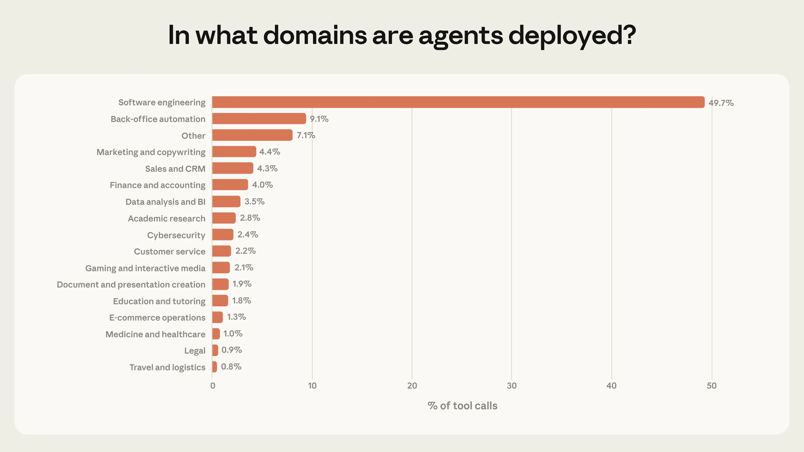

https://www.anthropic.com/research/measuring-agent-autonomy

**Figure 6.** Distribution of tool calls by domain. Software engineering accounts for nearly 50% of tool calls. Data reflects tool calls made via our public API. 95% CI < 0.5% for all categories, n = 998,481.


#### 1.1.3 MiroFish

https://baijiahao.baidu.com/s?id=1859329593535931105&wfr=spider&for=pc

十天Vibe Coding！00后小孩哥获盛大3000万投资，当上CEO


#### 1.1.4 simile

​	人工智能初创公司Simile已获得1亿美元新融资，用于开发一款旨在预测人类行为的模型，包括预测消费者购买决策以及预测企业财报电话会议上可能出现的问题。

```markdown
# 开山之作 (25人 AI 小镇):
论文: Generative Agents: Interactive Simulacra of Human Behavior
开源代码 (GitHub): joonspk-research/generative_agents
价值：这是 dataCloud 做推演架构时最直接的算法参考。

# 规模化仿真 (1,000人实验):
论文: Generative Agent Simulations of 1,000 People (或通过 Stanford HAI 查看摘要)
价值：详细介绍了如何通过 AI 访谈将真实人类转化为“数字分身”。

# 最新商业动态与资本细节 (2026年Q1)
融资新闻: Simile Secures $100 Million to Create Human Behavior Prediction Model
领投方: Index Ventures。
个人跟投: 李飞飞 (Fei-Fei Li), Andrej Karpathy。
行业评述: Simile AI Review 2026: What You Need to Know
提到 CVS Health 和 Suntory (三得利) 已经是其深度测试客户，用于预测商品上架后的市场反应。
```


#### 1.1.5 Next.js

一个 Cloudflare 工程师[宣布](https://blog.cloudflare.com/vinext/)，**他只用一个星期就用 AI 重新实现了 Next.js**，起名为 [vinext](https://vinext.io/)。


我觉得，**这件事对 Next.js 的打击非常大**。

Next.js 是 Vercel 公司的产品，背后有一个大型开发团队，每年都是巨额投入，已经整整做了10年。虽然是开源软件，但是企业版、云服务、插件、皮肤都要收费，去年的年收入达到2亿美元。

**这种看似难以逾越的护城河，在 AI 面前不堪一击**。一个工程师用了一个星期，就复刻了大团队十年的工作成果，现有的网页应用不改一行代码，放上去就能跑，原版的每个功能都支持。

你知道花了多少钱？Token 费用仅仅为 1100 美元！

这叫 Vercel 怎么再向 Next.js 的开发投钱，客户又怎么愿意再为某个功能付出高昂的使用费。

推而广之，所有的商业软件都受到了重创。**代码的护城河不存在了，只要投入一小笔金钱，AI 就能复刻出大型软件。****那么dataCloud要开源的话，什么是我们的护城河呢？**


### 1.2 竞品分析

#### 1.2.1plantir(商业)

##### 1.2.1.1 产品定位

企业决策分析。

##### 1.2.1.2 整体架构

**一、产品组成的子平台**：

Palantir采用由三个平台组成的统一架构：[AIP、Foundry和Apollo](https://www.palantir.com/docs/foundry/architecture-center/platforms/)。这些平台共同设计为企业作系统。

- Foundry 是核心的数据运维平台;
- AIP作为生成式人工智能平台;
- Apollo则是支撑这些产品的持续交付平台。


**二、产品的逻辑分层**：

1、**整体分层**：整体分为服务、本体、分析，其中Palantir 架构的核心是[本体系统](https://www.palantir.com/docs/foundry/architecture-center/ontology-system/)。本体将企业的数据、逻辑、动作和安全策略集成为直观的表示方式，供人类和人工智能代理共同作。


2、**服务分类**：在服务层上，有数百种服务与本体系统协同工作，包括数据服务、逻辑服务和工作流服务。

- ***数据服务***：涵盖数据连接、数据转换、数据虚拟化、数据存储、数据健康监测和数据管理。
- ***逻辑服务**：*涵盖制定业务规则、训练机器学习模型、编排外部模型、集成大型语言模型及其他生成式人工智能、端到端模型运维和代理运维等。
- ***工作流服务**：*支持分析和运营用例的交互式计算、事件驱动自动化、计划自动化、专业代码和低代码工作流创作工具等。

```markdown
一个 “智能供应链库存预警系统”，看看数据、逻辑、工作流是如何在 Palantir 中配合的：
[数据服务] 出场：
负责把 SAP 里的库存表、物流系统的运输表、外部的天气 API 数据抽取过来，清洗干净，变成统一的“库存对象”。

[逻辑服务] 出场（大脑开始思考）：
逻辑 A（业务规则）： 安全库存公式 = 平均日销量 × 7天。
逻辑 B（AI 模型）： 根据下周的暴雨预警，预测物流会延迟 3 天。
逻辑 C（LLM）： 生成一段给供应商的自然语言催货邮件草稿。

[工作流服务] 出场（调度员开始串联指挥）：
步骤 1（自动化触发）： 设定系统每 5 分钟扫描一次库存**（工作流）**。
步骤 2（调用逻辑）： 发现某零件库存低于 100，立刻调用“逻辑 A”和“逻辑 B”（工作流调度逻辑），算出需要紧急补货 500 个。
步骤 3（人工介入）： 工作流服务在采购经理的“低代码看板”上弹出一个红色警告卡片**（工作流前端交互）**。
步骤 4（调用逻辑）： 经理点击卡片，系统瞬间调用“逻辑 C”生成一封催货邮件草稿。
步骤 5（完成动作）： 经理点击“确认发送”，工作流服务调用 API 把邮件发出去。
```


##### 1.2.1.3 Foundry架构

###### 1.2.1.3.1 本体系统

1、本体论通过**数据**、**逻辑**、**动作****和安全的**四重整合来建模决策。


2、本体论强调读和写的能力


3、本体论组件在概念上可以被归类为语言、引擎和工具链。

- 该**语言建模**语义对象、链接和属性;同时还有动能动作和自动化;以及定义这些行为如何运作、如何与其他系统互动的字面逻辑。

- **引擎**支持语言的每一个组成部分。它提供了模块化读取架构，支持大规模SQL查询、实时订阅状态变化，以及混合人类与AI团队所需的所有具体化。同时，它提供了可扩展的写入架构，支持原子级且持久的事务更新、大规模批处理变异、大规模流，以及像变更数据捕获这样的机制，实现与其他作系统的极低延迟镜像。

- **工具链**涵盖了语言的全部表达力和引擎的强大功能，使开发者能够将本体作为后端使用。丰富的人工智能驱动应用，涵盖野火响应、海军物流、汽车组装及无数其他用例，均基于Ontology SDK（OSDK）及丰富的DevOps工具集，旨在实现生产用例的大规模治理。、

  


###### 1.2.1.3.2 本体概念

重点讲解属性、关系、动作、逻辑、函数：

1、属性分4类。

2、关系定义1：N，N：N

3、动作是可操作的。

4、函数是只读的。

5、逻辑+工作流可以把函数和动作进行组合，编排成新的函数或动作。

| ***\*概念\****              | ***\*定义\****                                               | ***\*示例\****                                               |
| --------------------------- | ------------------------------------------------------------ | ------------------------------------------------------------ |
| 对象(Object)                | 对象指现实世界实体或事件的模式定义。                         | 员工、组织、项目合同...                                      |
| 对象实例（Object instance） | 对象实例指的是对象定义下的单个业务实例。                     | 员工:[“王小明”,“王大明”,“李白”]                              |
| 属性(Property)              | 属性是现实世界实体或事件的特征的模式定义。区分为<br />1.存储属性:普通属性.<br />2.计算属性:绑定一个Function需要动态计算获得.<br />3.关联属性:绑定外键对象,根据对象关系获得.<br />4.时序属性:绑定特定时序表,例如温度,是一个序列数组. | 员工：姓名、性别、工号...                                    |
| 属性值(Property value)      | 属性值是指对象或现实世界实体或事件的单个实例的属性值。       | 员工：姓名=》王小明、性别=》男、工号=》202034301...          |
| 关系(Link type)             | 关系是指两个对象之间关系的架构定义。支持定义1对1，1对N，N对N | 员工 【归属】 组织员工 【加入】 项目                         |
| 动作(Action)                | 动作指对象上执行的业务动作单元，例如差旅单申请单申请单对象的[提交]动作。动作可分为datacloud内置的动作及业务动作两类：1、内置动作：针对一个对象，dataCloud默认会增强保存、加载、删除，该类动作可用不对用户可见。2、业务动作：由用户自动创建的，在对象上可用可见。 | 员工-查询员工资料员工-重置员工密码员工-调整员工组织...Action可分为原子Action、组 合Action，每个Action包含1个或多个Functions |
| 逻辑(Logic)                 | 实现一个Action对应多个Funciton的流程编排。                   | 例如我要出差是一个Action，但是要对应查询机票Function，订票Function，出差申请Function，要靠Logic编排组织起来。 |
| 函数(Function)              | 函数指可提供可复用的计算逻辑，实现载体形式包括：插件、工具、mcp等能力。 | 对应插件引擎、BOT、外部发布到百应的各类 API                  |
| 视图(Object View)           | 视图是指以某一业务对象为核心，关联各领域对象形成的对象集合。视图核心目标是简化对象间纵深的多跳关系。 | 员工视图：包含员工对象、员工出差申请对象、员工报销申请对象。 |


###### 1.2.1.3.3 智能开发

> 

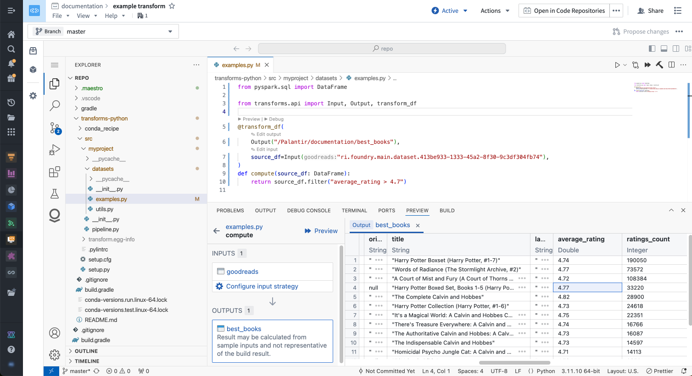

> **Palantir VS Code 插件 = 在 VS Code 中开发、调试、构建 Palantir Foundry 应用的官方工具。**

不是开发 Foundry 本体，而是开发运行在 Foundry 上的东西

数据管道

数据模型

机器学习流程

Ontology 应用

后端服务

前端应用

MCP Agent

FoundryTS 项目。


###### 1.2.1.3.4 MMDP(对标计算引擎)

[The Multimodal Data Plane • Palantir](https://www.palantir.com/docs/foundry/architecture-center/multimodal-data-plane/)

1. **零数据搬迁与虚拟表 (Zero-Copy & Virtual Tables)**

- **原意**：企业不需要将现有的 Databricks、Snowflake 或 BigQuery 中的资产复制一遍。
- **深度解读**：MMDP 提供了极其强大的 `Virtual Tables`（虚拟表）框架。当对接外部通用数据平台时，它只在内存中映射元数据指针。上层的智能体和应用在查询时，指令会直接穿透到原始数据源。这不仅消除了海量的存储冗余成本，更彻底解决了传统数据同步带来的高延迟和一致性灾难。
- 举例：

```markdown
# 业务描述
假设一个极具挑战但非常普遍的企业现状：
人事与考勤库：人员组织、考勤打卡记录（如 SalesPerson, SalesEmpAttendance）存在企业本地机房的 Oracle 数据库里（几十万条数据）。
业务流水库：海量的商机和历史合同流水（如 SalesBusinessOpportunity）由于数据量极大，存在云端的 Snowflake 数据仓库里（大约 5 亿条数据）。
此时，业务主管向超级分析智能提问：“帮我拉取今天上午刚签下大单的销售员名单，并交叉对比他们本月的考勤达标率。”

# MMDP 的做法：
在自己的内存里建了两张**“假表”（虚拟表）**。
这张表里没有具体的王小明或是 100 万的商机金额，它只存了一张“寻宝图”（元数据）：“商机表存放在 Snowflake 的某某 IP，访问凭证是 XXX，里面包含金额、时间、负责人这三列。” 这张“图纸”在内存里仅仅占用几 KB。

指令穿透 (Penetration)：
当超级分析智能接到主管的提问并拆解出查询意图后，底层引擎瞬间查阅“寻宝图”，然后兵分两路：直接把查考勤的查询指令发给本地 Oracle，把查今天上午商机的计算指令发给云端 Snowflake。
```


2. **全编排的算力下推 (Fully Orchestrated Pushdown Compute)**

- **原意**：支持将计算任务无缝下推到企业已投资的现有计算引擎中原生执行。
- **解读**：这是 MMDP 最具技术壁垒的一环，也是破解大数据量计算的杀手锏。当用户发起一个复杂的超大表聚合查询时，MMDP 绝不会把千万行数据拉取到自身内存中撑爆系统。相反，它会将计算逻辑自动编译为底层系统（如 Databricks/Spark 或 Snowflake SQL）的方言，将计算任务“派发（Pushdown）”过去，最后只取回几行微缩的计算结果。

- **举例**：

```markdown
帮我算一下，过去三年，华东区所有金额大于 100 万的商机中，赢单率是多少？总合同额是多少？

1、意图拆解与方言编译： 超级分析智能体理解了总监的意图。MMDP 接管任务后，它不仅知道数据在哪，它还知道底层的数据库是 Snowflake。于是，它自动将业务逻辑编译成 Snowflake 专属的聚合 SQL 方言：
SELECT SUM(amount), COUNT(CASE WHEN status='won' THEN 1 END)/COUNT(*) FROM SalesBusinessOpportunity JOIN OrganizationDepartment ... WHERE amount > 1000000...

2、派发任务（Pushdown）： MMDP 绝不拉取 800 万条明细数据。它仅仅是把上面那段 SQL 代码文本（不到 1KB）“下推”发送给了底层的 Snowflake 服务器。

3、原生极速执行： Snowflake 收到代码后，利用它自身庞大的并行计算集群，在极短的时间（可能只需 1.5 秒）内在底层完成了海量数据的过滤、求和与除法运算。

4、取回微缩结果： 算完之后，Snowflake 只向 MMDP 返回了极其精简的 1 行结果（例如：总额：8.5亿，赢单率：42%）。

最终结果： 网络传输量几乎为 0，上层分析平台的内存消耗几乎为 0。总监在提问后的 3 秒钟内，屏幕上就弹出了由 Agent 包装好的精准数据报告。
```


3. **极其彻底的开放标准 (Built on Open Data Standards)**

- **原文**：所有数据均以原始开放格式（CSV、Iceberg、Parquet 等）存储，并通过标准接口（REST、JDBC、兼容 S3）提供访问。
- **解读**：这是对企业客户的“反供应商锁定（Anti-Vendor Lock-in）”承诺。Palantir 明确表示不会绑架数据。企业随时可以绕开 Palantir 的前端，用 Tableau、Power BI 甚至自定义的微服务直接通过 JDBC 或 S3 协议来提取 MMDP 里的底层数据。这极大降低了大型企业引入该系统的安全顾虑。


4. **真正的“多模态”处理 (True Multimodality)**

- **原文**：支持处理异构数据流（批量、流式、CDC实时复制等）。
- **解读**：传统数仓只能处理二维结构化表格。而 MMDP 的“多模态”涵盖了极其复杂的现实场景：物联网传感器的实时流（Time Series）、无人机的地理空间轨迹（Geospatial）、ERP的复杂网状数据，以及非结构化的合同文档和音视频媒体。MMDP 内部有海量的解析器，能把这些异构比特流统一接管，为上层提供标准化的原料。
- **举例**：plantir的融合包括了逻辑融合(像dataCloud用的技术，给文档打结构化标签)、地理空间、语义向量。三重融合。

```
“同一时间维度的融合”（比如：12:00 机器报错，同时 12:00 客服收到邮件），这在技术上叫 Time-series Join（时序关联），很多传统的流处理引擎（如 Flink）都能做。
但 Palantir 的 MMDP + Ontology 能做到的是：把 一段语音（语义） + 一张雷达图（空间） + 一封旧合同（逻辑关系） + 一串传感器波动（时间），围绕着“某一台具体的服务器（核心对象）”
```


##### 1.2.1.4 AIP架构

###### 1.2.1.4.1 AIP架构


**1、安全的LLM（大语言模型）集成与访问 (Secure LLM integration & access)：** 通过 Palantir 托管的基础设施，实现对全系列商业 LLM（例如 GPT、Gemini、Claude、Grok 模型）和开源模型（例如 Llama）的安全访问。该基础设施可确保传输的数据不会被第三方提供商保留，也不会被模型提供商用于重新训练。企业还可以集成其现有的模型，无论是现有的模型订阅、微调模型，还是特定领域的模型。

--参考点：安全围栏。

**2、端到端可观测性 (End-to-end observability)：** 为 AI 驱动的工作流和智能体（Agentic）流程的每一个步骤提供监控工具。这包括对输入到本体（Ontology）的所有数据流进行细粒度监控，对人类用户或 AI 智能体采取的每一个动作进行日志记录，以及追踪工作流中级联链式执行过程的能力。这种可观测性还延伸到了 Token 消耗及其他资源使用方面。

--参考点：基于数据血缘的关系观测。

**3、上下文工程 (Context engineering)：** 为开发者配备无代码、低代码和专业代码工具，用于集成驱动本体及所有依赖工作流的上下文数据、逻辑和动作。所有模式的数据集成（例如批处理、流处理、通过 CDC 进行的实时复制）都可以通过任何运行时环境（例如 Spark、Flink、DataFusion、Polars）来调用，同时遵循统一的安全、治理、来源追踪及其他基本保障。

--参考点：单独一个知识工程

**4、本体系统 (The Ontology system)：** 通过将不同的数据、逻辑、动作和安全集成到企业决策的统一表示中来激活上下文。

- 本体的**语言**将业务流程中的“名词”和“动词”建模为人类和智能体都易于理解的形式。
- 本体的**引擎**支持查询数十亿个对象、编排数以万计的动作，并持续整合基于反馈的学习。
- 本体的**工具链**使开发者能够在共同的底座上构建多样且复杂的 AI 驱动型应用。

--参考点：本体论。

**5、向量、计算与工具服务 (Vector, compute, tool services)：** 提供生成和管理嵌入（Embeddings）所需的集成向量化服务；一个可扩展的计算框架，能够利用多节点引擎（如 Spark、Flink）、高效的单节点引擎（如 DuckDB、Polars）以及任何容器化的“自带”（BYO）引擎；以及一套与本体系统协同工作的集成工具服务，充当不断演进的工具工厂。该平台在模型、计算引擎和接口方面均被设计为模块化且可扩展的。


###### 1.2.1.4.2  AIP分析师

**对话式数据分析与可视化 (Chat-based Analysis)**

- 通过简单的聊天界面，无论是技术人员还是非技术业务用户，都可以直接使用自然语言提问、过滤数据、运行指标计算，并直接在对话中生成数据可视化图表。


**强大的上下文管理 (Context Management)**

上下文可以通过输入栏中的**+**按钮手动添加到AIP Analyst中。AIP 分析师包含一个**上下文清理**工具，通过隐藏过时或不必要的信息自动管理对话上下文。这使分析时间更长，同时确保客服在回答问题时专注于相关数据。你也可以用[分析大纲](https://www.palantir.com/docs/foundry/aip-analyst/core-concepts/#analysis-outline)手动管理上下文。


**分析路径分支与分叉 (Branching/Forking)**

- 用户可以在分析的任何一个节点对对话进行“分叉 (Fork)”。这会生成一个新的分析标签页（继承该节点之前的所有上下文），允许用户从同一个起点出发，平行探索多种不同的假设或分析路径。

  【toDo：细化补充，它是怎么作分支的】


**无缝的嵌入式集成 (Workshop Widget & Embedding)**

- AIP Analyst 可以作为小组件 (Widget) 直接嵌入到 Palantir 的 Workshop 模块或第三方 OSDK 应用程序中。
- 开发者可以为嵌入的组件配置专属的“系统提示词 (System prompt)”、指定默认的 AI 模型，并预先加载必要的上下文资源。

**范围过滤与数据访问控制 (Scope Restriction)**

- 系统允许将 AIP Analyst 的搜索权限严格限制在特定的“本体 (Ontology)”或指定的对象类型组内。这一功能不仅能防止 AI 越权访问无关数据，还能极大提升在大规模本体环境下的搜索与响应性能。


###### 1.2.1.4.3 分支(决策推演)

1、官主的说明文档

[Workshop • Scenarios • 入门 • Palantir](https://www.palantir.com/docs/zh/foundry/workshop/scenarios-getting-started)

2、界面效果：

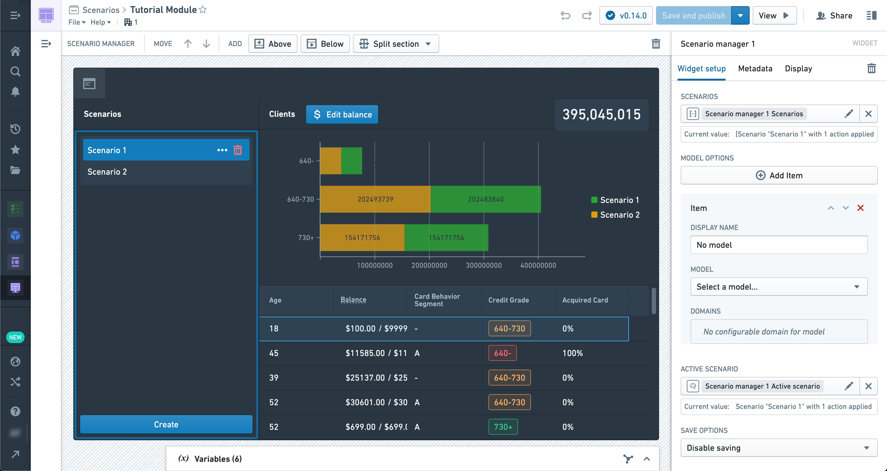

3、核心概念

```text
Ontology（基础数据世界）
│
├── Actions（你主动施加的改变）
│       └── 修改 Ontology：属性变化、创建对象、删除对象、创建/删除链接
│
├── Models（系统根据数据推断的结果）
│       └── 输入：Ontology 中的属性
│       └── 输出：预测属性（依赖变量）
│
├── Domain（模型评估的对象集合）
│       └── 决定模型在哪些对象上运行
│
└── Scenario（场景 = 数据分支）
        ├── 包含：Actions 的结果
        ├── 包含：Models 在 Domain 上的评估结果
        └── 是一个“假设世界”，不影响真实 Ontology

```

4、核心路程：

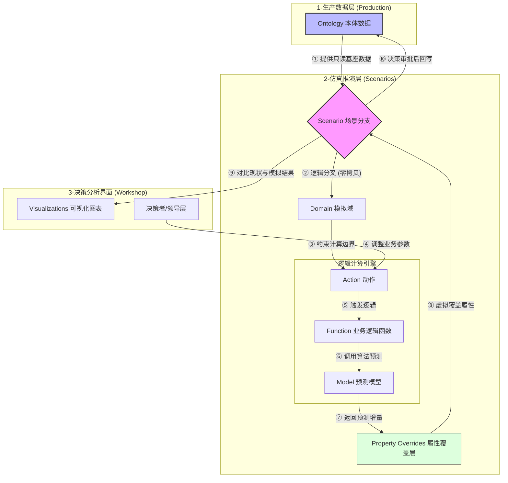
```mermaid
graph TD
    subgraph "1-生产数据层 (Production)"
        O[Ontology 本体数据]
    end

    subgraph "2-仿真推演层 (Scenarios)"
        S{Scenario 场景分支}
        D[Domain 模拟域]
        
        subgraph "逻辑计算引擎"
            A[Action 动作]
            F[Function 业务逻辑函数]
            M[Model 预测模型]
        end
        
        Delta[Property Overrides 属性覆盖层]
    end

    subgraph "3-决策分析界面 (Workshop)"
        V[Visualizations 可视化图表]
        U[决策者/领导层]
    end

    %% 连线关系与序号
    O -- "① 提供只读基座数据" --> S
    S -- "② 逻辑分叉 (零拷贝)" --> D
    D -- "③ 约束计算边界" --> A
    U -- "④ 调整业务参数" --> A
    A -- "⑤ 触发逻辑" --> F
    F -- "⑥ 调用算法预测" --> M
    M -- "⑦ 返回预测增量" --> Delta
    Delta -- "⑧ 虚拟覆盖属性" --> S
    S -- "⑨ 对比现状与模拟结果" --> V
    S -- "⑩ 决策审批后回写" --> O

    %% 样式美化
    style S fill:#f9f,stroke:#333,stroke-width:2px
    style O fill:#bbf,stroke:#333,stroke-width:2px
    style Delta fill:#dfd,stroke:#333,stroke-style:dashed
```


##### 1.2.1.5 核心技术总结

###### 1.2.1.5.1 核心技术点

| 技术                                                 | 描述                                                         | 备注                                                         |
| ---------------------------------------------------- | ------------------------------------------------------------ | ------------------------------------------------------------ |
| MMDP-零数据搬迁与虚拟表 (Zero-Copy & Virtual Tables) | 直接连接外部数据源（如 Snowflake、Oracle 等），在内存中建立元数据指针，实现物理数据不挪窝即可进行联邦查询 | [Core concepts • Virtual tables • Palantir](https://www.palantir.com/docs/foundry/data-integration/virtual-tables/) |
| MMDP-全编排算力下推 (Pushdown Compute)               | 面对海量明细数据，系统不拉取数据，而是将计算任务翻译成底层数据库的 SQL 方言并“下推”给源数据库执行，仅取回微缩的计算结果。 | [The Multimodal Data Plane • Palantir](https://www.palantir.com/docs/foundry/architecture-center/multimodal-data-plane/) |
| MMDP-多模态解析 (True Multimodality)                 | 能够同时兼容并处理结构化表格、地理空间数据、传感器时序流以及非结构化文档（通过向量化处理） | [The Multimodal Data Plane • Palantir](https://www.palantir.com/docs/foundry/architecture-center/multimodal-data-plane/) |
| 分层架构                                             | 服务、本体、分析 三层隔离的架构。                            | [AIP, Foundry, and Apollo • Palantir](https://www.palantir.com/docs/foundry/architecture-center/platforms/) |
| 全链路数据血缘 (End-to-end Data Lineage)             | 总监点击“暴跌 30%”这个数字，系统会立刻展开一张溯源图：<br />*第一层：* 这个数字是由 `AI 预测模型 V2.1` 算出来的。<br />*第二层：* 该模型调用的输入数据是本体层里的 `A产品销售对象` 和 `市场情绪对象`。<br />*第三层：* 这些对象的数据，是通过 `Spark 批处理作业 #8890` 在昨晚 11 点清洗得来的。 |                                                              |
| 权限控制                                             | Palantir 采用了 CBAC（基于分类/标记的访问控制）。这意味着数据库里的每一行记录、本体里的每一个对象，甚至某个对象的“利润率”这个单一属性，都挂着隐形的“安全铭牌” |                                                              |
| 智能体任务编排 (Agent Orchestration)与 DAG           | “读写分离、动静结合”的编排策略。<br />1、**对于只读查询（Read-only Query）：** 采用 **模式一（动态生成）**。算错了大不了重新问一次，风险极低。<br />2、**对于写操作与核心业务流（Write & Actions）：** 严格采用 **模式二（人工预设）**将公司的标准操作程序（SOP）固化为人工定义的 DAG 模板 |                                                              |
| API分析师                                            | 1、内置各类可视化分析模板。<br />2、分支【场景】管理功能。   | [Types of analysis • Palantir](https://www.palantir.com/docs/foundry/analytics/types-of-analysis/) |

###### 1.2.1.5.2 标准维度总结

https://docs.google.com/spreadsheets/d/1RCDcoaezqPNnrlEUh1ojPOeTHYRj6WPjy4MaS1RIcQc/edit?usp=sharing


#### 1.2.2 c3.ai(商业)

##### 1.2.2.0 产品定位

Generative AI for Palantir Rapidly access insights without extensive Palantir expertise。

```markdown
1. 直击 Palantir 最大的痛点：太难用了
2. C3.ai 的解法：提供“自然语言外挂”,C3.ai 推出的这个模块，本质上是一个基于大模型的超级前端。它内置了连接器，可以直接打通 Palantir 的底层数据库（Gotham, Foundry, Apollo）。
3. 已买了Palantir，只需要再买 C3 Generative AI 盖在 Palantir 上面。你的老板和业务员以后只用我们的聊天界面就行了
```

1.为什么 C3.ai 宣称自己“更优”？

C3.ai 不仅需要建立“本体层”，而且它的整个架构就是围绕着一套比 Palantir 更严格的本体系统——“C3 AI Type System（类型系统）”构建的

| **维度**     | **Palantir 原生 (AIP Assist)**       | **C3 Generative AI (外挂模式)**                        |
| ------------ | ------------------------------------ | ------------------------------------------------------ |
| **交互入口** | 依然留在 Foundry/Gotham 复杂的 UI 内 | **独立的、类 Google 搜索的极简界面**                   |
| **集成能力** | 侧重在 Palantir 内部处理数据         | **跨系统整合**（可同时查 Palantir、SAP 和 Salesforce） |
| **上手时间** | 需数周培训以理解本体逻辑             | **5分钟上手**（对话即搜索）                            |

2.为什么 C3.ai 看起来比 Palantir “轻”？

| **维度**     | **Palantir Foundry (Ontology)**                              | **C3 AI (Type System)**                                      |
| ------------ | ------------------------------------------------------------ | ------------------------------------------------------------ |
| **构建方式** | **白手起家**。你需要派驻工程师（FDE）进场，从零开始把你的旧表格连成“本体图”。 | **行业预置**。针对能源、金融等 28 个行业，C3 预置了成千上万个“Type”。你只需映射数据，不用发明概念。 |
| **交互深度** | **深层操作**。用户必须深入到图结构里去点选、过滤，门槛极高。 | **表层覆盖**。用 Generative AI 盖在 Type System 上。用户输入人话，AI 在后台自动去跑 Type System 的逻辑。 |
| **灵活度**   | **高**。你想怎么定义业务实体都行，适合极其复杂的定制场景。   | **中**。更偏向标准化的工业/商业流程。                        |

##### 1.2.2.1 整体架构

C3 Agentic AI Platform：企业级 AI 应用开发底座 (Enterprise AI application development platform)。

**C3 Generative AI** ：对话式数据洞察与执行平台，用于呈现洞察并采取行动的生成式 AI 应用 (Generative AI applications to surface and act on insights)。

C3 AI Applications：针对高价值用例的企业级 AI 应用 (Enterprise AI applications for high-value use cases)

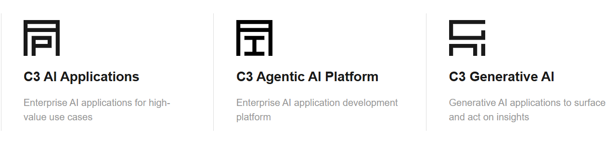

##### 1.2.2.2 agent架构

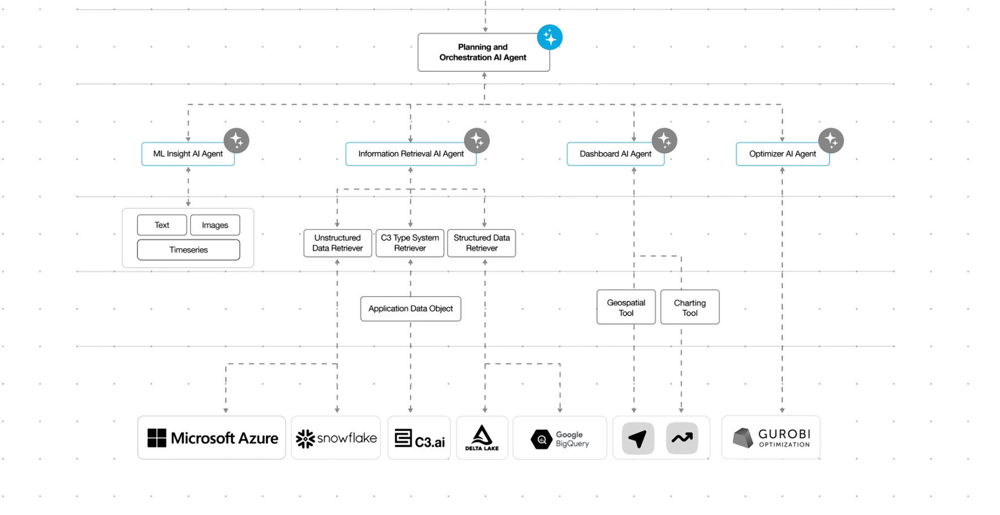

1.**ML Insight AI Agent** (机器学习洞察智能体)
负责处理非结构化和半结构化的深度分析。
2.**Information Retrieval AI Agent** (信息检索智能体)
负责跨系统搜寻信息。它通过三个子检索器（Unstructured、C3 Type System、Structured）去查询底层数据。
3.**Dashboard AI Agent** (可视化智能体)
负责将抽象的数据和推演结果转化为直观的视觉语言
接驱动 Geospatial Tool（地理空间工具） 和 Charting Tool（图表工具）
4.**Optimizer AI Agent** (优化智能体)
例如在库存短缺时，它会计算出最优的补货路径和分配方案，以实现成本最低或效率最高。

##### 1.2.2.3 核心页面

1、首页。

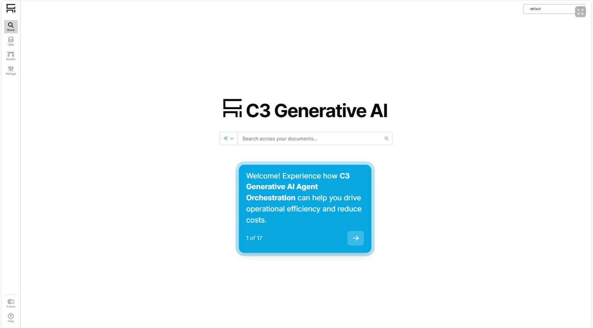

2、提问

1）基于自然语言提问进行推荐。

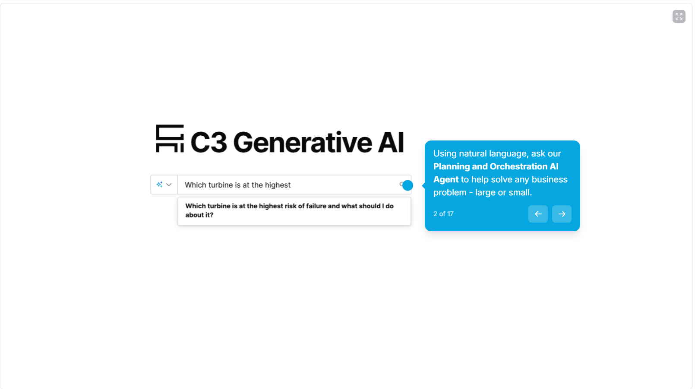

2）针对提问问题进行规划：哪台涡轮机发生故障的风险最高，我该怎么办？

```markdown
规划与编排智能体 (Planning and Orchestration Agent) 并没有立刻给出一个长篇大论的文本，而是生成了一个包含 4 个步骤的清晰执行计划 (Plan)，并在前端可视化展示出来。
```

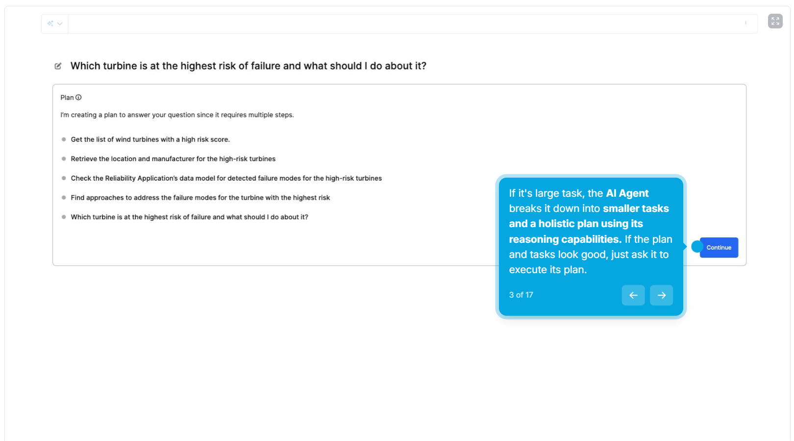

2：专业智能体并行/串行执行 (Specialized Agents Execution)，按顺序调用不同的**“专业智能体 (Specialized Agents)”**，并呈现了极强的**多模态融合与联邦查询**能力：

1）**调用数据检索智能体 (查结构化数仓)：** 智能体去底层 Snowflake 数仓查出了风险得分，并自动用**柱状图 (Chart)** 展示了得分最高的 Turbine-1。

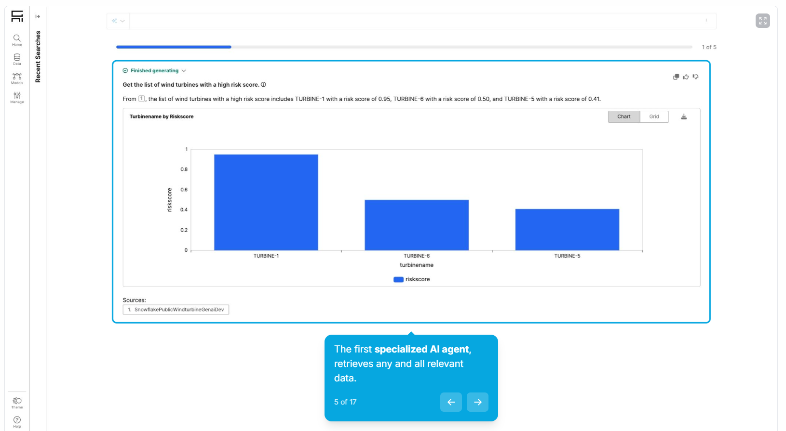

2）**调用空间/资产智能体 (查地理位置)：** 智能体提取资产位置，并自动渲染在**交互式地图 (Map)** 
上展示。

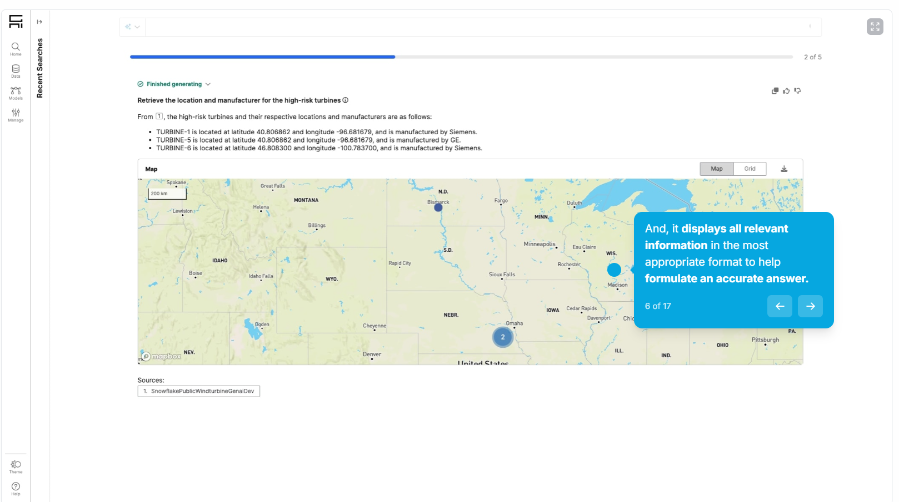

3）**调用诊断模型智能体 (查机器学习逻辑)：** 智能体调用可靠性应用程序的数据模型，查出 Turbine-1 的故障根因是“齿轮箱漏油 (Gearbox oil leaking)”，用**数据表 (Grid)** 展示。

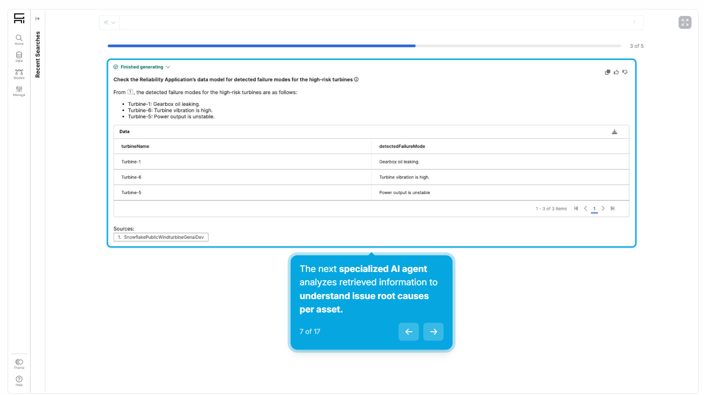

4）**调用知识库 RAG 智能体 (查非结构化文档)：** 智能体拿着“齿轮箱漏油”这个关键词，去企业的文档库里检索，最终从一份名为 `All_TroubleshootingGuide_(8).docx` 的 Word 文档中提取了 5 步维修方案。

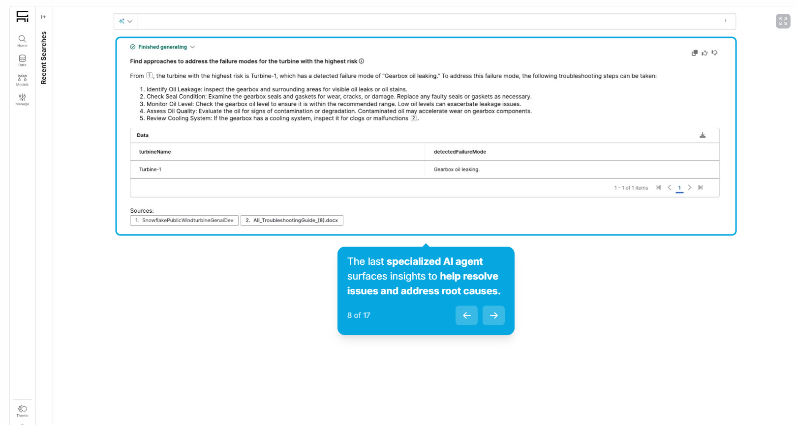


3、决策与分析

1）在集齐了“高风险机器是谁”、“它在哪”、“得什么病”、“怎么治”四个维度的信息后，**规划与编排智能体**再次出场，将这些碎片化信息融合成了一段人类可读的最终行动建议 (Actionable recommendation)

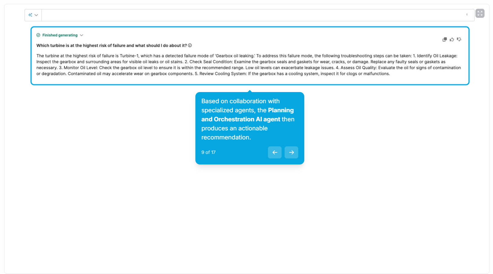

9、

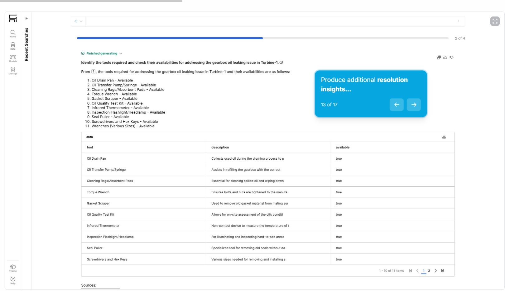


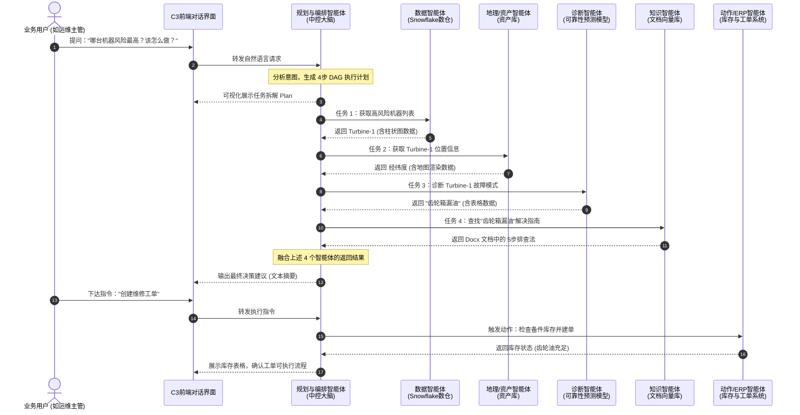
```mermaid
sequenceDiagram
    autonumber
    actor User as 业务用户 (如运维主管)
    participant UI as C3前端对话界面
    participant Orchestrator as 规划与编排智能体<br>(中控大脑)
    participant Agent1 as 数据智能体<br>(Snowflake数仓)
    participant Agent2 as 地理/资产智能体<br>(资产库)
    participant Agent3 as 诊断智能体<br>(可靠性预测模型)
    participant Agent4 as 知识智能体<br>(文档向量库)
    participant Agent5 as 动作/ERP智能体<br>(库存与工单系统)

    %% 阶段1：意图理解与规划
    User->>UI: 提问："哪台机器风险最高？该怎么做？"
    UI->>Orchestrator: 转发自然语言请求
    note over Orchestrator: 分析意图，生成 4步 DAG 执行计划
    Orchestrator-->>UI: 可视化展示任务拆解 Plan

    %% 阶段2：专业智能体分步执行与感知
    Orchestrator->>Agent1: 任务 1：获取高风险机器列表
    Agent1-->>Orchestrator: 返回 Turbine-1 (含柱状图数据)
    
    Orchestrator->>Agent2: 任务 2：获取 Turbine-1 位置信息
    Agent2-->>Orchestrator: 返回 经纬度 (含地图渲染数据)

    Orchestrator->>Agent3: 任务 3：诊断 Turbine-1 故障模式
    Agent3-->>Orchestrator: 返回 "齿轮箱漏油" (含表格数据)

    Orchestrator->>Agent4: 任务 4：查找"齿轮箱漏油"解决指南
    Agent4-->>Orchestrator: 返回 Docx 文档中的 5步排查法

    %% 阶段3：融合总结
    note over Orchestrator: 融合上述 4 个智能体的返回结果
    Orchestrator-->>UI: 输出最终决策建议 (文本摘要)
    
    %% 阶段4：业务动作流转
    User->>UI: 下达指令："创建维修工单"
    UI->>Orchestrator: 转发执行指令
    Orchestrator->>Agent5: 触发动作：检查备件库存并建单
    Agent5-->>Orchestrator: 返回库存状态 (齿轮油充足)
    Orchestrator-->>UI: 展示库存表格，确认工单可执行流程
```


##### 1.2.2.4 核心技术总结

######  1.2.2.4.1核心技术点

C3 的创始人 Thomas Siebel 曾说过，Type System 是他们花了十几年、砸了十几亿美金搞出来的核心护城河。它本质上是一个**极度宏大的、跨多语言和多物理引擎的元数据抽象层与执行引擎**

| 技术                                                         | 描述                                                         | 备注 |
| ------------------------------------------------------------ | ------------------------------------------------------------ | ---- |
| 元数据驱动的万物抽象架构 (Metadata-Driven Architecture)<br />--相当于本体建模语言 | **1、技术实质：** 在 Type System 中，“代码即数据，数据即代码”。系统中的一切——数据表结构、机器学习模型、数据处理逻辑、甚至是前端 UI 组件——全部被抽象为声明式的元数据（通常以 JSON 格式存储）。<br />**2、运行机制：** 它颠覆了传统的硬编码模式。当系统需要增加一种新的“传感器”时，工程师不需要去改写后端的 Java/Python 代码或重建数据库表，只需要在 Type System 中声明一个新的 JSON 配置文件（定义其属性、关联关系、数据来源）。Type System 引擎会在运行时动态解析这些元数据，并使其生效。<br />**3、对 GenAI 的意义：** 大模型（LLM）天生极其擅长阅读和生成 JSON。Type System 的这种全元数据架构，使得大模型可以极其容易地“读懂”整个企业的数字全貌，并精确调用。 |      |
| 异构多源的动态查询编译器 (Dynamic Query Compiler)<br />--相当于算力下推 | **1、技术实质：** 实现“算力下推”的真正引擎。它是一个极度复杂的分布式 SQL/NoSQL 解释器与编译器。<br />2、**运行机制：** 当大模型发出一个面向对象的通用请求（例如：`Fetch(type="WindTurbine", filter="temperature > 100")`）时，Type System 的编译器会介入。它会查询元数据字典，发现这台风机的基础信息在 PostgreSQL，而高频温度数据在 Cassandra（时序数据库）。<br />3、**实时翻译：** 编译器会瞬间将这个通用请求**“翻译”并拆解**为标准的 SQL 语句下发给 Postgres，同时翻译为 CQL 语句下发给 Cassandra。然后，Type System 在中间层将两边返回的物理数据进行内存级的 Join（联合），再打包成一个完整的“风机对象”返回给大模型。 |      |
| **多模态持久化路由总线 (Polyglot Persistence Routing)**<br />--相当于虚拟表技术 | 1、**技术实质：** 传统的大数据平台通常要求你把所有数据都搬进一个“数据湖 (Data Lake)”里。Type System 采用的是**“数据虚拟化 (Data Virtualization)”**路线。<br />2、**运行机制：** 它底层挂载了多种不同类型的物理存储引擎（关系型、键值对、时序、分布式文件系统）。Type System 充当一个超级路由总线，数据留在原地不动。当大模型需要进行复杂的 RAG（检索增强生成）时，Type System 可以同时调度底层的向量数据库（查文档）和关系型数据库（查 ERP 表单），实现真正的联邦数据访问。<br /> |      |
| 面向对象的运行时动态 API 生成 (Runtime Auto-API Generation)<br />--相当于我们动态生成mcp | 1、**技术实质：** 基于面向对象编程 (OOP) 的继承机制，结合动态 API 网关技术。<br />2、**运行机制：** 在 Type System 中定义的任何一个“Type（类型/对象）”，一旦声明完成，系统内核就会**自动为它生成一套全功能的、安全的 RESTful API 和 GraphQL 接口**，完全不需要人工编写接口代码。此外，它支持强继承（例如定义了“通用设备”后，“水泵”可以直接继承其所有属性和 API）。<br />3、 |      |

**Palantir 的 Ontology（本体）** 核心在于**“链接 (Links)”与“动作 (Actions)”**。它是通过图数据库的逻辑，将异构数据硬关联起来，强在跨节点的复杂网络计算和写回机制。

**C3.ai 的 Type System（类型系统）** 核心在于**“抽象 (Abstraction)”与“联邦翻译 (Federated Translation)”**。它是通过元数据字典和运行时编译器，让底层杂乱的数据库在应用层看起来像是一个整齐划一的面向对象系统，强在海量时序数据的低延迟集成与模型工具调用。

###### 1.2.2.4.1 标准维度总结

https://docs.google.com/spreadsheets/d/1RCDcoaezqPNnrlEUh1ojPOeTHYRj6WPjy4MaS1RIcQc/edit?usp=sharing

【toDo：不需要专家建模，需要查询资料实证。】


#### 1.2.3 枫清科技

##### 1.2.3.1 产品定位

经营分析-数据驱动决策，智能洞察经营本质。

--从官网上来看，本质是一个指标查询、分析平台。

##### 1.2.3.2  整体架构

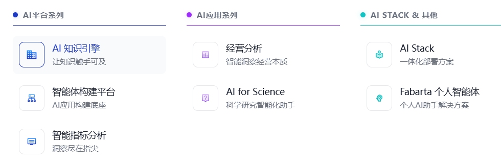

##### 1.2.3.3 核心技术总结

选自官网：

| 维度       | 描述                                                         |      |
| ---------- | ------------------------------------------------------------ | ---- |
| 实时高效   | 打破统计局限，实时监控指标异动，风险预警前置，分析报告生成效率提升 50% 以上。 |      |
| 多维归因   | 突破单一维度分析，关联多维度数据深挖问题根源，避免关键影响因素遗漏。 |      |
| 知识沉淀   | 固化专业分析框架与经验，形成可复用分析模式，持续优化分析策略。 |      |
| 低门槛协同 | 将专业指标转化为通俗解读，统一数据口径，提升跨部门沟通与决策信任度。 |      |

1、找差距：推荐下钻分析的关联问题

针对公司毛利率与目标值的差异分析，根据原始问题智能推荐下钻分析的关联问题，引导深入探索。

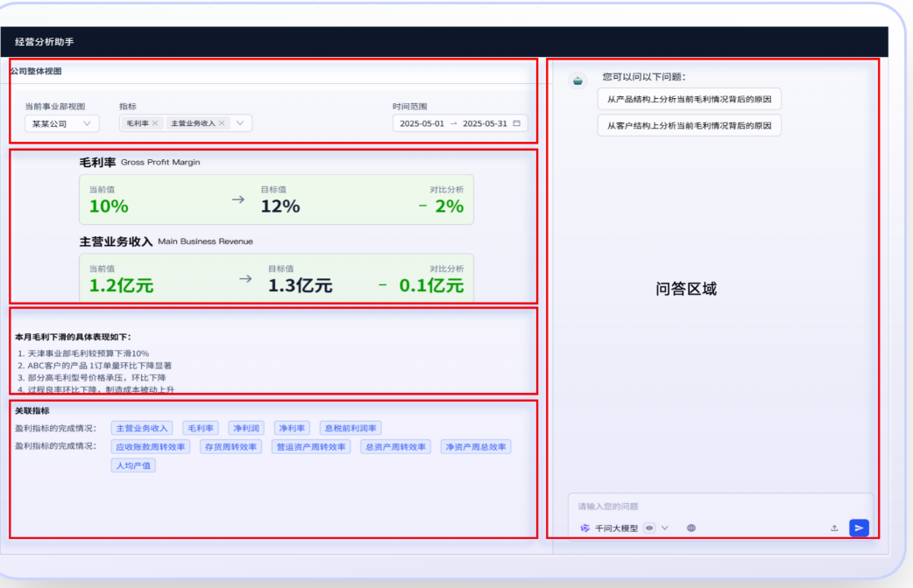

2、锁问题：智能回答现状与问题

智能回答企业在毛利达成的现状以及存在的问题，快速锁定关键业务痛点。

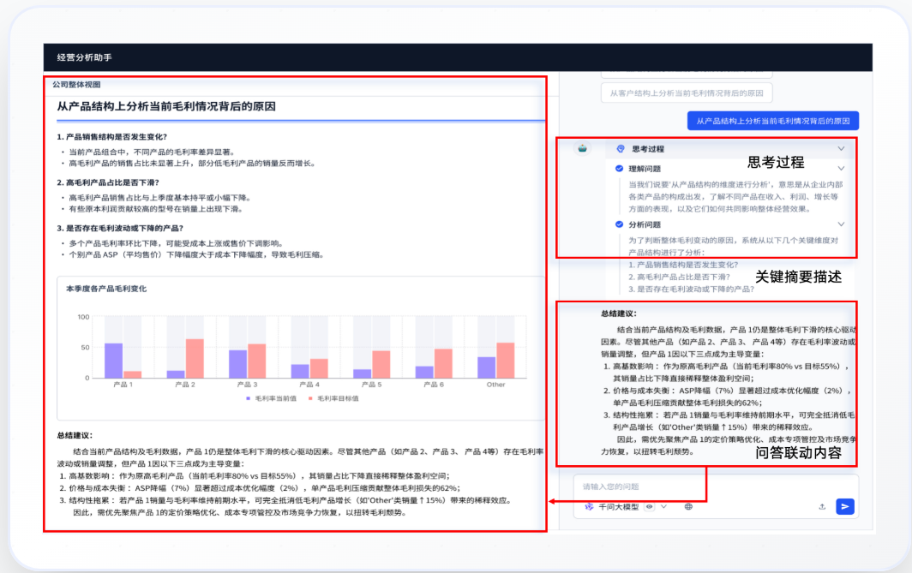

3、寻根因：指标下钻可视化分析

指标下钻分析详情，通过可视化展示及分析，精准定位问题根本原因。

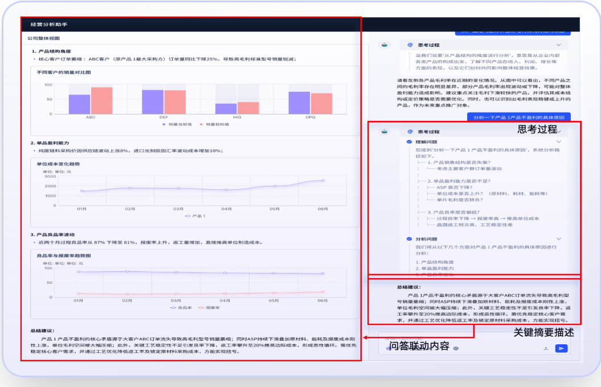

4、财管报：收入订单预算实际对比

集成财务与管理报表，实现收入、订单、预算与实际值的多维对比分析，辅助管理者掌控经营进度。

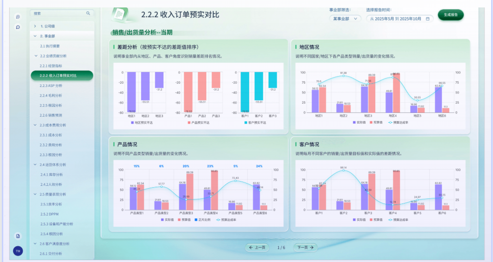


### 1.3 开源分析

#### 1.3.1 kweaver-ai(开源)

##### 1.3.1.1 产品定位

企业决策分析。

##### 1.3.1.2 整体架构

https://github.com/kweaver-ai/.github/blob/main/profile/README.zh.md

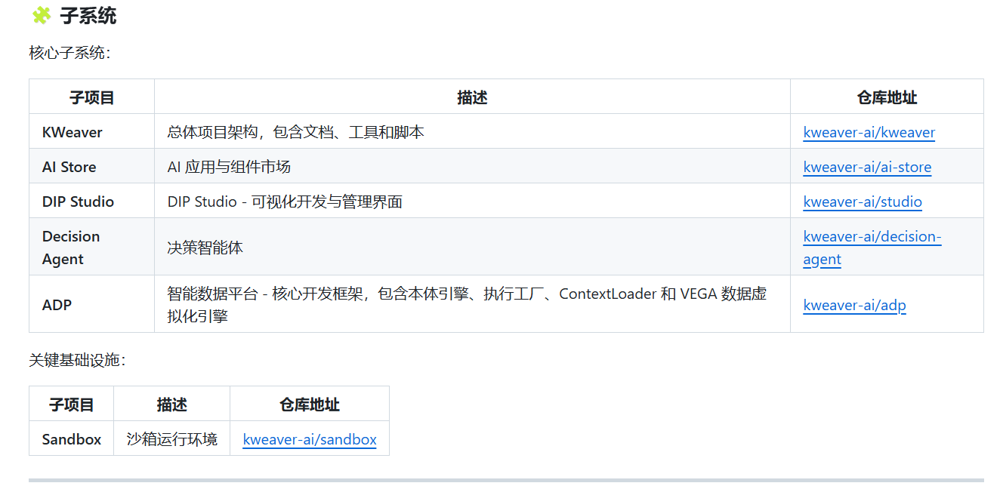


##### 1.3.1.3 ADP架构

```
┌───────────────────────────────────────────────────────────────────┐
│                           ADP Platform                            │
│                                                                   │
│  ┌──────────────┐   ┌──────────────┐   ┌──────────────┐           │
│  │   DataFlow   │◄──┤ ContextLoader│◄──┤ Ontology Eng.│           │
│  │   (数据编排)  │   │    (组装)    │   │    (建模)    │             │
│  └──────┬───────┘   └──────┬───────┘   └──────┬───────┘           │
│         │                  │                  │                   │
│         ▼                  ▼                  ▼                   │
│  ┌──────────────────────────────────────────────────────┐         │
│  │             VEGA Data Virtualization Engine          │         │
│  └─────────────────────────┬────────────────────────────┘         │
│                            │                                      │
│                            ▼                                      │
│  ┌────────────┐     ┌────────────┐     ┌────────────┐             │
│  │  MariaDB   │     │    DM8     │     │ ExternalAPI│             │
│  └────────────┘     └────────────┘     └────────────┘             │
└───────────────────────────────────────────────────────────────────┘
```


###### 1.3.1.3.1 本体引擎

```markdown
┌─────────────────────────────────────┐
│      Ontology Engine                 │
├─────────────────────────────────────┤
│                                     │
│  ┌──────────────────────────────┐  │
│  │   ontology-manager           │  │
│  │   (本体管理模块)              │  │
│  │   Port: 13014                │  │
│  └──────────────────────────────┘  │
│                                     │
│  ┌──────────────────────────────┐  │
│  │   ontology-query             │  │
│  │   (本体查询模块)              │  │
│  │   Port: 13018                │  │
│  └──────────────────────────────┘  │
│                                     │
└─────────────────────────────────────┘
```

【toDo： 确认这个是否只查规划，还是规格也查】

###### 1.3.1.3.2 VEGA

1、技术架构

```markdown
┌─────────────────────────────────────────────────────────────┐
│                    应用层 (Application Layer)                │
│              AI Apps, BI Tools, Web Console                 │
└─────────────────────────────────────────────────────────────┘
                              ↓
┌─────────────────────────────────────────────────────────────┐
│                    VEGA 服务层 (Service Layer)              │
│  ┌─────────────┐  ┌─────────────┐  ┌────────────────────┐  │
│  │  Gateway    │  │  Backend   │  │  Data Connection   │  │
│  └─────────────┘  └─────────────┘  └────────────────────┘  │
│  ┌─────────────┐  ┌─────────────┐  ┌────────────────────┐  │
│  │  UniQuery   │  │ Data Model │  │ Data Model Job     │  │
│  └─────────────┘  └─────────────┘  └────────────────────┘  │
└─────────────────────────────────────────────────────────────┘
                              ↓
┌─────────────────────────────────────────────────────────────┐
│                    数据层 (Data Layer)                      │
│  ┌─────────────┐  ┌─────────────┐  ┌────────────────────┐  │
│  │  MariaDB    │  │ OpenSearch │  │  Kafka/MQ          │  │
│  │  (元数据)    │  │  (物化存储)  │  │  (消息队列)         │  │
│  └─────────────┘  └─────────────┘  └────────────────────┘  │
└─────────────────────────────────────────────────────────────┘
```

2、功能架构

```markdown
┌─────────────────────────────────────────────────────────────┐
│                      VEGA 功能架构                            │
└─────────────────────────────────────────────────────────────┘
                              ↓
        ┌─────────────────────┼─────────────────────┐
        ↓                     ↓                     ↓
┌───────────────┐    ┌───────────────┐    ┌───────────────┐
│  数据连接层    │    │   元数据层     │    │   查询层      │
│              │    │              │    │              │
│ - Catalog    │    │ - 资源发现    │    │ - Virtual    │
│ - 连接管理    │    │ - Schema 管理 │    │ - Local      │
│ - 健康检查    │    │ - 类型映射    │    │ - DSL 解析   │
└───────────────┘    └───────────────┘    └───────────────┘
        ↓                     ↓                     ↓
┌───────────────┐    ┌───────────────┐    ┌───────────────┐
│  物化层       │    │   模型层       │    │   任务层       │
│              │    │              │    │              │
│ - Sync 同步   │    │ - 数据模型    │    │ - 任务调度    │
│ - 存储引擎    │    │ - 数据视图    │    │ - 定时任务    │
│ - 向量化      │    │ - 指标模型    │    │ - 异步处理    │
└───────────────┘    └───────────────┘    └───────────────┘
```

3、连接器架构

~~~markdown
VEGA 支持多种数据源连接器，通过统一的连接器接口实现：

```
┌─────────────────────────────────────┐
│      Connector Interface            │
└─────────────────────────────────────┘
              ↓
    ┌─────────┴─────────┐
    ↓                   ↓
┌─────────┐      ┌──────────────┐
│  Table  │      │   Fileset    │
│ Connector│     │  Connector  │
└─────────┘      └──────────────┘
    ↓                   ↓
┌─────────┐      ┌──────────────┐
│ MySQL   │      │     S3       │
│PostgreSQL│     │   飞书/Notion │
│  DM8    │      │              │
└─────────┘      └──────────────┘
```

**支持的数据源类型**:
- **关系型数据库**: MySQL, PostgreSQL, MariaDB, DM8, Oracle, SQL Server, ClickHouse, GaussDB, OpenGauss
- **文件存储**: S3, HDFS, 本地文件系统
- **文档系统**: 飞书, Notion, AnyShare
- **消息队列**: Kafka, Pulsar
- **搜索引擎**: OpenSearch, ElasticSearch
- **时序数据库**: Prometheus, InfluxDB
- **API**: REST, GraphQL
---
~~~


###### 1.3.1.3.3上下文工程

```markdown
┌─────────────┐
│  MCP Client │  (Cursor, Claude Desktop)
│  / REST API │
└──────┬──────┘
       │
       ▼
┌─────────────────────────────────────┐
│   Driver Adapters                    │
│   - HTTP Handlers                    │
│   - MCP Server                       │
└──────┬──────────────────────────────┘
       │
       ▼
┌─────────────────────────────────────┐
│   Business Logic                     │
│   - kn_search                        │
│   - kn_retrieval                     │
│   - kn_rerank                        │
│   - logic_property_resolver          │
│   - action_recall                    │
└──────┬──────────────────────────────┘
       │
       ▼
┌─────────────────────────────────────┐
│   Driven Adapters                    │
│   - ontology-query                   │
│   - ontology-manager                 │
│   - operator-integration             │
│   - data-retrieval                   │
│   - agent-app                        │
└──────────────────────────────────────┘

```


###### 1.3.1.3.4 dataflow

```markdown
┌─────────────────────────────────────────────────────────────┐
│                  前端可视化层 (Frontend Layer)               │
│                    dia-flow-web (流程式设计器)               │
└─────────────────────────────────────────────────────────────┘
                              ↓
┌─────────────────────────────────────────────────────────────┐
│        核心数据处理与编排层 (Data Processing & Orchestration)  │
│  ┌─────────────────┐ ┌────────────────┐ ┌─────────────────┐ │
│  │ flow-automation │ │   coderunner   │ │   flow-stream-  │ │
│  │   (编排大脑)    │ │(沙箱引擎&文档) │ │  data-pipeline  │ │
│  └─────────────────┘ └────────────────┘ └─────────────────┘ │
│  ┌─────────────────┐                                        │
│  │      ecron      │                                        │
│  │ (定时与调度引擎)│                                        │
│  └─────────────────┘                                        │
└─────────────────────────────────────────────────────────────┘
                              ↓
┌─────────────────────────────────────────────────────────────┐
│                 共享基础库层 (Shared Library)                │
│  ┌───────────────────────────────────────────────────────┐  │
│  │                      ide-go-lib                       │  │
│  │                  (通用代码支持库)                       │  │
│  └───────────────────────────────────────────────────────┘  │
└─────────────────────────────────────────────────────────────┘
```

##### 1.3.1.4 决策agent架构

```
┌─────────────────────────────────────────────────────────────────────────────────────┐
│                               Decision Agent 应用                                        │
│  ┌─────────────┐ ┌─────────────┐ ┌─────────────┐ ┌─────────────┐ ┌─────────────┐    │
│  │ 数据治理Agent │ │ 情报分析Agent │ │ 质量探测Agent │ │ 运维分析Agent │ │ 报告生成Agent │    │
│  └─────────────┘ └─────────────┘ └─────────────┘ └─────────────┘ └─────────────┘    │
├─────────────────────────────────────────────────────────────────────────────────────┤
│                          Decision Agent 生命周期管理                                      │
│              配置 → 测试 → 发布 → 运行 → 观测 → 优化                                   │
├─────────────────────────────────────────────────────────────────────────────────────┤
│                                  核心组件                                            │
│  ┌─────────────────────────────────────────────────────────────────────────────┐   │
│  │  Autoflow: 智能体节点嵌入 → Node → Node → Node (可编排流程复用)                   │
│  ├─────────────────────────────────────────────────────────────────────────────┤   │
│  │  信息安全编织ISF: 统一身份认证 | 角色与访问策略 | 日志及审计 | 数据安全服务          │
│  ├─────────────────────────────────────────────────────────────────────────────┤   │
│  │  模型工厂: 通用模型 | 行业模型                                                   │
│  ├─────────────────────────────────────────────────────────────────────────────┤   │
│  │  业务知识网络:                                                                  │
│  │    数据(非结构化/结构化/机器数据) → 查找数据                                       │
│  │    逻辑(方法或函数/领域模型) → 查找算子                                           │
│  │    行动(API/MPC) → 查找行动                                                     │
│  ├─────────────────────────────────────────────────────────────────────────────┤   │
│  │  ContextLoader: 概念召回 | 对象召回 | Pre-Ranking | Re-Ranking | 系统提示词       │
│  ├─────────────────────────────────────────────────────────────────────────────┤   │
│  │  Dolphin Runtime:                                                              │
│  │    Plan → Act → Reason (闭环) | 协程调度 | 上下文压缩 | 状态机管理 | 可观测         │
│  └─────────────────────────────────────────────────────────────────────────────┘   │
├─────────────────────────────────────────────────────────────────────────────────────┤
│                              交互与流程                                              │
│  主控Agent ─┬→ 数据召回Agent → 数据召回 → 返回数据                                    │
│             ├→ 工具调用Agent → 工具调用 → 返回数据                                    │
│             └→ 结果生成Agent → 结果生成 → 返回结果                                    │
└─────────────────────────────────────────────────────────────────────────────────────┘
```

##### 1.3.1.4 核心技术总结

###### 1.3.1.4.1 核心技术点

| 技术                                            | 描述                                                         | 备注 |
| ----------------------------------------------- | ------------------------------------------------------------ | ---- |
| 零数据搬迁与虚拟表 (Zero-Copy & Virtual Tables) | 在 VEGA 的架构中，这个概念被称为 **Virtual First (零 ETL 接入)**，它是 VEGA 的核心设计哲学之一。<br />1、**配置即联通 (Catalog 与寻宝图)**：当你在 VEGA 中接入一个外部数据源（比如 MySQL、Oracle 或 S3）时，VEGA 只是在自己的元数据库（MariaDB）中创建了一个 `Physical Catalog`。这和 Palantir 的“寻宝图”一样，仅仅保存了连接凭证以及通过自动发现（Inventory Worker）抓取过来的表结构（Schema / 元数据指针），**不搬运任何物理数据**。<br />2、**统一抽象 (数据资源化)**：无论底层是数据库的 Table、飞书/Notion 的大文本（Fileset）、还是 Kafka 的实时流，在 VEGA 内存里都被统一抽象成了几十 KB 大小的“指针”。<br />3、**LogicView（逻辑视图）**：VEGA 可以在这些“原表指针”之上，像搭积木一样在内存中创建 `LogicView`。你可以对来自不同数据源的虚表进行 Union、Join（跨源联邦查询），它自动推导结构并维护血缘，而这一切在物理层面上依然不消耗任何数据迁移成本。 |      |
| 全编排算力下推 (Pushdown Compute)               | VEGA 的“统一查询服务引擎 (mdl-uniquery / gateway)”完美复刻了查询派发和下推机制<br />1、**方言自动转译**：当超级大模型（Agent）生成统一的 DSL / SQL 查询意图发给 VEGA 时，VEGA 会自动将 AST（抽象语法树）**转译为底层各种异构引擎的方言**。比如它会自动将命令翻译成原生的 MySQL SQL 或者 Elasticsearch 的 DSL，然后发给底层去算。<br />2、**查询优化与谓词下推 (Predicate Pushdown)**：如果你只想查“今天金额大于10万的记录”，VEGA **绝对不会**把数据拉到本地再过滤。它会在生成底层方言时，**自动启用谓词下推**、投影裁剪和 Join 重排序机制。计算任务完全由源端数据库（比如底层的 Databricks/Spark/Oracle）自己完成，VEGA 最终**只取回几条微缩的计算结果**。<br />3、**动态算力路由策略**：VEGA 内部有个很聪明的“交通警察”（查询路由引擎）。当你执行**跨源虚拟大查询**（比如把 Oracle 的考勤表和 Snowflake 的商机表做 Join）时，源端算完了之后怎么汇总？ 它有这样的路由策略：<br />1）如果是**单源查询**：直接 100% 算力下推到源端。<br />2）如果汇总**数据量较小 (< 1GB)**：在网关层使用轻量级的 **DuckDB** 快速完成内存级 Join。<br />3）如果汇总**数据量极大**：它会将算力调度到企业内部署的 **Trino (分布式联邦查询引擎)** 去硬扛重型联邦计算。<br />4） **Local 查询**：当系统判定某些虚表查询频率极高且底层引擎算力太弱时，它会自动触发物化同步模块将这部分切片数据拉取到自带的高性能存储（OpenSearch 等）里提供毫秒级响应。<br /> |      |
| **多数据源支持**                                | 支持 8+ 种数据资源类型**<br />Table**: 结构化表（MySQL, PostgreSQL, DM8 等） <br />**File**: 单体结构化文件（Excel, Parquet, CSV, JSON） <br />**Fileset**: 非结构化文件集（S3, 飞书, Notion） <br />**API**: 应用接口（REST, GraphQL） <br />**Metric**: 时序指标（Prometheus, InfluxDB） **<br />Topic**: 实时流（Kafka, Pulsar） <br />**Index**: 搜索引擎（OpenSearch, ES） <br />**LogicView**: 逻辑视图（衍生/复合） <br />**Dataset**: 原生可写数据集 |      |
| 分层处理（基本与我们想法类似）                  | **一、Decision Agent**<br />1、用户提问：“帮我查一下上个季度华东区金额大于 100 万的商机。”<br/>2、**ContextLoader** 出马：Decision Agent 先不急着写 SQL，而是去业务知识网络 (**Ontology**) 里查“华东区是哪个表里的哪个字段？”“商机的定义是什么？”<br/><br />3、Agent（大模型）推理与转译 (NL2DSL / NL2SQL)：结合第一步找到的结构，Agent 大脑被精准提示，生成了一段机器能懂的查询指令：<br/>Agent生成的并不是绑定底层 Oracle 或 MySQL 的特定 SQL，而是一种平台通用的 统一 DSL（比如类似 GraphQL 或者一种标准的通用 SQL）。<br /><br />**二、VEGA 的 mdl-uniquery 层**<br />4、**接收指令**：VEGA 的 `mdl-uniquery` 模块收到了 Agent 刚才写好的那段**统一 DSL**。<br /><br />5、**DSL 解析 (DSL -> AST)**：它把这段通用的指令拆解成抽象语法树 (AST)。<br />6、**方言转译**：它去看一眼 Catalog（寻宝图），发现“哦，这部分数据存放在 Snowflake 里，那部分在 MySQL 里”。它立刻把 AST 翻译成 Snowflake 懂的方言和 MySQL 懂的方言。<br />7、**查询路由与优化 (查询优化、下推、路由策略)**：<br />1）它发现你要“金额大于100万”的（谓词下推），告诉底层：“只把大于100万的给我，别的不要发过来撑爆我的网络！”<br />2）根据你截图里的略路由判断：它一看，如果是跨源 Join，且数据量小于 1GB，就拉到中间用 DuckDB 算一下；如果命中本地缓存（Local 查询），直接毫秒级返回。 |      |
| API的查询策略                                   | **把 API“无缝伪装成一张表”的核心技术（黑魔法）**<br />**1. AST 是“统一的意图”，不管老家在哪**<br/>当超级大模型（Agent）想要查数据时，它只会生成统一的 DSL，比如：<br/><br/>SELECT 姓名, 手机号 FROM 外部天气API WHERE 城市 = '上海' AND 温度 > 30<br/>mdl-uniquery 模块首先把它解析成 AST (抽象语法树)。AST 就像是一个“通用任务单”，上面写着：<br/><br/>动作 (Action)：读取 (READ)<br/>目标对象 (Target)：外部天气API<br/>过滤条件 (Filter)：城市=上海，温度>30<br/>需求字段 (Select)：姓名，手机号<br/>这个时候，AST 还完全不知道底下是个 API 还是个 MySQL，它只负责精确表达“我们要什么”。<br/><br/>**2. 针对 API 的“方言转译”怎么玩？(最关键的一步)**<br/>对于数据库，AST 转译成 SQL；但对于 API，AST 会被转译为 API 的请求参数 (HTTP Request) 和内存计算指令。<br/><br/>这里 VEGA 的 API Connector（连接器）会根据 AST 兵分两路处理：<br/>**场景 A**：API 原生支持过滤（参数下推）<br/>假设这个天气 API 设计得很好，支持参数查询。VEGA 的连接器会分析 AST 里的过滤条件，并自动将其转译为 HTTP Query 字符串。<br/><br/>AST 转译结果：向远端发起一个 HTTP GET 请求 https://api.weather.com/data?city=shanghai。<br/>这就相当于把“城市=上海”这个查询条件下推给了 API 去执行，避免拉取全国天气。<br/>**场景 B**：API 很笨，不支持复杂过滤（内存计算补齐）<br/>假设上面那个天气 API 不支持按“温度>30”来过滤，它只要一调用必然返回全上海所有气象站的数据（比如有 1000 条）。 这时候，AST 的作用就彻底显现出来了：<br/>连接器发出请求 ?city=shanghai，拿回了上海所有的 1000 条原始 JSON 数据。AST 指挥官发现“温度 > 30”这个条件还没执行，它立刻指挥上一节提到的 DuckDB（嵌入式内存计算引擎）：“把这 1000 条 JSON 拍扁成一张临时内存表，然后执行过滤和裁剪！”<br/>DuckDB 在毫秒级内剔除了低于 30 度的记录，并且把多余的字段扔掉，只留下 AST 里要求的“姓名”和“手机号”给结果集。<br/>如果没有 DSL -> AST 这个统一建模层，你的系统遇到笨 API 就只能把成坨的 JSON 扔给应用层去解析。有了 AST 指挥 DuckDB，一切 API 在应用层看来，操作体验完全和操作本地 MySQL 表一模一样。<br/><br/>**3. API 很多时候走的是“物化路线” (Local 查询)**<br/>我们回顾一下刚才你截图里的 2.2.4 物化加速模块 中关于 API 的同步策略：<br/>API: 定时轮询<br/><br/>对于特别慢或者限制调用次数（Rate Limit）的第三方 API，VEGA 经常不会使用“实时转译查 API (Virtual 查询)”的策略。 而是通过后台调度，每小时查一次 API 返回的全量 JSON，洗成标准表结构，存到本地的高性能 OpenSearch 里。 这时候，当 DSL 解析出 AST 时，路由策略会直接将 AST 转译为 OpenSearch 的查询方言 (ES DSL)，速度就是毫秒级的。 |      |
| Dataflow                                        | 1、**沙箱**：利用 Sandboxed Code Execution 技术，限制了未经授权的系统包导入与文件操作，同时通过硬隔离约束 CPU 与运行秒数。 <br />2、**断点续跑**：采用六边形架构解耦业务逻辑与底层实现，并基于 DAG 状态机精准跟踪每个节点的状态。支持在线修改报错节点的 Bug 后“断点续跑”。<br />3、**面向大模型的非结构化解析能力**：在流水线节点中原生集成了 `pandas` 计算能力、`PyMuPDF` 解析库以及 `OpenCV` 图像处理技术 |      |
| 算子管理                                        | 1、**`operator-integration` (核心集成控制台)**：这是算子平台的控制中心，负责管理所有算子从注册、上线到下架的全生命周期。<br />2、**`operator-app` (应用与执行环境)**：提供算子的真实挂载运行环境。无论是用 Go 还是 Python 写的算法，都在这里被拉起和执行。 |      |
|                                                 |                                                              |      |


###### 1.3.1.4.2 标准维度总结

https://docs.google.com/spreadsheets/d/1RCDcoaezqPNnrlEUh1ojPOeTHYRj6WPjy4MaS1RIcQc/edit?usp=sharing


#### 1.3.2 MiroFish

##### 1.3.2.1 概述

MiroFish 是一个基于 **群体智能仿真 + 知识图谱记忆 + LLM驱动的多智能体系统**，通过构建"平行数字世界"来推演现实决策场景——让成千上万个有独立人设和记忆的 AI 智能体，在模拟的社交网络中自由演化，从中预测未来走向。

##### 1.3.2.2 效果

https://github.com/666ghj/MiroFish


##### 1.3.2.3 流程原理

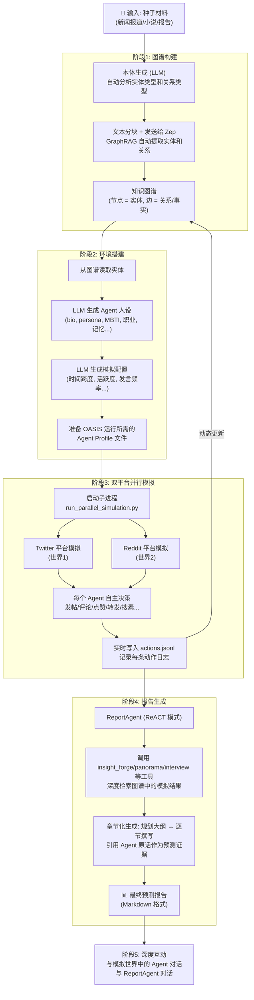
```mermaid
flowchart TD
    A["📄 输入: 种子材料\n(新闻报道/小说/报告)"] --> B

    subgraph "阶段1: 图谱构建"
        B["本体生成 (LLM)\n自动分析实体类型和关系类型"] --> C
        C["文本分块 + 发送给 Zep\nGraphRAG 自动提取实体和关系"] --> D
        D["知识图谱\n(节点 = 实体, 边 = 关系/事实)"]
    end

    D --> E

    subgraph "阶段2: 环境搭建"
        E["从图谱读取实体"] --> F
        F["LLM 生成 Agent 人设\n(bio, persona, MBTI, 职业, 记忆...)"] --> G
        G["LLM 生成模拟配置\n(时间跨度, 活跃度, 发言频率...)"] --> H
        H["准备 OASIS 运行所需的\nAgent Profile 文件"]
    end

    H --> I

    subgraph "阶段3: 双平台并行模拟"
        I["启动子进程\nrun_parallel_simulation.py"] --> J
        J["Twitter 平台模拟\n(世界1)"]
        I --> K
        K["Reddit 平台模拟\n(世界2)"]
        J & K --> L["每个 Agent 自主决策\n发帖/评论/点赞/转发/搜素..."]
        L --> M["实时写入 actions.jsonl\n记录每条动作日志"]
        M -->|"动态更新"| D
    end

    M --> N

    subgraph "阶段4: 报告生成"
        N["ReportAgent (ReACT 模式)"] --> O
        O["调用 insight_forge/panorama/interview 等工具\n深度检索图谱中的模拟结果"] --> P
        P["章节化生成: 规划大纲 → 逐节撰写\n引用 Agent 原话作为预测证据"] --> Q
        Q["📊 最终预测报告\n(Markdown 格式)"]
    end

    Q --> R["阶段5: 深度互动\n与模拟世界中的 Agent 对话\n与 ReportAgent 对话"]
```

为什么这能做到"决策推演"？

```
决策推演 = 现实锚定 + 群体涌现 + 时序演化 + 智能解读
```

1. **现实锚定**：种子材料 → 知识图谱，保证模拟基于真实的实体关系，而不是幻想
2. **群体涌现**：成千上万个独立人格的 Agent 自主交互，产生的群体行为模式是无法提前预设的，是真正的"涌现"
3. **时序演化**：双平台并行 + 时序记忆更新，模拟可以跨越72小时乃至更久，观察事件如何随时间演变
4. **上帝视角+智能解读**：ReportAgent 能检索整个模拟历史，用采访、全景搜索等工具综合分析，找出关键转折点和涌现规律

> 对比传统预测系统（如统计模型、规则引擎），MiroFish 的优势在于**路径可解释性**（可以追溯到具体是哪个 Agent 说了什么话引发了什么链式反应）和**高维复杂性**（同时考虑了数以百计的不同角色的不同反应）。

##### 1.3.2.4 场景启发

帮我分析一下公司今年开始实施的‘商机停滞对赌机制’的整体执行效果，这套制度到底有没有起到应有的催化作用？

**1、推演需求：**

```text
历史数据（真实）              仿真（假设）
    ↓                              ↓
政策A下，员工的真实表现    →  政策B下，员工会怎样表现？
(KPI完成率、签单数、日报频率)      (我们想预测的)
         ↑
    仿真结果要能对得上历史数据
    才能证明这个模型是可信的
```

**2、推演逻辑：**

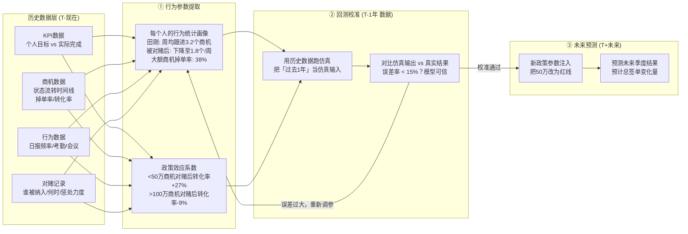
```mermaid
flowchart LR
    subgraph "历史数据层 (T-现在)"
        D1["KPI数据\n个人目标 vs 实际完成"]
        D2["商机数据\n状态流转时间线\n掉单率/转化率"]
        D3["行为数据\n日报频率/考勤/会议"]
        D4["对赌记录\n谁被纳入/何时/惩处力度"]
    end

    subgraph "① 行为参数提取"
        P1["每个人的行为统计画像\n田刚: 周均跟进3.2个商机\n被对赌后: 下降至1.8个/周\n大额商机掉单率: 38%"]
        P2["政策效应系数\n<50万商机对赌后转化率+27%\n>100万商机对赌后转化率-9%"]
    end

    subgraph "② 回测校准 (T-1年 数据)"
        B1["用历史数据跑仿真\n把「过去1年」当仿真输入"]
        B2["对比仿真输出 vs 真实结果\n误差率 < 15%？模型可信"]
    end

    subgraph "③ 未来预测 (T+未来)"
        F1["新政策参数注入\n把50万改为红线"]
        F2["预测未来季度结果\n预计总签单变化量"]
    end

    D1 & D2 & D3 & D4 --> P1 & P2
    P1 & P2 --> B1
    B1 --> B2
    B2 -->|"校准通过"| F1
    B2 -->|"误差过大，重新调参"| P1
    F1 --> F2

```

1）关键：历史数据不是"种子文本"，而是**行为概率参数**

MiroFish 的做法是把文本注入图谱，让 LLM 自由演绎。但在你这个场景，Agent 的行为必须**被历史数据约束**，否则仿真没有可信度。

具体来说，每个员工的真实历史数据，会变成 Agent 的**统计先验**：

2）访真参数提取

```
输入: 2024年Q1的真实初始状态 (员工列表、商机、客户关系等)
仿真参数: 2024年Q1当时的政策（全量对赌）
仿真运行: 模拟12周
输出: 预测的 KPI完成率分布、商机转化数量、掉单数

对比真实: 2024年Q1实际结果
               ↓
┌─────────────────────────────────────────┐
│  指标          仿真预测    真实结果    误差  │
│  总签单金额     1850万      2000万     7.5% │ ✅
│  KPI完成率均值  87%         82%        6%   │ ✅
│  大额商机掉单率  37%         40%        7.5% │ ✅
│  对赌人员转化率  44%         48%        8%   │ ✅
└─────────────────────────────────────────┘
误差均在 15% 以内 → 模型可信，可以用来预测未来

```

3）推演预测

```
当前真实数据（快照）
    +
新政策假设（唯一变量）:
    "50万以下: 继续对赌惩处"
    "50万以上: 改为主管协助攻坚待办"
    ↓
运行仿真12周
    ↓
预测结果（已经过回测校准，可信度有保障）:
    - 政策调整后: 大额商机掉单率 40% → 25%（预测）
    - 季度整体签单增量: +200万（预测）
    - 置信区间: ±15%（基于回测误差范围）
```


关键启示：这和 MiroFish 原生目标的差异

| 维度           | MiroFish（舆情仿真） | 你的销售推演                            |
| :------------- | :------------------- | :-------------------------------------- |
| Agent 行为来源 | LLM 基于人设自由创作 | **历史统计参数约束**的 LLM 决策         |
| 仿真可信度来源 | 人设是否真实         | **历史回测误差率**                      |
| 核心价值       | 发现涌现规律         | **量化新政策的具体影响**                |
| 结果形式       | 定性预测报告         | **有置信区间的定量预测**（+200万 ±15%） |

------

**一句话**：历史 CRM 数据做两件事——**第一，提取每个人的行为统计参数作为 Agent 的约束**（不是随便演）；**第二，用过去的真实结果来校准模型的准确度**，校准通过了，对未来的预测才有可信度。


### 1.4 总结分析

#### 1.4.1 产品趋势

| 阶          &nbsp;段              | **特&nbsp;&nbsp;&nbsp;&nbsp;&nbsp;&nbsp;&nbsp;&nbsp;征**     | **代表性企业 / 产品**                                        | **核心技术**                                                 |
| --------------------------------- | ------------------------------------------------------------ | ------------------------------------------------------------ | ------------------------------------------------------------ |
| **1. 数据分析&nbsp;&nbsp;&nbsp;** | **自然语言驱动的数据洞察：** 降低数据消费门槛。通过自然语言将意图转化为SQL或查询指令，从结构化和非结构化数据中提取信息。自动生成可视化图表，支持指定范围内的数据联动、下钻与基础诊断分析，实现从“查数”到“看数”的自动化。 | **帆软 / 网易数帆** (ChatBI) **Kyligence** (智能指标平台)    | Text-to-SQL / Text-to-Chart                                  |
| **2. 决策分析**                   | **基于语义本体的深度解析：** 通过语义本体图谱与AI结合，理解复杂业务逻辑，提供归因分析、风险预警和预测性洞察，辅助人类进行业务决策。 | **Palantir** (Foundry 操作系统)                              | 本体工程<br />增强生成 (RAG) 图数据库                        |
| **3. 决策推演**                   | **基于2B业务孪生的全局寻优与闭环：** 建立企业核心业务链,在虚拟世界中进行“What-if”沙盘推演，再进行决策。例如如果我增加10销售的话 ,业绩能否达成.如果实行对赌协议的话,业绩能够达成? | 1.palantir:手工编排推演。<br />2.新兴企业:simile\MiroFish 学术性上自动仿真和模拟。 | 1、数据分支和虚拟视图合并。<br /><br /><br />2、**离散事件仿真 (DES)** <br />**多智能体建模 (ABM / Multi-Agent)**<br />复杂系统仿真引擎 (Simulation) |

#### 1.4.2 技术护城河

AI时代,代码可以随时复克,但是沉淀的知识和经验无法带走。**测试才是新的护城河。**

-- 这个也就是说,产品我都开源给你,但是也只有付给给我,才能给你工业级的效果.


世界最流行的数据库 [SQLite](https://sqlite.org)，本身代码15.6万行，但是测试用例[9205万行](https://sqlite.org/testing.html)，足足大了590倍！

其中，最核心的测试套件 [TH3](https://sqlite.org/th3.html) 是闭源的，不公开，主要测试航空、医疗等关键行业的极端情况和边缘案例，属于核心技术资产。正是这些保密用例，才让 SQLite 难以复刻。

无独有偶，就在前两天，另一个开源项目 [tldraw](https://github.com/tldraw/tldraw/issues/8082) 也准备将测试用例闭源。


#### 1.4.3 百家之长

结合竞品，从致敬、差异化两个维度总结

| 类型 | 技术点 | 对标竞品与实现价值 | 备注/实现难度 |
| :--- | :--- | :--- | ---- |
| 致敬 | **数据虚拟化 ** | **致敬**：Palantir MMDP / KWeaver VEGA<br>**说明**：通过一个业务本体，映射外部不同数据原的数据。<br />1）映射到结构化数据源。<br />2）映射到非结构化的数据源。 | **评估指标**：<br />1、提供一个业务化的对象，并映射不到数据源。 |
| 致敬 | **联邦数据计算** | **致敬**：Palantir MMDP / C3.ai Polyglot Routing<br>**说明**：异构结构化数据源的计算及融合，包括大、中、小数据量的计算架构（例如toSpark、toSql）。 | **评估指标**：<br />面向大模型提供大、中、小数据量的计算架构。 |
| 致敬 | **数据操作分类及人工确认** | **致敬**：Palantir 、 KWeaver 。<br>**说明**：<br />1、区分查询类动作和操作类动作 。<br />2、操作类动作不要试错，需要人确认。 | **评估指标**：<br />识别操作类动作，运行时人工确认 |
| 致敬 | **决策数据溯源** | **致敬**：Palantir<br />**说明**：支持从结论溯源到数据，例如像报表指标一层层钻取到原始记录，甚至能自动归因（结合日志和图谱），做到溯源清晰可见。 | **评估指标**：<br />结论清晰标记出引用的数据并可通过下钻等手段溯源。 |
| 致敬 | **数据分析模板内置** | **致敬**：Palantir、清枫科技等<br />**说明**：AIP分析师，支持各类丰富的柱状图、饼图、同环对比等。 | **评估指标**：<br />1、支持丰富的展示组件进行展示。 |
| 致敬 | **行列级数据权限管理** | **致敬**：Palantir<br />**说明**：行列级数据权限管控。 |  |
| 致敬 | **异构数据融合增强** | 可以从逻辑、时间、空间三个维度对结构化、非结构化文档进行融合，并提供查询服务。 | |
| 差异化 | **生态化本体开发插件** | 1、基于cursor、Antigravity等IDE、git生态、open spec知识工程，提供本体智能开发能力。 | **评估指标**：<br />1、使用任意编码大模型+开发插件，可完成本体开发。 |
| 差异化 | 渐进式知识增强 | 有多少参数，就。<br />渐进式的数据收集。<br />知识加载（术语加载）。让更智能体（低压力、），弱大模型、事务、上下文记忆丢失。 | antireSearch（渐进式加载） |
| 差异化 | **基于术语的知识网络构建与应用** | **超越**：高效的数据意图方法<br />**说明**：<br />1、以术语为基础进行知识网络构建和应用，本体对象、视图、属性、方法、一切都是术语。<br />2、用MD文档描述逻辑，例如销售 有一个 “销售管理办法”的描述。<br />3、术语与术语之间可以额外添术语或普通文本标签。<br />1）以术语进行知识增强：知识冲突。（github是按行对比，我们以术语为中心进行对比）、知识关系<br />2）企业知识太多、知识质量。<br />3）基于关系可以找到动作。<br />4）cloude-Mem: 记忆机制（钩子），基于hook | **评估指标**：<br />1、用户的意图识别更准确。<br />2、用户问题转DSL更准确。<br />3、更轻量，例如业务规则基于MD来编写，不需要额外结构化治理。<br />4、消耗的时间、上下文更少。 |
| 差异化 | **资产自动沉淀和进化**           | **超越**：基于用户习惯洞察和沉淀数据知识<br />**核心差异**：<br />1、数据术语自动沉淀。<br />2、数据逻辑自动沉淀。<br />3、决策过程自动沉淀 | **评估指标**：<br />1、自我学习术语、数据查询逻辑、决策分析过程。<br />2、高频知识、数据的缓存机制。<br /> |


## 2 产品规划

### 2.1 产品定义

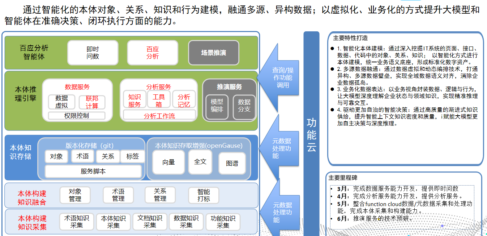

DataCloud定位：基于本体论构建企业级知识网络 ，为企业的经营活动提供数据分析、决策支持，推演服务。

--与数据中台差异.

本体推理引擎定位：基于企业已构建的本体网络，提供数据查询服务，业务分析服务，提供场景仿真推演服务(未来)。

### 2.2 与周边生态关系(OWL文件&API)

通过文件与API与周边系统进行对接,加载到数据库后提供服务.

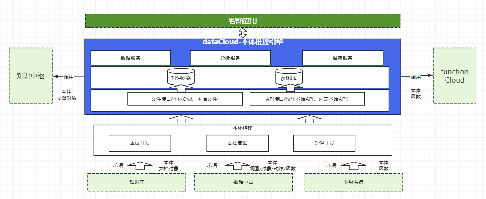

在线图： https://www.kdocs.cn/l/cqW1lpK9mRVn

1.与知识中枢、知识库关系：提供非结构化知识的来源，例如各类合同附件。

2.与function cloud的关系，提供手脚。

3.与数据中台\业务系统的关系,提供手脚.

### 2.3 竞争力规划

| 类型     | 竞争力                     | 说明                                                         |
| -------- | -------------------------- | ------------------------------------------------------------ |
| 生态     | 广泛的开源生态兼容与接入   | 1.支持原生支持 LangGraph 生态.<br />2.支持生态分析skills扩展接入.<br />3.支持任意本体网络接入；<br />4.支持原生 AI 开发本体开发 IDE;<br />5.支持异步调度引擎无缝接入. |
| 数据服务 | 大模型友好的业务化查询底座 | 1.依托“数据虚拟化”彻底屏蔽 API、文档、数据库表等异构物理源的差异；<br />2.通过“联邦计算”封装底层大数据处理与多步计算的复杂过程，为大模型提供极简、纯粹的语义级数据接口。 |
| 数据服务 | 原生细粒度数据安全管控     | 提供插件化的“行列级数据权限”机制，拒绝侵入式改造，支持无缝对接并复用企业现有的 IAM（身份与访问管理）及权限体系，筑牢数据合规与安全底线。 |
| 分析服务 | 渐进式高保真推理机制       | 深度结合“本体知识网络”，采用渐进式的信息收集与知识供给策略（按需投喂上下文），精准约束大模型的多步推理逻辑，有效消除 AI 幻觉并大幅提升准确率。 |
| 分析服务 | 意图驱动的生成式UI交互     | 1.支持 A2UI (Agent-to-UI) 范式，不仅能根据推理意图动态生成最匹配的前端可视化组件.<br />2.支持配套生成A2UI的后端服务,用户不仅能看到按需渲染的界面，还能直接进行动态的指标下钻、穿透查看底层明细清单等深度交互. |
| 分析服务 | 记忆的资产自进化闭环       | 1.支持用户在线固化高阶分析技能（SOP）；<br />2.平台在交互中自动沉淀行业方言（Jargon）与业务逻辑.<br />3.并基于长程分析记忆，实现智能的问前启发与问后推荐. |
| 推演服务 | 沙盘推演（手工编排）       | 企业级“可计算沙盘”， 能模拟、能推演、能执行、能写回， 并且在不复制数据的情况下保持一致性与可扩展性。 |


## 3 概要设计

### 3.1 功能架构

1、总体技术架构：

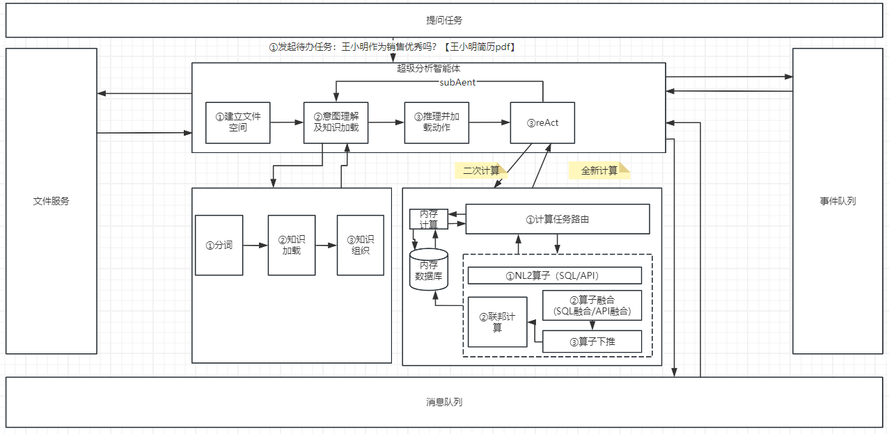

2、示例技术架构 ：

1）阶段1：查询知识

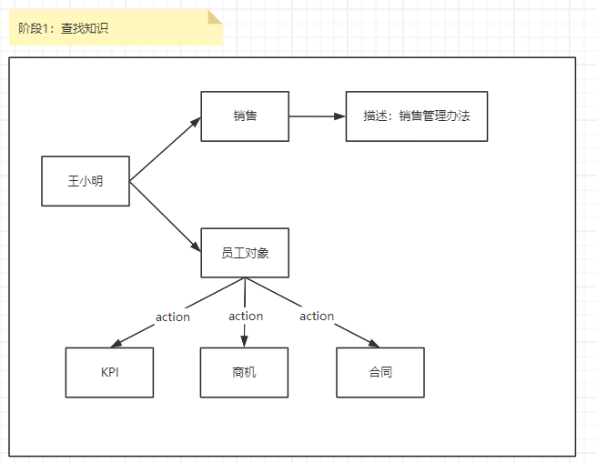

2）阶段2：进行问题分解

问题：王小明作为销售优秀吗？

知识：销售管理办法。

数据查询计划：

1、查询王小明(员工示例，工号2302323)签订的合同(合同对象ID：2323),

可用动作为：queryContractByStaffAccount

2、查询王小明(员工示例，工号2302323)跟进的商机(商机对象ID：2324)

可用动作为：queryBizOppByStaffAccount

2、查询王小明(员工示例，工号2302323)跟进的KPI(KPI对象ID：2325)

可用动作为：queryKpiByStaffAccount


3）阶段3：算子分解

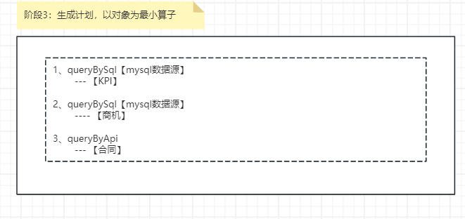

4)阶段4：算子融合

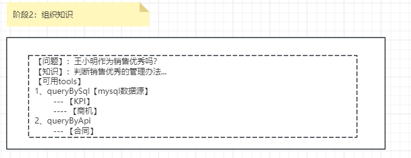


### 3.2 技术架构

为了实现“代码开源、核心测试闭源”的商业双轨制策略，整个工程骨架分为**主仓库（开源）**和**私有测试仓库（闭源）**两部分。
1、开源：数据查询、决策分析。

2、闭源：测试数据、测试用例，推演能力。

#### 3.2.1 whale_datacloud - 开源

基于单体仓库（Monorepo）模式，融合 AI 技能配置、国际化支持（i18n）与自动化规范，主仓库的标准目录树如下：

```text
whale_datacloud/
├── .github/                   # GitHub 自动化生态
│   ├── workflows/             # CI/CD 自动化流水线（Lint、Test、发布、AI Review）
│   ├── ISSUE_TEMPLATE/        # Issue 模板 (Bug/Feature)
│   ├── PULL_REQUEST_TEMPLATE.md # PR 规范模板
│   ├── FUNDING.yml            # 赞助者配置 (开源运营)
│   └── dependabot.yml         # 依赖自动升级配置
│
├── .ai/                       # AI 助手通用配置目录 (兼容各种 IDE 及 AI 工具)
│   ├── rules/                 # 全局 AI 编码规范 (如 python-standards.mdc，支持多工具读取)
│   ├── skills/                # 沉淀的各类开发 Skills (类似 OpenClaw 的 skills)
│   └── prompt/                # 预置的提示词模板 (如 code-gen.md、test-gen.md 等)
│
├── .cursor/                   # Cursor 特有配置 (可选)
├── .vscode/                   # VS Code 特有配置 (如 launch.json, settings.json)
│
├── docs/                      # 官方文档目录 (支持 i18n 国际化多语言)
│   ├── en/                    # 英文文档 (通常作为开源项目的默认主语言)
│   └── zh_CN/                 # 中文文档
│
├── locales/                   # 国际化(i18n)语言包目录 (存放工程与框架的多语言 JSON/YAML 文件)
│   ├── en/                    # 英文语言包
│   │   ├── datacloud-analysis.json # 分析模块专属的多语言词条与 Prompt 模板
│   │   ├── datacloud-data.json     # 数据模块专属的多语言词条
│   │   └── shared.json             # 跨模块通用的报错、提示语
│   └── zh_CN/                 # 中文语言包
│       ├── datacloud-analysis.json
│       ├── datacloud-data.json
│       └── shared.json
│
├── packages/                  # 【核心能力层】基础模块 SDK
│   ├── datacloud-analysis/    # 分析模块 SDK
│   ├── datacloud-data/        # 数据模块 SDK
│   ├── datacloud-knowledge/   # 知识图谱 SDK
│   └── datacloud-memory/      # 记忆服务 SDK
│
├── examples/                  # 【应用样例层】(原 datacloud-apps，含 Mock 数据)
│   ├── sales_analysis_demo/   # 场景演示应用及数据 (原 sales-analysis-agent)
│   │   ├── frontend/          # 演示应用的前端代码 (如 React/Vue/Gradio)
│   │   ├── backend/           # 演示应用的后端服务 (如 FastAPI 服务，调用各类 SDK)
│   │   ├── mock_env/          # 提供完整的测试模拟数据与桩服务 (如本地 SQLite 数据初始化、第三方 API Mock)
│   │   ├── eval_test/         # 自动化评测：包含针对当前 demo 的测试用例、脚本与基准数据集
│   │   │   ├── run_eval.sh    # 运行当前 Demo 自动化测试的启动脚本
│   │   │   └── cases/         # 测试用例定义文件
│   │   ├── docker-compose.yml # 独立拉起 demo 需要的全套服务依赖 (前端、后端、数据库等)
│   │   ├── start_demo.sh      # 本地一键启动脚本 (封装 docker-compose 或分别启动 front/back 进程)
│   │   └── README.md          # 当前 Demo 的快速启动与说明文档
│   └── e_commerce_demo/       # 其他行业 demo 示例
│
├── mcps/                      # MCP Servers 配置 (借鉴 Gemini CLI 理念，接入外部工具)
│   ├── query_db/              # MCP Server: 查询数据库相关技能
│   ├── query_logs/            # MCP Server: 查询应用日志相关技能
│   ├── web_search/            # MCP Server: 联网搜索技能
│   └── project_docs/          # MCP Server: 项目知识库查询服务 (将 docs/ 目录的内容作为 RAG/MCP 服务暴露给 AI)
│
├── scripts/                   # 全局自动化运维、AI 质量校验辅助脚本
│   ├── build.sh               # 编译和打包各个 package 的全局脚本
│   ├── run_module.sh          # 工具脚本：独立拉起某个指定的微服务/SDK进行调试 (如 ./run_module.sh datacloud-data)
│   ├── ci_ai_review.py        # 被 GitHub Actions 调用的全局 AI Review 脚本（读取 PR 变更，调用大模型检查代码是否符合 .ai/rules 规范，并自动评论到 PR 下方）
│   ├── ai_code_fix.py         # AI 自我反思与自动代码修正脚本 (用于本地 lint/test 失败时触发)
│   ├── auto_issue_handler.py  # GitHub Issue 自动打标与初步响应的 AI 脚本
│   └── test_runner.sh         # 本地运行全局全量测试的封装
│
├── tests/                     # 全局跨模块 E2E 测试与集成测试 (开源公共测试部分)
│   ├── e2e/                   # 跨多模块的完整链路测试 (如完整跑通 CRM 场景规划与执行)
│   ├── integration/           # 模块间(如 analysis <-> data) 的连通性测试
│   └── auto-gen/              # AI 根据用户反馈/Issue/报错自动沉淀生成的测试用例目录
│
├── .private/                  # 【本地挂载点】用于挂载闭源的 `whale_datacloud_private` 仓库。通过 Git Submodule 引入，并在本仓库的 .gitignore 中完全忽略，防止机密资产被推送到公共远端。
│
├── README.md                  # 给**人类**看的项目门面（徽章、简介、架构图、快速开始）
├── AGENTS.md                  # 给**AI**看的全局上下文文件 (告诉大模型这个项目的架构全貌、名词解释与大原则)
├── CONTRIBUTING.md            # 外部参与者的贡献指南（极重要：定义了如何提 PR、代码规范）
├── CODE_OF_CONDUCT.md         # 社区行为准则（营造健康的开源社区环境）
├── SECURITY.md                # 安全策略（指导用户如何报告安全漏洞）
├── CHANGELOG.md               # 遵循 Keep a Changelog 的版本变更日志
├── LICENSE                    # 开源协议 (建议 Apache 2.0)
├── Makefile                   # 常用的开发/构建/测试命令的快捷入口封装
├── .pre-commit-config.yaml    # 本地 Git Hook 配置（防范烂代码被 commit）
├── .editorconfig              # 跨编辑器格式化配置 (缩进、换行等)
├── .gitignore                 # Git 忽略配置
└── pyproject.toml             # Python 现代工程配置（包含依赖、打包、ruff、pytest 等工具配置）
```

#### 3.2.2 核心 SDK

##### 3.2.2.1-datacloud-analysis

作为整个工程的 AI 大脑，`datacloud-analysis`（原 `datacloud-agent`）必须遵循清晰的领域驱动设计（DDD）与单一职责原则。其内部目录骨架规范如下：

* **职责**：作为顶层 AI 核心引擎，提供独立的 SDK，利用大模型进行决策、规划和分析。
* **依赖流向**：依赖 `datacloud-data`（外部数据）、`datacloud-knowledge`（领域约束）、`datacloud-memory`（历史上下文）。

```text
packages/datacloud-analysis/
├── src/
│   └── datacloud_analysis/    # Python 标准包目录 (包名使用下划线)
│       ├── orchestration/     # 核心编排层：负责多步推理、意图识别与任务拆解 (如 DAG 生成、React Loop)
│       ├── message_handler/   # 消息处理层：负责对接外部消息、适配多端输入输出格式
│       ├── session/           # 会话管理层：处理上下文的组装、截断与状态持久化 (如对接 PG Checkpointer)
│       ├── tools/             # 工具层：定义可供大模型调用的 Tools (如对接 datacloud-data 和 knowledge 的胶水代码)
│       ├── workspace/         # 沙盒/工作区层：执行代码沙盒、动态挂载等环境隔离操作
│       ├── memory/            # 记忆层抽象：对接底层的 datacloud-memory SDK，实现长短期记忆的存取
│       ├── i18n/              # 内部多语言支持层 (负责加载全局 locales/ 下的 prompt 与文案)
│       └── config/            # 模块内专属配置解析 (如 Pydantic Settings, env 解析)
├── tests/                     # 当前分析模块专属的单元与功能测试 (Unit / Integration)
│   ├── unit/                  # 无外部依赖的极速单元测试 (如测试 Prompt 组装逻辑、纯函数的字符串匹配)
│   └── integration/           # 模块内部边界集成测试 (如测试当前 SDK 内部组件串联、或直接调用 LLM API 是否联通，绝不调用其他兄弟 SDK)
├── README.md                  # 本模块的接入使用文档 (供 backend 或其他 SDK 使用)
└── pyproject.toml             # 本模块的依赖声明文件 (仅声明本模块所需的库)
```

**设计要点**：

* 采用 `src/` 布局防范隐式路径注入。
* **内聚测试**：注意这里的 `tests/` 只负责当前 `datacloud-analysis` 自身的逻辑验证。涉及到跨越多个 SDK 的测试必须放到根目录的全局 `tests/` 中。
* 将大模型核心流转机制 (`orchestration`) 与外部消息输入 (`message_handler`)、历史上下文 (`session`) 完全解耦。
* 通过 `tools/` 统一收拢对其他 SDK（如 `datacloud-data`）的调用调用边界。

##### 3.2.2.2-datacloud-data

* **职责**：提供统一的各类数据查询能力抽象（API、数据库、文档），将分析层的意图转化为具体执行并返回结果。
* **依赖流向**：依赖 `datacloud-knowledge`（如 Schema 映射）、`datacloud-memory`。


##### 3.2.2.3-datacloud-knowledge

* **职责**：`knowledge` 提供领域术语、对象图谱等查询支持。
* **依赖流向**：无


##### 3.2.2.4-datacloud-memory

* **职责**：`memory` 提供上下文记忆存储能力.
* **依赖流向**：无


#### 3.2.3 whale_datacloud_private - 闭源

该仓库作为内部闭源资产，独立维护，并在开发时通过 Git Submodule 挂载到主仓库的 `.private/` 目录下（或并列存放在本地开发环境）。它不仅包含敏感测试用例，还包含那些高度定制化、不适宜公开的商业级业务场景应用。

```text
whale_datacloud_private/
├── examples/                  # 闭源的真实商业级场景应用
│   ├── finance_analysis_demo/ # 金融行业深度分析 Agent (含大量敏感业务逻辑)
│   │   ├── frontend/          # 定制化前端
│   │   ├── backend/           # 定制化后端，调用底层通用 SDK 并加入私有商业逻辑
│   │   ├── mock_env/          # 带有真实客户脱敏数据的 Mock 环境与测试桩
│   │   ├── eval_test/         # 针对该客户场景的专属 AI 准确率评测脚本与语料
│   │   ├── docker-compose.yml # 客户私有化部署的编排文件
│   │   └── README.md          # 私有项目启动说明
│   └── hr_analysis_demo/      # HR 人效分析场景
│
├── knowledge_bases/           # 商业级领域知识库 (行业黑话、本体图谱、私有 Prompt 模板)
│   ├── finance_ontology.json  # 金融行业专属对象字典与 schema 映射关系
│   ├── hr_terms_dict.yaml     # HR 行业的指标计算公式与“黑话”词典
│   └── advanced_prompts/      # 花费巨大人力调优的高阶 System Prompt 模板
│
├── analytical_skills/         # 高阶决策分析技能 (高级工具与商业推演模型)
│   ├── attribution_analysis/  # 归因分析引擎 (如：多维度拆解利润下降的根因算法)
│   ├── predictive_models/     # 预测分析技能 (接入外部机器学习模型进行销量、风险预测)
│   └── industry_reports/      # 自动化行业研报生成器模板与排版规则
│
├── tests/                     # 核心闭源测试用例
│   ├── TDD_cases/             # 核心商业逻辑的 TDD 测试用例（含敏感算法边界测试）
│   └── secure_eval/           # 包含敏感真实客户数据的效果评估测试集 (可被开源与闭源的 demo 共同调用测试)
│
└── README.md                  # 内部仓库说明及运行指南
```

**应用策略**：

* 开源主仓库 `examples/` 下仅保留 `sales_analysis_demo` 等 1~2 个通用且完全脱敏的 Demo，作为教学“样板房”。
* 私有仓库 `examples/` 下则沉淀团队为各行业大客户定制的深度场景。这些代码高度依赖底层的核心 SDK，是公司的核心数据资产。


### 3.3 部署架构

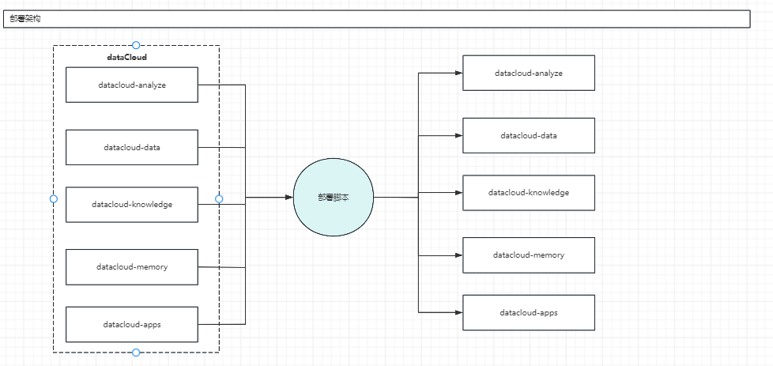


### 3.4 核心模块

#### 3.4.1 本体构建

该模块负责本体知识构建并提供构建后的OWL文件、术语知识构建并提供术语查询服务。

##### 6.1.1 本体概念

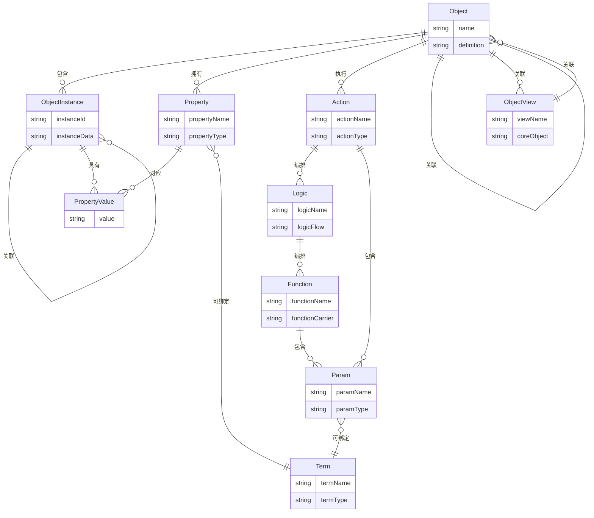
```mermaid
erDiagram
    Object ||--o{ ObjectInstance : "包含"
    Object ||--o{ Property : "拥有"
    Object ||--o{ Action : "执行"
    Object ||--o{ Object : "关联"
    ObjectInstance ||--o{ ObjectInstance : "关联"
    ObjectInstance ||--o{ PropertyValue : "具有"
    Property ||--o{ PropertyValue : "对应"
    Action ||--o{ Logic : "编排"
    Logic ||--o{ Function : "编排"
    Action ||--o{ Param : "包含"
    Function ||--o{ Param : "包含"
    Object ||--o{ ObjectView : "关联"
    ObjectView ||--o{ Object : "关联"
    Property }o--|| Term : "可绑定"
    Param }o--|| Term : "可绑定"
    
    Object {
        string name
        string definition
    }
    
    ObjectInstance {
        string instanceId
        string instanceData
    }
    
    Property {
        string propertyName
        string propertyType
    }
    
    PropertyValue {
        string value
    }
    
    Action {
        string actionName
        string actionType
    }
    
    Logic {
        string logicName
        string logicFlow
    }
    
    Function {
        string functionName
        string functionCarrier
    }
    
    Param {
        string paramName
        string paramType
    }
    
    ObjectView {
        string viewName
        string coreObject
    }
    
    Term {
        string termName
        string termType
    }
```

| ***\*概念\****              | ***\*定义\****                                               | ***\*示例\****                                               |
| --------------------------- | ------------------------------------------------------------ | ------------------------------------------------------------ |
| 对象(Object)                | 对象指现实世界实体或事件的模式定义。                         | 员工、组织、项目合同...                                      |
| 对象实例（Object instance） | 对象实例指的是对象定义下的单个业务实例。                     | 员工:[“王小明”,“王大明”,“李白”]                              |
| 属性(Property)              | 属性是现实世界实体或事件的特征的模式定义。区分为<br />1.存储属性:普通属性.<br />2.计算属性:绑定一个Function需要动态计算获得.<br />3.关联属性:绑定外键对象,根据对象关系获得.<br />4.时序属性:绑定特定时序表,例如温度,是一个序列数组. | 员工：姓名、性别、工号...                                    |
| 属性值(Property value)      | 属性值是指对象或现实世界实体或事件的单个实例的属性值。       | 员工：姓名=》王小明、性别=》男、工号=》202034301...          |
| 关系(Link type)             | 关系是指两个对象之间关系的架构定义。                         | 员工 【归属】 组织员工 【加入】 项目                         |
| 动作(Action)                | 动作指对象上执行的业务动作单元，例如差旅单申请单申请单对象的[提交]动作。动作可分为datacloud内置的动作及业务动作两类：1、内置动作：针对一个对象，dataCloud默认会增强保存、加载、删除，该类动作可用不对用户可见。2、业务动作：由用户自动创建的，在对象上可用可见。 | 员工-查询员工资料员工-重置员工密码员工-调整员工组织...Action可分为原子Action、组 合Action，每个Action包含1个或多个Functions |
| 逻辑(Logic)                 | 实现一个Action对应多个Funciton的流程编排。                   | 例如我要出差是一个Action，但是要对应查询机票Function，订票Function，出差申请Function，要靠Logic编排组织起来。 |
| 函数(Function)              | 函数指可提供可复用的计算逻辑，实现载体形式包括：插件、工具、mcp等能力。 | 对应插件引擎、BOT、外部发布到百应的各类 API                  |
| 视图(Object View)           | 视图是指以某一业务对象为核心，关联各领域对象形成的对象集合。视图核心目标是简化对象间纵深的多跳关系。 | 员工视图：包含员工对象、员工出差申请对象、员工报销申请对象。 |
| 术语(term)                  | 领域内有专有名字，包括字典术语、列表术语。                   | 例如概念类术语：客户，实例类术语，中国移动。                 |
| 参数(param)                 | 动作或函数上的参数，参数可绑定术语。                         | 例如入参、出参。                                             |


##### 6.1.2 术语概念


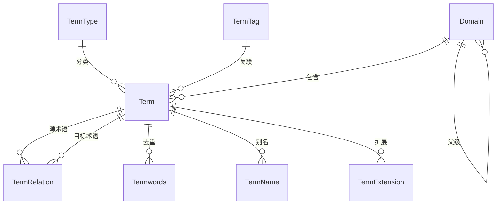
```mermaid
erDiagram
    Domain ||--o{ Term : "包含"
    Domain ||--o{ Domain : "父级"
    TermType ||--o{ Term : "分类"
    Term ||--o{ TermRelation : "源术语"
    Term ||--o{ TermRelation : "目标术语"
    TermTag ||--o{ Term : "关联"
    Term ||--o{ Termwords : "去重"
    Term ||--o{ TermName : "别名"
    Term ||--o{ TermExtension : "扩展"
    
    Domain {
    }
    
    TermType {
    }
    
    Term {
    }
    
    TermRelation {
    }
    
    TermTag {
    }
   
    
    Termwords {
    }
    
    TermName {
    }
    
    TermExtension {
    }
```

| **概念**                  | **定义**                                                     | **示例**                                                     |
| ------------------------- | ------------------------------------------------------------ | ------------------------------------------------------------ |
| 领域（Domain）            | 领域是术语的逻辑归类空间，用于按业务域、组织域、技术域对术语进行分组和权限隔离。 | 苹果，可以术语“水果”、“通讯”两个领域。                       |
| 术语类型（TermType）      | 术语类型用于对术语的角色进行分类，区分“概念类”“实例类”“枚举类”“别名类”等。 | TermType 中可包含：概念术语类型（如“对象概念”“属性概念”）、实例术语类型（如“员工实例”“客户实例”）。 |
| 术语（Term）              | 术语是业务领域内具有明确含义的最小知识单元，可代表对象、属性、动作、枚举值等。 | “员工”“客户”“销售额”“考勤异常”“王小明”“A省电信”等均可建模为术语。 |
| 术语关系（TermRelation）  | 术语关系描述术语之间的语义关联，如“上位/下位”“别名”“相关于”“引用”等。 | “王小明”→“员工”（实例隶属于概念）、“销售额”→“合同金额”（近义/别名）、“销售”→“销售评优管理办法”（指向规则）。 |
| 术语标签（TermTag）       | 术语标签是对术语的多维打标，用于搜索加权、推荐和权限控制等。 | 为术语“王小明”打上标签：“销售”“华东大区”“重点员工”；为术语“销售额”打上“指标类”“金额相关”等标签。 |
| 术语名称（TermName）      | 术语别名用于维护同一术语在不同系统、不同人群中的多种叫法，实现口语/系统名统一。 | 对于术语“王小明”，别名包含“小王”“销售王小明”；对于术语“客户名称”，别名包含“客户名”“单位名称”等。 |
| 术语扩展（TermExtension） | 术语扩展用于为术语挂接结构化/半结构化的补充信息，如业务规则、示例、注意事项。 | 为术语“销售”扩展一段“销售评优管理办法”规则文本；为术语“考勤异常”扩展判断逻辑与处理建议。 |
| 术语词汇（TermWords）     | 术语的使用的词汇表                                           |                                                              |


##### 6.1.3 交互阐述(工厂)

[阐述]


##### 6.1.4 提供服务

###### **6.1.4.1 [改进]字典术语查询**

​      根据”类型编码" 查询所有术语，适用于"字典"术语。例如：”学历"是一个"字典"类型，该类型下有[{"termCode"： "1”， "termName": "高中"},{"termCode"： "2”， "termName": "专科"},{"termCode"： "3”， "termName": "本科"}]术语列表，那么该场景的查询逻辑如下：

```markdown
**  入参 **

{"termType" = "EDUCATION", "termDatasetId": "知识库id"}

2）**返参**：

[{"termCode"： "1”， "termName": "高中", ...},{"termCode"： "2”， "termName": "专科", ...},{"termCode"： "3”， "termName": "本科", ...}]
```

【改进点】

1、需要支持批量查询。

2、需要返回术语的知识点描述。一个术语会有多个知识点。

3、需要返回术语打上的标签。

4、需要支持按标签进行检索。


###### **6.1.4.2 [改进]列表术语查询**

根据"类型编码"、"关键字" 查询topK条的术语，适用于"列表"术语。

例如：”项目"是一个"列表"类型，该类型下有[{"termCode"： "001”， "termName": "王小明"},{"termCode"： "002”， "termName": "王大明"},{"termCode"： "003”， "termName": "王红明"},...], 等上万条术语列表，那么该场景的查询逻辑如下：

```markdown
**入参**：

{"termType":"EDUCATION”，"keyword":”百应",  "searchType"："关键字检索/语义检索/混合检索", "topK": 10, "termDatasetId": "知识库id"}

**返参**：

[{"termCode"： "1”，"termName": "百应", "score": 1，"extAttribution":  [{"code": "视图", "value": "视图resource_id"} ] 
```

【改进点】

1、需要支持批量查询。

2、需要返回术语的知识点描述。一个术语会有多个知识点。

3、需要返回术语打上的标签。

4、需要支持按标签进行检索。


###### **6.1.4.3 [增加]获取术语的本体信息**

【支持批量术语，获取批量术语对应的OWL文件，包括视图、对象、动作、函数】


###### 6.1.4.4 [增加]术语分词服务

【根据用户问题，进行术语全分词】


###### 6.1.4.5 [增加]知识查询服务

【根据用户问题，进行分词，并返回分词术语一跳内的知识】


#### 3.4.2 数据服务


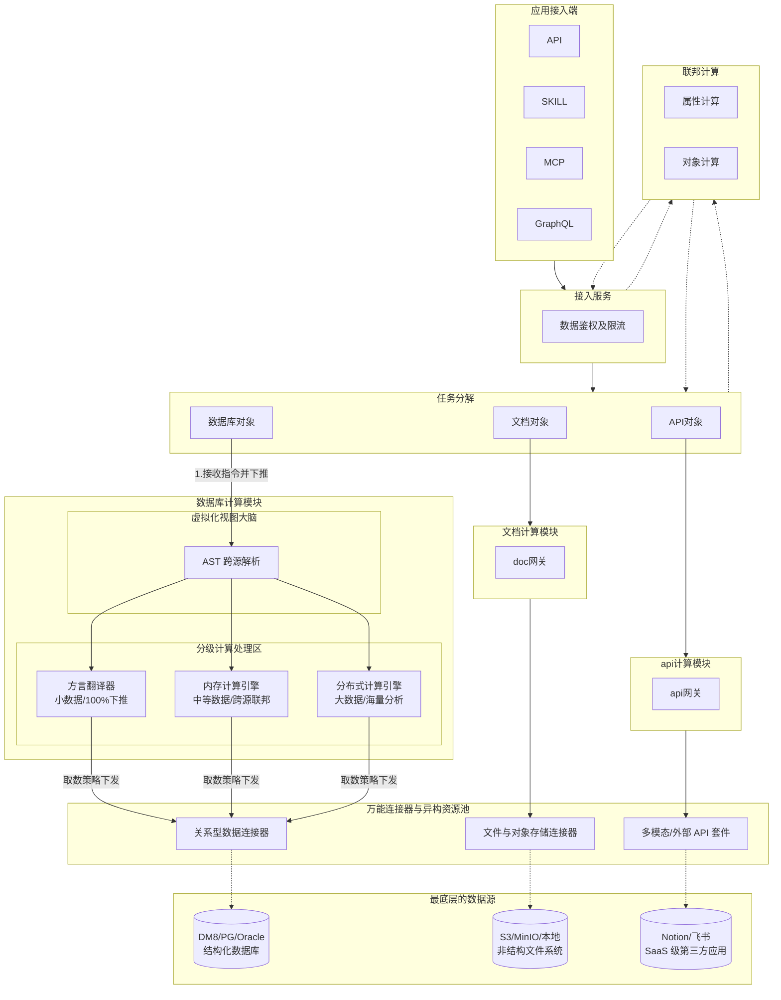
```mermaid
flowchart TD

	subgraph APP [应用接入端]
		API[API]:::comp
		SKILL[SKILL]:::comp
		MCP[MCP]:::comp
		GraphQL[GraphQL]:::comp
    end

    subgraph Gateway_GRAPH [接入服务]
        Gateway[数据鉴权及限流]:::comp
    end
    
    subgraph TASK_SPLIT_GRAPH [任务分解]
        API_TASK[API对象]:::comp
        DB_TASK[数据库对象]:::comp
        DOC_TASK[文档对象]:::comp        
    end
    
    subgraph API_EXETOR[api计算模块]
        Function_gateway[api网关]:::comp
    end

    subgraph DB_EXETOR [数据库计算模块]
        subgraph Virtual [虚拟化视图大脑]
            Parser[AST 跨源解析]:::comp
        end
        subgraph Process [分级计算处理区]
            Translator[方言翻译器<br/>小数据/100%下推]:::engine
            DuckDB[内存计算引擎<br/>中等数据/跨源联邦]:::engine
            Trino[分布式计算引擎<br/>大数据/海量分析]:::engine
        end
    end
    
    subgraph DOC_EXETOR [文档计算模块]
        DOC_gateway[doc网关]:::comp
    end

    subgraph Connector [万能连接器与异构资源池]
        SQLConn[关系型数据连接器]:::comp
        NoSQLConn[文件与对象存储连接器]:::comp
        APIConn[多模态/外部 API 套件]:::comp
    end

    subgraph Storage [最底层的数据源]
        DB[(DM8/PG/Oracle<br/>结构化数据库)]:::storage
        S3[(S3/MinIO/本地<br/>非结构文件系统)]:::storage
        SaaS[(Notion/飞书<br/>SaaS 级第三方应用)]:::storage
    end
    
    
    subgraph TASK_COMPUT_GRAPH [联邦计算]
        PRO_COMPUT[属性计算]:::comp
        OBJ_COMPUT[对象计算]:::comp
    end
    
    %% 应用接入
    APP --> Gateway_GRAPH
    
    %% 分解
    API_TASK --> API_EXETOR
    Gateway_GRAPH --> TASK_SPLIT_GRAPH
    DOC_TASK --> DOC_EXETOR

    %% 内部流转
    Parser --> Translator
    Parser --> DuckDB
    Parser --> Trino
    
    DOC_EXETOR --> NoSQLConn
    API_EXETOR --> APIConn

    %% 关联编排
    DB_TASK -->|1.接收指令并下推| Parser

    
    Translator -->|取数策略下发| SQLConn
    DuckDB -->|取数策略下发| SQLConn
    Trino -->|取数策略下发| SQLConn
    
  
    SQLConn -.-> DB
    NoSQLConn -.-> S3
    APIConn -.-> SaaS
    
    %% 关联编排
    TASK_SPLIT_GRAPH  -.->  TASK_COMPUT_GRAPH
    TASK_COMPUT_GRAPH  -.->  TASK_SPLIT_GRAPH
    
    Gateway_GRAPH  -.->  TASK_COMPUT_GRAPH
    TASK_COMPUT_GRAPH  -.->  Gateway_GRAPH
    

```


#### 3.4.3 分析agent

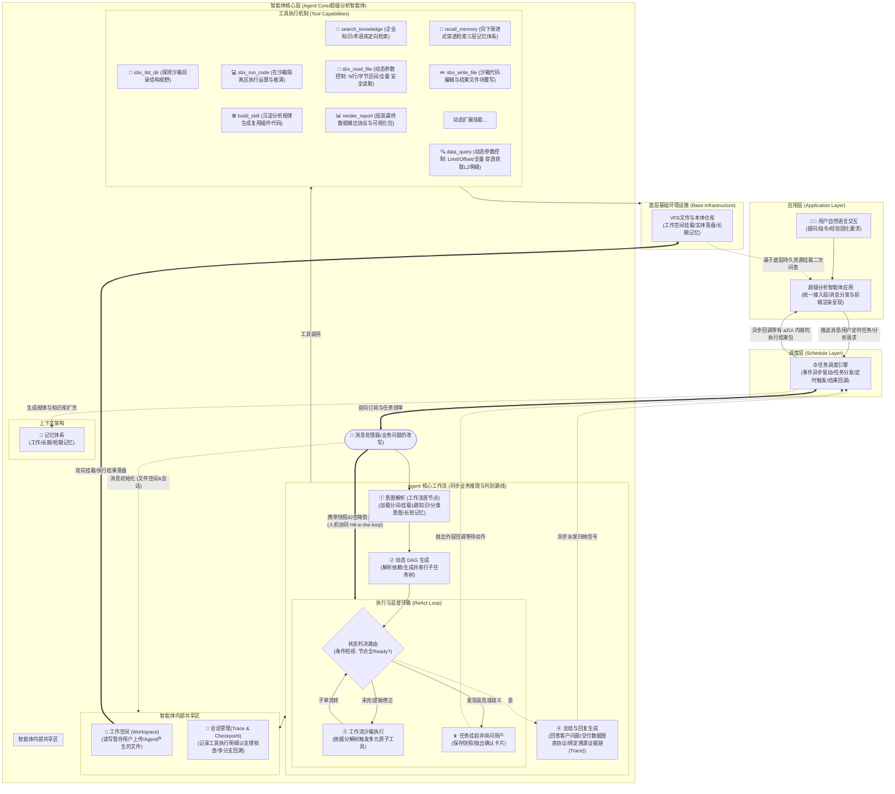
```mermaid
flowchart TB
    %% 1. 交互与接入层
    subgraph APP_LAYER["应用层 (Application Layer)"]
        direction LR
        USER_REQ["🧑‍💻 用户自然语言交互<br>(提问/指令/经验固化要求)"]
        APP_SVC["超级分析智能体应用<br>(统一接入层/消息分发与前端渲染呈现)"]
        USER_REQ --> APP_SVC
    end

    %% 2. 调度层
    subgraph SCHEDULE_LAYER["调度层 (Schedule Layer)"]
        TASK_ENGINE["⏰ 任务调度引擎<br>(事件异步驱动/任务分发/定时触发/结果回调)"]
    end
    
    %% 连接应用层与调度层
    APP_SVC -- "推送消息/用户定时任务/分析请求" --> TASK_ENGINE
    TASK_ENGINE -- "异步回调带有 a2Ui 内容的执行结果包" --> APP_SVC

    %% 3. 核心控制层
    subgraph AGENT_CORE["智能体核心层 (Agent Core/超级分析智能体)"]
        direction TB
        
        %% 核心层唯一请求接入点与前置准备
        AGENT_GATEWAY(["🚀 消息处理器(业务问题的改写)"])
                 
        subgraph AGENT_ORCH["Agent 核心工作流 (同步业务推理与判别路线)"]
            direction TB
            PRE_KNOW["① 意图解析 (工作流首节点)<br>(加载分词/挂载1跳知识/分类意图/长短记忆)"]
            DAG_PLAN["② 动态 DAG 生成<br>(解析依赖/生成并串行子任务树)"]
            
            subgraph LOOP_REGION["执行与监督环路 (ReAct Loop)"]
                direction TB
                CHECKER{"状态判决路由<br>(条件检视: 节点全Ready?) "}
                DO_TASK["③ 工作流沙箱执行<br>(依据分解树触发多元原子工具)"]
                HITL_NODE["⏸️ 任务挂起并询问用户<br>(保存快照/抛出确认卡片)"]
                
                CHECKER --未完/逻辑修正--> DO_TASK
                CHECKER --发现高危或歧义--> HITL_NODE
                DO_TASK --子单流转--> CHECKER
            end
            
            INSIGHT["④ 总结与回复生成<br>(回答客户问题/交付数据图表协议/绑定溯源证据链(Trace))"]
            
            PRE_KNOW --> DAG_PLAN --> CHECKER
            CHECKER -.是.-> INSIGHT
        end
        
        subgraph AGENT_CONTEXT["上下文架构"]
            direction LR
            MEM_MGR["🧠 上下文架构"]
        end

        subgraph AGENT_INFRA["智能体内部共享区"]
            direction LR
            WORKSPACE["📁 工作空间 (Workspace)<br>(读写暂存用户上传/Agent产生的文件)"]
            SESSION_TREE["🌳 会话管理(Trace & Checkpoint)<br>(记录工具执行明细以支撑核查/多分支回溯)"]
        end
        
        subgraph AGENT_MEM["智能体内部共享区"]
            direction LR
            MEM_MGR["🧠 记忆体系<br>(工作/长期/短期记忆)"]
        end
        subgraph TOOLBOX["工具执行机制 (Tool Capabilities)"]
            direction LR
            
            %% 知识与记忆认知系
            T_KNOW_SEARCH["📖 search_knowledge (企业知识/术语库定向检索)"]
            T_MEM_RECALL["🧠 recall_memory (向下渐进式穿透检索三层记忆体系)"]
            
            %% 数据基建探测与执行系 (按需下推)
            T_DATA_QUERY["🔍 data_query (动态参数控制: Limit/Offset/全量 穿透获取L2明细)"]
            
            %% 沙箱操纵的三剑客 (Sandbox 系 - 支持游标/截断)
            T_SBX_LIST["📂 sbx_list_dir (探测沙箱目录结构视野)"]
            T_SBX_RUN["💻 sbx_run_code (在沙箱隔离区执行运算与推演)"]
            T_SBX_READ["📄 sbx_read_file (动态参数控制: N行/字节区间/全量 安全读取)"]
            T_SBX_WRITE["✏️ sbx_write_file (沙箱代码编辑与结果文件块覆写)"]
            
            %% 自举技能。
            T_SKILL_BUILD["🛠️ build_skill (沉淀分析规律生成复用插件代码)"]
            
            %% 终总结局系
            T_REPORT["📊 render_report (组装最终数据输出协议与可视化包)"]
            T_EXTEND_TOLL["动态扩展技能..."]
            
            %% 隐形排版
            T_KNOW_SEARCH ~~~ T_MEM_RECALL
            T_DATA_QUERY
            T_SBX_LIST ~~~ T_SBX_RUN ~~~ T_SBX_READ ~~~ T_SBX_WRITE
            T_SKILL_BUILD ~~~ T_REPORT ~~~ T_EXTEND_TOLL
        end
        
        AGENT_GATEWAY --> PRE_KNOW
        AGENT_GATEWAY -. 消息初始化 (文件空间&会话) .-> AGENT_INFRA
        AGENT_GATEWAY == "携带快照ID空降恢复执行<br>(人机协同 Hit-in-the-loop)" ===> LOOP_REGION
        HITL_NODE -. 抛出外层回调等待动作 .-> TASK_ENGINE
        AGENT_ORCH <--> AGENT_INFRA
        INSIGHT -.异步派发归纳信号.-> TASK_ENGINE
    end

    %% Agent 从任务引擎订阅事件
    TASK_ENGINE <== "双向订阅与任务领单" ==> AGENT_GATEWAY

    %% 4. 工具箱层：引入元工具(Meta-Tool)与动态技能库
    

    %% 5. 底层基设施层
    subgraph BASE_INFRA["底层基础环境设施 (Base Infrastructure)"]
        direction LR
        B_FILE["VFS文件与本体仓库<br>(工作空间挂载/实体落盘/长期记忆)"]
    end

    %% 连线关系映射
    AGENT_ORCH --工具调用--> TOOLBOX
    TOOLBOX --> BASE_INFRA
    
    %% ==========================================
    %% --- 【超级智能体生态流转与自我进化闭环特写】 ---
    %% ==========================================
    
    %% 进化阶段 1: 异步资产总结与能力抽象
    TASK_ENGINE -.生成规律与知识库扩充.-> MEM_MGR
    
    %% 进化阶段 2: 存储持久化
    WORKSPACE == 双向挂载/执行结果落盘 ==> B_FILE
    
    %% 进化阶段 3: 引用历史再提问与意图滋养反哺
    B_FILE -. 基于底层持久资源挂载二次问答 .-> APP_SVC
```


## 4 开发实施

dataCloud开发团队3人: 一个产品经理, 一个Java应用开发,一个算法工程师.

| 版本 | 模块                                                         | 描述 |
| ---- | ------------------------------------------------------------ | ---- |
| 0330 | 【数据查询服务】：<br />1.具备在线数据查询能力: 通过自然语言实现大小数据量, 异构对象的查询.<br />2.通过超级分析智能体整合数据服务,知识服务,跑通最小化流程. |      |
| 0420 | 【开源-数据查询服务-V1】：别的agent可通过MCP，api集成dataCloud的数据查询组件。 |      |
| 0430 | 【开源-数据查询服务-V2】：<br />1、准确率调优。<br />2、性能调优。 |      |
| 0430 | 【决策分析服务】<br />1.实现数据分析模块并与周边生态整合: 与任务调度引擎对接, 本体构建引擎对接.<br />2.性能及准确率调优: 使用销售分析进行准确率和性能评测. |      |
| 0515 | 【开源-决策分析服务-V1】：可以基于本框架，搭建决策分析应用。 |      |
| 0530 | 【开源-决策分析服务-V2】：可以基于本框架，搭建决策分析应用。<br />1.开发A2Ui,A2API分析模块.<br />2.进行准确率调优.<br />3.记忆自进化功能：进行固化任务,记忆进化功能开发. |      |
| 0630 | 【决策推演服务-技术预研】<br />1.基于手工编排进行推演仿真    |      |
| 0730 | 【决策推演服务】推演仿真模块技术预研.                        |      |
|      |                                                              |      |


## 5 其它 

### 5.1 详细设计

[本体服务模块]: ./本体服务_模块设计/本体服务_模块设计.md
[知识服务_模块设计]: ./知识服务_模块设计/知识服务_模块设计.md
[超级数据分析智能体_模块设计]: ./超级数据分析智能体_模块设计/超级分析智能体_模块设计.md
