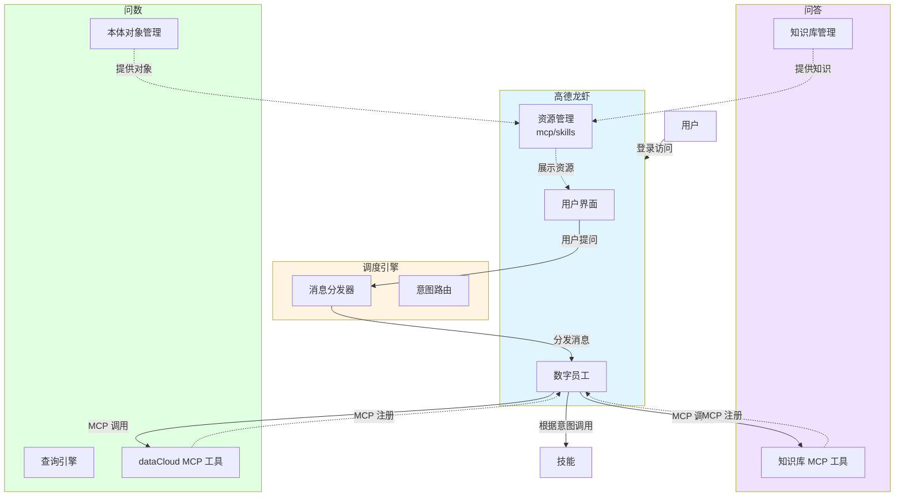
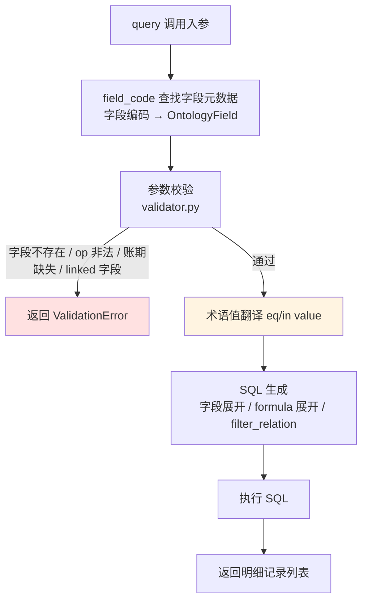
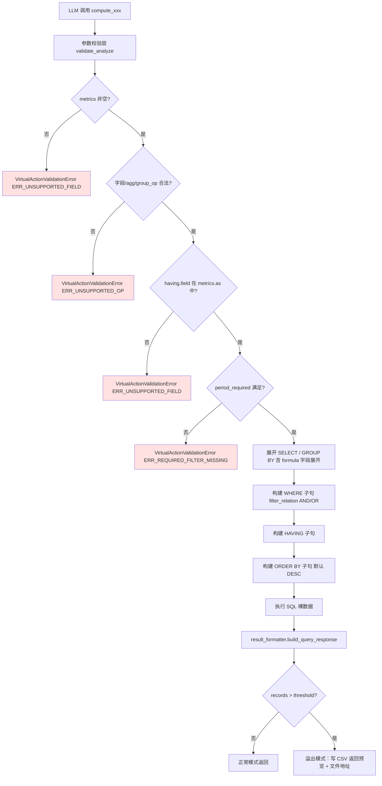
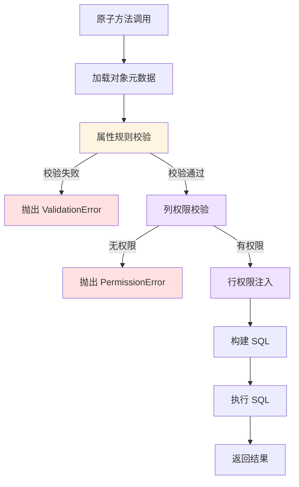
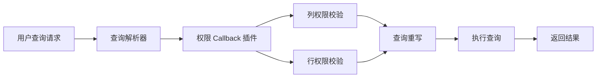

# 本体对象重构-20260407

## 1.需求背景

本体的生产模型不允许直接碰数据库，应该是提供很多原子方法，通过技能进行组织。


## 2.概要设计

### 2.1 总体架构

系统由门户、调度引擎、知识中枢、dataCloud 四个核心模块组成，通过 MCP 协议实现模块间的通信与协作。



**架构说明：**

1. **门户模块**：用户入口，提供统一的用户界面，展示知识库、技能、本体对象等资源，支持用户指定资源进行问答
2. **调度引擎**：消息中枢，接收用户提问并进行意图识别，将请求分发给数字员工处理
3. **知识中枢**：通过 MCP 协议注册到数字员工，提供知识库相关的工具能力
4. **dataCloud**：通过 MCP 协议注册到数字员工，提供本体对象查询和数据分析能力


### 2.2 数据流程（王威）


## 3.模块设计

### 3.1 门户模块


### 3.2 dataCloud

#### 3.2.1 对象属性规则

对象属性分为维度和度量两大类，不同类型的属性在分组、条件过滤、统计计算上有不同的规则约束。

| 属性类型 | 属性类型编码 | 属性子类 | 属性子类编码 | 分组规则                                                     | 条件规则                                                     | 统计函数规则                                                 | 使用示例                                                     | 备注                                       |
| -------- | ------------ | -------- | ------------ | ------------------------------------------------------------ | ------------------------------------------------------------ | ------------------------------------------------------------ | ------------------------------------------------------------ | ------------------------------------------ |
| 维度     | DIMENSION    | ID       | id           | 仅支持按自身分组                                             | 1. 适用场景：WHERE 条件、CASE WHEN 条件<br />2. 支持函数：IN、= | ---                                                          | GROUP BY 企业ID<br />WHERE 企业ID IN ('001', '002')          | 外键、英文编码枚举                         |
| 维度     | DIMENSION    | 名称     | name         | 仅支持按自身分组                                             | 1. 适用场景：WHERE 条件、CASE WHEN 条件<br />2. 支持函数：IN、LIKE、= | ---                                                          | GROUP BY 企业名称<br />WHERE 企业名称 LIKE '%科技%'          | 中文字符串枚举                             |
| 维度     | DIMENSION    | 时间     | datetime     | 支持时间粒度函数：<br />DATE()、MONTH()、YEAR()、QUARTER()   | 1. 适用场景：WHERE 条件、CASE WHEN 条件<br />2. 支持函数：IN、=、<=、>=、<、>、BETWEEN | ---                                                          | GROUP BY MONTH(创建时间)<br />WHERE 创建时间 >= '2026-01-01' |                                            |
| 维度     | DIMENSION    | 账期     | period       | 支持时间粒度函数：<br />DATE()、MONTH()、YEAR()、QUARTER()   | 1. 适用场景：WHERE 条件、CASE WHEN 条件<br />2. 支持函数：IN、=、<=、>=、<、>、BETWEEN | ---                                                          | GROUP BY MONTH(账期)<br />WHERE 账期 = '2026-03'             |                                            |
| 维度     | DIMENSION    | 数值     | numeric      | ---                                                          | 1. 适用场景：WHERE 条件、CASE WHEN 条件<br />2. 支持函数：IN、=、<=、>=、<、> | ---                                                          | 仅用于过滤条件<br />CASE WHEN 年龄 > 组织平均年龄 then 1 else 0 | 粗粒度下放用于比较                         |
| 维度     | DIMENSION    | 描述     | description  | ---                                                          | 1. 适用场景：WHERE 条件、CASE WHEN 条件<br />2. 支持函数：LIKE | ---                                                          | GROUP BY 产品描述<br />WHERE 产品描述 LIKE '%美食%'          |                                            |
| 维度     | DIMENSION    | 虚拟标签 | virtual_tag  | 仅支持按自身分组                                             | 1. 适用场景：CASE WHEN 条件<br />2. 支持函数：IN、=          | ---                                                          | CASE WHEN 身高 > 185 and 月收入 > 100000 and 颜值 > 95 then 1 else 0<br /> GROUP BY 高富帅 | 放在本体对象的计算属性                     |
| 度量     | MEASURE      | 主键     | primary_key  | 仅支持按自身分组                                             | 1. 适用场景：WHERE 条件、CASE WHEN 条件<br />2. 支持函数：=、IN | COUNT()                                                      | COUNT(企业ID)                                                |                                            |
| 度量     | MEASURE      | 普通数值 | raw_number   | 支持范围分组：<br />RANGE(开始值, 结束值, '标签')<br />示例：RANGE(0, 6, '婴儿') | 1. 适用场景：WHERE 条件、CASE WHEN 条件<br />2. 支持函数：IN、=、<=、>=、<、> | SUM()、AVG()、MAX()、MIN()、TOPN()、MEDIAN()                 | GROUP BY RANGE(年龄, 0, 18, '未成年')<br />SUM(收入)         |                                            |
| 度量     | MEASURE      | 普通指标 | basic_metric | 支持范围分组：<br />RANGE(开始值, 结束值, '标签')<br />示例：RANGE(0, 1000000, '小微企业') | 1. 适用场景：WHERE 条件、CASE WHEN 条件<br />2. 支持函数：IN、=、<=、>=、<、> | SUM()、AVG()、MAX()、MIN()、TOPN()、MEDIAN()                 | GROUP BY RANGE(年营收, 0, 1000000, '小微企业')<br />SUM(年营收) | 预计算的聚合指标，如年营收、总销售额       |
| 度量     | MEASURE      | 拍照指标 | snapshot_metric | 支持范围分组：<br />RANGE(开始值, 结束值, '标签')<br />示例：RANGE(0, 10000000, '小规模') | 1. 适用场景：WHERE 条件、CASE WHEN 条件<br />2. 支持函数：IN、=、<=、>=、<、> | MAX()、MIN()、TOPN()、MEDIAN()、 SUM() 在账期不可加，其他维度可加 | GROUP BY RANGE(期末余额, 0, 10000000, '小规模')<br />MAX(期末余额) | 时点快照值，如期末余额、月末库存           |
| 度量     | MEASURE      | 派生指标 | derived_metric | 支持范围分组：<br />RANGE(开始值, 结束值, '标签')<br />示例：RANGE(0, 0.3, '低利润率') | 1. 适用场景：WHERE 条件、CASE WHEN 条件<br />2. 支持函数：IN、=、<=、>=、<、> | ---                                                          | GROUP BY RANGE(毛利率, 0, 0.3, '低利润率')<br />WHERE 毛利率 >= 0.5 | 比率类，不可二次计算，仅可比较和展示       |
| 度量     | MEASURE      | 指标公式 | formula_metric | 支持范围分组：<br />RANGE(开始值, 结束值, '标签')<br />示例：RANGE(0, 0.5, '低转化') | 1. 适用场景：CASE WHEN 条件<br />2. 支持函数：IN、=、<=、>=、<、> | SUM()、AVG()、MAX()、MIN()、TOPN()、MEDIAN()                 | CASE WHEN (收入 - 成本) / 收入 > 0.5 THEN '高毛利' ELSE '低毛利'<br />SUM(收入 - 成本) | 放在本体对象的计算属性，虚拟的，要实时计算 |

---


#### 3.2.2 query_ontology方法

ontology_query（MCP 工具前缀：`query_`）是本体的**明细检索**方法，对标 SQL 的 `SELECT … FROM … WHERE … ORDER BY … LIMIT`，**不含任何聚合/分组**。如需统计汇总，使用 `analyze_` 方法（见 3.2.3）。


##### 3.2.2.0 名称及描述

**1、命名规则**

```
query_{对象/视图的编码}
```

示例：
- `query_ads_manage_grid_analysis`  → 管理网格清单明细查询
- `query_enterprise_base`           → 企业基础信息明细查询


**2、描述模板**

描述由 `build_query_description()` 自动生成，LLM 在 function call 时读取此描述来判断"是否调用该工具"及"如何填参数"。模板结构如下：

```
{对象/视图的业务描述}

按条件查询 {对象名称} 明细。支持字段过滤、排序、分页；不支持聚合统计。
仅允许使用下表中声明的字段和操作符。{若含账期字段则追加：必须包含账期过滤。}

**何时使用**：查看具体记录列表时使用；不适用于统计汇总，如需统计请用 compute类 动作。

**强制限制**：        ← 若含账期字段时追加
- 必须在 filters 中传入账期（period）字段过滤条件

**可用字段**：
| 字段编码 | 业务名 | 角色 | 类型 | 可过滤(op) | 可分组 | 可聚合 | 特殊说明 |
| -------- | ------ | ---- | ---- | ---------- | ------ | ------ | -------- |
| enterprise_id | 企业ID | dimension | id | eq/in | - | - | |
| enterprise_name | 企业名称 | dimension | name | eq/in/like | - | - | |
| period | 账期 | dimension | period | eq/in/gte/lte/between | - | - | 必须过滤 |
| revenue | 企业收入 | measure | indicator | eq/in/gt/gte/lt/lte | range | sum/avg/min/max | |
| ...（全部字段） |

**常见错误**：
- 使用了字段不支持的 op 操作符（如对 id 字段使用 like）
- 缺少账期（period）过滤条件（对象含账期字段时必须指定）
```

**3、描述设计对 function call 精准性的影响**

| 设计要点 | 效果 |
| -------- | ---- |
| 首句明确"明细"与"统计"的区别，并指向 analyze | 避免大模型对统计意图误调 query |
| 字段表含完整的 `可过滤(op)` 列（枚举所有合法操作符） | 大模型直接从表中读合法 op，不靠猜测，减少幻觉 |
| 字段表含 `类型` 列（id/name/time/period/number/indicator） | 帮助大模型理解字段语义，正确填写 value 格式 |
| 账期字段特殊说明"必须过滤" | 防止遗漏账期条件，导致全表扫描或结果错误 |
| 对象业务描述在首位 | 帮助大模型判断该对象是否匹配用户意图，进而决定是否调用 |


##### 3.2.2.1 参数

共 6 个参数，**全部可选**（无必填，但含账期字段的对象 `filters` 中账期为强制项）。多个 `filters` 条目之间的连接方式由 `filter_relation` 控制，默认 AND。

> **字段值约定**：`select`、`filters.field`、`order_by.field` 均填写字段**编码**（本体属性的 `field_code`，如 `enterprise_name`），执行层直接映射为物理列名，LLM 无需感知中文名到编码的转换。

| 参数 | 类型 | 必填 | 默认值 | 说明 |
| ---- | ---- | ---- | ------ | ---- |
| `select` | `array[string]` | 否 | 空（返回全部字段） | 指定返回的字段编码列表 |
| `filters` | `array[FilterItem]` | 否* | 空（无过滤） | 过滤条件列表 |
| `filter_relation` | `string` | 否 | `"AND"` | `filters` 条目间的连接逻辑：`"AND"` 或 `"OR"` |
| `order_by` | `array[SortItem]` | 否 | 空（不排序） | 排序规则列表 |
| `limit` | `integer` | 否 | 100 | 最大返回行数，1～1000 |
| `offset` | `integer` | 否 | 0 | 分页偏移，配合 limit 使用 |

*含账期字段的对象，`filters` 中必须含账期条件。

---

###### 参数1：`select`

**含义**：指定需要返回的字段，填字段**编码**（枚举值）。

| 项 | 值 |
| -- | -- |
| 类型 | `array[string]` |
| 元素取值 | 枚举，限定为对象声明的字段编码，如 `["enterprise_name", "period", "revenue"]` |
| 为空时 | 返回对象全部字段 |

**LLM 填写规则**：从用户问题中提取明确需要的字段，直接填字段编码。不确定时留空由系统返回全量字段。

**示例**：
```json
"select": ["enterprise_name", "period", "revenue"]
```

**`field_code → 物理列名` 运行时映射**（执行层，LLM 不感知）：
```
"enterprise_name"  → physical_col: ent_name
"period"           → physical_col: period_month
"revenue"          → physical_col: revenue_amt
"tax_rate"         → derived(expression): (total_tax / total_revenue * 100)
"yield_per_mu"     → derived(expression): (total_revenue / grid_area / 10000)
```

> **派生指标 / 指标公式字段的 SELECT 展开**（执行层）：`property_kind=derived, mode=expression` 的字段不映射到物理列，而是展开为 SQL 表达式并附加 AS 别名：
> ```sql
> (total_tax / total_revenue * 100) AS "企业实际税负率"
> ```

---

###### 参数2：`filters`

**含义**：WHERE 过滤条件列表，每项为一个字段的条件，条目间连接方式由 `filter_relation` 决定。

| 项 | 值 |
| -- | -- |
| 类型 | `array[FilterItem]` |
| 连接方式 | `filter_relation` 参数控制：`"AND"`（默认）或 `"OR"` |
| 含账期对象 | 必须包含账期字段的条件 |

**FilterItem 结构**：

| 字段 | 类型 | 必填 | 说明 |
| ---- | ---- | ---- | ---- |
| `field` | string | 是 | 字段**编码**（枚举，限声明字段的 field_code） |
| `op` | string | 是 | 操作符（枚举，见下表，每个字段允许的 op 不同） |
| `value` | any | 条件性 | 过滤值；`is_null` / `is_not_null` 时不传；`between` 传 `[起始, 终止]` 数组 |

**操作符（op）枚举及适用范围**：

| op | SQL 翻译 | 适用属性子类编码 | value 格式 |
| -- | -------- | ---------------- | ---------- |
| `eq` | `col = v` | 全部 | 单值 |
| `in` | `col IN (v1, v2, ...)` | 全部 | 数组 |
| `gt` | `col > v` | datetime / period / numeric / raw_number / basic_metric / snapshot_metric / derived_metric / formula_metric | 单值 |
| `gte` | `col >= v` | datetime / period / numeric / raw_number / basic_metric / snapshot_metric / derived_metric / formula_metric | 单值 |
| `lt` | `col < v` | datetime / period / numeric / raw_number / basic_metric / snapshot_metric / derived_metric / formula_metric | 单值 |
| `lte` | `col <= v` | datetime / period / numeric / raw_number / basic_metric / snapshot_metric / derived_metric / formula_metric | 单值 |
| `between` | `col BETWEEN v0 AND v1` | datetime / period / numeric / raw_number / basic_metric / snapshot_metric / derived_metric / formula_metric | `[起始值, 终止值]` |
| `like` | `col LIKE '%v%'` | name / description | 单值（不含 `%` 时系统自动补） |
| `is_null` | `col IS NULL` | 全部 | 不传 |
| `is_not_null` | `col IS NOT NULL` | 全部 | 不传 |

**每种字段类型允许的 op**（来自 §3.2.1 + `rules.py`）：

| 属性类型编码 | 属性子类编码 | 允许 op |
| ------------ | ------------ | ------- |
| DIMENSION | id | eq / in / is_null / is_not_null |
| DIMENSION | name | eq / in / like / is_null / is_not_null |
| DIMENSION | datetime | eq / in / gt / gte / lt / lte / between / is_null / is_not_null |
| DIMENSION | period | eq / in / gt / gte / lt / lte / between / is_null / is_not_null |
| DIMENSION | numeric | eq / in / gt / gte / lt / lte / is_null / is_not_null |
| DIMENSION | description | like / eq / in / is_null / is_not_null |
| DIMENSION | virtual_tag | eq / in / is_null / is_not_null |
| MEASURE | primary_key | eq / in / is_null / is_not_null |
| MEASURE | raw_number | eq / in / gt / gte / lt / lte / is_null / is_not_null |
| MEASURE | basic_metric | eq / in / gt / gte / lt / lte / is_null / is_not_null |
| MEASURE | snapshot_metric | eq / in / gt / gte / lt / lte / is_null / is_not_null |
| MEASURE | **derived_metric**（property_kind=derived, mode=expression） | eq / in / gt / gte / lt / lte / between / is_null / is_not_null |
| MEASURE | **formula_metric**（property_kind=derived, mode=expression） | eq / in / gt / gte / lt / lte / between / is_null / is_not_null |

> **派生指标 / 指标公式过滤的 SQL 展开规则**：SQL 标准不允许 WHERE 引用 SELECT 别名，执行层必须在 WHERE 中**重新展开表达式**：
> ```sql
> -- LLM 填写：{"field": "tax_rate", "op": "gt", "value": 20}
> -- 执行层生成：
> WHERE (total_tax / total_revenue * 100) > 20
> -- 而非：WHERE "企业实际税负率" > 20  ← 错误，别名在 WHERE 不可用
> ```

> 特例：字段绑定了**枚举型术语集**（term_type = enum）时，op 收敛为 `eq / in / is_null / is_not_null`，`like` 不再可用；`eq` / `in` 的 value 须填中文术语名，执行层自动翻译为存储编码。

**FilterItem 示例**：
```json
"filters": [
  {"field": "region_name",    "op": "eq",      "value": "亦庄"},
  {"field": "period",         "op": "eq",      "value": "2026-01"},
  {"field": "revenue",        "op": "gte",     "value": 5000000},
  {"field": "scale",          "op": "in",      "value": ["大规模", "中规模"]},
  {"field": "enterprise_name","op": "like",    "value": "科技"},
  {"field": "cancel_date",    "op": "is_null"}
]
```

---

###### 参数3：`order_by`

**含义**：结果排序规则，field 填字段**编码**。

| 项 | 值 |
| -- | -- |
| 类型 | `array[SortItem]` |
| 必填 | 否 |
| 默认 | 不排序 |

**SortItem 结构**：

| 字段 | 类型 | 必填 | 说明 |
| ---- | ---- | ---- | ---- |
| `field` | string | 是 | 字段**编码**（枚举，限声明字段的 field_code） |
| `direction` | string | 否 | `asc`（升序，默认）或 `desc`（降序） |

> **派生指标 / 指标公式排序的 SQL 展开规则**：执行层在 ORDER BY 中重新展开表达式（与 WHERE 同理，不依赖 SELECT 别名）：
> ```sql
> -- LLM 填写：{"field": "tax_rate", "direction": "desc"}
> -- 执行层生成：
> ORDER BY (total_tax / total_revenue * 100) DESC
> ```

**示例**：
```json
"order_by": [
  {"field": "revenue", "direction": "desc"},
  {"field": "enterprise_name", "direction": "asc"}
]
```

---

###### 参数4：`limit`

**含义**：单次最多返回的记录行数。

| 项 | 值 |
| -- | -- |
| 类型 | `integer` |
| 取值范围 | 1 ～ 1000 |
| 默认 | 100 |

**LLM 填写规则**：用户未明确指定数量时保持默认值；用户说"前5条"时填 5；不要超过 1000。

---

###### 参数5：`offset`

**含义**：跳过前 N 条记录，配合 `limit` 实现分页。

| 项 | 值 |
| -- | -- |
| 类型 | `integer` |
| 取值范围 | ≥ 0 |
| 默认 | 0 |

第 n 页（从 0 起）：`offset = n × limit`。LLM 单次查询时保持默认 0。

---

###### 参数6：`filter_relation`

**含义**：控制 `filters` 数组内各条目之间的逻辑连接方式。

| 项 | 值 |
| -- | -- |
| 类型 | `string` |
| 取值 | `"AND"`（默认）或 `"OR"` |
| 默认 | `"AND"` |

**使用场景对照**：

| 需求 | 推荐方式 |
| ---- | -------- |
| 同一字段多值（如"亦庄或通州"） | `in` op，无需 `filter_relation` |
| 所有条件全部 AND | 省略 `filter_relation`（使用默认） |
| 所有条件全部 OR（如"收入>500万 OR 税收>100万"） | `"filter_relation": "OR"` |
| 混合 AND+OR（如"(收入>500万 OR 税收>100万) AND 账期=2026-01"） | 不支持单次表达；先 OR 查候选集，再 AND 二次过滤；或拆成两次工具调用 |

> **注意**：`filter_relation` 是全局开关，作用于 `filters` 内**所有**条目。混合逻辑场景请用多次工具调用组合实现。

**代码改动点**（执行层）：

```
query_executor.py   _build_filters_from_list()  最后一行
  改前：return " AND ".join(clauses), params
  改后：return f" {relation.upper()} ".join(clauses), params
  （relation 从 arguments.get("filter_relation", "AND") 传入）

analyze_executor.py _build_filters_where()  同理
```

---

###### 完整调用示例

**示例 A：AND 连接（默认）**

```json
{
  "select":   ["enterprise_name", "period", "revenue", "scale"],
  "filters":  [
    {"field": "region_name",  "op": "eq",  "value": "亦庄"},
    {"field": "period",       "op": "eq",  "value": "2026-01"},
    {"field": "revenue",      "op": "gte", "value": 5000000},
    {"field": "scale",        "op": "eq",  "value": "大规模"}
  ],
  "order_by": [{"field": "revenue", "direction": "desc"}],
  "limit":    20,
  "offset":   0
}
```

执行层 field_code → 物理列名映射后生成 SQL：

```sql
SELECT ent_name AS "企业名称", period_month AS "账期",
       revenue_amt AS "企业收入", scale_code AS "企业规模"
FROM   enterprise_base
WHERE  region_name  = '亦庄'
  AND  period_month = '2026-01'
  AND  revenue_amt >= 5000000
  AND  scale_code   = 'L'          -- "大规模" 经术语翻译 → 'L'
ORDER BY revenue_amt DESC
LIMIT  20 OFFSET 0
```

**示例 B：OR 连接**（查询收入超500万 *或* 税收超100万的企业）

```json
{
  "select":          ["enterprise_name", "revenue", "tax"],
  "filters":         [
    {"field": "revenue", "op": "gte", "value": 5000000},
    {"field": "tax",     "op": "gte", "value": 1000000}
  ],
  "filter_relation": "OR",
  "order_by":        [{"field": "revenue", "direction": "desc"}],
  "limit":           20
}
```

生成 SQL：

```sql
SELECT ent_name AS "企业名称", revenue_amt AS "企业收入", tax_amt AS "税收"
FROM   enterprise_base
WHERE  revenue_amt >= 5000000
   OR  tax_amt     >= 1000000
ORDER BY revenue_amt DESC
LIMIT  20 OFFSET 0
```


##### 3.2.2.2 参数校验

在 SQL 生成前进行参数合法性校验，任何校验失败立即返回错误，不执行 SQL。

校验分两个维度：
- **SQL 语法层**：确保生成的 SQL 合法，不会引起数据库报错
- **对象属性规则层**：依据 §3.2.1 的字段类型约束，确保语义正确

---

###### 参数1：`select`

**SQL 语法层**

| 规则 | 说明 | 错误示例 |
| ---- | ---- | -------- |
| 元素类型 | 数组中每个元素必须为字符串 | `["企业名称", null]` → 报错 |
| 不允许重复 | 同一字段名不能出现两次（生成 SQL 列名冲突） | `["企业名称", "企业名称"]` → 报错 |
| 空值处理 | 空数组或不传等同于返回全部字段，不报错 | `"select": []` → 合法，返回全量 |

**对象属性规则层**

| 规则 | 说明 | 错误示例 |
| ---- | ---- | -------- |
| 字段存在性 | 字段编码必须在对象声明的 field_code 列表中存在（对象声明过的字段） | `["nonexistent_field"]` → 报错 |
| 派生字段展开 | `property_kind=derived, mode=expression` 的字段（派生指标/指标公式）在 SELECT 中展开为 `(expr) AS "中文名"`，不查物理列，合法 | `["企业实际税负率"]` → 合法，展开为表达式 |
| 物理可查性 | `property_kind=linked` 关联字段不在当前表物理列中，select 中出现时报错（需通过视图物化后使用） | `["关联对象字段"]` → 报错 |

---

###### 参数2：`filters`

**SQL 语法层**

| 规则 | 说明 | 错误示例 |
| ---- | ---- | -------- |
| field 非空 | `field` 不能为空字符串 | `{"field": "", "op": "eq", "value": "亦庄"}` → 报错 |
| op 枚举合法 | `op` 必须是 `eq/in/gt/gte/lt/lte/between/like/is_null/is_not_null` 之一 | `"op": "contains"` → 报错 |
| value 存在性 | op 不是 `is_null` / `is_not_null` 时，value 不能为 null/缺失 | `{"field":"账期","op":"eq"}` → 报错 |
| between 格式 | `between` 时 value 必须为 **恰好 2 个元素**的数组，且 `value[0] ≤ value[1]` | `"value": "2026-01"` → 报错；`[2026-03, 2026-01]` → 报错 |
| in 非空 | `in` 时 value 必须为**非空数组** | `"value": []` → 报错 |

**对象属性规则层**（对应 §3.2.1 的"条件规则"列）

| 规则 | 说明 | 错误示例 |
| ---- | ---- | -------- |
| 字段存在性 | `field` 编码必须在对象声明的 field_code 列表中存在 | `{"field":"nonexistent","op":"eq","value":"x"}` → 报错 |
| op 与字段类型匹配 | `op` 必须在该字段的 `filter_ops` 允许列表内（见下表） | 对"企业名称"（name）使用 `gt` → 报错 |
| value 数值类型 | `numeric` / `raw_number` / `basic_metric` / `snapshot_metric` / `derived_metric` / `formula_metric` 字段的 value 必须为**数值**，不接受字符串 | `{"field":"企业收入","op":"gt","value":"高"}` → 报错 |
| value 日期格式 | `datetime` / `period` 字段的 value 应为合法日期字符串（`yyyy-MM` 或 `yyyy-MM-dd`） | `"value": "二零二六年一月"` → 报错 |
| 术语集合法性 | 绑定枚举术语集的字段，`eq` / `in` 的 value 必须是术语集中声明的**中文名称** | `{"field":"企业规模","op":"eq","value":"超大"}` → 报错（术语集中无此项） |
| 派生字段 WHERE 展开 | `property_kind=derived, mode=expression` 的字段过滤时，执行层在 WHERE 中**重新展开表达式**（不使用 SELECT 别名），支持 eq/in/gt/gte/lt/lte/between/is_null/is_not_null | `{"field":"企业实际税负率","op":"gt","value":20}` → `WHERE (total_tax/total_revenue*100) > 20` |
| linked 字段不可过滤 | `property_kind=linked` 的关联字段不在当前表 field_to_col 映射中，不可作为 filters 条件 | 对跨表关联字段做过滤 → 报错 |
| 账期强制约束 | schema 含 `x-dc-required-filter-group: ["period_required"]` 时（即对象有 dimension+period 字段），`filters` 中必须包含**至少一个 analytic_kind=period 字段**的过滤条件（见伪代码） | 企业月报对象未传任何账期条件 → 报错 |

**op 与字段类型匹配速查表**（来自 §3.2.1 + `rules.py`）

| 属性类型编码 | 属性子类编码 | 允许的 op |
| ------------ | ------------ | --------- |
| DIMENSION | id | eq / in / is_null / is_not_null |
| DIMENSION | name | eq / in / like / is_null / is_not_null |
| DIMENSION | description | like / is_null / is_not_null |
| DIMENSION | datetime | eq / in / gt / gte / lt / lte / between / is_null / is_not_null |
| DIMENSION | period | eq / in / gt / gte / lt / lte / between / is_null / is_not_null |
| DIMENSION | numeric | eq / in / gt / gte / lt / lte / is_null / is_not_null |
| DIMENSION | virtual_tag | eq / in / is_null / is_not_null |
| MEASURE | primary_key | eq / in / is_null / is_not_null |
| MEASURE | raw_number | eq / in / gt / gte / lt / lte / is_null / is_not_null |
| MEASURE | basic_metric | eq / in / gt / gte / lt / lte / is_null / is_not_null |
| MEASURE | snapshot_metric | eq / in / gt / gte / lt / lte / is_null / is_not_null |
| MEASURE | derived_metric（派生指标，property_kind=derived） | eq / in / gt / gte / lt / lte / between / is_null / is_not_null |
| MEASURE | formula_metric（指标公式，property_kind=derived） | eq / in / gt / gte / lt / lte / between / is_null / is_not_null |
| MEASURE | linked（跨表关联字段） | **不可过滤** |

**账期强制约束伪代码**（与 `validator.py _check_required_filters()` 对齐）

```python
def check_period_required(fields, filters, required_groups):
    """
    required_groups 来自 schema["x-dc-required-filter-group"]，
    由 rules.py 对 (dimension, period) 字段自动设置 "period_required"。
    只有对象含 analytic_kind=period 的维度字段时，该列表才非空。
    """
    if "period_required" not in required_groups:
        return  # 对象无账期强制约束，跳过
    # 构建 field_code → 字段元数据 的映射
    fmap = {(f.field_code if hasattr(f, "field_code") else f.property_code): f for f in fields}
    # 检查 filters 中是否有任意字段的 analytic_kind == "period"
    present_kinds = set()
    for item in filters:
        fc = item.get("field", "")
        f = fmap.get(fc)
        if f:
            kind = getattr(f, "analytic_kind", None)
            if kind:
                present_kinds.add(kind)
    if "period" not in present_kinds:
        raise VirtualActionValidationError(
            "该动作要求在 filters 中提供账期（period）字段过滤条件"
        )
```

> 注意：校验检查的是"filters 中**是否有某字段的 analytic_kind = period**"，而不是检查特定的字段名。只要传了任何一个账期类字段的过滤条件即可通过。

---

###### 参数3：`order_by`

**SQL 语法层**

| 规则 | 说明 | 错误示例 |
| ---- | ---- | -------- |
| field 非空 | `field` 不能为空字符串 | `{"field": "", "direction": "desc"}` → 报错 |
| direction 枚举 | `direction` 只允许 `"asc"` 或 `"desc"`（执行层统一转大写），大小写不敏感 | `"direction": "降序"` → 报错 |
| 不允许重复 | 同一字段不能重复出现（ORDER BY 语义重复无意义） | `[{"field":"企业收入","direction":"asc"},{"field":"企业收入","direction":"desc"}]` → 报错 |

**对象属性规则层**

| 规则 | 说明 | 错误示例 |
| ---- | ---- | -------- |
| 字段存在性 | `field` 编码必须在对象声明的 field_code 列表中存在 | `{"field":"nonexistent_field","direction":"desc"}` → 报错 |
| 派生字段排序展开 | `property_kind=derived, mode=expression` 的字段在 ORDER BY 中重新展开表达式（不依赖 SELECT 别名，与 WHERE 同理） | `{"field":"tax_rate","direction":"desc"}` → `ORDER BY (total_tax/total_revenue*100) DESC` |
| linked 字段不可排序 | `property_kind=linked` 的关联字段不在当前表中，不可直接 ORDER BY | 对跨表关联字段排序 → 报错 |

---

###### 参数4：`limit`

**SQL 语法层**

| 规则 | 说明 | 错误示例 |
| ---- | ---- | -------- |
| 正整数 | 必须为 ≥ 1 的整数，不接受 0、负数、小数、字符串 | `"limit": -1` → 报错；`"limit": "百条"` → 报错 |
| 上限约束 | 不超过 1000（防止单次全表扫描拉取过多数据） | `"limit": 9999` → 报错 |

**对象属性规则层**

无额外约束，`limit` 为纯 SQL 数量控制参数。

---

###### 参数5：`offset`

**SQL 语法层**

| 规则 | 说明 | 错误示例 |
| ---- | ---- | -------- |
| 非负整数 | 必须为 ≥ 0 的整数，不接受负数、小数、字符串 | `"offset": -10` → 报错；`"offset": 1.5` → 报错 |

**对象属性规则层**

无额外约束，`offset` 为纯 SQL 分页偏移参数。

---

###### 参数6：`filter_relation`

**SQL 语法层**

| 规则 | 说明 | 错误示例 |
| ---- | ---- | -------- |
| 枚举合法 | 只允许 `"AND"` 或 `"OR"`（大小写不敏感，执行层统一转大写） | `"filter_relation": "AND OR"` → 报错 |
| 无 filters 时忽略 | `filters` 为空时 `filter_relation` 无实际意义，不报错，静默忽略 | — |

**对象属性规则层**

| 规则 | 说明 | 处理方式 |
| ---- | ---- | -------- |
| OR + 账期强制冲突 | 对象含 `period_required` 时，`filter_relation = "OR"` 会使账期条件与其他条件**并列**，导致无账期的行也可能被返回，语义上绕过了账期强制约束 | **禁止**：含 `period_required` 的对象使用 `filter_relation = "OR"` 时直接报错 |

**OR + 账期强制冲突伪代码**

```python
def check_filter_relation(object_fields, filter_relation, filters):
    if filter_relation.upper() != "OR":
        return
    period_fields = [f for f in object_fields if f.analytic_kind == "period"]
    has_period_required = any(
        getattr(f, "required_filter_group", None) == "period_required"
        for f in period_fields
    )
    if has_period_required:
        raise ValidationError(
            "含账期强制过滤约束的对象不允许使用 filter_relation='OR'，"
            "OR 连接会使账期条件失去强制约束效果"
        )
```


##### 3.2.2.3 SQL生成规则

**整体生成流程**

```
LLM 调用参数（字段编码）
  → ① field_code 查找字段元数据：field_code → OntologyField
  → ② analytic_kind 判断：确定每个字段的 SQL 展开策略
  → ③ SQL 子句拼装：SELECT / WHERE / ORDER BY / LIMIT OFFSET
```

###### ① OWL ext_property 字段元数据解析

每个字段在 OWL 文件中携带 `ext_property` JSON，描述其分析语义和公式：

```json
{
  "property_role_rule": {
    "property_role": "MEASURE",
    "rule_type": "derived_metric"
  },
  "formula": "total_tax / total_revenue * 100"
}
```

| ext_property 字段 | 含义 | 对应运行时属性 |
| ----------------- | ---- | -------------- |
| `property_role_rule.property_role` | `DIMENSION_ATTR` → `dimension`；`MEASURE` → `measure` | `OntologyField.analytic_role` |
| `property_role_rule.rule_type` | 字段子类型，见下表 | `OntologyField.analytic_kind` |
| `formula` | SQL 表达式，`virtual_tag / derived_metric / formula_metric` 专用 | `OntologyField.formula`（**待实现**，当前未提取） |

**rule_type → analytic_kind 映射表**（`rules.py _KIND_MAP` 当前 vs 新设计）：

| OWL `rule_type` | 当前代码 `analytic_kind` | 新设计 `analytic_kind`（§3.2.1） | 需改动 |
| --------------- | ----------------------- | ------------------------------- | ------ |
| `id` | `id` | `id` | 否 |
| `name` | `name` | `name` | 否 |
| `description` | —（缺失） | `description` | 新增 |
| `time` | `time` | `datetime` | 改名 |
| `period` | `period` | `period` | 否 |
| `numerical` | `number` | `numeric` | 改名 |
| `index_numerical` | `number` | `raw_number` | 改名 |
| `indicator` | `indicator` | `basic_metric` | 改名 |
| `snapshot_metric` | —（缺失） | `snapshot_metric` | 新增 |
| `derived_metric` | —（缺失） | `derived_metric` | 新增 |
| `formula_metric` | —（缺失） | `formula_metric` | 新增 |
| `virtual_tag` | —（缺失） | `virtual_tag` | 新增 |
| `primary_key` | —（缺失） | `primary_key` | 新增 |

> **代码改动点**：
> 1. `rules.py _KIND_MAP`：补充上表中标记"新增/改名"的映射
> 2. `models.py OntologyField`：新增 `formula: str | None = None` 属性
> 3. `rules.py apply_analytic_metadata()`：从 `ext_property.formula` 提取并写入 `f.formula`
> 4. `loader.py _parse_fields()`：透传 `ext_property` 至 `apply_analytic_metadata()`（已有，不需改）

---

###### ② field_code → 物理列名映射

LLM 直接填写字段编码，SQL 生成时按 field_code 查找字段元数据，获取物理列名：

```python
# 构建映射：field_code → OntologyField
field_map = {f.field_code: f for f in cls.fields}

# LLM 传入 select = ["enterprise_name", "period", "tax_rate"]
select_codes = [fc for fc in select if fc in field_map]
# → ["enterprise_name", "period", "tax_rate"]
```

filters / order_by 中的 `field` 同样直接作为 field_code 查找 field_map。

---

###### ③ 字段 → SQL 展开策略

字段编码确认后，按 `analytic_kind` 确定展开方式：

| analytic_kind | SQL 展开方式 | SELECT | WHERE / ORDER BY |
| ------------- | ------------ | ------ | ---------------- |
| `id` / `name` / `description` / `datetime` / `period` / `numeric` / `primary_key` / `raw_number` / `basic_metric` / `snapshot_metric` | 物理列直接引用 | `enterprise_name AS enterprise_name` | `enterprise_name` |
| `virtual_tag`（有 formula） | 展开 formula 表达式 | `(formula) AS "中文名"` | `(formula)` |
| `virtual_tag`（无 formula） | 物理列直接引用（视图预计算列） | `virtual_col AS virtual_col` | `virtual_col` |
| `derived_metric` | 展开 formula 表达式 | `(formula) AS "中文名"` | `(formula)` |
| `formula_metric` | 展开 formula 表达式 | `(formula) AS "中文名"` | `(formula)` |
| `linked`（跨表关联字段） | ⚠️ **暂不支持**，见下节 | — | — |

**字段展开辅助函数**（`query_executor.py`，待实现）：

```python
def _resolve_select_expr(f: OntologyField, db_type: str) -> str:
    """SELECT 中的字段表达式（formula 字段展开为表达式，普通字段用物理列名）。"""
    formula = getattr(f, "formula", None)
    if formula and f.analytic_kind in ("derived_metric", "formula_metric", "virtual_tag"):
        alias = _quote(f.field_name, db_type)   # 中文名作为 AS 别名
        return f"({formula}) AS {alias}"
    col = f.source_column or f.field_code
    return f"{_quote(col, db_type)} AS {_quote(f.field_code, db_type)}"


def _resolve_col_expr(f: OntologyField) -> str:
    """WHERE / ORDER BY 中的字段表达式（不能用 SELECT 别名，公式字段重新展开）。"""
    formula = getattr(f, "formula", None)
    if formula and f.analytic_kind in ("derived_metric", "formula_metric", "virtual_tag"):
        return f"({formula})"
    return f.source_column or f.field_code
```

---

###### ④ 标准 SQL 生成模板

```sql
SELECT {select 字段展开列表 | 全部字段}
FROM   {对象的物理表名}
WHERE  {filters 条件，filter_relation（AND/OR）连接}
ORDER  BY {order_by 字段展开列表 ASC/DESC}
LIMIT  {limit}
OFFSET {offset}
```

**SELECT 子句生成**

```python
if not select_codes:
    # 空 select → 全部字段（跳过 linked）
    exprs = [
        _resolve_select_expr(f, db_type)
        for f in cls.fields
        if f.analytic_kind != "linked"
    ]
else:
    exprs = [
        _resolve_select_expr(field_map[fc], db_type)
        for fc in select_codes
        if fc in field_map
    ]
select_sql = ", ".join(exprs)
```

**WHERE 子句生成**

```python
def _build_where(filters, field_map, db_type, filter_relation="AND"):
    clauses = []
    for item in filters:
        fc   = item["field"]           # 直接是 field_code
        f    = field_map[fc]
        col  = _resolve_col_expr(f)    # 普通列名 或 (formula)
        op   = item["op"]
        val  = item.get("value")
        pkey = _safe_pkey("p", fc, len(clauses))

        if op == "is_null":
            clauses.append(f"{col} IS NULL")
        elif op == "is_not_null":
            clauses.append(f"{col} IS NOT NULL")
        elif op == "between":
            clauses.append(f"{col} BETWEEN :{pkey}_0 AND :{pkey}_1")
            params[f"{pkey}_0"], params[f"{pkey}_1"] = val[0], val[1]
        elif op == "in":
            pkeys = [f"{pkey}_{i}" for i in range(len(val))]
            clauses.append(f"{col} IN ({', '.join(':'+k for k in pkeys)})")
            for k, v in zip(pkeys, val): params[k] = v
        elif op == "like":
            like_val = val if "%" in str(val) else f"%{val}%"
            clauses.append(f"{col} LIKE :{pkey}")
            params[pkey] = like_val
        else:
            op_map = {"eq": "=", "gt": ">", "gte": ">=", "lt": "<", "lte": "<="}
            clauses.append(f"{col} {op_map[op]} :{pkey}")
            params[pkey] = val

    relation = filter_relation.upper()    # "AND" 或 "OR"
    return f" {relation} ".join(clauses), params
```

**ORDER BY 子句生成**

```python
order_parts = []
for ob in order_by:
    fc        = ob["field"]    # 直接是 field_code
    f         = field_map.get(fc)
    col       = _resolve_col_expr(f) if f else fc    # 公式字段重新展开
    direction = ob.get("direction", "asc").upper()
    order_parts.append(f"{col} {direction}")
order_sql = ", ".join(order_parts)
```

---

###### ⑤ linked 字段处理（暂不使用）

`property_kind=linked` 的跨表关联字段需执行 LEFT JOIN，当前执行器未实现。在参数校验层直接拦截，报错提示使用视图：

```python
# validator.py（待实现）
if f.property_kind == "linked":
    raise VirtualActionValidationError(
        f"字段 '{f.field_name}' 为跨表关联字段，暂不支持，请使用对应的视图对象查询",
        "VIRTUAL_ACTION_ERR_LINKED_NOT_SUPPORTED",
    )
```

---

###### ⑥ 完整示例

**示例 A：普通物理字段**

用户提问：「查询亦庄区域 2026-01 收入超过 500 万的大规模企业（名称、收入、账期），按收入降序取前 100」

```json
{
  "select":        ["enterprise_name", "period", "revenue"],
  "filters":       [
    {"field": "region_name",  "op": "eq",  "value": "亦庄"},
    {"field": "period",       "op": "eq",  "value": "2026-01"},
    {"field": "revenue",      "op": "gte", "value": 5000000}
  ],
  "order_by":      [{"field": "revenue", "direction": "desc"}],
  "limit":         100,
  "offset":        0
}
```

生成 SQL：

```sql
SELECT "enterprise_name" AS "enterprise_name",
       "period"          AS "period",
       "revenue"         AS "revenue"
FROM   enterprise_base
WHERE  region_name = :p_region_name_0
  AND  period      = :p_period_1
  AND  revenue     >= :p_revenue_2
ORDER  BY revenue DESC
LIMIT  100 OFFSET 0
```

**示例 B：含派生指标字段（formula 展开）**

用户提问：「查询亦庄区域 2026-01 实际税负率超过 20% 的企业，按税负率降序取前 10」

```json
{
  "select":        ["enterprise_name", "period", "tax_rate"],
  "filters":       [
    {"field": "region_name", "op": "eq", "value": "亦庄"},
    {"field": "period",      "op": "eq", "value": "2026-01"},
    {"field": "tax_rate",    "op": "gt", "value": 20}
  ],
  "order_by":      [{"field": "tax_rate", "direction": "desc"}],
  "limit":         10,
  "offset":        0
}
```

`企业实际税负率` 字段的 OWL ext_property：

```json
{
  "property_role_rule": {"property_role": "MEASURE", "rule_type": "derived_metric"},
  "formula": "total_tax / total_revenue * 100"
}
```

生成 SQL：

```sql
SELECT "enterprise_name" AS "enterprise_name",
       "period"          AS "period",
       (total_tax / total_revenue * 100) AS "企业实际税负率"
FROM   enterprise_base
WHERE  region_name = :p_region_name_0
  AND  period = :p_period_1
  AND  (total_tax / total_revenue * 100) > :p_tax_rate_2
ORDER  BY (total_tax / total_revenue * 100) DESC
LIMIT  10 OFFSET 0
```

> WHERE 和 ORDER BY 中均**重新展开 formula 表达式**，不引用 SELECT 别名（SQL 标准不允许在 WHERE 中使用 SELECT 别名）。

---

###### ⑦ 执行流程总览



##### 3.2.2.4 函数返参

**调用链**：`LookupExecutor.execute()` → `action.py _execute_virtual()` → `result_formatter.build_query_response()` → MCP 工具返回

SDK 内层（`lookup_executor.py`）返回裸数据，`action.py` 统一经由 `build_query_response()`（`result_formatter.py`）包装后再返回 LLM。实际工具返参有两种模式，由配置的 `query_result_csv_threshold`（默认 10）决定。

---

###### 正常模式（records ≤ threshold）

```json
{
  "result_type": "normal",
  "records": [
    {"enterprise_name": "北京亦庄科技", "period": "2026-01", "revenue": 8500000},
    {"enterprise_name": "亦庄智能制造", "period": "2026-01", "revenue": 6200000}
  ],
  "total": 2,
  "meta": {
    "columns": [
      {"name": "enterprise_name", "label": "企业名称", "type": "string"},
      {"name": "period",          "label": "账期",     "type": "string"},
      {"name": "revenue",         "label": "企业收入", "type": "number"}
    ],
    "object_code": "enterprise_base",
    "total": 2
  },
  "trace": {}
}
```

---

###### 溢出模式（records > threshold）

记录数超过 `threshold` 时，完整数据写入 CSV 文件，返回体仅含前 `preview_rows` 条预览，并附加文件地址和分页信息：

```json
{
  "result_type": "normal",
  "records": [
    {"enterprise_name": "北京亦庄科技", "period": "2026-01", "revenue": 8500000}
  ],
  "total": 38,
  "meta": {
    "columns": [
      {"name": "enterprise_name", "label": "企业名称", "type": "string"},
      {"name": "period",          "label": "账期",     "type": "string"},
      {"name": "revenue",         "label": "企业收入", "type": "number"}
    ],
    "object_code": "enterprise_base",
    "total": 38,
    "overflow": true,
    "preview_rows": 5
  },
  "pagination": {
    "page": 1,
    "page_size": 5,
    "total": 38,
    "total_pages": 8,
    "has_next": true,
    "has_prev": false
  },
  "file": {
    "file_url": "/tmp/datacloud_csv/exports/xxxx.csv",
    "file_id": "550e8400-e29b-41d4-a716-446655440000"
  },
  "overflow_notice": "【重要】数据量较大（共 38 条），此处仅返回前 5 条预览。完整数据请通过以下文件路径获取：/tmp/datacloud_csv/exports/xxxx.csv",
  "trace": {}
}
```

---

###### 各字段说明

| 字段 | 出现时机 | 来源 | 说明 |
| ---- | -------- | ---- | ---- |
| `result_type` | 始终 | `result_formatter` | 正常返回固定为 `"normal"` |
| `records` | 始终 | `lookup_executor` | 记录列表；溢出时仅含前 `preview_rows` 条 |
| `total` | 始终 | `result_formatter` | 全量匹配行数（`len(records_full)`） |
| `meta.columns` | 始终 | `lookup_executor` | 列元信息，含 `name`（field_code）/ `label`（中文名）/ `type` |
| `meta.object_code` | 始终 | `lookup_executor` | 查询的对象编码 |
| `meta.total` | 始终 | `result_formatter` | 同顶层 `total` |
| `meta.overflow` | 溢出时 | `result_formatter` | `true` |
| `meta.preview_rows` | 溢出时 | `result_formatter` | 实际返回的预览行数 |
| `pagination` | 溢出时 | `result_formatter` | 分页信息：page / page_size / total / total_pages / has_next / has_prev |
| `file.file_url` | 溢出时 | `result_formatter` + `CsvStorageManager` | 完整数据 CSV 本地文件路径 |
| `file.file_id` | 溢出时 | `CsvStorageManager` | CSV 文件唯一 ID（UUID） |
| `overflow_notice` | 溢出时 | `result_formatter` | 给 LLM 的中文提示，含完整文件路径 |
| `trace` | 始终 | `result_formatter` | 追踪信息，无追踪时为空字典 `{}` |
| `plan` | 仅 include_plan=True | `action.py` | 查询计划详情，MCP 直接调用时不含此字段 |

---

###### 溢出阈值配置

| 配置项 | 默认值 | 说明 |
| ------ | ------ | ---- |
| `LoaderConfig.query_result_csv_threshold` | `10` | 超过此行数触发溢出（`0` = 不限制，不触发） |
| `LoaderConfig.query_result_preview_rows` | `10` | 溢出时返回的预览行数 |

> `threshold` 默认仅 10 行即触发，生产环境应根据实际调大（如 100~500），避免 LLM 大量查询都走文件路径。

---

###### 异常返回

工具调用异常由 MCP 层封装，不走 `build_query_response`：

| 异常类 | 触发场景 | 处理 |
| ------ | -------- | ---- |
| `VirtualActionValidationError`（`validator.py`） | 参数校验失败 | MCP 工具错误，`error_code` 透传 |
| `RuntimeError`（`query_executor.py`） | SQL 执行失败 | MCP 工具错误 |
| `DataSourceUnavailableError` | 数据源不可用 | 向上抛出 |

`error_code` 枚举：

| error_code | 触发原因 |
| ---------- | -------- |
| `VIRTUAL_ACTION_ERR_UNSUPPORTED_FIELD` | 字段不存在 |
| `VIRTUAL_ACTION_ERR_UNSUPPORTED_OP` | op 不在允许列表 |
| `VIRTUAL_ACTION_ERR_REQUIRED_FILTER_MISSING` | 账期强制条件缺失 |
| `VIRTUAL_ACTION_ERR_LINKED_NOT_SUPPORTED` | linked 字段出现在参数中 |
| `VIRTUAL_ACTION_ERR_INVALID` | 其他校验失败 |


##### 3.2.2.5 验收用例

###### 用例1：基础物理字段查询（正常路径）

**场景**：查询亦庄区域 2026-01 收入超过 500 万的大规模企业，按收入降序取前 10 条。

**输入**：
```json
{
  "select":    ["enterprise_name", "period", "revenue", "scale"],
  "filters":   [
    {"field": "region_name", "op": "eq",  "value": "亦庄"},
    {"field": "period",      "op": "eq",  "value": "2026-01"},
    {"field": "revenue",     "op": "gte", "value": 5000000},
    {"field": "scale",       "op": "eq",  "value": "大规模"}
  ],
  "order_by":  [{"field": "revenue", "direction": "desc"}],
  "limit":     10,
  "offset":    0
}
```

**期望生成 SQL**：
```sql
SELECT "enterprise_name" AS "enterprise_name",
       "period"          AS "period",
       "revenue"         AS "revenue",
       "scale"           AS "scale"
FROM   enterprise_base
WHERE  region_name = :p_region_name_0
  AND  period      = :p_period_1
  AND  revenue     >= :p_revenue_2
  AND  scale       = :p_scale_3
ORDER  BY revenue DESC
LIMIT  10 OFFSET 0
```

> `企业规模` 绑定枚举术语集，"大规模" 经术语翻译为物理值 `'L'` 后写入 params。

**期望返回**：
```json
{
  "records": [{"enterprise_name": "...", "period": "2026-01", "revenue": 9800000, "scale": "L"}],
  "total": 10,
  "meta": {
    "columns": [
      {"name": "enterprise_name", "label": "企业名称", "type": "string"},
      {"name": "period",          "label": "账期",     "type": "string"},
      {"name": "revenue",         "label": "企业收入", "type": "number"},
      {"name": "scale",           "label": "企业规模", "type": "string"}
    ],
    "object_code": "enterprise_base"
  }
}
```

---

###### 用例2：空 select 返回全部字段

**场景**：不指定 select，查询特定账期的全量字段。

**输入**：
```json
{
  "filters":  [{"field": "period", "op": "eq", "value": "2026-01"}],
  "limit":    5
}
```

**期望行为**：SELECT 展开为对象所有非 linked 字段（含 formula 字段展开）；`meta.columns` 列出全部字段。

---

###### 用例3：派生指标字段查询（formula 展开）

**场景**：查询税负率超过 20% 的企业，按税负率降序。

**对象字段元数据**（`企业实际税负率`，`analytic_kind=derived_metric`）：
```json
{"property_role_rule": {"property_role": "MEASURE", "rule_type": "derived_metric"},
 "formula": "total_tax / total_revenue * 100"}
```

**输入**：
```json
{
  "select":   ["enterprise_name", "period", "tax_rate"],
  "filters":  [
    {"field": "period",   "op": "eq", "value": "2026-01"},
    {"field": "tax_rate", "op": "gt", "value": 20}
  ],
  "order_by": [{"field": "tax_rate", "direction": "desc"}],
  "limit":    10
}
```

**期望生成 SQL**（formula 在 SELECT / WHERE / ORDER BY 中均展开）：
```sql
SELECT "enterprise_name" AS "enterprise_name",
       "period"          AS "period",
       (total_tax / total_revenue * 100) AS "企业实际税负率"
FROM   enterprise_base
WHERE  period = :p_period_0
  AND  (total_tax / total_revenue * 100) > :p_tax_rate_1
ORDER  BY (total_tax / total_revenue * 100) DESC
LIMIT  10 OFFSET 0
```

**期望返回**：`records[i].tax_rate` 为数值，`meta.columns` 中 `label="企业实际税负率"`。

---

###### 用例4：filter_relation=OR

**场景**：查询收入超过 1000 万 OR 税收超过 200 万的企业（对象无 `period_required`）。

**输入**：
```json
{
  "filters": [
    {"field": "revenue", "op": "gt", "value": 10000000},
    {"field": "tax",     "op": "gt", "value": 2000000}
  ],
  "filter_relation": "OR",
  "limit": 20
}
```

**期望生成 SQL**：
```sql
WHERE revenue > :p_revenue_0 OR tax > :p_tax_1
```

---

###### 用例5：账期强制约束——缺失账期条件报错

**场景**：对象含 `analytic_kind=period` 的字段（对象级 `period_required`），调用时未传账期条件。

**输入**：
```json
{
  "filters": [{"field": "region_name", "op": "eq", "value": "亦庄"}]
}
```

**期望**：参数校验层抛出 `VirtualActionValidationError`，`error_code=VIRTUAL_ACTION_ERR_REQUIRED_FILTER_MISSING`，消息："该动作要求在 filters 中提供账期（period）字段过滤条件"。

---

###### 用例6：账期强制约束 + filter_relation=OR 冲突报错

**场景**：对象有 `period_required`，但传入 `filter_relation=OR`，导致账期约束被绕过。

**输入**：
```json
{
  "filters": [
    {"field": "period",  "op": "eq", "value": "2026-01"},
    {"field": "revenue", "op": "gt", "value": 5000000}
  ],
  "filter_relation": "OR"
}
```

**期望**：参数校验层拦截，`error_code=VIRTUAL_ACTION_ERR_INVALID`，消息："该对象含账期强制约束，不允许使用 filter_relation=OR"。

---

###### 用例7：不存在字段报错

**场景**：select 或 filters 中包含对象未声明的字段名。

**输入**：
```json
{
  "select":  ["enterprise_name", "nonexistent_field"],
  "filters": [{"field": "period", "op": "eq", "value": "2026-01"}]
}
```

**期望**：`VirtualActionValidationError`，`error_code=VIRTUAL_ACTION_ERR_UNSUPPORTED_FIELD`，消息：`"字段 'nonexistent_field' 不存在"`。

---

###### 用例8：非法 op 报错

**场景**：对 `id` 类型字段使用不支持的 op（如 `like`）。

**输入**：
```json
{
  "filters": [
    {"field": "period",        "op": "eq",   "value": "2026-01"},
    {"field": "enterprise_id", "op": "like", "value": "BJ%"}
  ]
}
```

**期望**：`VirtualActionValidationError`，`error_code=VIRTUAL_ACTION_ERR_UNSUPPORTED_OP`，消息包含字段名 + 当前 op + 允许列表。

---

###### 用例9：linked 字段拦截报错

**场景**：select 中包含 `property_kind=linked` 的跨表关联字段。

**输入**：
```json
{
  "select":  ["enterprise_name", "park_name"],
  "filters": [{"field": "period", "op": "eq", "value": "2026-01"}]
}
```

> `park_name` 的 `property_kind=linked`，需通过视图查询。

**期望**：`VirtualActionValidationError`，`error_code=VIRTUAL_ACTION_ERR_LINKED_NOT_SUPPORTED`，消息：`"字段 'park_name' 为跨表关联字段，暂不支持，请使用对应的视图对象查询"`。


#### 3.2.3 compute_ontology方法

ontology_compute 是本体的**分组统计计算**方法，对标 SQL 的 `SELECT agg(col) … FROM … GROUP BY … HAVING … ORDER BY … LIMIT`，**必须含有至少一个聚合指标**。如需明细检索，使用 `query_` 方法（见 3.2.2）。

原方法名 `analyze_${ontology}` 统一改为 `compute_${ontology}`。

---

##### 3.2.3.0 名称及描述

**1、命名规则**

```
compute_{对象/视图的编码}
```

示例：
- `compute_enterprise_base`              → 企业基础信息统计分析
- `compute_ads_manage_grid_analysis`     → 管理网格清单统计分析

**2、描述模板**

描述由 `build_analyze_description()` 自动生成，LLM 读取此描述判断"何时调用该工具"及"如何填参数"。模板结构如下：

```
{对象/视图的业务描述}

按规则对 {对象名称} 做分组统计。支持 dimensions + metrics + filters；
不支持明细字段直接输出。{若含账期字段则追加：必须满足账期等强制过滤规则。}

**何时使用**：需要分组统计、聚合指标时使用；不适用于查看明细列表，如需明细请用 query 动作。

**强制限制**：
- 度量字段只能出现在 `metrics` 中，不能作为维度
- `metrics` 不能为空
{若含账期字段则追加：
- 必须在 filters 中传入账期（period）字段过滤条件}

**字段能力**：
| 字段编码 | 业务名 | 角色 | 类型 | 可过滤(op) | 可分组 | 可聚合 | 特殊说明 |
| -------- | ------ | ---- | ---- | ---------- | ------ | ------ | -------- |
| period | 账期 | dimension | period | eq/in/gte/lte/between | month/quarter/year | - | 必须过滤 |
| revenue | 企业收入 | measure | basic_metric | eq/in/gt/gte/lt/lte | range | sum/avg/min/max | |
| ...（全部字段） |

**常见错误**：
- `metrics` 为空（必须至少一个指标）
- 维度字段写进 `metrics`（维度只能在 `dimensions` 中）
- `having.field` 未使用 `metrics` 中的 `as` 别名
{若含账期字段则追加：- 缺少账期（period）过滤条件}
```

**3、描述设计对 function call 精准性的影响**

| 设计要点 | 效果 |
| -------- | ---- |
| 字段能力表中明确列出 `可分组` / `可聚合` 列 | LLM 不会把度量字段误放入 `dimensions` |
| `metrics` 非空强制限制写进描述 | LLM 不会遗漏 `metrics` 参数 |
| `having.field` 须是 `metrics.as` 别名 | LLM 知道先写 `metrics.as` 再用于 `having` |

---

##### 3.2.3.1 参数

**完整参数列表**（共 7 个，无 `offset`）：

| 参数 | 类型 | 必填 | 默认值 | 说明 |
| ---- | ---- | ---- | ------ | ---- |
| `dimensions` | `array[DimensionItem]` | 否 | `[]` | 分组维度列表；空时等同于全表聚合 |
| `metrics` | `array[MetricItem]` | **是** | — | 统计指标列表，不能为空 |
| `filters` | `array[FilterItem]` | 否 | `[]` | WHERE 过滤条件 |
| `having` | `array[HavingItem]` | 否 | `[]` | 聚合后过滤；field 必须是 `metrics.as` 别名 |
| `order_by` | `array[OrderItem]` | 否 | `[]` | 排序；field 可为维度 field_code 或 `metrics.as` 别名，默认方向 `desc` |
| `limit` | integer | 否 | `100` | 最大返回行数（1–1000） |
| `filter_relation` | string | 否 | `"AND"` | `filters` 条目间连接方式：`"AND"` 或 `"OR"` |

> `compute_` 方法**无 `offset` 参数**（与 `query_` 的区别之一），不支持翻页；如需大批量拉取明细请改用 `query_`。

---

###### 参数1：`dimensions`

**含义**：GROUP BY 列表，每项指定一个分组字段及分组方式。

| 项 | 值 |
| -- | -- |
| 类型 | `array[DimensionItem]` |
| 为空时 | 全表聚合，不产生 GROUP BY 子句 |

**DimensionItem 结构**：

| 字段 | 类型 | 必填 | 说明 |
| ---- | ---- | ---- | ---- |
| `field` | string | 是 | 维度字段**编码**（field_code） |
| `group_op` | string | 是 | 分组方式枚举（每个字段允许的 group_op 不同，见下表） |
| `buckets` | array | `group_op=range` 时必填 | 分桶区间列表，每项含 `from`（含）/ `to`（不含）/ `label` |

**group_op 枚举及适用字段类型**：

| group_op | 含义 | 适用属性子类编码 | SQL 翻译 |
| -------- | ---- | ---------------- | -------- |
| `self` | 按字段原值分组 | id / name / primary_key | `GROUP BY col` |
| `day` | 按天分组 | datetime | `GROUP BY DATE(col)` |
| `month` | 按月分组 | datetime / period | `GROUP BY DATE_FORMAT(col,'%Y-%m')` |
| `quarter` | 按季分组 | datetime / period | `GROUP BY CONCAT(YEAR(col),'Q',QUARTER(col))` |
| `year` | 按年分组 | datetime / period | `GROUP BY YEAR(col)` |
| `range` | 按数值区间分组 | raw_number / basic_metric / snapshot_metric / derived_metric / formula_metric | `GROUP BY CASE WHEN col BETWEEN ... THEN 'label' ... END` |

**buckets 示例**（group_op=range 时必填）：

```json
"buckets": [
  {"from": null,  "to": 1000000, "label": "100万以下"},
  {"from": 1000000, "to": 5000000, "label": "100-500万"},
  {"from": 5000000, "to": null,    "label": "500万以上"}
]
```

---

###### 参数2：`metrics`

**含义**：聚合指标列表，**不能为空**，至少包含一项。

| 项 | 值 |
| -- | -- |
| 类型 | `array[MetricItem]` |
| 约束 | minItems=1，字段须有 aggregate_ops |

**MetricItem 结构**：

| 字段 | 类型 | 必填 | 说明 |
| ---- | ---- | ---- | ---- |
| `field` | string | `agg≠count_all` 时必填 | 度量字段**编码**（field_code） |
| `agg` | string | 是 | 聚合函数枚举（见下表） |
| `as` | string | 是 | 结果列别名，用于 `order_by` / `having` 引用 |

**agg 枚举及适用字段类型**：

| agg | SQL 翻译 | 适用属性子类编码 |
| --- | -------- | ---------------- |
| `sum` | `SUM(col)` | numeric / raw_number / basic_metric / snapshot_metric / derived_metric / formula_metric |
| `avg` | `AVG(col)` | numeric / raw_number / basic_metric / snapshot_metric / derived_metric / formula_metric |
| `min` | `MIN(col)` | numeric / raw_number / basic_metric / snapshot_metric / derived_metric / formula_metric |
| `max` | `MAX(col)` | numeric / raw_number / basic_metric / snapshot_metric / derived_metric / formula_metric |
| `count` | `COUNT(col)` | id / primary_key / indicator类 |
| `count_distinct` | `COUNT(DISTINCT col)` | id / primary_key / indicator类 |
| `count_all` | `COUNT(*)` | 内建，无需 `field` |

> `count_all` 是特殊内建指标，不填 `field`，仅填 `agg` 和 `as`。

**示例**：
```json
"metrics": [
  {"field": "revenue",  "agg": "sum",  "as": "total_revenue"},
  {"field": "tax",      "agg": "avg",  "as": "avg_tax"},
  {"field": "tax_rate", "agg": "avg",  "as": "avg_tax_rate"},
  {"agg": "count_all",                  "as": "ent_count"}
]
```

---

###### 参数3：`filters`

与 `query_` 方法的 `filters` 参数定义完全一致（见 §3.2.2.1 参数2），此处不再重复。

> `filter_relation` 全局开关同样适用，但对含 `period_required` 的对象，不允许设为 `"OR"`（会绕开账期强制约束）。

---

###### 参数4：`having`

**含义**：聚合后过滤（等同 SQL HAVING），在 GROUP BY + 聚合函数执行完毕后过滤。

| 项 | 值 |
| -- | -- |
| 类型 | `array[HavingItem]` |
| 约束 | `field` 必须是当前 `metrics` 中某项的 `as` 别名 |

**HavingItem 结构**：

| 字段 | 类型 | 必填 | 说明 |
| ---- | ---- | ---- | ---- |
| `field` | string | 是 | `metrics.as` 别名（不是字段中文名） |
| `op` | string | 是 | `eq / gt / gte / lt / lte / between` |
| `value` | number | 是 | 数值；`between` 传 `[下限, 上限]` 数组 |

**示例**：
```json
"having": [
  {"field": "total_revenue", "op": "gte", "value": 5000000},
  {"field": "ent_count",     "op": "gt",  "value": 10}
]
```

---

###### 参数5：`order_by`

**含义**：结果排序。`field` 既可以是 `metrics.as` 别名，也可以是 `dimensions` 中使用的字段编码（field_code）；**默认方向 `desc`**（与 `query_` 的 `asc` 不同）。

| 项 | 值 |
| -- | -- |
| 类型 | `array[OrderItem]` |

**OrderItem 结构**：

| 字段 | 类型 | 必填 | 说明 |
| ---- | ---- | ---- | ---- |
| `field` | string | 是 | `metrics.as` 别名 或 维度 `field_code` |
| `direction` | string | 否 | `"asc"` / `"desc"`，默认 `"desc"` |

---

###### 参数6：`limit`

| 项 | 值 |
| -- | -- |
| 类型 | integer |
| 范围 | 1 – 1000 |
| 默认 | 100 |

---

###### filter_relation

与 `query_` 相同：`"AND"`（默认）或 `"OR"`，作用于 `filters` 所有条目。含 `period_required` 对象不允许使用 `"OR"`。

---

##### 3.2.3.2 参数校验

在 SQL 生成前进行参数合法性校验，任何校验失败立即返回错误，不执行 SQL。

由 `VirtualActionValidator.validate_analyze(arguments, required_filter_groups)` 负责（见 `validator.py`）。

校验分两个维度：
- **SQL 语法层**：确保生成的 SQL 合法
- **对象属性规则层**：依据 §3.2.1 的字段类型约束，确保语义正确

---

###### 参数1：`dimensions`

**SQL 语法层**

| 规则                   | 说明                                                  | 错误示例                                         |
| ---------------------- | ----------------------------------------------------- | ------------------------------------------------ |
| `field` 非空           | 字段名不能为空                                        | `{"group_op": "month"}` → 报错                   |
| `group_op` 枚举合法    | 必须是 `self/day/month/quarter/year/range` 之一       | `"group_op": "week"` → 报错                      |
| `range` 必须有 buckets | `group_op=range` 时 `buckets` 不能为空                | `{"field":"企业收入","group_op":"range"}` → 报错 |
| buckets 格式           | 每项须含 `label`；`from`/`to` 可为 null 表示无下/上限 | `{"from":0,"to":1000}` → 缺 label → 报错         |

**对象属性规则层**

| 规则                    | 说明                                                         | 错误示例                             |
| ----------------------- | ------------------------------------------------------------ | ------------------------------------ |
| 字段存在性              | 字段编码必须在对象声明的 field_code 列表中存在               | `["不存在字段"]` → 报错              |
| group_op 与字段类型匹配 | `group_op` 必须在该字段的 `group_ops` 允许列表内（见下表）   | 对 `id` 字段使用 `month` → 报错      |
| 度量字段不可作为维度    | `analytic_role=measure` 且无 `group_ops` 的字段不可出现在 `dimensions` | 把"企业收入"放进 `dimensions` → 报错 |

**group_op 与字段类型匹配速查表**（来自 §3.2.1 + `rules.py`）：

| 属性类型编码 | 属性子类编码    | 允许的 group_op              |
| ------------ | --------------- | ---------------------------- |
| DIMENSION    | id              | self                         |
| DIMENSION    | name            | self                         |
| DIMENSION    | datetime        | day / month / quarter / year |
| DIMENSION    | period          | month / quarter / year       |
| DIMENSION    | numeric         | （不可分组）                 |
| DIMENSION    | virtual_tag     | self                         |
| MEASURE      | primary_key     | self                         |
| MEASURE      | raw_number      | range                        |
| MEASURE      | basic_metric    | range                        |
| MEASURE      | snapshot_metric | range                        |
| MEASURE      | derived_metric  | range                        |
| MEASURE      | formula_metric  | range                        |

---


###### 参数2：`metrics`

**SQL 语法层**

| 规则 | 说明 | 错误示例 |
| ---- | ---- | -------- |
| 非空 | `metrics` 不能为空数组 | `"metrics": []` → 报错 |
| `agg` 枚举合法 | `agg` 必须是 `sum/avg/min/max/count/count_distinct/count_all` 之一 | `"agg": "total"` → 报错 |
| `as` 非空 | 必须有结果列别名 | `{"field":"企业收入","agg":"sum"}` → 报错 |
| `count_all` 无需 field | `agg=count_all` 时 `field` 可为空 | `{"agg":"count_all","as":"cnt"}` → 合法 |

**对象属性规则层**

| 规则 | 说明 | 错误示例 |
| ---- | ---- | -------- |
| 字段存在性 | `field` 编码必须在对象声明的 field_code 列表中存在 | `["不存在字段"]` → 报错 |
| agg 与字段类型匹配 | `agg` 必须在该字段的 `aggregate_ops` 允许列表内（见下表） | 对 `id` 类字段使用 `sum` → 报错 |
| 度量字段角色 | `field` 对应字段须有 `analytic_role=measure` 或 `secondary_role=measure`；不允许把纯维度字段（如 name/datetime/period）写入 `metrics` | 把"账期"写进 `metrics` → 报错 |
| 派生字段展开 | `formula_metric / virtual_tag` 字段 SELECT 中展开 `(formula) AS "alias"`，执行层自动处理，合法；`derived_metric` 是物理列，直接引用 | `{"field":"企业实际税负率","agg":"max","as":"max_rate"}` → 合法 |
| **snapshot_metric 跨账期 SUM 禁止** | `agg=sum` 且字段 `analytic_kind=snapshot_metric` 时，`dimensions` 中**不能包含** `analytic_kind=period` 的字段；否则报错 | `dimensions=[{"field":"账期","group_op":"month"}]` + `metrics=[{"field":"月初用户数","agg":"sum"}]` → 报错 |
| **derived_metric SUM/AVG 禁止** | `agg=sum` 或 `agg=avg` 且字段 `analytic_kind=derived_metric` 时，一律报错；派生指标是预计算的比率/增量率，对比率做 SUM/AVG 无业务意义 | `metrics=[{"field":"利润占比","agg":"sum","as":"total_ratio"}]` → 报错；`metrics=[{"field":"增长率","agg":"avg","as":"avg_growth"}]` → 报错 |

**agg 与字段类型匹配速查表**（来自 §3.2.1 + `rules.py`）：

| 属性类型编码 | 属性子类编码 | 允许的 agg | 备注 |
| ------------ | ------------ | ---------- | ---- |
| DIMENSION | id | count / count_distinct | |
| DIMENSION | name | （不可聚合） | |
| DIMENSION | datetime | （不可聚合） | |
| DIMENSION | period | （不可聚合） | |
| DIMENSION | numeric | sum / avg / min / max | |
| DIMENSION | virtual_tag | （不可聚合） | |
| MEASURE | primary_key | count / count_distinct | |
| MEASURE | raw_number | sum / avg / min / max | |
| MEASURE | basic_metric | sum / avg / min / max | |
| MEASURE | **snapshot_metric** | **max / min**；**sum 条件允许** | `sum` 仅当 `dimensions` 中**不含 period 类字段**时允许；含 period 维度时禁止跨账期叠加（如期末余额、月初用户数不可跨月累加） |
| MEASURE | **derived_metric** | **max / min** | 比率/增量率类指标（如利润占比、增长率）是预计算比值，任何维度的 `sum`/`avg` 均无业务意义，禁止使用 |
| MEASURE | formula_metric | sum / count / count_distinct / avg / min / max | |

> **snapshot_metric 限制说明**：拍照指标（如"月初用户数"、"期末余额"）是时点快照值，不同账期的值相互独立，跨期 SUM 没有业务意义。校验层须检测 `agg=sum` 且 dimensions 中含 period 字段的组合并报错。如需跨期比较，应改用 `MAX` / `MIN`；如需单期内跨维度汇总，须在 `filters` 中先锁定账期再使用 `SUM`。

> **derived_metric 限制说明**：派生指标（如"利润占比"、"增长率"）是预先存储的比率/增量率值，`SUM(利润占比)` ≠ `SUM(利润)/SUM(收入)`，对比率值做 SUM/AVG 在数学上错误。校验层对 `agg=sum` 或 `agg=avg` 且 `analytic_kind=derived_metric` 的组合一律报错。如需跨维度汇总，应使用基础数值字段（`basic_metric`）分别聚合后在业务层重新计算比率。

---


###### 参数3：`filters`

与 §3.2.2.2 参数2 的校验规则完全一致（字段存在性、op 类型匹配、value 格式、账期强制约束等），不再重复。

---

###### 参数4：`having`

**SQL 语法层**

| 规则 | 说明 | 错误示例 |
| ---- | ---- | -------- |
| `field` 非空 | 不能为空字符串 | `{"op":"gt","value":100}` → 报错 |
| `op` 枚举合法 | 必须是 `eq/gt/gte/lt/lte/between` | `"op": "like"` → 报错 |
| `value` 格式 | `between` 时为 2 元素数值数组，其余为单值 | `"between"` 时传单值 → 报错 |

**对象属性规则层**

| 规则 | 说明 | 错误示例 |
| ---- | ---- | -------- |
| `field` 必须是 metrics.as 别名 | `having.field` 不能是字段中文名或 field_code，只能是 `metrics.as` 声明的别名 | `{"field":"企业收入","op":"gt","value":0}` → 报错（应填 as 别名） |

**账期强制约束**（同 §3.2.2.2）：

```python
def check_period_required(fields, filters, required_groups):
    if "period_required" not in required_groups:
        return
    period_kinds = {getattr(field_map.get(item["field"]), "analytic_kind", None) for item in filters}
    if "period" not in period_kinds:
        raise VirtualActionValidationError(
            "该动作要求在 filters 中提供账期（period）字段过滤条件",
            "VIRTUAL_ACTION_ERR_REQUIRED_FILTER_MISSING",
        )
```

---

###### `error_code` 枚举

| error_code | 触发原因 |
| ---------- | -------- |
| `VIRTUAL_ACTION_ERR_UNSUPPORTED_FIELD` | 字段不存在 / metrics 为空 / having.field 非 metrics.as 别名 |
| `VIRTUAL_ACTION_ERR_UNSUPPORTED_OP` | op/agg/group_op 不在允许列表 / range 缺 buckets / snapshot_metric 跨账期 SUM / derived_metric SUM 或 AVG |
| `VIRTUAL_ACTION_ERR_REQUIRED_FILTER_MISSING` | 账期强制条件缺失 |
| `VIRTUAL_ACTION_ERR_LINKED_NOT_SUPPORTED` | linked 字段出现在参数中 |
| `VIRTUAL_ACTION_ERR_INVALID` | filter_relation=OR 与 period_required 冲突 |

**snapshot_metric 跨账期 SUM 校验伪代码**：

```python
# validator.py（待实现，在 validate_analyze 中执行）
period_dim_fields = {
    dim["field"]
    for dim in dimensions
    if getattr(field_map.get(dim["field"]), "analytic_kind", None) == "period"
}
for mtr in metrics:
    if mtr.get("agg") == "sum":
        fc = mtr.get("field", "")    # 已经是 field_code
        f = field_map.get(fc)
        if f and getattr(f, "analytic_kind", None) == "snapshot_metric":
            if period_dim_fields:
                fname = getattr(f, "field_name", fc)
                raise VirtualActionValidationError(
                    f"拍照指标 '{fname}' 不支持跨账期 SUM，"
                    f"请改用 MAX/MIN，或在 filters 中锁定账期后按其他维度统计",
                    "VIRTUAL_ACTION_ERR_UNSUPPORTED_OP",
                )
```

**derived_metric SUM/AVG 校验伪代码**：

```python
# validator.py（待实现，在 validate_analyze 中执行，与 snapshot_metric 校验合并一次遍历）
for mtr in metrics:
    agg = mtr.get("agg", "")
    if agg in ("sum", "avg"):
        fc = mtr.get("field", "")    # 已经是 field_code
        f = field_map.get(fc)
        if f and getattr(f, "analytic_kind", None) == "derived_metric":
            fname = getattr(f, "field_name", fc)
            raise VirtualActionValidationError(
                f"派生指标 '{fname}' 是比率/增量率类指标，不支持 {agg.upper()}，"
                f"请改用 MAX/MIN，或使用基础数值字段重新聚合后计算比率",
                "VIRTUAL_ACTION_ERR_UNSUPPORTED_OP",
            )
```

输入参数均为**字段编码**，执行层完成"field_code→物理列（或 formula）"的映射后生成 SQL。

---

###### ① OWL ext_property 解析

解析逻辑与 `query_` 方法相同（见 §3.2.2.3 ①），通过 `rules.apply_analytic_metadata()` 将 `ext_property` JSON 写入 `OntologyField`：

```python
{
  "property_role_rule": {
    "property_role": "MEASURE",          # → analytic_role = "measure"
    "rule_type": "derived_metric"         # → analytic_kind = "derived_metric"
  },
  "formula": "total_tax / total_revenue * 100"  # → f.formula（需添加到 OntologyField）
}
```

**代码改动点**（同 §3.2.2.3 ①，此处不重复）：参见 `rules.py`、`models.py` 两处。

---

###### ② field_code → 字段元数据映射

```python
field_map = {f.field_code: f for f in cls.fields}

# dimensions 中的 field 直接作为 field_code
for dim in dimensions:
    fc = dim["field"]    # 已经是 field_code
    f = field_map.get(fc)
    # ...

# metrics 中的 field 直接作为 field_code（count_all 无 field，跳过）
for mtr in metrics:
    if mtr.get("agg") != "count_all":
        fc = mtr["field"]    # 已经是 field_code
        f = field_map.get(fc)
        # ...

# filters 中的 field 直接作为 field_code（同 query_，此处略）
```

---

###### ③ SELECT / GROUP BY 字段展开策略

| 字段来源 | property_kind | 展开策略 |
| -------- | ------------- | -------- |
| dimensions | physical | `GROUP BY _quote(col)` |
| dimensions | derived（expression） | `GROUP BY (formula)` |
| metrics（sum/avg 等） | physical | `SUM(_quote(col)) AS "alias"` |
| metrics（sum/avg 等） | derived（expression） | `SUM((formula)) AS "alias"` |
| metrics（count_all） | 内建 | `COUNT(*) AS "alias"` |
| filters | physical | `WHERE _quote(col) op :param`（同 query_） |
| filters | derived（expression） | `WHERE (formula) op :param`（重新展开） |
| having | — | `HAVING "alias" op :param`（alias 来自 metrics.as） |
| order_by | metrics.as | `ORDER BY "alias" direction` |
| order_by | dimension field_code | `ORDER BY (展开表达式) direction` |

---

###### ④ SQL 模板与子句生成

**SELECT 子句**：

```python
select_parts = []
for dim in dimensions:
    fc = dim["field"]      # 已转为 field_code
    f = field_map[fc]
    col_expr = f"({f.formula})" if getattr(f, "formula", None) else _quote(f.col)
    group_op = dim["group_op"]
    if group_op == "self":
        select_parts.append(f"{col_expr} AS {_quote(fc)}")
    elif group_op == "month":
        select_parts.append(f"DATE_FORMAT({col_expr},'%Y-%m') AS {_quote(fc+'_month')}")
    elif group_op == "range":
        case_expr = _build_range_case(col_expr, dim["buckets"])
        select_parts.append(f"{case_expr} AS {_quote(fc+'_range')}")
    # ... day/quarter/year 同理

for mtr in metrics:
    agg = mtr["agg"]
    alias = mtr["as"]
    if agg == "count_all":
        select_parts.append(f'COUNT(*) AS "{alias}"')
    else:
        fc = mtr["field"]
        f = field_map[fc]
        col_expr = f"({f.formula})" if getattr(f, "formula", None) else _quote(f.col)
        if agg == "count_distinct":
            select_parts.append(f'COUNT(DISTINCT {col_expr}) AS "{alias}"')
        else:
            agg_upper = agg.upper()
            select_parts.append(f'{agg_upper}({col_expr}) AS "{alias}"')
```

**GROUP BY 子句**（与 SELECT 中的分组表达式保持一致）：

```python
group_parts = []
for dim in dimensions:
    group_parts.append(group_expr)     # 与 SELECT 中对应表达式对齐
group_sql = "GROUP BY " + ", ".join(group_parts) if group_parts else ""
```

**WHERE 子句**（同 query_，包含 filter_relation 开关）：

```python
# 同 §3.2.2.3 ④，派生字段在 WHERE 中展开 formula，不使用 SELECT 别名
relation = arguments.get("filter_relation", "AND").upper()
where_sql, params = _build_filters_where(filters, field_map, relation)
```

**HAVING 子句**：

```python
having_parts = []
for h in having:
    alias = h["field"]          # 已是 metrics.as 别名
    op = h["op"]
    val = h["value"]
    pkey = f"hav_{alias}"
    op_map = {"eq": "=", "gt": ">", "gte": ">=", "lt": "<", "lte": "<="}
    if op == "between":
        having_parts.append(f'"{alias}" BETWEEN :{pkey}_0 AND :{pkey}_1')
        params[f"{pkey}_0"], params[f"{pkey}_1"] = val[0], val[1]
    else:
        having_parts.append(f'"{alias}" {op_map[op]} :{pkey}')
        params[pkey] = val
having_sql = "HAVING " + " AND ".join(having_parts) if having_parts else ""
```

**ORDER BY 子句**（默认方向 `desc`）：

```python
order_parts = []
for ob in order_by:
    field = ob["field"]
    direction = ob.get("direction", "desc").upper()    # 默认 desc，与 query_ 相反
    if field in metric_aliases:
        order_parts.append(f'"{field}" {direction}')
    else:
        f = field_map.get(field)
        col_expr = f"({f.formula})" if f and getattr(f, "formula", None) else _quote(field)
        order_parts.append(f"{col_expr} {direction}")
order_sql = "ORDER BY " + ", ".join(order_parts) if order_parts else ""
```

**最终 SQL 模板**：

```sql
SELECT {select_parts}
FROM   {table_name}
{WHERE where_sql}
{GROUP BY group_sql}
{HAVING having_sql}
{ORDER BY order_sql}
LIMIT {limit}
```

---

###### ⑤ linked 字段处理（暂不使用）

`property_kind=linked` 的跨表关联字段在执行层无法 JOIN，在参数校验层直接拦截（同 §3.2.2.3 ⑤）：

```python
# validator.py（待实现）
if f.property_kind == "linked":
    raise VirtualActionValidationError(
        f"字段 '{f.field_name}' 为跨表关联字段，暂不支持，请使用对应的视图对象查询",
        "VIRTUAL_ACTION_ERR_LINKED_NOT_SUPPORTED",
    )
```

---

###### ⑥ 完整示例

**示例 A：按账期 + 区域分组统计企业收入**

```json
{
  "dimensions": [
    {"field": "period",      "group_op": "month"},
    {"field": "region_name", "group_op": "self"}
  ],
  "metrics": [
    {"field": "revenue",  "agg": "sum",  "as": "total_revenue"},
    {"agg": "count_all",                  "as": "ent_count"}
  ],
  "filters":  [{"field": "period", "op": "between", "value": ["2025-07", "2026-01"]}],
  "having":   [{"field": "total_revenue", "op": "gte", "value": 10000000}],
  "order_by": [{"field": "total_revenue", "direction": "desc"}],
  "limit":    20
}
```

生成 SQL：

```sql
SELECT DATE_FORMAT("period_month",'%Y-%m') AS "period_month",
       "region_name"                        AS "region_name",
       SUM("revenue_amt")                   AS "total_revenue",
       COUNT(*)                             AS "ent_count"
FROM   enterprise_base
WHERE  period_month BETWEEN :p_period_0 AND :p_period_1
GROUP  BY DATE_FORMAT("period_month",'%Y-%m'), "region_name"
HAVING "total_revenue" >= :hav_total_revenue_0
ORDER  BY "total_revenue" DESC
LIMIT  20
```

**示例 B：含派生指标（formula 展开）——按月统计平均税负率**

`企业实际税负率` 的 OWL `formula = "total_tax / total_revenue * 100"`

```json
{
  "dimensions": [{"field": "period", "group_op": "month"}],
  "metrics": [
    {"field": "tax_rate", "agg": "avg", "as": "avg_tax_rate"}
  ],
  "filters":  [{"field": "period", "op": "eq", "value": "2026-01"}],
  "having":   [{"field": "avg_tax_rate", "op": "gt", "value": 10}],
  "order_by": [{"field": "avg_tax_rate", "direction": "desc"}]
}
```

生成 SQL：

```sql
SELECT DATE_FORMAT("period_month",'%Y-%m')    AS "period_month",
       AVG((total_tax / total_revenue * 100))  AS "avg_tax_rate"
FROM   enterprise_base
WHERE  period_month = :p_period_0
GROUP  BY DATE_FORMAT("period_month",'%Y-%m')
HAVING "avg_tax_rate" > :hav_avg_tax_rate_0
ORDER  BY "avg_tax_rate" DESC
LIMIT  100
```

**示例 C：range 分组统计——按收入区间统计企业数量**

```json
{
  "dimensions": [{
    "field":    "revenue",
    "group_op": "range",
    "buckets":  [
      {"from": null,    "to": 1000000, "label": "100万以下"},
      {"from": 1000000, "to": 5000000, "label": "100-500万"},
      {"from": 5000000, "to": null,    "label": "500万以上"}
    ]
  }],
  "metrics":  [{"agg": "count_all", "as": "ent_count"}],
  "filters":  [{"field": "period", "op": "eq", "value": "2026-01"}],
  "order_by": [{"field": "ent_count", "direction": "desc"}]
}
```

生成 SQL：

```sql
SELECT CASE
         WHEN "revenue_amt" < 1000000  THEN '100万以下'
         WHEN "revenue_amt" < 5000000  THEN '100-500万'
         ELSE '500万以上'
       END AS "revenue_amt_range",
       COUNT(*) AS "ent_count"
FROM   enterprise_base
WHERE  period_month = :p_period_0
GROUP  BY CASE WHEN "revenue_amt" < 1000000  THEN '100万以下'
               WHEN "revenue_amt" < 5000000  THEN '100-500万'
               ELSE '500万以上' END
ORDER  BY "ent_count" DESC
LIMIT  100
```

---

###### ⑦ 执行流程图



---

##### 3.2.3.4 函数返参

**调用链**：`AnalyzeExecutor.execute()` → `action.py _execute_virtual()` → `result_formatter.build_query_response()` → MCP 工具返回

返参格式与 `query_` 方法完全相同（见 §3.2.2.4），同样由 `result_formatter` 包装为两种模式。

---

###### 正常模式（records ≤ threshold）

```json
{
  "result_type": "normal",
  "records": [
    {"period_month": "2026-01", "region_name": "亦庄", "total_revenue": 128000000, "ent_count": 47},
    {"period_month": "2026-01", "region_name": "通州", "total_revenue": 87600000,  "ent_count": 31}
  ],
  "total": 2,
  "meta": {
    "columns": [
      {"name": "period_month",  "label": "账期",     "type": "string"},
      {"name": "region_name",   "label": "区域名称", "type": "string"},
      {"name": "total_revenue", "label": "total_revenue", "type": "number"},
      {"name": "ent_count",     "label": "ent_count",     "type": "number"}
    ],
    "object_code": "enterprise_base",
    "total": 2
  },
  "trace": {}
}
```

---

###### 溢出模式（records > threshold）

```json
{
  "result_type": "normal",
  "records": [
    {"period_month": "2026-01", "region_name": "亦庄", "total_revenue": 128000000, "ent_count": 47}
  ],
  "total": 128,
  "meta": {
    "columns": ["..."],
    "object_code": "enterprise_base",
    "total": 128,
    "overflow": true,
    "preview_rows": 5
  },
  "pagination": {
    "page": 1, "page_size": 5, "total": 128, "total_pages": 26,
    "has_next": true, "has_prev": false
  },
  "file": {
    "file_url": "/tmp/datacloud_csv/exports/xxxx.csv",
    "file_id": "550e8400-e29b-41d4-a716-446655440000"
  },
  "overflow_notice": "【重要】数据量较大（共 128 条），此处仅返回前 5 条预览。完整数据请通过以下文件路径获取：/tmp/datacloud_csv/exports/xxxx.csv",
  "trace": {}
}
```

> 字段说明、溢出阈值配置、异常返回格式与 §3.2.2.4 完全一致，参见该节表格，不再重复。

---

##### 3.2.3.5 验收用例

###### 用例1：基础分组统计（正常路径）

**场景**：按区域和账期统计 2026-01 各区域企业总收入与企业数，按总收入降序。

**输入**：
```json
{
  "dimensions": [
    {"field": "period",      "group_op": "month"},
    {"field": "region_name", "group_op": "self"}
  ],
  "metrics": [
    {"field": "revenue",  "agg": "sum",  "as": "total_revenue"},
    {"agg": "count_all",                  "as": "ent_count"}
  ],
  "filters":  [{"field": "period", "op": "eq", "value": "2026-01"}],
  "order_by": [{"field": "total_revenue", "direction": "desc"}],
  "limit":    10
}
```

**期望生成 SQL**：
```sql
SELECT DATE_FORMAT("period_month",'%Y-%m') AS "period_month",
       "region_name"                        AS "region_name",
       SUM("revenue_amt")                   AS "total_revenue",
       COUNT(*)                             AS "ent_count"
FROM   enterprise_base
WHERE  period_month = :p_period_0
GROUP  BY DATE_FORMAT("period_month",'%Y-%m'), "region_name"
ORDER  BY "total_revenue" DESC
LIMIT  10
```

**期望返回**：正常模式，records 含各区域汇总行，`meta.object_code = "enterprise_base"`。

---

###### 用例2：HAVING 过滤聚合结果

**场景**：找出 2026-01 总收入超过 1 亿的区域。

**输入**：
```json
{
  "dimensions": [{"field": "region_name", "group_op": "self"}],
  "metrics":    [{"field": "revenue", "agg": "sum", "as": "total_revenue"}],
  "filters":    [{"field": "period", "op": "eq", "value": "2026-01"}],
  "having":     [{"field": "total_revenue", "op": "gte", "value": 100000000}],
  "order_by":   [{"field": "total_revenue", "direction": "desc"}]
}
```

**期望生成 SQL**：
```sql
SELECT "region_name" AS "region_name", SUM("revenue_amt") AS "total_revenue"
FROM   enterprise_base
WHERE  period_month = :p_period_0
GROUP  BY "region_name"
HAVING "total_revenue" >= :hav_total_revenue_0
ORDER  BY "total_revenue" DESC
LIMIT  100
```

---

###### 用例3：派生指标（formula 展开）统计

**场景**：统计 2026-01 各区域平均税负率，仅取税负率均值 > 10% 的区域，按均值降序。

**对象字段元数据**：`企业实际税负率`，`analytic_kind=derived_metric`，`formula="total_tax / total_revenue * 100"`

**输入**：
```json
{
  "dimensions": [{"field": "region_name", "group_op": "self"}],
  "metrics":    [{"field": "tax_rate", "agg": "avg", "as": "avg_tax_rate"}],
  "filters":    [{"field": "period", "op": "eq", "value": "2026-01"}],
  "having":     [{"field": "avg_tax_rate", "op": "gt", "value": 10}],
  "order_by":   [{"field": "avg_tax_rate", "direction": "desc"}]
}
```

**期望生成 SQL**：
```sql
SELECT "region_name"                              AS "region_name",
       AVG((total_tax / total_revenue * 100))     AS "avg_tax_rate"
FROM   enterprise_base
WHERE  period_month = :p_period_0
GROUP  BY "region_name"
HAVING "avg_tax_rate" > :hav_avg_tax_rate_0
ORDER  BY "avg_tax_rate" DESC
LIMIT  100
```

---

###### 用例4：range 区间分组

**场景**：2026-01 按收入区间统计各档企业数量。

**输入**：
```json
{
  "dimensions": [{
    "field":    "revenue",
    "group_op": "range",
    "buckets":  [
      {"from": null,    "to": 1000000, "label": "100万以下"},
      {"from": 1000000, "to": 5000000, "label": "100-500万"},
      {"from": 5000000, "to": null,    "label": "500万以上"}
    ]
  }],
  "metrics":  [{"agg": "count_all", "as": "ent_count"}],
  "filters":  [{"field": "period", "op": "eq", "value": "2026-01"}],
  "order_by": [{"field": "ent_count", "direction": "desc"}]
}
```

**期望生成 SQL**：
```sql
SELECT CASE
         WHEN "revenue_amt" < 1000000  THEN '100万以下'
         WHEN "revenue_amt" < 5000000  THEN '100-500万'
         ELSE '500万以上'
       END AS "revenue_amt_range",
       COUNT(*) AS "ent_count"
FROM   enterprise_base
WHERE  period_month = :p_period_0
GROUP  BY CASE WHEN "revenue_amt" < 1000000  THEN '100万以下'
               WHEN "revenue_amt" < 5000000  THEN '100-500万'
               ELSE '500万以上' END
ORDER  BY "ent_count" DESC
LIMIT  100
```

---

###### 用例5：metrics 为空报错

**场景**：调用 compute 但未传 metrics。

**输入**：
```json
{
  "dimensions": [{"field": "region_name", "group_op": "self"}],
  "filters":    [{"field": "period", "op": "eq", "value": "2026-01"}]
}
```

**期望**：`VirtualActionValidationError`，`error_code=VIRTUAL_ACTION_ERR_UNSUPPORTED_FIELD`，消息："analyze 动作 metrics 不能为空，若只需明细请使用 lookup"。

---

###### 用例6：having.field 非 metrics.as 别名报错

**场景**：having.field 填写了字段中文名而非 metrics.as 别名。

**输入**：
```json
{
  "dimensions": [{"field": "region_name", "group_op": "self"}],
  "metrics":    [{"field": "revenue", "agg": "sum", "as": "total_revenue"}],
  "having":     [{"field": "revenue", "op": "gte", "value": 10000000}],
  "filters":    [{"field": "period", "op": "eq", "value": "2026-01"}]
}
```

**期望**：`VirtualActionValidationError`，`error_code=VIRTUAL_ACTION_ERR_UNSUPPORTED_FIELD`，消息："having.field '企业收入' 必须是 metrics 中某项的 as 别名，当前别名：{'total_revenue'}"。

---

###### 用例7：group_op 与字段类型不匹配报错

**场景**：对 `id` 类型字段使用 `month` 分组方式。

**输入**：
```json
{
  "dimensions": [{"field": "enterprise_id", "group_op": "month"}],
  "metrics":    [{"agg": "count_all", "as": "cnt"}],
  "filters":    [{"field": "period", "op": "eq", "value": "2026-01"}]
}
```

**期望**：`VirtualActionValidationError`，`error_code=VIRTUAL_ACTION_ERR_UNSUPPORTED_OP`，消息包含字段名 + 当前 group_op + 允许列表（`['self']`）。

---

###### 用例8：账期强制约束——缺失 period 条件报错

**场景**：对象含 `period_required`，compute 调用时未传账期过滤。

**输入**：
```json
{
  "dimensions": [{"field": "region_name", "group_op": "self"}],
  "metrics":    [{"field": "revenue", "agg": "sum", "as": "total_revenue"}]
}
```

**期望**：`VirtualActionValidationError`，`error_code=VIRTUAL_ACTION_ERR_REQUIRED_FILTER_MISSING`，消息："该动作要求在 filters 中提供账期（period）字段过滤条件"。

---

###### 用例9：全表聚合（空 dimensions）

**场景**：不分组，直接统计全部企业总收入和数量。

**输入**：
```json
{
  "metrics": [
    {"field": "revenue",  "agg": "sum",  "as": "total_revenue"},
    {"agg": "count_all",                  "as": "ent_count"}
  ],
  "filters": [{"field": "period", "op": "eq", "value": "2026-01"}]
}
```

**期望生成 SQL**（无 GROUP BY 子句）：
```sql
SELECT SUM("revenue_amt") AS "total_revenue",
       COUNT(*)            AS "ent_count"
FROM   enterprise_base
WHERE  period_month = :p_period_0
LIMIT  100
```

---

###### 用例10：拍照指标跨账期 SUM 报错

**场景**：按月统计月初用户数的合计——但"月初用户数"是拍照指标（snapshot_metric），跨月叠加无意义。

**对象字段元数据**：`月初用户数`，`analytic_kind=snapshot_metric`，`analytic_role=measure`

**输入**：
```json
{
  "dimensions": [{"field": "period", "group_op": "month"}],
  "metrics":    [{"field": "initial_users", "agg": "sum", "as": "total_users"}],
  "filters":    [{"field": "period", "op": "between", "value": ["2026-01", "2026-03"]}]
}
```

**期望**：`VirtualActionValidationError`，`error_code=VIRTUAL_ACTION_ERR_UNSUPPORTED_OP`，消息："拍照指标 '月初用户数' 不支持跨账期 SUM，请改用 MAX/MIN，或在 filters 中锁定账期后按其他维度统计"。

**正确替代写法 A**（改用 MAX 比较各月峰值）：
```json
{
  "dimensions": [{"field": "period", "group_op": "month"}],
  "metrics":    [{"field": "initial_users", "agg": "max", "as": "max_users"}],
  "filters":    [{"field": "period", "op": "between", "value": ["2026-01", "2026-03"]}]
}
```

**正确替代写法 B**（锁定单月，按区域 SUM，账期维度不出现在 dimensions 中）：
```json
{
  "dimensions": [{"field": "region_name", "group_op": "self"}],
  "metrics":    [{"field": "initial_users", "agg": "sum", "as": "region_users"}],
  "filters":    [{"field": "period", "op": "eq", "value": "2026-01"}]
}
```

> 写法 B 中 `filters` 固定了账期（不在 dimensions 里），同一时点下按区域 SUM 是合法的。

#### 3.2.3 其它


**权限校验流程：**

1. 调用 `check_field_permission(user_id, select_fields)` 校验列权限
2. 调用 `inject_row_permission(user_id, where_fields)` 注入行权限
3. 无权限字段自动过滤或抛出异常

**使用示例：**

```python
# 示例1：查询员工明细
员工统计视图_query(
    user_id='USER001',
    select_fields=['员工ID', '员工名称', '年龄', '性别'],
    where_fields=['年龄 > 30', '性别 = 男'],
    where_type='AND'
)

# 权限校验流程：
# 1. 检查 USER001 对 ['员工ID', '员工名称', '年龄', '性别'] 的访问权限
# 2. 注入 USER001 的行权限条件：组织ID = 'ORG001'
# 
# 生成SQL：
# SELECT 员工ID, 员工名称, 年龄, 性别
# FROM 员工统计视图
# WHERE (年龄 > 30 AND 性别 = '男') AND 组织ID = 'ORG001'

# 示例2：查询组织明细
组织对象_query(
    user_id='USER002',
    select_fields=['组织ID', '组织名称', '组织收入总利润总数'],
    where_fields=['组织名称 LIKE %科技%', '组织收入总利润总数 > 1000000'],
    where_type='AND'
)

# 示例3：无条件查询
城市对象_query(
    user_id='ADMIN',
    select_fields=['城市ID', '城市名称', '城市总人口'],
    where_fields=[],
    where_type='AND'
)
```

##### 3.2.4.2 ontology_compute 原子方法（聚合统计）

用于对象的聚合统计计算，支持分组和指标计算。

**方法签名：**

```python
{object_name}_compute(
    user_id: str,
    select_indexes: List[IndexDict],
    group_by_fields: List[str],
    where_fields: List[str],
    where_type: str = "AND"
) -> List[Dict]
```

**参数说明：**

- `user_id`：用户ID，用于权限校验（必填）
- `select_indexes`：指标列表，每个指标为 IndexDict 结构
- `group_by_fields`：分组字段列表
- `where_fields`：过滤条件列表
- `where_type`：条件连接方式，支持 "AND" 或 "OR"

**IndexDict 结构：**

```python
IndexDict = {
    "field": str,              # 统计字段名称（必填）
    "agg_func": str,           # 统计函数（见下方函数列表）
    "conditions": List[str],   # 限定条件列表（可选），用于 CASE WHEN
    "alias": str               # 指标别名（可选）
}
```

**支持的聚合函数（agg_func）：**

| 函数类型 | 函数名         | 说明                     | SQL 标准                     |
| -------- | -------------- | ------------------------ | ---------------------------- |
| 基础聚合 | COUNT          | 计数                     | 标准                         |
| 基础聚合 | COUNT_DISTINCT | 去重计数                 | 标准（COUNT(DISTINCT)）      |
| 基础聚合 | SUM            | 求和                     | 标准                         |
| 基础聚合 | AVG            | 平均值                   | 标准                         |
| 基础聚合 | MAX            | 最大值                   | 标准                         |
| 基础聚合 | MIN            | 最小值                   | 标准                         |
| 统计分析 | STDDEV         | 标准差（样本）           | 标准（STDDEV_SAMP）          |
| 统计分析 | STDDEV_POP     | 标准差（总体）           | 标准                         |
| 统计分析 | VARIANCE       | 方差（样本）             | 标准（VAR_SAMP）             |
| 统计分析 | VAR_POP        | 方差（总体）             | 标准                         |
| 排序分析 | TOP_N          | 前N名（需配合参数 n）    | 扩展（ROW_NUMBER + LIMIT）   |
| 排序分析 | BOTTOM_N       | 后N名（需配合参数 n）    | 扩展（ROW_NUMBER + LIMIT）   |
| 百分位   | MEDIAN         | 中位数（50%分位数）      | 扩展（PERCENTILE_CONT(0.5)） |
| 百分位   | PERCENTILE     | 百分位数（需配合参数 p） | 标准（PERCENTILE_CONT）      |
| 其他     | MODE           | 众数（出现最多的值）     | 扩展                         |

**权限校验流程：**

1. 提取所有涉及的字段：`select_indexes` 中的 `field` + `group_by_fields`
2. 调用 `check_field_permission(user_id, all_fields)` 校验列权限
3. 调用 `inject_row_permission(user_id, where_fields)` 注入行权限
4. 无权限字段自动过滤或抛出异常

**返回值：**

- 返回聚合统计结果列表，每条记录包含分组字段和指标值

**使用示例：**

```python
# 示例1：按组织统计员工数量和平均年龄
员工统计视图_compute(
    user_id='USER001',
    select_indexes=[
        {
            "field": "员工ID",
            "agg_func": "COUNT",
            "alias": "员工总数"
        },
        {
            "field": "年龄",
            "agg_func": "AVG",
            "alias": "平均年龄"
        }
    ],
    group_by_fields=['组织'],
    where_fields=['年龄 > 18'],
    where_type='AND'
)

# 权限校验流程：
# 1. 提取字段：['员工ID', '年龄', '组织']
# 2. 检查 USER001 对这些字段的访问权限
# 3. 注入行权限：组织ID = 'ORG001'
#
# 生成SQL：
# SELECT 
#     组织,
#     COUNT(员工ID) AS 员工总数,
#     AVG(年龄) AS 平均年龄
# FROM 员工统计视图
# WHERE (年龄 > 18) AND 组织ID = 'ORG001'
# GROUP BY 组织


# 示例2：按性别统计高个男性员工数量（带条件限定）
员工统计视图_compute(
    user_id='USER002',
    select_indexes=[
        {
            "field": "员工ID",
            "agg_func": "COUNT",
            "conditions": ["身高 > 1.6", "性别 = 男"],
            "alias": "高个男性员工数"
        }
    ],
    group_by_fields=['组织'],
    where_fields=[],
    where_type='AND'
)

# 生成SQL：
# SELECT 
#     组织,
#     COUNT(CASE WHEN 身高 > 1.6 AND 性别 = '男' THEN 员工ID END) AS 高个男性员工数
# FROM 员工统计视图
# WHERE 组织ID IN ('ORG001', 'ORG002')
# GROUP BY 组织


# 示例3：按城市统计多个指标
城市对象_compute(
    user_id='USER003',
    select_indexes=[
        {
            "field": "城市总人口",
            "agg_func": "SUM",
            "alias": "总人口"
        },
        {
            "field": "城市男性总身高",
            "agg_func": "AVG",
            "alias": "男性平均身高"
        },
        {
            "field": "城市女性平均身高",
            "agg_func": "AVG",
            "alias": "女性平均身高"
        }
    ],
    group_by_fields=['城市名称'],
    where_fields=['城市总人口 > 1000000'],
    where_type='AND'
)


# 示例4：复杂统计 - 按年龄段分组统计
员工统计视图_compute(
    user_id='ADMIN',
    select_indexes=[
        {
            "field": "员工ID",
            "agg_func": "COUNT",
            "alias": "人数"
        },
        {
            "field": "身高",
            "agg_func": "AVG",
            "conditions": ["性别 = 男"],
            "alias": "男性平均身高"
        },
        {
            "field": "身高",
            "agg_func": "AVG",
            "conditions": ["性别 = 女"],
            "alias": "女性平均身高"
        },
        {
            "field": "身高",
            "agg_func": "STDDEV",
            "alias": "身高标准差"
        }
    ],
    group_by_fields=['RANGE(年龄, 0, 18, 未成年)', 'RANGE(年龄, 18, 60, 成年)', 'RANGE(年龄, 60, 150, 老年)'],
    where_fields=[],
    where_type='AND'
)

# 生成SQL：
# SELECT 
#     CASE 
#         WHEN 年龄 >= 0 AND 年龄 < 18 THEN '未成年'
#         WHEN 年龄 >= 18 AND 年龄 < 60 THEN '成年'
#         WHEN 年龄 >= 60 AND 年龄 < 150 THEN '老年'
#     END AS 年龄段,
#     COUNT(员工ID) AS 人数,
#     AVG(CASE WHEN 性别 = '男' THEN 身高 END) AS 男性平均身高,
#     AVG(CASE WHEN 性别 = '女' THEN 身高 END) AS 女性平均身高,
#     STDDEV_SAMP(身高) AS 身高标准差
# FROM 员工统计视图
# GROUP BY 年龄段


# 示例5：使用高级统计函数
员工统计视图_compute(
    user_id='ADMIN',
    select_indexes=[
        {
            "field": "身高",
            "agg_func": "MEDIAN",
            "alias": "身高中位数"
        },
        {
            "field": "身高",
            "agg_func": "PERCENTILE",
            "params": {"p": 0.95},
            "alias": "身高95分位数"
        },
        {
            "field": "身高",
            "agg_func": "TOP_N",
            "params": {"n": 10},
            "alias": "身高前10名"
        }
    ],
    group_by_fields=['组织'],
    where_fields=[],
    where_type='AND'
)
```

##### 3.2.4.3 原子方法命名规范

**命名格式：**

- 查询方法：`{对象名称}_query`
- 统计方法：`{对象名称}_compute`

**示例：**

```python
# 员工对象
员工对象_query(user_id, select_fields, where_fields, where_type)
员工对象_compute(user_id, select_indexes, group_by_fields, where_fields, where_type)

# 组织对象
组织对象_query(user_id, select_fields, where_fields, where_type)
组织对象_compute(user_id, select_indexes, group_by_fields, where_fields, where_type)

# 城市对象
城市对象_query(user_id, select_fields, where_fields, where_type)
城市对象_compute(user_id, select_indexes, group_by_fields, where_fields, where_type)

# 员工统计视图
员工统计视图_query(user_id, select_fields, where_fields, where_type)
员工统计视图_compute(user_id, select_indexes, group_by_fields, where_fields, where_type)
```

##### 3.2.4.4 原子方法特性

**统一性：**

- 所有对象/视图使用统一的方法签名和参数结构
- 便于技能编排和调用

**安全性：**

- 自动集成权限校验（列权限 + 行权限）
- 防止 SQL 注入攻击
- 参数类型校验

**灵活性：**

- 支持任意字段组合查询
- 支持复杂的条件过滤和分组统计
- 支持 CASE WHEN 条件限定
- 支持标准和扩展的统计函数

**可组合性：**

- 原子方法可被技能组合调用
- 支持多步骤数据处理流程

##### 3.2.4.5 属性规则校验

原子方法在执行前必须校验参数是否符合《3.2.1 对象属性规则》，防止生成错误的SQL。

**校验规则映射表：**

| 校验项   | 属性类型 | 属性子类 | 规则约束                          | 违规示例                          |
| -------- | -------- | -------- | --------------------------------- | --------------------------------- |
| 分组校验 | 维度     | ID       | 仅允许 GROUP BY 自身              | ✗ RANGE(员工ID, ...)              |
| 分组校验 | 维度     | 名称     | 仅允许 GROUP BY 自身              | ✗ RANGE(员工名称, ...)            |
| 分组校验 | 维度     | 时间     | 仅允许时间粒度函数                | ✗ RANGE(创建时间, ...)            |
| 分组校验 | 维度     | 账期     | 仅允许时间粒度函数                | ✗ RANGE(账期, ...)                |
| 分组校验 | 维度     | 数值     | **不允许分组**                    | ✗ GROUP BY 年龄                   |
| 分组校验 | 度量     | ID       | 允许 SELF(字段)                   | ✓ SELF(员工ID)                    |
| 分组校验 | 度量     | 普通数值 | 允许 RANGE(字段, ...)             | ✓ RANGE(年龄, 0, 18, '未成年')    |
| 分组校验 | 度量     | 指标数值 | 允许 RANGE(字段, ...)             | ✓ RANGE(收入, 0, 1000000, '小微') |
| 条件校验 | 维度     | ID       | 仅允许 IN                         | ✗ 员工ID > 100                    |
| 条件校验 | 维度     | 名称     | 允许 IN、LIKE                     | ✓ 员工名称 LIKE '%张%'            |
| 条件校验 | 维度     | 时间     | 允许 IN、=、<、>、<=、>=、BETWEEN | ✓ 创建时间 >= '2026-01-01'        |
| 条件校验 | 维度     | 账期     | **必须存在账期条件**              | ✗ WHERE 中无账期字段              |
| 条件校验 | 维度     | 数值     | 允许 IN、=、<、>、<=、>=          | ✓ 年龄 > 30                       |
| 条件校验 | 度量     | ID       | 允许 =、IN                        | ✓ 员工ID IN ('001', '002')        |
| 条件校验 | 度量     | 普通数值 | 允许 IN、=、<、>、<=、>=          | ✓ 身高 > 1.6                      |
| 条件校验 | 度量     | 指标数值 | 允许 IN、=、<、>、<=、>=          | ✓ 收入 >= 1000000                 |
| 聚合校验 | 维度     | 任意     | **不允许聚合**                    | ✗ SUM(员工ID)                     |
| 聚合校验 | 度量     | ID       | 仅允许 COUNT、COUNT_DISTINCT      | ✗ SUM(员工ID)                     |
| 聚合校验 | 度量     | 普通数值 | 允许 SUM、AVG、MAX、MIN           | ✓ AVG(年龄)                       |
| 聚合校验 | 度量     | 指标数值 | 允许全部聚合函数                  | ✓ MEDIAN(收入)                    |

**规则校验实现：**

```python
def validate_attribute_rules(object_name, metadata, select_fields, group_by_fields, where_fields, select_indexes):
    """
    校验原子方法参数是否符合属性规则
    
    Args:
        object_name: 对象名称
        metadata: 对象元数据（包含每个字段的属性类型和子类）
        select_fields: query 方法的查询字段
        group_by_fields: compute 方法的分组字段
        where_fields: 过滤条件
        select_indexes: compute 方法的指标
    
    Returns:
        validation_result: 校验结果
    
    Raises:
        ValidationError: 规则违规时抛出异常
    """
    errors = []
    
    # 1. 校验分组字段规则
    for group_field in group_by_fields:
        # 解析分组字段（可能是 RANGE(...) 或 DATE(...) 等函数）
        field_name, func_type = parse_group_field(group_field)
        
        # 获取字段元数据
        field_meta = metadata.get_field(field_name)
        
        if not field_meta:
            errors.append(f"字段 {field_name} 不存在")
            continue
        
        # 维度规则校验
        if field_meta.type == '维度':
            if field_meta.subtype == 'ID':
                # 维度ID只能按自身分组
                if func_type and func_type != 'SELF':
                    errors.append(f"维度ID字段 {field_name} 只能按自身分组，不能使用 {func_type} 函数")
            
            elif field_meta.subtype == '名称':
                # 维度名称只能按自身分组
                if func_type and func_type != 'SELF':
                    errors.append(f"维度名称字段 {field_name} 只能按自身分组，不能使用 {func_type} 函数")
            
            elif field_meta.subtype == '时间':
                # 维度时间只能使用时间粒度函数
                if func_type and func_type not in ['DATE', 'MONTH', 'YEAR', 'QUARTER']:
                    errors.append(f"维度时间字段 {field_name} 只能使用时间粒度函数（DATE/MONTH/YEAR/QUARTER），不能使用 {func_type}")
            
            elif field_meta.subtype == '账期':
                # 维度账期只能使用时间粒度函数
                if func_type and func_type not in ['DATE', 'MONTH', 'YEAR', 'QUARTER']:
                    errors.append(f"维度账期字段 {field_name} 只能使用时间粒度函数（DATE/MONTH/YEAR/QUARTER），不能使用 {func_type}")
            
            elif field_meta.subtype == '数值':
                # 维度数值不允许分组
                errors.append(f"维度数值字段 {field_name} 不允许用于分组")
        
        # 度量规则校验
        elif field_meta.type == '度量':
            if field_meta.subtype == 'ID':
                # 度量ID只能使用SELF函数
                if func_type and func_type != 'SELF':
                    errors.append(f"度量ID字段 {field_name} 只能使用 SELF 函数分组，不能使用 {func_type}")
            
            elif field_meta.subtype in ['普通数值', '指标数值']:
                # 度量数值只能使用RANGE函数
                if func_type and func_type != 'RANGE':
                    errors.append(f"度量数值字段 {field_name} 只能使用 RANGE 函数分组，不能使用 {func_type}")
    
    
    # 2. 校验条件字段规则
    has_account_period_field = False
    
    for where_condition in where_fields:
        # 解析条件（字段名、操作符、值）
        field_name, operator, value = parse_where_condition(where_condition)
        
        # 获取字段元数据
        field_meta = metadata.get_field(field_name)
        
        if not field_meta:
            errors.append(f"条件中的字段 {field_name} 不存在")
            continue
        
        # 检查是否有账期字段
        if field_meta.subtype == '账期':
            has_account_period_field = True
        
        # 维度规则校验
        if field_meta.type == '维度':
            if field_meta.subtype == 'ID':
                # 维度ID只允许 IN
                if operator.upper() not in ['IN']:
                    errors.append(f"维度ID字段 {field_name} 只允许使用 IN 操作符，不允许使用 {operator}")
            
            elif field_meta.subtype == '名称':
                # 维度名称允许 IN、LIKE
                if operator.upper() not in ['IN', 'LIKE']:
                    errors.append(f"维度名称字段 {field_name} 只允许使用 IN、LIKE 操作符，不允许使用 {operator}")
            
            elif field_meta.subtype in ['时间', '账期']:
                # 维度时间/账期允许比较运算符
                if operator.upper() not in ['IN', '=', '<', '>', '<=', '>=', 'BETWEEN']:
                    errors.append(f"维度时间/账期字段 {field_name} 不允许使用 {operator} 操作符")
            
            elif field_meta.subtype == '数值':
                # 维度数值允许比较运算符
                if operator.upper() not in ['IN', '=', '<', '>', '<=', '>=']:
                    errors.append(f"维度数值字段 {field_name} 不允许使用 {operator} 操作符")
        
        # 度量规则校验
        elif field_meta.type == '度量':
            if field_meta.subtype == 'ID':
                # 度量ID允许 =、IN
                if operator.upper() not in ['=', 'IN']:
                    errors.append(f"度量ID字段 {field_name} 只允许使用 =、IN 操作符，不允许使用 {operator}")
            
            elif field_meta.subtype in ['普通数值', '指标数值']:
                # 度量数值允许比较运算符
                if operator.upper() not in ['IN', '=', '<', '>', '<=', '>=']:
                    errors.append(f"度量数值字段 {field_name} 不允许使用 {operator} 操作符")
    
    
    # 3. 校验账期强制约束
    has_account_period_in_object = any(
        metadata.get_field(f).subtype == '账期' 
        for f in metadata.get_all_fields() 
        if metadata.get_field(f)
    )
    
    if has_account_period_in_object and not has_account_period_field:
        errors.append(f"对象包含账期字段，WHERE 条件中必须包含账期过滤条件")
    
    
    # 4. 校验聚合函数规则
    for index in select_indexes:
        field_name = index['field']
        agg_func = index['agg_func'].upper()
        
        # 获取字段元数据
        field_meta = metadata.get_field(field_name)
        
        if not field_meta:
            errors.append(f"指标中的字段 {field_name} 不存在")
            continue
        
        # 维度不允许聚合
        if field_meta.type == '维度':
            errors.append(f"维度字段 {field_name} 不允许进行聚合统计")
        
        # 度量规则校验
        elif field_meta.type == '度量':
            if field_meta.subtype == 'ID':
                # 度量ID只允许 COUNT、COUNT_DISTINCT
                if agg_func not in ['COUNT', 'COUNT_DISTINCT']:
                    errors.append(f"度量ID字段 {field_name} 只允许使用 COUNT、COUNT_DISTINCT 函数，不允许使用 {agg_func}")
            
            elif field_meta.subtype == '普通数值':
                # 度量普通数值允许基础聚合函数
                allowed_funcs = ['SUM', 'AVG', 'MAX', 'MIN', 'COUNT', 'COUNT_DISTINCT']
                if agg_func not in allowed_funcs:
                    errors.append(f"度量普通数值字段 {field_name} 只允许使用 {allowed_funcs}，不允许使用 {agg_func}")
            
            elif field_meta.subtype == '指标数值':
                # 度量指标数值允许所有聚合函数
                pass  # 无限制
    
    
    # 5. 返回校验结果
    if errors:
        raise ValidationError(f"属性规则校验失败:\n" + "\n".join(errors))
    
    return {"status": "success", "message": "属性规则校验通过"}
```

**规则校验集成到原子方法：**

```python
def {object_name}_query(user_id, select_fields, where_fields, where_type):
    """
    查询原子方法实现（集成规则校验）
    """
    # 步骤0：加载对象元数据
    metadata = load_object_metadata(object_name)
    
    # 步骤1：属性规则校验
    validate_attribute_rules(
        object_name=object_name,
        metadata=metadata,
        select_fields=select_fields,
        group_by_fields=[],
        where_fields=where_fields,
        select_indexes=[]
    )
    
    # 步骤2：列权限校验
    allowed_fields, denied_fields = check_field_permission(user_id, select_fields)
    
    if denied_fields:
        raise PermissionError(f"用户 {user_id} 无权访问字段: {denied_fields}")
    
    # 步骤3：行权限注入
    rewritten_where = inject_row_permission(user_id, where_fields)
    
    # 步骤4：构建并执行 SQL
    sql = build_query_sql(allowed_fields, rewritten_where, where_type)
    
    # 步骤5：返回结果
    return execute_sql(sql)


def {object_name}_compute(user_id, select_indexes, group_by_fields, where_fields, where_type):
    """
    统计原子方法实现（集成规则校验）
    """
    # 步骤0：加载对象元数据
    metadata = load_object_metadata(object_name)
    
    # 步骤1：属性规则校验
    validate_attribute_rules(
        object_name=object_name,
        metadata=metadata,
        select_fields=[],
        group_by_fields=group_by_fields,
        where_fields=where_fields,
        select_indexes=select_indexes
    )
    
    # 步骤2：提取所有涉及的字段
    index_fields = [idx["field"] for idx in select_indexes]
    all_fields = index_fields + [parse_group_field(f)[0] for f in group_by_fields]
    
    # 步骤3：列权限校验
    allowed_fields, denied_fields = check_field_permission(user_id, all_fields)
    
    if denied_fields:
        raise PermissionError(f"用户 {user_id} 无权访问字段: {denied_fields}")
    
    # 步骤4：过滤无权限的指标和分组字段
    allowed_indexes = [idx for idx in select_indexes if idx["field"] in allowed_fields]
    allowed_group_by = [field for field in group_by_fields if parse_group_field(field)[0] in allowed_fields]
    
    # 步骤5：行权限注入
    rewritten_where = inject_row_permission(user_id, where_fields)
    
    # 步骤6：构建并执行 SQL
    sql = build_compute_sql(allowed_indexes, allowed_group_by, rewritten_where, where_type)
    
    # 步骤7：返回结果
    return execute_sql(sql)
```

**规则校验示例：**

```python
# 错误示例1：维度数值字段用于分组
员工统计视图_compute(
    user_id='USER001',
    select_indexes=[{"field": "员工ID", "agg_func": "COUNT", "alias": "人数"}],
    group_by_fields=['年龄'],  # ✗ 年龄是维度数值，不允许分组
    where_fields=[],
    where_type='AND'
)
# ValidationError: 属性规则校验失败:
# 维度数值字段 年龄 不允许用于分组


# 错误示例2：维度ID使用错误的操作符
员工统计视图_query(
    user_id='USER001',
    select_fields=['员工ID', '员工名称'],
    where_fields=['员工ID > 100'],  # ✗ 维度ID只允许IN
    where_type='AND'
)
# ValidationError: 属性规则校验失败:
# 维度ID字段 员工ID 只允许使用 IN 操作符，不允许使用 >


# 错误示例3：度量ID使用错误的聚合函数
员工统计视图_compute(
    user_id='USER001',
    select_indexes=[{"field": "员工ID", "agg_func": "SUM", "alias": "员工ID总和"}],  # ✗ 度量ID只允许COUNT
    group_by_fields=['组织'],
    where_fields=[],
    where_type='AND'
)
# ValidationError: 属性规则校验失败:
# 度量ID字段 员工ID 只允许使用 COUNT、COUNT_DISTINCT 函数，不允许使用 SUM


# 错误示例4：包含账期字段但WHERE中未过滤
员工统计视图_query(
    user_id='USER001',
    select_fields=['员工ID', '员工名称', '账期'],
    where_fields=['年龄 > 30'],  # ✗ 必须包含账期过滤条件
    where_type='AND'
)
# ValidationError: 属性规则校验失败:
# 对象包含账期字段，WHERE 条件中必须包含账期过滤条件


# 正确示例：符合所有规则
员工统计视图_compute(
    user_id='USER001',
    select_indexes=[
        {"field": "员工ID", "agg_func": "COUNT", "alias": "人数"},  # ✓ 度量ID使用COUNT
        {"field": "年龄", "agg_func": "AVG", "alias": "平均年龄"}  # ✓ 度量普通数值使用AVG
    ],
    group_by_fields=['RANGE(年龄, 0, 18, 未成年)'],  # ✓ 度量数值使用RANGE分组
    where_fields=['账期 >= 2026-01', '性别 = 男'],  # ✓ 包含账期条件
    where_type='AND'
)
```

##### 3.2.4.6 原子方法执行流程总览

原子方法的完整执行流程（规则校验 + 权限校验）：



**执行步骤说明：**

1. **加载对象元数据**：获取字段的属性类型（维度/度量）和子类（ID/名称/数值等）
2. **属性规则校验**：根据《3.2.1 对象属性规则》校验参数合法性
   - 分组规则校验
   - 条件规则校验
   - 聚合函数规则校验
   - 账期强制约束校验
3. **列权限校验**：根据《3.2.3.2 列权限控制》校验字段访问权限
4. **行权限注入**：根据《3.2.3.3 行权限控制》自动注入过滤条件
5. **构建并执行SQL**：生成最终的SQL语句并执行
6. **返回结果**：返回查询或统计结果

**两层防护机制：**

- **第一层：规则校验** - 确保生成的SQL符合对象定义规范
- **第二层：权限校验** - 确保用户只能访问授权的数据
- 

#### 3.2.2 对象管理示例

##### 3.2.2.1 员工对象

| 管理属性 | 员工ID | 员工名称（重复不让统） | 年龄 | 性别 | 身高 | 组织（不允许count） | 出生城市（不允许count） |
| -------- | ------ | ---------------------- | ---- | ---- | ---- | ------------------- | ----------------------- |
| 维度大类 | 维度   | 维度                   | 维度 | 维度 | -    | 维度                | 维度                    |
| 维度小类 | ID     | 名称                   | 数值 | 名称 | -    | 名称                | 名称                    |
| 度量大类 | 度量   | -                      | 度量 | -    | 度量 | -                   | -                       |
| 度量小类 | ID     | -                      | 普通数值 | -    | 普通数值 | -                   | -                       |

##### 3.2.2.2 组织对象

| 管理属性 | 组织ID | 组织名称 | 组织收入总利润总数 |
| -------- | ------ | -------- | ------------------ |
| 维度大类 | 维度   | 维度     | -                  |
| 维度小类 | ID     | 名称     | -                  |
| 度量大类 | 度量   | -        | 度量               |
| 度量小类 | ID     | -        | 指标数值           |

##### 3.2.2.3 城市对象

| 管理属性 | 城市id | 城市名称 | 城市总人口 | 城市男性总身高 | 城市女性平均身高 |
| -------- | ------ | -------- | ---------- | -------------- | ---------------- |
| 维度大类 | 维度   | 维度     | -          | -              | -                |
| 维度小类 | ID     | 名称     | -          | -              | -                |
| 度量大类 | 度量   | -        | 度量       | 度量           | 度量             |
| 度量小类 | ID     | -        | 指标数值   | 指标数值       | 指标数值         |


##### 3.2.2.4 员工统计视图

员工统计视图是员工对象、组织对象、城市对象 UNION ALL 后的综合视图，包含所有对象的属性字段。

| 字段 | 维度大类 | 维度小类 | 度量大类 | 度量小类 | 来源对象 |
| ---- | -------- | -------- | -------- | -------- | -------- |
| 员工ID | 维度 | ID | 度量 | ID | 员工对象 |
| 员工名称 | 维度 | 名称 | - | - | 员工对象 |
| 年龄 | 维度 | 数值 | 度量 | 普通数值 | 员工对象 |
| 性别 | 维度 | 名称 | - | - | 员工对象 |
| 身高 | - | - | 度量 | 普通数值 | 员工对象 |
| 组织 | 维度 | 名称 | - | - | 员工对象 |
| 出生城市 | 维度 | 名称 | - | - | 员工对象 |
| 组织ID | 维度 | ID | 度量 | ID | 组织对象 |
| 组织名称 | 维度 | 名称 | - | - | 组织对象 |
| 组织收入总利润总数 | - | - | 度量 | 指标数值 | 组织对象 |
| 城市ID | 维度 | ID | 度量 | ID | 城市对象 |
| 城市名称 | 维度 | 名称 | - | - | 城市对象 |
| 城市总人口 | - | - | 度量 | 指标数值 | 城市对象 |
| 城市男性总身高 | - | - | 度量 | 指标数值 | 城市对象 |
| 城市女性平均身高 | - | - | 度量 | 指标数值 | 城市对象 |

**视图说明：**
- 该视图整合了员工、组织、城市三个对象的所有属性
- 通过外键关联：员工.组织 → 组织.组织名称，员工.出生城市 → 城市.城市名称
- 支持跨对象的联合查询和统计分析
- 字段分类遵循统一的维度/度量规则
- 对象到对象有一个别名！


##### 3.2.2.5 术语校验

当等于 或in 要翻译标准属于。 like 不用。


#### 3.2.3 数据权限管理

通过 Callback 外挂插件机制实现列级和行级数据权限控制。

##### 3.2.3.1 权限控制机制



##### 3.2.3.2 列权限控制（SELECT 字段校验）

**校验规则：**
- 校验用户对 SELECT 字段列表中每个字段的访问权限
- 无权限字段自动从查询中移除或返回权限错误

**实现方式：**
```python
def check_field_permission(user_id, select_fields):
    """
    列权限校验回调函数
    
    Args:
        user_id: 用户ID
        select_fields: 查询字段列表 ['员工ID', '员工名称', '身高']
    
    Returns:
        allowed_fields: 有权限的字段列表
        denied_fields: 无权限的字段列表
    """
    allowed_fields = []
    denied_fields = []
    
    for field in select_fields:
        if has_field_permission(user_id, field):
            allowed_fields.append(field)
        else:
            denied_fields.append(field)
    
    return allowed_fields, denied_fields
```

**示例：**
```sql
-- 原始查询
SELECT 员工ID, 员工名称, 身高, 组织收入总利润总数
FROM 员工统计视图
WHERE 组织 = '研发部'

-- 用户仅有员工ID、员工名称权限，校验后重写为：
SELECT 员工ID, 员工名称
FROM 员工统计视图
WHERE 组织 = '研发部'
```

##### 3.2.3.3 行权限控制（WHERE 条件注入）

**校验规则：**
- 根据用户权限自动在 WHERE 条件中注入行级过滤条件
- 采用 AND 逻辑追加权限条件，确保用户只能访问授权范围内的数据

**实现方式：**
```python
def inject_row_permission(user_id, original_where):
    """
    行权限注入回调函数
    
    Args:
        user_id: 用户ID
        original_where: 原始 WHERE 条件
    
    Returns:
        rewritten_where: 注入权限后的 WHERE 条件
    """
    # 获取用户的数据权限范围
    permission_conditions = get_user_data_permission(user_id)
    
    # 注入权限条件
    if original_where:
        rewritten_where = f"({original_where}) AND {permission_conditions}"
    else:
        rewritten_where = permission_conditions
    
    return rewritten_where
```

**示例：**
```sql
-- 原始查询
SELECT 员工ID, 员工名称, 年龄
FROM 员工统计视图
WHERE 年龄 > 30

-- 用户仅有组织ID='ORG001'的数据权限，注入后重写为：
SELECT 员工ID, 员工名称, 年龄
FROM 员工统计视图
WHERE (年龄 > 30) AND 组织ID = 'ORG001'
```

##### 3.2.3.4 权限配置示例

**用户权限配置表：**

| 用户ID | 可访问字段 | 行权限条件 |
| ------ | ---------- | ---------- |
| USER001 | 员工ID, 员工名称, 年龄, 性别 | 组织ID = 'ORG001' |
| USER002 | 员工ID, 员工名称, 身高, 组织 | 组织ID IN ('ORG001', 'ORG002') |
| USER003 | 全部字段 | 城市ID = 'CITY001' |
| ADMIN | 全部字段 | 无限制 |

**Callback 插件注册：**
```python
# 注册权限校验插件
register_callback('before_query', check_field_permission)
register_callback('before_query', inject_row_permission)

# 查询执行流程
def execute_query(user_id, sql):
    # 1. 解析 SQL
    parsed_sql = parse_sql(sql)
    
    # 2. 列权限校验
    allowed_fields, denied_fields = check_field_permission(
        user_id, 
        parsed_sql.select_fields
    )
    
    if denied_fields:
        raise PermissionError(f"无权限访问字段: {denied_fields}")
    
    # 3. 行权限注入
    rewritten_where = inject_row_permission(
        user_id, 
        parsed_sql.where_clause
    )
    
    # 4. 重写并执行查询
    final_sql = rewrite_sql(parsed_sql, allowed_fields, rewritten_where)
    return execute(final_sql)
```

**权限控制特点：**
- **透明性**：权限控制对业务逻辑透明，通过插件自动处理
- **灵活性**：支持字段级和行级的细粒度权限控制
- **安全性**：强制执行权限校验，防止越权访问
- **可扩展性**：通过 Callback 机制支持自定义权限策略


- 


### 3.3 知识中枢


# 其它


1. 提示词，查询目标，没有把各个指标独立、完整的分解出来
2. 统计函数需要跟着指标走（指标公式算）
3. wherekey 可能是字段、度量+统计函数+列表/字典（公式/虚拟字典）取值的组合
4. wherevalue要去判断一下，如果是数值类、时间类不需要匹配，需要匹配--列表/字典

帮我查一下亦庄区域高风险企业总数和大规模企业的企业税收、收入均值。


指标和过滤条件要一一对应

指标要多个字段取值拼起来

帮我查一下亦庄区域高风险企业（xXX表）总数和大规模企业的企业税收（XX属性）、收入均值（XX属性）。


select: 高风险企业总数, 大规模企业税收均值，大规模企业收入均值
groupby: 企业
where: 区域=亦庄

企业等级=高风险

高风险企业总数=sum(case when 企业等级=高风险 then 1 else 0 )
大规模企业税收均值 = sum(case when 企业规模=大规模 then 企业收入 else 0 )

企业ID上定的公式：高价值企业=case when 企业收入> 20000000 and 企业税收 > 10000000

帮我找一下高价值企业税收均值= avg(case when 企业收入> 20000000 and 企业税收 > 10000000 then 收入 else 0)

帮我查一下亦庄区域高风险企业总数，中等规模、高风险、高价值企业的税收总额、收入均值
黄升版本1：
select: 高风险企业总数，中等规模、高风险、高价值企业的税收总额， 中等规模、高风险、高价值企业的收入均值
groupby: 企业
where: 区域=亦庄

黄升版本2：
select: 高风险企业总数，中等规模企业税收总额， 中等规模企业收入均值， 高风险企业税收总额，高风险企业收入均值，高价值企业的收入均值，高价值企业的税收总额
groupby: 企业
where: 区域=亦庄

黄升版本3：
select: 高风险企业总数，中等规模企业税收总额， 中等规模企业收入均值， 高风险企业税收总额，高风险企业收入均值，高价值企业的收入均值，高价值企业的税收总额
groupby: 区域
where: 区域=亦庄

黄升版本4：
select: 高风险企业总数，中等规模 & 高风险 & 高价值企业的税收总额， 中等规模&高风险&高价值企业的收入均值
groupby: 区域
where: 区域=亦庄

对象情况：
区域对象（区域名称， 高风险企业总数， 中等规模&高风险&高价值企业的税收总额/中等规模双高企业税收总额）
企业对象 （企业名称， 归属区域（等于区域表区域名称，外键）， 企业规模， 企业风险等级， 企业价值等级， 企业税收， 企业收入）

1. 完整的指标标签梳理出来
2, 用户确认
3. 看表
4，。给表和完整的指标标签给大模型看能不能拼出来

ddl语言告诉关系
用大模型训练过的数据形式展示给大模型

怎么给对text2sql最有效

多跳 (中间表1、中间表2、...)
问题：请帮我找亦庄区域、中等规模双高企业、收入超过均值的、去年的、税收的top3、企业的价值等级

标签：中等规模双高企业收入超均值

请帮我找（（（（亦庄区域的且中等规模的且是双高企业的企业）的收入 超过 亦庄区域的企业收入均值）的企业）去年的税收 排名为top3的企业）的价值等级


帮我找一下亦庄区域每月企业收入总额，网格税收均值

jieba: 每月企业收入总额  网格税收均值
大模型：每月企业收入总额 每月网格税收均值

表：企业收入总额（月），网格税收均值（日）

月帐-企业收入总额
网格税收均值的月帐需要统计

维度给名称
指标给出属性度量

table ua
