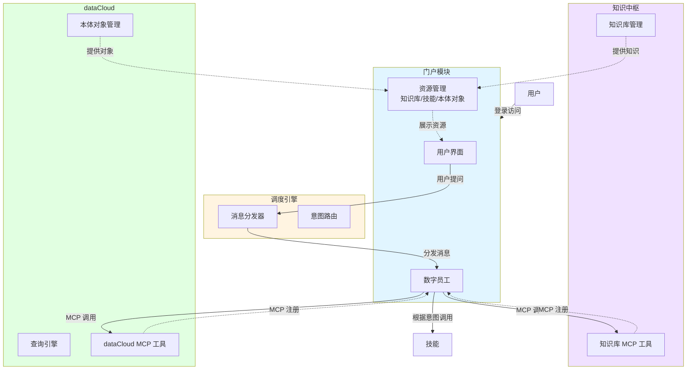
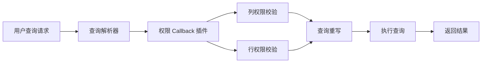

# 本体对象重构-20260407

## 1.需求背景

本体的生产模型不允许直接碰数据库，应该是提供很多原子方法，通过技能进行组织。


## 2.概要设计

### 2.1 总体架构

系统由门户、调度引擎、知识中枢、dataCloud 四个核心模块组成，通过 MCP 协议实现模块间的通信与协作。



**架构说明：**

1. **门户模块**：用户入口，提供统一的用户界面，展示知识库、技能、本体对象等资源，支持用户指定资源进行问答
2. **调度引擎**：消息中枢，接收用户提问并进行意图识别，将请求分发给数字员工处理
3. **知识中枢**：通过 MCP 协议注册到数字员工，提供知识库相关的工具能力
4. **dataCloud**：通过 MCP 协议注册到数字员工，提供本体对象查询和数据分析能力


### 2.2 数据流程（王威）


## 3.模块设计

### 3.1 门户模块


### 3.2 dataCloud

#### 3.2.1 对象属性规则

对象属性分为维度和度量两大类，不同类型的属性在分组、条件过滤、统计计算上有不同的规则约束。

##### 3.2.1.1 维度规则

维度属性用于数据的分组和过滤，不参与聚合计算。

| 属性类型 | 属性子类 | 分组规则 | 条件规则 | 使用示例 |
| -------- | -------- | -------- | -------- | -------- |
| 维度 | ID | 仅支持按自身分组 | 1. 适用场景：WHERE 条件、CASE WHEN 条件<br />2. 支持函数：IN | GROUP BY 企业ID<br />WHERE 企业ID IN ('001', '002') |
| 维度 | 名称 | 仅支持按自身分组 | 1. 适用场景：WHERE 条件、CASE WHEN 条件<br />2. 支持函数：IN、LIKE | GROUP BY 企业名称<br />WHERE 企业名称 LIKE '%科技%' |
| 维度 | 时间 | 支持时间粒度函数：<br />DATE()、MONTH()、YEAR()、QUARTER() | 1. 适用场景：WHERE 条件、CASE WHEN 条件<br />2. 支持函数：IN、=、<=、>=、<、>、BETWEEN | GROUP BY MONTH(创建时间)<br />WHERE 创建时间 >= '2026-01-01' |
| 维度 | 账期 | 支持时间粒度函数：<br />DATE()、MONTH()、YEAR()、QUARTER()<br />**强制约束**：WHERE 条件必须包含账期字段 | 1. 适用场景：WHERE 条件、CASE WHEN 条件<br />2. 支持函数：IN、=、<=、>=、<、>、BETWEEN | GROUP BY MONTH(账期)<br />WHERE 账期 = '2026-03' |
| 维度 | 数值 | **不支持分组** | 1. 适用场景：WHERE 条件、CASE WHEN 条件<br />2. 支持函数：IN、=、<=、>=、<、> | 仅用于过滤条件<br />WHERE 年龄 > 30 |

**规则说明：**
- **ID/名称类**：只能按原值分组，不支持范围分组
- **时间/账期类**：支持时间粒度转换函数（日/月/季/年）
- **账期类特殊约束**：查询时必须指定账期范围，防止全表扫描
- **数值类**：仅用于条件过滤，不参与分组统计

##### 3.2.1.2 度量规则

度量属性用于聚合计算，可以参与分组和统计。

| 属性类型 | 属性子类 | 分组规则 | 条件规则 | 统计函数规则 | 使用示例 |
| -------- | -------- | -------- | -------- | ------------ | -------- |
| 度量 | ID | 支持按自身分组：<br />SELF(字段名) | 1. 适用场景：WHERE 条件、CASE WHEN 条件<br />2. 支持函数：=、IN | COUNT()、COUNT(DISTINCT) | COUNT(企业ID)<br />COUNT(DISTINCT 企业ID) |
| 度量 | 普通数值 | 支持范围分组：<br />RANGE(开始值, 结束值, '标签')<br />示例：RANGE(0, 6, '婴儿') | 1. 适用场景：WHERE 条件、CASE WHEN 条件<br />2. 支持函数：IN、=、<=、>=、<、> | SUM()、AVG()、MAX()、MIN() | GROUP BY RANGE(年龄, 0, 18, '未成年')<br />SUM(收入) |
| 度量 | 指标数值 | 支持范围分组：<br />RANGE(开始值, 结束值, '标签')<br />示例：RANGE(0, 1000000, '小微企业') | 1. 适用场景：WHERE 条件、CASE WHEN 条件<br />2. 支持函数：IN、=、<=、>=、<、> | SUM()、COUNT()、COUNT(DISTINCT)、AVG()、MAX()、MIN()、TOPN()、MEDIAN() | GROUP BY RANGE(收入, 0, 1000000, '小微')<br />AVG(税收) |

**规则说明：**
- **ID 类度量**：主要用于计数统计，支持去重计数
- **普通数值**：支持基础聚合函数，可按范围分组
- **指标数值**：支持完整的统计分析函数，包括排名、中位数等高级函数
- **RANGE 分组**：将连续数值按区间分组，便于分段统计分析

**分组函数语法规范：**

```sql
-- 维度时间分组函数
DATE(时间字段)       -- 按日分组
MONTH(时间字段)      -- 按月分组
YEAR(时间字段)       -- 按年分组
QUARTER(时间字段)    -- 按季度分组

-- 度量范围分组函数
RANGE(字段名, 开始值, 结束值, '分组标签')

-- 示例：按年龄段分组
RANGE(年龄, 0, 18, '未成年')
RANGE(年龄, 18, 60, '成年')
RANGE(年龄, 60, 150, '老年')

-- 示例：按收入区间分组
RANGE(收入, 0, 1000000, '小微企业')
RANGE(收入, 1000000, 10000000, '中型企业')
RANGE(收入, 10000000, 999999999, '大型企业')
```


#### 3.2.2 对象管理示例

##### 3.2.2.1 员工对象

| 管理属性 | 员工ID | 员工名称（重复不让统） | 年龄 | 性别 | 身高 | 组织（不允许count） | 出生城市（不允许count） |
| -------- | ------ | ---------------------- | ---- | ---- | ---- | ------------------- | ----------------------- |
| 维度大类 | 维度   | 维度                   | 维度 | 维度 | -    | 维度                | 维度                    |
| 维度小类 | ID     | 名称                   | 数值 | 名称 | -    | 名称                | 名称                    |
| 度量大类 | 度量   | -                      | 度量 | -    | 度量 | -                   | -                       |
| 度量小类 | ID     | -                      | 普通数值 | -    | 普通数值 | -                   | -                       |

##### 3.2.2.2 组织对象

| 管理属性 | 组织ID | 组织名称 | 组织收入总利润总数 |
| -------- | ------ | -------- | ------------------ |
| 维度大类 | 维度   | 维度     | -                  |
| 维度小类 | ID     | 名称     | -                  |
| 度量大类 | 度量   | -        | 度量               |
| 度量小类 | ID     | -        | 指标数值           |

##### 3.2.2.3 城市对象

| 管理属性 | 城市id | 城市名称 | 城市总人口 | 城市男性总身高 | 城市女性平均身高 |
| -------- | ------ | -------- | ---------- | -------------- | ---------------- |
| 维度大类 | 维度   | 维度     | -          | -              | -                |
| 维度小类 | ID     | 名称     | -          | -              | -                |
| 度量大类 | 度量   | -        | 度量       | 度量           | 度量             |
| 度量小类 | ID     | -        | 指标数值   | 指标数值       | 指标数值         |


##### 3.2.2.4 员工统计视图

员工统计视图是员工对象、组织对象、城市对象 UNION ALL 后的综合视图，包含所有对象的属性字段。

| 字段 | 维度大类 | 维度小类 | 度量大类 | 度量小类 | 来源对象 |
| ---- | -------- | -------- | -------- | -------- | -------- |
| 员工ID | 维度 | ID | 度量 | ID | 员工对象 |
| 员工名称 | 维度 | 名称 | - | - | 员工对象 |
| 年龄 | 维度 | 数值 | 度量 | 普通数值 | 员工对象 |
| 性别 | 维度 | 名称 | - | - | 员工对象 |
| 身高 | - | - | 度量 | 普通数值 | 员工对象 |
| 组织 | 维度 | 名称 | - | - | 员工对象 |
| 出生城市 | 维度 | 名称 | - | - | 员工对象 |
| 组织ID | 维度 | ID | 度量 | ID | 组织对象 |
| 组织名称 | 维度 | 名称 | - | - | 组织对象 |
| 组织收入总利润总数 | - | - | 度量 | 指标数值 | 组织对象 |
| 城市ID | 维度 | ID | 度量 | ID | 城市对象 |
| 城市名称 | 维度 | 名称 | - | - | 城市对象 |
| 城市总人口 | - | - | 度量 | 指标数值 | 城市对象 |
| 城市男性总身高 | - | - | 度量 | 指标数值 | 城市对象 |
| 城市女性平均身高 | - | - | 度量 | 指标数值 | 城市对象 |

**视图说明：**
- 该视图整合了员工、组织、城市三个对象的所有属性
- 通过外键关联：员工.组织 → 组织.组织名称，员工.出生城市 → 城市.城市名称
- 支持跨对象的联合查询和统计分析
- 字段分类遵循统一的维度/度量规则
- 对象到对象有一个别名！


##### 3.2.2.5 术语校验

当等于 或in 要翻译标准属于。 like 不用。


#### 3.2.3 数据权限管理

通过 Callback 外挂插件机制实现列级和行级数据权限控制。

##### 3.2.3.1 权限控制机制



##### 3.2.3.2 列权限控制（SELECT 字段校验）

**校验规则：**
- 校验用户对 SELECT 字段列表中每个字段的访问权限
- 无权限字段自动从查询中移除或返回权限错误

**实现方式：**
```python
def check_field_permission(user_id, select_fields):
    """
    列权限校验回调函数
    
    Args:
        user_id: 用户ID
        select_fields: 查询字段列表 ['员工ID', '员工名称', '身高']
    
    Returns:
        allowed_fields: 有权限的字段列表
        denied_fields: 无权限的字段列表
    """
    allowed_fields = []
    denied_fields = []
    
    for field in select_fields:
        if has_field_permission(user_id, field):
            allowed_fields.append(field)
        else:
            denied_fields.append(field)
    
    return allowed_fields, denied_fields
```

**示例：**
```sql
-- 原始查询
SELECT 员工ID, 员工名称, 身高, 组织收入总利润总数
FROM 员工统计视图
WHERE 组织 = '研发部'

-- 用户仅有员工ID、员工名称权限，校验后重写为：
SELECT 员工ID, 员工名称
FROM 员工统计视图
WHERE 组织 = '研发部'
```

##### 3.2.3.3 行权限控制（WHERE 条件注入）

**校验规则：**
- 根据用户权限自动在 WHERE 条件中注入行级过滤条件
- 采用 AND 逻辑追加权限条件，确保用户只能访问授权范围内的数据

**实现方式：**
```python
def inject_row_permission(user_id, original_where):
    """
    行权限注入回调函数
    
    Args:
        user_id: 用户ID
        original_where: 原始 WHERE 条件
    
    Returns:
        rewritten_where: 注入权限后的 WHERE 条件
    """
    # 获取用户的数据权限范围
    permission_conditions = get_user_data_permission(user_id)
    
    # 注入权限条件
    if original_where:
        rewritten_where = f"({original_where}) AND {permission_conditions}"
    else:
        rewritten_where = permission_conditions
    
    return rewritten_where
```

**示例：**
```sql
-- 原始查询
SELECT 员工ID, 员工名称, 年龄
FROM 员工统计视图
WHERE 年龄 > 30

-- 用户仅有组织ID='ORG001'的数据权限，注入后重写为：
SELECT 员工ID, 员工名称, 年龄
FROM 员工统计视图
WHERE (年龄 > 30) AND 组织ID = 'ORG001'
```

##### 3.2.3.4 权限配置示例

**用户权限配置表：**

| 用户ID | 可访问字段 | 行权限条件 |
| ------ | ---------- | ---------- |
| USER001 | 员工ID, 员工名称, 年龄, 性别 | 组织ID = 'ORG001' |
| USER002 | 员工ID, 员工名称, 身高, 组织 | 组织ID IN ('ORG001', 'ORG002') |
| USER003 | 全部字段 | 城市ID = 'CITY001' |
| ADMIN | 全部字段 | 无限制 |

**Callback 插件注册：**
```python
# 注册权限校验插件
register_callback('before_query', check_field_permission)
register_callback('before_query', inject_row_permission)

# 查询执行流程
def execute_query(user_id, sql):
    # 1. 解析 SQL
    parsed_sql = parse_sql(sql)
    
    # 2. 列权限校验
    allowed_fields, denied_fields = check_field_permission(
        user_id, 
        parsed_sql.select_fields
    )
    
    if denied_fields:
        raise PermissionError(f"无权限访问字段: {denied_fields}")
    
    # 3. 行权限注入
    rewritten_where = inject_row_permission(
        user_id, 
        parsed_sql.where_clause
    )
    
    # 4. 重写并执行查询
    final_sql = rewrite_sql(parsed_sql, allowed_fields, rewritten_where)
    return execute(final_sql)
```

**权限控制特点：**
- **透明性**：权限控制对业务逻辑透明，通过插件自动处理
- **灵活性**：支持字段级和行级的细粒度权限控制
- **安全性**：强制执行权限校验，防止越权访问
- **可扩展性**：通过 Callback 机制支持自定义权限策略


#### 3.2.4 原子方法

##### 3.2.4.1 query-原子方法

```python
{view_name}_query(array selectFiled[str], array whereFiled[str], whereType str)

1) selectFiled[str]： 查询字段
2) whereFiled[str]：过滤条件
3) whereType ： And / Or
```


##### 3.2.4.2 compute-原子方法

```python
{view_name}_compute(array selectIndex[ array indexDict], array groupByFiled[str], array whereFiled[str], whereType str)

indexDict: {

"": "high", //统计字段，只能一个

"": "count" //统计方法 sum/count/dinctinct count()/aig/topN 等

"": List< 'high >1.6', 'sex=1'> //限定条件， 同 whereType  都是And， case XX=1 and XX=5 then 1

}

groupByFiled: 除了指标外，可以group by 
```


### 3.3 知识中枢


# 其它


1. 提示词，查询目标，没有把各个指标独立、完整的分解出来
2. 统计函数需要跟着指标走（指标公式算）
3. wherekey 可能是字段、度量+统计函数+列表/字典（公式/虚拟字典）取值的组合
4. wherevalue要去判断一下，如果是数值类、时间类不需要匹配，需要匹配--列表/字典

帮我查一下亦庄区域高风险企业总数和大规模企业的企业税收、收入均值。


指标和过滤条件要一一对应

指标要多个字段取值拼起来

帮我查一下亦庄区域高风险企业（xXX表）总数和大规模企业的企业税收（XX属性）、收入均值（XX属性）。


select: 高风险企业总数, 大规模企业税收均值，大规模企业收入均值
groupby: 企业
where: 区域=亦庄

企业等级=高风险

高风险企业总数=sum(case when 企业等级=高风险 then 1 else 0 )
大规模企业税收均值 = sum(case when 企业规模=大规模 then 企业收入 else 0 )

企业ID上定的公式：高价值企业=case when 企业收入> 20000000 and 企业税收 > 10000000

帮我找一下高价值企业税收均值= avg(case when 企业收入> 20000000 and 企业税收 > 10000000 then 收入 else 0)

帮我查一下亦庄区域高风险企业总数，中等规模、高风险、高价值企业的税收总额、收入均值
黄升版本1：
select: 高风险企业总数，中等规模、高风险、高价值企业的税收总额， 中等规模、高风险、高价值企业的收入均值
groupby: 企业
where: 区域=亦庄

黄升版本2：
select: 高风险企业总数，中等规模企业税收总额， 中等规模企业收入均值， 高风险企业税收总额，高风险企业收入均值，高价值企业的收入均值，高价值企业的税收总额
groupby: 企业
where: 区域=亦庄

黄升版本3：
select: 高风险企业总数，中等规模企业税收总额， 中等规模企业收入均值， 高风险企业税收总额，高风险企业收入均值，高价值企业的收入均值，高价值企业的税收总额
groupby: 区域
where: 区域=亦庄

黄升版本4：
select: 高风险企业总数，中等规模 & 高风险 & 高价值企业的税收总额， 中等规模&高风险&高价值企业的收入均值
groupby: 区域
where: 区域=亦庄

对象情况：
区域对象（区域名称， 高风险企业总数， 中等规模&高风险&高价值企业的税收总额/中等规模双高企业税收总额）
企业对象 （企业名称， 归属区域（等于区域表区域名称，外键）， 企业规模， 企业风险等级， 企业价值等级， 企业税收， 企业收入）

1. 完整的指标标签梳理出来
2, 用户确认
3. 看表
4，。给表和完整的指标标签给大模型看能不能拼出来

ddl语言告诉关系
用大模型训练过的数据形式展示给大模型

怎么给对text2sql最有效

多跳 (中间表1、中间表2、...)
问题：请帮我找亦庄区域、中等规模双高企业、收入超过均值的、去年的、税收的top3、企业的价值等级

标签：中等规模双高企业收入超均值

请帮我找（（（（亦庄区域的且中等规模的且是双高企业的企业）的收入 超过 亦庄区域的企业收入均值）的企业）去年的税收 排名为top3的企业）的价值等级


帮我找一下亦庄区域每月企业收入总额，网格税收均值

jieba: 每月企业收入总额  网格税收均值
大模型：每月企业收入总额 每月网格税收均值

表：企业收入总额（月），网格税收均值（日）

月帐-企业收入总额
网格税收均值的月帐需要统计

维度给名称
指标给出属性度量

table ua
