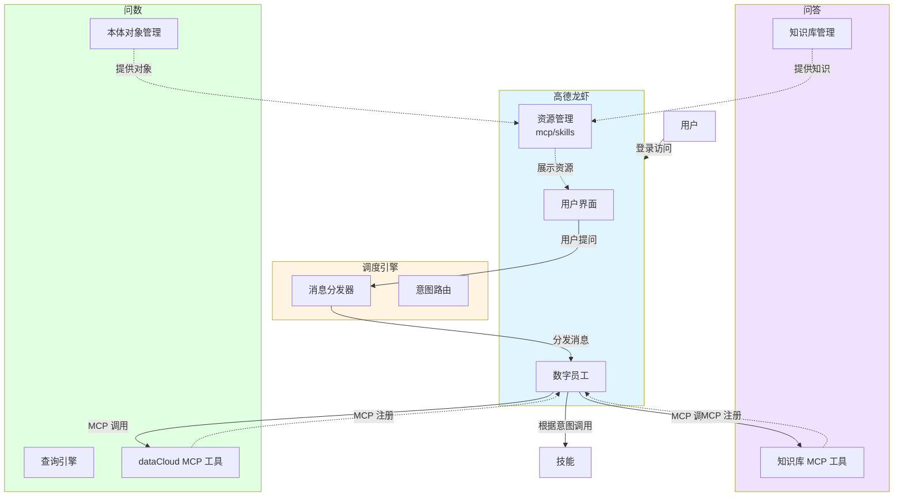
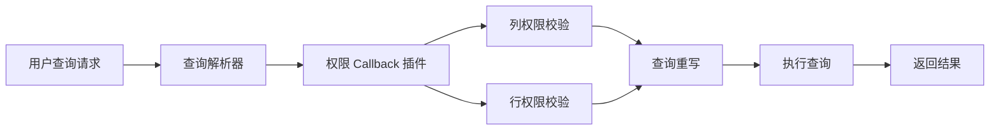
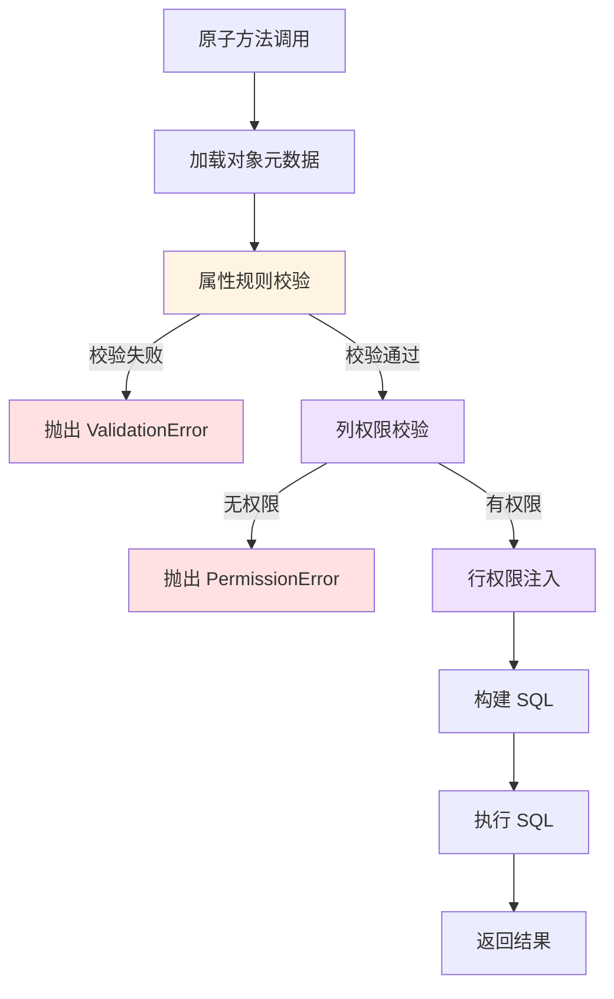

# 本体对象重构-20260407

## 1.需求背景

本体的生产模型不允许直接碰数据库，应该是提供很多原子方法，通过技能进行组织。


## 2.概要设计

### 2.1 总体架构

系统由门户、调度引擎、知识中枢、dataCloud 四个核心模块组成，通过 MCP 协议实现模块间的通信与协作。



**架构说明：**

1. **门户模块**：用户入口，提供统一的用户界面，展示知识库、技能、本体对象等资源，支持用户指定资源进行问答
2. **调度引擎**：消息中枢，接收用户提问并进行意图识别，将请求分发给数字员工处理
3. **知识中枢**：通过 MCP 协议注册到数字员工，提供知识库相关的工具能力
4. **dataCloud**：通过 MCP 协议注册到数字员工，提供本体对象查询和数据分析能力


### 2.2 数据流程（王威）


## 3.模块设计

### 3.1 门户模块


### 3.2 dataCloud

#### 3.2.1 对象属性规则

对象属性分为维度和度量两大类，不同类型的属性在分组、条件过滤、统计计算上有不同的规则约束。

##### 3.2.1.1 维度规则

维度属性用于数据的分组和过滤，不参与聚合计算。

| 属性类型 | 属性子类 | 分组规则 | 条件规则 | 使用示例 |
| -------- | -------- | -------- | -------- | -------- |
| 维度 | ID | 仅支持按自身分组 | 1. 适用场景：WHERE 条件、CASE WHEN 条件<br />2. 支持函数：IN | GROUP BY 企业ID<br />WHERE 企业ID IN ('001', '002') |
| 维度 | 名称 | 仅支持按自身分组 | 1. 适用场景：WHERE 条件、CASE WHEN 条件<br />2. 支持函数：IN、LIKE | GROUP BY 企业名称<br />WHERE 企业名称 LIKE '%科技%' |
| 维度 | 时间 | 支持时间粒度函数：<br />DATE()、MONTH()、YEAR()、QUARTER() | 1. 适用场景：WHERE 条件、CASE WHEN 条件<br />2. 支持函数：IN、=、<=、>=、<、>、BETWEEN | GROUP BY MONTH(创建时间)<br />WHERE 创建时间 >= '2026-01-01' |
| 维度 | 账期 | 支持时间粒度函数：<br />DATE()、MONTH()、YEAR()、QUARTER()<br />**强制约束**：WHERE 条件必须包含账期字段 | 1. 适用场景：WHERE 条件、CASE WHEN 条件<br />2. 支持函数：IN、=、<=、>=、<、>、BETWEEN | GROUP BY MONTH(账期)<br />WHERE 账期 = '2026-03' |
| 维度 | 数值 | **不支持分组** | 1. 适用场景：WHERE 条件、CASE WHEN 条件<br />2. 支持函数：IN、=、<=、>=、<、> | 仅用于过滤条件<br />WHERE 年龄 > 30 |

**规则说明：**
- **ID/名称类**：只能按原值分组，不支持范围分组
- **时间/账期类**：支持时间粒度转换函数（日/月/季/年）
- **账期类特殊约束**：查询时必须指定账期范围，防止全表扫描
- **数值类**：仅用于条件过滤，不参与分组统计

##### 3.2.1.2 度量规则

度量属性用于聚合计算，可以参与分组和统计。

| 属性类型 | 属性子类 | 分组规则 | 条件规则 | 统计函数规则 | 使用示例 |
| -------- | -------- | -------- | -------- | ------------ | -------- |
| 度量 | ID | 支持按自身分组：<br />SELF(字段名) | 1. 适用场景：WHERE 条件、CASE WHEN 条件<br />2. 支持函数：=、IN | COUNT()、COUNT(DISTINCT) | COUNT(企业ID)<br />COUNT(DISTINCT 企业ID) |
| 度量 | 普通数值 | 支持范围分组：<br />RANGE(开始值, 结束值, '标签')<br />示例：RANGE(0, 6, '婴儿') | 1. 适用场景：WHERE 条件、CASE WHEN 条件<br />2. 支持函数：IN、=、<=、>=、<、> | SUM()、AVG()、MAX()、MIN() | GROUP BY RANGE(年龄, 0, 18, '未成年')<br />SUM(收入) |
| 度量 | 指标数值 | 支持范围分组：<br />RANGE(开始值, 结束值, '标签')<br />示例：RANGE(0, 1000000, '小微企业') | 1. 适用场景：WHERE 条件、CASE WHEN 条件<br />2. 支持函数：IN、=、<=、>=、<、> | SUM()、COUNT()、COUNT(DISTINCT)、AVG()、MAX()、MIN()、TOPN()、MEDIAN() | GROUP BY RANGE(收入, 0, 1000000, '小微')<br />AVG(税收) |

**规则说明：**
- **ID 类度量**：主要用于计数统计，支持去重计数
- **普通数值**：支持基础聚合函数，可按范围分组
- **指标数值**：支持完整的统计分析函数，包括排名、中位数等高级函数
- **RANGE 分组**：将连续数值按区间分组，便于分段统计分析

**分组函数语法规范：**

```sql
-- 维度时间分组函数
DATE(时间字段)       -- 按日分组
MONTH(时间字段)      -- 按月分组
YEAR(时间字段)       -- 按年分组
QUARTER(时间字段)    -- 按季度分组

-- 度量范围分组函数
RANGE(字段名, 开始值, 结束值, '分组标签')

-- 示例：按年龄段分组
RANGE(年龄, 0, 18, '未成年')
RANGE(年龄, 18, 60, '成年')
RANGE(年龄, 60, 150, '老年')

-- 示例：按收入区间分组
RANGE(收入, 0, 1000000, '小微企业')
RANGE(收入, 1000000, 10000000, '中型企业')
RANGE(收入, 10000000, 999999999, '大型企业')
```


#### 3.2.2 对象管理示例

##### 3.2.2.1 员工对象

| 管理属性 | 员工ID | 员工名称（重复不让统） | 年龄 | 性别 | 身高 | 组织（不允许count） | 出生城市（不允许count） |
| -------- | ------ | ---------------------- | ---- | ---- | ---- | ------------------- | ----------------------- |
| 维度大类 | 维度   | 维度                   | 维度 | 维度 | -    | 维度                | 维度                    |
| 维度小类 | ID     | 名称                   | 数值 | 名称 | -    | 名称                | 名称                    |
| 度量大类 | 度量   | -                      | 度量 | -    | 度量 | -                   | -                       |
| 度量小类 | ID     | -                      | 普通数值 | -    | 普通数值 | -                   | -                       |

##### 3.2.2.2 组织对象

| 管理属性 | 组织ID | 组织名称 | 组织收入总利润总数 |
| -------- | ------ | -------- | ------------------ |
| 维度大类 | 维度   | 维度     | -                  |
| 维度小类 | ID     | 名称     | -                  |
| 度量大类 | 度量   | -        | 度量               |
| 度量小类 | ID     | -        | 指标数值           |

##### 3.2.2.3 城市对象

| 管理属性 | 城市id | 城市名称 | 城市总人口 | 城市男性总身高 | 城市女性平均身高 |
| -------- | ------ | -------- | ---------- | -------------- | ---------------- |
| 维度大类 | 维度   | 维度     | -          | -              | -                |
| 维度小类 | ID     | 名称     | -          | -              | -                |
| 度量大类 | 度量   | -        | 度量       | 度量           | 度量             |
| 度量小类 | ID     | -        | 指标数值   | 指标数值       | 指标数值         |


##### 3.2.2.4 员工统计视图

员工统计视图是员工对象、组织对象、城市对象 UNION ALL 后的综合视图，包含所有对象的属性字段。

| 字段 | 维度大类 | 维度小类 | 度量大类 | 度量小类 | 来源对象 |
| ---- | -------- | -------- | -------- | -------- | -------- |
| 员工ID | 维度 | ID | 度量 | ID | 员工对象 |
| 员工名称 | 维度 | 名称 | - | - | 员工对象 |
| 年龄 | 维度 | 数值 | 度量 | 普通数值 | 员工对象 |
| 性别 | 维度 | 名称 | - | - | 员工对象 |
| 身高 | - | - | 度量 | 普通数值 | 员工对象 |
| 组织 | 维度 | 名称 | - | - | 员工对象 |
| 出生城市 | 维度 | 名称 | - | - | 员工对象 |
| 组织ID | 维度 | ID | 度量 | ID | 组织对象 |
| 组织名称 | 维度 | 名称 | - | - | 组织对象 |
| 组织收入总利润总数 | - | - | 度量 | 指标数值 | 组织对象 |
| 城市ID | 维度 | ID | 度量 | ID | 城市对象 |
| 城市名称 | 维度 | 名称 | - | - | 城市对象 |
| 城市总人口 | - | - | 度量 | 指标数值 | 城市对象 |
| 城市男性总身高 | - | - | 度量 | 指标数值 | 城市对象 |
| 城市女性平均身高 | - | - | 度量 | 指标数值 | 城市对象 |

**视图说明：**
- 该视图整合了员工、组织、城市三个对象的所有属性
- 通过外键关联：员工.组织 → 组织.组织名称，员工.出生城市 → 城市.城市名称
- 支持跨对象的联合查询和统计分析
- 字段分类遵循统一的维度/度量规则
- 对象到对象有一个别名！


##### 3.2.2.5 术语校验

当等于 或in 要翻译标准属于。 like 不用。


#### 3.2.3 数据权限管理

通过 Callback 外挂插件机制实现列级和行级数据权限控制。

##### 3.2.3.1 权限控制机制



##### 3.2.3.2 列权限控制（SELECT 字段校验）

**校验规则：**
- 校验用户对 SELECT 字段列表中每个字段的访问权限
- 无权限字段自动从查询中移除或返回权限错误

**实现方式：**
```python
def check_field_permission(user_id, select_fields):
    """
    列权限校验回调函数
    
    Args:
        user_id: 用户ID
        select_fields: 查询字段列表 ['员工ID', '员工名称', '身高']
    
    Returns:
        allowed_fields: 有权限的字段列表
        denied_fields: 无权限的字段列表
    """
    allowed_fields = []
    denied_fields = []
    
    for field in select_fields:
        if has_field_permission(user_id, field):
            allowed_fields.append(field)
        else:
            denied_fields.append(field)
    
    return allowed_fields, denied_fields
```

**示例：**
```sql
-- 原始查询
SELECT 员工ID, 员工名称, 身高, 组织收入总利润总数
FROM 员工统计视图
WHERE 组织 = '研发部'

-- 用户仅有员工ID、员工名称权限，校验后重写为：
SELECT 员工ID, 员工名称
FROM 员工统计视图
WHERE 组织 = '研发部'
```

##### 3.2.3.3 行权限控制（WHERE 条件注入）

**校验规则：**
- 根据用户权限自动在 WHERE 条件中注入行级过滤条件
- 采用 AND 逻辑追加权限条件，确保用户只能访问授权范围内的数据

**实现方式：**
```python
def inject_row_permission(user_id, original_where):
    """
    行权限注入回调函数
    
    Args:
        user_id: 用户ID
        original_where: 原始 WHERE 条件
    
    Returns:
        rewritten_where: 注入权限后的 WHERE 条件
    """
    # 获取用户的数据权限范围
    permission_conditions = get_user_data_permission(user_id)
    
    # 注入权限条件
    if original_where:
        rewritten_where = f"({original_where}) AND {permission_conditions}"
    else:
        rewritten_where = permission_conditions
    
    return rewritten_where
```

**示例：**
```sql
-- 原始查询
SELECT 员工ID, 员工名称, 年龄
FROM 员工统计视图
WHERE 年龄 > 30

-- 用户仅有组织ID='ORG001'的数据权限，注入后重写为：
SELECT 员工ID, 员工名称, 年龄
FROM 员工统计视图
WHERE (年龄 > 30) AND 组织ID = 'ORG001'
```

##### 3.2.3.4 权限配置示例

**用户权限配置表：**

| 用户ID | 可访问字段 | 行权限条件 |
| ------ | ---------- | ---------- |
| USER001 | 员工ID, 员工名称, 年龄, 性别 | 组织ID = 'ORG001' |
| USER002 | 员工ID, 员工名称, 身高, 组织 | 组织ID IN ('ORG001', 'ORG002') |
| USER003 | 全部字段 | 城市ID = 'CITY001' |
| ADMIN | 全部字段 | 无限制 |

**Callback 插件注册：**
```python
# 注册权限校验插件
register_callback('before_query', check_field_permission)
register_callback('before_query', inject_row_permission)

# 查询执行流程
def execute_query(user_id, sql):
    # 1. 解析 SQL
    parsed_sql = parse_sql(sql)
    
    # 2. 列权限校验
    allowed_fields, denied_fields = check_field_permission(
        user_id, 
        parsed_sql.select_fields
    )
    
    if denied_fields:
        raise PermissionError(f"无权限访问字段: {denied_fields}")
    
    # 3. 行权限注入
    rewritten_where = inject_row_permission(
        user_id, 
        parsed_sql.where_clause
    )
    
    # 4. 重写并执行查询
    final_sql = rewrite_sql(parsed_sql, allowed_fields, rewritten_where)
    return execute(final_sql)
```

**权限控制特点：**
- **透明性**：权限控制对业务逻辑透明，通过插件自动处理
- **灵活性**：支持字段级和行级的细粒度权限控制
- **安全性**：强制执行权限校验，防止越权访问
- **可扩展性**：通过 Callback 机制支持自定义权限策略


#### 3.2.4 原子方法

为每个视图或对象提供标准化的原子方法，支持查询和统计计算两大类操作。所有原子方法自动集成权限校验机制。

##### 3.2.4.1 query 原子方法（明细查询）

用于查询对象的明细数据，不进行聚合计算。

**方法签名：**
```python
{object_name}_query(
    user_id: str,
    select_fields: List[str],
    where_fields: List[str],
    where_type: str = "AND"
) -> List[Dict]
```

**参数说明：**
- `user_id`：用户ID，用于权限校验（必填）
- `select_fields`：查询字段列表，指定返回哪些字段
- `where_fields`：过滤条件列表，每个条件格式为 "字段名 操作符 值"
- `where_type`：条件连接方式，支持 "AND" 或 "OR"

**返回值：**
- 返回符合条件的记录列表，每条记录为字典格式

**权限校验流程：**
1. 调用 `check_field_permission(user_id, select_fields)` 校验列权限
2. 调用 `inject_row_permission(user_id, where_fields)` 注入行权限
3. 无权限字段自动过滤或抛出异常

**使用示例：**
```python
# 示例1：查询员工明细
员工统计视图_query(
    user_id='USER001',
    select_fields=['员工ID', '员工名称', '年龄', '性别'],
    where_fields=['年龄 > 30', '性别 = 男'],
    where_type='AND'
)

# 权限校验流程：
# 1. 检查 USER001 对 ['员工ID', '员工名称', '年龄', '性别'] 的访问权限
# 2. 注入 USER001 的行权限条件：组织ID = 'ORG001'
# 
# 生成SQL：
# SELECT 员工ID, 员工名称, 年龄, 性别
# FROM 员工统计视图
# WHERE (年龄 > 30 AND 性别 = '男') AND 组织ID = 'ORG001'

# 示例2：查询组织明细
组织对象_query(
    user_id='USER002',
    select_fields=['组织ID', '组织名称', '组织收入总利润总数'],
    where_fields=['组织名称 LIKE %科技%', '组织收入总利润总数 > 1000000'],
    where_type='AND'
)

# 示例3：无条件查询
城市对象_query(
    user_id='ADMIN',
    select_fields=['城市ID', '城市名称', '城市总人口'],
    where_fields=[],
    where_type='AND'
)
```

##### 3.2.4.2 compute 原子方法（聚合统计）

用于对象的聚合统计计算，支持分组和指标计算。

**方法签名：**
```python
{object_name}_compute(
    user_id: str,
    select_indexes: List[IndexDict],
    group_by_fields: List[str],
    where_fields: List[str],
    where_type: str = "AND"
) -> List[Dict]
```

**参数说明：**
- `user_id`：用户ID，用于权限校验（必填）
- `select_indexes`：指标列表，每个指标为 IndexDict 结构
- `group_by_fields`：分组字段列表
- `where_fields`：过滤条件列表
- `where_type`：条件连接方式，支持 "AND" 或 "OR"

**IndexDict 结构：**
```python
IndexDict = {
    "field": str,              # 统计字段名称（必填）
    "agg_func": str,           # 统计函数（见下方函数列表）
    "conditions": List[str],   # 限定条件列表（可选），用于 CASE WHEN
    "alias": str               # 指标别名（可选）
}
```

**支持的聚合函数（agg_func）：**

| 函数类型 | 函数名 | 说明 | SQL 标准 |
| -------- | ------ | ---- | -------- |
| 基础聚合 | COUNT | 计数 | 标准 |
| 基础聚合 | COUNT_DISTINCT | 去重计数 | 标准（COUNT(DISTINCT)） |
| 基础聚合 | SUM | 求和 | 标准 |
| 基础聚合 | AVG | 平均值 | 标准 |
| 基础聚合 | MAX | 最大值 | 标准 |
| 基础聚合 | MIN | 最小值 | 标准 |
| 统计分析 | STDDEV | 标准差（样本） | 标准（STDDEV_SAMP） |
| 统计分析 | STDDEV_POP | 标准差（总体） | 标准 |
| 统计分析 | VARIANCE | 方差（样本） | 标准（VAR_SAMP） |
| 统计分析 | VAR_POP | 方差（总体） | 标准 |
| 排序分析 | TOP_N | 前N名（需配合参数 n） | 扩展（ROW_NUMBER + LIMIT） |
| 排序分析 | BOTTOM_N | 后N名（需配合参数 n） | 扩展（ROW_NUMBER + LIMIT） |
| 百分位 | MEDIAN | 中位数（50%分位数） | 扩展（PERCENTILE_CONT(0.5)） |
| 百分位 | PERCENTILE | 百分位数（需配合参数 p） | 标准（PERCENTILE_CONT） |
| 其他 | MODE | 众数（出现最多的值） | 扩展 |

**权限校验流程：**
1. 提取所有涉及的字段：`select_indexes` 中的 `field` + `group_by_fields`
2. 调用 `check_field_permission(user_id, all_fields)` 校验列权限
3. 调用 `inject_row_permission(user_id, where_fields)` 注入行权限
4. 无权限字段自动过滤或抛出异常

**返回值：**
- 返回聚合统计结果列表，每条记录包含分组字段和指标值

**使用示例：**

```python
# 示例1：按组织统计员工数量和平均年龄
员工统计视图_compute(
    user_id='USER001',
    select_indexes=[
        {
            "field": "员工ID",
            "agg_func": "COUNT",
            "alias": "员工总数"
        },
        {
            "field": "年龄",
            "agg_func": "AVG",
            "alias": "平均年龄"
        }
    ],
    group_by_fields=['组织'],
    where_fields=['年龄 > 18'],
    where_type='AND'
)

# 权限校验流程：
# 1. 提取字段：['员工ID', '年龄', '组织']
# 2. 检查 USER001 对这些字段的访问权限
# 3. 注入行权限：组织ID = 'ORG001'
#
# 生成SQL：
# SELECT 
#     组织,
#     COUNT(员工ID) AS 员工总数,
#     AVG(年龄) AS 平均年龄
# FROM 员工统计视图
# WHERE (年龄 > 18) AND 组织ID = 'ORG001'
# GROUP BY 组织


# 示例2：按性别统计高个男性员工数量（带条件限定）
员工统计视图_compute(
    user_id='USER002',
    select_indexes=[
        {
            "field": "员工ID",
            "agg_func": "COUNT",
            "conditions": ["身高 > 1.6", "性别 = 男"],
            "alias": "高个男性员工数"
        }
    ],
    group_by_fields=['组织'],
    where_fields=[],
    where_type='AND'
)

# 生成SQL：
# SELECT 
#     组织,
#     COUNT(CASE WHEN 身高 > 1.6 AND 性别 = '男' THEN 员工ID END) AS 高个男性员工数
# FROM 员工统计视图
# WHERE 组织ID IN ('ORG001', 'ORG002')
# GROUP BY 组织


# 示例3：按城市统计多个指标
城市对象_compute(
    user_id='USER003',
    select_indexes=[
        {
            "field": "城市总人口",
            "agg_func": "SUM",
            "alias": "总人口"
        },
        {
            "field": "城市男性总身高",
            "agg_func": "AVG",
            "alias": "男性平均身高"
        },
        {
            "field": "城市女性平均身高",
            "agg_func": "AVG",
            "alias": "女性平均身高"
        }
    ],
    group_by_fields=['城市名称'],
    where_fields=['城市总人口 > 1000000'],
    where_type='AND'
)


# 示例4：复杂统计 - 按年龄段分组统计
员工统计视图_compute(
    user_id='ADMIN',
    select_indexes=[
        {
            "field": "员工ID",
            "agg_func": "COUNT",
            "alias": "人数"
        },
        {
            "field": "身高",
            "agg_func": "AVG",
            "conditions": ["性别 = 男"],
            "alias": "男性平均身高"
        },
        {
            "field": "身高",
            "agg_func": "AVG",
            "conditions": ["性别 = 女"],
            "alias": "女性平均身高"
        },
        {
            "field": "身高",
            "agg_func": "STDDEV",
            "alias": "身高标准差"
        }
    ],
    group_by_fields=['RANGE(年龄, 0, 18, 未成年)', 'RANGE(年龄, 18, 60, 成年)', 'RANGE(年龄, 60, 150, 老年)'],
    where_fields=[],
    where_type='AND'
)

# 生成SQL：
# SELECT 
#     CASE 
#         WHEN 年龄 >= 0 AND 年龄 < 18 THEN '未成年'
#         WHEN 年龄 >= 18 AND 年龄 < 60 THEN '成年'
#         WHEN 年龄 >= 60 AND 年龄 < 150 THEN '老年'
#     END AS 年龄段,
#     COUNT(员工ID) AS 人数,
#     AVG(CASE WHEN 性别 = '男' THEN 身高 END) AS 男性平均身高,
#     AVG(CASE WHEN 性别 = '女' THEN 身高 END) AS 女性平均身高,
#     STDDEV_SAMP(身高) AS 身高标准差
# FROM 员工统计视图
# GROUP BY 年龄段


# 示例5：使用高级统计函数
员工统计视图_compute(
    user_id='ADMIN',
    select_indexes=[
        {
            "field": "身高",
            "agg_func": "MEDIAN",
            "alias": "身高中位数"
        },
        {
            "field": "身高",
            "agg_func": "PERCENTILE",
            "params": {"p": 0.95},
            "alias": "身高95分位数"
        },
        {
            "field": "身高",
            "agg_func": "TOP_N",
            "params": {"n": 10},
            "alias": "身高前10名"
        }
    ],
    group_by_fields=['组织'],
    where_fields=[],
    where_type='AND'
)
```

##### 3.2.4.3 原子方法命名规范

**命名格式：**
- 查询方法：`{对象名称}_query`
- 统计方法：`{对象名称}_compute`

**示例：**
```python
# 员工对象
员工对象_query(user_id, select_fields, where_fields, where_type)
员工对象_compute(user_id, select_indexes, group_by_fields, where_fields, where_type)

# 组织对象
组织对象_query(user_id, select_fields, where_fields, where_type)
组织对象_compute(user_id, select_indexes, group_by_fields, where_fields, where_type)

# 城市对象
城市对象_query(user_id, select_fields, where_fields, where_type)
城市对象_compute(user_id, select_indexes, group_by_fields, where_fields, where_type)

# 员工统计视图
员工统计视图_query(user_id, select_fields, where_fields, where_type)
员工统计视图_compute(user_id, select_indexes, group_by_fields, where_fields, where_type)
```

##### 3.2.4.4 原子方法特性

**统一性：**
- 所有对象/视图使用统一的方法签名和参数结构
- 便于技能编排和调用

**安全性：**
- 自动集成权限校验（列权限 + 行权限）
- 防止 SQL 注入攻击
- 参数类型校验

**灵活性：**
- 支持任意字段组合查询
- 支持复杂的条件过滤和分组统计
- 支持 CASE WHEN 条件限定
- 支持标准和扩展的统计函数

**可组合性：**
- 原子方法可被技能组合调用
- 支持多步骤数据处理流程

##### 3.2.4.5 属性规则校验

原子方法在执行前必须校验参数是否符合《3.2.1 对象属性规则》，防止生成错误的SQL。

**校验规则映射表：**

| 校验项 | 属性类型 | 属性子类 | 规则约束 | 违规示例 |
| ------ | -------- | -------- | -------- | -------- |
| 分组校验 | 维度 | ID | 仅允许 GROUP BY 自身 | ✗ RANGE(员工ID, ...) |
| 分组校验 | 维度 | 名称 | 仅允许 GROUP BY 自身 | ✗ RANGE(员工名称, ...) |
| 分组校验 | 维度 | 时间 | 仅允许时间粒度函数 | ✗ RANGE(创建时间, ...) |
| 分组校验 | 维度 | 账期 | 仅允许时间粒度函数 | ✗ RANGE(账期, ...) |
| 分组校验 | 维度 | 数值 | **不允许分组** | ✗ GROUP BY 年龄 |
| 分组校验 | 度量 | ID | 允许 SELF(字段) | ✓ SELF(员工ID) |
| 分组校验 | 度量 | 普通数值 | 允许 RANGE(字段, ...) | ✓ RANGE(年龄, 0, 18, '未成年') |
| 分组校验 | 度量 | 指标数值 | 允许 RANGE(字段, ...) | ✓ RANGE(收入, 0, 1000000, '小微') |
| 条件校验 | 维度 | ID | 仅允许 IN | ✗ 员工ID > 100 |
| 条件校验 | 维度 | 名称 | 允许 IN、LIKE | ✓ 员工名称 LIKE '%张%' |
| 条件校验 | 维度 | 时间 | 允许 IN、=、<、>、<=、>=、BETWEEN | ✓ 创建时间 >= '2026-01-01' |
| 条件校验 | 维度 | 账期 | **必须存在账期条件** | ✗ WHERE 中无账期字段 |
| 条件校验 | 维度 | 数值 | 允许 IN、=、<、>、<=、>= | ✓ 年龄 > 30 |
| 条件校验 | 度量 | ID | 允许 =、IN | ✓ 员工ID IN ('001', '002') |
| 条件校验 | 度量 | 普通数值 | 允许 IN、=、<、>、<=、>= | ✓ 身高 > 1.6 |
| 条件校验 | 度量 | 指标数值 | 允许 IN、=、<、>、<=、>= | ✓ 收入 >= 1000000 |
| 聚合校验 | 维度 | 任意 | **不允许聚合** | ✗ SUM(员工ID) |
| 聚合校验 | 度量 | ID | 仅允许 COUNT、COUNT_DISTINCT | ✗ SUM(员工ID) |
| 聚合校验 | 度量 | 普通数值 | 允许 SUM、AVG、MAX、MIN | ✓ AVG(年龄) |
| 聚合校验 | 度量 | 指标数值 | 允许全部聚合函数 | ✓ MEDIAN(收入) |

**规则校验实现：**

```python
def validate_attribute_rules(object_name, metadata, select_fields, group_by_fields, where_fields, select_indexes):
    """
    校验原子方法参数是否符合属性规则
    
    Args:
        object_name: 对象名称
        metadata: 对象元数据（包含每个字段的属性类型和子类）
        select_fields: query 方法的查询字段
        group_by_fields: compute 方法的分组字段
        where_fields: 过滤条件
        select_indexes: compute 方法的指标
    
    Returns:
        validation_result: 校验结果
    
    Raises:
        ValidationError: 规则违规时抛出异常
    """
    errors = []
    
    # 1. 校验分组字段规则
    for group_field in group_by_fields:
        # 解析分组字段（可能是 RANGE(...) 或 DATE(...) 等函数）
        field_name, func_type = parse_group_field(group_field)
        
        # 获取字段元数据
        field_meta = metadata.get_field(field_name)
        
        if not field_meta:
            errors.append(f"字段 {field_name} 不存在")
            continue
        
        # 维度规则校验
        if field_meta.type == '维度':
            if field_meta.subtype == 'ID':
                # 维度ID只能按自身分组
                if func_type and func_type != 'SELF':
                    errors.append(f"维度ID字段 {field_name} 只能按自身分组，不能使用 {func_type} 函数")
            
            elif field_meta.subtype == '名称':
                # 维度名称只能按自身分组
                if func_type and func_type != 'SELF':
                    errors.append(f"维度名称字段 {field_name} 只能按自身分组，不能使用 {func_type} 函数")
            
            elif field_meta.subtype == '时间':
                # 维度时间只能使用时间粒度函数
                if func_type and func_type not in ['DATE', 'MONTH', 'YEAR', 'QUARTER']:
                    errors.append(f"维度时间字段 {field_name} 只能使用时间粒度函数（DATE/MONTH/YEAR/QUARTER），不能使用 {func_type}")
            
            elif field_meta.subtype == '账期':
                # 维度账期只能使用时间粒度函数
                if func_type and func_type not in ['DATE', 'MONTH', 'YEAR', 'QUARTER']:
                    errors.append(f"维度账期字段 {field_name} 只能使用时间粒度函数（DATE/MONTH/YEAR/QUARTER），不能使用 {func_type}")
            
            elif field_meta.subtype == '数值':
                # 维度数值不允许分组
                errors.append(f"维度数值字段 {field_name} 不允许用于分组")
        
        # 度量规则校验
        elif field_meta.type == '度量':
            if field_meta.subtype == 'ID':
                # 度量ID只能使用SELF函数
                if func_type and func_type != 'SELF':
                    errors.append(f"度量ID字段 {field_name} 只能使用 SELF 函数分组，不能使用 {func_type}")
            
            elif field_meta.subtype in ['普通数值', '指标数值']:
                # 度量数值只能使用RANGE函数
                if func_type and func_type != 'RANGE':
                    errors.append(f"度量数值字段 {field_name} 只能使用 RANGE 函数分组，不能使用 {func_type}")
    
    
    # 2. 校验条件字段规则
    has_account_period_field = False
    
    for where_condition in where_fields:
        # 解析条件（字段名、操作符、值）
        field_name, operator, value = parse_where_condition(where_condition)
        
        # 获取字段元数据
        field_meta = metadata.get_field(field_name)
        
        if not field_meta:
            errors.append(f"条件中的字段 {field_name} 不存在")
            continue
        
        # 检查是否有账期字段
        if field_meta.subtype == '账期':
            has_account_period_field = True
        
        # 维度规则校验
        if field_meta.type == '维度':
            if field_meta.subtype == 'ID':
                # 维度ID只允许 IN
                if operator.upper() not in ['IN']:
                    errors.append(f"维度ID字段 {field_name} 只允许使用 IN 操作符，不允许使用 {operator}")
            
            elif field_meta.subtype == '名称':
                # 维度名称允许 IN、LIKE
                if operator.upper() not in ['IN', 'LIKE']:
                    errors.append(f"维度名称字段 {field_name} 只允许使用 IN、LIKE 操作符，不允许使用 {operator}")
            
            elif field_meta.subtype in ['时间', '账期']:
                # 维度时间/账期允许比较运算符
                if operator.upper() not in ['IN', '=', '<', '>', '<=', '>=', 'BETWEEN']:
                    errors.append(f"维度时间/账期字段 {field_name} 不允许使用 {operator} 操作符")
            
            elif field_meta.subtype == '数值':
                # 维度数值允许比较运算符
                if operator.upper() not in ['IN', '=', '<', '>', '<=', '>=']:
                    errors.append(f"维度数值字段 {field_name} 不允许使用 {operator} 操作符")
        
        # 度量规则校验
        elif field_meta.type == '度量':
            if field_meta.subtype == 'ID':
                # 度量ID允许 =、IN
                if operator.upper() not in ['=', 'IN']:
                    errors.append(f"度量ID字段 {field_name} 只允许使用 =、IN 操作符，不允许使用 {operator}")
            
            elif field_meta.subtype in ['普通数值', '指标数值']:
                # 度量数值允许比较运算符
                if operator.upper() not in ['IN', '=', '<', '>', '<=', '>=']:
                    errors.append(f"度量数值字段 {field_name} 不允许使用 {operator} 操作符")
    
    
    # 3. 校验账期强制约束
    has_account_period_in_object = any(
        metadata.get_field(f).subtype == '账期' 
        for f in metadata.get_all_fields() 
        if metadata.get_field(f)
    )
    
    if has_account_period_in_object and not has_account_period_field:
        errors.append(f"对象包含账期字段，WHERE 条件中必须包含账期过滤条件")
    
    
    # 4. 校验聚合函数规则
    for index in select_indexes:
        field_name = index['field']
        agg_func = index['agg_func'].upper()
        
        # 获取字段元数据
        field_meta = metadata.get_field(field_name)
        
        if not field_meta:
            errors.append(f"指标中的字段 {field_name} 不存在")
            continue
        
        # 维度不允许聚合
        if field_meta.type == '维度':
            errors.append(f"维度字段 {field_name} 不允许进行聚合统计")
        
        # 度量规则校验
        elif field_meta.type == '度量':
            if field_meta.subtype == 'ID':
                # 度量ID只允许 COUNT、COUNT_DISTINCT
                if agg_func not in ['COUNT', 'COUNT_DISTINCT']:
                    errors.append(f"度量ID字段 {field_name} 只允许使用 COUNT、COUNT_DISTINCT 函数，不允许使用 {agg_func}")
            
            elif field_meta.subtype == '普通数值':
                # 度量普通数值允许基础聚合函数
                allowed_funcs = ['SUM', 'AVG', 'MAX', 'MIN', 'COUNT', 'COUNT_DISTINCT']
                if agg_func not in allowed_funcs:
                    errors.append(f"度量普通数值字段 {field_name} 只允许使用 {allowed_funcs}，不允许使用 {agg_func}")
            
            elif field_meta.subtype == '指标数值':
                # 度量指标数值允许所有聚合函数
                pass  # 无限制
    
    
    # 5. 返回校验结果
    if errors:
        raise ValidationError(f"属性规则校验失败:\n" + "\n".join(errors))
    
    return {"status": "success", "message": "属性规则校验通过"}
```

**规则校验集成到原子方法：**

```python
def {object_name}_query(user_id, select_fields, where_fields, where_type):
    """
    查询原子方法实现（集成规则校验）
    """
    # 步骤0：加载对象元数据
    metadata = load_object_metadata(object_name)
    
    # 步骤1：属性规则校验
    validate_attribute_rules(
        object_name=object_name,
        metadata=metadata,
        select_fields=select_fields,
        group_by_fields=[],
        where_fields=where_fields,
        select_indexes=[]
    )
    
    # 步骤2：列权限校验
    allowed_fields, denied_fields = check_field_permission(user_id, select_fields)
    
    if denied_fields:
        raise PermissionError(f"用户 {user_id} 无权访问字段: {denied_fields}")
    
    # 步骤3：行权限注入
    rewritten_where = inject_row_permission(user_id, where_fields)
    
    # 步骤4：构建并执行 SQL
    sql = build_query_sql(allowed_fields, rewritten_where, where_type)
    
    # 步骤5：返回结果
    return execute_sql(sql)


def {object_name}_compute(user_id, select_indexes, group_by_fields, where_fields, where_type):
    """
    统计原子方法实现（集成规则校验）
    """
    # 步骤0：加载对象元数据
    metadata = load_object_metadata(object_name)
    
    # 步骤1：属性规则校验
    validate_attribute_rules(
        object_name=object_name,
        metadata=metadata,
        select_fields=[],
        group_by_fields=group_by_fields,
        where_fields=where_fields,
        select_indexes=select_indexes
    )
    
    # 步骤2：提取所有涉及的字段
    index_fields = [idx["field"] for idx in select_indexes]
    all_fields = index_fields + [parse_group_field(f)[0] for f in group_by_fields]
    
    # 步骤3：列权限校验
    allowed_fields, denied_fields = check_field_permission(user_id, all_fields)
    
    if denied_fields:
        raise PermissionError(f"用户 {user_id} 无权访问字段: {denied_fields}")
    
    # 步骤4：过滤无权限的指标和分组字段
    allowed_indexes = [idx for idx in select_indexes if idx["field"] in allowed_fields]
    allowed_group_by = [field for field in group_by_fields if parse_group_field(field)[0] in allowed_fields]
    
    # 步骤5：行权限注入
    rewritten_where = inject_row_permission(user_id, where_fields)
    
    # 步骤6：构建并执行 SQL
    sql = build_compute_sql(allowed_indexes, allowed_group_by, rewritten_where, where_type)
    
    # 步骤7：返回结果
    return execute_sql(sql)
```

**规则校验示例：**

```python
# 错误示例1：维度数值字段用于分组
员工统计视图_compute(
    user_id='USER001',
    select_indexes=[{"field": "员工ID", "agg_func": "COUNT", "alias": "人数"}],
    group_by_fields=['年龄'],  # ✗ 年龄是维度数值，不允许分组
    where_fields=[],
    where_type='AND'
)
# ValidationError: 属性规则校验失败:
# 维度数值字段 年龄 不允许用于分组


# 错误示例2：维度ID使用错误的操作符
员工统计视图_query(
    user_id='USER001',
    select_fields=['员工ID', '员工名称'],
    where_fields=['员工ID > 100'],  # ✗ 维度ID只允许IN
    where_type='AND'
)
# ValidationError: 属性规则校验失败:
# 维度ID字段 员工ID 只允许使用 IN 操作符，不允许使用 >


# 错误示例3：度量ID使用错误的聚合函数
员工统计视图_compute(
    user_id='USER001',
    select_indexes=[{"field": "员工ID", "agg_func": "SUM", "alias": "员工ID总和"}],  # ✗ 度量ID只允许COUNT
    group_by_fields=['组织'],
    where_fields=[],
    where_type='AND'
)
# ValidationError: 属性规则校验失败:
# 度量ID字段 员工ID 只允许使用 COUNT、COUNT_DISTINCT 函数，不允许使用 SUM


# 错误示例4：包含账期字段但WHERE中未过滤
员工统计视图_query(
    user_id='USER001',
    select_fields=['员工ID', '员工名称', '账期'],
    where_fields=['年龄 > 30'],  # ✗ 必须包含账期过滤条件
    where_type='AND'
)
# ValidationError: 属性规则校验失败:
# 对象包含账期字段，WHERE 条件中必须包含账期过滤条件


# 正确示例：符合所有规则
员工统计视图_compute(
    user_id='USER001',
    select_indexes=[
        {"field": "员工ID", "agg_func": "COUNT", "alias": "人数"},  # ✓ 度量ID使用COUNT
        {"field": "年龄", "agg_func": "AVG", "alias": "平均年龄"}  # ✓ 度量普通数值使用AVG
    ],
    group_by_fields=['RANGE(年龄, 0, 18, 未成年)'],  # ✓ 度量数值使用RANGE分组
    where_fields=['账期 >= 2026-01', '性别 = 男'],  # ✓ 包含账期条件
    where_type='AND'
)
```

##### 3.2.4.6 原子方法执行流程总览

原子方法的完整执行流程（规则校验 + 权限校验）：



**执行步骤说明：**

1. **加载对象元数据**：获取字段的属性类型（维度/度量）和子类（ID/名称/数值等）
2. **属性规则校验**：根据《3.2.1 对象属性规则》校验参数合法性
   - 分组规则校验
   - 条件规则校验
   - 聚合函数规则校验
   - 账期强制约束校验
3. **列权限校验**：根据《3.2.3.2 列权限控制》校验字段访问权限
4. **行权限注入**：根据《3.2.3.3 行权限控制》自动注入过滤条件
5. **构建并执行SQL**：生成最终的SQL语句并执行
6. **返回结果**：返回查询或统计结果

**两层防护机制：**
- **第一层：规则校验** - 确保生成的SQL符合对象定义规范
- **第二层：权限校验** - 确保用户只能访问授权的数据


### 3.3 知识中枢


# 其它


1. 提示词，查询目标，没有把各个指标独立、完整的分解出来
2. 统计函数需要跟着指标走（指标公式算）
3. wherekey 可能是字段、度量+统计函数+列表/字典（公式/虚拟字典）取值的组合
4. wherevalue要去判断一下，如果是数值类、时间类不需要匹配，需要匹配--列表/字典

帮我查一下亦庄区域高风险企业总数和大规模企业的企业税收、收入均值。


指标和过滤条件要一一对应

指标要多个字段取值拼起来

帮我查一下亦庄区域高风险企业（xXX表）总数和大规模企业的企业税收（XX属性）、收入均值（XX属性）。


select: 高风险企业总数, 大规模企业税收均值，大规模企业收入均值
groupby: 企业
where: 区域=亦庄

企业等级=高风险

高风险企业总数=sum(case when 企业等级=高风险 then 1 else 0 )
大规模企业税收均值 = sum(case when 企业规模=大规模 then 企业收入 else 0 )

企业ID上定的公式：高价值企业=case when 企业收入> 20000000 and 企业税收 > 10000000

帮我找一下高价值企业税收均值= avg(case when 企业收入> 20000000 and 企业税收 > 10000000 then 收入 else 0)

帮我查一下亦庄区域高风险企业总数，中等规模、高风险、高价值企业的税收总额、收入均值
黄升版本1：
select: 高风险企业总数，中等规模、高风险、高价值企业的税收总额， 中等规模、高风险、高价值企业的收入均值
groupby: 企业
where: 区域=亦庄

黄升版本2：
select: 高风险企业总数，中等规模企业税收总额， 中等规模企业收入均值， 高风险企业税收总额，高风险企业收入均值，高价值企业的收入均值，高价值企业的税收总额
groupby: 企业
where: 区域=亦庄

黄升版本3：
select: 高风险企业总数，中等规模企业税收总额， 中等规模企业收入均值， 高风险企业税收总额，高风险企业收入均值，高价值企业的收入均值，高价值企业的税收总额
groupby: 区域
where: 区域=亦庄

黄升版本4：
select: 高风险企业总数，中等规模 & 高风险 & 高价值企业的税收总额， 中等规模&高风险&高价值企业的收入均值
groupby: 区域
where: 区域=亦庄

对象情况：
区域对象（区域名称， 高风险企业总数， 中等规模&高风险&高价值企业的税收总额/中等规模双高企业税收总额）
企业对象 （企业名称， 归属区域（等于区域表区域名称，外键）， 企业规模， 企业风险等级， 企业价值等级， 企业税收， 企业收入）

1. 完整的指标标签梳理出来
2, 用户确认
3. 看表
4，。给表和完整的指标标签给大模型看能不能拼出来

ddl语言告诉关系
用大模型训练过的数据形式展示给大模型

怎么给对text2sql最有效

多跳 (中间表1、中间表2、...)
问题：请帮我找亦庄区域、中等规模双高企业、收入超过均值的、去年的、税收的top3、企业的价值等级

标签：中等规模双高企业收入超均值

请帮我找（（（（亦庄区域的且中等规模的且是双高企业的企业）的收入 超过 亦庄区域的企业收入均值）的企业）去年的税收 排名为top3的企业）的价值等级


帮我找一下亦庄区域每月企业收入总额，网格税收均值

jieba: 每月企业收入总额  网格税收均值
大模型：每月企业收入总额 每月网格税收均值

表：企业收入总额（月），网格税收均值（日）

月帐-企业收入总额
网格税收均值的月帐需要统计

维度给名称
指标给出属性度量

table ua
