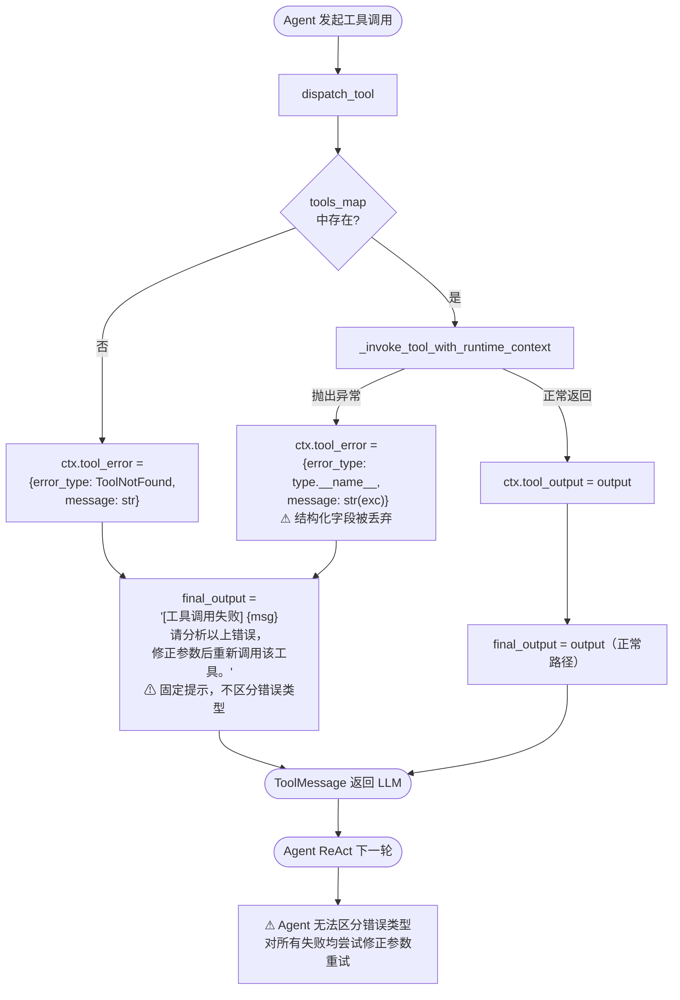
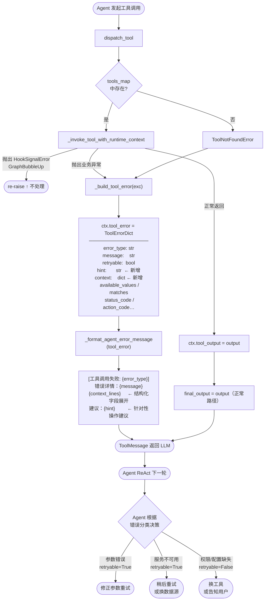

# 异常处理机制

## 需求描述

​	为提升agent调用工具的健壮性，agent在调用工具时，如工具有异常，应友好把异常反馈回给agent，agent在下一次reAct的时候可以智能改变参数或改调用其它工具等策略，也可以自主决定把异常告诉给用户。

```python
# tools/registry.py

class ToolRegistry:
    def dispatch(self, name: str, args: dict, **kwargs) -> str:
        """根据名字找到工具，执行它，返回 JSON 字符串。"""
        
        # 第1步：找到工具条目
        entry = self.get_entry(name)
        if not entry:
            return json.dumps({"error": f"Unknown tool: {name}"})
        
        # 第2步：调用 handler
        try:
            if entry.is_async:
                # 异步工具（使用了 async def 的工具）
                from model_tools import _run_async
                return _run_async(entry.handler(args, **kwargs))
            return entry.handler(args, **kwargs)
        
        # 第3步：异常处理
        except Exception as e:
            logger.exception("Tool %s dispatch error: %s", name, e)
            return json.dumps({
                "error": f"Tool execution failed: {type(e).__name__}: {e}"
            })
```


## 现状分析

### 1. 工具调度层现状

实际的工具调度入口是 `packages/datacloud-analysis/src/datacloud_analysis/orchestration/execution/tool_wrapper.py` 中的 `dispatch_tool()` 函数，而非需求伪代码所示的 `ToolRegistry.dispatch()`。工具实例以 `tools_map: dict[str, BaseTool]` 形式传入，调度逻辑通过内嵌的 `_run_tool()` 协程完成。

**当前异常捕获位置（`tool_wrapper.py` 第 540～543 行）：**

```python
except Exception as exc:  # noqa: BLE001
    logger.warning("dispatch_tool: tool='%s' raised: %s", tool_name, exc)
    ctx["tool_output"] = None
    ctx["tool_error"] = {"error_type": type(exc).__name__, "message": str(exc)}
```

**当前向 LLM 返回的错误消息（第 615～618 行）：**

```python
if ctx.get("tool_error"):
    err_msg = ctx["tool_error"].get("message", "未知错误")
    logger.info("[tool_return] tool=%s error=%s", tool_name, err_msg)
    final_output = f"[工具调用失败] {err_msg}\n请分析以上错误，修正参数后重新调用该工具。"
```

**评价：** 异常已被捕获，并以文本形式反馈给 LLM，agent 能接收到错误提示，具备基本可用性。

---

### 2. SDK 异常体系现状

`packages/datacloud-data/src/datacloud_data_sdk/exceptions.py`（437 行）已定义完整的分层异常体系：

```
DatacloudError（基类）
├── OntologyError（本体层）
│   ├── TermResolutionError
│   │   ├── TermNotFoundError     ← 含 term_set / value / available_values 字段
│   │   └── TermAmbiguousError    ← 含 matches 字段（匹配到的候选术语列表）
│   ├── ObjectNotFoundError
│   ├── ActionNotFoundError
│   └── InvalidOntologyFormatError
├── PlanError（计划层）
│   ├── PlanGenerationError
│   ├── PlanValidationError
│   └── CannotAnswerError
├── ExecutionError（执行层）
│   ├── ApiExecutionError         ← 含 status_code / response_body
│   ├── SqlExecutionError         ← 含 datasource_id / sql
│   ├── KbExecutionError
│   ├── ScriptExecutionError
│   ├── ActionNotConfiguredError  ← 含 action_code
│   ├── PermissionDeniedError
│   ├── DataSourceUnavailableError
│   └── StepDependencyError
└── AggregationError
```

部分异常类（如 `TermNotFoundError`、`TermAmbiguousError`）携带了可用于 agent 自主决策的结构化字段，但当前 `dispatch_tool` 仅取 `str(exc)` 作为错误消息，**这些字段在传递给 LLM 前已被丢弃**。

---

### 3. 特殊信号异常的处理现状

`packages/datacloud-analysis/src/datacloud_analysis/tool_hook_plugins/types.py` 定义了两类"信号异常"，它们不是真正的执行错误，而是工作流控制信号：

| 异常类 | 用途 | 当前处理方式 |
|--------|------|------------|
| `HookSignalError` | 钩子管道信号基类 | 在 `dispatch_tool` 中 `re-raise`，不转换为 agent 消息 |
| `ClarificationNeededError` | 需要用户澄清时触发 | 同上，冒泡到上层框架处理 |
| `GraphBubbleUp`（LangGraph） | interrupt / 挂起流程 | 同上，不捕获直接传播 |

这三类异常的处理逻辑与普通工具执行异常有本质区别，**不在本次需求的覆盖范围内**，改动时需注意不能破坏其 re-raise 语义。

---

### 4. 实现差距

| 差距 | 现状 | 期望 |
|------|------|------|
| **错误消息格式** | 纯文本字符串，无结构，LLM 只能靠自然语言理解 | 结构化信息（错误类型、错误码、可选操作提示），机器可读 |
| **结构化字段丢失** | `str(exc)` 抹去了 `available_values`、`matches`、`status_code` 等关键上下文 | 将这些字段带入 agent 反馈，让 agent 直接利用（如"可用术语为 X/Y/Z，请重试"） |
| **错误可操作性** | 当前提示固定为"请分析以上错误，修正参数后重新调用该工具"，不区分错误类型 | 根据异常类型给出针对性操作建议（如 TermNotFoundError → 提供候选值；PermissionDeniedError → 建议换工具；DataSourceUnavailableError → 建议稍后重试） |
| **错误分类透出** | agent 无法区分"参数错误"与"服务不可用"，重试策略相同 | 区分可重试 / 不可重试 / 需人工干预三类，帮助 agent 做出合理的下一步决策 |
| **日志级别** | 工具执行失败当前用 `logger.warning`（第 541 行），与正常业务 warning 混淆 | 区分严重程度，执行层失败应用 `logger.error` |

---

### 5. 改动范围

改动范围集中、影响面小，**无需改动 SDK 异常定义本身**：

**必改（核心路径）：**
- `packages/datacloud-analysis/src/datacloud_analysis/orchestration/execution/tool_wrapper.py`
  - `_run_tool()` 内的异常捕获块：将 `ctx["tool_error"]` 从 `{error_type, message}` 扩展为包含结构化细节的字典
  - `dispatch_tool()` 末尾的错误消息组装逻辑（第 615～618 行）：根据 `error_type` 分类，生成针对性的 agent 友好提示

**可选扩展（改善语义丰富度）：**
- `packages/datacloud-data/src/datacloud_data_sdk/exceptions.py`
  - 为各异常类添加 `to_agent_hint() -> str` 方法，集中管理"agent 可操作提示"的生成逻辑，避免 `tool_wrapper.py` 中出现大量 `isinstance` 判断


## 概要设计

### 1. 设计目标

在现有异常捕获机制的基础上，做最小改动，达成以下目标：

1. **字段不丢失**：将异常对象携带的结构化字段（`available_values`、`matches`、`status_code` 等）透传给 agent
2. **分类可感知**：agent 能区分"参数错误（改参数重试）"、"服务不可用（稍后重试）"、"权限/配置缺失（换工具或告知用户）"三大类
3. **提示可操作**：根据异常类型生成针对性的自然语言建议，而非固定的通用提示
4. **信号异常不受影响**：`HookSignalError`、`GraphBubbleUp` 等工作流控制信号继续 re-raise，不纳入本改造范围

---

### 2. 改造前架构



---

### 3. 改造后架构



---

### 4. 核心数据结构

新增 `ToolErrorDict`（TypedDict），替换现有的两字段字典：

```python
class ToolErrorDict(TypedDict, total=False):
    error_type: str           # 异常类名，如 "TermNotFoundError"
    message:    str           # str(exc) 原始消息
    retryable:  bool          # True → agent 可自主重试；False → 需换策略或上报用户
    hint:       str           # 针对性操作建议（自然语言，直接喂给 LLM）
    context:    dict[str, Any]  # 可选结构化字段，按异常类型填充（见下表）
```

`context` 字段按异常类型携带不同的诊断信息：

| 异常类 | context 字段 | 示例值 |
|--------|-------------|--------|
| `TermNotFoundError` | `available_values`, `term_set`, `value` | `["普通客户", "VIP客户", "企业客户"]` |
| `TermAmbiguousError` | `matches`, `term_set`, `value` | `[{"label": "VIP客户", "score": 0.92}, ...]` |
| `ApiExecutionError` | `status_code`, `response_body` | `{"status_code": 403, "response_body": "..."}` |
| `SqlExecutionError` | `datasource_id`, `sql` | `{"datasource_id": "mysql_prod", ...}` |
| `ActionNotConfiguredError` | `action_code` | `{"action_code": "get_order_detail"}` |
| `DataSourceUnavailableError` | `datasource_id` | `{"datasource_id": "mysql_prod"}` |
| `FileNotFoundInStoreError` | `md5` | `{"md5": "d41d8cd98f00b204e9800998ecf8427e"}` |
| 其他 | —（空dict） | — |

---

### 5. 异常分类策略

`_build_tool_error(exc)` 按以下规则将异常实例转换为 `ToolErrorDict`：

| 异常类 | retryable | hint 模板 |
|--------|-----------|----------|
| `TermNotFoundError` | `True` | `术语集 "{term_set}" 中不存在 "{value}"，可用值为：{available_values}，请从中选择后重试。` |
| `TermAmbiguousError` | `True` | `"{value}" 匹配到多个术语：{matches}，请明确指定后重试。` |
| `ObjectNotFoundError` | `False` | `本体中不存在该对象，请确认对象名称后重试，或换用其他工具。` |
| `ActionNotFoundError` | `False` | `本体中不存在该动作，请确认动作名称是否正确。` |
| `ActionNotConfiguredError` | `False` | `动作 "{action_code}" 未配置执行方式，请换用其他工具或联系管理员。` |
| `PermissionDeniedError` | `False` | `当前用户无权执行该操作，请尝试其他工具，或告知用户需申请权限。` |
| `ApiExecutionError`（4xx） | `False` | `API 返回客户端错误（HTTP {status_code}），请检查参数后重试。` |
| `ApiExecutionError`（5xx） | `True` | `API 返回服务端错误（HTTP {status_code}），可稍后重试。` |
| `SqlExecutionError` | `False` | `SQL 执行失败，请检查查询条件或字段名后重试。` |
| `DataSourceUnavailableError` | `True` | `数据源 "{datasource_id}" 暂不可用，可稍后重试或使用其他数据源。` |
| `CannotAnswerError` | `False` | `当前知识库无法回答该问题，请告知用户或尝试拆解问题后重试。` |
| 其他 `DatacloudError` | `False` | `工具执行失败（{error_type}），请告知用户并联系技术支持。` |
| `TermVectorValidationError` ★ | `False` | `术语向量知识库未就绪或校验失败，请告知用户知识库暂不可用，或联系管理员检查向量索引状态。` |
| `FileNotFoundInStoreError` ★ | `False` | `文件存储中未找到文件（md5={md5}），请确认文件是否已上传。` |
| `BackendMisconfiguredError` ★ | `False` | `文件存储后端配置错误（如缺少 S3 密钥），请联系管理员检查存储配置。` |
| `FileStoreError` ★（其余子类） | `False` | `文件存储操作失败，请联系管理员检查存储后端状态。` |
| 其他 `Exception` | `False` | `工具执行遇到未知错误（{error_type}），请告知用户并联系技术支持。` |

> ★ 来自 `datacloud-knowledge` 包（独立异常继承链，非 `DatacloudError` 子类），在 `_build_tool_error()` 中用 `try/except ImportError` 保护导入。

---

### 6. 改动文件与改动点

| 文件 | 改动性质 | 具体位置 | 说明 |
|------|----------|----------|------|
| `tool_wrapper.py` | **必改** | 新增 `_build_tool_error()` 函数 | 异常 → `ToolErrorDict` 的转换逻辑 |
| `tool_wrapper.py` | **必改** | 新增 `_format_agent_error_message()` 函数 | `ToolErrorDict` → agent 友好文本 |
| `tool_wrapper.py` | **必改** | `_run_tool()` 第 540～543 行 | 替换为 `_build_tool_error(exc)` 调用 |
| `tool_wrapper.py` | **必改** | `dispatch_tool()` 第 615～618 行 | 替换为 `_format_agent_error_message()` 调用，日志级别 `warning` → `error` |
| `exceptions.py` | **可选** | 各异常类 | 添加 `to_agent_hint() -> str` 方法，将 hint 模板内聚到异常类本身，避免 `tool_wrapper.py` 中大量 `isinstance` 判断 |

> **不改动范围**：`HookSignalError` / `ClarificationNeededError` / `GraphBubbleUp` 的 re-raise 路径、SDK 异常层次结构、LangGraph 状态机逻辑、HTTP API 层异常处理、`datacloud-knowledge` 包本身的异常类定义。

**关于 `datacloud-knowledge` 异常的处理说明：**

`datacloud-knowledge` 的异常（`FileStoreError`、`TermVectorValidationError` 等）与 `DatacloudError` 体系完全独立，且 `datacloud-knowledge` 在部分部署场景下可能未安装。因此在 `_build_tool_error()` 中通过 `try/except ImportError` 保护导入，不引入硬依赖：

```python
# _build_tool_error() 内，DatacloudError 分支均不命中时（else 分支）
try:
    from datacloud_knowledge.file_store.errors import ...       # noqa: PLC0415
    from datacloud_knowledge.query.search.vector_validation import ...  # noqa: PLC0415
except ImportError:
    pass   # datacloud-knowledge 未安装，保留兜底 hint
else:
    if isinstance(exc, TermVectorValidationError): ...
    elif isinstance(exc, FileNotFoundInStoreError): ...
    ...
```

---

## 详细设计

### 1. 新增类型定义：`ToolErrorDict`

在 `tool_wrapper.py` 文件顶部，与现有 import 一起添加：

```python
# tool_wrapper.py 顶部新增
from typing import Any, TypedDict


class ToolErrorDict(TypedDict, total=False):
    """结构化工具错误描述，替换现有的两字段 dict。"""

    error_type: str           # 异常类名
    message: str              # str(exc) 原始消息
    retryable: bool           # True → agent 可自主重试
    hint: str                 # 针对性操作建议，直接注入 ToolMessage
    context: dict[str, Any]   # 异常对象携带的结构化字段
```

---

### 2. 新增函数：`_build_tool_error`

负责将异常实例转换为 `ToolErrorDict`，集中管理异常分类与上下文提取逻辑。

**放置位置**：`tool_wrapper.py`，紧接在 `_summarize_output` 函数之后。

```python
def _build_tool_error(exc: Exception) -> ToolErrorDict:
    """将异常实例转换为结构化 ToolErrorDict。

    按异常类型提取结构化字段，并生成针对性 hint，
    供 agent 在下一轮 ReAct 中自主决策（修正参数 / 换工具 / 告知用户）。
    """
    from datacloud_data_sdk.exceptions import (  # noqa: PLC0415
        ActionNotConfiguredError,
        ActionNotFoundError,
        ApiExecutionError,
        CannotAnswerError,
        DataSourceUnavailableError,
        KbExecutionError,
        ObjectNotFoundError,
        PermissionDeniedError,
        ScriptExecutionError,
        SqlExecutionError,
        StepDependencyError,
        TermAmbiguousError,
        TermNotFoundError,
    )

    error_type = type(exc).__name__
    message = str(exc)
    context: dict[str, Any] = {}
    retryable = False
    hint = f"工具执行失败（{error_type}），请告知用户并联系技术支持。"

    if isinstance(exc, TermNotFoundError):
        retryable = True
        context = {"term_set": exc.term_set, "value": exc.value}
        if exc.available_entries:
            context["available_entries"] = exc.available_entries[:10]
        elif exc.available_values:
            context["available_values"] = exc.available_values[:10]
        hint = (
            f"术语集「{exc.term_set}」中不存在「{exc.value}」，"
            "请从 available_values/available_entries 中选择正确的值后重试。"
        )

    elif isinstance(exc, TermAmbiguousError):
        retryable = True
        context = {"term_set": exc.term_set, "value": exc.value, "matches": exc.matches[:10]}
        hint = f"「{exc.value}」匹配到多个术语，请从 matches 中明确指定其中一个后重试。"

    elif isinstance(exc, ObjectNotFoundError):
        context = {"object_code": exc.object_code}
        hint = f"本体中不存在对象「{exc.object_code}」，请确认对象名称或换用其他工具。"

    elif isinstance(exc, ActionNotFoundError):
        context = {"object_code": exc.object_code, "action_code": exc.action_code}
        hint = (
            f"对象「{exc.object_code}」上不存在动作「{exc.action_code}」，"
            "请确认动作名称是否正确。"
        )

    elif isinstance(exc, ActionNotConfiguredError):
        context = {"action_code": exc.action_code}
        hint = f"动作「{exc.action_code}」未配置执行方式，请换用其他工具或联系管理员。"

    elif isinstance(exc, PermissionDeniedError):
        context = {"resource": exc.resource, "reason_code": exc.reason_code}
        hint = f"当前用户无权访问「{exc.resource}」，请尝试其他工具或告知用户需要申请权限。"

    elif isinstance(exc, ApiExecutionError):
        retryable = exc.status_code >= 500
        context = {"function_code": exc.function_code, "status_code": exc.status_code}
        if retryable:
            hint = f"API「{exc.function_code}」返回服务端错误（HTTP {exc.status_code}），可稍后重试。"
        else:
            hint = (
                f"API「{exc.function_code}」返回客户端错误（HTTP {exc.status_code}），"
                "请检查参数后重试。"
            )

    elif isinstance(exc, SqlExecutionError):
        context = {"datasource_alias": exc.datasource_alias}
        hint = f"数据源「{exc.datasource_alias}」上的 SQL 执行失败，请检查查询条件或字段名。"

    elif isinstance(exc, KbExecutionError):
        context = {"datasource_alias": exc.datasource_alias}
        hint = f"知识库「{exc.datasource_alias}」查询失败，请检查查询参数或换用其他工具。"

    elif isinstance(exc, ScriptExecutionError):
        context = {"action_code": exc.action_code}
        if exc.line_no is not None:
            context["line_no"] = exc.line_no
        hint = f"动作脚本「{exc.action_code}」执行失败，请检查参数合法性。"

    elif isinstance(exc, DataSourceUnavailableError):
        retryable = True
        context = {"datasource_alias": exc.alias}
        hint = f"数据源「{exc.alias}」当前不可用，可稍后重试或使用其他数据源。"

    elif isinstance(exc, CannotAnswerError):
        hint = "当前知识库无法回答该问题，请告知用户或尝试拆解问题后重试。"

    elif isinstance(exc, StepDependencyError):
        context = {"step_id": exc.step_id, "depends_on": exc.depends_on}
        hint = f"步骤「{exc.step_id}」的依赖步骤「{exc.depends_on}」缺失，请检查执行计划。"

    else:
        # ── datacloud-knowledge 独立异常体系 ──
        # 与 DatacloudError 无继承关系，且该包在部分部署中可能未安装，
        # 用 try/except ImportError 保护，避免硬依赖导致 import 失败。
        try:
            from datacloud_knowledge.file_store.errors import (  # noqa: PLC0415
                BackendMisconfiguredError,
                FileNotFoundInStoreError,
                FileStoreError,
            )
            from datacloud_knowledge.query.search.vector_validation import (  # noqa: PLC0415
                TermVectorValidationError,
            )
        except ImportError:
            pass  # 未安装则保留兜底 hint
        else:
            if isinstance(exc, TermVectorValidationError):
                # 进程级缓存拒绝重试，重试无意义
                hint = (
                    "术语向量知识库未就绪或校验失败，当前无法执行向量召回。"
                    "请告知用户知识库暂不可用，或联系管理员检查向量索引状态。"
                )
            elif isinstance(exc, FileNotFoundInStoreError):
                context = {"md5": exc.md5}
                hint = f"文件存储中未找到文件（md5={exc.md5}），请确认文件是否已上传。"
            elif isinstance(exc, BackendMisconfiguredError):
                hint = "文件存储后端配置错误（如缺少 S3 密钥），请联系管理员检查存储配置。"
            elif isinstance(exc, FileStoreError):
                hint = "文件存储操作失败，请联系管理员检查存储后端状态。"

    return ToolErrorDict(
        error_type=error_type,
        message=message,
        retryable=retryable,
        hint=hint,
        context=context,
    )
```

---

### 3. 新增函数：`_format_agent_error_message`

负责将 `ToolErrorDict` 格式化为 agent 可直接理解的文本，紧接在 `_build_tool_error` 之后定义。

```python
def _format_agent_error_message(tool_error: ToolErrorDict) -> str:
    """将结构化 ToolErrorDict 格式化为 agent 友好的 ToolMessage 文本。

    输出结构：
      [工具调用失败: ErrorType]
      错误详情：...
      可用值/候选术语/HTTP状态码：...  （仅对应异常类型时出现）
      可重试：是/否
      建议：...
    """
    error_type = tool_error.get("error_type", "UnknownError")
    message = tool_error.get("message", "未知错误")
    hint = tool_error.get("hint", "请告知用户并联系技术支持。")
    context = tool_error.get("context") or {}
    retryable = tool_error.get("retryable", False)

    lines: list[str] = [
        f"[工具调用失败: {error_type}]",
        f"错误详情：{message}",
    ]

    if "available_entries" in context:
        entries = context["available_entries"]
        entry_strs = [
            f"[{e['code']}] {e['label']}" for e in entries if isinstance(e, dict)
        ]
        lines.append(f"可用条目：{', '.join(entry_strs)}")
    elif "available_values" in context:
        vals = context["available_values"]
        lines.append(f"可用值：{', '.join(str(v) for v in vals)}")

    if "matches" in context:
        matches = context["matches"]
        match_strs = [
            f"[{m['code']}] {m['label']}" for m in matches if isinstance(m, dict)
        ]
        lines.append(f"候选术语：{', '.join(match_strs)}")

    if "status_code" in context:
        lines.append(f"HTTP 状态码：{context['status_code']}")

    lines.append(f"可重试：{'是' if retryable else '否'}")
    lines.append(f"建议：{hint}")

    return "\n".join(lines)
```

---

### 4. 修改点一：`_run_tool()` 异常捕获块

**文件**：`tool_wrapper.py`，`_run_tool()` 协程内，第 538～543 行附近。

```python
# ===== 改造前 =====
except Exception as exc:  # noqa: BLE001
    logger.warning("dispatch_tool: tool='%s' raised: %s", tool_name, exc)
    ctx["tool_output"] = None
    ctx["tool_error"] = {"error_type": type(exc).__name__, "message": str(exc)}

# ===== 改造后 =====
except Exception as exc:  # noqa: BLE001
    logger.error("dispatch_tool: tool='%s' raised %s: %s", tool_name, type(exc).__name__, exc)
    ctx["tool_output"] = None
    ctx["tool_error"] = _build_tool_error(exc)
```

> 日志级别从 `warning` 升为 `error`：工具执行失败属于业务错误，应与普通告警区分，便于监控告警规则过滤。

---

### 5. 修改点二：`dispatch_tool()` 错误消息组装

**文件**：`tool_wrapper.py`，`dispatch_tool()` 末尾，第 614～618 行附近。

```python
# ===== 改造前 =====
if ctx.get("tool_error"):
    err_msg = ctx["tool_error"].get("message", "未知错误")
    logger.info("[tool_return] tool=%s error=%s", tool_name, err_msg)
    final_output = f"[工具调用失败] {err_msg}\n请分析以上错误，修正参数后重新调用该工具。"

# ===== 改造后 =====
if ctx.get("tool_error"):
    tool_error: ToolErrorDict = ctx["tool_error"]
    logger.info(
        "[tool_return] tool=%s error_type=%s retryable=%s",
        tool_name,
        tool_error.get("error_type"),
        tool_error.get("retryable"),
    )
    final_output = _format_agent_error_message(tool_error)
```

---

### 6. 输出对比示例

**场景 A：TermNotFoundError（改造前 vs 改造后）**

```
# 改造前
[工具调用失败] 值「vip」不存在。
可选值: 普通客户, VIP客户, 企业客户
请分析以上错误，修正参数后重新调用该工具。

# 改造后
[工具调用失败: TermNotFoundError]
错误详情：值「vip」不存在。
可选值：普通客户, VIP客户, 企业客户
可重试：是
建议：术语集「customer_type」中不存在「vip」，请从 available_values/available_entries 中选择正确的值后重试。
```

**场景 B：DataSourceUnavailableError（改造前 vs 改造后）**

```
# 改造前
[工具调用失败] Datasource unavailable: 'mysql_prod'
请分析以上错误，修正参数后重新调用该工具。

# 改造后
[工具调用失败: DataSourceUnavailableError]
错误详情：Datasource unavailable: 'mysql_prod'
可重试：是
建议：数据源「mysql_prod」当前不可用，可稍后重试或使用其他数据源。
```

**场景 C：PermissionDeniedError（改造前 vs 改造后）**

```
# 改造前
[工具调用失败] Permission denied for 'order_detail': permission_denied
请分析以上错误，修正参数后重新调用该工具。

# 改造后
[工具调用失败: PermissionDeniedError]
错误详情：Permission denied for 'order_detail': permission_denied
可重试：否
建议：当前用户无权访问「order_detail」，请尝试其他工具或告知用户需要申请权限。
```

---

### 7. 测试要点

| 测试场景 | 验证点 |
|----------|--------|
| `TermNotFoundError`（含 `available_entries`） | `context["available_entries"]` 不超过 10 条；`retryable=True`；`hint` 含术语集名 |
| `TermAmbiguousError` | `context["matches"]` 不超过 10 条；`retryable=True` |
| `ApiExecutionError(status_code=403)` | `retryable=False`；hint 含 "客户端错误" |
| `ApiExecutionError(status_code=503)` | `retryable=True`；hint 含 "服务端错误" |
| `DataSourceUnavailableError` | `retryable=True`；hint 含数据源别名 |
| `PermissionDeniedError` | `retryable=False`；hint 含 "申请权限" |
| 未知异常（`ValueError`） | 使用兜底 hint；`retryable=False` |
| `HookSignalError`（不应被捕获） | 异常正常冒泡，不生成 `tool_error` |
| `GraphBubbleUp`（不应被捕获） | 异常正常冒泡，不生成 `tool_error` |
| `TermVectorValidationError` | `retryable=False`；`hint` 含"向量索引" |
| `FileNotFoundInStoreError` | `retryable=False`；`context["md5"]` 存在；`hint` 含 md5 值 |
| `BackendMisconfiguredError` | `retryable=False`；`hint` 含"管理员" |
| `datacloud-knowledge` 未安装（ImportError） | 退回兜底 hint，`retryable=False`，不抛异常 |


## 验收用例

### 1. 用例总览

测试文件路径：`packages/datacloud-analysis/tests/dca/unit/test_tool_error_dispatch.py`

| 编号 | 分组 | 场景 | 验证点 |
|------|------|------|--------|
| TC-30 | `_build_tool_error` | `TermNotFoundError` + `available_entries` | `context["available_entries"]` 存在；`retryable=True`；`hint` 含术语集名 |
| TC-31 | `_build_tool_error` | `TermNotFoundError` + `available_values`（无 entries） | 降级为 `context["available_values"]`；`available_entries` 不存在 |
| TC-32 | `_build_tool_error` | `TermNotFoundError` entries 超 10 条 | `available_entries` 截断至 10 条 |
| TC-33 | `_build_tool_error` | `TermAmbiguousError` | `context["matches"]` 存在；`retryable=True`；`hint` 含歧义值 |
| TC-34 | `_build_tool_error` | `TermAmbiguousError` matches 超 10 条 | `matches` 截断至 10 条 |
| TC-35 | `_build_tool_error` | `ObjectNotFoundError` | `retryable=False`；`context["object_code"]` 存在 |
| TC-36 | `_build_tool_error` | `ActionNotFoundError` | `retryable=False`；`context` 含 `object_code` + `action_code` |
| TC-37 | `_build_tool_error` | `ActionNotConfiguredError` | `retryable=False`；`hint` 含"管理员" |
| TC-38 | `_build_tool_error` | `PermissionDeniedError` | `retryable=False`；`hint` 含"申请权限" |
| TC-39 | `_build_tool_error` | `ApiExecutionError(status=403)` | `retryable=False`；`hint` 含"客户端错误" |
| TC-40 | `_build_tool_error` | `ApiExecutionError(status=503)` | `retryable=True`；`hint` 含"服务端错误" |
| TC-41 | `_build_tool_error` | `SqlExecutionError` | `retryable=False`；`context["datasource_alias"]` 存在 |
| TC-42 | `_build_tool_error` | `ScriptExecutionError(line_no=12)` | `context["line_no"] == 12` |
| TC-43 | `_build_tool_error` | `DataSourceUnavailableError` | `retryable=True`；`context["datasource_alias"]` 含别名 |
| TC-44 | `_build_tool_error` | `CannotAnswerError` | `retryable=False`；`hint` 含"拆解" |
| TC-45 | `_build_tool_error` | `StepDependencyError` | `context` 含 `step_id` + `depends_on` |
| TC-46 | `_build_tool_error` | 未知 `ValueError`（兜底） | `retryable=False`；`hint` 含"技术支持"；`context == {}` |
| TC-47 | `_format_agent_error_message` | 标准头部字段 | 输出含 `[工具调用失败: X]`、`错误详情：`、`可重试：`、`建议：` |
| TC-48 | `_format_agent_error_message` | `available_entries` 展开 | 输出含"可用条目：[code] label" |
| TC-49 | `_format_agent_error_message` | `available_values` 降级展开 | 输出含"可用值："；不含"可用条目" |
| TC-50 | `_format_agent_error_message` | `entries` 优先于 `values` | 同时存在时只展示"可用条目" |
| TC-51 | `_format_agent_error_message` | `matches` 展开 | 输出含"候选术语：[code] label" |
| TC-52 | `_format_agent_error_message` | `status_code` 展开 | 输出含"HTTP 状态码：403" |
| TC-53 | `dispatch_tool` 集成 | 工具抛 `TermNotFoundError` | ToolMessage 含 `TermNotFoundError`、可用值、`可重试：是` |
| TC-54 | `dispatch_tool` 集成 | 工具抛 `DataSourceUnavailableError` | ToolMessage 含别名、`可重试：是` |
| TC-55 | `dispatch_tool` 集成 | 工具抛 `PermissionDeniedError` | ToolMessage 含 `可重试：否` |
| TC-56 | `dispatch_tool` 集成 | 工具不存在 | ToolMessage 含 `ToolNotFound`、`可重试：否` |
| TC-57 | `dispatch_tool` 集成 | 工具抛 `HookSignalError`（负向） | 异常冒泡，不生成 ToolMessage |
| TC-58 | `dispatch_tool` 集成 | 工具抛 `GraphBubbleUp`（负向） | 异常冒泡，不生成 ToolMessage |
| TC-59 | `dispatch_tool` 集成 | 工具执行失败时日志级别 | 存在 `ERROR` 级别日志，含异常类名 |
| TC-60 | `_build_tool_error` | `TermVectorValidationError` | `retryable=False`；`context == {}`；`hint` 含"向量索引" |
| TC-61 | `_build_tool_error` | `FileNotFoundInStoreError` | `retryable=False`；`context["md5"]` 与异常一致；`hint` 含 md5 |
| TC-62 | `_build_tool_error` | `BackendMisconfiguredError` | `retryable=False`；`hint` 含"管理员" |
| TC-63 | `_build_tool_error` | `datacloud-knowledge` 未安装（mock `ImportError`） | 退回兜底 hint；`retryable=False`；不抛异常 |

**执行命令：**

```bash
uv run pytest packages/datacloud-analysis/tests/dca/unit/test_tool_error_dispatch.py -v
```

---

### 2. 测试文件

```python
# packages/datacloud-analysis/tests/dca/unit/test_tool_error_dispatch.py
"""验收用例：tool_wrapper 异常友好化改造。

测试分组
--------
TC-30 ~ TC-46  _build_tool_error()              单元测试（各异常类型 → ToolErrorDict）
TC-47 ~ TC-52  _format_agent_error_message()    单元测试（格式化输出验证）
TC-53 ~ TC-59  dispatch_tool()                  集成测试（完整错误链路）
TC-60 ~ TC-63  _build_tool_error() knowledge   单元测试（datacloud-knowledge 独立异常体系）
"""

from __future__ import annotations

import logging

import pytest
from datacloud_data_sdk.exceptions import (
    ActionNotConfiguredError,
    ActionNotFoundError,
    ApiExecutionError,
    CannotAnswerError,
    DataSourceUnavailableError,
    ObjectNotFoundError,
    PermissionDeniedError,
    ScriptExecutionError,
    SqlExecutionError,
    StepDependencyError,
    TermAmbiguousError,
    TermNotFoundError,
)
from langchain_core.tools import StructuredTool
from pydantic import BaseModel

from datacloud_analysis.orchestration.execution.tool_wrapper import (
    _build_tool_error,
    _format_agent_error_message,
    dispatch_tool,
)


# ============================================================================
# Group 1: _build_tool_error() 单元测试  TC-30 ~ TC-46
# ============================================================================


def test_tc30_term_not_found_with_entries() -> None:
    """TC-30: available_entries 优先写入 context，retryable=True。"""
    entries = [{"code": "VIP", "label": "VIP客户"}, {"code": "ORD", "label": "普通客户"}]
    exc = TermNotFoundError("customer_type", "vip", available_entries=entries)
    result = _build_tool_error(exc)

    assert result["error_type"] == "TermNotFoundError"
    assert result["retryable"] is True
    assert result["context"]["available_entries"] == entries
    assert "available_values" not in result["context"]
    assert "customer_type" in result["hint"]


def test_tc31_term_not_found_values_fallback() -> None:
    """TC-31: 无 entries 时降级为 available_values。"""
    exc = TermNotFoundError("region", "东北", available_values=["华东", "华南", "华北"])
    result = _build_tool_error(exc)

    assert result["retryable"] is True
    assert result["context"]["available_values"] == ["华东", "华南", "华北"]
    assert "available_entries" not in result["context"]


def test_tc32_term_not_found_truncates_at_ten() -> None:
    """TC-32: entries 超 10 条时截断至 10 条。"""
    entries = [{"code": str(i), "label": f"选项{i}"} for i in range(15)]
    exc = TermNotFoundError("big_set", "x", available_entries=entries)
    result = _build_tool_error(exc)

    assert len(result["context"]["available_entries"]) == 10


def test_tc33_term_ambiguous() -> None:
    """TC-33: matches 写入 context，retryable=True，hint 含歧义值。"""
    matches = [
        {"code": "C001", "label": "VIP客户"},
        {"code": "C002", "label": "贵宾客户"},
    ]
    exc = TermAmbiguousError("customer_type", "vip客户", matches)
    result = _build_tool_error(exc)

    assert result["error_type"] == "TermAmbiguousError"
    assert result["retryable"] is True
    assert result["context"]["matches"] == matches
    assert "vip客户" in result["hint"]


def test_tc34_term_ambiguous_truncates_at_ten() -> None:
    """TC-34: matches 超 10 条时截断至 10 条。"""
    matches = [{"code": str(i), "label": f"term{i}"} for i in range(12)]
    exc = TermAmbiguousError("ts", "x", matches)
    result = _build_tool_error(exc)

    assert len(result["context"]["matches"]) == 10


def test_tc35_object_not_found() -> None:
    """TC-35: retryable=False，context 含 object_code，hint 含对象名。"""
    exc = ObjectNotFoundError("sales_order")
    result = _build_tool_error(exc)

    assert result["error_type"] == "ObjectNotFoundError"
    assert result["retryable"] is False
    assert result["context"]["object_code"] == "sales_order"
    assert "sales_order" in result["hint"]


def test_tc36_action_not_found() -> None:
    """TC-36: retryable=False，context 含 object_code + action_code。"""
    exc = ActionNotFoundError("customer", "get_vip_level")
    result = _build_tool_error(exc)

    assert result["retryable"] is False
    assert result["context"]["object_code"] == "customer"
    assert result["context"]["action_code"] == "get_vip_level"


def test_tc37_action_not_configured() -> None:
    """TC-37: retryable=False，hint 含"管理员"。"""
    exc = ActionNotConfiguredError("export_data")
    result = _build_tool_error(exc)

    assert result["retryable"] is False
    assert result["context"]["action_code"] == "export_data"
    assert "管理员" in result["hint"]


def test_tc38_permission_denied() -> None:
    """TC-38: retryable=False，context 含 resource + reason_code，hint 含"申请权限"。"""
    exc = PermissionDeniedError("order_detail", reason_code="no_read_perm")
    result = _build_tool_error(exc)

    assert result["retryable"] is False
    assert result["context"]["resource"] == "order_detail"
    assert result["context"]["reason_code"] == "no_read_perm"
    assert "申请权限" in result["hint"]


def test_tc39_api_error_4xx_not_retryable() -> None:
    """TC-39: 4xx → retryable=False，hint 含"客户端错误"。"""
    exc = ApiExecutionError("get_customer", 403, "Forbidden")
    result = _build_tool_error(exc)

    assert result["retryable"] is False
    assert result["context"]["status_code"] == 403
    assert "客户端错误" in result["hint"]


def test_tc40_api_error_5xx_retryable() -> None:
    """TC-40: 5xx → retryable=True，hint 含"服务端错误"。"""
    exc = ApiExecutionError("get_customer", 503, "Service Unavailable")
    result = _build_tool_error(exc)

    assert result["retryable"] is True
    assert result["context"]["status_code"] == 503
    assert "服务端错误" in result["hint"]


def test_tc41_sql_execution_error() -> None:
    """TC-41: retryable=False，context 含 datasource_alias。"""
    exc = SqlExecutionError("mysql_prod", "SELECT * FROM orders", "Table not found")
    result = _build_tool_error(exc)

    assert result["retryable"] is False
    assert result["context"]["datasource_alias"] == "mysql_prod"
    assert "mysql_prod" in result["hint"]


def test_tc42_script_execution_error_with_line_no() -> None:
    """TC-42: context 含 action_code + line_no。"""
    exc = ScriptExecutionError("calc_bonus", "NameError: x", line_no=12)
    result = _build_tool_error(exc)

    assert result["retryable"] is False
    assert result["context"]["action_code"] == "calc_bonus"
    assert result["context"]["line_no"] == 12


def test_tc43_datasource_unavailable_retryable() -> None:
    """TC-43: retryable=True，context["datasource_alias"] 含别名，hint 含别名。"""
    exc = DataSourceUnavailableError("pg_dw")
    result = _build_tool_error(exc)

    assert result["retryable"] is True
    assert result["context"]["datasource_alias"] == "pg_dw"
    assert "pg_dw" in result["hint"]


def test_tc44_cannot_answer() -> None:
    """TC-44: retryable=False，hint 含"拆解"。"""
    exc = CannotAnswerError("该问题超出知识库范围")
    result = _build_tool_error(exc)

    assert result["retryable"] is False
    assert "拆解" in result["hint"]


def test_tc45_step_dependency_error() -> None:
    """TC-45: context 含 step_id + depends_on。"""
    exc = StepDependencyError("step_3", "step_1")
    result = _build_tool_error(exc)

    assert result["context"]["step_id"] == "step_3"
    assert result["context"]["depends_on"] == "step_1"


def test_tc46_unknown_exception_fallback() -> None:
    """TC-46: 未知异常兜底，retryable=False，hint 含"技术支持"，context 为空。"""
    exc = ValueError("unexpected")
    result = _build_tool_error(exc)

    assert result["error_type"] == "ValueError"
    assert result["retryable"] is False
    assert "技术支持" in result["hint"]
    assert result["context"] == {}


# ============================================================================
# Group 2: _format_agent_error_message() 单元测试  TC-47 ~ TC-52
# ============================================================================


def _make_err(**kwargs: object) -> dict:
    base: dict = {
        "error_type": "TestError",
        "message": "test message",
        "retryable": False,
        "hint": "test hint",
        "context": {},
    }
    base.update(kwargs)
    return base


def test_tc47_format_contains_header_fields() -> None:
    """TC-47: 输出包含标准四行头部。"""
    output = _format_agent_error_message(_make_err(  # type: ignore[arg-type]
        error_type="SqlExecutionError",
        message="Table not found",
        retryable=False,
        hint="请检查字段名",
    ))

    assert "[工具调用失败: SqlExecutionError]" in output
    assert "错误详情：Table not found" in output
    assert "可重试：否" in output
    assert "建议：请检查字段名" in output


def test_tc48_format_available_entries() -> None:
    """TC-48: available_entries 展开为"可用条目"行，retryable=True 显示"是"。"""
    err = _make_err(
        retryable=True,
        context={
            "available_entries": [
                {"code": "A", "label": "选项A"},
                {"code": "B", "label": "选项B"},
            ]
        },
    )
    output = _format_agent_error_message(err)  # type: ignore[arg-type]

    assert "可用条目：[A] 选项A, [B] 选项B" in output
    assert "可重试：是" in output


def test_tc49_format_available_values_fallback() -> None:
    """TC-49: 无 entries 时展开 available_values，不出现"可用条目"。"""
    err = _make_err(context={"available_values": ["华东", "华南"]})
    output = _format_agent_error_message(err)  # type: ignore[arg-type]

    assert "可用值：华东, 华南" in output
    assert "可用条目" not in output


def test_tc50_entries_takes_priority_over_values() -> None:
    """TC-50: entries 与 values 同时存在时，只展示"可用条目"。"""
    err = _make_err(context={
        "available_entries": [{"code": "X", "label": "选项X"}],
        "available_values": ["不应出现"],
    })
    output = _format_agent_error_message(err)  # type: ignore[arg-type]

    assert "可用条目：[X] 选项X" in output
    assert "不应出现" not in output


def test_tc51_format_matches() -> None:
    """TC-51: matches 展开为"候选术语"行。"""
    err = _make_err(context={
        "matches": [
            {"code": "C1", "label": "VIP客户"},
            {"code": "C2", "label": "贵宾客户"},
        ]
    })
    output = _format_agent_error_message(err)  # type: ignore[arg-type]

    assert "候选术语：[C1] VIP客户, [C2] 贵宾客户" in output


def test_tc52_format_status_code() -> None:
    """TC-52: status_code 展开为"HTTP 状态码"行。"""
    err = _make_err(context={"function_code": "get_order", "status_code": 403})
    output = _format_agent_error_message(err)  # type: ignore[arg-type]

    assert "HTTP 状态码：403" in output


# ============================================================================
# Group 3: dispatch_tool() 集成测试  TC-53 ~ TC-59
# ============================================================================


class _DummySchema(BaseModel):
    query: str


def _make_state() -> dict:
    return {
        "agent_id": "test-agent",
        "user_query": "测试查询",
        "workspace_dir": None,
        "knowledge_snippets": [],
        "confirmed_terms": None,
        "knowledge_payload": {},
    }


def _raising_tool(exc: Exception) -> StructuredTool:
    async def _raise(**kwargs: object) -> str:
        raise exc

    return StructuredTool(
        name="test_tool",
        description="test",
        args_schema=_DummySchema,
        coroutine=_raise,
    )


async def test_tc53_dispatch_term_not_found_message() -> None:
    """TC-53: TermNotFoundError → ToolMessage 含类名、可用值、可重试：是。"""
    exc = TermNotFoundError("region", "东北", available_values=["华东", "华南", "华北"])
    tool_call = {"id": "tc53", "name": "test_tool", "args": {"query": "东北"}}

    _, output = await dispatch_tool(
        tool_call=tool_call,
        tools_map={"test_tool": _raising_tool(exc)},
        state=_make_state(),
    )

    assert isinstance(output, str)
    assert "TermNotFoundError" in output
    assert "可用值" in output
    assert "华东" in output
    assert "可重试：是" in output


async def test_tc54_dispatch_datasource_unavailable_retryable() -> None:
    """TC-54: DataSourceUnavailableError → ToolMessage 含别名、可重试：是。"""
    exc = DataSourceUnavailableError("mysql_prod")
    tool_call = {"id": "tc54", "name": "test_tool", "args": {"query": "x"}}

    _, output = await dispatch_tool(
        tool_call=tool_call,
        tools_map={"test_tool": _raising_tool(exc)},
        state=_make_state(),
    )

    assert "DataSourceUnavailableError" in output
    assert "mysql_prod" in output
    assert "可重试：是" in output


async def test_tc55_dispatch_permission_denied_not_retryable() -> None:
    """TC-55: PermissionDeniedError → ToolMessage 含可重试：否。"""
    exc = PermissionDeniedError("secret_table")
    tool_call = {"id": "tc55", "name": "test_tool", "args": {"query": "x"}}

    _, output = await dispatch_tool(
        tool_call=tool_call,
        tools_map={"test_tool": _raising_tool(exc)},
        state=_make_state(),
    )

    assert "PermissionDeniedError" in output
    assert "可重试：否" in output


async def test_tc56_dispatch_tool_not_found() -> None:
    """TC-56: 工具不存在 → ToolMessage 含 ToolNotFound、可重试：否。"""
    tool_call = {"id": "tc56", "name": "nonexistent_tool", "args": {"query": "x"}}

    _, output = await dispatch_tool(
        tool_call=tool_call,
        tools_map={},
        state=_make_state(),
    )

    assert "ToolNotFound" in output
    assert "可重试：否" in output


async def test_tc57_hook_signal_error_propagates() -> None:
    """TC-57: HookSignalError 冒泡，不被转换为 ToolMessage。"""
    from datacloud_analysis.tool_hook_plugins.types import HookSignalError

    class _TestSignal(HookSignalError):
        pass

    tool_call = {"id": "tc57", "name": "test_tool", "args": {"query": "x"}}

    with pytest.raises(HookSignalError):
        await dispatch_tool(
            tool_call=tool_call,
            tools_map={"test_tool": _raising_tool(_TestSignal("signal"))},
            state=_make_state(),
        )


async def test_tc58_graph_bubble_up_propagates() -> None:
    """TC-58: GraphBubbleUp 冒泡，不被转换为 ToolMessage。"""
    try:
        from langgraph.errors import GraphBubbleUp
    except ImportError:

        class GraphBubbleUp(Exception):  # type: ignore[no-redef]
            pass

    exc = GraphBubbleUp("interrupt")
    tool_call = {"id": "tc58", "name": "test_tool", "args": {"query": "x"}}

    with pytest.raises(type(exc)):
        await dispatch_tool(
            tool_call=tool_call,
            tools_map={"test_tool": _raising_tool(exc)},
            state=_make_state(),
        )


async def test_tc59_error_log_level_on_tool_failure(
    caplog: pytest.LogCaptureFixture,
) -> None:
    """TC-59: 工具执行失败时产生 ERROR 级别日志，含异常类名。"""
    exc = SqlExecutionError("pg", "SELECT 1", "connection refused")
    tool_call = {"id": "tc59", "name": "test_tool", "args": {"query": "x"}}

    with caplog.at_level(
        logging.ERROR,
        logger="datacloud_analysis.orchestration.execution.tool_wrapper",
    ):
        await dispatch_tool(
            tool_call=tool_call,
            tools_map={"test_tool": _raising_tool(exc)},
            state=_make_state(),
        )

    error_records = [r for r in caplog.records if r.levelno >= logging.ERROR]
    assert any("SqlExecutionError" in r.message for r in error_records), (
        f"应有 ERROR 级别日志含 SqlExecutionError，实际：{[r.message for r in error_records]}"
    )


# ============================================================================
# Group 4: datacloud-knowledge 独立异常体系  TC-60 ~ TC-63
# ============================================================================

pytest.importorskip(
    "datacloud_knowledge",
    reason="datacloud-knowledge 未安装，跳过 knowledge 异常用例（TC-60~TC-62）",
)


def test_tc60_term_vector_validation_error() -> None:
    """TC-60: TermVectorValidationError → retryable=False，hint 含"向量索引"。"""
    from datacloud_knowledge.query.search.vector_validation import TermVectorValidationError

    exc = TermVectorValidationError("术语知识库向量校验失败: name_embedding 全部为空")
    result = _build_tool_error(exc)

    assert result["error_type"] == "TermVectorValidationError"
    assert result["retryable"] is False
    assert result["context"] == {}
    assert "向量索引" in result["hint"]


def test_tc61_file_not_found_in_store() -> None:
    """TC-61: FileNotFoundInStoreError → context["md5"] 与异常一致，hint 含 md5。"""
    from datacloud_knowledge.file_store.errors import FileNotFoundInStoreError

    target_md5 = "d41d8cd98f00b204e9800998ecf8427e"
    exc = FileNotFoundInStoreError(target_md5)
    result = _build_tool_error(exc)

    assert result["error_type"] == "FileNotFoundInStoreError"
    assert result["retryable"] is False
    assert result["context"]["md5"] == target_md5
    assert target_md5 in result["hint"]


def test_tc62_backend_misconfigured_error() -> None:
    """TC-62: BackendMisconfiguredError → retryable=False，hint 含"管理员"。"""
    from datacloud_knowledge.file_store.errors import BackendMisconfiguredError

    exc = BackendMisconfiguredError("S3 bucket not configured")
    result = _build_tool_error(exc)

    assert result["error_type"] == "BackendMisconfiguredError"
    assert result["retryable"] is False
    assert "管理员" in result["hint"]


def test_tc63_knowledge_import_error_fallback(monkeypatch: pytest.MonkeyPatch) -> None:
    """TC-63: datacloud-knowledge 导入失败时退回兜底 hint，不抛异常。

    模拟 datacloud_knowledge 包不可用的部署场景：
    在 sys.modules 中注入 ImportError，验证 _build_tool_error 能优雅降级。
    """
    import sys

    # 把 datacloud_knowledge 相关模块从 sys.modules 暂时移除，
    # 并注入一个会触发 ImportError 的哨兵值
    knowledge_keys = [k for k in sys.modules if k.startswith("datacloud_knowledge")]
    saved = {k: sys.modules.pop(k) for k in knowledge_keys}

    # 让后续 import 直接失败
    monkeypatch.setitem(sys.modules, "datacloud_knowledge.file_store.errors", None)  # type: ignore[arg-type]
    monkeypatch.setitem(
        sys.modules,
        "datacloud_knowledge.query.search.vector_validation",
        None,  # type: ignore[arg-type]
    )

    try:
        exc = RuntimeError("embedding model not initialized")
        result = _build_tool_error(exc)

        # 应退回兜底：error_type 正确，retryable=False，hint 含"技术支持"
        assert result["error_type"] == "RuntimeError"
        assert result["retryable"] is False
        assert "技术支持" in result["hint"]
        assert result["context"] == {}
    finally:
        # 恢复 sys.modules，避免污染后续用例
        for k in ["datacloud_knowledge.file_store.errors",
                   "datacloud_knowledge.query.search.vector_validation"]:
            sys.modules.pop(k, None)
        sys.modules.update(saved)
```
