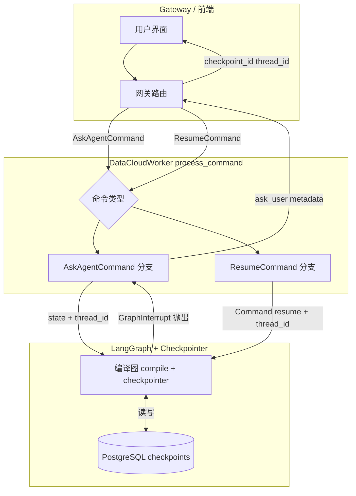
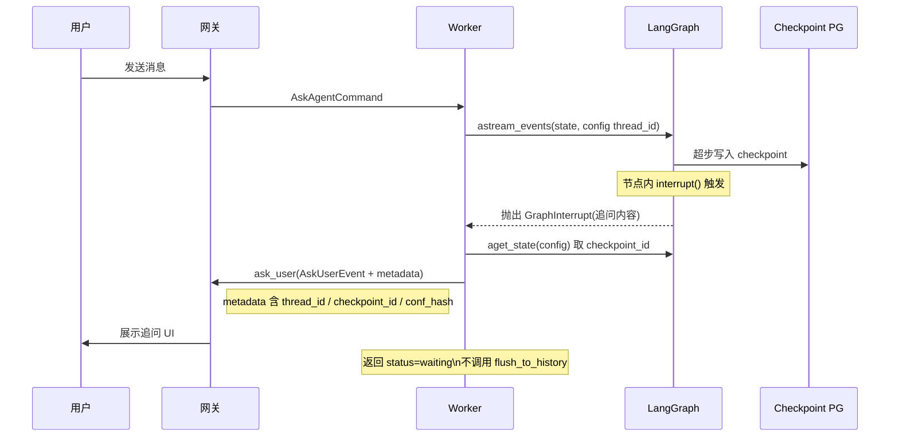
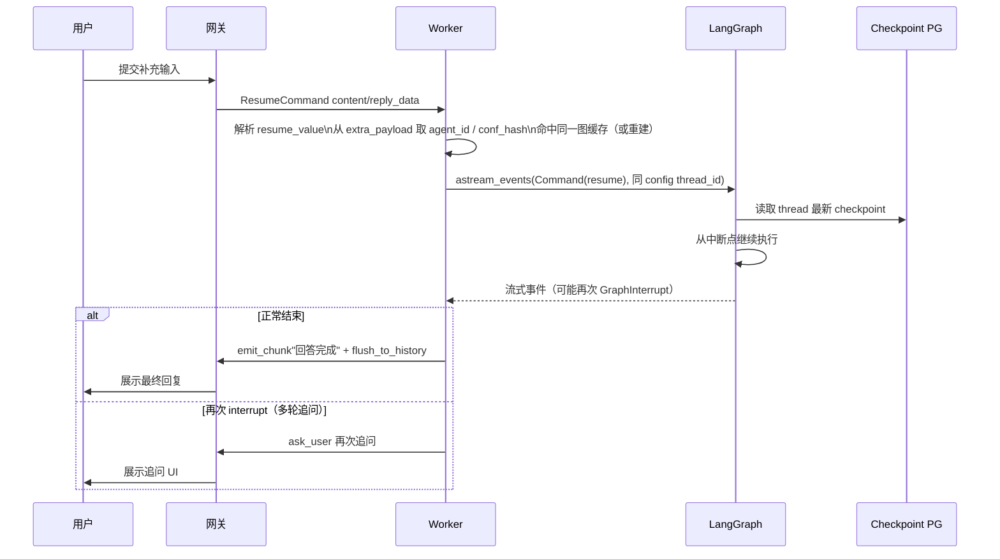
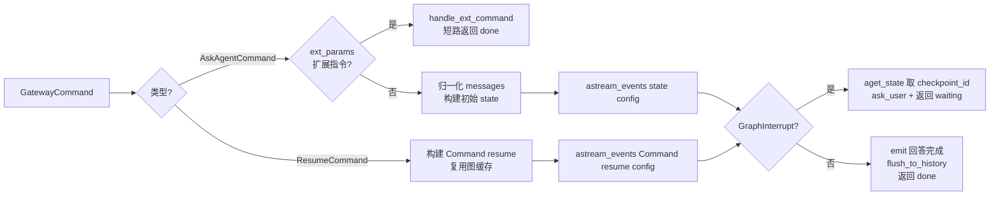

# LangGraph Checkpoint 与用户恢复方案（Gateway Worker）

## 1. 目标与约束

### 1.1 目标

- 在需要用户输入时，先通过 LangGraph **checkpoint** 固化当前可恢复状态，再通过 `AgentContext.ask_user` 将 **`checkpoint_id`、`thread_id` 等** 下发给网关/前端，便于后续精确恢复。
- Gateway Worker 侧区分两类命令：**正常对话** `AskAgentCommand` 与 **用户补充/恢复执行** `ResumeCommand`。

### 1.2 约束与现状对齐

- **`thread_id`**：与 LangGraph `configurable.thread_id` 一致；示例工程中通常取 `context.session_id`（见 `examples/e_commerce_demo/backend/datacloud_service/worker.py`）。
- **`ResumeCommand`**：由 by_framework 定义，字段包含 `content`、`status`、`reply_data`、`extra_payload` 等。
- **`AskUserEvent`**：通过 `metadata` 承载 `checkpoint_id`、`thread_id` 等业务字段（见 `by_framework.core.protocol.events`）。

### 1.3 当前代码的三处问题（已修复）

| # | 位置 | 问题 | 修复 |
|---|------|------|------|
| 1 | `create_agent()` | `.compile()` 未传入 checkpointer，PG 中不会产生可恢复的 checkpoint 行 | 改为 `compile(checkpointer=get_checkpointer())` |
| 2 | `_stream_graph` | `try/except GraphInterrupt` 永远不触发（root graph 内部捕获，不向外抛） | 改为流结束后 `aget_state()` + `snapshot.interrupts` 检查 |
| 3 | `AgentState.gateway_context` | `AgentContext` 对象进入 state 导致 PG checkpointer 序列化失败 | 移入 `config["configurable"]["gateway_context"]`，不经 checkpoint |

---

## 2. 前提：Worker 路径必须启用 Checkpointer

当前 `datacloud_analysis.agent.create_agent()` 内为 **`.compile()` 未传入 checkpointer**；`bootstrap.setup()` 仅保证 PG 表与 checkpointer 工厂就绪。**若 Worker 仍使用无 checkpointer 的编译图，PG 中不会产生可用于恢复的 checkpoint 行。**

**要求**：Worker 使用的图与 `datacloud_analysis.orchestration.runner.run_agent` 一致——在构图阶段 **`compile(checkpointer=get_checkpointer())`**，并与 bootstrap 使用同一套 `checkpoint_uri` / `checkpoint_schema`。

---

## 3. 推荐方案：Interrupt + Command(resume)

### 3.1 思路

采用 LangGraph 原生 **Human-in-the-loop** 语义：

1. 在需要澄清的节点（如 `term_clarification_node`）内调用 **`interrupt(追问内容)`**，LangGraph 在当前超步边界落盘 checkpoint，并向 Worker 抛出 `GraphInterrupt` 异常。
2. Worker 捕获 `GraphInterrupt`，调用 **`graph.aget_state(config)`** 取得 `checkpoint_id`，随后调用 **`await context.ask_user(AskUserEvent(prompt=..., metadata={...}))`** 将追问推送给用户，并返回 `"waiting"` 状态——**跳过 `flush_to_history` 和"回答完成"通知**。
3. 用户回复到达时，Worker 收到 **`ResumeCommand`**，使用 **`Command(resume=用户输入)`** 作为输入，**同一 `config`（含 `thread_id`）** 继续 `astream_events`，**不再**整包重建初始 `state`。

### 3.2 为何不推荐「仅靠节点中途 await ask_user、不 interrupt」

若在未结束节点中间 `await ask_user`，checkpoint 写入时机可能与「停在问句前」的语义不一致，且与 `astream_events` 生命周期容易冲突。**除非明确不接受 interrupt，否则优先 interrupt + Command(resume)。**

---

## 4. AskUserEvent.metadata 与网关约定（建议字段）

| 字段 | 含义 |
|------|------|
| `thread_id` | LangGraph `configurable.thread_id`（建议等于 `session_id`） |
| `checkpoint_id` | 当前可恢复快照标识 |
| `checkpoint_ns` | 使用子图/命名空间时必填，否则可省略 |
| `agent_id` + 配置指纹 | 与 Worker 内图缓存键逻辑一致，便于排障与多智能体区分 |

前端/网关可将上述字段**原样放入** `ResumeCommand.extra_payload` 便于排障；**真正恢复**仍以 **`thread_id` + `Command(resume=...)`** 为准。

### 4.1 用户回复载荷（需产品/接口拍板）

- **纯文本**：`Command(resume="用户输入")`
- **结构化**（选项 id、JSON）：`Command(resume={...})`，interrupt 处与图内解析类型须一致。

---

## 5. Worker：`process_command` 分流

### 5.1 AskAgentCommand

- 归一化 `content` → 初始图 `state`。
- `config.configurable.thread_id = context.session_id`。
- 按 `agent_id` + prompts/tools 指纹解析 **`cache_key`**，获取或构建带 checkpointer 的编译图。
- `ext_params` / `handle_ext_command` 短路逻辑在此路径执行（`ResumeCommand` 的 `extra_payload` 不含 `ext_params`，无需特殊处理）。
- 执行 **`astream_events(state, config)`**，捕获 `GraphInterrupt`：
  - **正常结束**（无 interrupt）→ emit"回答完成" + `flush_to_history` + 返回 `done`
  - **interrupt 发生** → 取 `checkpoint_id`，调 `ask_user`，返回 `waiting`，**不调用 `flush_to_history`**

伪代码：

```python
async for event in target_graph.astream_events(state, config=config, version="v2"):
    await context.check_cancelled()
    # ... 处理 on_tool_start / on_tool_end 等事件 ...

# GraphInterrupt 被 root graph 内部捕获，astream_events 不向外抛出。
# 正确做法：流结束后检查 snapshot.interrupts。
snapshot = await target_graph.aget_state(config)
if snapshot.interrupts:
    first = snapshot.interrupts[0]
    interrupt_value = first.value
    prompt = interrupt_value.get("prompt", str(interrupt_value)) if isinstance(interrupt_value, dict) else str(interrupt_value) or "请补充您的回答"
    checkpoint_id = snapshot.config.get("configurable", {}).get("checkpoint_id", "")
    checkpoint_ns = snapshot.config.get("configurable", {}).get("checkpoint_ns", "")
    await context.ask_user(AskUserEvent(
        prompt=prompt,
        metadata={
            "thread_id": config["configurable"]["thread_id"],
            "checkpoint_id": checkpoint_id,
            "checkpoint_ns": checkpoint_ns,
            "agent_id": by_agent_id,
            "conf_hash": conf_hash,
        },
    ))
    return {"status": "waiting"}   # 不走后续 flush

await context.emit_chunk(
    StreamChunkEvent(content="回答完成"),
    event_type=EventType.APP_STREAM_RESPONSE.value,
    content_type=SseMessageType.text.value,
)
await context.flush_to_history()
return {"status": "done"}
```

### 5.2 ResumeCommand

- 从 **`content` 或 `reply_data`**（团队内固定一种为主）解析 `resume_value`。
- 从 **`extra_payload`** 读取 `agent_id`、`conf_hash`，与 Ask 路径使用**同一套图缓存与动态配置**（若缓存已被 LRU 淘汰，按同一 `conf_hash` 重新 compile，checkpointer 在 PG 中仍可恢复）。
- **输入为 `Command(resume=resume_value)`**，禁止重建含空 `plan`/`results` 的冷启动 `state`。
- 事件循环与 Ask 路径**复用同一流式处理逻辑**，同样需捕获 `GraphInterrupt`（一次对话可能多轮追问）。

伪代码：

```python
from langgraph.types import Command

resume_value = command.reply_data or command.content   # or 确保空值 fallthrough
graph_input = Command(resume=resume_value)

async for event in target_graph.astream_events(graph_input, config=config, version="v2"):
    await context.check_cancelled()
    # ... 同 Ask 路径事件处理 ...

snapshot = await target_graph.aget_state(config)
if snapshot.interrupts:
    # 同 Ask 路径：取 checkpoint_id，再次 ask_user
    ...
    return {"status": "waiting"}

await context.emit_chunk("回答完成", ...)
await context.flush_to_history()
return {"status": "done"}
```

### 5.3 会话一致性

- `ResumeCommand.header.session_id` 应与挂起时一致；`message_id` 可变不影响恢复，只要 **`thread_id`（会话）不变**。
- 同一 `session_id` 上不重叠执行（与现有 cancel/锁策略对齐）。

---

## 6. 错误处理与边界

| 场景 | 处理 |
|------|------|
| **checkpoint 缺失 / thread 不匹配** | 打日志，向用户返回明确错误文案，避免静默当新会话重跑 |
| **图 LRU 淘汰** | 按 `agent_id` + `conf_hash` 重新 `compile(checkpointer=get_checkpointer())`，PG 中 checkpoint 仍在，resume 正常 |
| **ResumeCommand 但无 checkpoint** | 返回错误"会话已过期，请重新提问"，不降级为新会话 |
| **多轮追问** | 每次 `GraphInterrupt` 均重复"取 checkpoint_id → ask_user → 返回 waiting"；每次 Resume 均走 5.2 路径，直到图正常结束 |
| **并发** | 同一 `session_id` 上不重叠执行（与现有 cancel/锁策略对齐） |

---

## 7. 架构图（Mermaid）

### 7.1 总体组件与数据流



### 7.2 Ask 路径：Checkpoint 与挂起问用户



### 7.3 Resume 路径：Command(resume) 续跑



### 7.4 Worker 内分支（逻辑视图）



---

## 8. 文档修订记录

| 日期 | 说明 |
|------|------|
| 2026-03-28 | 初稿：checkpoint + ask_user 元数据、Ask/Resume 分流、Mermaid 架构图 |
| 2026-03-28 | 补充：GraphInterrupt 捕获机制、flush_to_history 时机约束、多轮追问处理、伪代码、错误边界表 |
