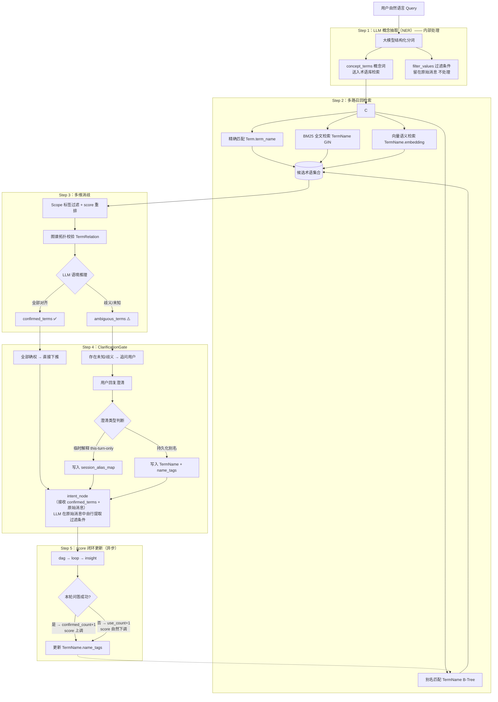

# 智能分析引擎 - 意图理解方案

## 1. 背景与业务痛点
在当前的对话式分析场景中，用户提问往往具有**口语化、非标准化、且常包含主观或未被系统严格定义的业务术语**的特点。现有系统的"知识加载->路由"阶段常常因为无法精准匹配业务知识而导致路由出错或查询失败。

具体痛点包括：
1. **口语化泛指无法对齐真实本体**：用户提问"有哪些企业"，但系统术语表中实际定义的本体名称为"企业大宽表"。如何平滑桥接这二者的差异？
2. **未知术语阻碍分析下推**：用户常常抛出诸如"高效能企业"、"经营效益最好"、"典型企业关键指标"等复合概念。大模型往往产生幻觉去瞎猜，或者因找不到确切字段而报错，而不是向用户确认标准的定义。

样例如下：

```
示例1：帮我看一下有哪些企业属于高效能企业，并展示其中一个典型企业关键的经营指标
-- 术语表有一个"企业大宽表"的术语，代表本体对象，但是如何根据上面问题找到这个术语？

示例2：如何让大模型识别出 高效能企业 是一个未知的术语，并且追问澄清。
-- 如何找出：典型企业关键的经营指标，并且追问澄清。

示例3：在亦庄内XX行业里面经营效益最好的企业是哪个
-- 术语表有一个"企业大宽表"的术语，如何根据问题识别到这个术语？
-- 如何让大模型识别出 经营效益最好 是一个未知术语，并且追问澄清。
```

---

## 2. 核心目标
1. **标准术语语义映射**：基于用户非标准问法，结合向量检索与语义相似度，精准锚定系统已有的本体对象、本体视图、本体动作或枚举值。
2. **未知概念/术语识别**：利用 LLM 的逻辑推理能力，主动识别出询问中属于"系统缺失定义"或"存在歧义"的业务概念。
3. **智能追问与澄清拦截**：在执行下游复杂路由与查询之前，主动截获未知术语并向用户发起多轮澄清，从而将"模糊业务语言"转化为"清晰数据语义"。
4. **个性化记忆闭环**：将用户对术语的解释持续积累为个人专属别名，通过 score 权重反哺检索排序，形成越用越准的正向循环。

---

## 3. 总体方案架构

### 3.0 在现有 Agent 流水线中的集成位置

当前 LangGraph 流水线为：`intent_node → dag_node → loop_node → insight_node`。

本方案在 `intent_node` **前置**一个独立的 `term_clarification_node`，专职处理术语理解与澄清，职责单一：**只做概念确权，不处理过滤条件**。过滤条件（时间、地域、阈值等）留在原始消息中，由下游 `intent_node` 的 LLM 自然处理。

```
用户输入（原始消息保留在 state["messages"]）
    │
    ▼
term_clarification_node          ← 本方案实现的新节点
    │  输出：confirmed_terms（已确权术语列表，含 term_id 与知识上下文）
    │        session_alias_map（会话临时别名映射，可选）
    │
    │  注：NER 内部区分了 concept_terms / filter_values，
    │      但 filter_values 不作为节点输出——原始消息已包含全部信息
    ▼
intent_node                      ← 已有节点，基于 confirmed_terms 上下文改写意图
    │                               同时从原始消息中提取过滤条件（LLM 自然处理）
    ▼
dag_node → loop_node → insight_node
```

`term_clarification_node` 内部执行以下五步处理流程。

---

### 3.1 五步处理流程总览



> **节点输出约定**：`term_clarification_node` 对外只输出两个 state key：
> - `confirmed_terms`：已确权的术语列表（含 term_id、term_name、知识上下文摘要）
> - `session_alias_map`：本会话临时别名映射（用户澄清后仅本轮生效的解释）
>
> `filter_values` 是 Step 1 内部的中间变量，**不写入 state**。`intent_node` 从原始 `messages` 中自行提取过滤条件。

---

### 3.2 Step 1：LLM 概念抽取（NER）

#### 技术选型

采用**大模型 Structured Output** 做 NER，不使用 jieba 等传统分词工具。原因：传统分词会把"高效能企业"切成"高效/能/企业"，导致关键黑话丢失；大模型能识别完整的口语复合词。`TermVocabulary` 词典继续用于 BM25 切词召回，但不参与 NER 阶段。

#### 内部分类（关键设计）

NER 阶段在内部将提取词分为两类，目的是**控制哪些词进入术语库检索**，这两类结果均不作为节点的对外输出：

| 类别 | 含义 | 内部处理 |
|------|------|---------|
| `concept_terms` | 需要在术语库中查找定义的业务概念词 | 进入 Step 2 多路召回 |
| `filter_values` | 时间、地域、阈值等过滤条件 | 丢弃——原始消息已含此信息，交给下游 LLM 处理 |

`filter_values` 不写入 state，也不透传。`intent_node` 直接从 `state["messages"]`（原始对话）中提取过滤条件，LLM 天然能完成这件事，无需预处理。

**Prompt 核心指令（关键约束）**：

```
你是一个业务术语 NER 提取器。从用户问题中识别需要在术语库查找定义的业务概念词。

concept_terms：业务对象/指标/规则/复合概念——即使是未知黑话也要提取。
  - 包括：实体名称、业务指标名、主观评价词（高效能企业、经营效益最好）
  - 不包括：地区名、时间范围、排名阈值、行业分类等过滤条件

返回严格 JSON：
{"concept_terms": [...]}
```

**示例**：

```
用户问题："在亦庄内XX行业里面经营效益最好的企业是哪个"

输出：
{"concept_terms": ["亦庄","企业", "经营效益"]}

// "亦庄"(区域)、"XX行业"（XXX）、企业（企业大宽表）
```

---

### 3.3 Step 2：多路召回检索（三级漏斗）

对 `concept_terms` 中每个词，并行执行以下三级召回，按置信度从高到低构成漏斗：

#### 第一级：精确匹配（置信度 100%）

- **匹配源**：`Term.term_name`（B-Tree 精确比对）+ `TermName.name_text`（B-Tree 精确比对）
- **触发场景**：用户直接说出标准名称或已注册别名（包括个人专属别名）
- **命中即确权**：精确匹配无需进入消歧流程，直接进入 `confirmed_terms`

#### 第二级：BM25 全文检索（置信度中高）

- **匹配源**：`TermName.name_text` 的 GIN 全文索引（`to_tsvector('simple', name_text)`）
- **触发场景**：用户词语与别名有重叠关键字但不完全相同（如"企业宽表" vs "企业大宽表"）
- **返回**：Top-K 候选，携带 BM25 得分

#### 第三级：向量语义检索（置信度兜底）

- **匹配源**：`TermName.embedding VECTOR(1024)` 的向量余弦相似度（IVFFlat/HNSW 索引）
- **触发场景**：口语化表达与任何别名字面量都不重合（如"做买卖的店" → "企业大宽表"）
- **返回**：Top-K 候选，携带余弦相似度分

#### 个人专属别名的优先召回

查询时对 `name_tags` 中含当前用户 `scope_user_id` 的记录给予额外加权（见 Step 5），确保用户自定义别名优先于全局通用别名排在候选前列。

---

### 3.4 Step 3：多维消歧（五层漏斗）

候选集合可能包含多个竞争术语，按以下顺序逐层降噪：

#### 层 1：Scope 标签过滤

依据 `term_tags`（术语作用域）和 `name_tags`（别名作用域），切掉与当前用户/组织无关的私有术语。

SQL 示例：
```sql
-- 仅保留：全局术语 OR 当前用户的专属术语
WHERE (tn.name_tags->>'scope_user_id' IS NULL)
   OR (tn.name_tags->>'scope_user_id' = :current_user_id)
```

#### 层 2：score 加权重排

结合召回渠道的基础置信度和个人专属 score，计算综合得分后取 Top-K：

```
综合得分 = 渠道基础分 × (1 + 0.5 × name_tags.score)

渠道基础分：精确匹配=1.0，别名匹配=0.95，BM25=动态得分，向量=余弦相似度
```

`name_tags.score` 为 0~1 之间的个人使用习惯权重（见 Step 5）。全局别名无此字段，score 默认为 0。

#### 层 3：图谱拓扑校验

如果同一轮问题中存在**无歧义的锚定术语 A** 和**有歧义的候选术语 B**，以 A 为起点在 `TermRelation` 中 BFS 游走，查找与 B 的拓扑距离，优先保留在同一拓扑连通域内的候选。

示例：
- A（无歧义）= "离职审批"（ACTION）
- B（歧义）= "销售"，同时命中"销售部门(ORG)"/"销售角色(ROLE)"/"销售报表(VIEW)"
- `离职审批` 在图谱中仅与 `员工角色` 相连
- → "销售角色(ROLE)" 权重拉满，"销售报表(VIEW)" 被淘汰

#### 层 4：LLM 语境推理

将经过前三层裁剪后剩余的候选项（通常 ≤3 个/词）和用户原始问题一起送入 LLM，做最终语境级判定。Prompt 要求 LLM 返回结构化结果：

```json
{
  "confirmed": [
    {"user_word": "企业", "term_id": "TERM_001", "term_name": "企业大宽表"}
  ],
  "ambiguous": [
    {"user_word": "高效能企业", "reason": "系统无此定义，属于主观判断词，需要用户澄清阈值条件"}
  ]
}
```

#### 层 5：断路追问

若存在 `ambiguous` 词，进入 Step 4 的 ClarificationGate；否则所有词进入 `confirmed_terms`，直接下推。

---

### 3.5 Step 4：ClarificationGate 拦截追问

#### 追问的两类触发场景

| 场景 | 描述 | 追问策略 |
|------|------|---------|
| **多义竞争** | 候选集中有 2~3 个术语语境同等合理 | 提供选项让用户选择（如"您说的'销售'是指销售报表还是销售角色？"） |
| **完全未知** | 用户词语在术语库中无任何候选命中，且含有主观判断 | 引导用户给出量化定义（如"高效能企业是指满足什么条件？"） |

#### 澄清后的两种存储路径（关键区分）

用户回复澄清后，系统需要判断这是**本次临时解释**还是**长期别名**：

**判断规则**：若用户回复中含有明确的一次性语气词（"这次"、"暂时"、"就按这个查一下"等），则视为临时语义；否则默认持久化。

| 澄清类型 | 存储位置 | 生命周期 | 示例 |
|---------|---------|---------|------|
| **临时解释** | `state["session_alias_map"]` | 仅限当前会话 | "这次高效能企业我就看利润>500万的" |
| **持久化别名** | `TermName` 表 + `name_tags` | 跨会话永久生效 | "经营效益=净利润率，以后都这么理解" |
| **新子概念** | 新建 `Term`（`parent_term_id` 指向原概念）+ `term_tags` | 跨会话永久生效 | 用户 A 的"高效能企业"定义与用户 B 完全不同，需独立建模 |

**持久化别名写入逻辑**：
- 若用户的解释仅是已有术语的另一种叫法（如"企业=公司"）→ 新建一条 `TermName`，`name_tags` 打上 `scope_user_id`，初始 `score=1.0`
- 若用户定义了带有独特计算规则的子概念（如"高效能企业=利润率>20%且员工>100人"）→ 在 `Term` 表新建子术语（`parent_term_id` 指向"企业大宽表"），在 `TermKnowledge` 中挂载规则描述

---

### 3.6 Step 5：个性化 score 闭环

这是本方案形成"越用越准"的核心机制，也是与普通 RAG 召回的关键差异。

#### name_tags.score 数据结构

`TermName.name_tags` 中与用户个人相关的 score 标签结构如下：

```json
{
  "scope_user_id": "user_123",
  "score": 0.85,
  "use_count": 17,
  "confirmed_count": 14,
  "last_used_at": "2026-03-28T10:00:00Z"
}
```

| 字段 | 类型 | 说明 |
|------|------|------|
| `scope_user_id` | string | 用户 ID，检索时过滤作用域 |
| `score` | float [0,1] | 当前排序权重，由 use_count/confirmed_count 推导 |
| `use_count` | int | 该别名被召回并送入消歧的总次数 |
| `confirmed_count` | int | 消歧后被 LLM 确认（而非被淘汰）的次数 |
| `last_used_at` | ISO 8601 | 最近一次被使用的时间戳 |

`score` 的计算公式：

```
score = confirmed_count / (use_count + 1)   # 基础：确认率
      × decay_factor                          # 衰减：长期不用则降权

decay_factor = 1.0 （距今 ≤ 30 天）
             = 0.8 （距今 31~90 天）
             = 0.5 （距今 > 90 天）
```

#### score 更新的三个触发点

| 触发事件 | 操作 |
|---------|------|
| **用户澄清后持久化别名（首次写入）** | 新建 `TermName`，初始 `score=1.0, use_count=1, confirmed_count=1` |
| **别名在多路召回中被命中，且通过 LLM 消歧确认** | `use_count+1, confirmed_count+1`，重新计算 score，更新 `last_used_at` |
| **别名被召回但被 LLM 消歧淘汰（指向了错误术语）** | `use_count+1`（confirmed_count 不变），score 自然下调，提示系统该别名可信度正在降低 |

更新由 `term_clarification_node` 在每轮对话结束时异步写库，不阻塞主流程。

#### 闭环效果示意

```
第1次：用户说"公司" → 向量检索召回"企业大宽表"，score=0（首次，无个人记录）
  → 消歧确认 → 写入 TermName{name_text="公司", scope_user_id="u1", score=1.0, use_count=1}

第5次：用户说"公司" → 个人别名精确匹配命中，score=1.0（最高优先级）
  → 无需消歧，直接确权 "企业大宽表"

第20次："公司"成功率稳定在 0.9+ → 系统对该用户的"公司=企业大宽表"映射完全自动化
```

---

## 4. 术语库建模的边界与克制原则（防过度设计）

针对用户长达百字的复杂复合句，系统**绝不应该、也无需为句子中的所有词语铺设海量术语去硬抗匹配**。我们将数据编排与常识转化（如 Text-to-SQL / Code 解析）下放给大模型强大的泛化脑力，而术语知识库仅起到私有数据上下文的**"锚定（Anchoring）与定调"**作用。

### 1. 绝对【不应建模】的范围（让渡给大模型自由发挥）

* **临时复杂的过滤与筛选切块**："北京和上海地区的"、"去年的"、"销售额大于500万排名前十的"。大模型天生知道该将其翻译为 `WHERE region IN (...) AND sales > 5000000 ORDER BY sales DESC LIMIT 10` 等逻辑关系，强行建词既愚蠢又会导致系统死板臃肿。
* **常识性的聚合与显示意图**："对比一下"、"画个柱状图"、"看看占比"。大模型依靠自有的底层世界知识配合系统外挂的图表工具 Tool 就能轻松实现，不需要作为 `Term` 术语流转。

### 2. 坚决【必须建模/捕获】的范围（填补大模型在企业私有域内的盲区）

即使面对极其复杂的超长询问，我们的网筛漏斗往往也只会锁定剥离出 2~3 个必须严格核实的核心领域黑盒：

* **核心本体词与元数据的映射底座（OBJ/VIEW/ACTION）**：大模型必须确切知道，"企业"这个名词对应到当前数据库环境里的真实物理表名是不是叫 `ads_enterprise_wide`。这种物理映射的桥梁必须老老实实地建档在全局 `Term` 主表中。
* **偏离常识的公司独占指标与口径（METRIC/FORMULA/RULE）**：例如当公司财务明文规定"内部净营收必须再扣除 A 类和 C 类渠道折让"时，大模型直接靠公认常识生成的 `SUM(收入)-SUM(退款)` 就必定是错的。这类非标公式必须沉淀到对应的 `TermKnowledge` 中供大模型必须参考。
* **含混不清定性的业务黑话或主观标签（主观歧义拦截区）**：诸如"典型的"、"高效能企业"、"高危大客户"、"黄金地段"。因为这些词的阀值（是利润>20%还是营收>5亿算高效能？）大模型一瞎猜必然引发致命的业务数据幻觉。这就是 **ClarificationGate** 最核心的拦截目标。不认识就强制拦截追问，一旦澄清完毕，顺手通过 `term_tags` 或新建子术语为用户固化成属于他自己的新概念分身。

---

## 5. 典型示例场景推演验证

### 场景一：多概念混合（有已知术语 + 多个未知术语）

> **用户提问**："帮我看一下有哪些企业属于高效能企业，并展示其中一个典型企业关键的经营指标"

**Step 1 NER 输出**：
```json
{
  "concept_terms": ["企业", "高效能企业", "典型企业", "关键经营指标"],
  "filter_values": []
}
```

**Step 2 召回结果**：
- "企业" → 精确匹配 `企业大宽表`（置信度 100%）
- "高效能企业" → 无任何命中
- "典型企业" → 无任何命中
- "关键经营指标" → 向量召回若干指标类术语，但无精确定义

**Step 3 消歧后**：
- `confirmed`: 企业 → 企业大宽表
- `ambiguous`: 高效能企业（无定义）、典型企业（无定义）、关键经营指标（歧义：多个指标术语竞争）

**Step 4 ClarificationGate 追问**：
> 状态：`NEEDS_CLARIFICATION`
>
> "我已锁定【企业大宽表】作为查询对象。但还有几个概念需要您来定义：
> 1. **「高效能企业」**是指满足什么条件的企业？（例如：人效大于X，或近三年营收复合增长>Y%？）
> 2. **「典型企业」**是否有特定规模或行业要求？
> 3. **「关键经营指标」**您希望看哪些维度？（总营收、净利润、研发费用？可直接指定或由我推荐常用组合）"

**用户回复**："高效能就是利润率>20%，典型就是利润率最高那个，指标要营收和净利润"

**Step 4 存储决策**：
- "高效能企业=利润率>20%" → 含主观阈值定义，新建子 `Term`（parent=企业大宽表），写入 `TermKnowledge`
- "典型=利润率排名第一" → 临时解释（排序逻辑），存入 `session_alias_map`，不持久化
- "营收和净利润" → 匹配已有指标术语，无需新建

---

### 场景二：过滤条件 + 未知主观词（NER 分类的典型示例）

> **用户提问**："在亦庄内XX行业里面经营效益最好的企业是哪个"

**Step 1 NER 输出**：
```json
{
  "concept_terms": ["企业", "经营效益"],
  "filter_values": ["亦庄", "XX行业", "最好（排名第一）"]
}
```

"亦庄"和"XX行业"不进入术语检索，直接作为过滤条件透传。

**Step 2 召回结果**：
- "企业" → 精确匹配 `企业大宽表`
- "经营效益" → BM25 召回若干候选（利润率、ROA、营收增长率），无唯一确定项

**Step 3 消歧后**：
- `confirmed`: 企业 → 企业大宽表
- `ambiguous`: 经营效益（存在多个指标候选且含主观排序逻辑）

**Step 4 追问**：
> "亦庄内XX行业的企业范围我已锁定。但关于「经营效益最好」，您希望以哪项指标排序？
> （年度净利润最高？营收增长率最高？资产回报率最高？请选择或自行描述）"

**Step 5 闭环**：
- 若用户回答"就是净利润"，且未使用临时语气词 → 写入 `TermName`：`{name_text="经营效益", term_id=净利润术语ID, scope_user_id="u1", score=1.0}`
- 下次该用户说"经营效益"时，将直接精确匹配到"净利润"，无需再追问

---

### 场景三：score 闭环积累（跨会话效果）

> 用户 u1 历史对话中已多次确认"公司=企业大宽表"

此时 `TermName` 中存在一条个人专属记录：
```json
{
  "name_text": "公司",
  "term_id": "TERM_企业大宽表",
  "name_tags": {
    "scope_user_id": "u1",
    "score": 0.93,
    "use_count": 28,
    "confirmed_count": 26,
    "last_used_at": "2026-03-28T09:30:00Z"
  }
}
```

**新对话："列出利润最高的10家公司"**

- Step 1 NER：`concept_terms=["公司", "利润"]`，`filter_values=["前10"]`
- Step 2 召回："公司" → 个人专属精确匹配命中，综合得分 = 0.95 × (1 + 0.5×0.93) = **1.39**，远超全局通用别名
- Step 3：直接确权，无需消歧，无需追问
- 结果：`use_count→29, confirmed_count→27`，score 微调

---

## 6. 总结与落地实施步骤

### 6.1 数据模型变更

1. **`TermName` 表**（已在知识服务模块设计中更新）：
   - 新增 `embedding VECTOR(1024)` — 用于向量语义召回
   - 新增 `name_tags JSONB DEFAULT '{}'` — 用于 scope 隔离与 score 权重
   - 新建 GIN 索引 `idx_tn_name_fts`（全文检索）
   - 新建 GIN 索引 `idx_tn_tags`（标签过滤）

2. **Embedding 同步**：`TermName` 新增/修改时，异步调用 Embedding 模型（BGE-M3 或 Qwen-Embedding）将 `name_text` 向量化写入 `embedding` 字段。

### 6.2 新增 LangGraph 节点

在现有流水线 `intent_node` 前插入 `term_clarification_node`，职责单一：**只做概念确权**。

- 输入：`state["messages"]`（原始用户消息）
- 输出：
  - `state["confirmed_terms"]` — 已确权的术语列表（含 term_id、term_name、知识上下文摘要）
  - `state["session_alias_map"]` — 本会话临时别名映射（可选，用户澄清后仅本轮生效）
- **不输出** `filter_values`、`filter_context` 等过滤相关 state key
- 追问时：向 Gateway 发出 `ClarificationEvent` SSE，挂起等待用户回复
- 下游 `intent_node` 同时消费 `confirmed_terms`（术语上下文）和原始 `messages`（含过滤条件），LLM 从原始消息中自行提取过滤逻辑

### 6.3 score 异步更新

每轮对话结束（`insight_node` 完成后），异步执行一次 score 更新：

```python
for alias_record in session.used_aliases:
    if alias_record.was_confirmed:
        update_name_tags_score(
            name_id=alias_record.name_id,
            user_id=session.user_id,
            confirmed=True
        )
    else:
        update_name_tags_score(
            name_id=alias_record.name_id,
            user_id=session.user_id,
            confirmed=False
        )
```

更新逻辑不阻塞当前响应，通过后台任务队列异步执行。

### 6.4 实施优先级

| 优先级 | 任务 | 依赖 |
|--------|------|------|
| P0 | TermName 表结构变更（embedding + name_tags） | — |
| P0 | Embedding 同步服务 | TermName 变更 |
| P1 | term_clarification_node 实现（Step 1~4） | TermName 变更 |
| P1 | LLM NER Prompt（concept_terms/filter_values 分类） | — |
| P2 | score 重排逻辑接入召回 | term_clarification_node |
| P2 | score 异步更新服务 | term_clarification_node |
| P3 | 持久化别名写回（Step 4 → TermName） | score 更新服务 |
