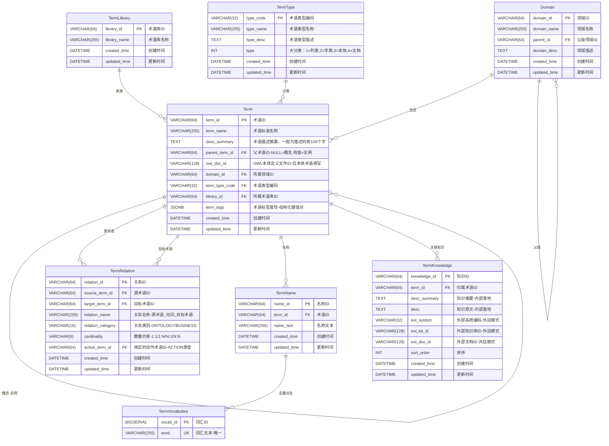
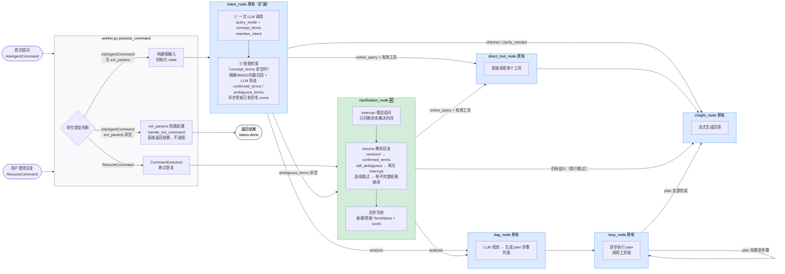

# 意图理解方案

## 1. 业务背景
在当前的对话式分析场景中，用户提问往往具有**口语化、非标准化、且常包含主观或未被系统严格定义的业务术语**的特点。现有系统的"知识加载->路由"阶段常常因为无法精准匹配业务知识而导致路由出错或查询失败。

样例如下：

```
示例1：帮我看一下有哪些企业属于高效能企业，并展示其中一个典型企业关键的经营指标
-- 术语表有一个"企业大宽表"的术语，代表本体对象，但是如何根据上面问题找到这个术语？

示例2：如何让大模型识别出 高效能企业 是一个未知的术语，并且追问澄清。
-- 如何找出：典型企业关键的经营指标，并且追问澄清。

示例3：在亦庄内XX行业里面经营效益最好的企业是哪个
-- 术语表有一个"企业大宽表"的术语，如何根据问题识别到这个术语？
-- 如何让大模型识别出 经营效益最好 是一个未知术语，并且追问澄清。
```

---

## 2.系统现状

### 2.1 库表设计



### 2.2 库表变动

termName表添加以下字段：

```
name_text_tsv tsvector, — 用于bm25召回,单字索引
name_vector   vector(1024), — 用于向量语义召回
name_tags     JSONB       NOT NULL DEFAULT '{}'::jsonb, -— 用于记录改名称被哪些用户，哪些组织拥有，数据样例 {"userid_200234": "200234"}
```


### 2.3 术语关系

#### 2.3.1本体术语类型

```
1.term_type.type_code=ONTOLOGY_VIEW and term_type.type_name=视图
2.term_type.type_code=ONTOLOGY_OBJ and term_type.type_name=对象
3.term_type.type_code=ONTOLOGY_ACTION and term_type.type_name=动作
4.term_type.type_code=ONTOLOGY_FUNC and term_type.type_name=函数
5.term_type.type_code=ONTOLOGY_PARAM and term_type.type_name=参数
6.term_type.type_code=ONTOLOGY_PROP and term_type.type_name=属性
```

#### 2.3.2 本体术语关系

```
1 关系类型:
1)视图拥有对象.
2)对象拥有属性.
3)对象关联对象.
4)对象拥有动作.
5)列表术语关联属性.

2.关系如下:
source_term_id=源术语ID
target_term_id=目标术语ID
relation_name=关系名称，样例：企业_归属_产业链
relation_category=ONTOLOGY/BUSINESS，默认 BUSINESS
cardinality=数量约束：1:1 | 1:N | N:1 | N:N
action_term_id=绑定的动作术语ID
```


## 3.概要设计

### 3.1设计目标

1. *标准术语语义映射**：基于用户非标准问法，结合向量检索与语义相似度，精准锚定系统已有的本体对象、本体视图、本体动作或枚举值。
2. **未知概念/术语识别**：利用 LLM 的逻辑推理能力，主动识别出询问中属于"系统缺失定义"或"存在歧义"的业务概念。
3. **智能追问与澄清拦截**：在执行下游复杂路由与查询之前，主动截获未知术语并向用户发起多轮澄清，从而将"模糊业务语言"转化为"清晰数据语义"。
4. **个性化记忆闭环**：将用户对术语的解释持续积累为个人专属别名，通过 score 权重反哺检索排序，形成越用越准的正向循环。

### 3.2 架构设计

#### 3.2.1 整体时序图

说明：
- `intent_node` 内部一次 LLM 调用同时完成 NER 抽词 + 意图分析，输出 `concept_terms` 和 `query_mode`。
- 仅当 `concept_terms` 非空时才触发术语库检索（精确/BM25/向量）+ LLM 消歧，chitchat 和术语清晰的问题完全跳过检索。
- `clarification_node` 仅在有 `ambiguous_terms` 时进入，支持多轮 interrupt/resume，每轮只追问剩余未解决的词。

```mermaid
sequenceDiagram
    autonumber
    actor User as 用户
    participant W as worker.py
    participant INT as intent_node
    participant CLR as clarification_node
    participant DT as direct_tool_node
    participant DAG as dag_node
    participant LOOP as loop_node
    participant INS as insight_node
    participant DB as TermName / session_alias_map

    User->>W: 发送自然语言问题 AskAgentCommand
    W->>INT: graph.astream(input, config)
    Note over INT: 一次 LLM 调用
    INT->>INT: query_mode / concept_terms / rewritten_intent

    opt concept_terms 非空
        INT->>DB: 精确/BM25/向量召回
        DB-->>INT: 候选术语集合
        INT->>INT: LLM 消歧 confirmed_terms / ambiguous_terms
    end

    alt chitchat 或 clarify_needed
        INT->>INS: 直接回复
    else ambiguous_terms 非空
        INT->>CLR: 路由到 clarification_node
        CLR->>W: interrupt 图挂起
        W->>User: 推送追问 SSE
        User->>W: 回复澄清 ResumeCommand
        W->>CLR: Command(resume) 断点恢复
        CLR->>CLR: LLM 解析 resolved / still_ambiguous
        CLR->>DB: 写入 session_alias_map 或 confirmed_terms
        alt still_ambiguous 非空
            CLR->>W: 再次 interrupt 追问剩余词
            W->>User: 下一轮追问
        else 用户跳过
            CLR->>INS: 带不完整结果继续
        else 全部解决
            CLR->>INT: 澄清完成继续路由
        end
    else online_query
        INT->>DT: 直接调用工具
        DT->>INS: tool result
    else analysis
        INT->>DAG: 规划生成 plan
        DAG ->> LOOP: plan
        LOOP->>LOOP: 执行步骤调用工具
        Note over LOOP: 循环直到 plan 全部完成
        LOOP->>INS: results
    end

    INS->>User: 流式输出最终回答 SSE
    INS->>W: 向自身发 AskAgentCommand 术语反馈
    W->>DB: 异步更新 TermName.name_tags score
```


#### 3.2.2 节点职责一览



> 绿色边框：本次新增节点；蓝色边框：原有节点（intent_node 内部逻辑扩展）；灰色边框：消息入口/分发层


#### 3.2.3 各路径开销对比

| 场景 | LLM 调用次数 | 检索 | interrupt |
|------|------------|------|-----------|
| chitchat / 闲聊 | 1 | 无 | 无 |
| 普通查询（concept_terms 为空） | 1 | 无 | 无 |
| 普通查询（精确命中，无歧义） | 2（意图+消歧） | 精确匹配 | 无 |
| 含歧义术语（需澄清） | 2+（意图+消歧+澄清解析） | 精确+BM25+向量 | 1次+ |


---

## 4. 详细设计

### 4.1 intent_node

#### 4.1.1职责

`intent_node` 是图的第一个节点，一次 LLM 调用同时完成三件事：

1. **意图分析**：判断 `query_mode`（chitchat / online_query / analysis）、`clarify_needed`、`target_tool`、`tool_params`
2. **NER 抽词**：从用户问题中提取需要在术语库查找定义的业务概念词 `concept_terms`
3. **术语检索**：仅当 `concept_terms` 非空时，并行执行精确/BM25/向量召回，再经 LLM 消歧，输出 `confirmed_terms` / `ambiguous_terms`

#### 4.1.2 LLM 提示词

1.采用三层消息结构，最大化 KV-Cache 命中率：

| 层 | 类型 | 内容 | 变化频率 |
|----|------|------|---------|
| Layer 0 | SystemMessage | 静态 system prompt（意图规则 + NER 规则 + 返回格式） | 不变，100% 缓存 |
| Layer 1 | HumanMessage × N | Gateway 最近 N 条会话历史（去重当前轮） | 低频变化 |
| Layer 3 | HumanMessage | 当前轮动态内容：可用工具列表 + 知识检索结果 + 用户问题 | 每轮变化 |

2. System Prompt 返回格式（扩展 NER 字段）

```json
{
  "rewritten_intent": "改写后的清晰问题",
  "clarify_needed": false,
  "query_mode": "online_query | analysis | chitchat",
  "target_tool": "工具名或空字符串",
  "tool_params": {},
  "concept_terms": ["需要在术语库查找的业务概念词列表，无则为空数组"]
}
```

`concept_terms` 规则：
- 包括：业务对象名、指标名、主观评价词（高效能企业、经营效益最好）
- 不包括：地区名、时间范围、排名阈值、行业分类等过滤条件
- `query_mode = chitchat` 时必须返回空数组

#### 4.1.3 术语检索

##### 并行检索策略（方案A）

`concept_terms` 中的所有词**并发执行**，用 `asyncio.gather` 同时发起，总耗时 = 单个词的最长耗时，而非各词耗时之和。

```
concept_terms = ["企业", "高效能企业", "经营效益"]
         ↓ asyncio.gather 并发
词1: 企业      → 精确命中唯一 → 直接确权
词2: 高效能企业 → 四步漏斗全无结果 → 空候选
词3: 经营效益  → BM25 召回多个候选
         ↓ 汇总
all_candidates = [[词1结果], [], [词3结果]]
```

向量检索（第四步）需要调用 embedding API，是最高开销步骤。触发条件：前三步均无结果。多个词同时触发向量检索时，embedding 调用也并发执行。

##### 精确命中的唯一性判断

精确匹配（第一步、第二步）可能命中多个术语，例如"销售"在不同领域下存在"销售部门"和"销售报表"两个同名术语。**命中数量决定后续处理方式，不能一律直接确权**：

| 精确命中数量 | 处理方式 |
|------------|---------|
| 0 个 | 继续执行下一步（BM25 / 向量） |
| 1 个 | 直接确权，进入 `confirmed_terms`，不再执行后续步骤 |
| 2+ 个 | 存在同名歧义，将所有命中项作为候选带入消歧流程（4.1.4），不直接确权 |

##### 检索输入

每个词独立检索，携带以下上下文：

| 参数 | 来源 | 用途 |
|------|------|------|
| `word` | concept_terms 中的单个词 | 检索关键词 |
| `user_id` | `gateway_context.user_id` | 个人专属别名过滤与排序 |
| `schema` | 环境变量 `DATACLOUD_PG_CHECKPOINT_SCHEMA` | 表前缀 |
| `top_k` | 固定值 5 | 每步最多返回候选数 |

##### 四步漏斗

每步执行后判断候选数量，决定是否继续：

---

**第一步：精确匹配 term_name（置信度 1.0）**

直接比对 `Term.term_name`。命中唯一则直接确权；命中多个则带入消歧；命中 0 个则继续第二步。

```sql
SELECT t.term_id,
       t.term_name,
       t.term_type_code,
       1.0::float    AS score,
       'exact'       AS match_type,
       t.term_name   AS name_text
FROM {schema}.term t
WHERE t.term_name = :word
LIMIT :top_k;
```

---

**第二步：别名精确匹配（置信度 0.95）**

在 `TermName` 中查找完全匹配的别名，个人专属别名优先排序。同样适用唯一性判断：命中唯一直接确权，命中多个带入消歧，命中 0 个继续第三步。

```sql
SELECT t.term_id,
       t.term_name,
       t.term_type_code,
       0.95::float   AS score,
       'alias'       AS match_type,
       tn.name_text
FROM {schema}.term_name tn
JOIN {schema}.term t ON t.term_id = tn.term_id
WHERE tn.name_text = :word
  AND (
    tn.name_tags->>'scope_user_id' IS NULL           -- 全局别名
    OR tn.name_tags->>'scope_user_id' = :user_id     -- 个人专属别名
  )
ORDER BY
  CASE WHEN tn.name_tags->>'scope_user_id' = :user_id THEN 0 ELSE 1 END,
  COALESCE((tn.name_tags->:user_id->>'score')::float, 0) DESC
LIMIT :top_k;
```

---

**第三步：BM25 全文检索**

适用场景：用户词与别名有关键字重叠但不完全相同，例如"企业宽表" vs "企业大宽表"。
不适用场景：用户词与别名字面量完全无重叠（如"做买卖的店"），此时 BM25 无法召回，需第四步兜底。

```sql
SELECT t.term_id,
       t.term_name,
       t.term_type_code,
       ts_rank(tn.name_text_tsv,
               plainto_tsquery('simple', :word))::float AS score,
       'bm25'        AS match_type,
       tn.name_text
FROM {schema}.term_name tn
JOIN {schema}.term t ON t.term_id = tn.term_id
WHERE tn.name_text_tsv @@ plainto_tsquery('simple', :word)
ORDER BY score DESC
LIMIT :top_k;
```

---

**第四步：向量语义检索（仅在前三步均无结果时触发）**

先对 `word` 调用 embedding API 生成向量，再做余弦相似度检索。
适用场景：口语化表达与任何别名字面量都不重合，例如"做买卖的店" → "企业大宽表"。

```sql
SELECT t.term_id,
       t.term_name,
       t.term_type_code,
       (1 - (tn.name_vector <=> :query_vec::vector))::float AS score,
       'vector'      AS match_type,
       tn.name_text
FROM {schema}.term_name tn
JOIN {schema}.term t ON t.term_id = tn.term_id
WHERE tn.name_vector IS NOT NULL
ORDER BY tn.name_vector <=> :query_vec::vector
LIMIT :top_k;
```

##### 检索结果数据结构

每个候选项：

```json
{
  "term_id": "TERM_001",
  "term_name": "企业大宽表",
  "term_type_code": "ONTOLOGY_OBJ",
  "score": 0.95,
  "match_type": "alias",
  "name_text": "企业"
}
```

| 字段 | 说明 |
|------|------|
| `term_id` | 术语唯一 ID |
| `term_name` | 术语标准名称 |
| `term_type_code` | 术语类型（ONTOLOGY_VIEW / ONTOLOGY_OBJ / ONTOLOGY_ACTION / ONTOLOGY_PROP 等） |
| `score` | 置信度（精确=1.0，别名=0.95，BM25/向量=动态得分） |
| `match_type` | 召回渠道（exact / alias / bm25 / vector） |
| `name_text` | 命中的别名文本 |

每个词最多取 Top-5 候选，送入消歧时截取 Top-3。

##### 是否查询术语关系

**当前阶段不主动查询 `TermRelation`**，原因：精确命中无需关系辅助，消歧阶段 Top-3 候选已足够 LLM 判断。

术语关系（§2.3：视图拥有对象、对象拥有属性、对象关联对象、对象拥有动作）作为**可选消歧增强层**，仅在同一问题中存在无歧义锚定术语时才触发 BFS 游走（见 4.1.4 层 2）。

##### 包职责划分

两个包的职责边界如下：

| 包 | 职责 | 原则 |
|----|------|------|
| `datacloud-knowledge` | 原子方法：单步 SQL 查询，无业务组合逻辑 | 无 LLM 依赖，可独立测试 |
| `datacloud-analysis` (`tools/knowledge.py`) | 组合方法：漏斗检索、消歧、别名新增等业务流程 | 调用 knowledge 原子方法，可含 LLM 调用 |

##### datacloud-knowledge 需新增的原子方法

以下方法新增到 `datacloud_knowledge/intent/` 子包，均为 async（psycopg3 异步连接），每个方法只做一件事：

**1. 精确检索 term_name**

```python
async def search_by_exact_name(
    word: str,
    *,
    schema: str = "whale_datacloud",
    top_k: int = 5,
    conn: AsyncConnection,
) -> list[MatchCandidate]:
    """精确匹配 term.term_name，返回置信度 1.0 的候选列表。"""
```

**2. 别名精确检索**

```python
async def search_by_alias_exact(
    word: str,
    *,
    user_id: str | None = None,
    schema: str = "whale_datacloud",
    top_k: int = 5,
    conn: AsyncConnection,
) -> list[MatchCandidate]:
    """精确匹配 term_name.name_text，个人别名优先，返回置信度 0.95 的候选列表。"""
```

**3. BM25 全文检索**

```python
async def search_by_bm25(
    word: str,
    *,
    schema: str = "whale_datacloud",
    top_k: int = 5,
    conn: AsyncConnection,
) -> list[MatchCandidate]:
    """基于 name_text_tsv GIN 索引做 BM25 检索，返回按 ts_rank 排序的候选列表。"""
```

**4. 向量语义检索**

```python
async def search_by_vector(
    query_vec: list[float],
    *,
    schema: str = "whale_datacloud",
    top_k: int = 5,
    conn: AsyncConnection,
) -> list[MatchCandidate]:
    """余弦相似度检索 name_vector，返回按距离排序的候选列表。
    调用方负责在调用前将 word 转换为 query_vec（embedding）。
    """
```

**5. 术语关系检索（BFS）**

```python
async def search_term_relations_bfs(
    source_term_id: str,
    target_term_id: str,
    *,
    schema: str = "whale_datacloud",
    max_depth: int = 4,
    conn: AsyncConnection,
) -> int | None:
    """BFS 计算两个术语的最短关系距离，不可达返回 None。
    用于消歧层2的拓扑辅助判断。
    """
```

**6. 术语名称新增**

```python
async def create_term_name_async(
    name_text: str,
    term_id: str,
    user_id: str,
    *,
    schema: str = "whale_datacloud",
    conn: AsyncConnection,
) -> str:
    """写入用户专属别名记录（term_name 表），返回 name_id。
    async 版本，与现有同步 create_user_term_name() 逻辑相同。
    """
```

> 现有同步方法（`create_user_term_name`、`update_score_async`、`disambiguate`）保留不动，供非 async 场景使用。

#### 4.1.4 术语消歧

消歧目标：从每个 `concept_terms` 词的 Top-K 候选中，确定最终对应哪个术语，或标记为需要用户澄清。

##### 消歧流程（三层）

**层 1：精确命中直通**

`match_type = exact` 或 `match_type = alias` 且候选唯一 → 直接进入 `confirmed_terms`，跳过 LLM 消歧，节省一次 LLM 调用。

**层 2：图谱拓扑辅助（可选增强）**

当同一问题中存在无歧义的锚定术语 A 和有歧义的候选词 B 时，以 A 为起点在 `TermRelation` 中 BFS 游走，优先保留与 A 在同一拓扑连通域内的候选。

示例：
- A（无歧义）= "离职审批"（ONTOLOGY_ACTION）
- B（歧义）= "销售"，候选有"销售部门(ONTOLOGY_OBJ)"/"销售角色(ONTOLOGY_OBJ)"/"销售报表(ONTOLOGY_VIEW)"
- `离职审批` 在 `TermRelation` 中仅与 `员工角色` 相连
- → "销售角色" 权重拉满，"销售报表" 被淘汰，送入 LLM 的候选从 3 个缩减为 1 个

**层 3：LLM 语境推理**

将经过前两层裁剪后的候选（通常 ≤3 个/词）+ 用户原始问题送入 LLM 做最终判定。

**System Prompt：**

```
你是一个业务术语消歧专家。

给定用户原始问题和每个概念词的候选术语列表，判断每个词最终对应哪个术语。

候选列表字段说明：
- term_id：术语唯一ID
- term_name：术语标准名称
- term_type_code：术语类型（ONTOLOGY_VIEW=视图, ONTOLOGY_OBJ=对象, ONTOLOGY_ACTION=动作, ONTOLOGY_PROP=属性）
- match_type：召回渠道（exact/alias/bm25/vector）
- score：置信度

判断规则：
1. 候选列表为空 → 放入 ambiguous，reason 说明"系统无此术语定义"
2. 候选唯一且 match_type=exact/alias → 直接放入 confirmed（此情况通常已在层1处理）
3. 候选唯一但 match_type=bm25/vector → 结合语境判断是否吻合，吻合则 confirmed，否则 ambiguous
4. 候选多个 → 结合用户问题语境选择最匹配的一个放入 confirmed；若无法区分则放入 ambiguous，reason 说明歧义点
5. 不要臆造 term_id，只能从候选列表中选

返回严格 JSON，无多余字段：
{
  "confirmed": [
    {
      "user_word": "企业",
      "term_id": "TERM_001",
      "term_name": "企业大宽表",
      "term_type_code": "ONTOLOGY_OBJ"
    }
  ],
  "ambiguous": [
    {
      "user_word": "高效能企业",
      "reason": "系统无此定义，属于主观判断词，需要用户澄清阈值条件"
    }
  ]
}
```

**Human Message（每次调用动态构建）：**

```
用户原始问题：{last_user_msg}

候选术语列表：
[
  {
    "user_word": "企业",
    "candidates": [
      {"term_id": "TERM_001", "term_name": "企业大宽表", "term_type_code": "ONTOLOGY_OBJ", "match_type": "alias", "score": 0.95}
    ]
  },
  {
    "user_word": "高效能企业",
    "candidates": []
  },
  {
    "user_word": "经营效益",
    "candidates": [
      {"term_id": "TERM_010", "term_name": "净利润率", "term_type_code": "ONTOLOGY_PROP", "match_type": "bm25", "score": 0.72},
      {"term_id": "TERM_011", "term_name": "资产回报率", "term_type_code": "ONTOLOGY_PROP", "match_type": "bm25", "score": 0.65},
      {"term_id": "TERM_012", "term_name": "营收增长率", "term_type_code": "ONTOLOGY_PROP", "match_type": "vector", "score": 0.61}
    ]
  }
]
```

**LLM 输出示例：**

```json
{
  "confirmed": [
    {
      "user_word": "企业",
      "term_id": "TERM_001",
      "term_name": "企业大宽表",
      "term_type_code": "ONTOLOGY_OBJ"
    }
  ],
  "ambiguous": [
    {
      "user_word": "高效能企业",
      "reason": "系统无此定义，属于主观判断词，需要用户澄清阈值条件"
    },
    {
      "user_word": "经营效益",
      "reason": "存在多个指标候选（净利润率/资产回报率/营收增长率），无法从语境确定用户意图，需用户指定"
    }
  ]
}
```

##### 消歧输出写入 state

```python
# confirmed_terms 示例
[
  {
    "user_word": "企业",
    "term_id": "TERM_001",
    "term_name": "企业大宽表",
    "term_type_code": "ONTOLOGY_OBJ"
  }
]

# ambiguous_terms 示例
[
  {"user_word": "高效能企业", "reason": "系统无此定义，需用户澄清"},
  {"user_word": "经营效益",   "reason": "多个指标候选，需用户指定"}
]
```

`confirmed_terms` 和 `ambiguous_terms` 写入 `AgentState`，后续节点直接从 state 读取，无需重新检索。

##### datacloud-analysis `tools/knowledge.py` 需新增的组合方法

`tools/knowledge.py` 负责将 `datacloud-knowledge` 的原子方法组合成业务流程，供 `intent_node`、`clarification_node` 直接调用。

**1. 漏斗检索（组合原子方法 1-4）**

```python
async def search_term_candidates(
    word: str,
    *,
    user_id: str | None = None,
    schema: str = "whale_datacloud",
    top_k: int = 5,
    conn: AsyncConnection,
) -> list[MatchCandidate]:
    """四步漏斗：精确 → 别名精确 → BM25 → 向量，每步有结果即停止。

    调用链：
      search_by_exact_name → (无结果) → search_by_alias_exact
        → (无结果) → search_by_bm25
        → (无结果) → embed(word) + search_by_vector
    """
```

**2. 并发漏斗检索（所有 concept_terms 并发）**

```python
async def search_all_candidates(
    concept_terms: list[str],
    *,
    user_id: str | None = None,
    schema: str = "whale_datacloud",
    top_k: int = 5,
    conn: AsyncConnection,
) -> dict[str, list[MatchCandidate]]:
    """asyncio.gather 并发对每个词执行 search_term_candidates。

    返回：{word: [MatchCandidate, ...]}，与 concept_terms 一一对应。
    """
```

**3. 消歧（组合原子方法 5 + LLM）**

```python
async def disambiguate_candidates(
    candidates_map: dict[str, list[MatchCandidate]],
    original_question: str,
    *,
    conn: AsyncConnection,
    llm: Any,
) -> tuple[list[dict], list[dict]]:
    """三层消歧，返回 (confirmed_terms, ambiguous_terms)。

    层1：精确命中唯一 → 直接确权（无需 BFS/LLM）
    层2：多候选 → 调用 search_term_relations_bfs 拓扑缩减
    层3：仍有歧义 → LLM 语境推理（见 4.1.4 层3提示词）
    """
```

**4. 别名新增（组合原子方法 6）**

```python
async def save_user_alias(
    name_text: str,
    term_id: str,
    user_id: str,
    *,
    conn: AsyncConnection,
) -> str:
    """写入用户专属别名，返回 name_id。
    clarification_node 在用户确认后调用。
    """
```

**调用链路总结**

```
intent_node
  └─ search_all_candidates(concept_terms)     # tools/knowledge.py 组合方法
       ├─ search_by_exact_name()              # datacloud-knowledge 原子
       ├─ search_by_alias_exact()             # datacloud-knowledge 原子
       ├─ search_by_bm25()                   # datacloud-knowledge 原子
       └─ search_by_vector()                 # datacloud-knowledge 原子
  └─ disambiguate_candidates(candidates_map) # tools/knowledge.py 组合方法
       ├─ search_term_relations_bfs()        # datacloud-knowledge 原子（层2）
       └─ llm.ainvoke(...)                   # LLM 消歧（层3）

clarification_node
  └─ save_user_alias(name_text, term_id)     # tools/knowledge.py 组合方法
       └─ create_term_name_async()           # datacloud-knowledge 原子
```

#### 4.1.5路由决策

```
concept_terms 为空（chitchat 或术语清晰）
  → 按 query_mode 直接路由，零检索开销

ambiguous_terms 非空
  → 路由到 clarification_node

ambiguous_terms 为空
  → chitchat / clarify_needed → insight_node
  → online_query + 有效工具 → direct_tool_node
  → analysis → dag_node
```

---

### 4.2 clarification_node

#### 4.2.1节点定位

`clarification_node` 位于 `intent_node` 之后，仅在 `ambiguous_terms` 非空时进入。Resume 后图从该节点断点继续执行，不重走 `intent_node`。

#### 4.2.2执行流程

```
进入节点
  ├── ambiguous_terms 为空 → 不执行，路由到下游
  └── 有歧义词
        → 构建追问文本（只列出未解决的词）
        → interrupt(prompt) 挂起图，checkpoint 保存当前 state
              ↓ 用户通过 ResumeCommand 回复
        → worker.py: Command(resume=user_reply) 续跑
        → 图从 clarification_node 断点恢复，user_reply 注入节点
        → LLM 解析回复 → resolved / still_ambiguous
        → 合并到 confirmed_terms / session_alias_map
        → still_ambiguous 非空 → 再次 interrupt()（只追问剩余词）
        → still_ambiguous 为空 → 路由到下游执行节点
        → 用户连续空回复 → 带不完整 confirmed_terms 路由到 insight_node，说明未确认术语
```

1.澄清结果的两种存储路径

| 条件 | 存储位置 | 生命周期 |
|------|---------|---------|
| 含"这次/暂时/就按这个/临时"等语气词，或无法对应已知术语 | `session_alias_map`（state 内） | 仅本轮对话 |
| 明确指向已知术语，无临时语气词 | 追加到 `confirmed_terms`，异步写 `TermName` | 跨会话永久生效 |

持久化别名写入逻辑：
- 用户解释是已有术语的另一种叫法（如"企业=公司"）→ 新建 `TermName`，`name_tags` 打上 `scope_user_id`，初始 `score=1.0`
- 用户定义了带计算规则的子概念（如"高效能企业=利润率>20%"）→ 在 `Term` 表新建子术语（`parent_term_id` 指向父概念），在 `TermKnowledge` 挂载规则描述

2.confirmed_terms 传递给下游

`confirmed_terms` 和 `session_alias_map` 存入 `AgentState`，下游 `dag_node` / `direct_tool_node` 从 state 读取，注入工具调用的 prompt，LLM 直接使用标准术语名称，不再重新检索。

---

### 4.3 score 闭环：个性化记忆

#### 4.3.1数据结构

`TermName.name_tags` 中每个用户的 score 记录：

```json
{
  "user_123": {
    "score": 0.85,
    "use_count": 17,
    "confirmed_count": 14,
    "last_used_at": "2026-03-28T10:00:00Z"
  }
}
```

#### 4.3.2 score 计算公式

```
score = (confirmed_count / (use_count + 1)) × decay_factor

decay_factor:
  距今 ≤ 30 天 → 1.0
  距今 31~90 天 → 0.8
  距今 > 90 天  → 0.5
```

#### 4.3.3 触发点与触发节点

score 闭环有两个触发时机，分属不同节点：

**触发点一：`clarification_node`（追问澄清环节）**

用户明确回答了某个词对应哪个术语，这是最强的确认信号，在追问结束后立即写库。

| 场景 | 操作 |
|------|------|
| 该词是首次出现的别名（`TermName` 中无记录） | 新建 `TermName`，初始 `score=1.0, use_count=1, confirmed_count=1` |
| 该词已有 `TermName` 记录（历史别名再次被确认） | `use_count+1, confirmed_count+1`，重算 score，更新 `last_used_at` |

**触发点二：`intent_node` 消歧完成后（LLM 自动消歧环节）**

对于已有 `TermName` 记录的别名，本轮被 LLM 消歧处理（无需追问），根据消歧结果更新 score：

| 场景 | 操作 |
|------|------|
| 别名被 LLM 消歧确认 | `use_count+1, confirmed_count+1`，重算 score，更新 `last_used_at` |
| 别名被 LLM 消歧淘汰 | `use_count+1`（confirmed_count 不变），score 自然下调 |

> 注：LLM 消歧淘汰/确认只针对已有 `TermName` 记录的别名。首次出现的词（无记录）若 LLM 无法消歧，会进入追问流程，由触发点一处理。

#### 4.3.4 异步写库机制

两个触发点均采用异步 fire-and-forget 写库，不阻塞主流程：

- **`clarification_node`**：用户确认后，调用 `tools/knowledge.py` 的 `save_user_alias()`，内部通过 `asyncio.create_task` 异步写入 `TermName`，主流程继续执行不等待。
- **`intent_node`**：消歧完成后，对本轮有 score 变化的别名，调用 `update_score_async()`（现有实现，ThreadPoolExecutor fire-and-forget），与主流程完全解耦。

---

### 4.4 worker.py：消息入口与分发

`worker.py` 是所有外部消息的统一入口，内部按命令类型分三条路径：

| 路径 | 触发条件 | 处理逻辑 |
|------|---------|---------|
| ext_params 短路 | `AskAgentCommand` + `ext_params` 非空 | 调用 `handle_ext_command`，直接返回结果，不进图 |
| 首次提问 | `AskAgentCommand` + 无 `ext_params` | 构建初始 state，驱动图从 `intent_node` 开始执行 |
| 断点恢复 | `ResumeCommand` | 构建 `Command(resume=user_reply)`，图从 `clarification_node` 断点继续，不重走 `intent_node` |


## 5. 典型示例场景推演验证

### 场景一：多概念混合（有已知术语 + 多个未知术语）

> **用户提问**："帮我看一下有哪些企业属于高效能企业，并展示其中一个典型企业关键的经营指标"

**Step 1 NER 输出**：
```json
{
  "concept_terms": ["企业", "高效能企业", "典型企业", "关键经营指标"],
  "filter_values": []
}
```

**Step 2 召回结果**：
- "企业" → 精确匹配 `企业大宽表`（置信度 100%）
- "高效能企业" → 无任何命中
- "典型企业" → 无任何命中
- "关键经营指标" → 向量召回若干指标类术语，但无精确定义

**Step 3 消歧后**：
- `confirmed`: 企业 → 企业大宽表
- `ambiguous`: 高效能企业（无定义）、典型企业（无定义）、关键经营指标（歧义：多个指标术语竞争）

**Step 4 ClarificationGate 追问**：
> 状态：`NEEDS_CLARIFICATION`
>
> "我已锁定【企业大宽表】作为查询对象。但还有几个概念需要您来定义：
> 1. **「高效能企业」**是指满足什么条件的企业？（例如：人效大于X，或近三年营收复合增长>Y%？）
> 2. **「典型企业」**是否有特定规模或行业要求？
> 3. **「关键经营指标」**您希望看哪些维度？（总营收、净利润、研发费用？可直接指定或由我推荐常用组合）"

**用户回复**："高效能就是利润率>20%，典型就是利润率最高那个，指标要营收和净利润"

**Step 4 存储决策**：
- "高效能企业=利润率>20%" → 含主观阈值定义，新建子 `Term`（parent=企业大宽表），写入 `TermKnowledge`
- "典型=利润率排名第一" → 临时解释（排序逻辑），存入 `session_alias_map`，不持久化
- "营收和净利润" → 匹配已有指标术语，无需新建

---

### 场景二：过滤条件 + 未知主观词（NER 分类的典型示例）

> **用户提问**："在亦庄内XX行业里面经营效益最好的企业是哪个"

**Step 1 NER 输出**：
```json
{
  "concept_terms": ["企业", "经营效益"],
  "filter_values": ["亦庄", "XX行业", "最好（排名第一）"]
}
```

"亦庄"和"XX行业"不进入术语检索，直接作为过滤条件透传。

**Step 2 召回结果**：
- "企业" → 精确匹配 `企业大宽表`
- "经营效益" → BM25 召回若干候选（利润率、ROA、营收增长率），无唯一确定项

**Step 3 消歧后**：
- `confirmed`: 企业 → 企业大宽表
- `ambiguous`: 经营效益（存在多个指标候选且含主观排序逻辑）

**Step 4 追问**：
> "亦庄内XX行业的企业范围我已锁定。但关于「经营效益最好」，您希望以哪项指标排序？
> （年度净利润最高？营收增长率最高？资产回报率最高？请选择或自行描述）"

**Step 5 闭环**：
- 若用户回答"就是净利润"，且未使用临时语气词 → 写入 `TermName`：`{name_text="经营效益", term_id=净利润术语ID, scope_user_id="u1", score=1.0}`
- 下次该用户说"经营效益"时，将直接精确匹配到"净利润"，无需再追问

---

### 场景三：score 闭环积累（跨会话效果）

> 用户 u1 历史对话中已多次确认"公司=企业大宽表"

此时 `TermName` 中存在一条个人专属记录：
```json
{
  "name_text": "公司",
  "term_id": "TERM_企业大宽表",
  "name_tags": {
    "scope_user_id": "u1",
    "score": 0.93,
    "use_count": 28,
    "confirmed_count": 26,
    "last_used_at": "2026-03-28T09:30:00Z"
  }
}
```

**新对话："列出利润最高的10家公司"**

- Step 1 NER：`concept_terms=["公司", "利润"]`，`filter_values=["前10"]`
- Step 2 召回："公司" → 个人专属精确匹配命中，综合得分 = 0.95 × (1 + 0.5×0.93) = **1.39**，远超全局通用别名
- Step 3：直接确权，无需消歧，无需追问
- 结果：`use_count→29, confirmed_count→27`，score 微调

---
