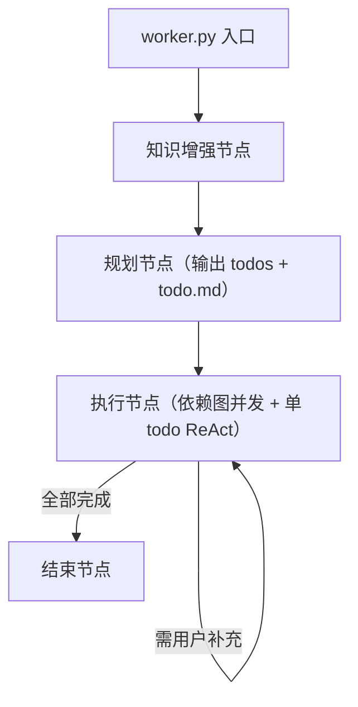
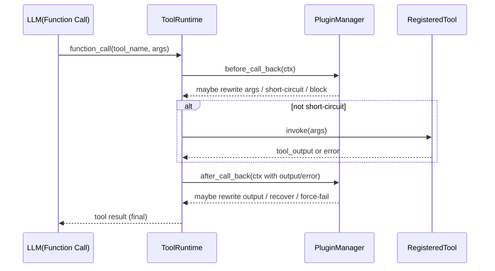

# 重构方案

## 1. 目标

将当前多分支编排（intent/clarification/direct_tool/dag/loop/insight）收敛为统一主链路，降低路由分叉和状态不一致问题：

1. 用户提问后流程更可预测。
2. 术语增强与任务规划解耦。
3. 执行阶段统一为 function-call ReAct（单 todo 内部），todo 间保留依赖图并发。
4. 支持执行阶段按任务动态启用/禁用工具（受控增删）。

## 2. 总体架构（5 节点）



## 3. 节点职责

### 3.1 入口节点（worker.py）

1. 接收用户请求并判断是否进入图流程。
2. 轻量闲聊短路：明显闲聊可直接回复并结束。
3. 其余请求进入"知识增强节点"。

### 3.2 知识增强节点

输入：用户原始问题。
输出：`enriched_query`、`term_hints[]`、`knowledge_snippets[]`。

规则：

1. 只补充高置信术语，不阻断流程。
2. "能补多少补多少"，不做强制确权。
3. 产出结构化对象供规划节点消费。

### 3.3 规划节点

输入：`user_query + enriched_query + term_hints + knowledge_snippets`。
输出：`todos[]` 和 `todo.md`。

每个 todo 至少包含：

1. `todo_id`
2. `goal`
3. `required_tools[]`
4. `blocked_tools[]`
5. `inputs`
6. `depends_on[]`：依赖的前置 todo_id 列表（用于并发调度）
7. `term_context[]`（该 todo 绑定的术语知识，见下）
8. `acceptance_criteria`
9. `status`（pending/running/done/skipped/failed）

`term_context[]` 字段（精简版，react_hint 移至 tool hook 层）：

1. `mention`：用户原词
2. `normalized_term`：标准术语（可为空）
3. `term_id`：术语 ID（可为空）
4. `confidence`：0~1
5. `source`：`knowledge_match | llm_infer | user_clarification`
6. `semantic_type`：术语语义类型，枚举 `object | action | view | relation`
7. `note`：补充说明（如"该术语在子 agent 语义域内解释"）

说明：`react_hint`（preferred_tools、tool_args_template 等）从 term_context 中移除，改由 tool hook 的 `before_call_back` 在工具调用现场注入，那里更接近工具参数结构，耦合更合理。

### 3.4 执行节点（依赖图并发 + 单 todo ReAct）

#### 3.4.1 并发调度模型

执行节点不是纯串行 ReAct，而是两层结构：

- **外层**：依赖图调度器，按 `depends_on[]` 计算可并发执行的 todo 批次，使用 `asyncio.gather` 并发执行同批次 todo。
- **内层**：每个 todo 独立运行一个 function-call ReAct 循环，负责该 todo 内部的工具选择与执行。

```
执行节点
├── 依赖图调度器（外层，保留并发能力）
│   ├── 批次1: [todo_A, todo_B]  → asyncio.gather 并发
│   └── 批次2: [todo_C]          → 依赖批次1完成后执行
└── 单 todo ReAct（内层，每个 todo 独立循环）
    ├── think: 选择工具
    ├── act: 调用工具（经过 tool hook 回调链）
    └── observe: 校验结果，决定继续/完成/中断
```

约束：

1. 同批次并发 todo 之间不共享 ReAct 上下文，各自独立。
2. 后批次 todo 可读取前批次 todo 的产出（通过 state 传递）。
3. 并发执行时，Level 1/2 的 todo 修改操作（跳过/追加）只在当前批次全部完成后生效，不中断正在执行的 todo。

#### 3.4.2 单 todo ReAct 循环

输入：`当前 todo + todo.md 摘要 + effective_tools`。
行为：逐步执行 function-call ReAct，并每轮回写 `todo.md`。

执行循环：

1. 读取当前 todo 状态与证据（从 todo.md 摘要）。
2. 计算当前轮可用工具集合（见第 4 节）。
3. 执行函数调用与结果校验（经过 tool hook 回调链）。
4. 回写 `todo.md`（结果、证据、下一步）。
5. 缺信息则中断提问，恢复后继续当前 todo。

#### 3.4.3 ReAct 修改 todos 的权限边界

规划节点输出的 `todos[]` 是静态快照，执行过程中 ReAct 按以下分级修改：

**Level 0：参数修正（ReAct 自主）**

- 当前 todo 的 tool_params 填错，ReAct 可自行修正后重试。
- 不改 todo 结构，只改本次调用参数。
- 无需写入审计日志，但需记录到 todo.md。

**Level 1：标记跳过（ReAct 自主，需记录原因）**

- 前置 todo 结果为空或无意义，后续依赖它的 todo 可标记为 `skipped`。
- ReAct 自主决定，但必须在 todo.md 中写明跳过原因。
- 并发场景：跳过操作在当前批次全部完成后生效。

**Level 2：追加新 todo（触发局部重规划，需写入审计日志）**

- 执行结果揭示了规划时未知的信息，需要新步骤。
- 不是 ReAct 自主决定，而是触发一次轻量"局部重规划"。
- 约束：
  1. 只能在当前 todo 之后插入，不能修改已完成的 todo。
  2. 插入的新 todo 必须有明确的 `goal` 和 `required_tools`。
  3. 必须写入审计日志（`plugin_id=react_replanning`，`risk_level=medium`）。

**不允许：**

- 修改已完成（`done`）的 todo。
- 整体重规划（需用户确认或明确失败信号触发，走 Level 3 流程）。

**Level 3：整体重规划（需用户确认）**

- 触发条件：连续 N 个 todo 失败，或 ReAct 判断当前 todos 无法达成 user_query。
- 必须向用户说明原因，等待确认后才能重规划。

#### 3.4.4 中断恢复要求

1. 每次中断必须绑定 `thread_id + checkpoint_id + checkpoint_ns + todo_active_id`。
2. 恢复后禁止重置已完成 todo，只允许从中断点续跑。
3. 对外层表现为"单次对话中断/恢复"，对内层保持 ReAct 上下文连续。

#### 3.4.5 ReAct 利用 term_context[] 的规则

1. 当 `semantic_type=action` 时，优先选择动作类工具并补全动作参数。
2. 当 `semantic_type=object` 或 `view` 时，优先选择查询类工具并约束查询域。
3. 当 `semantic_type=relation` 时，先解析关系再生成多步调用（先定位主语/宾语，再执行查询或动作）。
4. 工具参数的精细化增强（如 view_name 映射、tool_args_template）由 tool hook 的 `before_call_back` 在调用现场完成，不在 ReAct 层处理。

#### 3.4.6 文件兼容（空间存储）

1. todo 产物（中间数据、报告、附件）统一写入 workspace 临时目录。
2. 执行完成后由文件上传工具写入空间，记录 `file_id/file_url/original_download_url`。
3. `todo.md` 中仅记录文件元信息与链接，不内嵌大体积内容。
4. 结束节点输出时保留当前协议字段，确保前端"空间文件下载"能力不回归。

### 3.5 结束节点

1. 汇总 todos 结果。
2. 生成最终回答（文本 + 结构化数据/文件信息）。
3. 持久化执行摘要。

## 4. 执行节点能力"增删 + 回调插件"策略（受控）

### 4.1 原则

1. 执行节点允许"动态启用/禁用工具"，不允许"运行时注册任意新工具代码"。
2. 动态工具必须来自 worker 启动时已加载的 `tool_registry`。
3. 工具变更必须可审计（写入 todo.md 与日志）。
4. skill 作为可执行能力加入 ReAct，但仍需在启动时预加载到 `skill_registry`，不允许运行时注入任意代码。

### 4.2 计算规则

每个 todo 的可用工具集合：

`effective_tools = required_tools - blocked_tools`

说明：当前版本按 `tools` 字段落地；升级到 `capabilities` 后，等价表达为
`effective_capabilities = required_capabilities - blocked_capabilities`。

约束：

1. `required_tools`、`blocked_tools` 均需是 `tool_registry` 子集。
2. 若 `required_tools` 为空，则默认使用"该任务类型的默认白名单工具"。
3. 若 `effective_tools` 为空，标记 todo 为 `blocked` 并触发"局部重规划"。

来源定义：

1. `required_tools` 来源于规划节点：
   1. planner 基于 `todo.goal + term_context` 选择候选工具。
   2. 与 `tool_registry`、agent 白名单做交集校验后产出。
2. `blocked_tools` 来源于策略层与运行时：
   1. 平台/租户/场景策略禁用。
   2. agent 配置禁用。
   3. 运行时禁用（故障、熔断、依赖不可用）。
   4. 回调插件拦截产生的临时禁用。

### 4.3 默认工具集

内置"最小默认工具集"，避免规划节点产出 todo 后无工具可用：

1. `chat-response-tool`：闲聊/澄清友好回复（纯文本，不查数）
2. `workspace-file-read`：读取 workspace 文件
3. `workspace-file-write`：写入 workspace 文件
4. `workspace-file-upload`：上传到空间并返回文件链接
5. `task-note-tool`：读写 `todo.md`（统一任务状态/证据）

启用策略：

1. 默认工具仅在 `required_tools` 为空时作为兜底候选。
2. 涉及外部系统调用的工具必须显式列入 `required_tools`。
3. 高风险工具（删除/覆盖）默认放入 `blocked_tools`，需规划节点显式解锁。

### 4.4 子 Agent 场景（Tool 特型）

针对"文档知识问答子 agent，不需要术语澄清"的场景：

1. 子 agent 在执行层确实按 tool 调用（统一接口），但在策略层是 `tool_kind=agent_delegate` 的特型。
2. 保留该特型的目的：
   1. 路由策略不同：可跳过术语澄清链路。
   2. 调用语义不同：通常是异步委托与回传，不是本地数据查询。
   3. 结果契约不同：返回可能是"已委托/任务受理"，而非直接数据结果。
3. 规划节点生成 agent 委托 todo 时：
   1. `required_tools` 仅包含目标 agent 工具。
   2. `blocked_tools` 包含术语澄清相关工具（按场景策略）。
   3. `todo.inputs` 增加 `delegate_policy`（同步/异步、是否等待回执）。

### 4.5 Skills 加载与执行机制（ReAct：Tool + Skill）

目标：执行节点在 ReAct 中既可调用 `tool`，也可调用 `skill`，两者统一纳入可用能力集合与审计链路。

加载来源（目录明确化）：

1. 默认 skills（内置）：`packages/datacloud-analysis/src/datacloud_analysis/skills`
2. 扩展 skills（项目）：`examples/e_commerce_demo/backend/datacloud_service/plugins/skill_plugins`
3. 加载优先级：默认 skills -> 扩展 skills（同名时扩展覆盖默认）
4. worker 启动时统一加载为 `skill_registry`

统一能力模型：

1. `capability_id`
2. `capability_type`: `tool | skill`
3. `invoke_ref`: 可调用引用
4. `allowlist_tags` / `blocklist_tags`
5. `risk_level`

执行选择规则：

1. 规划节点输出 `required_capabilities[]` 与 `blocked_capabilities[]`（兼容原 `required_tools[]` 字段，后续可平滑迁移）。
2. 执行节点计算：`effective_capabilities = required_capabilities - blocked_capabilities`。
3. ReAct 每轮可选择：
   1. 直接调用 tool（外部能力/查询/写入）。
   2. 调用 skill（可复用策略、参数构造、后处理模板）。

约束：

1. skill 不直接绕过工具权限，skill 内部若触发 tool 仍走同一权限和回调链。
2. 高风险 capability 默认禁用，需规划阶段显式解锁并审计。
3. 每次 skill 调用需记录输入、产出、耗时、后续触发的 tool 列表。

### 4.6 LLM Function Call 回调机制（before_call_back / after_call_back）

目标：只要"大模型通过 function call / tool_calls 调用了已注册 tool"，就统一进入回调链；可用于调用前知识增强、调用后结果修正、错误拦截恢复。

适用范围（必须命中）：

1. LLM 产出 `function_call`（或 `tool_calls`）并选择了 `tool_registry` 中的工具。
2. 该工具实际被执行前后，都要经过回调链。

不适用范围（不触发回调）：

1. 纯文本 `llm.ainvoke`（如 intent/dag/insight 的普通推理）不触发。
2. 非注册工具、内部纯计算函数不触发。

插件目录约束：

1. 插件文件目录固定为 `examples/e_commerce_demo/backend/datacloud_service/plugins`。
2. 一个插件对应一个 `.py` 文件，建议命名：`tool_cb_<name>.py`。
3. 扫描时忽略 `__init__.py`、`init_agent_conf.py`、`__pycache__`。

插件注册协议：

1. 每个插件文件导出 `register()`，返回插件实例。
2. 插件实例建议字段：
   1. `plugin_id: str`
   2. `priority: int`（越小越先执行）
   3. `enabled: bool`
   4. `tool_allowlist: list[str] | None`（可选）
   5. `tool_blocklist: list[str] | None`（可选）
3. 插件实例可选回调：
   1. `before_call_back(ctx) -> BeforeHookResult | None`
   2. `after_call_back(ctx) -> AfterHookResult | None`

回调上下文 `ctx`（建议字段）：

1. `session_id` / `thread_id` / `agent_id`
2. `task_id` / `task_type` / `tool_name`
3. `tool_params`（可被 before 回调改写）
4. `user_query` / `enriched_query` / `term_hints`（供知识增强）
5. `workspace_dir`
6. `todo_id` / `todo_goal`
7. `tool_output`（after 阶段）
8. `tool_error`（after 阶段异常对象字符串化）

`before_call_back` 行为约定：

1. 返回 `None`：不处理，进入下一插件。
2. 返回 `{"tool_params": {...}}`：改写调用参数后继续。
3. 返回 `{"short_circuit": true, "output": ...}`：短路工具执行，直接使用输出。
4. 返回 `{"block": true, "error": "..."}`
   1. 阻断本次调用并按失败处理。
   2. 建议用于参数校验、权限校验。

`after_call_back` 行为约定：

1. 返回 `None`：不处理，进入下一插件。
2. 返回 `{"tool_output": ...}`：改写工具输出。
3. 返回 `{"recover": true, "tool_output": ...}`：工具失败时兜底恢复为成功输出。
4. 返回 `{"raise": true, "error": "..."}`
   1. 将本次调用强制标记失败。
   2. 建议用于结果风控/合规拦截。

执行时序：

1. 过滤出当前工具命中的启用插件。
2. `before_call_back` 按 `priority` 升序执行。
3. 执行真实工具调用。
4. `after_call_back` 按 `priority` 降序执行（更像"出栈"）。
5. 将最终 `params/output/error` 记录到 `todo.md` 与结构化日志。

调用链（必须形态）：



异常策略：

1. 默认容错：插件自身异常仅记录日志，不中断工具主流程。
2. 严格模式：`DATACLOUD_TOOL_PLUGIN_STRICT=true` 时，插件异常直接失败。
3. 工具失败后，允许 after 插件做一次"可恢复拦截"（如降级结果）。

落地位置（代码级）：

1. 主切点：`packages/datacloud-analysis/src/datacloud_analysis/orchestration/sandbox_executor.py`
2. 在 `execute_next_task(...)` 内统一包裹：
   1. `before_call_back` 链
   2. 真正 dispatcher 调用
   3. `after_call_back` 链
3. worker 启动时加载插件清单并注入 graph 可访问上下文（与现有 `PluginRegistry` 并存，不替代）。
4. 要求后续 function-call 执行入口统一走 `ToolRuntime.invoke_with_callbacks(...)`，避免漏挂钩。

### 4.7 插件分层与目录规范

总体原则：

1. `command` 与 `tool hook` 与 `skill` 都采用插件化。
2. 每类插件都分"默认插件（packages 内置）"和"扩展插件（examples 项目覆盖）"。
3. 同类插件按优先级执行；扩展插件可覆盖默认行为，但必须可审计。

#### 4.7.1 Command Plugins

1. 默认 command 插件（内置）：`packages/datacloud-analysis/src/datacloud_analysis/command_plugins`
2. 扩展 command 插件（项目）：`examples/e_commerce_demo/backend/datacloud_service/plugins/command_plugins`
3. 当前默认能力迁移目标：
   1. `examples/e_commerce_demo/backend/datacloud_service/commands/ext_command_dispatcher.py`
   2. `examples/e_commerce_demo/backend/datacloud_service/commands/get_file_by_page_command.py`
   3. 上述两项应下沉为内置 command 插件（packages），examples 仅保留扩展与覆盖实现。
4. 命名兼容：推荐统一 `command_plugins`；历史 `comand_plugins` 保留兼容扫描，后续移除。

#### 4.7.2 Tool Hook Plugins

1. 默认 tool hook 插件（内置）：`packages/datacloud-analysis/src/datacloud_analysis/tool_hook_plugins`
2. 扩展 tool hook 插件（项目）：`examples/e_commerce_demo/backend/datacloud_service/plugins/tool_plugins`
3. tool hook 只拦截"LLM function call 命中的注册 tool"，不拦截普通 llm 推理节点。
4. hook 支持：
   1. `before_call_back`：知识增强、参数修正（含 react_hint 注入）、阻断
   2. `after_call_back`：输出修正、错误恢复、合规拦截
5. react_hint 注入说明：
   - `preferred_tools`、`tool_args_template` 等字段不再放在 `term_context` 里，而是由 tool hook 的 `before_call_back` 在调用现场根据 `tool_name + term_context` 动态注入到 `tool_params`。
   - 这样 hook 插件同时掌握工具参数结构和术语语义，耦合更合理，规划节点 prompt 不需要理解工具参数细节。
6. 输入/输出规范（统一 `HookContext` / `HookDecision`）：

   1. Hook 输入（`HookContext`）：
      1. `session_id: str`
      2. `thread_id: str`
      3. `checkpoint_id: str | null`
      4. `checkpoint_ns: str | null`
      5. `todo_id: str | null`
      6. `react_step_id: str | null`
      7. `tool_name: str`
      8. `tool_params: dict`
      9. `user_query: str`
      10. `enriched_query: str | null`
      11. `term_context: list[dict]`
      12. `knowledge_snippets: list[dict]`
      13. `tool_output: Any | null`（仅 after）
      14. `tool_error: dict | null`（仅 after，建议含 `error_type/message/stack`）
      15. `metadata: dict`（扩展字段）

   2. Hook 输出（`HookDecision`）：
      1. `action: continue | patch | short_circuit | interrupt | fail | recover`
      2. `patch`（可选）：
         1. `tool_params?: dict`
         2. `knowledge_snippets_append?: list[dict]`
         3. `term_context_append?: list[dict]`
      3. `result`（可选）：
         1. `tool_output?: Any`（short_circuit/recover）
         2. `tool_error?: dict`（fail）
      4. `interrupt`（仅 `action=interrupt`）：
         1. `reason_code: str`
         2. `prompt: str`
         3. `required_fields?: list[str]`
         4. `resume_payload_schema?: dict`
      5. `audit`（可选）：
         1. `plugin_id: str`
         2. `message: str`
         3. `risk_level: low | medium | high`

   3. 知识增强场景（before_call_back）：
      1. 输入：`tool_name + tool_params + user_query + term_context + knowledge_snippets`
      2. 输出：
         1. 不改参数：`action=continue`
         2. 改参增强（含 react_hint 注入）：`action=patch`，在 `patch.tool_params` 回写增强参数
         3. 补充知识：`action=patch`，在 `patch.knowledge_snippets_append` 增量写入
      3. 约束：
         1. 只能追加 `knowledge_snippets`，不得删除已有证据。
         2. `tool_params` 改写必须记录 `audit.message`。

   4. 流程阻断场景（before/after 都可）：
      1. 适用：高风险调用确认、参数缺失、合规命中、外部依赖异常需人工确认。
      2. 输出：
         1. 需要人工确认：`action=interrupt` + `interrupt.prompt/reason_code`
         2. 直接失败终止：`action=fail` + `result.tool_error`
         3. 错误可恢复：`action=recover` + `result.tool_output`
      3. 中断恢复要求：
         1. runtime 写入 `checkpoint_id/checkpoint_ns/todo_id/react_step_id`
         2. 恢复后重入同一 `react_step_id`，避免跳步
         3. `interrupt.resume_payload_schema` 用于校验用户恢复入参

   5. 处理优先级（单轮）：
      1. 多插件 `before_call_back`：按 `priority` 升序执行，遇 `interrupt/fail/short_circuit` 立即停止后续 before。
      2. 工具执行后 `after_call_back`：按 `priority` 降序执行，`recover/fail` 由最后一个生效决策覆盖。

   6. 最小示例：

      1. 知识增强（before，含 react_hint 注入）：

         ```json
         {
           "action": "patch",
           "patch": {
             "tool_params": {
               "query": "企业综合分析表 前100条",
               "limit": 100,
               "view_name": "dws_enterprise_wide"
             },
             "knowledge_snippets_append": [
               {
                 "source": "tool_hook",
                 "text": "将"企业综合分析表"映射为企业宽表视图"
               }
             ]
           },
           "audit": {
             "plugin_id": "tool_cb_knowledge_enhance",
             "message": "补全view_name与limit参数",
             "risk_level": "low"
           }
         }
         ```

      2. 流程阻断（before/after）：

         ```json
         {
           "action": "interrupt",
           "interrupt": {
             "reason_code": "RISK_CONFIRM_REQUIRED",
             "prompt": "本次查询涉及敏感字段，是否继续？回复"继续"或"取消"。",
             "required_fields": ["confirm"],
             "resume_payload_schema": {
               "type": "object",
               "properties": {
                 "confirm": {
                   "type": "string",
                   "enum": ["继续", "取消"]
                 }
               },
               "required": ["confirm"]
             }
           },
           "audit": {
             "plugin_id": "tool_cb_risk_guard",
             "message": "命中敏感字段策略，触发人工确认",
             "risk_level": "high"
           }
         }
         ```

#### 4.7.3 Skill Plugins

1. 默认 skills（内置）：`packages/datacloud-analysis/src/datacloud_analysis/skills`
2. 扩展 skills（项目）：`examples/e_commerce_demo/backend/datacloud_service/plugins/skill_plugins`
3. 加载顺序：默认 -> 扩展（同名覆盖）
4. 执行约束：
   1. skill 属于 ReAct 可执行能力，但不能绕过 tool 权限。
   2. skill 内触发 tool 调用时，仍经过 tool hook 回调链。

### 4.8 中断与恢复机制（HITL）

结论：方案支持中断与恢复，但需按以下契约落地。

中断触发点：

1. 术语澄清需要用户输入。
2. command 插件返回"需用户确认/补充"的中断信号。
3. tool hook 判定需人工确认（如高风险调用前确认）。

中断快照最小字段：

1. `thread_id`
2. `checkpoint_id`
3. `checkpoint_ns`
4. `todo_active_id`
5. `react_step_id`
6. `pending_capability`（被中断时的 tool/skill）
7. `interrupt_reason`

恢复契约：

1. 仅接受携带 `checkpoint_id + checkpoint_ns + thread_id` 的恢复请求。
2. 恢复输入写入 `Command(resume=...)`，由图从 checkpoint 续跑。
3. 恢复后首轮先校验 `todo_active_id` 与 `react_step_id`，防止跳步。

幂等与防重：

1. 同一 `checkpoint_id` 的恢复请求只消费一次（重复请求直接返回当前状态）。
2. tool/skill 调用前写入 `invocation_id`，恢复后据此跳过已完成外部调用，避免重复副作用。
3. 超时恢复（checkpoint 过期）走"局部重规划 + 用户提示"兜底。

### 4.9 执行链路重构（Worker 薄化，扩展下沉到图）

目标：`worker.py` 只做协议适配与启动装配，不承载业务分发细节。

链路：

1. Worker 收到请求后，仅执行：
   1. 基础协议解析（session/agent/config）。
   2. 调用 `CommandPluginManager`（命令插件链）。
   3. 若命令插件已处理则返回；否则进入 LangGraph。
2. LangGraph 内执行：
   1. 规划与路由。
   2. ReAct function call 调用注册 tool / skill。
   3. 调用 tool 前后触发 `ToolHookPluginManager`（before/after 回调）。

边界约束：

1. Worker 不再直接写业务命令分发 `if/else`（除极少框架保留逻辑）。
2. 命令分发、工具钩子回调、skills 执行、策略控制都下沉为插件与图内 runtime。
3. 所有扩展点必须支持开关与优先级，且输出统一审计日志。

## 5. 状态模型建议

新增/调整 state 字段：

1. `user_query`
2. `enriched_query`
3. `term_hints`
4. `knowledge_snippets`
5. `todos`
6. `todo_active_id`
7. `todo_tool_plan`
8. `active_tools`
9. `execution_trace`
10. `final_answer`
11. `artifact_refs`（空间文件引用：`file_id/file_url/download_url`）
12. `resume_context`（`checkpoint_id/checkpoint_ns/thread_id/react_step_id`）
13. `invocation_dedup`（已执行 `invocation_id` 集合，用于恢复防重）

`todo.md` 的定位：

- `todo.md` 是给 LLM 的上下文摘要，可从 state 重建，不是状态真值。
- 状态真值以内存/检查点（checkpoint state）为准。
- checkpoint 恢复时只依赖 checkpoint state，不读取 `todo.md`。
- `todo.md` 与 state 不一致时，以 state 为准，`todo.md` 可被覆盖重建。

## 6. 异常与回退

1. 工具调用失败：记录失败原因，按策略重试或切换替代工具。
2. 工具不可用：进入局部重规划，不直接终止全流程。
3. 用户补充输入：恢复到当前 todo，禁止回退到已完成 todo。
4. 超过最大重试次数：标记 todo failed，结束节点输出明确失败项和建议。
5. 插件拦截失败：按严格/容错模式处理，并写入统一审计日志。
6. 恢复失败（checkpoint 失效/上下文不一致）：进入局部重规划并提示用户继续。
7. 恢复重复提交：按幂等键去重，返回同一恢复结果。
8. 并发批次中某 todo 失败：不中断同批次其他 todo，批次完成后统一评估是否触发局部重规划。

## 7. 分阶段实施计划

### Phase 0（基础设施，可与 Phase 1 并行）

目标：建立插件骨架和 command 能力迁移，不影响现有执行链路。

1. 建立三类插件目录与加载器骨架：
   1. `command_plugins`（含 `comand_plugins` 兼容扫描）
   2. `tool_hook_plugins`
   3. `skill_plugins`
2. 迁移默认 command 能力到 `packages/datacloud-analysis/src/datacloud_analysis/command_plugins`（覆盖 ext dispatcher / get_file_by_page）。
3. 完成中断快照字段补齐（`checkpoint_id/checkpoint_ns/todo_active_id/react_step_id`）。

验收边界：插件加载器可扫描目录并注册插件，现有功能不回归。

### Phase 1（知识增强，低风险）

目标：新增知识增强节点，规划节点输出 todos，执行仍走旧链路。

1. 新增"知识增强节点"，保留现有执行链路。
2. 规划节点输出 `todos[]`（含 `depends_on[]`）与 `todo.md`，但执行仍走旧链路。
3. `term_context[]` 按精简版字段落地（不含 react_hint）。

验收边界：知识增强节点可独立测试，规划节点输出 todos 结构正确，旧执行链路不受影响。

### Phase 2（核心切换）

目标：上线统一执行节点，接入并发调度和 ReAct。

1. 上线统一"执行节点"：依赖图并发调度（外层）+ 单 todo ReAct（内层）。
2. 接入工具增删策略与 todo 回写机制。
3. 接入 `before_call_back / after_call_back` tool hook 插件链（含 react_hint 注入）。
4. 接入 skill 执行与能力统一选择（tool + skill）。
5. `worker.py` 收敛为薄入口，命令分发改为 `CommandPluginManager`。
6. 打通恢复幂等（`invocation_id` 去重）与恢复一致性校验。
7. 落地 ReAct 修改 todos 的分级权限（Level 0/1/2）。

### Phase 3（收敛旧逻辑）

1. 下线旧的 direct_tool/dag/loop 分流实现。
2. 保留必要兼容层和回放日志。
3. 插件链灰度收敛到默认开启。
4. 完成 `comand_plugins -> command_plugins` 目录统一（移除兼容扫描）。
5. 中断/恢复全链路压测与故障演练（重复恢复、超时恢复、并发恢复）。

## 8. 验收标准

1. 4 类场景均可稳定通过：
   1. 闲聊直接结束。
   2. 自动确权后规划执行并结束。
   3. 无法自动确权时中断澄清，恢复后继续执行并结束。
   4. 子 agent 文档问答不被术语澄清拦截。
2. 多任务场景（多个独立 todo）并发执行，响应时间不劣于旧 dag/loop 链路。
3. todo.md 与 state 中任务状态一致；checkpoint 恢复时不依赖 todo.md，仅依赖 state。
4. 每轮工具选择可回放、可审计。
5. 插件回调执行顺序、参数改写、错误拦截均可回放。
6. 中断后可按 `checkpoint_id + checkpoint_ns` 准确恢复，且不重复执行已完成外部调用。
7. 重复恢复请求返回幂等结果，不产生重复副作用。
8. ReAct Level 0/1 修改可在 todo.md 中追溯；Level 2 追加有审计日志。
