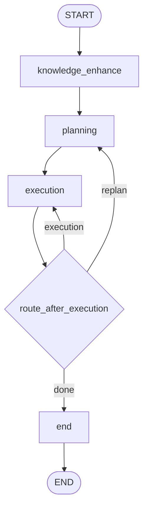

# datacloud-analysis

超级分析智能体（Super Analysis Agent）是 dataCloud 2.0 的核心智能体服务，基于 LangGraph 实现轻量可扩展的分析主链路。

## 安装

```bash
pip install datacloud-analysis
```

如需使用 SQL 执行与知识检索能力，请一并安装公网依赖：

```bash
pip install "datacloud-data[sql]" datacloud-knowledge by-framework
```

`datacloud-memory` 当前不是发布前置依赖；未安装时，记忆相关能力会自动降级为空实现。

## 核心定位

**中枢大脑**：调度知识增强、规划与执行能力，实现从自然语言问题到数据洞察的闭环。

## 项目结构 (src-layout)

本项目采用 Python 官方推荐的 `src-layout`：依赖与打包元数据在包根目录，可安装代码集中在 `src/datacloud_analysis/`，与测试、文档分离。

```text
datacloud-analysis/
├── pyproject.toml          # 依赖、打包与工具配置
├── .env.example            # 环境变量示例（本地复制为 .env）
├── README.md
├── docs/                   # 设计说明、模块规范等
├── tests/dca/              # pytest：conftest、unit、integration
└── src/
    └── datacloud_analysis/
        ├── __init__.py
        ├── agent.py        # 图工厂：create_agent() → build_analysis_graph().compile()
        ├── bootstrap.py    # SDK 启动初始化（如 PG 等）
        ├── i18n.py         # 语言与系统提示入口
        ├── config/         # 环境聚合与 Pydantic 模型（env.py、models.py）
        ├── i18n/           # 多语言文案（prompts.py）
        ├── orchestration/  # LangGraph 主链路
        │   ├── graph_builder.py       # StateGraph 装配（knowledge_enhance → planning → execution → end）
        │   ├── state.py               # AgentState 定义
        │   ├── knowledge_enhance.py   # 知识增强
        │   ├── planning.py            # 规划层（封装意图识别与任务拆解）
        │   ├── execution.py           # 执行层（任务执行与重规划路由）
        │   ├── insight.py             # 终态回复输出
        │   ├── sandbox_executor.py    # 子任务 type → 内建工具或 custom_tools
        │   ├── runner.py              # 独立运行/调试辅助
        │   └── query_shape_utils.py
        ├── tools/          # 内建原子能力（@tool）：knowledge、sandbox、report、skill 等
        ├── memory/         # 记忆加载与 recall 等工具
        ├── session/        # LangGraph checkpoint：OpenGauss、元数据等
        ├── workspace/      # 工作区路径、挂载、技能文件加载
        └── skills/builtin/ # 内置技能示例（如 group_agg、time_series）
```

**说明**：业务侧「对象 / 视图」等动态查询由 **gateway worker 注入** `prompts_overwrite` / `dynamic_tools` 后构图。

## 调用链路

以下以电商 Demo 后端为宿主，入口为 `examples/e_commerce_demo/backend/datacloud_service/worker.py` 中的 `DataCloudWorker`。

### 进程与启动

1. **`datacloud_service/main.py`**：`load_dotenv` 后调用 **`by_framework.run_worker`**，传入 `worker_class=DataCloudWorker`、`plugin_list=[InitDataCloudDigitalEmployeePlugin]`，以及 Redis / workspace / LLM 等参数（见 `WorkerConfig.run_worker_kwargs()`）。
2. **`DataCloudWorker.start_heartbeat`**（worker 启动后）：校验插件 `datacloud_init_agent_conf` 已加载数字员工配置；再 **`await datacloud_analysis.bootstrap.setup()`** 完成 SDK 一次性初始化（环境校验、OpenGauss 兼容的 LangGraph checkpoint 注册、memory 表等）。

### 单条 Gateway 命令（`process_command`）

1. **环境同步**：把 Worker 构造参数中的 `api_key`、`base_url`、`model_name` 写入 `os.environ`，供图内节点与 SDK 读取。
2. **Demo 扩展短路（仅 Ask）**：若命令为 `AskAgentCommand` 且 `extra_payload.ext_params` 为 `dict`，则调用宿主侧 **`datacloud_service.commands.handle_ext_command`**；若返回已处理，则直接通过 `AgentContext` 推送 SSE（含可选 `6001` 数据表 JSON）、`flush_to_history`，不进入 LangGraph。
3. **构图与缓存**：用 `context.list_agent_configs()` 按 `agent_id` 匹配配置，将 `prompts` / `tools` 摘要为 SHA1 缓存键，LRU 缓存已编译图；未命中时调用 `create_agent(...).compile(...)` 构建图。
4. **LangGraph RunnableConfig**：`configurable.thread_id = session_id`（checkpoint 线程），`configurable.gateway_context = AgentContext`（各节点通过其 `emit_chunk` / `ask_user` 与 Gateway 交互）。
5. **输入**：Ask 路径将网关消息归一化为 LangChain `messages` 并填充初始 `AgentState`；Resume 路径使用 `Command(resume=...)`。
6. **`_stream_graph`**：对编译图调用 `astream_events(..., version="v2")`，转发工具事件并在结束时判断是否进入等待或完成态。

### 包内 LangGraph 拓扑（当前主链）



- `knowledge_enhance`：补充知识上下文与语义提示。
- `planning`：产出待执行 todo（含 direct tool / analysis 两类路径）。
- `execution`：执行 ready todo，按状态在 `planning` / `execution` / `end` 之间路由。
- `end`：汇总结果并输出最终回答。
