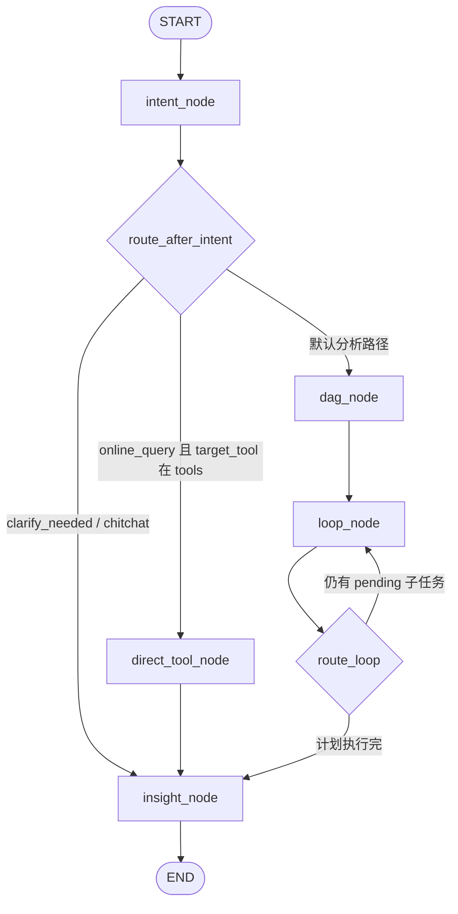

# datacloud-analysis

超级分析智能体（Super Analysis Agent）是 dataCloud 2.0 的核心智能体服务，基于 LangGraph 框架实现极简主义设计，提供智能数据分析能力。

## 核心定位

**中枢大脑**：调度资源与工具，实现从自然语言问题到数据洞察的完整闭环。

## 项目结构 (src-layout)

本项目采用 Python 官方推荐的 `src-layout`：依赖与打包元数据在包根目录，可安装代码集中在 `src/datacloud_analysis/`，与测试、文档分离。

```text
datacloud-analysis/
├── pyproject.toml          # 依赖、打包与工具配置
├── .env.example            # 环境变量示例（本地复制为 .env）
├── README.md
├── docs/                   # 设计说明、模块规范等
├── tests/dca/              # pytest：conftest、unit、integration
└── src/
    └── datacloud_analysis/
        ├── __init__.py
        ├── agent.py        # 图工厂：create_agent() → build_analysis_graph().compile()
        ├── bootstrap.py    # SDK 启动初始化（如 PG 等）
        ├── i18n.py         # 语言与系统提示入口
        ├── config/         # 环境聚合与 Pydantic 模型（env.py、models.py）
        ├── i18n/           # 多语言文案（prompts.py）
        ├── orchestration/  # LangGraph 主链路
        │   ├── graph_builder.py   # StateGraph 装配（intent → dag → loop → insight）
        │   ├── state.py           # AgentState 定义
        │   ├── intent.py          # 意图与知识检索
        │   ├── dag.py             # 任务规划（子任务 DAG；动态查询工具由上层注入）
        │   ├── loop.py            # 子任务执行轮次
        │   ├── insight.py         # 汇总与回复生成
        │   ├── sandbox_executor.py # 子任务 type → 内建工具或 custom_tools
        │   ├── runner.py          # 独立运行/调试辅助
        │   └── query_shape_utils.py
        ├── tools/          # 内建原子能力（@tool）：knowledge、sandbox、report、skill 等
        ├── memory/         # 记忆加载与 recall 等工具
        ├── session/        # LangGraph checkpoint：OpenGauss、元数据等
        ├── workspace/      # 工作区路径、挂载、技能文件加载
        └── skills/builtin/ # 内置技能示例（如 group_agg、time_series）
```

**说明**：业务侧「对象 / 视图」等动态查询由 **gateway worker 注入** `prompts_overwrite` / `dynamic_tools` 后构图；本包不再内置独立的 `data_query` 模块，数据查询以注入工具为准。


## 调用链路

以下以电商 Demo 后端为宿主，入口为 `examples/e_commerce_demo/backend/datacloud_service/worker.py` 中的 `DataCloudWorker`，与 `datacloud-analysis` 的衔接关系如下。

### 进程与启动

1. **`datacloud_service/main.py`**：`load_dotenv` 后调用 **`by_framework.run_worker`**，传入 `worker_class=DataCloudWorker`、`plugin_list=[InitDataCloudDigitalEmployeePlugin]`，以及 Redis / workspace / LLM 等参数（见 `WorkerConfig.run_worker_kwargs()`）。
2. **`DataCloudWorker.start_heartbeat`**（worker 启动后）：校验插件 `datacloud_init_agent_conf` 已加载数字员工配置；再 **`await datacloud_analysis.bootstrap.setup()`** 完成 SDK 一次性初始化（环境校验、OpenGauss 兼容的 LangGraph checkpoint 注册、memory 表等）。**须在首次 `create_agent()` 之前完成**，否则图会以无 checkpointer 方式编译，Human-in-the-loop / Resume 不可用。

### 单条 Gateway 命令（`process_command`）

1. **环境同步**：把 Worker 构造参数中的 `api_key`、`base_url`、`model_name` 写入 `os.environ`，供图内节点与 SDK 读取。
2. **Demo 扩展短路（仅 Ask）**：若命令为 `AskAgentCommand` 且 `extra_payload.ext_params` 为 `dict`，则调用宿主侧 **`datacloud_service.commands.handle_ext_command`**；若返回已处理，则直接通过 `AgentContext` 推送 SSE（含可选 `6001` 数据表 JSON）、`flush_to_history`，**不进入 LangGraph**。
3. **构图与缓存**：用 `context.list_agent_configs()` 按 `agent_id` 匹配配置，将 `prompts` / `tools` 摘要为 SHA1 缓存键，LRU 缓存已编译图；未命中时 **`_build_graph` → `datacloud_analysis.agent.create_agent`** → **`build_analysis_graph`** + **`graph.compile(checkpointer=get_checkpointer())`**（bootstrap 未就绪时退化为无 checkpoint 编译）。
4. **LangGraph RunnableConfig**：`configurable.thread_id = session_id`（checkpoint 线程），`configurable.gateway_context = AgentContext`（各节点通过其 `emit_chunk` / `ask_user` 与 Gateway 交互，**不写入 state**，避免不可序列化对象进入 checkpoint）。
5. **输入**：**Ask** 路径将网关消息归一化为 LangChain `messages`，并填充初始 `AgentState`（如 `workspace_dir`、`plan`/`results` 空、`query_mode` 等）；**Resume** 路径使用 **`Command(resume=...)`**，不重建 state。
6. **`_stream_graph`**：对编译图调用 **`astream_events(..., version="v2")`**，将 **`on_tool_start` / `on_tool_end`** 转为 Gateway 推理任务事件；**聊天模型 token 流**主要由 **`insight_node` 等**经 `gateway_context` 自行推送，worker 不在 `on_chat_model_stream` 重复转发。流结束后若有 checkpointer，则 **`aget_state`** 检查 **`snapshot.interrupts`**：存在则 **`ask_user`** 并返回 `{"status": "waiting"}`；否则推送结束语并 **`flush_to_history`**，返回 `{"status": "done"}`。

### 包内 LangGraph 拓扑



- **`loop_node`** 在每轮对就绪子任务并发调用 **`sandbox_executor.execute_next_task`**（及归一化输出），再回到条件边判断是否继续 loop。
- **`intent_node` / `dag_node` / `loop_node` / `direct_tool_node` / `insight_node`** 均从 `RunnableConfig.configurable.gateway_context` 取 `AgentContext`，与 Demo worker 侧事件流一致。
