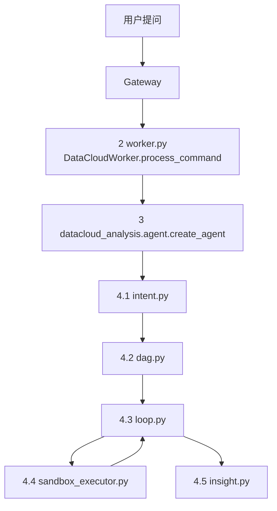

# datacloud-analysis

超级分析智能体（Super Analysis Agent）是 dataCloud 2.0 的核心智能体服务，基于 LangGraph 框架实现极简主义设计，提供智能数据分析能力。

## 核心定位

**中枢大脑**：调度资源与工具，实现从自然语言问题到数据洞察的完整闭环。

## 项目结构 (src-layout)

本项目采用 Python 官方推荐的 `src-layout`：依赖与打包元数据在包根目录，可安装代码集中在 `src/datacloud_analysis/`，与测试、文档分离。

```text
datacloud-analysis/
├── pyproject.toml          # 依赖、打包与工具配置
├── .env.example            # 环境变量示例（本地复制为 .env）
├── README.md
├── docs/                   # 设计说明、模块规范等
├── tests/dca/              # pytest：conftest、unit、integration
└── src/
    └── datacloud_analysis/
        ├── __init__.py
        ├── agent.py        # 图工厂：create_agent() → build_analysis_graph().compile()
        ├── bootstrap.py    # SDK 启动初始化（如 PG 等）
        ├── i18n.py         # 语言与系统提示入口
        ├── config/         # 环境聚合与 Pydantic 模型（env.py、models.py）
        ├── i18n/           # 多语言文案（prompts.py）
        ├── orchestration/  # LangGraph 主链路
        │   ├── graph_builder.py   # StateGraph 装配（intent → dag → loop → insight）
        │   ├── state.py           # AgentState 定义
        │   ├── intent.py          # 意图与知识检索
        │   ├── dag.py             # 任务规划（子任务 DAG；动态查询工具由上层注入）
        │   ├── loop.py            # 子任务执行轮次
        │   ├── insight.py         # 汇总与回复生成
        │   ├── sandbox_executor.py # 子任务 type → 内建工具或 custom_tools
        │   ├── runner.py          # 独立运行/调试辅助
        │   └── query_shape_utils.py
        ├── tools/          # 内建原子能力（@tool）：knowledge、sandbox、report、skill 等
        ├── memory/         # 记忆加载与 recall 等工具
        ├── session/        # LangGraph checkpoint：OpenGauss、元数据等
        ├── workspace/      # 工作区路径、挂载、技能文件加载
        └── skills/builtin/ # 内置技能示例（如 group_agg、time_series）
```

**说明**：业务侧「对象 / 视图」等动态查询由 **gateway worker 注入** `prompts_overwrite` / `dynamic_tools` 后构图；本包不再内置独立的 `data_query` 模块，数据查询以注入工具为准。


## 调用链路



- `gateway -> worker.py` 的入口方法是 `DataCloudWorker.process_command`。  
- `worker.py` 内部通过 `create_agent()` 创建/获取 graph 后，按 `intent -> dag -> loop -> sandbox_executor -> insight` 执行。  
