# dataCloud使用说明

## 操作地址

http://10.10.168.200:8080/beyond/employees


## 本体内置说明

### 本体清单

#### 本体对象清单

| 序号 | 对象名称 | 物理表名 | 业务说明 | 关键字段 |
|---|---|---|---|---|
| 1 | 客户信息表 | `demo.by_customer` | 存储客户基础档案信息 | customer_code（客户编码）、customer_name（客户名称）、industry（所属行业）、province / city（所属省市）、sales_user_id（销售用户编码）、dept_id（所属组织编码） |
| 2 | 商机信息表 | `demo.by_opportunity` | 存储商机销售过程信息 | opp_code（商机编码）、opp_name（商机名称）、customer_code（客户编码）、opp_status（商机状态：1线索获取 2方案交流 3商务报价 4签约成功 5签约失败）、forecast_amount（预测金额）、contract_amount（签约金额）、plan_sign_date / actual_sign_date（计划/实际签约日期） |
| 3 | 项目信息表 | `demo.by_project` | 存储项目交付全生命周期信息 | project_code（项目编码）、project_name（项目名称）、customer_code（客户编码）、opp_id（关联商机ID）、project_status（项目状态：1项目启动 2安装部署 3项目交付 4项目上线 5收入确认 6完成回款）、contract_amount（签约金额）、revenue_amount（收入金额）、payment_amount（回款金额）、arrear_amount（欠费金额） |
| 4 | 商机任务表 | `demo.by_opp_task` | 存储商机推进过程中的任务记录 | opp_code（商机编码）、customer_code（客户编码）、task_type（任务类型：1线索获取 2方案交流 3商务报价 4商务应标 5商机签约 6应标复盘）、initiator_user_id（发起人）、handler_user_id（处理人）、task_status（任务状态：1处理中 2正常结束 3异常结束）、initiate_time / plan_finish_time / actual_finish_time（发起/计划完成/实际完成时间） |
| 5 | 研发任务表 | `demo.by_rd_task` | 存储项目研发过程中的任务记录 | project_code（项目编码）、opp_code（商机编码）、customer_code（客户编码）、task_type（任务类型：1需求分析 2产品设计 3功能开发 4特性测试 5故障分析 6故障处理）、initiator_user_id（发起人）、handler_user_id（处理人）、task_status（任务状态：1处理中 2正常结束 3异常结束）、initiate_time / plan_finish_time / actual_finish_time（发起/计划完成/实际完成时间） |
| 6 | 项目任务表 | `demo.by_project_task` | 存储项目推进各阶段的任务记录 | project_code（项目编码）、opp_code（商机编码）、customer_code（客户编码）、task_type（任务类型对应项目状态：1项目启动 2安装部署 3项目交付 4项目上线 5收入确认 6完成回款）、initiator_user_id（发起人）、handler_user_id（处理人）、task_status（任务状态：1处理中 2正常结束 3异常结束）、initiate_time / plan_finish_time / actual_finish_time（发起/计划完成/实际完成时间） |

#### 本体视图清单

| 序号 | 视图名称 | 核心对象 | 组成对象 | 业务说明 |
|---|---|---|---|---|
| 1 | 项目管理视图 | 项目信息表（by_project） | 项目信息表、客户信息表、商机信息表、项目任务表、用户信息表（po_users）、组织信息表（po_organization） | 以项目为核心，整合项目全生命周期数据，支持项目进度、金额、任务等多维分析 |
| 2 | 研发管理视图 | 研发任务表（by_rd_task） | 研发任务表、项目信息表、客户信息表、用户信息表（po_users）、组织信息表（po_organization） | 以研发任务为核心，关联项目和客户信息，支持研发效能及任务完成情况分析 |
| 3 | 销售管理视图 | 商机信息表（by_opportunity） | 商机信息表、客户信息表、商机任务表、项目信息表、用户信息表（po_users）、组织信息表（po_organization） | 以商机为核心，整合销售过程数据，支持销售漏斗、赢单率、签约金额等分析 |
| 4 | 综合分析视图 | — | 客户信息表、商机信息表、项目信息表、商机任务表、项目任务表、研发任务表、用户信息表（po_users）、组织信息表（po_organization） | 全域数据整合，支持跨业务域的综合分析与多维度交叉查询 |

### 本体ER关系

```mermaid
erDiagram
    by_customer {
        bigint id PK
        varchar customer_code
        varchar customer_name
        varchar industry
        varchar province
        varchar city
        varchar domain
        varchar sales_person
        varchar org_name
    }

    by_opportunity {
        bigint id PK
        varchar opp_code
        varchar opp_name
        varchar industry
        varchar domain
        bigint customer_id FK
        varchar customer_code
        varchar customer_name
        varchar sales_person
        varchar org_name
        varchar product_name
        varchar product_code
        char opp_status
        decimal forecast_amount
        decimal contract_amount
        decimal forecast_rate
        varchar fail_reason
        varchar success_summary
        varchar plan_sign_month
        varchar actual_sign_month
    }

    by_project {
        bigint id PK
        varchar project_code
        varchar project_name
        varchar industry
        varchar domain
        bigint customer_id FK
        varchar customer_code
        varchar customer_name
        varchar sales_person
        varchar dept_name
        bigint opp_id FK
        varchar opp_code
        varchar product_name
        varchar product_code
        char project_status
        decimal contract_amount
        decimal revenue_amount
        decimal payment_amount
        decimal arrear_amount
        varchar plan_online_month
        varchar actual_online_month
        varchar plan_revenue_month
        varchar actual_revenue_month
        varchar plan_payment_month
        varchar actual_payment_month
    }

    by_rd_task {
        bigint id PK
        varchar project_name
        varchar project_code
        varchar opp_code
        varchar opp_name
        varchar customer_name
        varchar customer_code
        varchar product_name
        varchar product_code
        char task_type
        varchar initiator
        varchar handler
        char task_status
        varchar task_name
        text task_desc
        text handle_desc
        datetime initiate_time
        datetime plan_finish_time
        datetime actual_finish_time
    }

    by_project_task {
        bigint id PK
        varchar project_name
        varchar project_code
        varchar opp_code
        varchar opp_name
        varchar customer_name
        varchar customer_code
        varchar product_name
        varchar product_code
        char task_type
        varchar initiator
        varchar handler
        char task_status
        varchar task_name
        text task_desc
        text handle_desc
        datetime initiate_time
        datetime plan_finish_time
        datetime actual_finish_time
    }

    by_opp_task {
        bigint id PK
        varchar customer_code
        varchar customer_name
        varchar product_name
        varchar opp_code
        varchar opp_name
        char task_type
        varchar initiator
        varchar handler
        char task_status
        varchar task_name
        text task_desc
        text handle_desc
        datetime initiate_time
        datetime plan_finish_time
        datetime actual_finish_time
    }

    by_customer ||--o{ by_opportunity : "拥有"
    by_customer ||--o{ by_project : "拥有"
    by_opportunity ||--o{ by_project : "关联"
    by_opportunity ||--o{ by_opp_task : "包含"
    by_project ||--o{ by_project_task : "包含"
    by_project ||--o{ by_rd_task : "包含"
```



## 操作简要

### 项目管理数字员工

#### 数字员工说明

拥有项目管理视图、商机信息表、项目任务表、项目信息表、客户信息表 ，可进行研发相关的客户、项目信息查询，可进行项目任务的管理，可通过项目管理视图进行关联数据查询和分析。


#### 项目管理-问数用例

1、点击“员工”tab页，找到《项目管理数字员工》数字员工，针对【项目】进行相关的问题。

2、以下是问题清单：

```markdown
上个月有哪些项目上线了
帮我找出所有跟上线相关的项目任务
帮我找出项目最多的客户
帮我找出回款缺口最大的项目
帮我查一下有哪些项目回款延期了
把上面几个项目的收入金额一起打出来
帮我看一下有哪些项目签约和收入缺口比较大的，分析一下原因
帮我看一下签单最多的销售是哪个
```


#### 项目管理-操作用例

```
1、选择“个人助理”，例如 黄药师的个人助理(2)。
2、让助理查询自己的 周报、会议纪要： 找一些最近的会议纪要和周报。
3、@项目管理数字员工: 针对以上会议内容，帮我派发项目管理研发任务，项目是"国投中债-BI-实施项目",客户是“北京国投中债资产管理有限公司”，待办完成时间是05-30号。

```


### 研发管理数字员工

#### 数字员工说明

拥有研发管理视图、客户信息表、项目信息表、研发任务表，可进行研发相关的客户、项目信息查询，可进行研发任务的管理，可通过研发管理视图进行关联数据查询和分析。


#### 研发管理-问数用例

1、点击”员工”tab页，找到《研发管理数字员工》数字员工，针对【研发】进行相关的问题。

2、以下是问题清单：

```markdown
# query 类（明细查询）
帮我查一下目前还在处理中的研发任务有哪些
帮我找出处理时间已经超过计划完成时间的研发任务列表

# static 类（统计分析）
各类型研发任务的数量和完成率分别是多少
帮我统计一下各项目的研发任务数量分布
```


### 销售管理数字员工

#### 数字员工说明

拥有销售管理视图、客户信息表、商机信息表、项目信息表、商机任务表，可进行销售管理相关的客户、商机、项目的信息查询，可进行销售管理任务的管理，可通过销售管理视图进行关联数据查询和分析。


#### 销售管理-问数用例

1、点击”员工”tab页，找到《销售管理数字员工》数字员工，针对【销售】进行相关的问题。

2、以下是问题清单：

```markdown
# query 类（明细查询）
帮我查一下目前处于商务报价阶段的商机有哪些
帮我找出签约金额最大的前5个商机

# static 类（统计分析）
各销售人员今年的商机签约金额分别是多少
各阶段商机的数量和预测金额分布是怎样的
```


### crm领域综合分析数字员工

#### 数字员工说明

拥有综合分析视图


#### 综合分析-问数用例

1、点击”员工”tab页，找到《crm领域综合分析数字员工》数字员工，针对【综合】进行相关的问题。

2、以下是问题清单：

```markdown
# query 类（明细查询）
帮我查一下既有商机又有项目在推进的客户有哪些
帮我找出同时存在研发任务逾期和项目回款延迟的项目列表

# static 类（统计分析）
帮我分析各行业的商机签约金额和项目回款金额对比
帮我统计各销售人员的商机数量、签约金额和项目转化率
```

