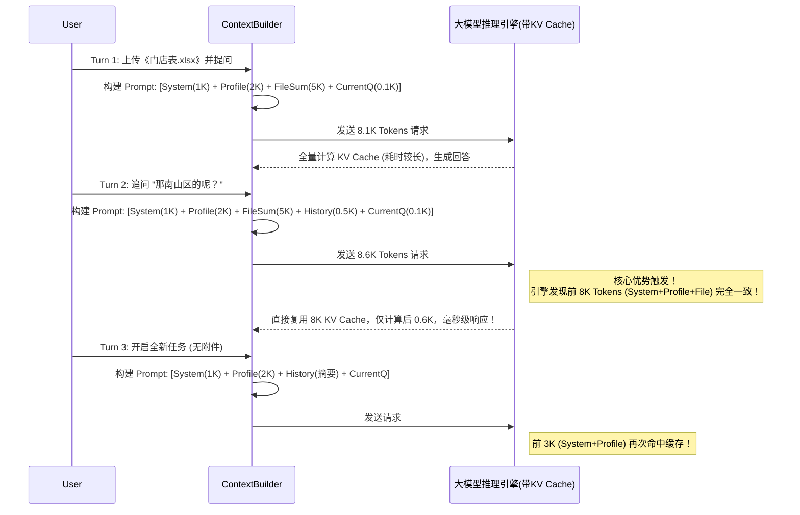

# 超级分析智能体：体系化重构与完善方案

> 针对早期设计单薄、能力散落的问题，本方案以**“打造企业级复杂数据分析引擎”**为目标，对核心模块进行体系化重构。
> 同时，本方案将对比主流开源智能体框架 **OpenClaw**（个人全能 AI 助理），以凸显本系统在“企业级数据与复杂推演”场景下的架构差异与设计深度。

---

## 一、 体系化架构愿景（VS. OpenClaw）

| 架构维度 | OpenClaw (个人助理生态) | DataCloud Agent (超级分析智能体) | 本次体系化设计的核心策略 |
| :--- | :--- | :--- | :--- |
| **路由与模型** | 依赖外部网关与单一强大模型（如 Opus/GPT-4o）串联全局。 | **多模型分工协同 (Multi-Model Routing)**。<br>规划、编码、快问快答分离。 | 引入 `ModelRouter`，根据当前 DAG 节点类型（推演、编码、意图分类）动态切换模型，兼顾成本与智商。 |
| **任务调度** | 单线 ReAct / 对话流，遇到问题随时调用 Skill。 | **DAG 拆解与图调度 (DAG Orchestration)**。<br>数据查询需高度并行，汇总需串行。 | 从单线 ReAct 升级为“意图解析 → DAG 生成 → 并发执行 → 综合 Insight”的结构化图状态流转。 |
| **上下文机制** | 滑动窗口与长期记忆注入。 | **分层上下文与缓存复用 (Context & KV Cache)**。<br>大表数据极易撑爆 Token。 | 设计 Session、Task、Evidence 三层上下文。工具产出转换为摘要与引用（Ref），保障长下文下的性能与精准度。 |
| **文件交互** | 发送文件给模型读取。 | **数据表与文件融合 (Data & File Fusion)**。<br>文件（如门店映射表）需与底层数据库运算融合。 | 前端上传打通沙箱 `inputs/`。支持文件解析结果与 `data_query` 结果在同一沙箱内进行 Pandas 级 `code_exec` 融合。 |
| **工具生态** | 插件化 Skills，侧重互联网 API 与本地控制。 | **原子化数据/沙箱工具 (Atomic Tools)**。<br>拒绝庞大黑盒，追求可回溯。 | 拆解出 `data_query`、`attachment_parse`、`sbx_run_code` 等原子工具，通过统一标准结构返回，供上层图节点消费。 |
| **运行空间** | 宿主机/本地容器直接执行。 | **严格隔离任务沙箱 (Isolated Task Sandbox)**。<br>防范数据越权与系统破坏。 | 建立 `TaskPaths` 与 `SandboxBackend` 抽象，读写分离（`inputs/` 只读，`outputs/` 写入），高危代码容器化执行。 |

---

## 二、 六大核心模块体系化设计方案

基于上述愿景，针对目前存在的 6 个痛点，进行如下架构补齐与重构：

### 1. 多模型路由与调度网络 (对应问题 1)

**设计痛点：** 目前 `agent.py` 仅硬编码绑定单一模型。
**体系化设计：**
将模型能力划分为四大象限，由 `llm.router.ModelRouter` 集中管控分发。

- **Quick 模型 (如 Qwen 7B/14B)**：处理“意图分类”、“简单业务常识追问”、“用户操作指导”。（低延迟）
- **Reasoning 模型 (如 DeepSeek-R1 / Qwen Max)**：处理“DAG 任务拆解”、“逻辑推演”、“最终 Insight 汇总生成”。（高智商）
- **Coding 模型 (如 DeepSeek Coder)**：专属分配给 `sbx_run_code` 工具，专注生成 Python/SQL 处理庞大数据切片。（领域特化）
- **Multimodal 模型**：专属处理包含图表截图、PDF 扫描件的 `attachment_parse` 任务。

**落地路径：**
- 新增 `datacloud_analysis/llm/router.py`，暴露 `select_role(step_type, intent_context)` 接口。
- `orchestration` 图中不再传递全局 `llm`，各节点内部（如 `dag.py`, `insight.py`）按需调用 router 获取对应模型。

### 2. DAG 任务流编排引擎与固化任务复用 (对应问题 2)

**设计痛点：** 当前任务未能拆解，导致复杂问题一次性输出极易幻觉。但是，如果**所有请求**都强制走 `Planner -> Executor` 流程，会导致极大的延迟浪费；尤其是面对**“日常反复出现的同类查询”**（如：查XX的商机、合同和客户），每次都让大模型重新规划 DAG，既慢又昂贵。
**体系化设计：**
构建 **三轨路由（Tri-Track Routing）** 与基于模板的快速 DAG 展开。

- **动态轨道决策 (`intent` 节点前置把关)**
  - 在 `intent_node` 由 Quick 模型（或规则引擎、向量检索）首先匹配用户意图。
  - **Fast Track (快车道)**：对于纯闲聊或企业常识，直接生成 `direct_answer`，跳过图节点，直达 `END`。**零规划延迟。**
  - **Template Track (固化模板车道)**：当命中已沉淀的“固化任务/技能”时（例如检索到“人员业务全景核查”模板），`intent_node` 直接提取实体参数（如 `[{"person": "杜成鹏"}]`），**跳过 Reasoning 模型，通过模板映射直接生成完全并行的 3 个子任务**进入执行队列。
  - **Slow Track (慢车道/深度分析)**：针对全新的复杂分析问题，才会生成 `needs_dag: true` 标识。

- **节点 1：Planner (`dag_node`) - 仅限慢车道触发**
  - 只有慢车道会调用高成本 Reasoning 模型，生成带有依赖关系拓扑（deps、parallel_group）的 JSON 任务树。
- **节点 2：Scheduler & Executor (`loop_node` 升级版)**
  - 引入 `DAGScheduler`。
  - 提取所有无依赖的 Pending 节点放入线程池（`asyncio.gather`）**并发执行**。
  - 例如“固化任务”生成的“查商机”、“查合同”、“查客户”三个任务，`deps` 为空，在到达此节点时会**瞬间被并行派发给数据服务**，极大缩短 RT（响应时间）。

**落地路径：**
- 在 `AgentGraphState` 中增加 `route_track: Literal["fast", "template", "slow"]` 标识。
- 定义 `datacloud_analysis/orchestration/dag_schema.py` 强校验模型输出，并新增一套 `TemplateRegistry`（模板注册表/向量库）供 `intent` 匹配使用。
- LangGraph 路由控制：`builder.add_conditional_edges("intent", route_after_intent, {"loop": "loop", "dag": "dag", "insight": "insight"})`（Template 轨道直接进入 loop 节点，跳过 dag 节点的大模型推理）。

### 3. 分层上下文与大模型缓存机制 (对应问题 3)

**设计痛点：** 当前每轮对话将所有历史 Message 和原始查询数据无序地硬塞进 Prompt。由于大模型（如 Qwen/DeepSeek 等）的 Prefix Cache（前缀缓存/KV Cache）严格依赖于文本序列的**绝对前缀一致性**，任何夹杂在中间的微小变动都会导致后续几万 Token 的缓存全部失效，造成极高的成本浪费和极慢的首字响应时间（TTFT）。

**体系化设计：最大化利用 KV Cache 的“倒金字塔”排布法**

**文字原理讲解：**
主流大模型推理引擎（如 vLLM, TensorRT-LLM, Anthropic API）都支持 Prefix Cache。它的核心原理是：**从上到下逐字比对，一旦遇到不一致的 Token，当前位置及之后的所有缓存全部作废**。
因此，组织上下文的核心原则是：**最稳定的内容放在最前面，最容易变动的内容放在最后面**。我们将上下文严格划分为 5 层（稳定性由高到低）：

1. **System 层 (绝对稳定)**：角色设定、输出格式要求、防御性指令。
2. **User Profile 层 (会话级稳定)**：用户的全局规则（MEMORY.md）、系统术语本。
3. **Evidence 层 (多轮稳定)**：用户上传的附件摘要（大文档提取的内容）、之前固化的数据查询结果摘要。只要附件没换，这部分 Token 永久命中。
4. **History 层 (滑动变化)**：历史对话记录。采用“动态摘要+尾部明细”机制，防止历史记录无限拉长破坏上方结构的稳定性。
5. **Current Input 层 (高频变化)**：用户当前最新的提问。

#### 3.1 上下文命中时序图



#### 3.2 落地代码与 Prompt 排布样例

**新增 `datacloud_analysis/context/builder.py` 统筹构建上下文**，严格保证列表拼接的顺序：

```python
from typing import Any, List
from langchain_core.messages import SystemMessage, HumanMessage, AIMessage

class ContextBuilder:
    """严格遵循倒金字塔缓存原则的上下文构建器。"""
    
    async def build_messages(
        self,
        system_prompt: str,
        global_rules: str,
        file_summaries: List[str],
        history: List[Any],
        current_question: str
    ) -> List[Any]:
        messages = []
        
        # ==========================================
        # 🟢 Layer 1 & 2: 绝对稳定区 (System + Profile)
        # 只要系统版本没换、用户没换，这里永远命中 Cache
        # ==========================================
        stable_system_text = system_prompt + "\n\n"
        if global_rules:
            stable_system_text += f"<global_rules>\n{global_rules}\n</global_rules>\n\n"
            
        # ==========================================
        # 🟡 Layer 3: 任务级稳定区 (Evidence / Files)
        # 用户挂载的文件在当前会话中是不变的，紧贴着 System 存放
        # ==========================================
        if file_summaries:
            stable_system_text += "<attached_files>\n"
            for file in file_summaries:
                stable_system_text += f"{file}\n"
            stable_system_text += "</attached_files>\n"
            
        # 合并写入第一个 SystemMessage (LangChain格式)
        messages.append(SystemMessage(content=stable_system_text))
        
        # ==========================================
        # 🟠 Layer 4: 滑动变化区 (History)
        # 为防止历史消息越积越长顶破 Context Window，采用：
        # “前序摘要 + 最近3轮明细” 的折叠策略
        # ==========================================
        compressed_history = await self._compress_history_if_needed(history)
        messages.extend(compressed_history)
        
        # ==========================================
        # 🔴 Layer 5: 高频变化区 (Current Input)
        # 最易变的部分永远放在最后一条
        # ==========================================
        messages.append(HumanMessage(content=current_question))
        
        return messages

    async def _compress_history_if_needed(self, history: List[Any]) -> List[Any]:
        """当历史轮数大于 6 轮时，将旧消息压缩为单条摘要，保留最近 2 轮原样。"""
        if len(history) <= 6:
            return history
        # (伪代码) summary = llm_quick.summarize(history[:-4])
        # return [AIMessage(content=f"<history_summary>{summary}</history_summary>")] + history[-4:]
        return history # placeholder
```

#### 3.3 数据隔离原则（Data as Evidence, not Prompt）

为了避免 KV Cache 失效，同时保护上下文容量：
沙箱跑出的 **10MB 数据或 50 个表格列，绝对不直接拼接进 Prompt**。
- 工具 `data_query` 或 `sbx_run_code` 必须返回两个字段：`Summary`（极简摘要，入 Prompt） 和 `Artifact_Path`（文件指针，不入 Prompt）。
- Prompt 中只呈现引用标识：`[Task_1_Result: 命中 5000 条记录，已保存至 outputs/result.csv，数据包含字段: A, B, C]`。如果模型需要明细，必须通过 `code_exec` 写脚本去读那个 `.csv` 进行统计，而非用肉眼在 Prompt 里看。

#### 3.4 Prompt 缓存命中直观图解 (基于时序图的例子)

以下用纯文本形式，直观展示上述时序图中，Prompt 的组装情况与 KV Cache 前缀命中的原理：

**【Turn 1】: 用户上传《门店表.xlsx》并提问**
```text
[System] 你是超级分析智能体... (约 1000 Tokens)
[Profile] 用户偏好：金额默认使用万元... (约 2000 Tokens)
[Evidence] 上传文件《门店表.xlsx》摘要：包含门店名、区域、负责人... (约 5000 Tokens)
↓↓↓ -----------【以下划线为隐形缓存边界，实际不发给模型】----------- ↓↓↓
[CurrentQ] 帮我分析一下这里面所有华南区的门店。 (约 100 Tokens)

=> 首次计算：处理 8100 Tokens。大模型底层的 KV Cache 树保存了前缀 8000 个 Token 的状态。
```

**【Turn 2】: 追问 "那南山区的呢？"**
```text
[System] 你是超级分析智能体... 
[Profile] 用户偏好：金额默认使用万元... 
[Evidence] 上传文件《门店表.xlsx》摘要：包含门店名、区域、负责人... 
↓↓↓ -----------【完全命中上轮的 8000 Tokens 缓存边界】----------- ↓↓↓
[History] User: 帮我分析一下这里面所有华南区的门店。 AI: 华南区门店共有... (约 500 Tokens)
[CurrentQ] 那南山区的呢？ (约 100 Tokens)

=> 二次计算：系统只需处理下方新增的 600 Tokens，上方 8000 Tokens 计算量被省略，响应极快！
```

**【Turn 3】: 开启全新任务（换了话题，且不再关联之前的附件）**
```text
[System] 你是超级分析智能体... 
[Profile] 用户偏好：金额默认使用万元... 
↓↓↓ -----------【完全命中之前的 3000 Tokens 缓存边界】----------- ↓↓↓
[History] (之前有关华南区的对话摘要...) (约 300 Tokens)
[CurrentQ] 这个月的业绩指标怎么定？ (约 100 Tokens)

=> 三次计算：因为 `[Evidence]` 层的文件被移除了，所以从第三层开始发生变动。但前两层（System + Profile）依然是全量命中的！
```

通过这种**“把死数据放前面，活数据放后面”**的拼接策略，我们在代码里只要保证 List 的 `append` 顺序，底层模型引擎就能自动帮你省下海量的 Token 计算开销。

#### 3.6 进阶：基于文件空间（Workspace）的上下文组织与“RAG 卸载”

随着智能体执行的任务越来越复杂（如分析包含 10 万行数据的 CSV，或阅读上百页的 PDF），即使采用了“倒金字塔”排布，也无法解决大文件直接塞入 Prompt 导致的**“Token 撑爆”**和**“推理能力断崖式下降（Lost in the Middle）”**问题。

目前业内最前沿的做法是：**将大块上下文“卸载（Offload）”到文件空间（Workspace）中，让大模型通过“操作文件系统的工具（Tools）”按需读取，而不是被动地在 Prompt 里“生嚼”所有数据。** 这种机制完美结合了 KV Cache 和沙箱操作，是最大程度利用上下文的终极形态。

**1. 传统做法的弊端（生嚼模式）**
- **做法**：用户上传 5 个文件，系统在后台把 5 个文件全部读成字符串，拼接在 Prompt 的 `[Evidence]` 层。
- **问题**：如果这 5 个文件加起来有 100K Tokens，哪怕命中了 KV Cache，大模型在寻找某个具体数据时，依然会因为上下文太长而产生“注意力分散（Lost in the Middle）”。且如果文件稍有变动，100K 缓存全部失效。

**2. 基于文件空间的做法（按需读取模式）**
- **做法**：
  1. 用户上传 5 个文件，系统只是把它们**原封不动地挂载到沙箱的 `/workspace/inputs/` 目录下**。
  2. 我们的 `ContextBuilder` 在组装 Prompt 时，**只塞入文件目录树和极简摘要**，例如：
     ```text
     [Evidence]
     可用文件列表（位于 /workspace/inputs/）：
     - sales_2025.csv (包含字段: 日期, 门店, 销售额, 50000行)
     - org_chart.pdf (组织架构图, 10页)
     请使用 `sbx_run_code` 编写 python 脚本来读取和分析这些文件，或使用 `sbx_read_file` 查看局部内容。
     ```
  3. 大模型（特别是 Coding 角色模型）看到上述 Prompt 后，如果用户问“找出销售额最高的门店”，它**不会试图从 Prompt 里找数据**，而是直接生成一段 Python 代码去用 `pandas.read_csv('/workspace/inputs/sales_2025.csv')` 找答案。

**3. 为什么这样能最大程度利用上下文？**
- **极度压缩 Prompt 体积**：原来 100K Tokens 的原始数据，被压缩成了几十个 Tokens 的目录索引。这让 Prompt 始终保持在极其精简、高效的状态，大模型的推理逻辑（Reasoning）不会被海量数据淹没。
- **保护核心 KV Cache 不被污染**：只要文件目录结构不变，这段极简的 `[Evidence]` 永远稳定命中 Cache。而大模型每次写出的 Python 代码和返回的统计结果（比如只返回了一行最高销售额的数据），只是挂在 Prompt 最底部的 `[History]` 里的增量短文本。
- **突破 Token 物理上限**：大模型的 Context Window 再大也有上限（如 128K/200K），但挂载到 Workspace 里的文件大小只受限于硬盘（可达 GB 级）。
- **杜绝幻觉（Zero Hallucination）**：用代码（Python/SQL）去沙箱里算出来的数据是 100% 精确的，而让大模型用脑子去 Prompt 里“读数”经常会看走眼或算错。

**总结**：把长上下文剥离出 Prompt，下放到文件空间，并赋予大模型**挂载目录的视野（文件系统树）**和**沙箱操作的双手（sbx_run_code）**，是我们在超级分析智能体（DataCloud Agent）设计沙箱体系（第 6 节）最核心的战略意图。

#### 3.7 动态知识检索（Knowledge RAG）的上下文组织策略

这是一个非常典型且极易踩坑的场景：当用户问“帮我查一下 MQL 客户的转化率”，系统通过 `knowledge_query` 查到了“MQL（Marketing Qualified Lead）是指...”的术语定义。这段知识应该放在哪里？

**错误做法：**
因为潜意识里觉得“知识库”是很底层的东西，所以把它塞到了 `[Profile]` 甚至 `[System]` 层。
- **后果**：用户的第一个问题触发了知识 A，此时大模型把 `[System + A]` 存入了缓存。当用户接着追问第二个毫不相干的问题时，由于检索词变了，触发了知识 B，Prompt 变成了 `[System + B]`。大模型比对前缀时发现从知识这里字符就不一样了，**前缀树匹配瞬间中断，原本可以复用的 System 和文件摘要缓存全部报废**！

**正确做法：动态内容永远垫底**
凡是**由用户当前问题动态检索出来的增量内容（如知识库 RAG 检索结果、数据库 Schema 的局部匹配）**，它们的生命周期只属于“当前这一轮”，极度不稳定。因此，它们**必须被放在倒金字塔的最底部（Layer 5: Current Input 层）**，紧贴着用户的最新问题。

**组装范例：**
```text
[System] ... (坚如磐石)
[Profile] ... (稳如泰山)
[Evidence] 上传文件摘要... (只要不删文件就一直命中)
↓↓↓ -----------【完全命中上方前缀缓存】----------- ↓↓↓
[History] ...
[Current Input] 
  【检索到的相关知识】：
  - MQL: 营销合格线索...
  - 转化率规则：只计算当月...
  【用户提问】：
  帮我查一下 MQL 客户的转化率。
```

**这样组织的精妙之处：**
无论 `knowledge_query` 每次查出来的知识怎么千变万化，它们都处于 Prompt 的绝对末端。引擎在向下匹配时，可以毫无阻碍地安全越过漫长的 `System`、`Profile` 和 `文件 Evidence` 层，瞬间白嫖这几万 Token 的计算量。大模型每次只需重新阅读这几十个 Token 的新知识和新问题即可。

#### 3.8 上下文的设计哲学：从“全知全能的生嚼者”到“手持极简地图的调度员”

如果用一句话总结本系统针对大模型上下文的设计哲学，那就是：**大模型的 Prompt 不应该是包罗万象的数据仓库，而应该是一张极简的地图，配上一双能深入文件与数据系统操作的“手”。**

过去在构建 AI 应用时，人们往往陷入一个误区：觉得大模型越聪明、Context Window 越大，就越应该把所有查到的知识、数据库的全量 Schema、文件的原文统统塞进 Prompt，让大模型做一个“全知全能的生嚼者”。

但这种“生嚼模式”在企业级数据分析场景下注定破产：
1. **幻觉的温床**：大模型本质上是一个概率预测引擎，不是一个精确的数据库。当 Prompt 塞满 10 万行的 CSV 数据时，让它去算“某列的均值”，它有极大概率会看走眼或算错（Lost in the Middle 效应）。
2. **灾难级的性能与成本**：每一次对话都要重新让大模型吞吐海量的杂乱数据，导致首字响应时间（TTFT）从几百毫秒飙升到十几秒，且极易破坏精心设计的 KV Cache 前缀一致性。

**我们的反共识设计哲学：RAG 卸载（Offloading）**

我们要求 `ContextBuilder` 和 `AgentGraphState` 必须保持绝对的“克制”。
大模型在 Prompt 里看到的，永远只是**元数据（Metadata）**、**引用指针（References）**和**沙箱地图（Workspace Map）**：

- **不要给数据，给表结构**：当系统接入了 50 张业务表时，我们绝不把表数据塞入 Prompt。我们只告诉模型：“你可以使用 `data_query` 工具查询订单库”。
- **不要给文件内容，给文件路径**：当用户上传了 100MB 的销售流水 Excel 时，我们绝不读取它塞入 Prompt。我们只告诉模型：“沙箱的 `/workspace/inputs/` 目录下多了一个 `sales.xlsx`，你可以通过编写 Python 脚本 (`sbx_run_code`) 去分析它”。
- **不要贴长篇大论的结果，只贴结论摘要**：当脚本跑完了 100MB 的 Excel 并生成了趋势图，我们绝不把运算日志全贴进来。我们只在历史对话里补一句话：“分析完成，最高销售额为 500 万，详细图表已保存至 `/workspace/outputs/trend.png`”。

**从“用脑子读”到“用手去算”**

这种哲学本质上是对大模型角色的重新定义。在这个架构里，**大模型不是一个负责肉眼看数据并心算的“书呆子”，而是一个坐在调度台前、手里拿着资源地图、熟练指挥原子工具去替它干脏活累活的“调度员”**。

通过这张“极简地图”，我们不仅把大模型的注意力（Attention）从杂乱的数据泥潭中解放出来，专注于高阶逻辑推演（DAG 规划），还顺便完美守住了前缀缓存（KV Cache），达到了性能、准确率与成本的“不可能三角”平衡。

#### 3.9 业界对标与最佳实践印证

这种“RAG 卸载”与“上下文极简地图”的哲学并非纸上谈兵，当前全球最顶尖的 AI Agent 系统都在朝着这个架构演进。以下是业界的标杆案例印证：

1. **OpenAI 的 Advanced Data Analysis (原 Code Interpreter)**
   - **它的做法**：当你向 ChatGPT 上传一个 100MB 的 CSV 时，它**绝不会**把这 100MB 数据读进自己的上下文窗口。它只是把文件丢进了后台的 Jupyter 容器沙箱。
   - **它的 Prompt**：ChatGPT 收到的内部系统提示词里只写了“用户上传了文件位于 `/mnt/data/xxx.csv`”。当它需要回答关于数据的问题时，它会写一段 Pandas 代码发给沙箱执行，沙箱返回的 `stdout`（比如一句 `Max sales is 500`）才会真正进入它的上下文。

2. **Anthropic 的 Claude Computer Use**
   - **它的做法**：Claude 操控电脑时，不是让底层引擎去阅读整个电脑文件系统的全部内容。
   - **它的 Prompt**：它拥有操作系统的“局部视野”，依靠 `bash` 工具执行 `ls` 或 `grep` 来探测环境（获取地图），然后根据探索到的极简路径去执行后续命令，始终保持 Context 的极度收敛。

3. **Cursor 的 Composer / Agent 模式 (IDE 集成)**
   - **它的做法**：Cursor 不会把你几百万行的代码库全部强塞进每次对话的 Prompt 里。
   - **它的 Prompt**：它会把检索到的代码片段或文件路径作为“Reference（引用）”挂载。模型本身像一个“包工头”，依靠操作文件树的工具 (`readFile`, `editFile`) 去精准打击，只有在需要修改的那几十行代码才会进入核心推理的视线。

4. **OpenClaw 的 Context Pruning 与 Prompt 组装策略**
   作为个人智能体标杆，OpenClaw (`openclaw/openclaw`) 在其源码架构中对上下文的处理有着异曲同工之妙，其核心源码（如 `src/agents/system-prompt.ts` 与 `src/agents/pi-extensions/context-pruning/pruner.ts`）展示了极其精细的上下文管控：
   - **拒绝在 System Prompt 中注入动态时间**：在 `buildTimeSection` 中，OpenClaw 只注入固定的时区（Time zone），并明确警告模型：“If you need the current date, time... use the `session_status` tool.” 这一设计完美印证了我们前面提到的“**保护系统层 Prefix Cache，防止时间跳动导致全盘 Cache Miss**”的终极考量。
   - **分级 Prompt 模式 (`PromptMode`)**：根据运行环境分为 `full` (主 Agent)、`minimal` (Subagent) 和 `none`。子 Agent 绝不继承主 Agent 冗长的身份与使用说明，做到极简下发。
   - **微压缩机制 (Microcompact Context Pruning)**：在 `pruner.ts` 中，OpenClaw 会对即将发给模型的消息列表进行动态裁剪。尤其是对于工具调用返回的长文本（如 `exec` 的长篇标准输出、`read` 的大文件），系统会在拼接前进行 `takeHeadFromJoinedText` / `takeTailFromJoinedText` 裁剪，或者干脆折叠。从而在保留 History 结构的同时，硬性掐断可能顶破上下文窗口的“大块生数据”。
   - **基于工具的长期记忆加载**：OpenClaw 不把长篇的对话历史直接放前面，而是提供了 `memory_search` 和 `memory_get` 工具，让大模型在需要翻旧账时**主动用手去查**，进一步保持了当前 Prompt 的极简。

5. **Gemini CLI 的 JIT 内存与分层 Context 机制**
   Google 官方开源的 Agent CLI (`@google/gemini-cli`) 在其 `packages/core/src/utils/memoryDiscovery.ts` 与 `ContextManager` 中展现了企业级的上下文管控：
   - **JIT (Just-In-Time) 动态上下文**：不提前把所有项目文件塞入 Prompt，而是当模型真正触发到某个子目录时（比如访问了 `/src/utils/`），系统才会**自底向上**去寻找该目录的 `GEMINI.md` 并拼接入当前的 Context。
   - **内存分层加载**：将 Memory 严格划分为 Global (`~/.gemini/GEMINI.md`)、Project (当前项目空间) 和 Extension (插件注入层)。
   - **防缓存失效**：同样采用 `--- Context from: [path] ---` 的稳定格式块，且严格把稳定记忆放在前缀区。

6. **Claude Code 的 Context Compaction 与缓存保护策略**
   Anthropic 官方开发的代码 Agent（基于最新的 Claude 3.7 模型），其上下文架构完全建立在**最大化利用 Prompt Caching (KV Cache)** 的核心思路上：
   - **严格的“倒金字塔”排列**：系统指令、挂载工具定义、以及静态上下文（如 `CLAUDE.md`）绝对放置在 Prompt 最前端。任何导致缓存失效的动态元素（比如中途切换模型、改变系统时间）都被禁止，从而使单次请求成本下降 80% (缓存复用率达 90%)。
   - **Automatic Context Compaction (自动上下文压缩)**：即使在 200K 的大窗口下，当利用率到达 ~83% (约 167K tokens) 时，Claude Code 会主动对历史 History 进行**有损压缩 (Lossy Compression)**。它会总结并丢弃过于详细的中间报错和文件阅读流水，只保留结论。
   - **读写记忆分离**：使用 `CLAUDE.md` 作为稳固的前缀基底，同时模型会在会话中生成最多 200 行的 auto-memory 笔记，以极低的 Token 成本维持对任务状态的感知。

这六家行业标杆无一例外地抛弃了“大模型读万卷书”的蛮力路线，走向了**“大模型看地图 + 使用沙箱工具 + 极致前缀缓存”**的精巧路线。这正是 DataCloud Agent 必须坚持这一哲学的底气所在。

7. **OpenViking 的文件系统级上下文抽象**
   由字节跳动火山引擎开源的 Agent 上下文数据库 OpenViking (`volcengine/OpenViking`)，更是直接将这种“地图化”的理念做成了一套基础存储设施。
   - **摒弃纯平铺的向量库，引入「虚拟文件系统（vfs）」**：它不把用户的历史对话、上传的文件、系统技能当成一个个孤立的向量去检索，而是统统挂载到类似 `viking://resources/` 或 `viking://agent/skills/` 的目录树下。这就相当于直接给大模型提供了一张清晰的**全局地图**。
   - **目录递归检索（Directory Recursive Retrieval）**：它在检索时，不是无脑的全库 Vector Search（这往往会导致毫不相干的内容因为某个词被强行拉入上下文），而是“先锁定高分目录 -> 再下探精细搜索”。这与我们在数据查询场景中倡导的“先找表结构 -> 再定位字段”的思想完全一致。
   - **强制的三层分级（L0/L1/L2）按需加载**：这是我们接下来要重点引入的“预算机制”。OpenViking 强制对进入上下文的信息进行切片：
     - L0（摘要，~100 Tokens）：常驻内存或顶层 Prompt，用于快速扫描。
     - L1（概述，~2K Tokens）：当模型关注到某个目录时加载，帮助其进行 DAG 规划。
     - L2（详情全文）：只有模型显式调用原子工具（如 `read_file`）时才精准提取。
   
   这为我们解决复杂分析场景下，“动辄百万 token 表结构或几千行代码脚本”如何优雅地融入大模型上下文，提供了完美的落地方案：**不要塞入详情，只在提示词中放 L0 和 L1 级别的「引用指针（URI）」**。

### 4. 文件与数据融合的综合问答流水线 (对应问题 4)

**设计痛点：** 前端缺乏附件入口，后端未打通本地文件与云端数据的关联分析。
**体系化设计：**
打通上传 → 解析 → 挂载 → 联合运算闭环。

- **前端层**：扩展 `ChatInterface` 增加 `FileUploadButton`，上传文件换取 `attachment_id`，并随消息发送。
- **解析层**：新建 `tools/attachment.py` 原子工具，对于 CSV/Excel 抽取 Schema 和 Top 10 样本行；对于长文本提取局部摘要。
- **融合层 (DAG 协同)**：
  - 任务A：提取上传的 `门店映射.xlsx`。
  - 任务B：`data_query` 获取全量系统订单。
  - 任务C：`sbx_run_code` 生成 Python 脚本，将 A 和 B 的数据在沙箱内 Merge，输出分析结果。

**落地路径：**
- 修改 `message_handler/handler.py` 接收 `attachment_ids` 并调用下载挂载至 `inputs/` 目录。
- 前端补齐文件上传进度感知与引用气泡。

### 5. 原子化工具生态 (对应问题 5)

**设计痛点：** 之前倾向于将整个分析流封装为一个“超级工具”，导致不可观测、无法中断审批。
**体系化设计：**
明确“组合图（Graph）+ 原子工具（Tool）”的边界，**必须挂载原子工具**。

- 统一原子工具输出标准：`{ ok: bool, summary: str, data: dict, artifacts: list, trace: list }`。
- **核心原子工具集**：
  - `data_query`：仅负责自然语言转 SQL/DSL 查询，返回结果引用。
  - `sbx_run_code`：仅负责运行代码。
  - `sbx_read_file` / `sbx_write_file`：控制隔离区读写。
  - `search_knowledge`：术语与本体映射。
- **为什么必须是原子工具？**
  - **HITL (人机协同)**：高危原子工具（如删除、大批量计算）在 `loop_node` 触发时可被独立拦截并弹窗要求用户授权。若为巨型工具则无法做到精准拦截。

**落地路径：**
- 在 `tools/registry.py` 中集中管理，规范输入输出 Schema，便于 DAG Planner 精准调度。

### 6. 隔离运行空间沙箱 (Workspace Sandbox) (对应问题 6)

**设计痛点：** 目前代码执行仅有 TODO，缺乏实际运行的载体与安全隔离机制。
**体系化设计：**
构建防御性强的分层工作空间与可插拔执行后端。

- **目录范式**：
  - `/workspace/inputs/` (Read-Only)：存放用户上传的附件。
  - `/workspace/temp/` (Read-Write)：运行态临时脚本与中间结果。
  - `/workspace/outputs/` (Read-Write)：最终导出的报表与图表文件。
  - `/workspace/skills/` (Read-Only)：企业沉淀的公用分析代码。
- **沙箱抽象 (`SandboxBackend`)**：
  - 第一阶段：实现 `LocalSandboxBackend`，在宿主进程创建子目录通过子进程（带超时限制）执行（用于快速落地）。
  - 第二阶段：实现 `DockerSandboxBackend` / `RemoteSandboxBackend`，对接远端代码执行 API，限制网络出站与 CPU 内存消耗。

**落地路径：**
- 丰富 `workspace/paths.py` 的目录映射逻辑。
- 补齐 `tools/sandbox.py` 中 `sbx_run_code` 对 SandboxBackend 的真实调用。

---

## 三、 重构实施路线图 (Roadmap)

### 第一阶段：基座重构与骨架贯通 (Week 1)
1. **统一 StateGraph**：将 `agent.py` 入口改造为基于 `intent -> dag -> loop -> insight` 的标准流。
2. **多模型接入**：实现 `llm/factory.py` 和 `llm/router.py`。
3. **上下文梳理**：实现 `ContextBuilder`，屏蔽原始大段文本直入 Prompt 的问题。

### 第二阶段：DAG 引擎与本地沙箱 (Week 2)
1. **DAG Scheduler**：实现子任务并行提取与 `asyncio.gather` 并发。
2. **LocalSandbox**：打通 `sbx_run_code` 等本地执行后端。
3. **工具规范化**：重写 `data_query`，支持标准化的 Summary + Trace 返回格式。

### 第三阶段：文件上传与人机协同 (Week 3)
1. **附件流水线**：前端实现 `FileUploadButton`，后端实现文件下载与 `attachment_parse`。
2. **HITL 机制**：在 `loop_node` 对高危代码执行触发 LangGraph `interrupt()`。
3. **Insight 生成**：完善最终报告生成的 Evidence 组装与渲染协议下发。