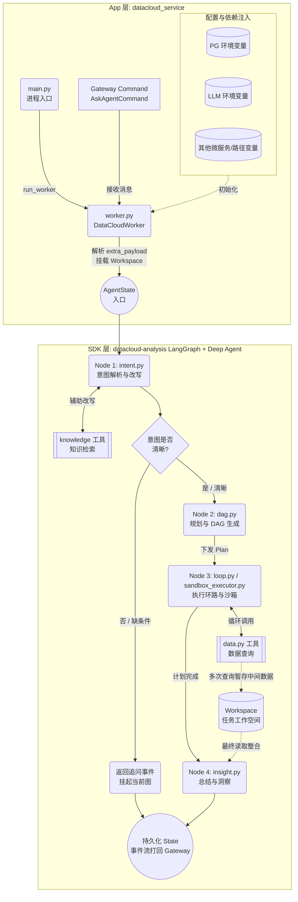

# DataCloud SDK 重构设计方案

## 1. 架构定位与应用入口

为了更好地实现应用侧（App）与 SDK 层（`datacloud-analysis`）的解耦，本次重构使用 `examples/e_commerce_demo/backend/datacloud_service` 作为标准的应用集成示例。

*   **统一入口**：通过应用侧的 `main.py` 作为服务的统一启动入口，负责解析最基础的环境变量，并调用 Gateway SDK 的 `run_worker` 启动进程。
*   **运行时桥梁**：通过应用侧的 `worker.py`（继承自 `GatewayWorker`）作为消息接收与处理的桥梁，负责将底层 Gateway 的指令（如 `AskAgentCommand`）转化为 SDK 层 Agent 所需的图输入与上下文。

## 2. 依赖注入与环境初始化 (Worker 层)

在 `worker.py` 初始化及构图 (`_build_graph`) 阶段，必须从环境变量向 SDK 明确提供构建 Agent 必需的核心配置：

1.  **PG 数据库环境**：注入给 `datacloud-analysis` 用于持久化存储或 Checkpoint 管理（例如 `POSTGRES_USER`, `POSTGRES_PASSWORD`, `POSTGRES_HOST`, `POSTGRES_PORT`, `POSTGRES_DB` 等）。
2.  **大模型环境**：注入给 `datacloud_analysis` 内的模型引擎，包括 LLM 基础请求地址与认证（如 `DATACLOUD_LLM_REASONING_MODEL`, `OPENAI_API_KEY`, `OPENAI_BASE_URL` 等）。
3.  **其他核心环境**：包括外部数据服务的路由、默认超时、多租户参数（如 `DATACLOUD_DATA_SERVICE_URL`, `DATACLOUD_KNOWLEDGE_GRAPH_FILES` 等），满足各项工具组件的初始化诉求。

## 3. 动态参数与工作空间集成 (运行时)

在执行具体任务（即 `worker.py` 的 `process_command` 方法中），需要动态提取消息携带的上下文并传递给 SDK：

### 3.1 提取与映射 Payload
基于传入的 `AskAgentCommand`，需要解析 `extra_payload` 字段：
```json
{
  "byAgentId": 10000002,
  "byAgentName": "DataCloud选操作型的数字员工",
  "userCode": "adminvip",
  "history": []
}
```
*   将 `byAgentId` 映射为本次图运行时的核心 Agent ID。
*   将 `byAgentName` 作为 Agent 名称，供日志和追踪使用。

### 3.2 挂载工作空间 (Workspace)
必须将从 Gateway SDK (或 `WorkspaceManager`) 获取到的本会话专属**工作空间路径**传入 `datacloud-analysis` 的 Agent 运行时（例如通过 `active_workspace` ContextVar 或是 State 传递），以便后续复杂数据查询时有地方落地文件。

### 3.3 扩展能力配置预留
对于 Agent 的核心驱动组件，目前采取**暂时硬编码 + 预留扩展点**的设计：
1.  **提示词 (Prompt)**
2.  **工具列表 (Tools)**
3.  **技能配置 (Skills)**

*设计约定*：上述三个要素在当前阶段可以通过图的工厂方法写死（默认加载 `knowledge`, `data_query`，以及默认的 System Prompt），但必须预留一个配置解析的方法（例如在图的初始化入口前，留出 `apply_plugins(agent_config)` 接口），后续可通过插件中心动态补充或覆盖。

---

## 4. Agent 核心流水线设计 (基于 LangGraph 与 Deep Agent 规范)

`packages/datacloud-analysis` 内部将彻底脱离“单节点全自动路由”的黑盒模式，严格遵循 `deepagents` + `langgraph` 的标准工作流规范，构建明确的 `StateGraph` (状态图)。

基于 `orchestration/` 目录结构，状态图的状态 (`AgentState`) 将通过 `TypedDict` 定义，并在各节点间流转。具体编排映射如下：

### 4.1 节点1：意图解析与改写 (`orchestration/intent.py`)
*   **动作**：作为图的入口节点，提取用户原始输入。主动调用 `knowledge` 工具（知识图谱）检索业务上下文（专有名词、指标定义）。
*   **数据流转**：结合检索到的知识，对用户的原始问题进行**结构化改写**，将改写后的问题与意图分类写入 `AgentState` 中。
*   **状态路由 (Conditional Edge)**：
    *   **分支 A (拦截追问)**：如果意图解析判定问题“缺维度”或“有歧义”，则通过条件边直接路由到 `insight.py` (或专用的终端节点)，直接抛出追问事件给前端，挂起当前图的执行。
    *   **分支 B (放行)**：如果意图明确，则路由到规划节点。

### 4.2 节点2：规划与 DAG 生成 (`orchestration/dag.py`)
*   **动作**：接收改写后的清晰问题，使用 `deepagents` 框架内部的规划能力或定制 Prompt，将大问题拆解为多个子任务（如需要查 A 表、再查 B 表）。
*   **数据流转**：生成的执行计划写入 `AgentState` 的 `plan` 字段，准备交由执行环路处理。

### 4.3 节点3：执行环路与工具调用 (`orchestration/loop.py` & `sandbox_executor.py`)
*   **动作**：根据计划，循环调用数据获取能力（`data.py` 等）。
*   **状态与工作空间 (Workspace)** 的结合：
    *   **3.1 多步聚合**：如果 DAG 规划出多次数据调用，`sandbox_executor` 中的工具执行时，**必须**将中间数据暂存至注入的 `TaskPaths`（沙箱工作空间中的 `temp` 或 `outputs` 目录），并在 `AgentState` 中记录文件路径。这是为了防止长下文超出 LLM 限制。
    *   **3.2 单次直出**：如果判断只需单次查询且结果轻量，结果可直接写入 `AgentState` 的临时上下文 `messages` 或 `observations` 中。

### 4.4 节点4：总结与洞察生成 (`orchestration/insight.py`)
*   **动作**：当执行环路完成所有计划后，图流转至最终节点。此节点将读取 `AgentState` 中的结果（如果是多步查询，则利用文件工具从 Workspace 读取聚合后的数据），并调用大模型生成最终的自然语言总结。
*   **收尾**：通过底层框架完成状态持久化（Checkpointer），并将结果以 Gateway 规定的 EventType 形式打回应用层。

---

## 5. 总体架构图

以下为基于前述设计的整体架构及数据流转图（包含应用层和 SDK 层的边界，以及 LangGraph 状态图的编排）：


