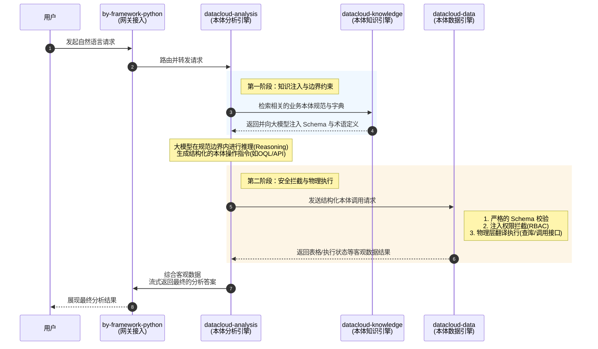
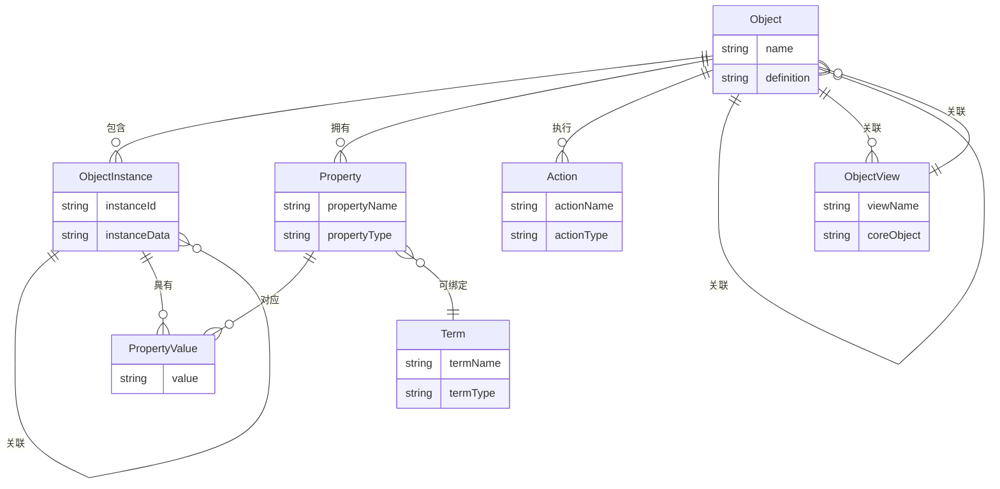

# 本体引擎重构方案

> 文档日期：2026-04-03  
> 参考实现：`D:\data\code\study\deepagents`  
> 当前版本：datacloud-analysis (3-node LangGraph pipeline)  
> 目标版本：datacloud-analysis v2 (Deep Agents Architecture)

---

## 1.概要设计


### 1.1核心设计目标

1、防止大模型推理幻觉。

2、防止越权及非法访问。

​	在这种架构下，`datacloud-analysis` 中的 LLM 绝对不会直接连接数据库执行 `Text-to-SQL`。大模型只面向高层的业务对象（由 `knowledge` 注入）生成结构化意图（`Text-to-OQL/API`），随后交由 `datacloud-data` 进行权限拦截与物理翻译。这一机制杜绝了越权查数与结构造假的问题。


### 1.2模块组成与定位

本系统借鉴了先进的本体驱动架构（如 Palantir AIP）的设计理念，旨在将大模型（LLM）的推理能力与底层物理数据严格隔离。系统由三个协作引擎组成，共同完成基于本体的智能问答，并依赖一个公共网关框架：

| 模块 | 定位 | 职责与核心价值 |
|------|------|------|
| **datacloud-analysis** | 本体分析引擎<br>*(大脑/编译器)* | **编排与翻译**：接收用户问题，结合本体知识将其转化为标准化的逻辑对象操作指令（如 OQL 或 API Tool Calls），并完成最终推理。它是大模型执行意图规划的中枢。<br>**对标概念**：*Palantir AIP Agent / AIP Logic*（负责语义路由与意图编译，将自然语言转化为本体操作链）。 |
| **datacloud-knowledge** | 本体知识引擎<br>*(世界观字典)* | **约束与 Schema 注入**：根据问题，提供业务实体的 Schema（对象、关系、动作）和术语定义。它负责为大模型提供确定性的“业务元数据”边界，防止幻觉与胡乱发散。<br>**对标概念**：*Palantir Ontology Registry*（提供企业的数字孪生结构定义，作为大模型防发散的安全护栏）。 |
| **datacloud-data** | 本体数据引擎<br>*(翻译器/执行网关)* | **隔离与物理转化**：这是 LLM 与物理层之间的绝对屏障。它接收标准结构化本体请求，内部细分为两条安全隔离的执行链路：<br>1. **Query Service (类似 Ontology Engine)**：专做“读”。负责只读的数据查询、聚合分析，强制注入数据权限过滤，并返回表格化结果。<br>2. **Action Service (类似 Action Framework)**：专做“写”。暴露可供 Agent 调用的具有“副作用”的工具（比如写回数据、调用外部审批 API），由纯代码执行严格的入参和业务规则校验。<br>**对标概念**：*Palantir Ontology Engine (读) & Action Framework (写)*。 |
| **by-framework-python** | 网关框架 | **基础通信**：项目公共网关，提供 HTTP 接入、SSE 流式输出、路由、认证等基础能力。 |


### 1.3**模块之间依赖**

```text
datacloud-analysis (编排中心 & LLM 推理)
├── datacloud-knowledge   # 提供上下文边界、术语字典与本体 Schema 注入
├── datacloud-data        # 承接结构化本体请求，负责拦截校验并转换为 SQL/API 执行
└── by-framework-python   # 基础架构，提供 HTTP/SSE 与网关接入
```


### 1.4协作流转流程

用户自然语言请求经由 **by-framework-python** 接入 → **datacloud-analysis** 接收请求，首先调用 **datacloud-knowledge** 检索并向大模型注入相关的业务本体规范与字典 → 大模型在规范边界内进行推理（Reasoning），生成结构化的本体操作调用 → 请求发送至 **datacloud-data** 进行严格的 Schema/权限校验与物理层执行（查库/调接口），并返回客观数据结果 → 最后由 **datacloud-analysis** 综合客观数据，流式返回最终的分析答案。



## 2 本体推理语言设计

### 2.1 本体概念

#### 2.1.1本体核心概念

对标 Palantir Ontology，我们将底层散乱的数据表和接口抽象为大模型可理解的八大核心基元：
| ***\*概念\****              | ***\*定义\****                                               | ***\*示例\****                                               |
| --------------------------- | ------------------------------------------------------------ | ------------------------------------------------------------ |
| 对象(Object)                | 对象指现实世界实体或事件的模式定义。                         | 员工、组织、项目合同...                                      |
| 对象实例（Object instance） | 对象实例指的是对象定义下的单个业务实例。                     | 员工:[“王小明”,“王大明”,“李白”]                              |
| 属性(Property)              | 属性是现实世界实体或事件的特征的模式定义。区分为<br />1.存储属性:普通属性.<br />2.计算属性:绑定一个Function需要动态计算获得.<br />3.关联属性:绑定外键对象,根据对象关系获得.<br />4.时序属性:绑定特定时序表,例如温度,是一个序列数组. | 员工：姓名、性别、工号...                                    |
| 属性值(Property value)      | 属性值是指对象或现实世界实体或事件的单个实例的属性值。       | 员工：姓名=》王小明、性别=》男、工号=》202034301...          |
| 关系(Link type)             | 关系是指两个对象之间关系的架构定义。                         | 员工 【归属】 组织员工 【加入】 项目                         |
| 动作(Action)                | 动作指对象上执行的业务动作单元，例如差旅单申请单申请单对象的[提交]动作。动作可分为datacloud内置的动作及业务动作两类：1、内置动作：针对一个对象，dataCloud默认会增强保存、加载、删除，该类动作可用不对用户可见。2、业务动作：由用户自动创建的，在对象上可用可见。 | 员工-查询员工资料员工-重置员工密码员工-调整员工组织...Action可分为原子Action、组 合Action，每个Action包含1个或多个Functions |
| 视图(Object View)           | 视图是指以某一业务对象为核心，关联各领域对象形成的对象集合。视图核心目标是简化对象间纵深的多跳关系。 | 员工视图：包含员工对象、员工出差申请对象、员工报销申请对象。 |
| 术语(term)                  | 领域内有专有名字，包括字典术语、列表术语。                   | 例如概念类术语：客户，实例类术语，中国移动。                 |


#### 2.1.2本体概念关系



### 2.2 OQL 协议标准 (Ontology Query Language)

#### 2.2.1 协议定位与设计原则

**OQL 的本质：语义工具调用协议，而非查询语言字符串。**

参考 Palantir AIP 的架构实践：LLM 不生成”查询语言字符串”，而是输出**结构化工具调用请求**——即填写预定义工具的强类型参数。OQL 就是这些工具参数的 JSON Schema 契约。

```
用户自然语言
     │
     ▼ datacloud-analysis（LLM 推理）
  OQL 工具调用（JSON）           ← 本协议定义的内容
     │
     ▼ datacloud-data（执行引擎）
  SQL / API / 向量检索
```

**OQL 的核心价值：**

| 原则 | 说明 |
|------|------|
| **语义隔离** | LLM 只使用本体名称（对象、属性、关系、动作），完全不接触物理表名、列名、外键、API 地址 |
| **数据源透明** | 一个对象的属性可能来自 SQL、外部查询 API、文档——LLM 完全不感知，只声明需要哪些属性，datacloud-data 负责联合执行并合并 |
| **防幻觉** | 所有 object_type / 属性名 / 关系名均在本体注册表中验证，捏造的名称直接被拒绝 |
| **读写隔离** | 查询（QueryObjects）与写操作（ExecuteAction）严格分离，无法混用 |
| **确定性翻译** | 每个 OQL 字段有且仅有一条翻译规则，相同输入永远产生相同执行结果 |
| **两层校验** | 第一层：JSON Schema 结构校验；第二层：本体注册表语义校验 |

**API 的两种角色（重要区分）：**

API 在系统中承担两种完全不同的角色，OQL 协议对两者的处理方式不同：

| 角色 | 类型 | 特征 | OQL 处理方式 |
|------|------|------|-------------|
| **查询 API（Query API）** | GET / 只读 | 无副作用，返回数据，是对象属性的数据来源之一 | 作为属性数据源，由 `QueryObjects` 触发时在 datacloud-data 中**透明调用**，LLM 不感知 |
| **动作 API（Action API）** | POST / PUT / DELETE | 有副作用，变更外部系统状态 | 通过 `ExecuteAction` 工具**显式调用**，LLM 必须明确选择此工具 |

> 核心规则：LLM **永远不会**在 OQL 中直接写 API 地址或决定走哪个数据源。查询 API 的调用由 `datacloud-data` 根据属性注册表自动决定；动作 API 的调用由 LLM 显式声明 `action_type`。

**正式规范文件：**
- JSON Schema 定义：`datacloud-analysis/docs/OQL.schema.json`
- 后端翻译规则：`datacloud-data/docs/OQL翻译规则方案设计.md`

---

#### 2.2.2 命名规范（Naming Convention）

LLM 在生成 OQL 时，所有名称必须**原样使用** `datacloud-knowledge` 注入的本体注册名，不得自行发明或转换格式。名称的语言与格式由业务本体定义决定（中文业务系统通常为中文名），OQL 照用即可。

| 本体元素 | OQL 中的字段 | 示例（中文业务系统） |
|---------|-------------|---------------------|
| 对象（Object）/ 视图（Object View） | `object_type` | `”员工”`、`”航班”`、`”员工视图”` |
| 属性（Property） | `select`、`where`、`order_by` 中的属性名 | `”姓名”`、`”延误时长”`、`”工号”` |
| 关系（Link type） | `include_links` 中的关系名 | `”归属组织”`、`”加入项目”` |
| 动作（Action） | `action_type` | `”重置密码”`、`”提交审批”`、`”调整组织”` |
| 术语（Term） | 条件值中的原始字符串 | `”中国移动”`、`”Q1”`、`”一线城市”` |

> **防幻觉原则**：LLM **禁止**凭空捏造对象名、属性名、关系名或动作名。所有名称必须出现在当次请求的知识注入上下文中，否则 datacloud-data 将以 `OQL_ERR_UNKNOWN_*` 系列错误码拒绝执行。

---

#### 2.2.3 类型系统（Type System）

本体属性类型在 OQL JSON 中的值表达规范：

| 本体属性类型 | JSON 值类型 | 合法示例 | 说明 |
|------------|-----------|---------|------|
| `String` | `string` | `”CA”` | |
| `Integer` | `number`（整数） | `30` | |
| `Float` | `number`（小数） | `3.14` | |
| `Boolean` | `boolean` | `true` | |
| `DateTime` | `string`（ISO 8601） | `”2026-04-01T00:00:00Z”` | 相对时间见 `relativeDate` 操作符 |
| `Date` | `string`（`YYYY-MM-DD`） | `”2026-04-01”` | |
| `Enum` | `string`（枚举值） | `”Delayed”` | 枚举值来自本体定义 |
| `ObjectReference` | `string`（主键 ID） | `”EMP-001”` | 引用另一对象实例的主键 |
| `Array` | `array` | `[“CA”, “MU”]` | 用于 `in` / `nin` 操作符 |

**`relativeDate` 操作符的有效时间表达式值：**

相对时间不是值类型，而是通过条件中 `op: “relativeDate”` 触发的展开机制。条件格式：
`{ “field”: “创建时间”, “op”: “relativeDate”, “value”: “this_month” }` → 后端展开为 `创建时间 BETWEEN '2026-04-01 00:00:00' AND '2026-04-30 23:59:59'`

| `value` 字符串 | 展开为 | 含义 |
|--------|--------|------|
| `”today”` | 当天 `00:00:00 ～ 23:59:59` | 今天 |
| `”-Nd”`（N为正整数） | 过去 N 天至今 | 如 `”-7d”` = 过去 7 天 |
| `”this_week”` | 本自然周一 ～ 周日 | 本周 |
| `”this_month”` | 本月 1 日 ～ 末日 | 本月 |
| `”this_quarter”` | 本季度首日 ～ 末日 | 本季度 |
| `”this_year”` | 本年 1 月 1 日 ～ 12 月 31 日 | 本年 |
| `”last_month”` | 上月 1 日 ～ 末日 | 上个月 |
| `”last_quarter”` | 上季度首日 ～ 末日 | 上个季度 |

---

#### 2.2.4 工具集总览

OQL 定义两个工具，覆盖本体操作的全部场景：

| 工具名 | 执行路由 | 适用场景 |
|--------|---------|---------|
| `QueryObjects` | → SQL `SELECT` / `GROUP BY` / 向量检索 / 外部查询 API | 查询对象或视图的实例列表、详情、聚合统计；是否聚合由参数中是否含 `metrics` 决定，属性数据源由 datacloud-data 透明路由 |
| `ExecuteAction` | → Python Function / 外部 API | 写操作、业务动作、触发副作用 |

单次调用格式：
```json
{ “tool”: “<工具名>”, “parameters”: { ... } }
```

多步调用格式（Pipeline）：
```json
[
  { “step_id”: “s1”, “tool”: “<工具名>”, “parameters”: { ... } },
  { “step_id”: “s2”, “tool”: “<工具名>”, “parameters”: { ..., “field”: { “$ref”: “s1.result[*].id” } } }
]
```

---

#### 2.2.5 QueryObjects（对象/视图查询）

**适用场景**：所有只读查询——实体列表、详情、关系漫游、聚合统计、趋势分析。`object_type` 可填 **Object 类型名**或 **View 名**，两者查询接口完全一致，datacloud-data 内部按本体注册表自动路由。

> **对标 Palantir**：Palantir OSDK 中 Object Type 和 Object View（Named Object Set）均返回同一个 `ObjectSet` 接口，支持相同的 `.filter()` / `.group_by()` / `.aggregate()` 链式调用。本设计与此一致——LLM 无需感知查的是 Object 还是 View。

> **数据源透明原则**：LLM 只声明 `object_type` 和属性名，datacloud-data 根据本体属性注册表自动决定每个属性走 SQL、外部查询 API 还是向量检索，并行执行后合并结果。LLM **无需**也**不能**指定数据来源。

> **聚合路由规则**：参数中包含 `metrics` 字段时，后端走聚合执行路径（`GROUP BY`）；否则走列表查询路径（`SELECT`）。

**参数字段：**

| 字段 | 类型 | 必填 | 默认值 | 适用模式 | 说明 |
|------|------|------|--------|---------|------|
| `object_type` | string | ✅ | — | 两种 | Object 类型名或 View 名（均在本体注册表中） |
| `select` | string[] | — | 全部非计算属性 | 列表模式 | 指定返回属性；含计算属性时后端调用绑定 Function |
| `where` | Condition[] | — | 无过滤 | 两种 | 行级过滤，条件数组，见下方条件格式说明；**API 主对象仅支持 `eq`/`in` 操作符**，其余操作符被后端静默忽略 |
| `include_links` | LinkClause[] | — | — | 列表模式（仅DB主对象） | 关系漫游，路径数组，见下方说明；聚合模式下禁用；**API 主对象不支持**，违反时报 `OQL_ERR_UNSUPPORTED_OPERATION` |
| `metrics` | Metric[] | — | — | 聚合模式 | 聚合指标数组，有此字段则触发聚合路径；每项含 `name`/`op`/`field` |
| `group_by` | GroupByClause[] | — | [] | 聚合模式 | 分组维度数组；时间字段加 `granularity` 即按时间粒度分组，省略则全局聚合 |
| `having` | Condition[] | — | — | 聚合模式 | 聚合后过滤，条件数组，`field` 引用 `metrics` 中的 `name` |
| `order_by` | OrderByClause[] | — | — | 两种 | 排序；每项含 `field` 和可选 `direction`（`"asc"`/`"desc"`，默认 `"asc"`）；聚合模式可引用 `metrics` 中的 key 名 |
| `limit` | integer | — | 列表:100 / 聚合:1000 | 两种 | 返回行数上限 |
| `offset` | integer | — | 0 | 列表模式 | 分页偏移量 |

---

**条件格式（Condition）：**

每个条件是一个扁平对象 `{ “field”, “op”, “value” }`，数组根节点条件间默认 AND。

| `op` 值 | SQL 翻译 | `value` 类型 | 示例 |
|---------|----------|-------------|------|
| `eq` | `= ?` | 标量 | `{ “field”: “状态”, “op”: “eq”, “value”: “延误” }` |
| `ne` | `<> ?` | 标量 | `{ “field”: “状态”, “op”: “ne”, “value”: “正常” }` |
| `gt` | `> ?` | 数值/日期 | `{ “field”: “延误时长”, “op”: “gt”, “value”: 30 }` |
| `gte` | `>= ?` | 数值/日期 | |
| `lt` | `< ?` | 数值/日期 | |
| `lte` | `<= ?` | 数值/日期 | |
| `in` | `IN (...)` | 数组 | `{ “field”: “航空公司”, “op”: “in”, “value”: [“CA”, “MU”] }` |
| `nin` | `NOT IN (...)` | 数组 | `{ “field”: “状态”, “op”: “nin”, “value”: [“取消”] }` |
| `like` | `LIKE ?` | string，支持 `%` | `{ “field”: “姓名”, “op”: “like”, “value”: “王%” }` |
| `isNull` | `IS NULL` / `IS NOT NULL` | boolean | `{ “field”: “备注”, “op”: “isNull”, “value”: true }` |
| `between` | `BETWEEN ? AND ?` | `[min, max]` | `{ “field”: “年龄”, “op”: “between”, “value”: [20, 40] }` |
| `relativeDate` | 展开为绝对时间范围 | 时间表达式字符串 | `{ “field”: “创建时间”, “op”: “relativeDate”, “value”: “this_month” }` |

相对时间表达式：`”today”` / `”-Nd”`（过去N天）/ `”this_week”` / `”this_month”` / `”this_quarter”` / `”this_year”` / `”last_month”` / `”last_quarter”`

**逻辑分组**：需要跨字段 OR / NOT 时，在数组中嵌入分组条件对象：

| 结构 | 说明 |
|------|------|
| `{ “logic”: “or”, “conditions”: [ ... ] }` | OR 分组，`conditions` 内的条件任一成立 |
| `{ “logic”: “not”, “condition”: { ... } }` | NOT，对单个条件取反 |

> **使用原则**：同一字段的多值匹配用 `op: in`（如 `航空公司 in [CA, MU]`），**不要**用 `logic: or`。`logic: or` 仅用于**不同字段**之间的 OR（如”状态为延误 OR 延误时长超过120分钟”）。

后端**仅接受**此表中的 `op` 值，其余一律以 `OQL_ERR_INVALID_OPERATOR` 拒绝。

---

**关系漫游格式（LinkClause）：**

`include_links` 为平铺路径数组，用 `.` 分隔多跳关系，最大深度 5 跳：

```json
“include_links”: [
  { “path”: “归属组织”,         “select”: [“组织名称”, “级别”] },
  { “path”: “归属组织.上级组织”, “select”: [“组织名称”] }
]
```

| 字段 | 必填 | 说明 |
|------|------|------|
| `path` | ✅ | 关系路径，单跳直接写关系名，多跳用 `.` 连接 |
| `select` | — | 该跳对象返回的属性列表，省略则返回全部非计算属性 |

---

**`metrics` 聚合函数枚举：**

`metrics` 为数组，每项 `{ “name”, “op”, “field” }`，`name` 为结果列名（供 `having`、`order_by` 引用）：

| op | `field` 必填 | SQL 翻译 | 示例 |
|----|-------------|----------|------|
| `count` | 否 | `COUNT(*)` | `{ “name”: “总数”, “op”: “count” }` |
| `count_distinct` | ✅ | `COUNT(DISTINCT field)` | `{ “name”: “去重乘客数”, “op”: “count_distinct”, “field”: “乘客ID” }` |
| `sum` | ✅ | `SUM(field)` | `{ “name”: “总收入”, “op”: “sum”, “field”: “收入” }` |
| `avg` | ✅ | `AVG(field)` | `{ “name”: “平均延误”, “op”: “avg”, “field”: “延误时长” }` |
| `max` | ✅ | `MAX(field)` | `{ “name”: “最大延误”, “op”: “max”, “field”: “延误时长” }` |
| `min` | ✅ | `MIN(field)` | `{ “name”: “最小延误”, “op”: “min”, “field”: “延误时长” }` |

**`group_by` 分组维度格式（GroupByClause）：**

`group_by` 统一替代原 `dimensions` 和 `time_dimension`，每项 `{ field, granularity? }`：

| 字段 | 必填 | 说明 |
|------|------|------|
| `field` | ✅ | 分组属性名 |
| `granularity` | — | 时间分组粒度（仅时间字段适用）：`”day”` / `”week”` / `”month”` / `”quarter”` / `”year”`；省略则按原始值分组 |

```json
“group_by”: [
  { “field”: “航空公司” },
  { “field”: “起飞时间”, “granularity”: “week” }
]
```

---

**示例 1：列表查询（Object，含 OR 条件和关系漫游）**
```json
{
  “tool”: “QueryObjects”,
  “parameters”: {
    “object_type”: “航班”,
    “select”: [“航班号”, “状态”, “延误时长”, “航空公司”],
    “where”: [
      { “field”: “状态”,    “op”: “in”,           “value”: [“延误”, “取消”] },
      { “field”: “起飞时间”, “op”: “relativeDate”, “value”: “this_month” },
      { “field”: “航空公司”, “op”: “in”,           “value”: [“CA”, “MU”] }
    ],
    “include_links”: [
      { “path”: “执飞机组”, “select”: [“机组姓名”, “联系电话”] },
      { “path”: “执飞机组.资质证书”, “select”: [“证书类型”, “到期日期”] }
    ],
    “order_by”: [{ “field”: “延误时长”, “direction”: “desc” }],
    “limit”: 20,
    “offset”: 0
  }
}
```

**示例 2：列表查询（View，无需写关系漫游）**
```json
{
  “tool”: “QueryObjects”,
  “parameters”: {
    “object_type”: “员工视图”,
    “select”: [“工号”, “姓名”, “部门”, “出差次数”, “报销总额”],
    “where”: [
      { “field”: “部门”, “op”: “eq”, “value”: “研发部” }
    ],
    “limit”: 50
  }
}
```

> `员工视图` 是预定义视图，已在本体中关联了员工、出差申请、报销申请对象。LLM 无需写 `include_links`，datacloud-data 自动按视图定义展开多跳关联。

**示例 3：聚合统计（有 `metrics` 则触发聚合路径）**
```json
{
  “tool”: “QueryObjects”,
  “parameters”: {
    “object_type”: “航班”,
    “where”: [
      { “field”: “状态”,    “op”: “eq”,           “value”: “延误” },
      { “field”: “起飞时间”, “op”: “relativeDate”, “value”: “this_month” }
    ],
    “metrics”: [
      { “name”: “航班总数”, “op”: “count” },
      { “name”: “平均延误”, “op”: “avg”, “field”: “延误时长” },
      { “name”: “最大延误”, “op”: “max”, “field”: “延误时长” }
    ],
    “group_by”: [
      { “field”: “航空公司” },
      { “field”: “起飞时间”, “granularity”: “week” }
    ],
    “having”: [
      { “field”: “航班总数”, “op”: “gt”, “value”: 50 }
    ],
    “order_by”: [{ “field”: “平均延误”, “direction”: “desc” }],
    “limit”: 20
  }
}
```

---

#### 2.2.6 ExecuteAction（动作执行）

**适用场景**：触发有副作用的业务动作——写操作、状态变更、调用动作类 API。如”将CA123改签至明天10点”、”批量发送延误通知”、”提交审批单”。

> **关键区分**：`ExecuteAction` 专门处理**有副作用的操作**。外部 API 中的**查询类（GET）API** 作为对象属性数据源，由 `QueryObjects` 透明调用，**不属于** `ExecuteAction` 的职责范围。
>
> LLM **禁止**使用 QueryObjects 执行写操作。所有业务突变必须通过 ExecuteAction，后端由 Action Service 负责权限拦截和事务保障。

**ExecuteAction 覆盖的副作用类型：**

| 副作用类型 | 描述 | 示例 |
|-----------|------|------|
| `db_write` | 数据库写操作（INSERT / UPDATE / DELETE） | 更新航班状态、写入审批记录 |
| `action_api` | 动作类外部 API（POST / PUT / DELETE），变更外部系统状态 | 调用 ERP 接口提交工单、向 CRM 写入跟进记录 |
| `func_call` | 内部 Python Function，执行复杂业务逻辑 | 计算并更新员工绩效分、触发规则引擎 |
| `notify` | 系统通知 / 消息推送 | 发送 SMS 延误通知、推送站内消息 |

**参数字段：**

| 字段 | 类型 | 必填 | 说明 |
|------|------|------|------|
| `action_type` | string | ✅ | 本体中注册的动作名（与本体注册名保持一致，中文系统用中文），对应动作注册表中的一条记录 |
| `target_objects` | string[] | 条件必填 | 动作作用的实体主键 ID 列表；对象级动作必填，全局动作可省略 |
| `payload` | object | 条件必填 | 动作所需的业务参数，由本体动作注册表的 Schema 定义必填项和类型 |

**示例 1：数据库写操作**
```json
{
  “tool”: “ExecuteAction”,
  “parameters”: {
    “action_type”: “航班改签”,
    “target_objects”: [“CA123”, “CA456”],
    “payload”: {
      “新起飞时间”: “2026-04-05T10:00:00Z”,
      “改签原因”: “天气原因”
    }
  }
}
```

**示例 2：调用外部动作 API**
```json
{
  “tool”: “ExecuteAction”,
  “parameters”: {
    “action_type”: “提交ERP工单”,
    “target_objects”: [“ASSET-001”],
    “payload”: {
      “工单类型”: “维修”,
      “优先级”: “高”,
      “描述”: “发动机异常需检修”
    }
  }
}
```

**后端执行流程：**
1. 查本体动作注册表，获取 `action_type` 的 Schema（参数定义、权限要求、副作用执行链）
2. JSON Schema 校验 `payload`；失败立即返回 `OQL_ERR_ACTION_INVALID_PARAMS`，不执行任何副作用
3. RBAC 校验：验证当前用户是否有权对 `target_objects` 中的每个实体执行此动作
4. 按副作用链顺序执行（`db_write` → `action_api` → `func_call` → `notify`），每步均可配置回滚
5. 返回每个 target 的执行状态：`{ “CA123”: “success”, “CA456”: { “status”: “failed”, “reason”: “...” } }`

---

#### 2.2.7 OQL Pipeline（多步链式组合）

**适用场景**：一个用户问题需要多步协作完成。如”找出本月延误最多的10个航班，查对应机型的延误处置手册，并发送通知给机组”。

LLM 输出有序数组，后端顺序执行，每步可通过 `$ref` 引用前序步骤的结果：

```json
[
  {
    “step_id”: “s1”,
    “tool”: “QueryObjects”,
    “parameters”: {
      “object_type”: “航班”,
      “select”: [“航班号”, “航空公司”, “延误时长”, “机型”],
      “where”: [
        { “field”: “状态”,    “op”: “eq”,           “value”: “延误” },
        { “field”: “起飞时间”, “op”: “relativeDate”, “value”: “this_month” }
      ],
      “order_by”: [{ “field”: “延误时长”, “direction”: “desc” }],
      “limit”: 10
    }
  },
  {
    “step_id”: “s2”,
    “tool”: “QueryObjects”,
    “parameters”: {
      “object_type”: “操作手册”,
      “select”: [“标题”, “内容摘要”, “处置步骤”],
      “where”: [
        { “field”: “机型”,     “op”: “in”, “value”: { “$ref”: “s1.result[*].机型” } },
        { “field”: “文档类型”, “op”: “eq”, “value”: “延误处置” }
      ]
    }
  },
  {
    “step_id”: “s3”,
    “tool”: “ExecuteAction”,
    “parameters”: {
      “action_type”: “发送延误通知”,
      “target_objects”: { “$ref”: “s1.result[*].航班号” },
      “payload”: {
        “通知类型”: “短信”,
        “模板”: “延误致歉”
      }
    }
  }
]
```

> **说明**：非结构化知识（如操作手册）须在 `datacloud-knowledge` 中建立本体对象类型（如 `OperationManual`），由 `datacloud-data` 在执行层路由到向量检索后端，对 LLM 透明。非结构化知识**不**作为独立 OQL 工具暴露。

**`$ref` 引用语法：**

| 表达式 | 含义 | 结果类型 |
|--------|------|---------|
| `{ “$ref”: “s1.result[*].航班号” }` | s1 步所有结果行的 `航班号`，去重后展开为数组 | list |
| `{ “$ref”: “s1.result[0].航班号” }` | s1 步第一行的 `航班号`（标量） | scalar |

> **注意**：`$ref` 表达式必须以 `.字段名` 结尾，不支持 `s1.result[*]`（取完整行数组）。若需要完整行，请在后续步骤中使用 `include_links` 或多字段 select。

**后端执行规则：**
1. 顺序执行每个步骤（最多 **10 步**，超出报 `OQL_ERR_PIPELINE_TOO_LONG`），前序步骤完成前后续步骤不启动
2. 每步执行前，递归替换参数中所有 `$ref` 为前序步骤的实际结果值
3. 若某步执行失败，整个 Pipeline 终止并返回错误（当前实现不支持跳步继续）
4. `$ref` 引用的列表为空时，对应的 `in` 条件翻译为 `1=0`，快速返回空结果，不报错
5. 返回全部步骤的结果字典，调用方通常取最后一步

---

#### 2.2.8 响应格式标准

所有 OQL 调用统一返回以下格式：

> **格式转换说明**：`datacloud-data` 内部 `OqlRouter.route()` 返回 `list[dict]`（每行是 `{字段名: 值}` 字典）。HTTP 接入层（`/oql/execute` 端点）负责将 `list[dict]` 转换为 `{ columns, rows, total, returned }` 格式后返回给调用方。`total` 由执行层通过额外的 `COUNT(*)` 查询获得（DB 对象）或由 API 响应元数据提供。

**成功响应：**
```json
{
  “status”: “success”,
  “tool”: “QueryObjects”,
  “result”: {
    “columns”: [“航班号”, “状态”, “延误时长”],
    “rows”: [
      [“CA123”, “延误”, 45],
      [“MU456”, “延误”, 32]
    ],
    “total”: 128,
    “returned”: 2,
    “pagination”: {
      “limit”: 20,
      “offset”: 0,
      “has_next”: true
    }
  }
}
```

**错误响应：**
```json
{
  “status”: “error”,
  “error_code”: “OQL_ERR_UNKNOWN_OBJECT_TYPE”,
  “message”: “对象类型 'Flightt' 未在本体中注册，请检查拼写后重试”,
  “detail”: { “object_type”: “Flightt” }
}
```

**错误码参考表：**

| 错误码 | 触发条件 | LLM 应对策略 |
|--------|---------|-------------|
| `OQL_ERR_SCHEMA_INVALID` | OQL JSON 不符合 JSON Schema 结构规范 | 检查字段名/类型/必填项，修正结构后重试 |
| `OQL_ERR_UNKNOWN_OBJECT_TYPE` | object_type 不在本体注册表 | 根据错误 message 中的提示，修正 object_type 拼写后重试；若 context 无相关 Schema，告知用户该对象暂不支持查询 |
| `OQL_ERR_UNKNOWN_PROPERTY` | 属性名不属于该 object_type | 根据 context 中已注入的 Schema 修正属性名后重试 |
| `OQL_ERR_UNKNOWN_LINK` | include_links 中的关系名不存在 | 根据 context 中已注入的 Schema 修正关系名后重试 |
| `OQL_ERR_UNSUPPORTED_OPERATION` | API 主对象使用了 metrics 或 include_links | 聚合和关联查询只支持 DB 对象；API 对象仅支持列表查询 |
| `OQL_ERR_INVALID_OPERATOR` | where 中使用了非法操作符 | 查看操作符参考表，使用合法操作符 |
| `OQL_ERR_TYPE_MISMATCH` | 属性值类型与本体类型定义不符 | 检查类型系统表，修正值的格式 |
| `OQL_ERR_UNSUPPORTED_FILTER` | where/order_by 引用了非 SQL 属性（query_api/document 类型不可过滤） | 移除该过滤条件，改用 sql 类型属性过滤；或在结果层筛选 |
| `OQL_ERR_UNKNOWN_ACTION` | action_type 不在本体注册表 | 根据错误 message 中的提示修正 action_type 后重试；若 context 无相关 Schema，告知用户该动作暂不支持 |
| `OQL_ERR_ACTION_INVALID_PARAMS` | payload 未通过动作 Schema 校验 | 根据错误 detail 中的字段校验信息修正 payload 后重试 |
| `OQL_ERR_PERMISSION_DENIED` | 当前用户无权执行该操作 | 告知用户权限不足，不重试 |
| `OQL_ERR_LINK_TOO_DEEP` | include_links 嵌套超过 5 跳 | 拆分为多步 Pipeline，每步控制跳数 |
| `OQL_ERR_QUERY_API_UNAVAILABLE` | Query API 数据源全部不可用（fallback=null 时） | 稍后重试或告知用户该属性数据暂不可用 |
| `OQL_ERR_PIPELINE_TOO_LONG` | Pipeline 步骤数超过 10 步 | 精简步骤数，或将部分步骤改为 include_links 关联 |
| `OQL_ERR_INVALID_REF` | `$ref` 表达式语法错误（不符合 `{step_id}.result[*\|N].{field}` 格式） | 检查 $ref 语法，字段名不能省略 |
| `OQL_ERR_REF_STEP_NOT_FOUND` | `$ref` 引用的 step_id 不存在或尚未执行 | 检查 step_id 名称，确保引用的步骤在当前步骤之前 |
| `OQL_ERR_REF_INDEX_OUT_OF_RANGE` | `$ref` 中 `result[N]` 的 N 超出步骤结果行数 | 检查上步骤结果行数，或改用 `result[*]` |
| `OQL_ERR_UNSUPPORTED_SOURCE_TYPE` | 对象的 source_type 既非 DB 也非 API（如未映射类型） | 检查本体注册表中该对象的数据源类型配置 |


---

## 3模块设计

### 3.1本体分析引擎(datacloud-analysis)

#### 3.1.1 重构目标与原则

##### 3.1.1.1 驱动问题

| # | 当前痛点 | 表现 | 根因 |
|---|---------|------|------|
| P1 | Context 溢出 | 长任务 LLM 截断关键中间结果 | 所有工具输出堆积在单一消息链，仅靠滑动窗口缓解 |
| P2 | 无结构化规划 | 复杂多步任务 LLM 跳步/重复调用 | 规划靠 system prompt 约束，无强制执行机制 |
| P3 | 技能加载瓶颈 | 技能多时系统提示过长，质量下降 | 全量注入：所有 skill_*.py 描述在编译时一次注入 |
| P4 | 无子任务隔离 | 单工具失败污染整个执行上下文 | 所有任务共享同一 ReAct 消息链 |
| P5 | 代码执行能力弱 | 复杂 Python 分析只能靠单文件 sandbox | code_exec 工具无文件系统支持、无会话状态 |
| P6 | 扩展模式不统一 | 工具注入、插件、hook 三套机制并存 | 缺乏统一的能力扩展接口（middleware 模式） |

##### 3.1.1.2 重构原则

1. **以 `create_deep_agent()` 为核心**：完全替换自研 StateGraph 组装逻辑，借用 Deep Agents SDK 的中间件栈
2. **删多于增**：`orchestration/` 目录整体删除，用更少的代码实现更强的能力
3. **保留 Gateway 适配层不变**：worker.py 的 LRU 缓存、SSE 流式、Resume 机制继续沿用
4. **6001 协议兼容**：新架构必须维持现有 gateway 输出格式（6001 结构化数据块）不变
5. **checkpointing 兼容**：沿用 OpenGauss 作为 checkpoint 后端

---

#### 3.1.2 架构全景对比

##### 3.1.2.1 当前架构

```
┌──────────────────────────────────────────────────────────────────┐
│ worker.py                                                        │
│  AskAgentCommand → 技能加载 → 图编译(LRU) → _stream_graph()      │
└───────────────────────────────┬──────────────────────────────────┘
                                │ graph.astream_events()
┌───────────────────────────────▼──────────────────────────────────┐
│ StateGraph (graph_builder.py)                                    │
│                                                                  │
│  START                                                           │
│    │                                                             │
│    ▼                                                             │
│  [intend_node]                                                   │
│    ├─ CommandRouter.try_dispatch()  → (handled) command_done─► END│
│    └─ IntentClassifier.classify()                                │
│         │                                                        │
│    ▼ execution_status="execution"                                │
│  [execution_node]                                                │
│    ├─ 构建工具列表 (ask_user + code_exec + file_io + skills...)   │
│    └─ run_react_loop()  ← 滑动窗口 + 手动截断                    │
│         │                                                        │
│    ▼ react_final                                                 │
│  [respond_node]                                                  │
│    └─ format_result() → emit 6001 chunks                        │
│         │                                                        │
│    ▼                                                             │
│  END                                                             │
└──────────────────────────────────────────────────────────────────┘

状态 AgentState (77+ 字段，大部分手工维护)
技能加载：worker.py 动态 import skill_*.py → 全量注入工具描述
```

##### 3.1.2.2 目标架构（Deep Agents v2）

```
┌──────────────────────────────────────────────────────────────────┐
│ worker.py（精简后）                                               │
│  AskAgentCommand                                                 │
│    ├─ CommandPluginManager.handle() → (handled) 直接返回         │
│    └─ create_deep_agent_wrapper() → compiled_graph (LRU)        │
│         → _stream_graph()                                        │
└───────────────────────────────┬──────────────────────────────────┘
                                │ graph.astream_events()
┌───────────────────────────────▼──────────────────────────────────┐
│ create_deep_agent()  [deepagents SDK]                            │
│                                                                  │
│  Middleware Stack (有序叠加):                                     │
│  ┌────────────────────────────────────────────────┐             │
│  │ 0. KnowledgeInjectionMiddleware                │  (自定义)   │
│  │    ← 每次用户消息前自动检索并注入本体 Schema      │             │
│  │ 1. TodoListMiddleware     ← 显式规划            │             │
│  │ 2. SkillsMiddleware       ← SKILL.md 渐进发现   │             │
│  │ 3. FilesystemMiddleware   ← ls/read/write/edit  │             │
│  │ 4. SubAgentMiddleware     ← task 工具            │             │
│  │ 5. SummarizationMiddleware ← 自动上下文压缩      │             │
│  │ 6. DatacloudOutputMiddleware ← 6001 流式输出    │  (自定义)   │
│  │ 7. HumanInTheLoopMiddleware  ← 人工审批         │             │
│  │ 8. MemoryMiddleware       ← AGENTS.md 长期记忆  │             │
│  └────────────────────────────────────────────────┘             │
│                                                                  │
│  主 Agent 工具（直接持有，零 LLM 跳转）：                          │
│  query_objects / execute_action                                  │
│  emit_result（由 DatacloudOutputMiddleware.get_tools() 动态注入） │
│                                                                  │
│  SubAgents（仅用于需要独立推理循环的重型任务）：                    │
│  ┌──────────────────────────────────────────────────┐           │
│  │  CodeExecutorSubAgent ← execute + file 工具      │           │
│  └──────────────────────────────────────────────────┘           │
│                                                                  │
│  Backend:  DatacloudBackend(workspace_dir)                      │
│  Context:  DatacloudContext(gateway_ctx, agent_id, locale, ...) │
│  Checkpointer: OpenGauss (沿用)                                  │
└──────────────────────────────────────────────────────────────────┘

状态 AgentState (deepagents 标准) + DatacloudContext (context_schema)
技能加载：SkillsMiddleware → SKILL.md → 渐进注入系统提示
```

---

#### 3.1.3 核心设计决策

##### Decision 1：彻底删除 `orchestration/` 目录

| 当前组件 | 替代方案 | 理由 |
|---------|---------|------|
| `graph_builder.py` | `create_deep_agent()` | Deep Agents SDK 提供完整图组装逻辑 |
| `state.py` (77字段) | `AgentState` + `DatacloudContext` | 大部分字段是手工补丁，SDK 原生管理 |
| `intend/intent_classifier.py` | System Prompt 引导 | 意图分类不需要额外 LLM 调用；主模型足够判断 |
| `intend/command_router.py` | worker.py 前置处理 | 命令路由在进入 agent 之前处理更干净 |
| `execution/react_loop.py` | Deep Agents 内置循环 | SDK 的循环包含 Summarization、子代理、文件系统 |
| `execution/tool_wrapper.py` | Middleware 模式 | `reason` 字段注入 → 在 `DatacloudOutputMiddleware` 或系统提示实现 |
| `respond/formatter.py` | `DatacloudOutputMiddleware` | 6001 格式化封装为中间件，不再是独立节点 |
| `shared/contracts.py` | 废弃（状态由 SDK 托管） | `PlanTask` 等结构不再需要手工传递 |

##### Decision 2：用 `context_schema` 传递 Gateway 上下文

当前系统通过 `config["configurable"]["gateway_context"]` 传递 gateway 对象，这是非类型安全的字典访问。  
新系统使用 Deep Agents 的 `context_schema` 参数，定义 `DatacloudContext` TypedDict，由 SDK 确保类型安全并自动注入到每个节点。

##### Decision 3：6001 输出协议通过自定义 Tool 实现

Deep Agents 的代理以 **自然语言** 或 **结构化 JSON（response_format）** 结束。  
但 datacloud gateway 需要特定的 `6001` 分块流式格式（columns + rows + pagination）。

**方案**：保留 `emit_result` 工具（类似当前 `finish_react`），封装进 `DatacloudOutputMiddleware`：
- 代理调用 `emit_result(result_type, data/file_path)` 作为最终步骤
- 中间件拦截此调用 → 触发 6001 分块 → 通过 `gateway_context` 发送
- Worker.py 监听到 `emit_result` 调用后标记任务完成

##### Decision 4：命令路由前置到 worker.py

当前 intend 节点的 `CommandRouter` 处理 ext_command（如技能调用、翻页指令），这些是结构化的非自然语言指令。  
在 Deep Agents 架构中，将这些命令在 **进入 agent 之前** 在 worker.py 处理，不进入 agent 图，保持图的干净。

##### Decision 5：技能从 Python 动态加载 → SKILL.md 渐进发现

| 维度 | 当前 skill_*.py | 新 SKILL.md |
|------|---------------|------------|
| 加载方式 | worker.py 动态 import，注入为工具 | SkillsMiddleware 读取 SKILL.md，注入系统提示 |
| Token 成本 | 全量：技能越多系统提示越大 | 渐进：主提示只含技能名+摘要；详情按需读取 |
| 技能数量上限 | ~20个（受 context 限制） | 数百个（渐进发现无上限） |
| 执行方式 | Python callable 直接调用 | 通过 `execute` 工具运行 Python 脚本 |
| 动态性 | 编译时注入，每次需重编译图 | 运行时读取，技能更新无需重编译 |

##### Decision 6：代码执行能力升级为 CodeExecutorSubAgent

当前 `code_exec.py` 是一个 stateless sandbox，每次执行互不相关。  
新系统将代码执行封装为 **独立 SubAgent**，拥有独立文件系统上下文，支持：
- 多文件 Python 项目（write → edit → execute）
- 中间结果持久化（不丢失）
- 完整的 pip 包环境（通过 SandboxBackend）

##### Decision 7：本体知识注入由 KnowledgeInjectionMiddleware 独立承担，不暴露 knowledge 工具

| 方式 | 触发时机 | 适用场景 |
|------|---------|---------|
| **KnowledgeInjectionMiddleware** | 用户消息进入前自动触发，基于消息内容检索相关 Schema 注入 system prompt | 覆盖全量场景；LLM 推理前就持有正确 Schema，从源头防幻觉 |
| ~~knowledge_tool（兜底）~~ | ~~LLM 推理中主动调用~~ | **不采用**：见下方说明 |

**不暴露 knowledge_tool 的理由**：
1. **幻觉的根源相同**：不知道对象类型名称的 LLM，同样不知道该用什么参数调 `knowledge_tool`——两者面对同一个信息盲点
2. **错误码已提供修正路径**：OQL 返回 `OQL_ERR_UNKNOWN_OBJECT_TYPE / OQL_ERR_UNKNOWN_PROPERTY` 时，错误 message 中已经含有足够描述，LLM 应修正参数重试，而非再绕一圈调工具
3. **Middleware 已覆盖注入时机**：每次用户消息前自动检索注入，注入是预处理行为，不需要 LLM 循环内的工具调用

**OQL 出错时的标准处理策略**：直接根据错误码 + message 修正参数重试，不需要额外工具调用。

KnowledgeInjectionMiddleware 在每次用户消息到达时：
1. 对消息文本做分词/语义匹配，提取可能涉及的对象名、属性名、术语
2. 调用 `datacloud-knowledge` 检索相关 Schema
3. 将结果作为 `<ontology_context>` 块追加到 system prompt

这与 §1.4 时序图中"检索并向大模型**注入** Schema"的描述一致——注入是预处理行为，不是 LLM 循环内的工具调用。

##### Decision 8：emit_result 是 LLM 触发结构化输出的唯一出口

`emit_result` 是 LLM 将数据输出到前端的**唯一信号工具**。LLM 无法直接向前端"打印"结构化表格，必须通过调用此工具，`DatacloudOutputMiddleware` 拦截后将数据转换为 6001 协议分块流发送给 Gateway。

`emit_result` 由 `DatacloudOutputMiddleware.get_tools()` 在运行时动态注入到主 Agent（带 `gateway_context` 闭包），**不**在 `create_deep_agent(tools=[...])` 中静态声明。两者同名工具只保留 middleware 提供的版本，不能在 `tools=[]` 中再声明同名的静态版本，否则产生冲突。

##### Decision 9：与网关 by-framework-python 的中断与恢复机制

Agent 在执行过程中存在三种需要与网关协作的场景：**HumanInTheLoop 中断**、**客户端取消**、**会话断线重连**。

###### 9.1 HumanInTheLoop 中断与恢复

当 Agent 遇到 `interrupt_on` 配置的工具（如 `execute`）时，Deep Agents SDK 暂停执行，将当前状态持久化到 OpenGauss checkpointer，并向上层抛出 `InterruptEvent`。

```
Agent 执行流
  │
  ├── 遇到 interrupt_on 配置的工具调用
  │     └── SDK 暂停，持久化状态到 OpenGauss（thread_id 为 key）
  │           └── 抛出 InterruptEvent { thread_id, interrupt_id, pending_tool, args }
  │
  ▼
worker.py（_stream_graph）
  └── 捕获 InterruptEvent → 通过 SSE 发送 6001 interrupt chunk 到 Gateway
        └── 格式：{ type: "interrupt", interrupt_id, message: "是否确认执行代码？", args }

Gateway（by-framework-python）
  └── 转发 interrupt chunk → 前端展示确认弹窗
        └── 用户点击确认/拒绝 → 前端调用 Resume API（POST /agent/resume）
              └── 请求体：{ thread_id, interrupt_id, approved: true/false, note: "..." }

worker.py（Resume 入口）
  └── 调用 graph.ainvoke({ "resume": { interrupt_id, approved, note } }, thread_id)
        └── SDK 从 checkpointer 恢复状态，继续执行（approved=true）或取消该工具调用（false）
```

###### 9.2 客户端取消（Cancel）

客户端主动取消（关闭 SSE / 调用取消接口）时，Gateway 需要向 Agent 传播取消信号：

```
前端关闭 SSE 连接 / 调用 DELETE /agent/{thread_id}
  │
  ▼
Gateway（by-framework-python）
  └── 检测连接断开 / 收到取消请求
        └── 调用 worker.cancel(thread_id)
              └── 取消当前 astream_events() 的 asyncio Task（task.cancel()）
                    └── Agent 执行中止，当前轮次状态不写入 checkpointer（保留上一轮完整状态）
```

> **设计要点**：取消只中断当前轮次，不清除历史 checkpoint；下次用户发消息时，Agent 从上一轮完整状态继续。

###### 9.3 会话断线重连（Resume from Checkpoint）

SSE 连接断开后重连，或前端刷新页面，Agent 应从上次 checkpoint 恢复会话上下文：

```
前端重连 / 刷新
  │
  ▼
Gateway 收到新请求，携带 thread_id（会话标识，由 Gateway 维护，存于 cookie/header）
  │
  ▼
worker.py
  └── graph.astream_events(new_message, config={ "thread_id": thread_id })
        └── Deep Agents SDK 从 OpenGauss 加载该 thread 的历史状态（Messages + AgentState）
              └── 继续对话，历史上下文完整保留
```

###### 9.4 thread_id 的维护职责

| 角色 | 职责 |
|------|------|
| **by-framework-python（Gateway）** | 为每个用户会话生成并维护 `thread_id`，随请求传入 worker |
| **worker.py** | 将 `thread_id` 传入 `create_deep_agent` 的 `config`，作为 checkpointer 的 key |
| **OpenGauss checkpointer** | 以 `thread_id` 为 key 持久化 AgentState，支持跨请求状态恢复 |
| **HumanInTheLoop** | `interrupt_id` 与 `thread_id` 绑定，Resume API 须同时携带两者 |

##### Decision 10：大数据量分页——query_objects 自动落文件，getFileByPage 前置命令直接翻页

###### 10.1 问题背景

OQL 查询结果数据量可能很大（千行以上），前端每次翻页若走 LLM 推理代价极高。当前通过 `getFileByPage` 命令前置路由绕过 LLM 直接读文件，新架构必须保留这一能力。

###### 10.2 整体分页流程

```
第一次查询（走 LLM）：
┌────────────────────────────────────────────────────────┐
│ 用户: "查询本月所有合同"                                  │
│   ↓ KnowledgeInjectionMiddleware 注入 Schema            │
│ LLM 调用 query_objects(object_type="合同",               │
│                        where=[{月份条件}], limit=100)    │
│   ↓ datacloud-data 执行，返回:                           │
│     { data: [前100行], pagination: { total: 3200,       │
│             page_size: 100, has_next: true } }           │
│                                                         │
│ query_objects 工具检测到 total > limit:                  │
│   → 将 data 写入 workspace/exports/{uuid}.csv            │
│   → 写入 workspace/exports/{uuid}_meta.json             │
│   → 返回给 LLM: { data: [前100行], pagination, file_id } │
│                                                         │
│ LLM 调用 emit_result(result_type="query_result",        │
│                      data=..., file_id="{uuid}")        │
│   ↓ DatacloudOutputMiddleware 转换为 6001 chunk          │
│ 前端收到: 第1页数据 + pagination + file_id               │
└────────────────────────────────────────────────────────┘

翻页（不走 LLM）：
┌────────────────────────────────────────────────────────┐
│ 前端发送 ext_params: { command: "getFileByPage",        │
│                        fileId: "{uuid}",                │
│                        page: 2, pagesize: 100 }         │
│   ↓ worker.py 前置命令路由                               │
│ CommandPluginManager.handle()                           │
│   → GetFileByPageCommand 读取 workspace/exports/{uuid}  │
│   → 直接返回 6001 payload（不进入 Agent，不消耗 LLM）     │
│ 前端收到: 第2页数据 + pagination                         │
└────────────────────────────────────────────────────────┘
```

###### 10.3 query_objects 工具的自动落文件逻辑

```python
# tools/query_objects.py（落文件逻辑片段）
async def query_objects(..., workspace_dir: str | None = None) -> dict:
    response = await _call_datacloud_data(oql_payload)

    pagination = response.get("pagination", {})
    total = pagination.get("total", 0)
    limit = oql_payload.get("limit", 100)

    file_id = None
    if total > limit and workspace_dir:
        # 数据量超出单次 limit，将本批结果落文件供前端分页翻阅
        file_id = _write_export_file(
            data=response["data"],
            meta={
                "object_type": oql_payload["object_type"],
                "total": total,
                "columns": response.get("columns", []),
            },
            workspace_dir=workspace_dir,
        )

    return {
        "data": response["data"],
        "columns": response.get("columns", []),
        "pagination": pagination,
        **({"file_id": file_id} if file_id else {}),
    }
```

> **注意**：落文件只存第一批 `limit` 条数据（供前端分页读取）。若用户需要完整导出，LLM 应循环调用 `query_objects`（递增 `offset`）并追加写文件。

###### 10.4 GetFileByPageCommandPlugin 在新架构中的位置

`GetFileByPageCommandPlugin` 是**纯文件读操作**，不需要 LLM 参与，在新架构中保持现有逻辑，继续注册在 `CommandPluginManager` 中，作为 worker.py 的前置命令路由：

```python
# worker.py（精简后的前置路由逻辑）
async def handle_ask_agent(command, gateway_ctx):
    # 前置命令路由：getFileByPage 等命令直接短路，不进入 Agent
    handled, payload = command_plugin_manager.handle(command.ext_params, ...)
    if handled:
        await gateway_ctx.emit_chunk(payload)
        return

    # 未匹配命令 → 进入 Agent 推理
    async for event in agent.astream_events(command.message, ...):
        ...
```

###### 10.5 两种分页模式对比

| 模式 | 触发方式 | LLM 参与 | 适用场景 |
|------|---------|---------|---------|
| **文件分页**（主路径） | 前端 `getFileByPage` 命令 | **不参与** | 查询结果集大（>limit），前端翻页浏览 |
| **OQL offset 分页** | LLM 调用 `query_objects(offset=N)` | 参与（每页 1 次 LLM） | 用户主动要求"下一批"、追加写出全量文件、或跨页分析 |

---

#### 3.1.4 新架构详细设计

##### 3.1.4.1 整体模块结构（新）

```
src/datacloud_analysis/
│
├── agent.py                    ← REWRITE: create_deep_agent_wrapper()
├── bootstrap.py                ← KEEP: 初始化 DB/checkpoint（轻微改动）
│
├── context.py                  ← NEW: DatacloudContext TypedDict
├── backend.py                  ← NEW: DatacloudBackend (workspace 文件系统)
│
├── middleware/                 ← NEW: 自定义 middleware
│   ├── __init__.py
│   ├── knowledge_injection.py  ← KnowledgeInjectionMiddleware (本体 Schema 预注入，每次用户消息前自动触发)
│   ├── output.py               ← DatacloudOutputMiddleware (6001 流式)
│   └── workspace_init.py       ← WorkspaceInitMiddleware (初始化工作区提示)
│
├── subagents/                  ← NEW: 专用子代理定义（仅保留代码执行）
│   ├── __init__.py
│   └── code_executor.py        ← CodeExecutorSubAgent
│
├── tools/
│   ├── knowledge.py            ← KEEP: 内部供 KnowledgeInjectionMiddleware 调用，不作为 LLM 工具暴露
│   ├── emit_result.py          ← NEW: emit_result 工具（替代 finish_react）
│   ├── query_objects.py        ← NEW: OQL QueryObjects → datacloud-data
│   └── execute_action.py       ← NEW: OQL ExecuteAction → datacloud-data
│   ← DELETE: ask_user.py       (→ HumanInTheLoopMiddleware)
│   ← DELETE: code_exec.py      (→ CodeExecutorSubAgent)
│   ← DELETE: file_io.py        (→ FilesystemMiddleware 内置)
│   ← DELETE: sandbox.py        (→ DatacloudBackend)
│
├── skills/                     ← NEW: SKILL.md 技能库
│   └── builtin/
│       ├── data_analysis/SKILL.md
│       └── visualization/SKILL.md
│
├── config/                     ← KEEP
├── i18n/                       ← KEEP (prompts → system_prompt 参数)
├── session/                    ← KEEP (checkpointer)
├── workspace/                  ← KEEP (paths.py, runtime.py, mount.py)
│   └── skills_loader.py        ← DELETE (SkillsMiddleware 替代)
├── command_plugins/            ← KEEP (前置到 worker.py 处理)
├── tool_hook_plugins/          ← KEEP (接入 middleware 层)
├── memory/                     ← KEEP (部分：AGENTS.md 整合)
│
← DELETE: orchestration/       ← 整个目录删除
    graph_builder.py
    state.py
    intend/
    execution/
    respond/
    shared/
    message_util.py
```

---

##### 3.1.4.2 DatacloudContext（context_schema）

替代当前通过 `config["configurable"]` 传递的非类型化字典。

```python
# context.py
from typing import Any
from typing_extensions import TypedDict, NotRequired

class DatacloudContext(TypedDict):
    """传入每个 agent 节点的 gateway 运行时上下文。
    通过 create_deep_agent(context_schema=DatacloudContext) 注册。
    在节点内通过 config["configurable"] 自动注入，类型安全。
    """
    gateway_context: Any          # gateway emit_chunk / ask_user 句柄
    agent_id: str                 # 数字员工 ID
    agent_name: NotRequired[str]  # 数字员工名称
    locale: NotRequired[str]      # zh-CN / en-US
    workspace_dir: str            # 工作区根路径
    session_id: str               # 线程 ID（=thread_id）
    trace_id: NotRequired[str]    # 请求追踪 ID
```

**使用方式（worker.py 侧）：**

```python
config = {
    "configurable": {
        "thread_id": session_id,
        # DatacloudContext 字段直接平铺到 configurable
        "gateway_context": context.gateway_context,
        "agent_id": context.agent_id,
        "workspace_dir": context.workspace_dir,
        "locale": context.locale,
        "session_id": session_id,
        "trace_id": context.trace_id,
    }
}
```

---

##### 3.1.4.3 DatacloudBackend

Deep Agents SDK 的 `BackendProtocol` 抽象了所有文件操作。  
我们实现 `DatacloudBackend` 将操作绑定到 `workspace_dir`，同时支持沙箱代码执行。

```
DatacloudBackend
├── 继承 FilesystemBackend (磁盘文件操作)
├── 工作区根路径：workspace_dir (来自 DatacloudContext)
├── 路径安全：拒绝逃出 workspace_dir 的路径（../）
└── 可选：实现 SandboxBackendProtocol.execute()
         → 调用现有 sandbox.py 逻辑运行 Python
```

**初始化（agent.py 侧）：**

```python
# agent.py
from deepagents.backends.filesystem import FilesystemBackend

def create_datacloud_backend(workspace_dir: str) -> DatacloudBackend:
    return DatacloudBackend(
        root=workspace_dir,
        allowed_extensions=[".py", ".csv", ".json", ".txt", ".md"],
    )
```

**核心价值**：所有工具（ls/read_file/write_file/grep）自动限定在 workspace 内，无需每个工具单独做路径校验（当前 `file_io.py` 中重复的安全逻辑）。

---

##### 3.1.4.4 Middleware 栈设计

###### 完整 Middleware 栈（组装顺序）

```python
# agent.py - create_deep_agent_wrapper() 内部
agent = create_deep_agent(
    model=resolved_model,
    tools=[
        query_objects_tool,   # OQL 只读查询
        execute_action_tool,  # OQL 写操作/业务动作
        emit_result_tool,     # 结构化输出唯一出口
    ],
    system_prompt=build_system_prompt(locale, agent_name, custom_prompt),
    context_schema=DatacloudContext,
    backend=DatacloudBackend(workspace_dir),
    subagents=[code_executor_subagent],   # DataQuerySubAgent 已移除
    skills=skill_sources,          # ["/skills/builtin/", "/skills/workspace/"]
    memory=[agents_md_path],       # AGENTS.md 长期记忆
    middleware=[
        KnowledgeInjectionMiddleware(),  # 自定义：每次用户消息前注入本体 Schema
        DatacloudOutputMiddleware(),     # 自定义：6001 流式输出
        WorkspaceInitMiddleware(),       # 自定义：注入工作区路径到提示
    ],
    interrupt_on={                 # HumanInTheLoop: 哪些工具需人工确认
        "execute": {"prompt": True},    # 执行代码前确认
    },
    checkpointer=get_checkpointer(),    # OpenGauss（沿用）
    store=get_store(),                  # 跨线程长期记忆（沿用）
)
```

###### SDK 内置 Middleware（自动启用）

| Middleware | 功能 | 替代当前 |
|-----------|------|---------|
| `TodoListMiddleware` | `write_todos` 工具，结构化任务规划 | 无（新增能力） |
| `FilesystemMiddleware` | ls/read_file/write_file/edit_file/glob/grep | `tools/file_io.py` |
| `SubAgentMiddleware` | `task` 工具，子代理隔离执行 | 无（新增能力） |
| `SummarizationMiddleware` | token 超限自动压缩历史 | `react_loop.py` 滑动窗口 |
| `HumanInTheLoopMiddleware` | 工具调用前人工审批 | `tools/ask_user.py` |
| `MemoryMiddleware` | 加载 AGENTS.md 到系统提示 | `memory/loader.py`（部分） |
| `SkillsMiddleware` | SKILL.md 渐进发现 | `workspace/skills_loader.py` |

###### 自定义 Middleware 1：DatacloudOutputMiddleware

**职责**：拦截 `emit_result` 工具调用 → 触发 6001 分块流式输出到 gateway。

```
DatacloudOutputMiddleware
├── 注入工具：emit_result(result_type, answer, data?, file_path?)
├── 拦截 emit_result 调用
│   ├── result_type="query_result" → _emit_query_result_as_6001(data, gateway_ctx)
│   ├── result_type="csv_file"    → _read_csv_emit_6001(file_path, gateway_ctx)
│   ├── result_type="json"        → _normalize_json_emit_6001(data, gateway_ctx)
│   └── result_type="text"        → gateway_ctx.emit_text(answer)
└── 返回 ToolMessage("已完成输出") 给 LLM，通知结束
```

这是对当前 `orchestration/respond/formatter.py` 的直接迁移，只是从"节点"变成了"中间件中的工具"。

###### 自定义 Middleware 2：KnowledgeInjectionMiddleware

**职责**：在每次用户消息进入 LLM **之前**，自动检索相关本体 Schema 并注入 system prompt，从源头防止 LLM 幻觉。不需要 LLM 主动调用工具。

```
KnowledgeInjectionMiddleware
├── 触发时机：每次新用户消息到达（on_human_message）
├── 处理流程：
│   1. 对用户消息分词/语义匹配，提取候选对象名、属性名、术语
│   2. 调用 datacloud-knowledge 检索相关 Schema（对象定义、属性、关系、动作、术语）
│   3. 将结果格式化为 <ontology_context> 块，追加到 system_prompt：
│      <ontology_context>
│        对象：员工（属性：姓名、工号、部门...）
│        关系：员工 → 归属组织（属性：组织名称、级别...）
│        术语：研发部 = dept_code='RD'
│      </ontology_context>
└── 注入不足时的应对：OQL 错误码（OQL_ERR_UNKNOWN_*）携带足够描述，LLM 直接修正参数重试
```

**与当前架构的对应**：这正是 §1.4 时序图中"第一阶段：知识注入与边界约束"所描述的行为，由 Middleware 实现而非 LLM 工具调用。

###### 自定义 Middleware 3：WorkspaceInitMiddleware

**职责**：将 `workspace_dir`、`agent_name` 等运行时信息注入到系统提示中。

```
WorkspaceInitMiddleware
└── 在每次调用前，追加到 system_prompt：
    "当前工作区路径：{workspace_dir}
     数字员工：{agent_name}
     当前时间：{datetime}"
```

替代当前在 `execution/node.py` 中手工拼接系统提示的逻辑。

---

##### 3.1.4.5 SubAgent 设计

> **设计原则**：SubAgent 仅用于**需要独立多轮推理循环**的重型任务。OQL 数据查询（Schema 已由 Middleware 注入 → 生成参数 → 工具调用）是固定的 1～2 步序列，适合直接在主 Agent 中执行，不需要 SubAgent 隔离。

**主 Agent 直接持有 OQL 工具的调用链**：

```
主 Agent（LLM，1次调用）
  │  ↑ KnowledgeInjectionMiddleware 已在推理前注入本体 Schema
  ├── 1. query_objects_tool   → OQL → datacloud-data → 返回数据
  └── 1'. execute_action_tool → OQL → datacloud-data → 返回状态
```

与之对比，若放入 SubAgent 的代价：`主 Agent LLM → task() → SubAgent LLM → 工具调用 → 摘要返回 → 主 Agent LLM`，额外增加 2 次 LLM RTT（约 3～6 秒），且意图经自然语言转述后准确率下降。

**OQL 工具的 System Prompt 规则**（注入主 Agent 的 `system_prompt` 中）：

```
## 数据查询规则（OQL 协议）

工作流程：
1. 系统已在本次对话上下文中注入了相关本体 Schema（<ontology_context> 块）。
   直接基于注入的 Schema 填写 query_objects 或 execute_action 参数。
   - 所有名称（object_type / 属性名 / 关系名 / action_type）必须与注入的 Schema 完全一致。
   - 禁止凭空捏造名称；若 context 中未找到相关对象，直接告知用户。
2. 调用 query_objects（只读）或 execute_action（写操作/业务动作）执行。

防幻觉规则：
- 收到 OQL_ERR_UNKNOWN_* 错误时，仔细核对 context 中已注入的 Schema，修正名称后重试；
  确认 context 无相关定义时，告知用户该对象/属性/动作当前不支持，不要猜测。
- 写操作（execute_action）在执行前必须向用户确认目标对象和参数。
- query_objects 只用于查询，禁止用于写操作。
```

###### CodeExecutorSubAgent

负责 Python 代码编写与执行、数据分析、图表生成。

```python
# subagents/code_executor.py
CODE_EXECUTOR_SUBAGENT: SubAgent = {
    "name": "code-executor",
    "description": (
        "专用代码执行代理。负责编写和执行 Python 代码进行数据分析、统计计算、图表生成。"
        "当需要复杂计算、数据转换、可视化时，委托此代理。"
        "接收：数据文件路径或 JSON 数据；返回：分析结果文件路径或摘要。"
    ),
    "system_prompt": CODE_EXECUTOR_SYSTEM_PROMPT,
    "tools": [],          # 依赖 FilesystemMiddleware 的 execute 工具
    "model": "coding_model",
    "interrupt_on": {
        "execute": {"prompt": True},   # 执行代码前弹出确认（可配置关闭）
    },
}
```

**与当前的差异**：
- 当前：`write_code` + `execute_code` 两步分开，无持久文件系统
- 新：完整文件系统支持（多文件项目），代码→执行→结果一气呵成

---

##### 3.1.4.6 工具层重设计

###### 保留工具

| 工具 | 文件 | 改动 |
|------|------|------|
| `knowledge` | `tools/knowledge.py` | 适配 `DatacloudContext` 替代 `gateway_context` 传参 |

###### 新增工具

| 工具 | 文件 | 说明 |
|------|------|------|
| `emit_result` | `tools/emit_result.py` | 触发 6001 流式输出，替代 finish_react |
| `query_objects` | `tools/query_objects.py` | OQL QueryObjects → 调用 datacloud-data，执行只读查询 |
| `execute_action` | `tools/execute_action.py` | OQL ExecuteAction → 调用 datacloud-data，执行写操作/业务动作 |

```python
# tools/emit_result.py
# 替代 finish_react，作为代理主动触发 6001 输出的信号工具
@tool("emit_result")
async def emit_result(
    result_type: Literal["text", "query_result", "csv_file", "json", "json_file"],
    answer: str,                    # 文本结论（所有类型必填）
    data: dict | None = None,       # 结构化数据（query_result / json 类型）
    file_path: str | None = None,   # 文件路径（csv_file / json_file 类型）
) -> str:
    """
    输出最终分析结果到用户界面。
    必须在每次分析完成时调用此工具，而不是直接回复文本。
    result_type 决定前端渲染方式：
    - text: 纯文本
    - query_result: 表格（columns + rows）
    - csv_file / json_file: 文件流式输出
    """
    # DatacloudOutputMiddleware 拦截此调用并处理
    return "result_emitted"
```

###### 删除工具

| 工具 | 删除原因 | 替代 |
|------|---------|------|
| `ask_user.py` | interrupt 逻辑由 SDK 管理 | `HumanInTheLoopMiddleware` + SDK 原生 `interrupt()` |
| `code_exec.py` | 功能升级为子代理 | `CodeExecutorSubAgent` |
| `file_io.py` | SDK 内置，重复实现 | `FilesystemMiddleware`（ls/read_file/write_file） |
| `sandbox.py` | 整合到 DatacloudBackend | `DatacloudBackend.execute()` |

---

##### 3.1.4.7 Skills 重设计

###### 当前机制（删除）

```
worker.py._load_skill_capabilities()
  → SkillLoader.load_all()  扫描 skill_*.py
  → _wrap_skill_callable()  包装为 async callable
  → 全量注入为 LangChain 工具（compiled 时固定）
```

###### 新机制（SKILL.md + SkillsMiddleware）

```
SKILL.md 目录结构（每个技能一个目录）：
  skills/
  ├── builtin/                   ← 内置技能（随包发布）
  │   ├── data_analysis/
  │   │   ├── SKILL.md           ← 技能描述（YAML frontmatter + 使用指南）
  │   │   └── run.py             ← 技能执行脚本
  │   └── chart_generation/
  │       ├── SKILL.md
  │       └── run.py
  └── workspace/                 ← 用户自定义技能（运行时从 workspace 挂载）
      └── {skill_name}/
          ├── SKILL.md
          └── *.py
```

**SKILL.md 示例**：

```markdown
---
name: data-analysis
description: 针对结构化数据集进行统计分析，包括描述性统计、相关性分析、异常检测
allowed_tools: [execute, read_file, write_file, emit_result]
metadata:
  category: analytics
  input_format: csv/json file path or inline data
  output_format: statistical summary + optional charts
---

# 数据分析技能

## 适用场景
- 用户要求"分析数据"、"统计摘要"、"找异常值"时
- 收到 CSV/JSON 格式数据需要提炼洞察时

## 执行步骤
1. 使用 read_file 读取数据文件
2. 使用 execute 运行 Python（pandas/numpy）进行统计
3. 将结果写入文件并调用 emit_result 输出
```

**加载方式（SkillsMiddleware）**：
- 每次模型调用前，读取所有 SKILL.md → 只注入 `name + description` 到系统提示
- 代理阅读摘要后，通过 `read_file skills/{name}/SKILL.md` 读取完整指南
- 代理通过 `execute run.py` 执行技能

---

##### 3.1.4.8 worker.py 改造

worker.py 是 Gateway 适配层，**保持结构基本不变**，主要改动如下：

###### 改动 1：命令前置处理

```python
# 现在：intend_node 内部处理命令
# 改后：在进入 agent 之前处理

async def _handle_message(self, command, ...):
    # 1. 命令前置路由（替代 intend_node 的 CommandRouter）
    cmd_result = await self.command_plugin_manager.handle_ext_command(command)
    if cmd_result.handled:
        await context.emit_chunk(...)
        return {"status": "done"}
    
    # 2. 轻量寒暄快速路径（保留）
    if self._is_light_chitchat(user_text):
        ...
    
    # 3. 进入 Deep Agent 图
    return await self._invoke_deep_agent(command, context)
```

###### 改动 2：简化图编译（create_deep_agent_wrapper）

```python
# 现在：create_agent() 手动组装 StateGraph
# 改后：调用 create_deep_agent_wrapper()

def _get_or_compile_graph(self, agent_config, context) -> CompiledStateGraph:
    cache_key = self._build_cache_key(agent_config)
    if cache_key in self.graphs:
        return self.graphs[cache_key]
    
    graph = create_deep_agent_wrapper(
        agent_config=agent_config,
        workspace_dir=context.workspace_dir,
        locale=context.locale,
    )
    self.graphs[cache_key] = graph
    return graph
```

###### 改动 3：简化图输入

```python
# 现在：graph_input 是包含 77 个字段的 AgentState 字典
# 改后：标准 Deep Agents 输入

graph_input = {
    "messages": [HumanMessage(content=user_text)]
}

# 所有运行时上下文通过 DatacloudContext（config["configurable"]）传入
config = {
    "configurable": {
        "thread_id": session_id,
        "gateway_context": context.gateway_context,
        "agent_id": context.agent_id,
        "workspace_dir": context.workspace_dir,
        "locale": context.locale,
        "session_id": session_id,
        "trace_id": context.trace_id,
    }
}
```

###### 改动 4：技能加载删除

```python
# 现在（删除这段）：
# skill_tools = self._load_skill_capabilities(user_id, task_id)
# merged_tools = {**config_tools, **skill_tools}

# 改后：SkillsMiddleware 在运行时自动处理技能发现
# worker.py 只需确保 workspace/skills/ 目录存在即可
```

---

#### 3.1.5 文件级变更清单

##### 3.1.5.1 删除（整体删除）

```
src/datacloud_analysis/orchestration/          ← 整个目录
  graph_builder.py
  state.py
  message_util.py
  intend/
    __init__.py, node.py
    intent_classifier.py
    command_router.py
  execution/
    __init__.py, node.py
    react_loop.py
    tool_wrapper.py
  respond/
    __init__.py, node.py
    formatter.py
  shared/
    __init__.py, contracts.py
    query_shape_utils.py

src/datacloud_analysis/tools/
  ask_user.py                                   ← 删除
  code_exec.py                                  ← 删除
  file_io.py                                    ← 删除
  sandbox.py                                    ← 删除

src/datacloud_analysis/workspace/
  skills_loader.py                              ← 删除
```

##### 3.1.5.2 新增

```
src/datacloud_analysis/
  context.py                                    ← DatacloudContext
  backend.py                                    ← DatacloudBackend
  middleware/
    __init__.py
    knowledge_injection.py                      ← KnowledgeInjectionMiddleware（本体 Schema 预注入）
    output.py                                   ← DatacloudOutputMiddleware
    workspace_init.py                           ← WorkspaceInitMiddleware
  subagents/
    __init__.py
    code_executor.py                            ← CodeExecutorSubAgent 定义
  tools/
    emit_result.py                              ← emit_result 工具（6001 输出信号）
    query_objects.py                            ← OQL QueryObjects 工具（只读查询）
    execute_action.py                           ← OQL ExecuteAction 工具（写操作/动作）
  skills/
    builtin/
      data_analysis/SKILL.md
      data_analysis/run.py
      visualization/SKILL.md
      visualization/run.py
```

##### 3.1.5.3 重写

```
src/datacloud_analysis/
  agent.py                                      ← 重写：create_deep_agent_wrapper()
  bootstrap.py                                  ← 轻微改动：适配新 context

examples/.../worker.py                          ← 改造：移除技能加载，前置命令路由
```

##### 3.1.5.4 保留不变

```
src/datacloud_analysis/
  config/env.py, models.py
  i18n/prompts.py
  session/checkpointer.py, pg_opengauss.py, metadata.py
  workspace/paths.py, runtime.py, mount.py
  command_plugins/manager.py, types.py, ...
  tool_hook_plugins/manager.py, types.py, ...
  memory/loader.py, tools.py
  tools/knowledge.py                            ← 轻微适配
  release/
```

---

#### 3.1.6 关键代码骨架

##### 3.1.6.1 agent.py（核心入口）

```python
# agent.py
from deepagents import create_deep_agent

# 自定义 middleware 从本包导入，不属于 deepagents SDK
from datacloud_analysis.middleware.output import DatacloudOutputMiddleware
from datacloud_analysis.middleware.workspace_init import WorkspaceInitMiddleware

from datacloud_analysis.context import DatacloudContext
from datacloud_analysis.backend import DatacloudBackend
from datacloud_analysis.subagents.code_executor import CODE_EXECUTOR_SUBAGENT
# OQL 工具直接注册在主 Agent，避免 SubAgent 额外 LLM 跳转
# knowledge 不作为工具暴露，由 KnowledgeInjectionMiddleware 自动预注入
# emit_result 不在此处导入：由 DatacloudOutputMiddleware.get_tools() 动态提供
#   （原因：emit_result 需要持有 gateway_context 闭包，只有 middleware 能在运行时注入）
from datacloud_analysis.tools.query_objects import query_objects_tool
from datacloud_analysis.tools.execute_action import execute_action_tool
from datacloud_analysis.session.checkpointer import get_checkpointer
from datacloud_analysis.i18n.prompts import build_system_prompt


def create_agent(
    *,
    workspace_dir: str,
    locale: str = "zh-CN",
    agent_name: str = "数据分析助手",
    system_prompt: str | None = None,
    prompts_overwrite: dict | None = None,
    extra_tools: list | None = None,
    skill_sources: list[str] | None = None,
):
    """
    创建 Deep Agents 风格的 datacloud 分析代理。
    替代旧版 create_agent() + graph_builder.build_analysis_graph()。
    """
    backend = DatacloudBackend(root=workspace_dir)

    compiled_system_prompt = build_system_prompt(
        locale=locale,
        agent_name=agent_name,
        custom_system=system_prompt,
        prompts_overwrite=prompts_overwrite,
    )

    # OQL 工具直接注册在主 Agent，避免经过 SubAgent 产生额外 LLM 跳转
    # （节省 2 次 LLM RTT，保留完整会话上下文）。
    # knowledge 不作为工具暴露：Schema 由 KnowledgeInjectionMiddleware 预注入，
    # OQL 错误码提供修正反馈，LLM 无需主动查询知识库。
    # CodeExecutorSubAgent 保留为 SubAgent：代码执行有独立多轮推理循环，适合隔离。
    tools = [
        query_objects_tool,   # 只读 OQL 查询（datacloud-data QueryObjects）
        execute_action_tool,  # 写操作/业务动作（datacloud-data ExecuteAction）
        # emit_result 由 DatacloudOutputMiddleware.get_tools() 在运行时动态注入，
        # 不在此处静态声明（需要 gateway_context 闭包，静态工具无法持有）
    ]
    if extra_tools:
        tools.extend(extra_tools)

    return create_deep_agent(
        # 模型：从环境变量解析（DATACLOUD_LLM_REASONING_*）
        model=_resolve_model_from_env(),
        tools=tools,
        system_prompt=compiled_system_prompt,
        context_schema=DatacloudContext,
        backend=backend,
        subagents=[CODE_EXECUTOR_SUBAGENT],   # DataQuerySubAgent 已移除
        skills=skill_sources or ["/skills/builtin/"],
        memory=[f"{workspace_dir}/AGENTS.md"],
        middleware=[
            KnowledgeInjectionMiddleware(),  # 每次用户消息前自动检索并注入本体 Schema
            DatacloudOutputMiddleware(),     # 拦截 emit_result → 6001 流式输出
            WorkspaceInitMiddleware(),       # 注入工作区路径、时间等运行时信息
        ],
        interrupt_on={
            "execute": {"prompt": True},   # 代码执行前需人工确认（可通过配置关闭）
        },
        checkpointer=get_checkpointer(),
    )
```

##### 3.1.6.2 worker.py 中断与恢复入口骨架

```python
# worker.py（精简后）
from deepagents import InterruptEvent

async def handle_ask_agent(command: AskAgentCommand, gateway_ctx):
    """主入口：处理新消息 / 恢复中断"""
    thread_id = gateway_ctx.thread_id  # Gateway 维护，随请求传入

    agent = get_or_create_agent(command)  # LRU 缓存，按 workspace 复用

    config = {"thread_id": thread_id, "datacloud_context": build_context(gateway_ctx)}

    async for event in agent.astream_events(command.message, config=config):
        if isinstance(event, InterruptEvent):
            # 暂停：发送 6001 interrupt chunk 通知前端弹确认框
            await gateway_ctx.emit_chunk({
                "type": "interrupt",
                "interrupt_id": event.interrupt_id,
                "message": event.prompt,
                "args": event.pending_args,
            })
            return  # 本次 SSE 流结束，等待 Resume 请求
        # 其他 event 由 DatacloudOutputMiddleware 转换为 6001 chunks 自动发送


async def handle_resume(thread_id: str, interrupt_id: str, approved: bool,
                        note: str | None, gateway_ctx):
    """Resume 入口：前端确认/拒绝后调用"""
    agent = get_cached_agent(thread_id)
    config = {"thread_id": thread_id, "datacloud_context": build_context(gateway_ctx)}

    resume_payload = {"interrupt_id": interrupt_id, "approved": approved, "note": note}
    async for event in agent.astream_events({"resume": resume_payload}, config=config):
        # 继续流式输出，直到 Agent 完成或再次 interrupt
        pass


async def handle_cancel(thread_id: str):
    """取消当前运行中的 Agent 任务"""
    task = get_running_task(thread_id)
    if task:
        task.cancel()
    # checkpoint 保留上一轮完整状态，不做清除
```

##### 3.1.6.3 middleware/output.py（6001 输出中间件骨架）

```python
# middleware/output.py
from deepagents.middleware.base import AgentMiddleware
from langchain_core.tools import tool

class DatacloudOutputMiddleware(AgentMiddleware):
    """
    拦截 emit_result 工具调用，触发 6001 分块流式输出。
    替代旧版 orchestration/respond/formatter.py 节点。
    """

    def get_tools(self, context) -> list:
        gateway_ctx = context.get("gateway_context")

        @tool("emit_result")
        async def _emit_result(
            result_type: str,
            answer: str,
            data: dict | None = None,
            file_path: str | None = None,
            file_id: str | None = None,   # 大结果集分页时由 query_objects 返回，透传给前端
        ) -> str:
            """
            result_type 取值：
              "query_result" — data 为 OQL result(columns+rows+pagination)，file_id 可选
              "csv_file"     — file_path 指向 workspace 内的 CSV 文件
              "json_file"    — file_path 指向 workspace 内的 JSON 文件
              "json"         — data 为任意 JSON 对象
              "text"         — 纯文本，通过 answer 字段传递
            """
            if result_type == "query_result":
                await _emit_query_result_as_6001(data, file_id, gateway_ctx)
            elif result_type in ("csv_file", "json_file"):
                await _emit_file_as_6001(file_path, result_type, gateway_ctx)
            elif result_type == "json":
                await _emit_json_as_6001(data, gateway_ctx)
            else:
                await gateway_ctx.emit_text(answer)
            return "result_emitted"

        return [_emit_result]
```

##### 3.1.6.4 worker.py 关键改动片段

```python
# worker.py（改动部分）

async def _handle_message(self, command, cancel_event, execution):
    context = self._build_agent_context(command, execution)

    # === 改动1：命令前置路由（原 intend_node 的 CommandRouter）===
    if hasattr(command, "ext_params") and command.ext_params:
        handled = await self.command_plugin_manager.handle_ext_command(
            command, context
        )
        if handled:
            return {"status": "done"}

    # === 改动2：寒暄快速路径（保留）===
    user_text = self._latest_user_text_from_content(command.content)
    if self._is_light_chitchat(user_text):
        await context.gateway_context.emit_text("你好！有什么可以帮助你的？")
        return {"status": "done"}

    # === 改动3：标准图调用（原 process_command）===
    graph = self._get_or_compile_graph(agent_config, context)
    result = await self._stream_graph(
        graph,
        graph_input={"messages": [HumanMessage(content=user_text)]},
        config=self._build_config(context),
    )
    return result


def _build_config(self, context) -> dict:
    """构建 LangGraph config，所有运行时信息通过 DatacloudContext 传入"""
    return {
        "configurable": {
            "thread_id": context.session_id,
            "gateway_context": context.gateway_context,
            "agent_id": context.agent_id,
            "agent_name": context.agent_name,
            "workspace_dir": context.workspace_dir,
            "locale": getattr(context, "locale", "zh-CN"),
            "session_id": context.session_id,
            "trace_id": getattr(context, "trace_id", ""),
        }
    }

# === 删除 ===
# def _load_skill_capabilities(self, user_id, task_id):
#     ...  ← 整段删除，由 SkillsMiddleware 替代
```

---

##### 3.1.6.5 OQL 工具骨架（query_objects.py / execute_action.py）

这两个工具是 §2 OQL 协议在 `datacloud-analysis` 侧的**唯一落地点**。主 Agent LLM 调用这两个工具来与 `datacloud-data` 交互；工具本身不做任何推理，只负责序列化参数、调用服务、透传响应。

```python
# tools/query_objects.py
from typing import Any
from langchain_core.tools import tool
from datacloud_analysis.context import DatacloudContext

@tool("query_objects")
async def query_objects(
    object_type: str,
    select: list[str] | None = None,
    where: list[dict] | None = None,
    include_links: list[dict] | None = None,
    metrics: list[dict] | None = None,
    group_by: list[dict] | None = None,
    having: list[dict] | None = None,
    order_by: list[dict] | None = None,
    limit: int = 100,
    offset: int = 0,
    config: dict | None = None,
) -> dict:
    """
    查询本体对象或视图的实例数据（只读）。
    对应 §2.2.5 QueryObjects 协议。

    - object_type: 本体对象类型名或视图名（从注入的 <ontology_context> 中获取）
    - select: 返回属性列表（省略则返回全部非计算属性）
    - where: 过滤条件数组，每项 { field, op, value }
    - include_links: 关系漫游，每项 { path, select? }；仅 DB 主对象支持
    - metrics: 聚合指标，有此字段则触发聚合路径
    - group_by: 分组维度，每项 { field, granularity? }
    - having: 聚合后过滤条件
    - order_by: 排序，每项 { field, direction? }（direction 默认 "asc"）
    - limit: 返回行数上限（列表默认 100，聚合默认 1000）
    - offset: 分页偏移（列表模式）
    返回: { columns, rows, total, returned } 或错误 { error_code, message }
    """
    from datacloud_analysis.config.env import get_data_service_url
    import httpx

    oql = {
        "tool": "QueryObjects",
        "parameters": {k: v for k, v in {
            "object_type": object_type,
            "select": select,
            "where": where,
            "include_links": include_links,
            "metrics": metrics,
            "group_by": group_by,
            "having": having,
            "order_by": order_by,
            "limit": limit,
            "offset": offset,
        }.items() if v is not None},
    }

    ctx: DatacloudContext = config["configurable"] if config else {}
    async with httpx.AsyncClient() as client:
        resp = await client.post(
            f"{get_data_service_url()}/oql/execute",
            json=oql,
            headers={"X-Agent-Id": ctx.get("agent_id", ""), "X-Trace-Id": ctx.get("trace_id", "")},
            timeout=60.0,
        )
    result = resp.json()

    # 大结果集自动落文件（Decision 10）：total > limit 时写 workspace/exports/{uuid}.csv
    # workspace_dir 从 DatacloudContext 取，不作为 LLM 可见参数暴露
    pagination = result.get("result", {}).get("pagination", {})
    total = pagination.get("total", 0)
    if total > limit and ctx.get("workspace_dir"):
        file_id = _write_export_file(result["result"], ctx["workspace_dir"])
        result["file_id"] = file_id

    return result
```

```python
# tools/execute_action.py
from langchain_core.tools import tool

@tool("execute_action")
async def execute_action(
    action_type: str,
    target_objects: list[str] | None = None,
    payload: dict | None = None,
    config: dict | None = None,
) -> dict:
    """
    执行本体业务动作（写操作/副作用）。
    对应 §2.2.6 ExecuteAction 协议。

    - action_type: 本体中注册的动作名（与本体注册名一致，中文系统用中文）
    - target_objects: 动作作用的实体主键 ID 列表（对象级动作必填）
    - payload: 动作所需业务参数（由本体动作注册表 Schema 定义）
    返回: { "CA123": "success", "CA456": { "status": "failed", "reason": "..." } }
         或错误 { error_code, message }

    注意：所有写操作必须通过此工具，禁止使用 query_objects 执行写操作。
    """
    from datacloud_analysis.config.env import get_data_service_url
    import httpx

    oql = {
        "tool": "ExecuteAction",
        "parameters": {k: v for k, v in {
            "action_type": action_type,
            "target_objects": target_objects,
            "payload": payload,
        }.items() if v is not None},
    }

    ctx = config["configurable"] if config else {}
    async with httpx.AsyncClient() as client:
        resp = await client.post(
            f"{get_data_service_url()}/oql/execute",
            json=oql,
            headers={"X-Agent-Id": ctx.get("agent_id", ""), "X-Trace-Id": ctx.get("trace_id", "")},
            timeout=60.0,
        )
    return resp.json()
```

**设计说明**：
- 两个工具共用同一个 `datacloud-data` 端点 `/oql/execute`，路由由后端 `OqlRouter` 根据 `tool` 字段分派（见 `datacloud-data/docs/OQL翻译规则方案设计.md §1.5`）
- 工具参数与 §2.2.5 / §2.2.6 的字段一一对应，LLM 只需按本体名填参数，物理翻译完全在后端完成

**Pipeline 执行语义（重要）**：

§2.2.7 定义的 OQL Pipeline（`[{step_id, tool, parameters}]` 数组）有两种执行路径，在本架构中明确选用**前端模式**：

| 模式 | 描述 | 本架构选择 |
|------|------|----------|
| **前端模式**（本架构） | DataQuerySubAgent（LLM）逐步调用 `query_objects_tool` / `execute_action_tool`，在每步结果上自行提取字段、传给下一步 | ✅ 选用 |
| 后端 Pipeline 模式 | 一次性将整个 OQL Pipeline 数组发给后端，由 `datacloud-data.PipelineExecutor` 统一执行，步间 `$ref` 由后端解析 | ❌ 本架构不使用 |

选用前端模式的原因：LLM 在 DataQuerySubAgent 内部本身就是一个循环推理过程，每步工具调用结果可直接作为下一步的输入，无需额外的 Pipeline 协议层；`$ref` 语法仅在需要直接向后端批量提交多步 OQL 时使用（如外部系统集成场景）。

---

#### 3.1.7 分阶段实施计划

##### Phase 1：基础替换（优先级：P0）

**目标**：用 `create_deep_agent()` 替换 3-node StateGraph，功能对等。

```
1. 实现 DatacloudContext（context.py）
2. 实现 DatacloudBackend（backend.py）
3. 实现 DatacloudOutputMiddleware（middleware/output.py）
   - 迁移 formatter.py 的 6001 格式化逻辑
   - 实现 emit_result 工具
4. 重写 agent.py（create_deep_agent_wrapper）
5. 改造 worker.py：
   - 命令路由前置
   - 删除 _load_skill_capabilities
   - 简化图输入（77字段 → messages[]）
6. 删除 orchestration/ 目录
7. 端到端测试：简单数据查询、文本回复
```

**验收标准**：现有 e-commerce demo 所有用例通过，6001 输出格式不变，HITL（ask_user）正常工作。

---

##### Phase 2：能力升级（优先级：P1）

**目标**：引入 Deep Agents 核心新能力。

```
1. 添加 CodeExecutorSubAgent（subagents/code_executor.py）
   - 将 code_exec.py 逻辑迁移为子代理
   - 支持多文件 Python 项目执行
2. 实现 OQL 工具并注册到主 Agent（tools/query_objects.py, execute_action.py）
   - query_objects_tool + execute_action_tool 直接注册在主 Agent tools 列表
   - 主 Agent 一次 LLM 调用完成：knowledge → 生成 OQL 参数 → 调用数据服务
3. 实现 SKILL.md 技能体系（skills/builtin/）
   - data_analysis/SKILL.md
   - visualization/SKILL.md
   - 迁移现有 skill_*.py 为 SKILL.md + run.py
4. 启用 SummarizationMiddleware（SDK 内置，只需配置）
```

**验收标准**：代码执行类任务稳定性提升；技能数量超过 20 个时系统提示大小不增加。

---

##### Phase 3：智能增强（优先级：P2）

**目标**：利用 Deep Agents 高级特性提升分析质量。

```
1. 启用 TodoListMiddleware 显式规划
   - 在 system prompt 中强制要求复杂任务先调用 write_todos
2. 添加 MemoryMiddleware（AGENTS.md 长期记忆）
   - 用户分析偏好跨会话持久化
   - 领域术语映射记忆
3. 配置 HumanInTheLoopMiddleware 审批策略
   - 高风险操作（写文件、执行代码）可选审批
4. WorkspaceInitMiddleware 完善
   - 注入当前数据schema、已有文件列表
```

---

#### 3.1.8 风险与应对

| 风险 | 概率 | 影响 | 应对措施 |
|------|------|------|---------|
| **6001 输出格式兼容性** | 中 | 高 | DatacloudOutputMiddleware 精确复现 formatter.py 逻辑；有专项测试覆盖 |
| **ResumeCommand / HITL 兼容** | 中 | 高 | SDK 的 interrupt() 与当前 ask_user 机制相同（均基于 LangGraph interrupt）；worker.py 的 `Command(resume=...)` 用法不变 |
| **checkpoint 格式迁移** | 低 | 高 | 新旧 AgentState schema 不兼容；Phase 1 上线前清理历史 checkpoint，或维护双版本 namespace |
| **DeepAgents SDK 稳定性** | 中 | 中 | 固定 SDK 版本；对 SDK 内部逻辑做隔离封装（DatacloudBackend、context.py 作为防腐层） |
| **子代理 Token 消耗增加** | 高 | 中 | 子代理使用 Quick Model；每个 SubAgent 设置 max_iterations 上限 |
| **技能 SKILL.md 迁移成本** | 低 | 低 | Phase 2 才涉及，有充足时间；旧 skill_*.py 可以继续作为 extra_tools 过渡 |
| **SummarizationMiddleware 行为差异** | 低 | 中 | SDK 的压缩触发阈值与当前滑动窗口不同；需在测试中验证长对话行为 |

---

#### 附录：新旧组件映射速查

| 旧组件 | 新组件 | 类型 |
|--------|--------|------|
| `graph_builder.py` | `create_deep_agent()` | SDK |
| `state.py` (77字段) | `AgentState` + `DatacloudContext` | SDK + 自定义 |
| `intend/intent_classifier.py` | System Prompt 引导 | 删除 |
| `intend/command_router.py` | `worker.py` 前置处理 | 移位 |
| `execution/react_loop.py` | Deep Agents 内置循环 | SDK |
| `execution/tool_wrapper.py` | Middleware 模式 | SDK |
| `respond/formatter.py` | `DatacloudOutputMiddleware` | 自定义 |
| `tools/ask_user.py` | `HumanInTheLoopMiddleware` | SDK |
| `tools/code_exec.py` | `CodeExecutorSubAgent` | 自定义 SubAgent |
| `tools/file_io.py` | `FilesystemMiddleware` | SDK |
| `tools/sandbox.py` | `DatacloudBackend.execute()` | 自定义 Backend |
| `workspace/skills_loader.py` | `SkillsMiddleware` + `SKILL.md` | SDK + 自定义 |
| `memory/loader.py` | `MemoryMiddleware` | SDK |
| 滑动窗口（react_loop） | `SummarizationMiddleware` | SDK |
| `agent.py` | `create_deep_agent_wrapper()` | 自定义 |
| `worker.py` | `worker.py`（精简改造） | 保留 |
| OpenGauss Checkpointer | OpenGauss Checkpointer | 保留 |

---

*参考：`D:\data\code\study\deepagents\libs\deepagents\deepagents\graph.py`*  
*参考：`D:\data\code\study\deepagents\libs\deepagents\deepagents\middleware\`*


### 3.2本体知识引擎(datacloud-knowledge)


### 3.3本体数据引擎(datacloud-data)
