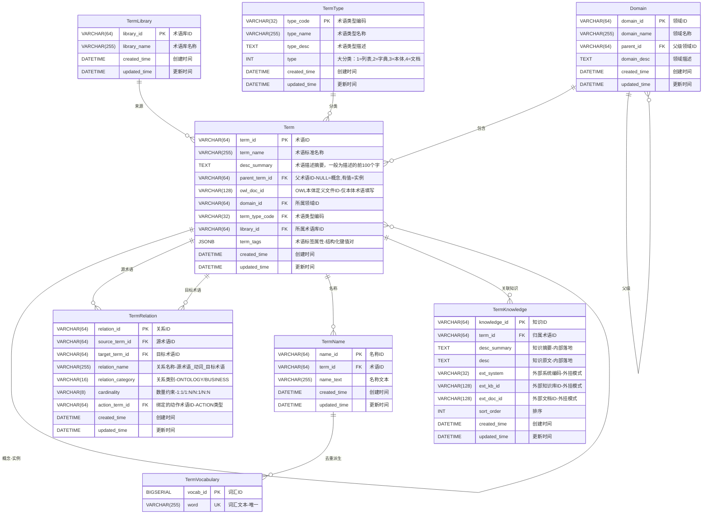

# 知识增强方案设计

> 文档版本：2026-04-16  
> 对应函数：`analyze_query_clarification`（`datacloud-knowledge` 包）  
> 梳理范围：从用户提问到内部实现的完整调用链路 + 架构评审

---

## 1. 现状梳理

### 1.1 术语建模现状

#### 1.1.1 ER设计



#### 1.1.2 库表结构

##### 1.1.2.1 domain

```sql
CREATE TABLE "whale_datacloud"."domain" (
  "domain_id" varchar(64) COLLATE "pg_catalog"."default" NOT NULL,
  "domain_name" varchar(255) COLLATE "pg_catalog"."default" NOT NULL,
  "parent_id" varchar(64) COLLATE "pg_catalog"."default",
  "domain_desc" text COLLATE "pg_catalog"."default",
  "created_time" timestamp(6) NOT NULL DEFAULT pg_systimestamp(),
  "updated_time" timestamp(6) NOT NULL DEFAULT pg_systimestamp(),
  PRIMARY KEY ("domain_id")
)
;

ALTER TABLE "whale_datacloud"."domain" 
  OWNER TO "gaussdb";

CREATE INDEX "idx_domain_name" ON "whale_datacloud"."domain" USING btree (
  "domain_name" COLLATE "pg_catalog"."default" "pg_catalog"."text_ops" ASC NULLS LAST
);

CREATE INDEX "idx_domain_parent" ON "whale_datacloud"."domain" USING btree (
  "parent_id" COLLATE "pg_catalog"."default" "pg_catalog"."text_ops" ASC NULLS LAST
);

COMMENT ON COLUMN "whale_datacloud"."domain"."domain_id" IS '领域ID，主键';

COMMENT ON COLUMN "whale_datacloud"."domain"."domain_name" IS '领域名称';

COMMENT ON COLUMN "whale_datacloud"."domain"."parent_id" IS '父级领域ID，根节点为 NULL';

COMMENT ON COLUMN "whale_datacloud"."domain"."domain_desc" IS '领域描述';

COMMENT ON COLUMN "whale_datacloud"."domain"."created_time" IS '创建时间';

COMMENT ON COLUMN "whale_datacloud"."domain"."updated_time" IS '更新时间';

COMMENT ON TABLE "whale_datacloud"."domain" IS '领域表：术语分类目录，支持无限层级';
```


##### 1.1.2.2 term 

```
CREATE TABLE "whale_datacloud"."term " (
  "term_id" varchar(255) COLLATE "pg_catalog"."default" NOT NULL,
  "term_code" varchar(255) COLLATE "pg_catalog"."default" NOT NULL,
  "term_name" varchar(255) COLLATE "pg_catalog"."default" NOT NULL,
  "desc_summary" text COLLATE "pg_catalog"."default",
  "parent_term_id" varchar(255) COLLATE "pg_catalog"."default",
  "owl_doc_id" varchar(128) COLLATE "pg_catalog"."default",
  "domain_id" varchar(64) COLLATE "pg_catalog"."default" NOT NULL,
  "term_type_code" varchar(32) COLLATE "pg_catalog"."default" NOT NULL,
  "library_id" varchar(64) COLLATE "pg_catalog"."default",
  "term_tags" jsonb NOT NULL DEFAULT '{}'::jsonb,
  "ext_attrs" jsonb NOT NULL DEFAULT '{}'::jsonb,
  "created_time" timestamp(6) NOT NULL DEFAULT pg_systimestamp(),
  "updated_time" timestamp(6) NOT NULL DEFAULT pg_systimestamp(),
  PRIMARY KEY ("term_id")
)
;

ALTER TABLE "whale_datacloud"."term" 
  OWNER TO "gaussdb";

CREATE INDEX "idx_term_domain" ON "whale_datacloud"."term" USING btree (
  "domain_id" COLLATE "pg_catalog"."default" "pg_catalog"."text_ops" ASC NULLS LAST
);

CREATE INDEX "idx_term_ext_attrs" ON "whale_datacloud"."term" USING gin (
  "ext_attrs" "pg_catalog"."jsonb_ops"
);

CREATE INDEX "idx_term_library" ON "whale_datacloud"."term" USING btree (
  "library_id" COLLATE "pg_catalog"."default" "pg_catalog"."text_ops" ASC NULLS LAST
);

CREATE INDEX "idx_term_name" ON "whale_datacloud"."term" USING btree (
  "term_name" COLLATE "pg_catalog"."default" "pg_catalog"."text_ops" ASC NULLS LAST
);

CREATE INDEX "idx_term_owl" ON "whale_datacloud"."term" USING btree (
  "owl_doc_id" COLLATE "pg_catalog"."default" "pg_catalog"."text_ops" ASC NULLS LAST
) WHERE owl_doc_id IS NOT NULL;

CREATE INDEX "idx_term_parent" ON "whale_datacloud"."term" USING btree (
  "parent_term_id" COLLATE "pg_catalog"."default" "pg_catalog"."text_ops" ASC NULLS LAST
);

CREATE INDEX "idx_term_tags" ON "whale_datacloud"."term" USING gin (
  "term_tags" "pg_catalog"."jsonb_ops"
);

CREATE INDEX "idx_term_type" ON "whale_datacloud"."term" USING btree (
  "term_type_code" COLLATE "pg_catalog"."default" "pg_catalog"."text_ops" ASC NULLS LAST
);

COMMENT ON COLUMN "whale_datacloud"."term"."term_id" IS '术语ID，主键';

COMMENT ON COLUMN "whale_datacloud"."term"."term_code" IS '术语编码';

COMMENT ON COLUMN "whale_datacloud"."term"."term_name" IS '术语标准名称，全局唯一规范名';

COMMENT ON COLUMN "whale_datacloud"."term"."desc_summary" IS '术语描述摘要，约100字，用于快速展示；完整知识在 term_knowledge 表';

COMMENT ON COLUMN "whale_datacloud"."term"."parent_term_id" IS '父术语ID：NULL=概念术语，有值=实例术语（指向所属概念的 term_id）';

COMMENT ON COLUMN "whale_datacloud"."term"."owl_doc_id" IS 'OWL本体定义文件ID，仅本体术语（type_category=3）填写，其余为 NULL';

COMMENT ON COLUMN "whale_datacloud"."term"."domain_id" IS '所属领域ID，外键关联 domain 表';

COMMENT ON COLUMN "whale_datacloud"."term"."term_type_code" IS '术语类型编码，外键关联 term_type(type_code)';

COMMENT ON COLUMN "whale_datacloud"."term"."library_id" IS '所属术语库ID，外键关联 term_library 表，允许为空';

COMMENT ON COLUMN "whale_datacloud"."term"."term_tags" IS '术语标签属性，JSONB 格式；key=标签维度术语ID，value={type, value}';

COMMENT ON COLUMN "whale_datacloud"."term"."ext_attrs" IS '自定义扩展属性，JSON 键值对，供业务/产品扩展；与 term_tags（标签、别名）分离';

COMMENT ON COLUMN "whale_datacloud"."term"."created_time" IS '创建时间';

COMMENT ON COLUMN "whale_datacloud"."term"."updated_time" IS '更新时间';

COMMENT ON TABLE "whale_datacloud"."term" IS '术语主表：存储所有术语及其核心属性';
```


##### 1.1.2.3 term_knowledge

```
CREATE TABLE "whale_datacloud"."term_knowledge" (
  "knowledge_id" varchar(255) COLLATE "pg_catalog"."default" NOT NULL,
  "term_id" varchar(255) COLLATE "pg_catalog"."default" NOT NULL,
  "desc_summary" text COLLATE "pg_catalog"."default",
  "desc" text COLLATE "pg_catalog"."default",
  "ext_system" varchar(32) COLLATE "pg_catalog"."default",
  "ext_kb_id" varchar(128) COLLATE "pg_catalog"."default",
  "ext_doc_id" varchar(128) COLLATE "pg_catalog"."default",
  "sort_order" int4 NOT NULL DEFAULT 0,
  "created_time" timestamp(6) NOT NULL DEFAULT pg_systimestamp(),
  "updated_time" timestamp(6) NOT NULL DEFAULT pg_systimestamp(),
  PRIMARY KEY ("knowledge_id"),
  CHECK ((((desc_summary IS NOT NULL) OR ("desc" IS NOT NULL)) OR (ext_doc_id IS NOT NULL))),
  CHECK (((ext_doc_id IS NULL) OR ((ext_system IS NOT NULL) AND (ext_kb_id IS NOT NULL))))
)
;

ALTER TABLE "whale_datacloud"."term_knowledge" 
  OWNER TO "gaussdb";

CREATE INDEX "idx_tk_desc_fts" ON "whale_datacloud"."term_knowledge" USING gin (
  to_tsvector('simple'::regconfig, COALESCE("desc", NULL::text)) "pg_catalog"."tsvector_ops"
);

CREATE INDEX "idx_tk_ext_doc" ON "whale_datacloud"."term_knowledge" USING btree (
  "ext_system" COLLATE "pg_catalog"."default" "pg_catalog"."text_ops" ASC NULLS LAST,
  "ext_kb_id" COLLATE "pg_catalog"."default" "pg_catalog"."text_ops" ASC NULLS LAST,
  "ext_doc_id" COLLATE "pg_catalog"."default" "pg_catalog"."text_ops" ASC NULLS LAST
) WHERE ext_doc_id IS NOT NULL;

CREATE INDEX "idx_tk_summary_fts" ON "whale_datacloud"."term_knowledge" USING gin (
  to_tsvector('simple'::regconfig, COALESCE(desc_summary, NULL::text)) "pg_catalog"."tsvector_ops"
);

CREATE INDEX "idx_tk_term" ON "whale_datacloud"."term_knowledge" USING btree (
  "term_id" COLLATE "pg_catalog"."default" "pg_catalog"."text_ops" ASC NULLS LAST
);

COMMENT ON COLUMN "whale_datacloud"."term_knowledge"."knowledge_id" IS '知识ID，主键';

COMMENT ON COLUMN "whale_datacloud"."term_knowledge"."term_id" IS '归属术语ID，外键关联 term 表';

COMMENT ON COLUMN "whale_datacloud"."term_knowledge"."desc_summary" IS '知识摘要，约200字；内部落地时填写，用于快速展示与关键字检索';

COMMENT ON COLUMN "whale_datacloud"."term_knowledge"."desc" IS '知识原文，完整内容；内部落地时填写，支持本地全文检索';

COMMENT ON COLUMN "whale_datacloud"."term_knowledge"."ext_system" IS '外部系统编码，如 RAGFLOW/DIFY/CONFLUENCE；外挂模式时必填';

COMMENT ON COLUMN "whale_datacloud"."term_knowledge"."ext_kb_id" IS '外部知识库ID，在对应系统内唯一标识知识库；外挂模式时必填';

COMMENT ON COLUMN "whale_datacloud"."term_knowledge"."ext_doc_id" IS '外部文档ID，在对应知识库内唯一标识文档；由外部 KB 负责 chunk embedding 与向量检索';

COMMENT ON COLUMN "whale_datacloud"."term_knowledge"."sort_order" IS '同一术语下多条知识的展示排序，默认 0';

COMMENT ON COLUMN "whale_datacloud"."term_knowledge"."created_time" IS '创建时间';

COMMENT ON COLUMN "whale_datacloud"."term_knowledge"."updated_time" IS '更新时间';

COMMENT ON TABLE "whale_datacloud"."term_knowledge" IS '术语关联知识表：挂载术语的业务知识，支持内部落地和外挂知识库两种模式';
```


##### 1.1.2.4 term_library

```
CREATE TABLE "whale_datacloud"."term_library" (
  "library_id" varchar(64) COLLATE "pg_catalog"."default" NOT NULL,
  "library_code" varchar(32) COLLATE "pg_catalog"."default" NOT NULL,
  "library_name" varchar(255) COLLATE "pg_catalog"."default" NOT NULL,
  "created_time" timestamp(6) NOT NULL DEFAULT pg_systimestamp(),
  "updated_time" timestamp(6) NOT NULL DEFAULT pg_systimestamp(),
  PRIMARY KEY ("library_id"),
  UNIQUE ("library_code")
)
;

ALTER TABLE "whale_datacloud"."term_library" 
  OWNER TO "gaussdb";

CREATE INDEX "idx_lib_name" ON "whale_datacloud"."term_library" USING btree (
  "library_name" COLLATE "pg_catalog"."default" "pg_catalog"."text_ops" ASC NULLS LAST
);

COMMENT ON COLUMN "whale_datacloud"."term_library"."library_id" IS '术语库ID，主键';

COMMENT ON COLUMN "whale_datacloud"."term_library"."library_code" IS '术语库编码，全局唯一';

COMMENT ON COLUMN "whale_datacloud"."term_library"."library_name" IS '术语库名称，如"HR系统术语库"';

COMMENT ON COLUMN "whale_datacloud"."term_library"."created_time" IS '创建时间';

COMMENT ON COLUMN "whale_datacloud"."term_library"."updated_time" IS '更新时间';

COMMENT ON TABLE "whale_datacloud"."term_library" IS '术语库表：管理术语来源，区分不同渠道的术语集合';
```


##### 1.1.2.5 term_name

```
CREATE TABLE "whale_datacloud"."term_name" (
  "name_id" varchar(255) COLLATE "pg_catalog"."default" NOT NULL,
  "term_id" varchar(255) COLLATE "pg_catalog"."default" NOT NULL,
  "name_text" varchar(255) COLLATE "pg_catalog"."default" NOT NULL,
  "created_time" timestamp(6) NOT NULL DEFAULT pg_systimestamp(),
  "updated_time" timestamp(6) NOT NULL DEFAULT pg_systimestamp(),
  "name_keywords" tsvector,
  "name_embedding" vector,
  "name_keywords_jieba" tsvector,
  "search_scope" jsonb NOT NULL DEFAULT '{}'::jsonb,
  PRIMARY KEY ("name_id")
)
;

ALTER TABLE "whale_datacloud"."term_name" 
  OWNER TO "gaussdb";

CREATE INDEX "idx_tn_name_embedding_hnsw" ON "whale_datacloud"."term_name" (
  "name_embedding" "pg_catalog"."vector_cosine_ops" ASC NULLS LAST
);

CREATE INDEX "idx_tn_name_keywords" ON "whale_datacloud"."term_name" USING gin (
  "name_keywords" "pg_catalog"."tsvector_ops"
);

CREATE INDEX "idx_tn_name_keywords_jieba" ON "whale_datacloud"."term_name" USING gin (
  "name_keywords_jieba" "pg_catalog"."tsvector_ops"
);

CREATE INDEX "idx_tn_name_text" ON "whale_datacloud"."term_name" USING btree (
  "name_text" COLLATE "pg_catalog"."default" "pg_catalog"."text_ops" ASC NULLS LAST
);

CREATE INDEX "idx_tn_search_scope" ON "whale_datacloud"."term_name" USING gin (
  "search_scope" "pg_catalog"."jsonb_ops"
);

CREATE INDEX "idx_tn_term" ON "whale_datacloud"."term_name" USING btree (
  "term_id" COLLATE "pg_catalog"."default" "pg_catalog"."text_ops" ASC NULLS LAST
);

CREATE TRIGGER "tsvector_update_term_name" BEFORE INSERT OR UPDATE ON "whale_datacloud"."term_name"
FOR EACH ROW
EXECUTE PROCEDURE "whale_datacloud"."term_name_tsv_trigger"();

COMMENT ON COLUMN "whale_datacloud"."term_name"."name_id" IS '名称ID，主键';

COMMENT ON COLUMN "whale_datacloud"."term_name"."term_id" IS '术语ID，外键关联 term 表';

COMMENT ON COLUMN "whale_datacloud"."term_name"."name_text" IS '名称文本；与 term.term_name 相同则为标准名称，不同则为别名';

COMMENT ON COLUMN "whale_datacloud"."term_name"."created_time" IS '创建时间';

COMMENT ON COLUMN "whale_datacloud"."term_name"."updated_time" IS '更新时间';

COMMENT ON COLUMN "whale_datacloud"."term_name"."name_keywords" IS 'BM25 全文搜索向量，基于 name_text 单字分词';

COMMENT ON COLUMN "whale_datacloud"."term_name"."name_embedding" IS '向量语义召回，1024 维 embedding';

COMMENT ON COLUMN "whale_datacloud"."term_name"."name_keywords_jieba" IS 'BM25 全文搜索向量，基于 jieba 中文分词（词级粒度，由应用层填充）';

COMMENT ON COLUMN "whale_datacloud"."term_name"."search_scope" IS '名称标签属性，JSONB 格式；存储 scope_user_id/score/use_count/confirmed_count/last_used_at 等';

COMMENT ON TABLE "whale_datacloud"."term_name" IS '术语名称表：存储术语的所有名称（标准名称、别名、缩写等）；name_text=term.term_name 为标准名称，其余为别名';
```


##### 1.1.2.6 term_relation

```
CREATE TABLE "whale_datacloud"."term_relation" (
  "relation_id" varchar(1000) COLLATE "pg_catalog"."default" NOT NULL,
  "source_term_id" varchar(255) COLLATE "pg_catalog"."default" NOT NULL,
  "target_term_id" varchar(255) COLLATE "pg_catalog"."default" NOT NULL,
  "relation_name" varchar(255) COLLATE "pg_catalog"."default" NOT NULL,
  "relation_category" varchar(16) COLLATE "pg_catalog"."default" NOT NULL DEFAULT 'BUSINESS'::character varying,
  "cardinality" varchar(8) COLLATE "pg_catalog"."default",
  "action_term_id" varchar(255) COLLATE "pg_catalog"."default",
  "ext_attrs" jsonb NOT NULL DEFAULT '{}'::jsonb,
  "created_time" timestamp(6) NOT NULL DEFAULT pg_systimestamp(),
  "updated_time" timestamp(6) NOT NULL DEFAULT pg_systimestamp(),
  PRIMARY KEY ("relation_id")
)
;

ALTER TABLE "whale_datacloud"."term_relation" 
  OWNER TO "gaussdb";

CREATE INDEX "idx_tr_action" ON "whale_datacloud"."term_relation" USING btree (
  "action_term_id" COLLATE "pg_catalog"."default" "pg_catalog"."text_ops" ASC NULLS LAST
) WHERE action_term_id IS NOT NULL;

CREATE INDEX "idx_tr_category" ON "whale_datacloud"."term_relation" USING btree (
  "relation_category" COLLATE "pg_catalog"."default" "pg_catalog"."text_ops" ASC NULLS LAST
);

CREATE INDEX "idx_tr_ext_attrs" ON "whale_datacloud"."term_relation" USING gin (
  "ext_attrs" "pg_catalog"."jsonb_ops"
);

CREATE INDEX "idx_tr_source" ON "whale_datacloud"."term_relation" USING btree (
  "source_term_id" COLLATE "pg_catalog"."default" "pg_catalog"."text_ops" ASC NULLS LAST
);

CREATE INDEX "idx_tr_target" ON "whale_datacloud"."term_relation" USING btree (
  "target_term_id" COLLATE "pg_catalog"."default" "pg_catalog"."text_ops" ASC NULLS LAST
);

CREATE UNIQUE INDEX "idx_tr_unique_relation" ON "whale_datacloud"."term_relation" USING btree (
  "source_term_id" COLLATE "pg_catalog"."default" "pg_catalog"."text_ops" ASC NULLS LAST,
  "target_term_id" COLLATE "pg_catalog"."default" "pg_catalog"."text_ops" ASC NULLS LAST,
  "relation_name" COLLATE "pg_catalog"."default" "pg_catalog"."text_ops" ASC NULLS LAST
);

COMMENT ON COLUMN "whale_datacloud"."term_relation"."relation_id" IS '关系ID，主键';

COMMENT ON COLUMN "whale_datacloud"."term_relation"."source_term_id" IS '源术语ID，外键关联 term 表';

COMMENT ON COLUMN "whale_datacloud"."term_relation"."target_term_id" IS '目标术语ID，外键关联 term 表';

COMMENT ON COLUMN "whale_datacloud"."term_relation"."relation_name" IS '关系名称，格式"源术语_动词_目标术语"；ONTOLOGY 类使用标准枚举，BUSINESS 类自由定义';

COMMENT ON COLUMN "whale_datacloud"."term_relation"."relation_category" IS '关系类别：ONTOLOGY=本体论结构关系，BUSINESS=业务自定义关系，默认 BUSINESS';

COMMENT ON COLUMN "whale_datacloud"."term_relation"."cardinality" IS '数量约束：1:1 | 1:N | N:1 | N:N';

COMMENT ON COLUMN "whale_datacloud"."term_relation"."action_term_id" IS '绑定的动作术语ID（term_type_code=ACTION），BUSINESS 关系推荐填写，ONTOLOGY 通常为 NULL';

COMMENT ON COLUMN "whale_datacloud"."term_relation"."ext_attrs" IS '自定义扩展属性，JSON 键值对，供业务/产品扩展';

COMMENT ON COLUMN "whale_datacloud"."term_relation"."created_time" IS '创建时间';

COMMENT ON COLUMN "whale_datacloud"."term_relation"."updated_time" IS '更新时间';

COMMENT ON TABLE "whale_datacloud"."term_relation" IS '术语关系表：存储术语间的本体论结构关系（ONTOLOGY）和业务自定义关系（BUSINESS）';
```


##### 1.1.2.7 term_type

```
CREATE TABLE "whale_datacloud"."term_type" (
  "type_id" int8 NOT NULL DEFAULT nextval('"whale_datacloud".term_type_type_id_seq'::regclass),
  "type_code" varchar(32) COLLATE "pg_catalog"."default" NOT NULL,
  "type_name" varchar(255) COLLATE "pg_catalog"."default" NOT NULL,
  "type_desc" text COLLATE "pg_catalog"."default",
  "type_category" int4 NOT NULL,
  "is_builtin" bool NOT NULL DEFAULT false,
  "created_time" timestamp(6) NOT NULL DEFAULT pg_systimestamp(),
  "updated_time" timestamp(6) NOT NULL DEFAULT pg_systimestamp(),
  PRIMARY KEY ("type_id"),
  UNIQUE ("type_code")
)
;

ALTER TABLE "whale_datacloud"."term_type" 
  OWNER TO "gaussdb";

CREATE INDEX "idx_type_category" ON "whale_datacloud"."term_type" USING btree (
  "type_category" "pg_catalog"."int4_ops" ASC NULLS LAST
);

CREATE INDEX "idx_type_name" ON "whale_datacloud"."term_type" USING btree (
  "type_name" COLLATE "pg_catalog"."default" "pg_catalog"."text_ops" ASC NULLS LAST
);

COMMENT ON COLUMN "whale_datacloud"."term_type"."type_id" IS '自增主键';

COMMENT ON COLUMN "whale_datacloud"."term_type"."type_code" IS '术语类型编码，唯一，如 OBJ/VIEW/ACTION/FUNC/PARAM/PROP/EMPLOYEE';

COMMENT ON COLUMN "whale_datacloud"."term_type"."type_name" IS '术语类型名称';

COMMENT ON COLUMN "whale_datacloud"."term_type"."type_desc" IS '术语类型描述';

COMMENT ON COLUMN "whale_datacloud"."term_type"."type_category" IS '大分类：1=列表术语, 2=字典术语, 3=本体术语, 4=文档名称术语';

COMMENT ON COLUMN "whale_datacloud"."term_type"."is_builtin" IS '是否内置：true=系统预置不可删除，false=用户自定义';

COMMENT ON COLUMN "whale_datacloud"."term_type"."created_time" IS '创建时间';

COMMENT ON COLUMN "whale_datacloud"."term_type"."updated_time" IS '更新时间';

COMMENT ON TABLE "whale_datacloud"."term_type" IS '术语类型表：定义术语的分类编码体系，扁平化设计';
```


##### 1.1.2.8 term_vocabulary

```
CREATE TABLE "whale_datacloud"."term_vocabulary" (
  "vocab_id" int8 NOT NULL DEFAULT nextval('"whale_datacloud".term_vocabulary_vocab_id_seq'::regclass),
  "word" varchar(255) COLLATE "pg_catalog"."default" NOT NULL,
  PRIMARY KEY ("vocab_id")
)
;

ALTER TABLE "whale_datacloud"."term_vocabulary" 
  OWNER TO "gaussdb";

CREATE UNIQUE INDEX "idx_vocab_word" ON "whale_datacloud"."term_vocabulary" USING btree (
  "word" COLLATE "pg_catalog"."default" "pg_catalog"."text_ops" ASC NULLS LAST
);

COMMENT ON COLUMN "whale_datacloud"."term_vocabulary"."vocab_id" IS '词汇ID，自增主键';

COMMENT ON COLUMN "whale_datacloud"."term_vocabulary"."word" IS '词汇文本，UNIQUE 约束确保全局去重';

COMMENT ON TABLE "whale_datacloud"."term_vocabulary" IS '术语词汇表：term_name.name_text 去重后的词汇集合，作为 jieba 自定义词典数据来源；由 import executor 在写入 term_name 时自动维护';
```


#### 1.1.3 术语关系

##### 1.1.3.1 本体术语类型

```
1.term_type.type_code=ONTOLOGY_VIEW and term_type.type_name=视图
2.term_type.type_code=ONTOLOGY_OBJ and term_type.type_name=对象
3.term_type.type_code=ONTOLOGY_ACTION and term_type.type_name=动作
4.term_type.type_code=ONTOLOGY_FUNC and term_type.type_name=函数
5.term_type.type_code=ONTOLOGY_PARAM and term_type.type_name=参数
6.term_type.type_code=ONTOLOGY_PROP and term_type.type_name=属性
```

##### 1.1.3.2 本体术语关系

```
1 关系类型:
1)视图拥有对象.
2)对象拥有属性.
3)对象关联对象.
4)对象拥有动作.
5)列表术语关联属性.

2.关系如下:
source_term_id=源术语ID
target_term_id=目标术语ID
relation_name=关系名称，样例：企业_归属_产业链
relation_category=ONTOLOGY/BUSINESS，默认 BUSINESS
cardinality=数量约束：1:1 | 1:N | N:1 | N:N
action_term_id=绑定的动作术语ID
```


#### 1.1.4术语样例数据

```
你可以连表进行查阅数据：
DATACLOUD_DB_HOST=10.10.168.204
DATACLOUD_DB_PORT=5432
DATACLOUD_DB_DATABASE=postgres
DATACLOUD_DB_SCHEMA=byai
DATACLOUD_DB_USER=gaussdb
DATACLOUD_DB_PASS=Admin@123
DATACLOUD_DB_TYPE=opengauss
```


### 1.2 知识增强流程现状

#### 1.2.1 入口签名说明

函数在两个包中分别存在：

| 位置 | 签名 | 说明 |
|------|------|------|
| `datacloud-knowledge/intent/clarification.py` | `def analyze_query_clarification(query, on_event)` | **核心实现**，同步函数 |
| `datacloud-analysis` 的 `create_agent()` | `knowledge_enhancer: Callable` | 调用方注入，支持同步/异步 |

> **关于 `gateway_context` / `AnalyzerCallable` 等签名**：这些参数在 `intend_node` 的 `_invoke_knowledge_enhancer` 中通过反射动态传递——函数签名若有 ≥2 个位置参数则会传入 `(user_query, gateway_context, message_parent_id)`；否则退化到只传 `user_query`。因此 `gateway_context` 并非由 `clarification.py` 内部消费，而是由外部集成层（GatewayContext / HookContext）持有。

---

#### 1.2.2 完整调用时序图

```
用户提问 (HTTP / WebSocket)
      │
      ▼
 LangGraph Graph
      │
      ├─► intend_node (orchestration/intend/node.py)
      │       │
      │       │  ① 从 configurable 取出 gateway_context
      │       │  ② 取最后一条 HumanMessage 作为 user_query
      │       │  ③ 调用 _invoke_knowledge_enhancer(knowledge_enhancer, user_query, gateway_context, ...)
      │       │
      │       ▼
      │   knowledge_enhancer(user_query)   ← 调用方注入的函数（同步或异步）
      │       │
      │       ▼
      │   analyze_query_clarification(query)   [datacloud-knowledge]
      │       │
      │       ├─► Step 1: expand_query(query)        ← LLM 调用 #1
      │       │       │   natquery.py
      │       │       │   · 系统提示：要求笛卡尔积展开，如"龙头、骨干企业营收"
      │       │       │     → ["龙头企业营收", "骨干企业营收"]
      │       │       │   · bind_tools([NatQuery])，强制结构化输出
      │       │       │   · 输出：NatQuery { query, select[], where[], group_by[], order_by[] }
      │       │       │
      │       ├─► Step 2: build_paradigm_resolution_state(structured_query)
      │       │       │   paradigm_builder.py
      │       │       │   · NatQuery → 五段式字典
      │       │       │   · _build_typed_items()：按 ktype 分类关键词
      │       │       │   · _populate_recall_candidates()
      │       │       │       └─► typed_multi_recall_with_session(items, top_k=5)
      │       │       │               service.py / typed_recall.py
      │       │       │               · 路径1: BM25 AND 分词匹配
      │       │       │               · 路径2: jieba 词级 BM25
      │       │       │               · 路径3: 子串匹配
      │       │       │               · 路径4: 向量召回（可选，env开关）
      │       │       │               · RRF 外层融合，返回 top_k 候选
      │       │       │   · apply_auto_resolution()：候选唯一时自动选中
      │       │       │
      │       ├─► Step 3: llm_confirm(original_question, expanded_query, state)  ← LLM 调用 #2
      │       │       │   llm_confirm.py
      │       │       │   · 系统提示：多候选消歧、隐含过滤识别、字段映射
      │       │       │   · bind_tools([ConfirmedQuery])，强制结构化输出
      │       │       │   · 输出：ConfirmedQuery { select[], where[], group_by[], clarify_items[] }
      │       │       │   · needs_clarification = len(clarify_items) > 0
      │       │       │
      │       └─► Step 4: 构建 ClarificationResult
      │               · needs_clarification=True  → form=paradigmList JSON（送前端追问）
      │               · needs_clarification=False → knowledge=paradigmList JSON（送工具注入）
      │
      │  intend_node 将结果写入 AgentState:
      │       knowledge_payload = { needs_clarification, form, knowledge, query }
      │       knowledge_snippets = [人类可读字段映射文本]
      │
      ▼
 execution_node → 触发 LLM ReAct 循环，决定调用哪个工具
      │
      ▼
 tool_wrapper → 执行工具前调用 before_call_back 钩子链
      │
      ▼
 query_clarification_plugin.before_call_back (builtin)
      │
      ├─ [needs_clarification=True]
      │       · langgraph.types.interrupt(paradigmList) → 挂起图执行
      │       · 前端渲染追问 UI，用户选择后 Resume
      │       · _apply_resume_to_params() → 重建 tool_params
      │
      └─ [needs_clarification=False]
              · knowledge 注入为 contextKnowledge 参数
              · data_query_* 工具带着精确字段名执行 SQL 查询
```

---

#### 1.2.3 核心数据流

```
用户原文
  "202602龙头、骨干企业的数量、营收"
         │
         ▼  [LLM #1: expand_query]
NatQuery.query =
  "202602龙头企业数量、202602龙头企业营收、202602骨干企业数量、202602骨干企业营收"
NatQuery.select = [SelectExpr(expr="龙头企业数量"), SelectExpr(expr="龙头企业营收"), ...]
NatQuery.where  = [WhereClause(field="年月", op="=", value="202602")]
         │
         ▼  [typed_multi_recall_with_session]
TypedKeywordState 每个关键词 → candidates:
  "龙头企业数量" → [ {term_id, name="龙头企业户数", score=0.92}, {name="龙头企业数量", score=0.88}, ...]
         │
         ▼  [LLM #2: llm_confirm]
ConfirmedQuery:
  select = [SelectExpr(expr="龙头企业数量", original_keyword="龙头企业数量"), ...]
  where  = [WhereClause(field="年月", op="=", value="202602")]
  clarify_items = []   ← 无歧义
  needs_clarification = False
         │
         ▼
ClarificationResult(
  query = "202602龙头企业数量...",
  knowledge = '{"paradigmList": [{"paradigmId":"1","paradigmResult":[...]}]}'
)
         │
         ▼
data_query_xxx(query=..., contextKnowledge="龙头企业数量 → 龙头企业数量\n...")
```

---

#### 1.2.4 关键模块说明

##### 1.2.4.1 `expand_query`（Step 1）

**文件**：`datacloud-knowledge/intent/natquery.py`

**核心设计思路**：数据仓库的指标字段往往是预计算聚合字段（如"龙头企业营收"是一个独立字段，而非通过维度过滤动态聚合），因此必须先将用户的自然语言展开为"完整度量短语"，才能匹配到真实字段名。

**关键点**：
- 使用 `bind_tools([NatQuery])` 强制 LLM 输出结构化 JSON
- 有 JSON 提取兜底逻辑（应对少数不规则输出）
- `query` 字段存放展开后的逗号分隔短语，作为召回的关键词来源

##### 1.2.4.2 `typed_multi_recall_with_session`（Step 2 核心）

**文件**：`datacloud-knowledge/intent/service.py` + `typed_recall.py`

**多路召回机制**（针对每个关键词）：

| 路径 | 方式 | 特点 |
|------|------|------|
| 路径1 | BM25 AND | 所有分词均需命中，精确度高 |
| 路径2 | jieba 词级 BM25 | 分词后独立匹配，召回率高 |
| 路径3 | 子串匹配 | 兜底，处理部分匹配 |
| 路径4 | 向量召回 | 语义相似度，可选（env 开关控制） |

**RRF 融合**：4路结果通过 Reciprocal Rank Fusion 合并，返回 top_k=5 候选。

**数据库**：PostgreSQL `term` / `term_name` 系列表（whale_datacloud schema）。

##### 1.2.4.3 `llm_confirm`（Step 3）

**文件**：`datacloud-knowledge/intent/llm_confirm.py`

**核心能力**：
1. 从 top_k 候选中选出最匹配的字段名（语义消歧）
2. 识别查询中隐含的维度过滤条件（如"龙头"隐含 `企业类型='龙头'`）
3. 判断是否存在歧义（多候选无法区分 → `clarify_items` → 追问）
4. 使用维度值线索（`dimension_value_hints`）辅助过滤识别

**关键约束**（Prompt 中明确）：所有字段名和维度值只能来自召回候选，严禁 LLM 凭空编造。

##### 1.2.4.4 `query_clarification_plugin`（工具前钩子）

**文件**：`datacloud-analysis/tool_hook_plugins/builtin/query_clarification_plugin.py`

**触发条件**：工具名前缀为 `query_`、`data_query_`、`compute_` 的数据工具。

**两种分支**：
- **追问分支**：`interrupt()` 挂起图，前端展示 paradigmList 表单，用户确认后 Resume，`_apply_resume_to_params` 重建参数
- **注入分支**：将 knowledge 格式化为 `contextKnowledge` 字符串，直接 patch 到工具参数

---


---

### 1.3 知识增强流程现状

```
┌─────────────────────────────────────────────────────────────────────┐
│                    byclaw-data（落地项目）                            │
│                                                                     │
│  GatewayWorker → DataCloudWorker._build_graph()                    │
│       │                                                             │
│       ├─ knowledge_enhancer = analyze_query_clarification(stream版) │
│       │       ↑ byclaw_data.paradigm 包实现，支持 gateway 流推送      │
│       │                                                             │
│       ├─ tools = data_query_{code}（StructuredTool）                │
│       │       · 参数：query(NL) + contextKnowledge(系统注入)         │
│       │       · 执行：loader.get_object/view(code).query(...)       │
│       │                                                             │
│       └─ OntologyLoader → 加载 OBJECT/VIEW 的元数据                  │
│               · resourceCode / resourceName / resourceDesc          │
│               · 字段列表（field_code, field_name）                   │
└──────────────────────────┬──────────────────────────────────────────┘
                           │ create_agent(knowledge_enhancer=...)
                           ▼
┌─────────────────────────────────────────────────────────────────────┐
│                  by-datacloud（框架层）                               │
│                                                                     │
│  intend_node → knowledge_enhancer(query, gateway_ctx)              │
│       │             │                                               │
│       │             ▼  [datacloud-knowledge]                        │
│       │         expand_query (LLM#1)                               │
│       │             → 召回 (BM25/向量/RRF，全库 term_name)           │
│       │             → llm_confirm (LLM#2)                          │
│       │             → ClarificationResult                           │
│       │                                                             │
│       └─ knowledge_payload → AgentState                             │
│                                                                     │
│  execution_node → ReAct循环 → tool_wrapper                         │
│       │                           │                                 │
│       │                  query_clarification_plugin                 │
│       │                  · needs_clarification=True → interrupt()   │
│       │                  · False → 注入 contextKnowledge            │
│       │                                                             │
│       └─ data_query_{code}(query, contextKnowledge)                │
│               → OntologyLoader.query() → SQL → 结果                 │
└─────────────────────────────────────────────────────────────────────┘
```

**已有的术语模型资产**（`whale_datacloud` schema，见 §1.1）：

| 表 | 已有内容 | 当前知识增强是否使用 |
|---|---------|-----------------|
| `term` | `desc_summary`（业务描述摘要）、`term_type_code`（ONTOLOGY_OBJ/VIEW/PROP/ACTION/FUNC） | ❌ 未使用 |
| `term_name` | 多别名、`name_embedding`（1024维）、`name_keywords`（BM25）、`search_scope`（使用统计） | ⚠️ 仅用于召回，未用 search_scope / desc |
| `term_relation` | ONTOLOGY 图谱（视图→对象→属性→动作）、BUSINESS 图谱（对象关联对象） | ❌ 未使用 |
| `term_knowledge` | 术语挂载的业务知识，支持内部落地和外挂 KB | ❌ 未使用 |


## 2 问题分析


---

## 3 提升思路

### 3.1 定位设计

1. 做对象、视图的 ReAct 机制，不做规划模式，不挂载 skills。

2. 本体对象通过工具落地接入模型：
   - **数据库类本体对象**：通过默认的 `Object.query`、`View.query`、`Object.compute`、`View.compute` 挂载
   - **API 类本体对象**：通过代理 API，挂载默认的 `Object.query`

3. 本体对象支持扩展挂载自定义 Action 工具（查询类 / 操作类）。

4. 知识增强的核心目标：**让大模型选对工具、查对字段**，减少 ReAct 无效探索和追问次数。

---

### 3.2 agent 级知识增强

#### 3.2.1 系统提示词分层设计

系统提示词分为**静态基础层**和**动态知识层**两层，分别面向不同的优化目标。

**① 静态基础层（跨请求不变，缓存友好）**

固化在 agent 创建时，内容包含：

| 内容块 | 数据来源 | 说明 |
|--------|---------|------|
| 角色定义 | agent 配置 | "你是一个数据分析助手，负责回答 XX 业务域的数据查询问题" |
| 行为规范 | 框架默认 | 何时追问、如何处理歧义、输出格式、拒答边界 |
| 挂载本体概览 | `OntologyLoader` + `term.desc_summary` | 每个挂载对象/视图的**名称 + 一句话描述**，不含字段详情 |

本体概览示例（注入到 system prompt）：

```
【当前可用数据对象】
- 企业经营主体（Object）：记录企业工商注册信息、经营状态、规模分类等基本属性
- 企业年度统计视图（View）：提供企业各统计维度的年度汇总数据，支持多维聚合
- 企业贷款记录（Object）：记录企业贷款合同、余额、逾期状态等信息
```

> 本体概览仅列名称和一句话描述，不列字段详情。字段级别的上下文由**动态知识层**在请求时按需注入。

---

**② 动态知识层（请求级，由 knowledge_enhancer 在 intend_node 产出）**

每次请求时，`knowledge_enhancer` 根据用户问题召回相关的字段语义上下文，以 `knowledge_snippets` 形式注入。

**注入方式选择分析：**

| 注入方式 | 优点 | 缺点 | 结论 |
|---------|------|------|------|
| 追加到 system message 末尾 | 权重高，LLM 优先遵循；静态层仍可缓存 | 需区分静态/动态两段 | ✅ **推荐** |
| 作为独立 user message 注入 | 实现简单 | 权重低于 system，对字段约束效果差 | ❌ 不推荐 |
| 全量写入静态 system prompt | 无运行时开销 | 无法个性化；token 浪费；破坏缓存 | ❌ 不推荐 |

**核心原则**：不变的内容（角色定义、行为规范、本体概览）放入静态 system prompt，充分利用 Prompt Cache；变化的字段消歧上下文追加在 system message 末尾动态注入，避免破坏缓存命中率。

```
┌───────────────────────────────────────────────────────────────────┐
│  system message                                                   │
│                                                                   │
│  ┌─────────────────────────────────────────────────────────────┐  │
│  │  静态基础层（cached）                                         │  │
│  │  · 角色定义                                                  │  │
│  │  · 行为规范                                                  │  │
│  │  · 挂载本体概览（名称 + 一句话描述）                           │  │
│  └─────────────────────────────────────────────────────────────┘  │
│                                                                   │
│  ┌─────────────────────────────────────────────────────────────┐  │
│  │  动态知识层（per-request, knowledge_snippets）                │  │
│  │  · 本次查询相关的字段语义消歧上下文                             │  │
│  │  · 由 knowledge_enhancer 在 intend_node 阶段产出              │  │
│  └─────────────────────────────────────────────────────────────┘  │
└───────────────────────────────────────────────────────────────────┘
```

---

#### 3.2.2 工具描述知识增强

工具描述（tool description）的核心职责是**帮助 LLM 决定调用哪个工具**，而非在工具描述中解决字段映射问题——字段映射由 `contextKnowledge` 参数在运行时动态注入。

不同工具类型的描述策略如下：

---

**① query 类工具（`Object.query` / `View.query`）**

这是最核心的工具类型，描述由三部分拼装：

**第一部分：业务描述**

数据来源：`term.desc_summary`（ONTOLOGY_OBJ / ONTOLOGY_VIEW 术语）

说明该对象/视图的业务含义和适用场景，帮助 LLM 判断"这个工具能不能回答我的问题"。

```
[query_enterprise] 企业经营主体查询

适用于查询企业工商注册信息、经营状态、规模分类等基本属性。
当问题涉及企业注册资本、成立日期、是否注销、规模等级（龙头/骨干）时，优先使用本工具。
```

**第二部分：字段分组概览**

数据来源：ONTOLOGY_PROP 术语，按属性类别分组汇总

**不逐一列举所有字段，只给出分组标签**，帮助 LLM 判断"这个工具有没有我需要的数据"。字段的具体别名和业务定义由 `contextKnowledge` 在运行时提供。

```
【可查询维度】
- 基本注册信息：企业名称、注册号、登记机关、注册地址等
- 经营状态：是否正常经营、注销/吊销原因、经营期限等
- 规模分类：是否龙头企业、是否骨干企业、规模等级等
- 统计汇总指标：营收规模区间、从业人数区间等
```

> **字段详细程度阈值**：单个对象/视图的属性 **≤ 15 个**时，可在工具描述中全量列出字段名（不含描述）；**> 15 个**时按分组概述，不逐一列举，防止工具描述过长稀释关键信息。

**第三部分：关联对象描述**

数据来源：`term_relation`（ONTOLOGY 对象关联对象 / BUSINESS 自定义业务关系）

说明该对象与哪些其他对象存在关联，以及通过什么工具串联查询。帮助 LLM 理解多步查询路径，减少 ReAct 盲目探索。

```
【关联查询路径】
- 企业年报 → query_annual_report(enterprise_id=<企业ID>)
- 企业贷款 → query_loan(enterprise_id=<企业ID>)
- 企业涉诉记录 → query_litigation(enterprise_id=<企业ID>)
```

**完整拼装示例（最终 tool description）：**

```
[query_enterprise] 企业经营主体查询

业务说明：
  记录企业工商注册信息和经营状态。适用于查询企业注册资本、成立日期、规模等级
  （龙头/骨干）、经营状态等基本属性类问题。

可查询维度：
  基本注册信息 / 经营状态 / 规模分类（龙头/骨干）/ 汇总统计指标

关联查询：
  - 企业年报（query_annual_report）：企业年度财务/经营数据
  - 企业贷款（query_loan）：贷款合同与余额
  - 企业涉诉（query_litigation）：司法诉讼记录

参数：
  - query (str)：自然语言查询描述，系统自动解析为结构化查询
  - contextKnowledge (str)：[系统自动注入，调用方无需填写]
```

---

**② compute 类工具（`Object.compute` / `View.compute`）**

compute 工具用于汇总聚合统计，区别于 query 的明细行查询。描述重点在**突出汇总语义**，防止 LLM 把统计类问题错误路由到 query 工具。

```
[compute_enterprise] 企业统计汇总

业务说明：
  对企业对象按指定维度做聚合统计，返回汇总指标值而非明细列表。
  适用于"统计 XX 企业数量/营收/占比"等聚合分析类问题。

支持的聚合维度：地区 / 行业 / 规模等级 / 经营状态 / 时间段
支持的聚合指标：数量（count）/ 营收总量（sum）/ 均值（avg）/ 占比（ratio）

适用场景示例：
  ✅ "202602 龙头企业共有多少家？"
  ✅ "各地区骨干企业营收占比"
  ❌ 明细查询（逐条记录）请使用 query_enterprise
```

---

**③ 自定义 Action 工具（查询类 / 操作类）**

自定义 Action 是非标准工具，LLM 无法通过命名推断其能力，因此描述必须完整说明参数和触发场景：

```
[action_xxx] 工具名称

业务说明：
  【精确描述该 Action 的业务用途，不使用模糊表述】

触发场景（满足以下任一条件时调用）：
  1. 【典型触发条件 1】
  2. 【典型触发条件 2】

参数：
  - param_a (str)：参数含义 + 可选值范围（若有枚举值请列出）
  - param_b (int)：参数含义 + 单位/取值范围

注意：【若有前置条件、调用限制或副作用，在此说明】
```

---

### 3.3 数据检索类工具-知识增强

#### 3.3.1 目标

将用户问题转化为「select 哪些字段 / from 哪个视图 / where 哪些条件」的查询单元，核心挑战是**字段映射的精确性**（NL 术语 → 物理字段名），以及字段候选空间的合理限定。

#### 3.3.2 增强流程

```
用户问题："202602龙头、骨干企业的数量、营收"
        │
        ▼ Step 1：确定字段候选范围
        从 agent 挂载的对象/视图列表，通过 TermRelation 图谱（视图→对象→属性）
        拉取当前 agent 的属性术语白名单
        white_list = { "prop_001": "龙头企业数量", "prop_002": "骨干企业数量", ... }
        → 候选空间从全库数百术语压缩到当前 agent 挂载对象的属性集合（通常 ≤ 50）
        │
        ▼ Step 2：NL 展开 + 白名单约束召回
        expand_query(LLM#1) 展开 → ["龙头企业数量", "骨干企业数量", "龙头企业营收", ...]
        typed_multi_recall_with_session(items, whitelist=white_list)
        → 只在白名单术语中召回，候选数从 200+ 降到 30 以内
        │
        ▼ Step 3：desc_summary 增强消歧
        候选格式升级（拼接 term.desc_summary + search_scope 使用统计）：
        "龙头企业数量" — 统计期内认定为龙头的企业总户数 (use_count=142, confirmed=38)
        "龙头企业户数" — 同上（别名）
        → llm_confirm 根据描述精确选择，无歧义时自动确定，无需追问
        │
        ▼ Step 4：search_scope 反馈写入
        工具成功执行后，将本次 keyword→fieldName 映射写回 term_name.search_scope
        (use_count+1, last_used_at=now，用户确认则 confirmed_count+1)
        → 形成使用闭环，高频正确映射自动排名提升
```

---

### 3.4 数据操作类工具-知识增强（暂不设计）

操作类 Action 的入参为结构化操作对象，知识增强策略为：能解析多少入参就暂存多少，缺失必填术语时触发追问。本次暂不详细设计，后续单独立项。

---

## 4 整体提升方案


## 5 验收用例
