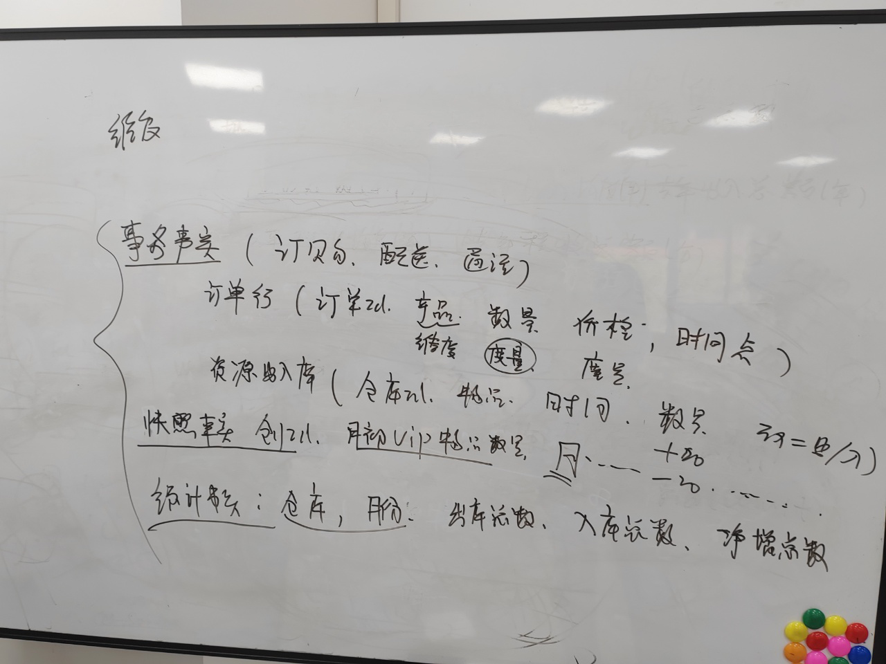

# 知识注入样例

## 笔记
1、账期限制: 月账、日账。在字段中添加备注。
2、多跳、单跳类问题。
3、之前整理的维度、度量、度量值、指标、账期类型 的属性。
-- 其中指标是会阐述是日增、月增，累计字段。拍照类/统计类。
-- 指标一定是要有统计条件，由维度做过滤条件，

-- 派生指标，复杂指标是对多个指标做计算。
-- 

4、权限。

## 笔记2
1. 事实表：订购、配送、通话。只会在增加，不会update。

   1）订单行（淘宝的三个宝贝）：订单ID、产品（维度）、数量（度量）、价格（度量）、事件点。

   2）资源出入库：仓库ID、物品、时间、数量、动作类型：出入库。

   -- 计算仓库在月初有多少数量=》拍照

   --计算8月份的静增 =》统计值。

   

2. 快照事实：

   仓库ID、月初VIP物品数量。

   =》不可累计。

   

3. 统计类：

   仓库、月份、进出物品数、入库总数、净增总数。

   =》可向年累计

4.维度累计事实 =》拉链表。

1）维度、退化维度。 

2）圈定一个圈，针对度量，+ 统计函数。

----------------------------------------------------------------------------------------

5.举例实际复杂增

## 概念梳理

1、

