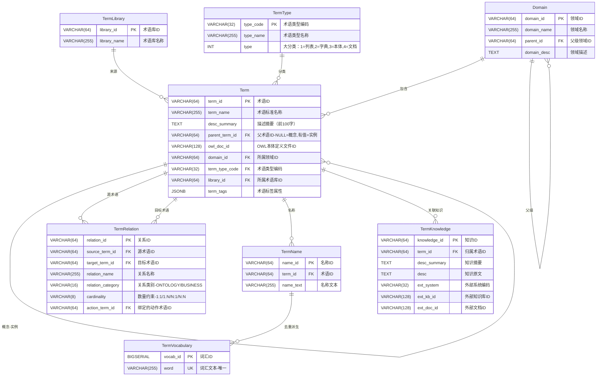

# datacloud-knowledge

## 简介

datacloud-knowledge 是 dataCloud 平台的知识服务模块，提供 dataCloud 所需的术语知识构建、术语查询服务、语义知识推理等能力。

## 定位

解决"用户怎么说"和"系统怎么懂"之间的语义鸿沟——把业务自然语言翻译成系统能直接使用的标准术语、字段别名、澄清结果和知识包，为上层分析智能体提供稳定的知识底座。

核心能力：

| 能力 | 说明 |
|------|------|
| **字段别名解析** | 按作用域解析字段别名，支持字段值别名 |
| **术语检索** | 按术语类型、编码、关键词、标签检索术语 |
| **查询澄清** | 分析查询是否需要澄清，返回澄清表单与知识信息 |
| **澄清回填** | 将澄清结果回填到结构化输入，持久化确认过的同义词 |
| **术语构建 CLI** | 建表、导入、回填、校验和 bootstrap 一站式命令 |


## 设计思想

- **术语知识网络**：枚举字典、数据示例、视图、对象、动作名称等一切在自然语言中使用的内容均为术语，基于术语构建和表达知识网络

- **渐进式消歧**：优先使用局部名称进行消歧、再使用整体推理兜底。

- **知识自进化**：通过用户界面交互机制，不断收集方言知识。

  

## 架构设计

### 项目结构

```
packages/datacloud-knowledge/
├── src/datacloud_knowledge/
│   ├── provider.py      # 知识 Provider facade（FunctionKnowledgeProvider）
│   ├── cli.py           # 术语构建 CLI
│   └── __init__.py      # 包级导出
├── db/
│   ├── ddl/knowledge/   # DDL 脚本
│   ├── seed/knowledge/  # 种子数据
│   └── migrations/      # 数据库迁移
└── tests/
```

### 数据模型（ER 关系）



**表设计概要：**

| 表名 | 核心职责 | 设计要点 |
|------|----------|----------|
| `TermLibrary` | 管理术语来源 | 极简设计，仅保留 ID 和名称，用于区分术语来源 |
| `Domain` | 术语分类目录 | 支持层级结构，`parent_id` 自关联 |
| `TermType` | 术语类型编码 | 扁平化设计，无层级关系，用途通过 `type_code` 直接表达 |
| `Term` | 术语主表 | JSONB 存储标签属性，`desc_summary` 保留展示用摘要 |
| `TermKnowledge` | 术语关联知识 | 一对多挂载；内部落地支持全文检索，外挂模式通过 `ext_system + ext_kb_id + ext_doc_id` 三元组定位外部文档 |
| `TermRelation` | 术语间关系 | 两类关系（ONTOLOGY/BUSINESS）；`action_term_id` 绑定 ACTION 类型术语 |
| `TermName` | 术语所有名称 | 包含标准名称、别名、缩写等，支持近似匹配 |
| `TermVocabulary` | 分词词典数据源 | `TermName` 去重派生表，为 jieba 提供自定义词典数据 |

### 核心模块说明

`FunctionKnowledgeProvider` 是唯一对外入口，封装了以下四类能力：

| 方法 | 说明 |
|------|------|
| `resolve_field_aliases(terms, scope_code)` | 按作用域解析字段别名 |
| `search_terms_by_type(term_type_code, keyword, limit)` | 按类型和关键词检索术语 |
| `prepare_query_clarification(query, ontology_code, ...)` | 分析查询是否需要澄清，返回澄清表单 |
| `finalize_query_clarification(query, ..., form, ...)` | 将澄清结果回填到结构化输入 |

## 快速开始

### 安装

```bash
uv sync
```

### Provider API

```python
from datacloud_knowledge.provider import FunctionKnowledgeProvider

provider = FunctionKnowledgeProvider()

# 字段别名解析
field_result = provider.resolve_field_aliases(
    terms=["客户", "地区"],
    scope_code="sales",
)

# 术语检索
term_result = provider.search_terms_by_type(
    term_type_code="customer",
    keyword="活跃",
    limit=20,
)

# 查询澄清
analysis = provider.prepare_query_clarification(
    query="查询近三个月高价值客户",
    ontology_code="sales",
    structured_input={"query": "查询近三个月高价值客户"},
    mode="query",
)

# 澄清回填
finalized = provider.finalize_query_clarification(
    query="查询近三个月高价值客户",
    ontology_code="sales",
    structured_input={"query": "查询近三个月高价值客户"},
    mode="query",
    needs_clarification=analysis.needs_clarification,
    form=analysis.form,
    metadata=analysis.metadata,
)
```

也可以直接用函数式 facade：

```python
from datacloud_knowledge.provider import search_terms_by_type

result = search_terms_by_type(term_type_code="customer", keyword="重点")
```

### CLI

`datacloud-knowledge` 命令负责环境搭建。典型流程：建表 → 导入 → 回填 → 校验。

```bash
datacloud-knowledge ensure-schema --schema whale_datacloud
datacloud-knowledge import-terms ./path/to/package --schema whale_datacloud
datacloud-knowledge backfill-tsvector --schema whale_datacloud
datacloud-knowledge backfill-embeddings --schema whale_datacloud
datacloud-knowledge verify-schema --schema whale_datacloud
```

或者一步到位：

```bash
datacloud-knowledge bootstrap ./path/to/package --schema whale_datacloud
```

| 命令 | 说明 |
|------|------|
| `ensure-schema` | 创建或更新知识库所需表结构 |
| `verify-schema` | 检查核心表是否存在 |
| `import-terms` | 导入 OWL / 术语知识包 |
| `backfill-tsvector` | 回填术语检索所需的 tsvector |
| `backfill-embeddings` | 回填术语向量 |
| `bootstrap` | 建表 + 导入 + 回填一次完成 |

> `--reset` 会重建表结构，属于破坏性操作，仅在明确需要重新初始化时使用。

## 开发指南

```bash
uv sync                                    # 安装依赖
uv run ruff format .                       # 格式化
uv run ruff check . --fix                  # Lint
uv run mypy src/datacloud_knowledge        # 类型检查
```

## 测试

```bash
uv run pytest                              # 单元测试
uv run pytest -m db_integration            # 数据库集成测试
```


