# 知识服务模块设计

## 1 模块定义

知识服务模块是 dataCloud 消费层的核心模块，负责将术语建模层的结构化知识转化为可被上层智能体（Agent）消费的知识上下文。

**核心职责：**

1. **术语分词召回**：对用户输入的自然语言进行分词，匹配术语库中的标准术语及其别名
2. **语义匹配**：通过 `TermKnowledge` 外挂三元组（`ext_system + ext_kb_id + ext_doc_id`）关联外挂知识库，委托知识库执行 chunk embedding 语义检索，实现术语知识维度的语义级意图匹配
3. **术语关系遍历**：基于 BFS 算法遍历术语间的层级与关联关系，召回相关术语集合
4. **近似术语推荐**：当输入术语无法精确匹配时，基于编辑距离、三元组相似度推荐近似术语
5. **标签属性筛选**：基于 JSONB 标签的键值约束，筛选满足条件的术语
6. **外挂知识库集成**：对接外部知识库服务，支持长文档的 chunk embedding 语义召回
7. **混合召回**：融合语义匹配与标签筛选，支持结构化约束与语义意图的联合检索

## 2 模块定位

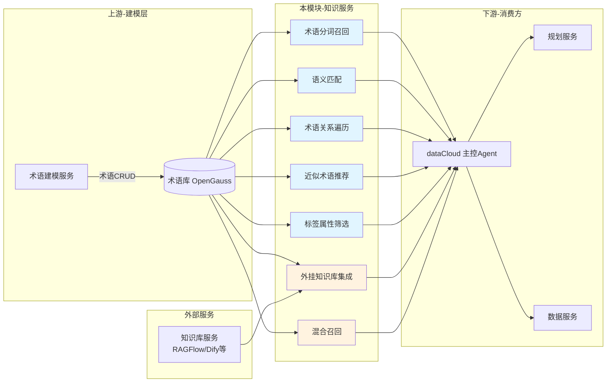

**依赖关系：**

| 方向 | 模块 | 本模块需要对方提供 | 对方需要本模块提供 |
|------|-----|------------------|------------------|
| 上游 | 术语建模服务 | 术语数据的 CRUD 与变更通知 | — |
| 上游 | OpenGauss | JSONB GIN 索引、全文检索、pg_trgm（可选） | — |
| 上游 | 知识库服务（RAGFlow/Dify 等） | 文档 chunk embedding 存储与语义检索 API | — |
| 下游 | dataCloud 主控 Agent | — | **术语知识查询接口**（术语自身信息、一跳关系查询）、**数据意图识别接口**（可选，若由本模块实现） |
| 下游 | 规划服务 | — | 术语上下文（含用途、绑定、描述等知识） |
| 下游 | 数据服务 | — | 术语绑定的动作参数信息 |

**核心原则**：术语服务只提供原子查询能力（自身属性 + 一跳关系），复杂多跳逻辑交给 Agent 决策。

## 3 方案设计

### 3.1 ER 关系

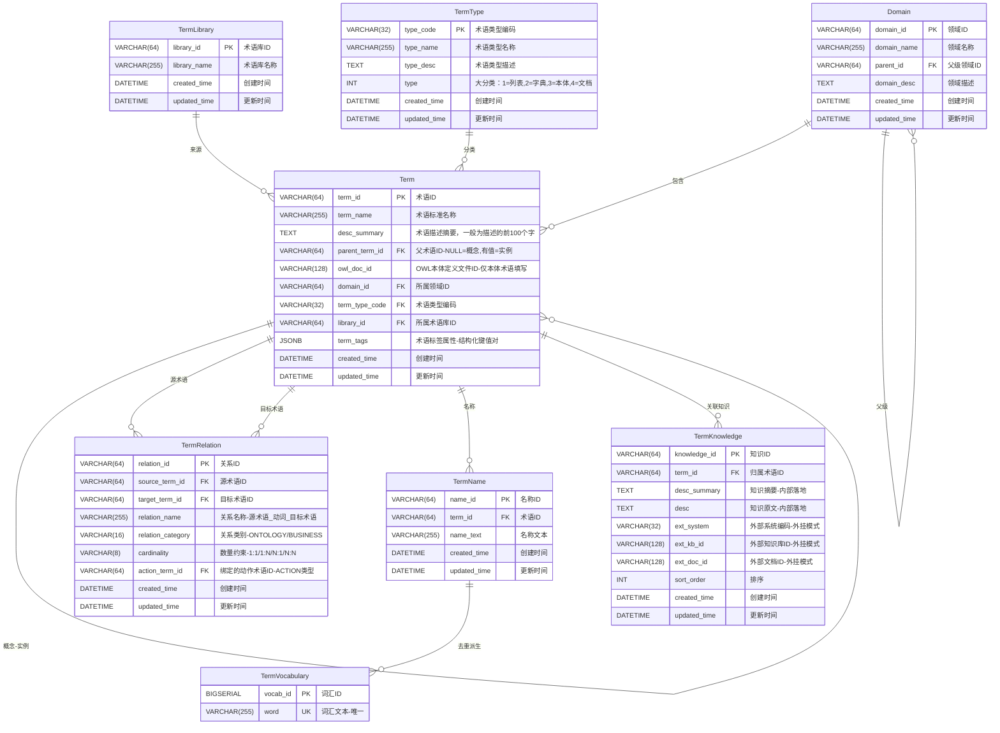

**表设计概要：**

| 表名 | 核心职责 | 设计要点 |
|------|---------|---------|
| TermLibrary | 管理术语来源 | 极简设计，仅保留 ID 和名称，用于区分术语来源 |
| Domain | 术语分类目录 | 支持层级结构，parent_id 自关联 |
| TermType | 术语类型编码 | 扁平化设计，无层级关系，用途通过 type_code 直接表达 |
| Term | 术语主表 | JSONB 存储标签属性，desc_summary 保留展示用摘要 |
| TermKnowledge | 术语关联知识 | 一对多挂载术语知识；内部落地支持全文检索，外挂模式通过 ext_system + ext_kb_id + ext_doc_id 三元组定位外部文档 |
| TermRelation | 术语间关系 | 两类关系（ONTOLOGY/BUSINESS）；ONTOLOGY 使用 8 个标准枚举，action_term_id 绑定 ACTION 类型术语 |
| TermName | 术语所有名称 | 包含标准名称、别名、缩写等，增加拼音和长度字段用于近似匹配 |
| TermVocabulary | 分词词典数据源 | TermName 去重派生表，为 jieba 提供自定义词典数据 |

### 3.2 详细库表设计

#### 3.2.0 术语库表（TermLibrary）

术语库表用于管理术语的来源信息，区分不同来源的术语集合。通过术语库可以追溯术语的创建渠道，并在多来源术语共存时进行有效管理。表结构极简，只保留 ID 和名称。

```sql
CREATE TABLE term_library (
    library_id     VARCHAR(64)   NOT NULL PRIMARY KEY,
    library_name   VARCHAR(255)  NOT NULL,
    created_time   TIMESTAMP     NOT NULL DEFAULT CURRENT_TIMESTAMP,
    updated_time   TIMESTAMP     NOT NULL DEFAULT CURRENT_TIMESTAMP
);

-- 术语库名称索引
CREATE INDEX idx_lib_name ON term_library(library_name);
```

| 字段名 | 字段类型 | 是否必填 | 说明 |
| ---------------- | ------------------ | ------------------ | ------------------------------------------------------------ |
| library_id       | VARCHAR(64)        | 是                 | 术语库 ID，主键                                               |
| library_name     | VARCHAR(255)       | 是                 | 术语库名称，如「HR系统术语库」「CRM术语库」                     |
| created_time     | DATETIME           | 是                 | 创建时间                                                      |
| updated_time     | DATETIME           | 是                 | 更新时间                                                      |

**设计说明：**

术语库只保留 ID 和名称两个业务字段，职责单一 —— 仅用于**标识术语来源**。知识库连接配置（API URL、API Key 等）属于应用级配置，应由应用配置中心统一管理，不在数据库层存储。

术语与外部知识库文档通过 `TermKnowledge` 表的外挂三元组（`ext_system + ext_kb_id + ext_doc_id`）关联，无需通过 TermLibrary 中转。

**示例数据：**

| library_id | library_name |
|------------|-------------|
| LIB_001 | HR系统术语库 |
| LIB_002 | CRM术语库 |
| LIB_003 | 基础业务术语 |
| LIB_004 | 手动补充术语 |
| LIB_005 | 2026Q1导入批次 |
| LIB_006 | 产品文档知识库 |

#### 3.2.1 领域表（Domain）

领域表用于管理术语的分类目录结构。

```sql
CREATE TABLE domain (
    domain_id    VARCHAR(64)   NOT NULL PRIMARY KEY,
    domain_name  VARCHAR(255)  NOT NULL,
    parent_id    VARCHAR(64),
    domain_desc  TEXT,
    created_time TIMESTAMP     NOT NULL DEFAULT CURRENT_TIMESTAMP,
    updated_time TIMESTAMP     NOT NULL DEFAULT CURRENT_TIMESTAMP,
    FOREIGN KEY (parent_id) REFERENCES domain(domain_id)
);

-- 父级领域索引
CREATE INDEX idx_domain_parent ON domain(parent_id);

-- 领域名称索引
CREATE INDEX idx_domain_name ON domain(domain_name);
```

| 字段名 | 字段类型 | 是否必填 | 说明 |
| ---------------- | ------------------ | ------------------ | ------------------------------------------ |
| domain_id        | VARCHAR(64)        | 是                 | 领域 ID，主键                               |
| domain_name      | VARCHAR(255)       | 是                 | 领域名称                                   |
| parent_id        | VARCHAR(64)        | 否                 | 父级领域 ID，用于构建层级结构，根节点为 NULL |
| domain_desc      | TEXT               | 否                 | 领域描述                                   |
| created_time     | DATETIME           | 是                 | 创建时间                                   |
| updated_time     | DATETIME           | 是                 | 更新时间                                   |

**示例数据：**

| domain_id | domain_name | parent_id | domain_desc |
|-----------|-------------|-----------|-------------|
| DOMAIN_001 | 组织管理 | NULL | 企业组织架构相关术语 |
| DOMAIN_002 | 员工管理 | DOMAIN_001 | 员工信息、入职离职等 |


#### 3.2.2 术语类型表（TermType）

术语类型表用于定义术语的分类编码体系，采用**扁平化设计**。用途信息（如用于对象、函数、入参等）通过类型编码直接表达，无需单独的用途表。

```sql
CREATE TABLE term_type (
    type_code      VARCHAR(32)   NOT NULL PRIMARY KEY,
    type_name      VARCHAR(255)  NOT NULL,
    type_desc      TEXT,
    type           INT           NOT NULL COMMENT '大分类：1=列表术语,2=字典术语,3=本体术语,4=文档名称术语',
    created_time   TIMESTAMP     NOT NULL DEFAULT CURRENT_TIMESTAMP,
    updated_time   TIMESTAMP     NOT NULL DEFAULT CURRENT_TIMESTAMP
);

-- 类型名称索引
CREATE INDEX idx_type_name ON term_type(type_name);

-- 大分类索引
CREATE INDEX idx_type_category ON term_type(type);
```

| 字段名 | 字段类型 | 是否必填 | 说明 |
| ---------------- | ------------------ | ------------------ | ------------------------------------------ |
| type_code        | VARCHAR(32)        | 是                 | 术语类型编码，主键，扁平化设计（如 OBJ=对象, PARAM=入参, VIEW=视图） |
| type_name        | VARCHAR(255)       | 是                 | 术语类型名称                               |
| type_desc        | TEXT               | 否                 | 术语类型描述                               |
| type             | INT                | 是                 | 大分类：1=列表术语, 2=字典术语, 3=本体术语, 4=文档名称术语 |
| created_time     | DATETIME           | 是                 | 创建时间                                   |
| updated_time     | DATETIME           | 是                 | 更新时间                                   |

**设计说明：**

- **扁平化设计**：类型之间无父子关系，用途直接通过 type_code 表达
- **大分类（type）**：用于区分术语的基本类别，与具体业务类型正交
- **实例→概念的遍历**：通过 `term_type_code → type_name` 查找同名的概念术语，无需额外 FK

**示例数据：**

| type_code | type_name | type_desc | type |
|-----------|-----------|-----------|------|
| EMPLOYEE | 员工 | 员工列表术语 | 1 |
| GENERAL | 通用 | 字典/枚举类术语，如销售 | 2 |
| OBJ | 对象 | 本体-对象类型，如员工、组织、合同 | 3 |
| VIEW | 视图 | 本体-视图类型，如员工视图、组织视图 | 3 |
| FUNC | 函数 | 本体-函数类型，如查询函数、计算函数 | 3 |
| PARAM | 入参 | 本体-入参类型，如函数入参、动作入参 | 3 |
| PROP | 属性 | 本体-属性类型，如对象属性、参数属性 | 3 |
| ACTION | 动作 | 本体-动作类型，如查询动作、提交动作 | 3 |
| DOC | 文档名称 | 文档名称术语，如产品手册、接口文档 | 4 |


#### 3.2.3 术语表（Term）

术语表中的 `term_name` 为**标准名称**，是术语的唯一规范名称。术语的所有名称（包括标准名称、别名、缩写等）统一存储在 TermName 表中。

```sql
CREATE TABLE term (
    term_id          VARCHAR(64)   NOT NULL PRIMARY KEY,
    term_name        VARCHAR(255)  NOT NULL COMMENT '术语标准名称',
    desc_summary     TEXT          COMMENT '术语描述摘要，用于快速展示，一般为描述的前100个字',
    parent_term_id   VARCHAR(64)   COMMENT 'NULL=概念术语；有值=实例术语，指向所属概念的 term_id',
    owl_doc_id       VARCHAR(128)  COMMENT '本体定义文件ID，仅本体术语（TermType.type=3）填写；通过该ID获取对应的OWL文件',
    domain_id        VARCHAR(64)   NOT NULL,
    term_type_code   VARCHAR(32)   NOT NULL,
    library_id       VARCHAR(64),
    term_tags        JSONB         DEFAULT '{}',
    created_time     TIMESTAMP     NOT NULL DEFAULT CURRENT_TIMESTAMP,
    updated_time     TIMESTAMP     NOT NULL DEFAULT CURRENT_TIMESTAMP,
    FOREIGN KEY (parent_term_id) REFERENCES term(term_id),
    FOREIGN KEY (domain_id) REFERENCES domain(domain_id),
    FOREIGN KEY (term_type_code) REFERENCES term_type(type_code),
    FOREIGN KEY (library_id) REFERENCES term_library(library_id)
);

-- 标签属性 GIN 索引：支持 @> 包含查询和键值筛选
CREATE INDEX idx_term_tags ON term USING GIN (term_tags);

-- 术语名称索引：支持精确匹配和前缀查询
CREATE INDEX idx_term_name ON term (term_name);

-- 概念-实例索引：查询某概念下的所有实例
CREATE INDEX idx_term_parent ON term (parent_term_id);

-- OWL文件ID索引：通过 owl_doc_id 反查本体术语（仅本体术语有值）
CREATE INDEX idx_term_owl ON term (owl_doc_id) WHERE owl_doc_id IS NOT NULL;

-- 领域索引
CREATE INDEX idx_term_domain ON term (domain_id);

-- 术语类型索引
CREATE INDEX idx_term_type ON term (term_type_code);

-- 术语库索引：支持按来源筛选
CREATE INDEX idx_term_library ON term (library_id);
```

**字段说明：**

| 字段 | 类型 | 说明 | 索引 |
|------|------|------|------|
| parent_term_id | VARCHAR(64) | 概念-实例标识。`NULL` = 概念术语（如"员工"、"合同"）；有值 = 实例术语，FK 指向所属概念的 `term_id`（如"王小明"→ TERM_EMP） | B-Tree |
| owl_doc_id | VARCHAR(128) | 本体定义文件 ID，**仅本体术语**（`TermType.type = 3`）填写；通过该 ID 可获取对应的 OWL 格式本体定义文件，非本体术语留 NULL | 条件 B-Tree |
| library_id | VARCHAR(64) | 术语所属术语库 ID，外键关联 `term_library` 表，用于标识术语来源；允许为空（兼容历史数据） | B-Tree |
| desc_summary | TEXT | 术语描述摘要，用于快速展示，一般为描述的前 100 个字；完整知识内容及外部知识库文档关联统一在 `TermKnowledge` 表管理 | — |
| term_tags | JSONB | 术语标签属性，结构化键值对格式；key 为标签维度术语ID，value 为结构化对象 `{type, value}`，`type` 支持 `TERM_REF`（术语引用）、`TEXT`（文本）、`NUMBER`（数值）、`DATE`（日期）、`DATETIME`（日期时间）、`BOOLEAN`（布尔值） | GIN |

**term_tags 数据格式：**

```
key   = 标签维度术语ID（如「合同金额」「客户名称」对应的术语ID）
value = {
    "type":  "TERM_REF" | "TEXT" | "NUMBER" | "DATE" | "DATETIME" | "BOOLEAN",   // 类型说明见下表
    "value": <term_id> | <literal>  // 根据type不同，value为对应的值
}
```

**type 类型说明：**

| type | 说明 | value示例 |
|------|------|-----------|
| `TERM_REF` | 术语引用，值引用另一个术语的ID | `"TERM_MOBILE"` |
| `TEXT` | 普通文本 | `"已签约"`、`"杭州"` |
| `NUMBER` | 数值类型 | `5500000`、`3.14` |
| `DATE` | 日期类型（仅日期） | `"2025-03-10"`、`"2024-05"` |
| `DATETIME` | 日期时间类型 | `"2025-03-10T14:30:00"`、`"2025-03-10 14:30:00"` |
| `BOOLEAN` | 布尔类型 | `true`、`false` |

**term_tags 数据示例：**

```json
// 列表术语-合同级别（B市数智运营项目合同）
{
    "TERM_AMOUNT": {
        "type": "NUMBER",
        "value": 5500000
    },
    "TERM_CUSTOMER": {
        "type": "TERM_REF",
        "value": "TERM_MOBILE"
    },
    "TERM_SIGN_DATE": {
        "type": "DATE",
        "value": "2025-03-10"
    },
    "TERM_SIGN_DATETIME": {
        "type": "DATETIME",
        "value": "2025-03-10T14:30:00"
    },
    "TERM_SIGN_STATUS": {
        "type": "TEXT",
        "value": "已签约"
    },
    "TERM_SIGN_PERSON": {
        "type": "TERM_REF",
        "value": "TERM_XIAOMING"
    },
    "TERM_IS_URGENT": {
        "type": "BOOLEAN",
        "value": true
    }
}

// 列表术语-人员级别（王小明）
{
    "TERM_ROLE": {
        "type": "TERM_REF",
        "value": "TERM_SALES"
    },
    "TERM_LEVEL": {
        "type": "TEXT",
        "value": "M1"
    },
    "TERM_LOCATION": {
        "type": "TEXT",
        "value": "杭州"
    },
    "TERM_AGE": {
        "type": "NUMBER",
        "value": 28
    },
    "TERM_IS_MANAGER": {
        "type": "BOOLEAN",
        "value": false
    },
    "TERM_ENTRY_DATE": {
        "type": "DATE",
        "value": "2020-06-15"
    }
}

// 列表术语-系统日志级别（操作记录）
{
    "TERM_LOG_TYPE": {
        "type": "TEXT",
        "value": "操作日志"
    },
    "TERM_LOG_LEVEL": {
        "type": "TEXT",
        "value": "INFO"
    },
    "TERM_OPERATION_TIME": {
        "type": "DATETIME",
        "value": "2025-03-10T14:30:00+08:00"
    },
    "TERM_OPERATOR": {
        "type": "TERM_REF",
        "value": "TERM_XIAOMING"
    },
    "TERM_IS_SUCCESS": {
        "type": "BOOLEAN",
        "value": true
    },
    "TERM_RESPONSE_TIME_MS": {
        "type": "NUMBER",
        "value": 256.5
    }
}
```

**设计说明：**

- **TERM_REF 类型**：value 引用另一个术语的 term_id，存储的是标准化的关联关系。例如「客户名称」的值是术语「移动」的ID，而不是自由文本
- **TEXT 类型**：value 为自由输入的文本，不关联任何术语。例如「签约状态」的值 `"已签约"` 就是一个字面文本
- **NUMBER 类型**：value 为数值，支持整数和小数。例如「合同金额」的值 `5500000` 或响应时间 `256.5`
- **DATE 类型**：value 为日期字符串，格式为 `YYYY-MM-DD` 或 `YYYY-MM`
- **DATETIME 类型**：value 为日期时间字符串，格式为 `YYYY-MM-DDTHH:mm:ss` 或 `YYYY-MM-DD HH:mm:ss`，可带时区
- **BOOLEAN 类型**：value 为布尔值 `true` 或 `false`
- **反向查询**：可以通过遍历 JSONB 的 value 找到所有引用了某个术语的记录（如「哪些合同关联了移动客户？」）

**term_tags 查询示例：**

```sql
-- 1. 精确匹配 TERM_REF 类型（客户是 TERM_MOBILE 术语 且 签约人是 TERM_XIAOMING 术语）—— 走 GIN 索引
SELECT * FROM term
WHERE term_tags @> '{"TERM_CUSTOMER": {"type": "TERM_REF", "value": "TERM_MOBILE"}}'::jsonb
  AND term_tags @> '{"TERM_SIGN_PERSON": {"type": "TERM_REF", "value": "TERM_XIAOMING"}}'::jsonb;

-- 2. 精确匹配 TEXT 类型（签约状态为"已签约"）—— 走 GIN 索引
SELECT * FROM term
WHERE term_tags @> '{"TERM_SIGN_STATUS": {"type": "TEXT", "value": "已签约"}}'::jsonb;

-- 3. 精确匹配 BOOLEAN 类型（紧急标记为true）—— 走 GIN 索引
SELECT * FROM term
WHERE term_tags @> '{"TERM_IS_URGENT": {"type": "BOOLEAN", "value": true}}'::jsonb;

-- 4. 精确匹配 DATE 类型（签约日期为2025-03-10）—— 走 GIN 索引
SELECT * FROM term
WHERE term_tags @> '{"TERM_SIGN_DATE": {"type": "DATE", "value": "2025-03-10"}}'::jsonb;

-- 5. NUMBER 数值范围查询
SELECT * FROM term
WHERE (term_tags -> 'TERM_AMOUNT' ->> 'value')::numeric > 5000000;

-- 6. DATE/DATETIME 日期范围查询
SELECT * FROM term
WHERE (term_tags -> 'TERM_SIGN_DATE' ->> 'value')::date BETWEEN '2025-01-01' AND '2025-12-31';

SELECT * FROM term
WHERE (term_tags -> 'TERM_OPERATION_TIME' ->> 'value')::timestamp > '2025-03-10 00:00:00';

-- 7. 键存在性查询（标签维度是否存在）
SELECT * FROM term
WHERE term_tags ? 'TERM_AMOUNT';

-- 8. 反向查询：查找所有引用了某个术语的记录
SELECT * FROM term t
WHERE EXISTS (
    SELECT 1 FROM jsonb_each(t.term_tags) AS kv(key, val)
    WHERE val ->> 'type' = 'TERM_REF'
      AND val ->> 'value' = 'TERM_MOBILE'
);

-- 9. 组合查询示例：查找2024年5月的金额大于100万的已签约合同
SELECT t.term_id, t.term_name, t.term_tags
FROM term t
WHERE t.term_tags @> '{"TERM_SIGN_STATUS": {"type": "TEXT", "value": "已签约"}}'::jsonb
  AND (t.term_tags -> 'TERM_AMOUNT' ->> 'value')::numeric > 1000000
  AND (t.term_tags -> 'TERM_SIGN_DATE' ->> 'value')::date >= '2024-05-01'
  AND (t.term_tags -> 'TERM_SIGN_DATE' ->> 'value')::date < '2024-06-01';
```

**示例数据：**

| term_id | term_name | parent_term_id | owl_doc_id | term_type_code | desc_summary | domain_id |
|---------|-----------|----------------|------------|----------------|-----------|-----------|
| TERM_EMP_VIEW | 员工视图 | NULL | owl_emp_view_001 | VIEW | 以员工为中心的数据视图 | DOMAIN_001 |
| TERM_EMP | 员工 | NULL | owl_emp_001 | OBJ | 企业员工概念术语 | DOMAIN_001 |
| TERM_APPLY_LEAVE | 申请请假 | NULL | owl_leave_001 | ACTION | 员工发起请假申请的动作 | DOMAIN_001 |
| TERM_XIAOMING | 王小明 | TERM_EMP | NULL | EMPLOYEE | 销售员工王小明，归属华东大区 | DOMAIN_002 |
| TERM_LISI | 李四 | TERM_EMP | NULL | EMPLOYEE | 技术员工李四，归属研发中心 | DOMAIN_002 |
| TERM_CONTRACT | 合同 | NULL | NULL | CONTRACT | 销售合同概念术语 | DOMAIN_003 |
| TERM_BO | B市数智运营项目合同 | TERM_CONTRACT | NULL | CONTRACT | 具体合同实例 | DOMAIN_003 |

> **说明**：`owl_doc_id` 仅本体术语（VIEW、OBJ、ACTION、FUNC、PARAM 类型）填写，列表/字典类术语及实例术语留 NULL。


#### 3.2.4 术语关联知识表（TermKnowledge）

术语关联知识表用于挂载术语相关的业务知识，支持**内部落地**和**外挂**两种模式，可单独使用也可兼备。外挂模式通过 `ext_system + ext_kb_id + ext_doc_id` 三元组唯一定位外部文档。

| 模式 | 适用场景 | desc_summary | desc | 外挂三元组 |
|------|---------|:---:|:---:|:---:|
| 外挂模式 | 文档在外部知识库，委托向量检索 | — | — | ✅ |
| 内部落地 | 知识内容直接写入本地，支持全文检索 | ✅ | ✅ | — |
| 内外兼备 | 本地存内容，同时同步外部 KB 做向量检索 | ✅ | ✅ | ✅ |

```sql
CREATE TABLE term_knowledge (
    knowledge_id VARCHAR(64)   NOT NULL PRIMARY KEY,
    term_id      VARCHAR(64)   NOT NULL,
    -- 内部落地：知识直接写入本地
    desc_summary TEXT                    COMMENT '知识摘要，约200字，用于快速展示与关键字检索',
    desc         TEXT                    COMMENT '知识原文，完整内容，用于本地全文检索',
    -- 外挂模式：外部知识库三元组定位
    ext_system   VARCHAR(32)             COMMENT '外部系统编码，如 RAGFLOW / DIFY / CONFLUENCE',
    ext_kb_id    VARCHAR(128)            COMMENT '外部知识库ID，在对应系统内唯一标识知识库',
    ext_doc_id   VARCHAR(128)            COMMENT '外部文档ID，在对应知识库内唯一标识文档；由外部KB负责chunk embedding与向量检索',
    sort_order   INT           DEFAULT 0 COMMENT '同一术语下多条知识的展示排序',
    created_time TIMESTAMP     NOT NULL DEFAULT CURRENT_TIMESTAMP,
    updated_time TIMESTAMP     NOT NULL DEFAULT CURRENT_TIMESTAMP,
    -- 至少有内容或外挂引用之一
    CONSTRAINT chk_tk_not_empty CHECK (
        desc_summary IS NOT NULL OR desc IS NOT NULL OR ext_doc_id IS NOT NULL
    ),
    -- 外挂三元组完整性：有 ext_doc_id 必须同时有 ext_system 和 ext_kb_id
    CONSTRAINT chk_tk_ext_complete CHECK (
        ext_doc_id IS NULL OR (ext_system IS NOT NULL AND ext_kb_id IS NOT NULL)
    ),
    FOREIGN KEY (term_id) REFERENCES term(term_id)
);

-- 术语ID索引：按术语查询所有关联知识
CREATE INDEX idx_tk_term ON term_knowledge(term_id);

-- 摘要全文检索索引（GIN）
CREATE INDEX idx_tk_summary_fts ON term_knowledge
    USING GIN (to_tsvector('simple', COALESCE(desc_summary, '')));

-- 原文全文检索索引（GIN）
CREATE INDEX idx_tk_desc_fts ON term_knowledge
    USING GIN (to_tsvector('simple', COALESCE(desc, '')));

-- 外挂模式反查索引：向量召回后通过 doc_id 找到归属术语
CREATE INDEX idx_tk_ext_doc ON term_knowledge(ext_system, ext_kb_id, ext_doc_id)
    WHERE ext_doc_id IS NOT NULL;
```

**字段说明：**

| 字段名 | 字段类型 | 是否必填 | 说明 |
| ------------ | ------------ | -------- | ---- |
| knowledge_id | VARCHAR(64)  | 是 | 知识 ID，主键 |
| term_id      | VARCHAR(64)  | 是 | 归属术语 ID，外键关联术语表 |
| desc_summary | TEXT         | 否 | 知识摘要（约200字）；内部落地时填写，用于快速展示与本地关键字检索 |
| desc         | TEXT         | 否 | 知识原文，完整内容；内部落地时填写，支持本地全文检索 |
| ext_system   | VARCHAR(32)  | 否 | 外部系统编码，如 `RAGFLOW`、`DIFY`、`CONFLUENCE`；外挂模式时必填 |
| ext_kb_id    | VARCHAR(128) | 否 | 外部知识库 ID；在对应系统内唯一标识知识库；外挂模式时必填 |
| ext_doc_id   | VARCHAR(128) | 否 | 外部文档 ID；在对应知识库内唯一标识文档；由外部 KB 负责 chunk embedding 与向量检索 |
| sort_order   | INT          | 否 | 同一术语下多条知识的展示排序，默认 0 |
| created_time | TIMESTAMP    | 是 | 创建时间 |
| updated_time | TIMESTAMP    | 是 | 更新时间 |

> **约束1**：`desc_summary`、`desc`、`ext_doc_id` 三者不能同时为 NULL。
> **约束2**：有 `ext_doc_id` 时，`ext_system` 和 `ext_kb_id` 必须同时填写（三元组完整性）。

**检索链路：**

**关键字检索（内部落地，全走本地 DB）：**

```
用户输入关键字（如"销售提成"）
  → GIN 全文检索 desc_summary / desc
  → 返回匹配行的 term_id
  → 组装术语上下文
```

**向量语义检索（外挂模式，本地 DB + 外部 KB）：**

```
用户输入语义查询（如"销售提成如何计算"）
  → 调外部 KB API（ext_system + ext_kb_id 定位具体知识库）做向量检索
  → 返回相关 doc_chunk，携带 doc_id
  → SELECT term_id FROM term_knowledge WHERE ext_system=? AND ext_kb_id=? AND ext_doc_id=?
  → 找到归属术语，再做术语关系遍历
```

**示例数据：**

| knowledge_id | term_id | desc_summary | ext_system | ext_kb_id | ext_doc_id | sort_order |
|-------------|---------|--------------|-----------|-----------|------------|:---:|
| TK_001 | TERM_SALES | NULL | RAGFLOW | KB_HR_001 | doc_sales_mgmt_001 | 1 |
| TK_002 | TERM_SALES | NULL | RAGFLOW | KB_HR_001 | doc_sales_attend_001 | 2 |
| TK_003 | TERM_EMP | 员工入职须知、行为规范及福利政策说明... | NULL | NULL | NULL | 1 |
| TK_004 | TERM_CONTRACT | 合同签订、归档、变更及解除的操作规范... | DIFY | KB_LEGAL_002 | doc_contract_001 | 1 |


#### 3.2.5 术语关系表（TermRelation）

术语关系表用于存储术语之间的关联关系，支持两类关系：本体论结构关系（ONTOLOGY）和业务自定义关系（BUSINESS）。ONTOLOGY 类关系的 relation_name 使用标准枚举，BUSINESS 类关系的 relation_name 自由定义。

```sql
CREATE TABLE term_relation (
    relation_id        VARCHAR(64)   NOT NULL PRIMARY KEY,
    source_term_id     VARCHAR(64)   NOT NULL,
    target_term_id     VARCHAR(64)   NOT NULL,
    relation_name      VARCHAR(255)  NOT NULL COMMENT '格式：源术语_动词_目标术语；ONTOLOGY类型使用标准枚举',
    relation_category  VARCHAR(16)   NOT NULL DEFAULT 'BUSINESS'
                       COMMENT 'ONTOLOGY=本体论结构关系 | BUSINESS=业务自定义关系',
    cardinality        VARCHAR(8)    COMMENT '数量约束：1:1 | 1:N | N:1 | N:N',
    action_term_id     VARCHAR(64)   COMMENT '绑定的动作术语ID，FK 关联 term_type_code=ACTION 的术语',
    created_time       TIMESTAMP     NOT NULL DEFAULT CURRENT_TIMESTAMP,
    updated_time       TIMESTAMP     NOT NULL DEFAULT CURRENT_TIMESTAMP,
    FOREIGN KEY (source_term_id) REFERENCES term(term_id),
    FOREIGN KEY (target_term_id) REFERENCES term(term_id),
    FOREIGN KEY (action_term_id) REFERENCES term(term_id)
);

-- 唯一索引：防止重复关系
CREATE UNIQUE INDEX idx_tr_unique_relation
ON term_relation (source_term_id, target_term_id, relation_name);

-- 目标术语索引：支持反向查询及图遍历性能优化
CREATE INDEX idx_tr_target ON term_relation(target_term_id);

-- 关系类别索引：支持按类别筛选
CREATE INDEX idx_tr_category ON term_relation(relation_category);

-- 动作术语索引：支持按动作查询关联关系
CREATE INDEX idx_tr_action ON term_relation(action_term_id)
    WHERE action_term_id IS NOT NULL;
```

**字段说明：**

| 字段名 | 字段类型 | 是否必填 | 说明 |
| ----------------- | ------------ | -------- | ---- |
| relation_id       | VARCHAR(64)  | 是 | 关系 ID，主键 |
| source_term_id    | VARCHAR(64)  | 是 | 源术语 ID，外键关联术语表 |
| target_term_id    | VARCHAR(64)  | 是 | 目标术语 ID，外键关联术语表 |
| relation_name     | VARCHAR(255) | 是 | 关系名称，格式「源术语_动词_目标术语」；ONTOLOGY 类型使用标准枚举（见下表），BUSINESS 类型自由定义 |
| relation_category | VARCHAR(16)  | 是 | 关系类别：`ONTOLOGY` \| `BUSINESS`，默认 BUSINESS |
| cardinality       | VARCHAR(8)   | 否 | 数量约束：`1:1` \| `1:N` \| `N:1` \| `N:N` |
| action_term_id    | VARCHAR(64)  | 否 | 绑定的动作术语 ID（term_type_code = ACTION）；ONTOLOGY 纯结构关系中 target 本身已是 ACTION 术语时留 NULL |
| created_time      | TIMESTAMP    | 是 | 创建时间 |
| updated_time      | TIMESTAMP    | 是 | 更新时间 |

**ONTOLOGY 标准 relation_name 枚举：**

| 枚举编码 | relation_name | 源类型 | 目标类型 | cardinality | 说明 |
|----------|--------------|--------|---------|:-----------:|------|
| `VIEW_HAS_OBJ` | 视图_包含_对象 | VIEW | OBJ | 1:N | 一个视图包含若干对象 |
| `OBJ_HAS_ACTION` | 对象_包含_动作 | OBJ | ACTION | 1:N | 一个对象包含若干可执行动作 |
| `OBJ_HAS_PROP` | 对象_包含_属性 | OBJ | PROP | 1:N | 一个对象包含若干属性 |
| `ACTION_HAS_FUNC` | 动作_包含_函数 | ACTION | FUNC | 1:N | 一个动作包含若干实现函数 |
| `ACTION_HAS_PARAM` | 动作_包含_参数 | ACTION | PARAM | 1:N | 一个动作包含若干参数 |
| `FUNC_HAS_PARAM` | 函数_包含_参数 | FUNC | PARAM | 1:N | 一个函数包含若干参数 |
| `PARAM_BIND_IN` | 参数_入参绑定_术语 | PARAM | any | 1:1 | 参数作为入参，绑定到对应类型术语 |
| `PARAM_BIND_OUT` | 参数_出参绑定_术语 | PARAM | any | 1:1 | 参数作为出参，绑定到对应类型术语 |

> **说明**：ONTOLOGY 关系的 `action_term_id` 通常为 NULL，因为 target 本身（如 ACTION、PARAM 术语）已经携带了动作语义。BUSINESS 关系的 `action_term_id` 推荐填写，指向可调用的 ACTION 术语。

**示例数据：**

| relation_id | source_term_id | target_term_id | relation_name | category | cardinality | action_term_id |
|-------------|----------------|----------------|---------------|----------|:-----------:|----------------|
| REL_001 | TERM_EMP_VIEW | TERM_EMP | 视图_包含_对象 | ONTOLOGY | 1:N | NULL |
| REL_002 | TERM_EMP | TERM_APPLY_LEAVE | 对象_包含_动作 | ONTOLOGY | 1:N | NULL |
| REL_003 | TERM_EMP | TERM_EMP_CODE | 对象_包含_属性 | ONTOLOGY | 1:N | NULL |
| REL_004 | TERM_APPLY_LEAVE | TERM_QUERY_LEAVE | 动作_包含_函数 | ONTOLOGY | 1:N | NULL |
| REL_005 | TERM_APPLY_LEAVE | TERM_START_DATE | 动作_包含_参数 | ONTOLOGY | 1:N | NULL |
| REL_006 | TERM_QUERY_LEAVE | TERM_EMP_ID_PARAM | 函数_包含_参数 | ONTOLOGY | 1:N | NULL |
| REL_007 | TERM_START_DATE | TERM_DATE_TYPE | 参数_入参绑定_术语 | ONTOLOGY | 1:1 | NULL |
| REL_008 | TERM_QUERY_RESULT | TERM_LEAVE_LIST | 参数_出参绑定_术语 | ONTOLOGY | 1:1 | NULL |
| REL_009 | TERM_EMP | TERM_APPLY_LEAVE | 员工_可以_申请请假 | BUSINESS | NULL | TERM_APPLY_LEAVE |
| REL_010 | TERM_EMP | TERM_APPLY_INVOICE | 员工_可以_申请发票 | BUSINESS | NULL | TERM_APPLY_INVOICE |


#### 3.2.6 术语名称表（TermName）

术语名称表用于存储术语的**所有名称**，包括标准名称、别名、缩写、全称等。当术语新增或修改时，术语的标准名称（term.term_name）也会同步写入本表，确保本表包含所有可匹配的名称。

```sql
CREATE TABLE term_name (
    name_id      VARCHAR(64)   NOT NULL PRIMARY KEY,
    term_id      VARCHAR(64)   NOT NULL,
    name_text    VARCHAR(255)  NOT NULL,
    created_time TIMESTAMP     NOT NULL DEFAULT CURRENT_TIMESTAMP,
    updated_time TIMESTAMP     NOT NULL DEFAULT CURRENT_TIMESTAMP,
    FOREIGN KEY (term_id) REFERENCES term(term_id)
);

-- 名称文本索引：支持精确匹配和前缀查询
CREATE INDEX idx_tn_name_text ON term_name(name_text);

-- 术语ID索引：支持按术语查询所有名称
CREATE INDEX idx_tn_term ON term_name(term_id);
```

| 字段名 | 字段类型 | 是否必填 | 说明 |
| ---------------- | ------------------ | ------------------ | ---- |
| name_id          | VARCHAR(64)        | 是                 | 名称 ID，主键 |
| term_id          | VARCHAR(64)        | 是                 | 术语 ID，外键关联术语表 |
| name_text        | VARCHAR(255)       | 是                 | 名称文本（标准名称、别名、缩写等） |
| created_time     | TIMESTAMP          | 是                 | 创建时间 |
| updated_time     | TIMESTAMP          | 是                 | 更新时间 |

**名称类型判定逻辑：**

术语名称表中**不再存储 name_type 字段**，而是通过以下规则判断名称类型：

| 判定条件 | 名称类型 |
|----------|----------|
| `name_text = Term.term_name` | 标准名称（standard） |
| `name_text ≠ Term.term_name` | 别名（alias） |

**名称同步逻辑：**

当术语新增或标准名称变更时，自动同步维护 TermName 表：

```
术语新增 → 将 term_name 写入 term_name 表
术语标准名称修改 → 更新 term_name 表中对应的记录
```

**示例数据：**

| name_id | term_id | name_text |
|---------|---------|-----------|
| NAME_001 | TERM_001 | 员工 |
| NAME_002 | TERM_001 | 职员 |
| NAME_003 | TERM_001 | 员工编码 |
| NAME_004 | TERM_002 | 王小明 |
| NAME_005 | TERM_002 | 小王 |
| NAME_006 | TERM_002 | 销售王小明 |
| NAME_007 | TERM_003 | 王大明 |

> **说明**：
> - TERM_001 的标准名称是「员工」，name_text=员工 的记录为标准名称
> - TERM_002 的标准名称是「王小明」，name_text=王小明 的记录为标准名称
> - 其他 name_text 与 term_name 不等的记录均为别名

#### 3.2.7 术语词汇表（TermVocabulary）

术语词汇表存储从 `TermName.name_text` 去重后的所有词汇，作为 jieba 分词器自定义词典的数据来源。该表是一张**派生表**，由 `TermName` 表数据去重生成，仅保留词汇文本本身。`frequency`（词频）在导出 jieba 词典时实时从 `TermName` 统计引用次数，`pos`（词性）固定为 `'n'`（名词），均不在本表存储。

```sql
CREATE TABLE term_vocabulary (
    vocab_id      BIGSERIAL     NOT NULL PRIMARY KEY,
    word          VARCHAR(255)  NOT NULL
);

-- 唯一索引：确保词汇去重
CREATE UNIQUE INDEX idx_vocab_word ON term_vocabulary(word);
```

| 字段名 | 字段类型 | 是否必填 | 说明 |
| ---------------- | ------------------ | ------------------ | ---- |
| vocab_id         | BIGSERIAL          | 是                 | 词汇 ID，自增主键 |
| word             | VARCHAR(255)       | 是                 | 词汇文本，UNIQUE 约束确保去重 |

**与 TermName 的关系：**

- `word` = `SELECT DISTINCT name_text FROM term_name`
- 当 `TermName` 表发生增删改时，同步维护本表（upsert / delete）

**导出 jieba 词典时实时计算 frequency（pos 固定为 `'n'`）：**

```sql
SELECT
    tv.word,
    COUNT(DISTINCT tn.term_id) AS frequency,
    'n'                        AS pos
FROM term_vocabulary tv
JOIN term_name tn ON tn.name_text = tv.word
GROUP BY tv.word
ORDER BY frequency DESC;
```

**示例数据：**

| vocab_id | word |
|----------|------|
| 1 | 员工 |
| 2 | 王小明 |
| 3 | 合同 |
| 4 | KPI |
| 5 | 销售 |
| 6 | 王大明 |
| 7 | 考勤 |

### 3.3 核心逻辑/算法

#### 3.3.1 术语分词召回

**目标：** 对用户输入的自然语言进行分词，匹配术语库中的标准术语及其别名。

**算法流程：**

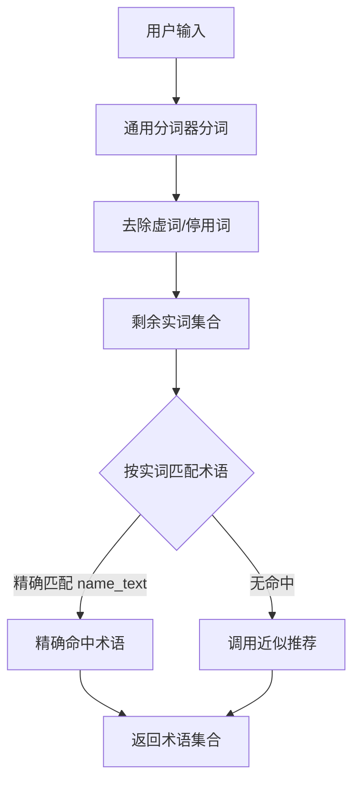

**匹配优先级：**

1. **精确匹配 TermName.name_text**：优先
2. **无命中 → 近似推荐**：兜底

**SQL 示例：**

```sql
-- 通过术语名称表精确匹配所有名称（标准名称+别名+缩写等）
SELECT DISTINCT t.term_id, t.term_name, t.desc_summary, t.term_type_code, t.term_tags
FROM term t
INNER JOIN term_name tn ON t.term_id = tn.term_id
WHERE tn.name_text IN ('王小明', '销售', '优秀');
```

#### 3.3.2 描述语义匹配路

**目标：** 使用术语描述与用户整句话进行语义匹配。

**算法流程：**

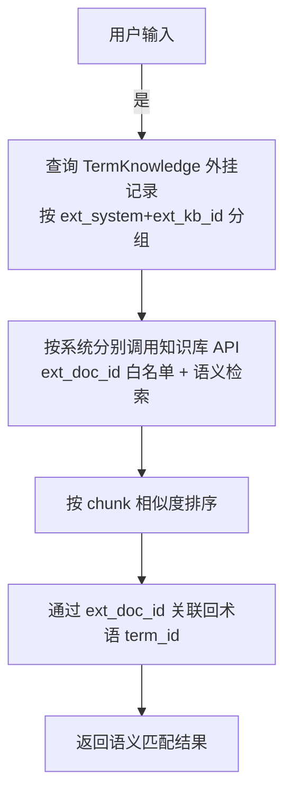

**实现方式：**

语义检索能力完全委托给外挂知识库（RAGFlow/Dify 等），术语通过 `TermKnowledge` 表的外挂三元组（`ext_system + ext_kb_id + ext_doc_id`）关联知识库中的文档，知识库负责 chunk 切分、embedding 生成和向量检索。每个 `TermKnowledge` 行指向一个具体的外部文档，同一术语可挂载多个来自不同系统或知识库的文档。


```python
# 伪代码 - 描述语义匹配路
async def semantic_match_view(query: str, view_term_ids: List[str] = None,
                              top_k: int = 5) -> List[dict]:
    """
    描述语义匹配路：基于术语关联知识的外挂文档做向量语义检索
    """
    # 1. 查询候选术语对应的外挂知识记录（按系统分组）
    rows = await db.query("""
        SELECT tk.knowledge_id, tk.term_id, t.term_name, t.term_type_code,
               tk.ext_system, tk.ext_kb_id, tk.ext_doc_id
        FROM term_knowledge tk
        JOIN term t ON t.term_id = tk.term_id
        WHERE tk.term_id = ANY(:ids)
          AND tk.ext_doc_id IS NOT NULL
    """, ids=view_term_ids)

    if not rows:
        return []

    # 2. 按 (ext_system, ext_kb_id) 分组后分别调用各自知识库 API
    from collections import defaultdict
    groups: dict = defaultdict(list)
    doc_id_map: dict = {}  # (ext_system, ext_kb_id, ext_doc_id) -> row
    for r in rows:
        groups[(r.ext_system, r.ext_kb_id)].append(r.ext_doc_id)
        doc_id_map[(r.ext_system, r.ext_kb_id, r.ext_doc_id)] = r

    results = []
    for (ext_system, ext_kb_id), doc_ids in groups.items():
        kb_client = kb_registry.get_client(ext_system, ext_kb_id)
        kb_results = await kb_client.search(
            query=query, doc_ids=doc_ids, top_k=top_k
        )
        # 3. 通过三元组关联回术语
        for chunk in kb_results:
            row = doc_id_map.get((ext_system, ext_kb_id, chunk.doc_id))
            if row:
                results.append({
                    "term_id": row.term_id,
                    "term_name": row.term_name,
                    "chunk_text": chunk.chunk_text,
                    "score": chunk.score,
                    "match_type": "knowledge_semantic",
                    "recall_path": "knowledge_semantic"
                })

    results.sort(key=lambda x: x["score"], reverse=True)
    return results[:top_k]
```

**外挂知识库关联维护时机：**

- 在 `TermKnowledge` 表新增外挂记录时，异步将文档内容上传到对应知识库，获取 `ext_doc_id` 后写入
- 批量初始化时，通过离线任务批量上传并写入外挂三元组
- 需保证 `ext_system + ext_kb_id + ext_doc_id` 三元组完整，才能触发语义匹配路

#### 3.3.3 一跳关系查询

**目标：** 查询与给定术语存在**一跳关系**（直接相连）的术语集合。这是术语知识查询的核心原子能力，**不处理多跳逻辑**，多跳由 Agent 通过多次调用本接口实现。

**应用场景：**

- 查询"王小明"的所属概念：通过 `王小明_属于_员工` 关系找到"员工"概念术语
- 查询"员工"概念的相关数据对象：通过 `员工_签订_合同`、`员工_考核_KPI` 等关系找到关联概念
- 查询某术语的动作能力：通过关系中的 `action` 字段获取可执行动作

**算法流程：**

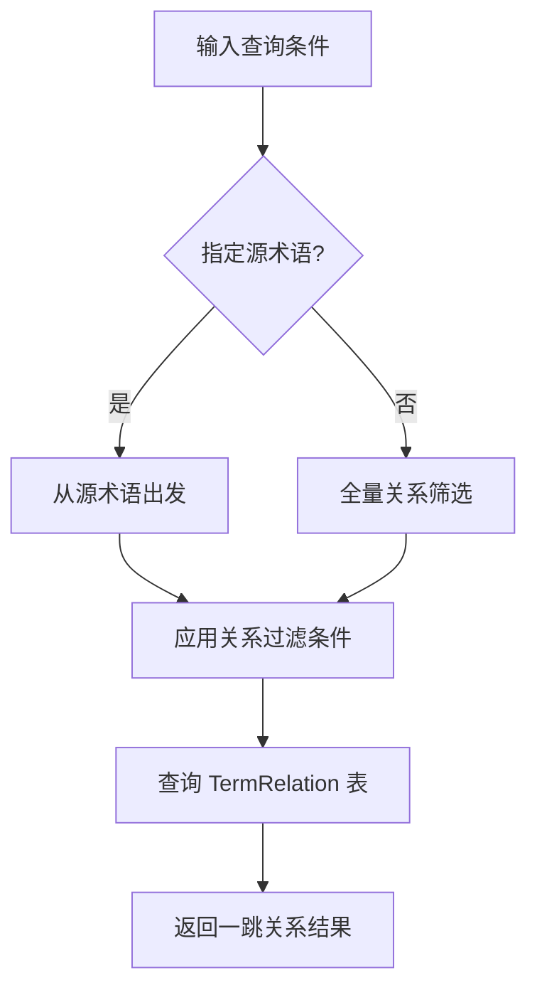

**查询能力：**

| 查询维度 | 说明 | 示例 |
|---------|------|------|
| 源术语 | 指定起始术语ID | `source_term_id = 'TERM_XIAOMING'` |
| 目标术语 | 指定目标术语ID（精确匹配） | `target_term_id = 'TERM_CONTRACT'` |
| 目标描述语义 | 按目标术语描述语义约束（向量匹配） | `target_desc_semantic = '员工绩效相关数据'` |
| 关系名称 | 按完整关系名过滤，支持通配符 | `relation_name = '员工_签订_合同'` 或 `relation_name LIKE '员工_%_合同'` |
| 动作 | 按动作描述过滤 | `action LIKE '%查询%'` |
| 方向 | 出边/入边/双向 | `direction = 'out'` |

**目标描述语义查询说明：**

当指定 `target_desc_semantic` 时，查询流程分为两步：
1. **语义召回**：通过外挂知识库检索与描述语义匹配的目标术语候选集
2. **关系过滤**：在候选集中筛选与源术语存在一跳关系的术语

这种方式适用于"查找王小明与绩效相关的数据"这类场景——用户不知道具体的术语ID，但可以通过自然语言描述来约束目标术语。

**关键设计决策：**

| 决策点 | 方案 | 原因 |
|-------|------|------|
| 查询范围 | 仅一跳 | 保持原子性，复杂多跳交给 Agent 决策 |
| 关系存储 | 显式存储所有关系 | 父子、兄弟、实例-概念等所有关系都在 `TermRelation` 表中 |
| 关系方向 | 支持出边/入边/双向查询 | 灵活满足各种查询场景 |
| 关系过滤 | 支持按关系名、动作、目标类型、目标描述语义过滤 | Agent 可精确定位所需关系 |
| 语义约束 | 先语义召回目标术语，再过滤关系 | 结合向量检索能力，支持自然语言描述约束 |

**SQL 实现（一跳关系查询）：**

```sql
-- 基础一跳关系查询：查询指定术语的所有直接关系
SELECT 
    tr.relation_id,
    tr.source_term_id,
    st.term_name AS source_term_name,
    tr.target_term_id,
    tt.term_name AS target_term_name,
    tr.relation_name,
    tr.action
FROM term_relation tr
JOIN term st ON tr.source_term_id = st.term_id
JOIN term tt ON tr.target_term_id = tt.term_id
WHERE tr.source_term_id = :term_id OR tr.target_term_id = :term_id;

-- 带过滤的一跳关系查询（按关系名、动作、目标类型过滤）
SELECT 
    tr.*,
    st.term_name AS source_term_name,
    tt.term_name AS target_term_name,
    tt.term_type_code AS target_term_type
FROM term_relation tr
JOIN term st ON tr.source_term_id = st.term_id
JOIN term tt ON tr.target_term_id = tt.term_id
WHERE tr.source_term_id = :term_id
  AND (:action_filter IS NULL OR tr.action LIKE :action_filter)
  AND (:target_type IS NULL OR tt.term_type_code = :target_type);

-- 查询关系的反向（入边）：查询哪些术语指向本术语
SELECT 
    tr.*,
    st.term_name AS source_term_name,
    tt.term_name AS target_term_name
FROM term_relation tr
JOIN term st ON tr.source_term_id = st.term_id
JOIN term tt ON tr.target_term_id = tt.term_id
WHERE tr.target_term_id = :term_id;

-- 带目标术语ID列表过滤的关系查询（用于语义召回后的过滤）
SELECT 
    tr.relation_id,
    tr.source_term_id,
    st.term_name AS source_term_name,
    tr.target_term_id,
    tt.term_name AS target_term_name,
    tt.term_type_code AS target_term_type,
    tr.relation_name,
    tr.action
FROM term_relation tr
JOIN term st ON tr.source_term_id = st.term_id
JOIN term tt ON tr.target_term_id = tt.term_id
WHERE tr.source_term_id = :source_term_id
  AND tr.target_term_id = ANY(:target_term_ids);  -- 语义召回的候选术语ID列表
```

**目标描述语义查询的实现流程：**

```mermaid
flowchart TD
    A[输入: source_term_id + target_desc_semantic] --> B[步骤1: 查询候选 TermKnowledge 外挂记录]
    B --> C[SELECT term_id, ext_system, ext_kb_id, ext_doc_id<br/>FROM term_knowledge WHERE ext_doc_id IS NOT NULL]
    C --> D[步骤2: 按 ext_system+ext_kb_id 分组<br/>分别调用知识库语义检索]
    D --> E[KB.semantic_search<br/>query=target_desc_semantic<br/>doc_ids=[当前KB的ext_doc_ids]]
    E --> F[返回匹配的ext_doc_id及相似度分数]
    F --> G[步骤3: 通过三元组关联回term_id]
    G --> H[获取语义匹配的目标术语ID列表]
    H --> I[步骤4: 查询关系表]
    I --> J[SELECT * FROM term_relation<br/>WHERE source_term_id = ?<br/>AND target_term_id IN 语义候选集]
    J --> K[返回带semantic_score的关系结果]
```

**应用层封装（Python）：**

```python
class RelationQuery:
    """一跳关系查询条件"""
    def __init__(
        self,
        source_term_id: str = None,           # 源术语ID
        target_term_id: str = None,           # 目标术语ID（精确匹配）
        target_desc_semantic: str = None,     # 目标术语描述语义约束（向量匹配）
        relation_names: List[str] = None,     # 关系名称列表，支持通配符如 "员工_*_合同"
        actions: List[str] = None,            # 动作描述列表
        direction: str = "both",              # 方向："out"(出边)|"in"(入边)|"both"(双向)
        target_term_types: List[str] = None   # 目标术语类型过滤
    ):
        self.source_term_id = source_term_id
        self.target_term_id = target_term_id
        self.target_desc_semantic = target_desc_semantic
        self.relation_names = relation_names
        self.actions = actions
        self.direction = direction
        self.target_term_types = target_term_types

async def query_term_relations(
    query: RelationQuery,
    limit: int = 50,
    kb_client: KBClient = None  # 外挂知识库客户端（语义查询需要）
) -> List[dict]:
    """
    查询术语的一跳关系
    
    这是原子查询接口，只返回直接相连的一跳关系。
    复杂多跳查询由上层 Agent 通过多次调用本接口实现。
    
    当指定 target_desc_semantic 时，先通过语义检索召回目标术语候选集，
    再筛选与源术语存在一跳关系的术语。
    
    Args:
        query: 关系查询条件
        limit: 返回数量限制
        kb_client: 知识库客户端（语义查询时需要）
    
    Returns:
        [{
            "relation_id": str,
            "source_term_id": str,
            "source_term_name": str,
            "target_term_id": str,
            "target_term_name": str,
            "relation_name": str,
            "action": str,
            "semantic_score": float  # 当使用 target_desc_semantic 时返回
        }]
    """
    target_term_ids = None
    semantic_scores = {}
    
    # 步骤1: 如果指定了目标描述语义，先通过 TermKnowledge 外挂记录进行语义召回
    if query.target_desc_semantic and kb_registry:
        # 1.1 查询有外挂文档的目标术语候选
        type_filter = ""
        if query.target_term_types:
            placeholders = ','.join([f"'{t}'" for t in query.target_term_types])
            type_filter = f"AND t.term_type_code IN ({placeholders})"

        candidate_sql = f"""
            SELECT tk.term_id, tk.ext_system, tk.ext_kb_id, tk.ext_doc_id
            FROM term_knowledge tk
            JOIN term t ON t.term_id = tk.term_id
            WHERE tk.ext_doc_id IS NOT NULL
            {type_filter}
        """
        candidates = await db.query(candidate_sql)

        if not candidates:
            return []

        # 按 (ext_system, ext_kb_id) 分组
        from collections import defaultdict
        groups: dict = defaultdict(list)
        doc_id_map: dict = {}
        for c in candidates:
            groups[(c.ext_system, c.ext_kb_id)].append(c.ext_doc_id)
            doc_id_map[(c.ext_system, c.ext_kb_id, c.ext_doc_id)] = c.term_id

        # 1.2 按系统分别调用知识库进行语义检索
        semantic_scores: dict = {}
        for (ext_system, ext_kb_id), doc_ids in groups.items():
            kb_client = kb_registry.get_client(ext_system, ext_kb_id)
            kb_results = await kb_client.semantic_search(
                query=query.target_desc_semantic,
                doc_ids=doc_ids,
                top_k=limit
            )
            # 1.3 通过三元组关联回 term_id
            for r in kb_results:
                term_id = doc_id_map.get((ext_system, ext_kb_id, r.doc_id))
                if term_id:
                    if term_id not in semantic_scores or r.score > semantic_scores[term_id]:
                        semantic_scores[term_id] = r.score

        target_term_ids = list(semantic_scores.keys())
        if not target_term_ids:
            return []
    
    # 步骤2: 构建关系查询SQL
    conditions = []
    params = {}
    
    # 方向过滤
    if query.direction == "out":
        conditions.append("tr.source_term_id = :source_id")
        params["source_id"] = query.source_term_id
    elif query.direction == "in":
        conditions.append("tr.target_term_id = :target_id")
        params["target_id"] = query.target_term_id
    else:  # both
        conditions.append("(tr.source_term_id = :term_id OR tr.target_term_id = :term_id)")
        params["term_id"] = query.source_term_id
    
    # 目标术语ID过滤（精确匹配或语义召回的候选集）
    if query.target_term_id:
        # 精确匹配模式
        conditions.append("tr.target_term_id = :target_term_id")
        params["target_term_id"] = query.target_term_id
    elif target_term_ids:
        # 语义召回模式
        placeholders = ','.join([f":tid_{i}" for i in range(len(target_term_ids))])
        conditions.append(f"tr.target_term_id IN ({placeholders})")
        for i, tid in enumerate(target_term_ids):
            params[f"tid_{i}"] = tid
    
    # 目标术语类型过滤
    if query.target_term_types and not query.target_desc_semantic:
        placeholders = ','.join([f":ttype_{i}" for i in range(len(query.target_term_types))])
        conditions.append(f"tt.term_type_code IN ({placeholders})")
        for i, ttype in enumerate(query.target_term_types):
            params[f"ttype_{i}"] = ttype
    
    # 关系名称过滤（支持精确匹配和通配符匹配）
    if query.relation_names:
        if len(query.relation_names) == 1 and ('*' in query.relation_names[0] or '%' in query.relation_names[0]):
            conditions.append("tr.relation_name LIKE :relation_pattern")
            params["relation_pattern"] = query.relation_names[0].replace('*', '%')
        else:
            placeholders = ','.join([f":rname_{i}" for i in range(len(query.relation_names))])
            conditions.append(f"tr.relation_name IN ({placeholders})")
            for i, rname in enumerate(query.relation_names):
                params[f"rname_{i}"] = rname
    
    # 动作过滤
    if query.actions:
        action_conditions = []
        for i, action in enumerate(query.actions):
            action_conditions.append(f"tr.action LIKE :action_{i}")
            params[f"action_{i}"] = f"%{action}%"
        conditions.append(f"({' OR '.join(action_conditions)})")
    
    where_clause = " AND ".join(conditions) if conditions else "1=1"
    
    sql = f"""
    SELECT 
        tr.relation_id,
        tr.source_term_id,
        st.term_name AS source_term_name,
        tr.target_term_id,
        tt.term_name AS target_term_name,
        tt.term_type_code AS target_term_type,
        tr.relation_name,
        tr.action
    FROM term_relation tr
    JOIN term st ON tr.source_term_id = st.term_id
    JOIN term tt ON tr.target_term_id = tt.term_id
    WHERE {where_clause}
    LIMIT :limit
    """
    params["limit"] = limit
    
    results = await db.query(sql, **params)
    
    # 添加语义匹配分数（如果使用了语义查询）
    if semantic_scores:
        for r in results:
            r["semantic_score"] = semantic_scores.get(r["target_term_id"])
    
    return results


# 应用示例：多跳查询由 Agent 自行编排
async def agent_query_example():
    """Agent 使用一跳关系查询接口实现多跳查询的示例"""
    
    # Step 1: 查询"王小明"的一跳关系（找到所属概念）
    relations = await query_term_relations(
        RelationQuery(source_term_id="TERM_XIAOMING", direction="both")
    )
    # 找到：王小明_属于_员工
    
    # Step 2: Agent 决策 - 查询"员工"概念的相关数据
    emp_relations = await query_term_relations(
        RelationQuery(
            source_term_id="TERM_EMP",
            direction="out",
            relation_names=["员工_签订_合同", "员工_考核_KPI", "员工_维护_合同"]
        )
    )
    # 或使用通配符：relation_names=["员工_*_合同"]
    
    # Step 3: Agent 按需继续查询...


# 应用示例：通过目标描述语义约束查询关系
async def agent_semantic_relation_example(kb_client: KBClient):
    """
    示例：查询"王小明"与"绩效相关数据"的关系
    
    场景：用户问"王小明最近的绩效怎么样？"
    Agent 不知道具体的绩效术语ID，但可以通过语义描述来约束目标术语
    """
    # 查询与"王小明"相关的、描述语义匹配"绩效相关"的目标术语
    relations = await query_term_relations(
        RelationQuery(
            source_term_id="TERM_XIAOMING",
            direction="out",
            target_desc_semantic="员工绩效 KPI 考核业绩相关数据",
            target_term_types=["VIEW", "LIST"]  # 只查找视图或列表类型的目标术语
        ),
        kb_client=kb_client
    )
```

#### 3.3.4 图谱遍历与路径查询

**目标：** 提供基于图结构的深度遍历能力，支持 K 跳查询和两点间最短路径查询。此功能依赖 PostgreSQL 的 **Recursive CTE (通用表表达式)** 实现，直接在数据库层完成计算，避免将大量中间数据拉取到应用层。

**1. K 跳邻居查询（K-Hop Query）**

给定起点，查询 1 跳、2 跳、3 跳的可达节点及路径。适用于“查看某种术语的一度、二度、三度关联图谱”。

**SQL 实现：**

```sql
WITH RECURSIVE k_hop_path AS (
    -- 初始节点（从起点出发的 1 跳）
    SELECT
        tr.relation_id,
        tr.source_term_id,
        tr.target_term_id,
        tr.relation_name,
        1 AS depth,
        ARRAY[tr.source_term_id, tr.target_term_id]::varchar[] AS path_nodes
    FROM
        term_relation tr
    WHERE
        tr.source_term_id = :start_term_id

    UNION ALL

    -- 递归扩展
    SELECT
        tr.relation_id,
        tr.source_term_id,
        tr.target_term_id,
        tr.relation_name,
        kh.depth + 1,
        kh.path_nodes || tr.target_term_id
    FROM
        term_relation tr
    JOIN
        k_hop_path kh ON tr.source_term_id = kh.target_term_id
    WHERE
        kh.depth < :max_depth  -- 最大深度限制（如 3）
        AND NOT tr.target_term_id = ANY(kh.path_nodes) -- 防环检测：对应节点不在已有路径中
)
SELECT 
    relation_id,
    source_term_id,
    target_term_id,
    relation_name,
    depth,
    path_nodes
FROM k_hop_path
ORDER BY depth, source_term_id;
```

**2. 两点间最短路径查询（Shortest Path）**

给定起点和终点，查询两者之间的最短路径。适用于“解释两个术语之间是如何关联的”。

**SQL 实现：**

```sql
WITH RECURSIVE shortest_path AS (
    -- 初始节点
    SELECT
        tr.relation_id,
        tr.source_term_id,
        tr.target_term_id,
        tr.relation_name,
        1 AS depth,
        ARRAY[tr.source_term_id, tr.target_term_id]::varchar[] AS path_ids,
        ARRAY[tr.relation_name]::varchar[] AS path_names
    FROM
        term_relation tr
    WHERE
        tr.source_term_id = :start_term_id

    UNION ALL

    -- 递归扩展
    SELECT
        tr.relation_id,
        tr.source_term_id,
        tr.target_term_id,
        tr.relation_name,
        sp.depth + 1,
        sp.path_ids || tr.target_term_id,
        sp.path_names || tr.relation_name
    FROM
        term_relation tr
    JOIN
        shortest_path sp ON tr.source_term_id = sp.target_term_id
    WHERE
        sp.depth < 10 -- 设置安全最大深度
        AND NOT tr.target_term_id = ANY(sp.path_ids) -- 防环
        AND sp.target_term_id != :end_term_id -- 剪枝：如果父节点已经是终点，不需要继续扩展
)
SELECT 
    path_ids,
    path_names,
    depth
FROM shortest_path 
WHERE target_term_id = :end_term_id
ORDER BY depth ASC
LIMIT 1;
```

**性能优化设计：**

1.  **索引覆盖**：
    *   `term_relation` 表必须建立两个方向的索引。
    *   `source_term_id`：已被 `idx_tr_unique_relation` 覆盖。
    *   `target_term_id`：**必须新增普通 B-Tree 索引** (`idx_tr_target`)，递归查询中 `JOIN` 操作会大量用到 `target_term_id = source_term_id` 的连接。

2.  **执行策略**：
    *   **限制深度**：必须强制 `depth <= 3`（K-Hop）或 `depth <= 10`（路径搜索），防止全图扫描。
    *   **防环逻辑**：使用 `ANY(array)` 检查环路，避免无限递归。
    *   **返回剪枝**：路径查询一旦找到目标通过 `LIMIT 1` 立即返回（配合 `ORDER BY depth` 保证最短），减少无效计算。

    * 可能返回：
    * - 王小明_关联_KPI视图 (semantic_score=0.92)
    * - 王小明_关联_绩效评分表 (semantic_score=0.85)
    * - 王小明_关联_业绩统计 (semantic_score=0.78)
    
    * Agent 根据语义分数和业务场景选择最相关的关系继续查询...


**与 BFS 遍历的区别：**

| 特性 | BFS 遍历设计 | 一跳查询设计 |
|------|------------|-------------|
| 查询范围 | 多跳（默认2跳） | 仅一跳 |
| 决策逻辑 | 术语服务内置 | 交给 Agent |
| 灵活性 | 固定遍历策略 | Agent 自主决策何时查、查几跳 |
| 复杂度 | 高（递归SQL） | 低（单表查询） |

**多跳实现方式：** 由 Agent 通过**多次调用一跳查询接口**自行实现多跳逻辑，根据业务场景灵活决策查询路径。

**应用层封装（Python）：**

```python
class GraphTraversalQuery:
    """图谱遍历与路径查询条件"""
    def __init__(
        self,
        start_term_id: str,
        max_depth: int = 3,           # 最大深度限制
        end_term_id: str = None,      # 终点术语ID（仅最短路径查询需指定）
        relation_names: List[str] = None, # 关系名称过滤，支持通配符
        direction: str = "out"        # 遍历方向：out(出边) | in(入边)
    ):
        self.start_term_id = start_term_id
        self.max_depth = max_depth
        self.end_term_id = end_term_id
        self.relation_names = relation_names
        self.direction = direction

async def query_k_hop(
    query: GraphTraversalQuery,
    limit: int = 200
) -> List[dict]:
    """
    K 跳邻居查询 (对应 SQL 为 Recursive CTE)
    
    Args:
        query: 查询条件
        limit: 返回结果数量限制
        
    Returns:
        List[dict]: 路径边列表，包含深度信息
        [
            {
                "relation_id": str,
                "source_term_id": str,
                "target_term_id": str,
                "relation_name": str,
                "depth": int,
                "path_nodes": List[str]  # 路径上的节点ID数组
            }
        ]
    """
    pass

async def query_shortest_path(
    query: GraphTraversalQuery
) -> dict:
    """
    两点间最短路径查询
    
    Args:
        query: 需指定 start_term_id 和 end_term_id
        
    Returns:
        dict: 完整路径信息
        {
            "path_ids": List[str],    # 路径节点ID序列
            "path_names": List[str],  # 路径关系名称序列
            "depth": int              # 路径跳数
        }
    """
    pass
```

#### 3.3.5 近似术语推荐

**目标：** 当输入术语无法精确匹配时（如用户输入"王大名"，实际应为"王大明"），推荐编辑距离最近的候选术语。

**算法设计 —— 分层策略：**

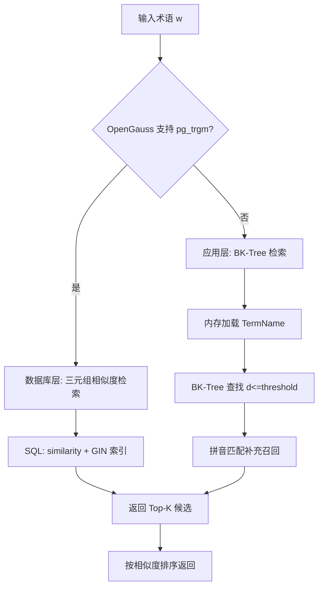

**方案 A：pg_trgm（优先，若 OpenGauss 支持）**

```sql
-- 启用扩展
CREATE EXTENSION IF NOT EXISTS pg_trgm;

-- 在术语名称表上建立三元组 GIN 索引
CREATE INDEX idx_tn_name_trgm ON term_name USING GIN (name_text gin_trgm_ops);

-- 近似查询
SELECT tn.term_id, tn.name_text, t.term_name,
       similarity(tn.name_text, '王大名') AS sim
FROM term_name tn
JOIN term t ON tn.term_id = t.term_id
WHERE tn.name_text % '王大名'
ORDER BY sim DESC
LIMIT 5;
```

**方案 B：BK-Tree + 拼音匹配（若不支持 pg_trgm）**

```python
# BK-Tree 实现 - 基于编辑距离的空间划分树
class BKTree:
    def __init__(self, distance_func=levenshtein_distance):
        self.root = None
        self.distance = distance_func
        self._deleted_ids: set = set()  # 已删除的术语名称ID集合
    
    def mark_deleted(self, name_id: str):
        """标记条目为已删除"""
        self._deleted_ids.add(name_id)
    
    def insert(self, term_entry):
        """插入术语索引条目"""
        if self.root is None:
            self.root = BKNode(term_entry)
            return
        node = self.root
        d = self.distance(term_entry.name_text, node.entry.name_text)
        while d in node.children:
            node = node.children[d]
            d = self.distance(term_entry.name_text, node.entry.name_text)
        node.children[d] = BKNode(term_entry)
    
    def search(self, query: str, max_distance: int = 2) -> List:
        """查找编辑距离 <= max_distance 的所有候选"""
        if self.root is None:
            return []
        results = []
        stack = [self.root]
        while stack:
            node = stack.pop()
            d = self.distance(query, node.entry.name_text)
            if d <= max_distance:
                results.append((node.entry, d))
            # BK-Tree 剪枝: 只遍历距离在 [d - max_d, d + max_d] 范围的子节点
            for child_d, child_node in node.children.items():
                if d - max_distance <= child_d <= d + max_distance:
                    stack.append(child_node)
        # 过滤已删除条目
        return sorted([r for r in results if r[0].name_id not in self._deleted_ids], key=lambda x: x[1])
```

**索引初始化与更新：**

```python
# 应用启动时加载
def init_bk_tree():
    entries = db.query("SELECT * FROM term_name")
    tree = BKTree()
    for entry in entries:
        tree.insert(entry)
    return tree

# 术语变更时增量更新
def on_term_change(term_id, action):
    if action in ('INSERT', 'UPDATE'):
        entries = db.query(
            "SELECT * FROM term_name WHERE term_id = :id", id=term_id
        )
        for entry in entries:
            bk_tree.insert(entry)
    elif action == 'DELETE':
        # 标记为已删除
        name_ids = db.query_scalars("SELECT name_id FROM term_name WHERE term_id = :id", id=term_id)
        for nid in name_ids:
            bk_tree.mark_deleted(nid)
```

**拼音匹配补充：**

针对同音字错误（如"王晓明"与"王小明"），在 BK-Tree 返回结果不足时，追加拼音匹配：

```sql
-- 拼音匹配
SELECT tn.term_id, tn.name_text, t.term_name
FROM term_name tn
JOIN term t ON tn.term_id = t.term_id
WHERE tn.name_pinyin = :input_pinyin
LIMIT 5;
```

#### 3.3.6 标签属性筛选

**目标：** 基于 JSONB 标签的键值约束，筛选满足条件的术语。

**查询类型与 SQL 模式：**

| 查询类型 | 操作符 | SQL 示例 | 是否走 GIN 索引 |
|---------|--------|---------|---------------|
| TERM_REF 精确匹配 | `@>` | `term_tags @> '{"TERM_CUSTOMER": {"type": "TERM_REF", "value": "TERM_MOBILE"}}'::jsonb` | 是 |
| TEXT 精确匹配 | `@>` | `term_tags @> '{"TERM_SIGN_STATUS": {"type": "TEXT", "value": "已签约"}}'::jsonb` | 是 |
| NUMBER 精确匹配 | `@>` | `term_tags @> '{"TERM_AMOUNT": {"type": "NUMBER", "value": 5500000}}'::jsonb` | 是 |
| BOOLEAN 精确匹配 | `@>` | `term_tags @> '{"TERM_IS_URGENT": {"type": "BOOLEAN", "value": true}}'::jsonb` | 是 |
| DATE 精确匹配 | `@>` | `term_tags @> '{"TERM_SIGN_DATE": {"type": "DATE", "value": "2025-03-10"}}'::jsonb` | 是 |
| DATETIME 精确匹配 | `@>` | `term_tags @> '{"TERM_OPERATION_TIME": {"type": "DATETIME", "value": "2025-03-10T14:30:00"}}'::jsonb` | 是 |
| 键存在 | `?` | `term_tags ? 'TERM_AMOUNT'` | 是 |
| 多键都存在 | `?&` | `term_tags ?& array['TERM_CUSTOMER','TERM_AMOUNT']` | 是 |
| 任一键存在 | `?\|` | `term_tags ?\| array['TERM_CUSTOMER','TERM_EMP_NAME']` | 是 |
| NUMBER 数值范围 | `->` + `->>` | `(term_tags -> 'TERM_AMOUNT' ->> 'value')::numeric > 5000000` | 需函数索引 |
| DATE 日期范围 | `->` + `->>` | `(term_tags -> 'TERM_SIGN_DATE' ->> 'value')::date BETWEEN '2025-01-01' AND '2025-12-31'` | 需函数索引 |
| DATETIME 时间范围 | `->` + `->>` | `(term_tags -> 'TERM_OPERATION_TIME' ->> 'value')::timestamp > '2025-03-10 14:00:00'` | 需函数索引 |
| TEXT 模糊匹配 | `->` + `->>` + LIKE | `term_tags -> 'TERM_CUSTOMER' ->> 'value' LIKE '%移动%'` | 需函数索引 |
| 反向引用查询 | `jsonb_each` | 遍历所有 value 找 `type=TERM_REF AND value=<id>` | 全表扫描 |

**反向引用查询优化方案：**

| 方案 | 说明 | 适用场景 |
|------|------|---------|
| 物化视图 | 创建定期刷新的物化视图存储术语引用关系 | 引用关系变更不频繁 |
| 冗余表 | 维护独立的 term_tag_ref 表记录 TERM_REF 类型的引用 | 需要高频反向查询 |
| GIN 表达式索引 | `CREATE INDEX ... USING GIN ((term_tags::text))` 配合正则匹配 | 简单实现但效果有限 |

> **注**：反向引用查询为低频操作，V1 版本可接受全表扫描；若后续有高频需求再引入冗余表。

**范围查询的优化 — 函数索引：**

对于高频范围查询字段，建议创建函数索引：

```sql
-- 为 NUMBER 类型字段（合同金额）创建函数索引
CREATE INDEX idx_term_tags_amount
ON term ((term_tags -> 'TERM_AMOUNT' ->> 'value')::numeric)
WHERE term_tags ? 'TERM_AMOUNT';

-- 为 DATE 类型字段（签约日期）创建函数索引
CREATE INDEX idx_term_tags_sign_date
ON term ((term_tags -> 'TERM_SIGN_DATE' ->> 'value')::date)
WHERE term_tags ? 'TERM_SIGN_DATE';

-- 为 DATETIME 类型字段（操作时间）创建函数索引
CREATE INDEX idx_term_tags_op_time
ON term ((term_tags -> 'TERM_OPERATION_TIME' ->> 'value')::timestamp)
WHERE term_tags ? 'TERM_OPERATION_TIME';
```

**标签筛选查询示例：**

```sql
-- 示例1: 查找王小明签订的金额大于500万且属于移动客户的合同
SELECT t.term_id, t.term_name, t.term_tags
FROM term t
WHERE t.term_type_code = 'LIST'                                                              -- 列表术语
  AND t.term_tags @> '{"TERM_SIGN_PERSON": {"type": "TERM_REF", "value": "TERM_XIAOMING"}}'::jsonb -- 签约人=王小明术语, 走 GIN 索引
  AND (t.term_tags -> 'TERM_AMOUNT' ->> 'value')::numeric > 5000000                               -- 金额范围查询（type=NUMBER）
  AND t.term_tags -> 'TERM_CUSTOMER' ->> 'value' LIKE '%移动%';                                    -- 客户名称模糊匹配（type=TEXT）

-- 示例2: 查找2024年5月未通过审批的差旅申请
SELECT t.term_id, t.term_name, t.term_tags
FROM term t
WHERE t.term_type_code = 'LIST'
  AND t.term_tags @> '{"TERM_APPROVAL_STATUS": {"type": "TEXT", "value": "未通过"}}'::jsonb        -- 审批状态精确匹配（type=TEXT）
  AND t.term_tags @> '{"TERM_APPLY_MONTH": {"type": "DATE", "value": "2024-05"}}'::jsonb;         -- 申请月份匹配（type=DATE）

-- 示例3: 查找标记为紧急且金额大于100万的合同
SELECT t.term_id, t.term_name, t.term_tags
FROM term t
WHERE t.term_type_code = 'LIST'
  AND t.term_tags @> '{"TERM_IS_URGENT": {"type": "BOOLEAN", "value": true}}'::jsonb              -- 紧急标记（type=BOOLEAN）
  AND (t.term_tags -> 'TERM_AMOUNT' ->> 'value')::numeric > 1000000;                               -- 金额范围查询（type=NUMBER）

-- 示例4: 查找2025年3月10日之后创建的系统日志
SELECT t.term_id, t.term_name, t.term_tags
FROM term t
WHERE t.term_type_code = 'LIST'
  AND t.term_tags @> '{"TERM_LOG_TYPE": {"type": "TEXT", "value": "操作日志"}}'::jsonb           -- 日志类型精确匹配（type=TEXT）
  AND (t.term_tags -> 'TERM_OPERATION_TIME' ->> 'value')::timestamp > '2025-03-10 00:00:00';       -- 操作时间范围（type=DATETIME）

-- 示例5: 查找响应时间大于200ms的失败操作记录
SELECT t.term_id, t.term_name, t.term_tags
FROM term t
WHERE t.term_type_code = 'LIST'
  AND t.term_tags @> '{"TERM_IS_SUCCESS": {"type": "BOOLEAN", "value": false}}'::jsonb          -- 操作失败（type=BOOLEAN）
  AND (t.term_tags -> 'TERM_RESPONSE_TIME_MS' ->> 'value')::numeric > 200;                         -- 响应时间大于200ms（type=NUMBER）
```

**性能预估（对比原关系表方案）：**

| 场景 | 原方案（TermTag + TermTagRelation 多表 JOIN） | JSONB 方案 |
|------|----------------------------------------------|-----------|
| 2 条件筛选 | 2 张表 JOIN + 1 次自连接 | 单表 WHERE + GIN |
| 5 条件筛选 | 2 张表 JOIN + 4 次自连接 | 单表 WHERE + GIN |
| 10 万术语 × 10 标签 | 100 万行关联表 | 10 万行（标签内联） |
| 新增标签属性 | 需确保 TermTag 有该记录 | 直接写 JSON key，零 DDL |

#### 3.3.7 术语词典生命周期管理

**目标：** 管理 jieba 分词器自定义词典的完整生命周期，确保分词词典始终与术语库保持同步，同时不影响系统性能。

**整体流程：**

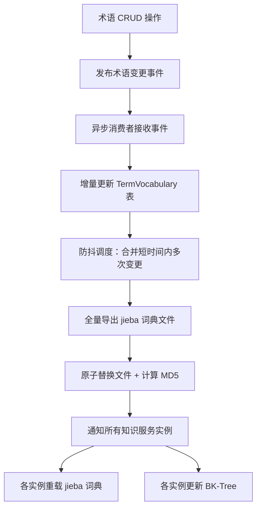

**（1）词汇表异步维护**

当 term_name 表发生变更时，异步更新 term_vocabulary 表：

```python
async def on_term_name_change(term_id: str, action: str):
    """术语名称变更事件处理器"""
    if action in ('INSERT', 'UPDATE'):
        names = await db.query(
            "SELECT name_text FROM term_name WHERE term_id = :id", id=term_id
        )
        for name in names:
            await db.execute("""
                INSERT INTO term_vocabulary (word, frequency)
                VALUES (:word, 1)
                ON CONFLICT (word) DO UPDATE SET
                    frequency = (
                        SELECT COUNT(DISTINCT term_id)
                        FROM term_name WHERE name_text = :word
                    ),
                    updated_time = CURRENT_TIMESTAMP
            """, word=name.name_text)

    elif action == 'DELETE':
        # 检查是否还有其他术语使用该名称，无则删除词汇
        old_names = await db.query(
            "SELECT DISTINCT name_text FROM term_name WHERE term_id = :id",
            id=term_id
        )
        for name in old_names:
            count = await db.query_scalar(
                "SELECT COUNT(*) FROM term_name WHERE name_text = :word AND term_id != :id",
                word=name.name_text, id=term_id
            )
            if count == 0:
                await db.execute(
                    "DELETE FROM term_vocabulary WHERE word = :word",
                    word=name.name_text
                )
            else:
                await db.execute("""
                    UPDATE term_vocabulary SET
                        frequency = :count, updated_time = CURRENT_TIMESTAMP
                    WHERE word = :word
                """, word=name.name_text, count=count)

    # 触发词典文件重新导出（防抖）
    await dict_exporter.schedule_export()
```

**（2）异步导出分词文件（防抖机制）**

词汇表变更后，异步导出 jieba 格式词典文件。通过**防抖（debounce）**机制合并短时间内的多次变更为一次导出，避免频繁 I/O：

```python
class DictExporter:
    """分词词典文件异步导出器"""

    def __init__(self, export_path: str, debounce_seconds: float = 5.0):
        self.export_path = Path(export_path)
        self.debounce_seconds = debounce_seconds
        self._pending_task: asyncio.Task = None

    async def schedule_export(self):
        """防抖调度：多次变更合并为一次导出"""
        if self._pending_task and not self._pending_task.done():
            self._pending_task.cancel()
        self._pending_task = asyncio.create_task(self._debounced_export())

    async def _debounced_export(self):
        await asyncio.sleep(self.debounce_seconds)
        await self._do_export()

    async def _do_export(self):
        """执行词典文件导出"""
        # 1. 从 TermVocabulary 全量读取
        rows = await db.query(
            "SELECT word, frequency, pos FROM term_vocabulary ORDER BY frequency DESC"
        )
        # 2. 写入临时文件
        tmp_path = self.export_path.with_suffix('.tmp')
        with open(tmp_path, 'w', encoding='utf-8') as f:
            for row in rows:
                f.write(f"{row.word} {row.frequency} {row.pos}\n")
        # 3. 原子替换（避免读到半写状态的文件）
        tmp_path.rename(self.export_path)
        # 4. 计算文件 MD5 并通知各实例重载
        file_md5 = calc_md5(self.export_path)
        await notify_instances_dict_updated(file_md5)
```

****（3）jieba 词典重载时机****

jieba 加载自定义词典后，词典内容缓存在内存 Trie 树中，文件变更不会自动感知，需显式触发重载：

| 时机 | 触发方式 | 说明 |
|------|---------|------|
| 服务启动时 | 自动加载 | 启动阶段 `jieba.load_userdict(path)` 初始化 |
| 词典文件更新后 | 事件驱动重载 | 收到词典更新通知后主动重载 |
| 定时兜底检查 | 定时任务 | 每 5 分钟检查文件 MD5，变化则重载（防止事件丢失） |

```python
class TermTokenizer:
    """术语分词器 - 封装 jieba + 自定义词典生命周期管理"""

    def __init__(self, dict_path: str):
        self.dict_path = dict_path
        self.dict_md5 = None
        self._lock = Lock()
        self._load_dict()

    def _load_dict(self):
        """加载/重载词典"""
        with self._lock:
            jieba.dt = jieba.Tokenizer()
            jieba.dt.initialize()
            jieba.load_userdict(self.dict_path)
            self.dict_md5 = self._calc_md5()

    def _calc_md5(self) -> str:
        with open(self.dict_path, 'rb') as f:
            return hashlib.md5(f.read()).hexdigest()

    def reload_if_changed(self) -> bool:
        """定时兜底：检查词典文件是否变更，是则重载"""
        current_md5 = self._calc_md5()
        if current_md5 != self.dict_md5:
            self._load_dict()
            return True
        return False

    def on_dict_updated_event(self, new_md5: str):
        """事件驱动：接收到词典更新通知时的回调"""
        if new_md5 != self.dict_md5:
            self._load_dict()

    def tokenize(self, text: str) -> list:
        """分词"""
        return list(jieba.cut(text))
```

****（4）多实例同步机制****

结合部署架构（§3.5 多实例水平扩展），词典文件的同步策略：

| 方案 | 适用场景 | 说明 |
|------|---------|------|
| 共享文件存储（NFS/OSS） | 所有实例挂载同一存储路径 | 导出器写入共享路径，各实例通过文件 MD5 检测变更 |
| 消息通知（MQ/Redis Pub-Sub） | 需要低延迟同步 | 导出完成后发布通知，各实例订阅并主动重载 |
| 配置中心（Nacos/Apollo） | 已有配置中心基础设施 | 将词典文件 MD5 写入配置中心，各实例监听配置变更 |


#### 3.3.8 外挂知识库集成

**背景与动机：**

当术语的完整知识内容很长（如产品文档、业务规范、制度手册等，超出 `desc_summary` 摘要范围），单纯基于名称匹配无法充分覆盖文档的语义信息，召回精度受限。此时需要将文档切分为多个 chunk，为每个 chunk 生成独立的 embedding 向量，再基于 chunk 级别的向量相似度进行语义召回。术语通过 `TermKnowledge` 表的外挂三元组（`ext_system + ext_kb_id + ext_doc_id`）关联知识库中的文档。

**为什么不自建 chunk 存储：**

| 维度 | 自建 chunk 表 | 外挂知识库 |
|------|-------------|-----------|
| 向量索引 | OpenGauss 无原生 HNSW/IVFFlat，只能应用层暴力计算 | 底层使用 Milvus/Qdrant 等专业向量数据库 |
| chunk 切分 | 需自行实现滑动窗口、语义段落切分等策略 | 知识库平台已内置多种切分策略 |
| 开发成本 | 高（切分 + 向量生成 + 检索 + 同步全链路） | 低（只需对接 API） |
| 文档管理 | 需自建管理能力 | 知识库平台自带可视化文档管理 |

**设计决策**：术语服务专注**结构化术语管理**（分词召回、关系遍历、标签筛选、近似推荐），将**非结构化的长文档语义召回**委托给专业知识库服务。两者通过元数据关联打通。

**架构设计：**

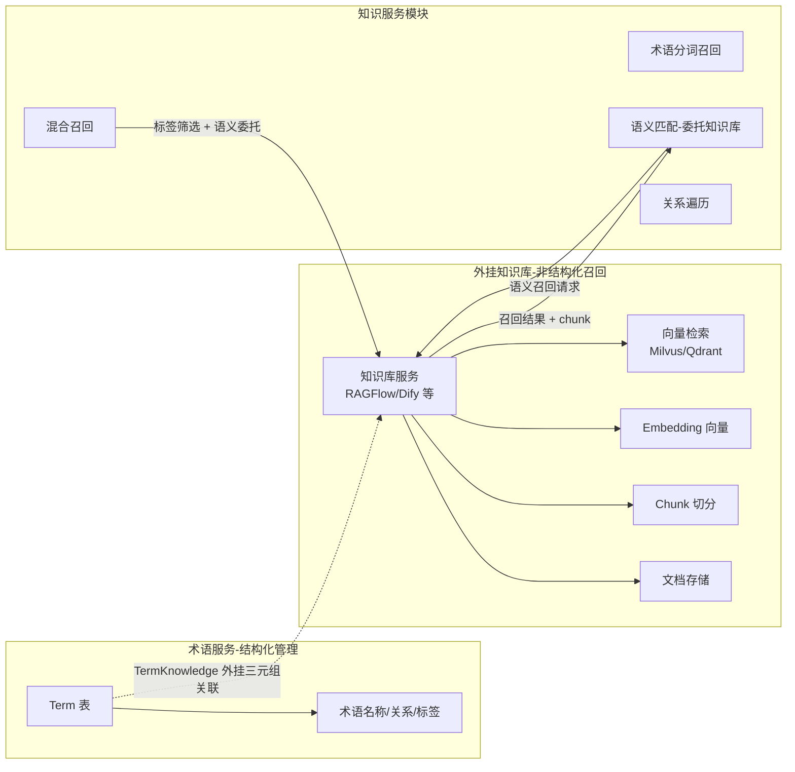

**术语与知识库文档的关联方式：**

术语通过 `TermKnowledge` 表的外挂三元组关联外挂知识库中的文档，一个术语可挂载多条来自不同系统/知识库的文档：

```sql
-- 查询有外挂文档关联的术语知识
SELECT tk.knowledge_id, tk.term_id, t.term_name,
       tk.ext_system, tk.ext_kb_id, tk.ext_doc_id
FROM term_knowledge tk
JOIN term t ON t.term_id = tk.term_id
WHERE tk.ext_doc_id IS NOT NULL;

-- 通过三元组反查术语（向量召回后定位归属术语）
SELECT t.term_id, t.term_name
FROM term_knowledge tk
JOIN term t ON t.term_id = tk.term_id
WHERE tk.ext_system = :ext_system
  AND tk.ext_kb_id  = :ext_kb_id
  AND tk.ext_doc_id = :ext_doc_id;
```

| 字段 | 说明 |
|------|------|
| `TermKnowledge.ext_system` | 外部系统编码，如 `RAGFLOW`、`DIFY`，标识调用哪套知识库 API |
| `TermKnowledge.ext_kb_id` | 外部知识库 ID，在对应系统内唯一标识知识库 |
| `TermKnowledge.ext_doc_id` | 外部文档 ID，由知识库 API 返回并写入，用于向量召回后反查术语 |

**知识库客户端设计：**

多系统、多知识库场景通过 `KBClientRegistry` 统一管理，按 `(ext_system, ext_kb_id)` 检索对应客户端：

```python
class KBClient:
    """外挂知识库 API 客户端（单知识库实例）"""

    def __init__(self, api_url: str, kb_id: str, api_key: str):
        self.api_url = api_url
        self.kb_id = kb_id
        self.api_key = api_key

    async def search(self, query: str, top_k: int = 5,
                     doc_ids: List[str] = None) -> List[KBChunk]:
        """语义检索 — 支持 ext_doc_id 白名单过滤"""
        payload = {"query": query, "dataset_id": self.kb_id, "top_k": top_k}
        if doc_ids:
            payload["doc_ids"] = doc_ids
        resp = await http_client.post(
            f"{self.api_url}/search", json=payload,
            headers={"Authorization": f"Bearer {self.api_key}"}
        )
        return [KBChunk(doc_id=r["doc_id"], chunk_text=r["text"],
                        score=r["score"]) for r in resp.json()["results"]]

    async def upsert_document(self, doc_id: str, title: str,
                               content: str) -> str:
        """创建或更新文档 — 知识库自动执行 chunk + embedding"""
        payload = {"dataset_id": self.kb_id, "doc_id": doc_id,
                   "title": title, "content": content}
        resp = await http_client.post(
            f"{self.api_url}/documents", json=payload,
            headers={"Authorization": f"Bearer {self.api_key}"}
        )
        return resp.json()["doc_id"]

    async def delete_document(self, doc_id: str):
        """删除文档"""
        await http_client.delete(
            f"{self.api_url}/documents/{doc_id}",
            headers={"Authorization": f"Bearer {self.api_key}"}
        )


class KBClientRegistry:
    """多系统知识库客户端注册中心"""

    def __init__(self, configs: List[dict]):
        # configs: [{"ext_system":"RAGFLOW","ext_kb_id":"KB_HR_001",
        #            "api_url":"...","api_key":"..."}]
        self._clients: dict = {}
        for cfg in configs:
            key = (cfg["ext_system"], cfg["ext_kb_id"])
            self._clients[key] = KBClient(
                api_url=cfg["api_url"],
                kb_id=cfg["ext_kb_id"],
                api_key=cfg["api_key"]
            )

    def get_client(self, ext_system: str, ext_kb_id: str) -> KBClient:
        """按三元组前两项获取对应 KB 客户端"""
        client = self._clients.get((ext_system, ext_kb_id))
        if not client:
            raise ValueError(f"未注册的知识库: {ext_system}/{ext_kb_id}")
        return client
```

**术语与知识库文档同步机制：**

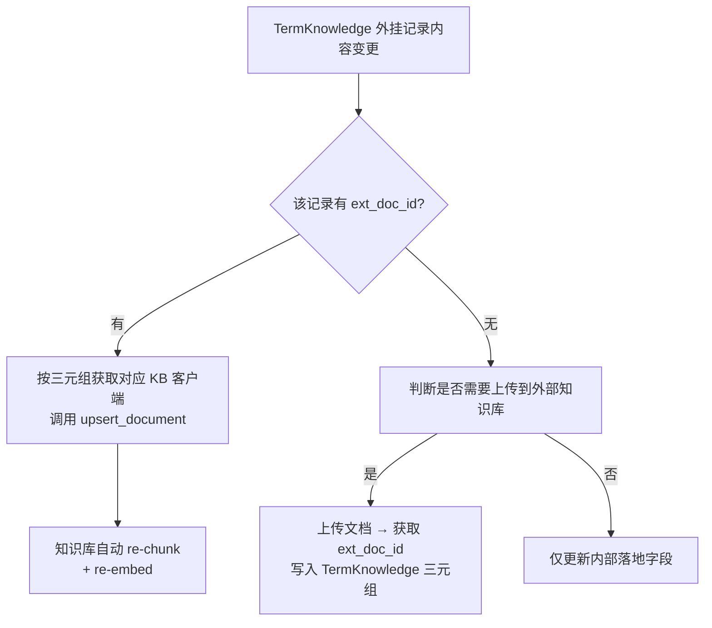

```python
async def on_knowledge_content_change(knowledge_id: str, term_name: str,
                                      desc: str):
    """TermKnowledge 内容变更时的知识库同步"""
    row = await db.query_one(
        """SELECT ext_system, ext_kb_id, ext_doc_id
           FROM term_knowledge WHERE knowledge_id = :id""",
        id=knowledge_id
    )
    if row and row.ext_doc_id:
        # 已有外挂关联，更新对应知识库文档
        kb_client = kb_registry.get_client(row.ext_system, row.ext_kb_id)
        await kb_client.upsert_document(
            doc_id=row.ext_doc_id, title=term_name, content=desc
        )
    # 如需为此知识记录新建外挂文档，在业务层显式调用并回写三元组
```

#### 3.3.9 术语知识查询接口（统一入口）

**目标：** 提供统一的术语知识查询接口，供上层 Agent 调用。本接口只提供**原子查询能力**（术语自身信息 + 一跳关系），复杂多跳逻辑由上层 Agent 自行决策和编排。

**接口定位：**

```
┌─────────────────────────────────────────────────────────────┐
│  Agent (上层应用)                                            │
│  • 理解用户意图                                             │
│  • 决策查询策略                                             │
│  • 调用术语知识查询接口（本接口）                            │
│  • 编排多跳查询逻辑                                          │
└─────────────────────────────────────────────────────────────┘
                              │
                              ▼
┌─────────────────────────────────────────────────────────────┐
│  术语知识查询接口（本模块）                                   │
│  • query_term_knowledge()                                   │
│  • 术语自身信息查询（ID/名称/类型/标签/描述）                  │
│  • 一跳关系查询（按关系名、动作、目标类型过滤）                │
│  • 语义检索（描述匹配）                                      │
└─────────────────────────────────────────────────────────────┘
```

**接口定义：**

```python
async def query_term_knowledge(
    # 源术语定位（多选一，优先级：ID > Word > Semantic/Tags）
    source_term_id: str = None,              # 源术语ID（精确匹配）
    term_word: str = None,                   # 术语词（标准名称或别名，精确匹配）
    source_desc_semantic: str = None,        # 源术语描述语义（向量匹配）
    source_term_tags: List[TagFilter] = None,# 源术语标签筛选
    
    # 源术语过滤
    source_term_types: List[str] = None,     # 源术语类型编码列表

    # 一跳关系约束
    relation_query: RelationQuery = None,    # 关系查询条件
    include_relations: bool = True,          # 是否返回一跳关联知识
    
    # 返回控制
    include_tags: bool = True,               # 是否返回标签
    include_desc: bool = True,               # 是否返回描述
    limit: int = 10,                         # 返回源术语数量限制
    relation_limit: int = 50                 # 每个源术语返回的关系数量限制
) -> List[TermKnowledgeResult]:
    """
    术语知识查询接口 - 统一入口
    
    Args:
        见上述参数定义
    
    Returns:
        List[TermKnowledgeResult] {
            source_term: Term,              # 源术语信息
            relations: List[RelationInfo]   # 一跳关联关系列表
        }
    """
    pass
```

**查询能力汇总：**

| 查询维度 | 参数 | 说明 |
|---------|------|------|
| **源术语定位** | source_term_id, term_word | 精确匹配 |
| **语义/标签定位** | source_desc_semantic, source_term_tags | 模糊/条件匹配 |
| **一跳关系** | relation_query, include_relations | 查询目标术语及其关系 |

**Agent 调用示例：**

```python
# 示例1：查询"王小明"的基本信息及其一跳关系
result = await query_term_knowledge(
    term_word="王小明",
    include_relations=True
)

# 示例2：查询员工概念的相关数据（按关系名通配符过滤，方向：出边）
result = await query_term_knowledge(
    source_term_id="TERM_EMP",
    relation_query=RelationQuery(
        direction="out",
        relation_names=["员工_签订_*", "员工_考核_*"]
    ),
    include_relations=True
)

# 示例3：查询金额大于500万的合同（标签筛选）
result = await query_term_knowledge(
    source_term_types=["CONTRACT"],
    source_term_tags=[
        TagFilter(key="TERM_AMOUNT", op=">", value=5000000, value_type="NUMBER")
    ]
)

# 示例4：语义查询VIEW术语（如"员工绩效评价"）
result = await query_term_knowledge(
    source_desc_semantic="员工绩效评价",
    source_term_types=["VIEW"]
)
```

**标签筛选路实现：**


```python
from enum import Enum

class TagValueType(str, Enum):
    """标签值类型枚举"""
    TERM_REF = "TERM_REF"    # 术语引用
    TEXT = "TEXT"            # 文本
    NUMBER = "NUMBER"        # 数值
    DATE = "DATE"            # 日期
    DATETIME = "DATETIME"    # 日期时间
    BOOLEAN = "BOOLEAN"      # 布尔值

class TagFilter:
    """标签筛选条件"""
    def __init__(self, key: str, value_type: TagValueType, op: str, value: any):
        self.key = key           # 标签键（术语ID）
        self.value_type = value_type  # 值类型
        self.op = op            # 操作符: =, !=, >, <, >=, <=, LIKE
        self.value = value      # 值

async def tag_filter_recall(
    tag_filters: List[TagFilter],
    term_type: str = None,
    top_k: int = 50
) -> List[dict]:
    """标签筛选路 - 基于JSONB标签进行结构化筛选
    
    支持多种类型的标签筛选：
    - TERM_REF: 术语引用类型，支持精确匹配
    - TEXT: 文本类型，支持精确匹配和模糊匹配(LIKE)
    - NUMBER: 数值类型，支持范围查询(>, <, >=, <=, =, !=)
    - DATE: 日期类型，支持范围查询，格式YYYY-MM-DD
    - DATETIME: 日期时间类型，支持范围查询，格式YYYY-MM-DDTHH:mm:ss
    - BOOLEAN: 布尔类型，支持精确匹配(true/false)
    """

    sql = "SELECT term_id, term_name, desc_summary, term_type_code, term_tags FROM term WHERE 1=1"
    params = {}

    for i, f in enumerate(tag_filters):
        safe_key = validate_tag_key(f.key)
        
        # TERM_REF 类型精确匹配 - 走 GIN 索引
        if f.value_type == TagValueType.TERM_REF and f.op == "=":
            sql += f" AND term_tags @> :tag_{i}::jsonb"
            params[f"tag_{i}"] = json.dumps(
                {f.key: {"type": "TERM_REF", "value": f.value}}
            )
        
        # TEXT 类型精确匹配 - 走 GIN 索引
        elif f.value_type == TagValueType.TEXT and f.op == "=":
            sql += f" AND term_tags @> :tag_{i}::jsonb"
            params[f"tag_{i}"] = json.dumps(
                {f.key: {"type": "TEXT", "value": f.value}}
            )
        
        # TEXT 类型模糊匹配
        elif f.value_type == TagValueType.TEXT and f.op == "LIKE":
            sql += f" AND term_tags -> '{safe_key}' ->> 'value' LIKE :val_{i}"
            params[f"val_{i}"] = f.value
        
        # NUMBER 数值范围查询
        elif f.value_type == TagValueType.NUMBER and f.op in (">", "<", ">=", "<=", "=", "!="):
            sql += f" AND (term_tags -> '{safe_key}' ->> 'value')::numeric {f.op} :val_{i}"
            params[f"val_{i}"] = f.value
        
        # DATE 日期范围查询
        elif f.value_type == TagValueType.DATE and f.op in (">", "<", ">=", "<=", "=", "!="):
            sql += f" AND (term_tags -> '{safe_key}' ->> 'value')::date {f.op} :val_{i}"
            params[f"val_{i}"] = f.value
        
        # DATETIME 日期时间范围查询
        elif f.value_type == TagValueType.DATETIME and f.op in (">", "<", ">=", "<=", "=", "!="):
            sql += f" AND (term_tags -> '{safe_key}' ->> 'value')::timestamp {f.op} :val_{i}"
            params[f"val_{i}"] = f.value
        
        # BOOLEAN 精确匹配 - 走 GIN 索引
        elif f.value_type == TagValueType.BOOLEAN and f.op == "=":
            sql += f" AND term_tags @> :tag_{i}::jsonb"
            params[f"tag_{i}"] = json.dumps(
                {f.key: {"type": "BOOLEAN", "value": f.value}}
            )

    if term_type:
        sql += " AND term_type_code = :term_type"
        params["term_type"] = term_type

    sql += f" LIMIT {top_k}"
    
    candidates = await db.query(sql, **params)
    
    return [
        {
            "term": term,
            "recall_path": "tag_filter",
            "match_info": {"filters_applied": len(tag_filters)}
        }
        for term in candidates
    ]


# 标签筛选路使用示例
async def example_usage():
    """标签筛选路使用示例"""
    
    # 示例1: TERM_REF + NUMBER 组合筛选
    filters = [
        TagFilter("TERM_SIGN_PERSON", TagValueType.TERM_REF, "=", "TERM_XIAOMING"),
        TagFilter("TERM_AMOUNT", TagValueType.NUMBER, ">", 5000000),
    ]
    results = await tag_filter_recall(filters, term_type="LIST")
    
    # 示例2: DATE 范围筛选
    filters = [
        TagFilter("TERM_SIGN_DATE", TagValueType.DATE, ">=", "2025-01-01"),
        TagFilter("TERM_SIGN_DATE", TagValueType.DATE, "<=", "2025-12-31"),
    ]
    results = await tag_filter_recall(filters)
    
    # 示例3: DATETIME 范围筛选
    filters = [
        TagFilter("TERM_OPERATION_TIME", TagValueType.DATETIME, ">", "2025-03-10 14:00:00"),
    ]
    results = await tag_filter_recall(filters)
    
    # 示例4: BOOLEAN + TEXT 组合筛选
    filters = [
        TagFilter("TERM_IS_URGENT", TagValueType.BOOLEAN, "=", True),
        TagFilter("TERM_SIGN_STATUS", TagValueType.TEXT, "=", "已签约"),
    ]
    results = await tag_filter_recall(filters)
    
    # 示例5: TEXT 模糊匹配
    filters = [
        TagFilter("TERM_CUSTOMER", TagValueType.TEXT, "LIKE", "%移动%"),
    ]
    results = await tag_filter_recall(filters)
```

**描述语义匹配路实现：**

```python
async def desc_semantic_recall(
    query: str,
    top_k: int = 5
) -> List[dict]:
    """
    描述语义匹配路 - 对术语进行语义匹配
    
    这是多路召回中的独立一路，与术语分词召回路并行执行。
    当用户输入如"王小明作为销售是否优秀？"时，
    此路将用户整句话与术语的描述进行语义匹配，
    例如匹配到"员工视图"术语（描述：提供员工个人相关的数据查询和分析能力）。
    
    术语分词召回路仅匹配名称（如"王小明"、"销售"等），不做语义匹配。
    """
    # 1. 查询所有 VIEW 类型术语的外挂知识记录
    rows = await db.query("""
        SELECT tk.knowledge_id, tk.term_id, t.term_name, t.term_type_code,
               tk.ext_system, tk.ext_kb_id, tk.ext_doc_id
        FROM term_knowledge tk
        JOIN term t ON t.term_id = tk.term_id
        WHERE t.term_type_code = 'VIEW'
          AND tk.ext_doc_id IS NOT NULL
    """)

    if not rows:
        return []

    # 2. 按 (ext_system, ext_kb_id) 分组后调用各知识库 API 进行语义检索
    from collections import defaultdict
    groups: dict = defaultdict(list)
    doc_id_map: dict = {}
    for r in rows:
        groups[(r.ext_system, r.ext_kb_id)].append(r.ext_doc_id)
        doc_id_map[(r.ext_system, r.ext_kb_id, r.ext_doc_id)] = r

    all_chunks = []
    for (ext_system, ext_kb_id), doc_ids in groups.items():
        kb_client = kb_registry.get_client(ext_system, ext_kb_id)
        kb_results = await kb_client.search(
            query=query, doc_ids=doc_ids, top_k=top_k
        )
        for chunk in kb_results:
            all_chunks.append((ext_system, ext_kb_id, chunk))

    # 3. 通过三元组关联回术语
    results = []
    for ext_system, ext_kb_id, chunk in all_chunks:
        row = doc_id_map.get((ext_system, ext_kb_id, chunk.doc_id))
        if row:
            results.append({
                "term": row,
                "score": chunk.score,
                "chunk_text": chunk.chunk_text,
                "recall_path": "knowledge_semantic",
                "match_info": {"match_type": "view_knowledge_semantic"}
            })

    return results
```

**多路召回统一入口：**

```python
async def multi_path_recall(
    query: str = None,
    tag_filters: List[TagFilter] = None,
    enable_semantic: bool = True,
    enable_term_recall: bool = True,
    enable_bfs: bool = False,
    bfs_start_term_id: str = None,
    top_k: int = 10
) -> dict:
    """
    多路召回统一入口
    
    Args:
        query: 用户查询文本（用于语义匹配和分词召回）
        tag_filters: 标签筛选条件
        enable_semantic: 是否启用描述语义匹配路
        enable_term_recall: 是否启用术语分词召回路
        enable_bfs: 是否启用BFS关系遍历路
        bfs_start_term_id: BFS起始术语ID
        top_k: 每路召回数量
    
    Returns:
        {
            "results": [...],  # 合并后的结果
            "path_results": {  # 各路独立结果
                "tag_filter": [...],
                "desc_semantic": [...],
                "term_recall": [...],
                "bfs_traverse": [...]
            }
        }
    """
    import asyncio
    
    tasks = []
    path_names = []
    
    # 路1: 标签筛选路
    if tag_filters:
        tasks.append(tag_filter_recall(tag_filters, top_k=top_k))
        path_names.append("tag_filter")
    
    # 路2: 描述语义匹配路（仅VIEW类型）
    if enable_semantic and query:
        tasks.append(desc_semantic_recall(query, top_k=top_k))
        path_names.append("desc_semantic")
    
    # 路3: 术语分词召回路
    if enable_term_recall and query:
        tasks.append(term_recall_service.recall(query, top_k=top_k))
        path_names.append("term_recall")
    
    # 路4: 关系查询路
    if enable_relation and relation_query:
        tasks.append(query_term_relations(relation_query, limit=top_k))
        path_names.append("relation_query")
    
    # 并行执行各路召回
    results_list = await asyncio.gather(*tasks, return_exceptions=True)
    
    # 整理各路结果
    path_results = {}
    all_results = []
    
    for name, result in zip(path_names, results_list):
        if isinstance(result, Exception):
            path_results[name] = {"error": str(result)}
        else:
            path_results[name] = result
            if isinstance(result, list):
                all_results.extend(result)
    
    # 结果去重与重排序
    term_id_scores = {}
    for r in all_results:
        term_id = r.get("term", {}).get("term_id")
        if term_id:
            if term_id not in term_id_scores:
                term_id_scores[term_id] = r
            else:
                # 合并召回路径信息
                existing = term_id_scores[term_id]
                existing["recall_paths"] = existing.get("recall_paths", []) + [r.get("recall_path")]
    
    # 按score排序（如果有）
    final_results = sorted(
        term_id_scores.values(),
        key=lambda x: x.get("score", 0),
        reverse=True
    )[:top_k]
    
    return {
        "results": final_results,
        "path_results": path_results,
        "total_paths": len(path_names),
        "active_paths": path_names
    }
```

---

#### 3.3.10 数据意图识别接口

**定位：** 数据意图识别接口负责理解用户查询意图，结合 Agent 流式输出能力，逐步分析并返回数据查询计划。本接口本质上是**找知识**的过程，与术语知识查询接口协同工作。

**架构分层：**

```
┌─────────────────────────────────────────────────────────────┐
│  应用层：业务 Agent / 对话系统                                │
└─────────────────────────────────────────────────────────────┘
                              │
                              ▼
┌─────────────────────────────────────────────────────────────┐
│  数据意图识别接口（本模块提供）                               │
│  • 理解用户查询意图                                          │
│  • 决策查询策略（查几跳、如何组合）                           │
│  • 调用术语知识查询接口                                      │
│  • 支持 Agent SSE 流式输出（实时返回分析过程）                │
│  • 整合结果返回                                              │
└─────────────────────────────────────────────────────────────┘
                              │
                              ▼
┌─────────────────────────────────────────────────────────────┐
│  术语知识查询接口（本模块核心）                               │
│  • query_term_knowledge()                                   │
│  • 术语分词召回                                             │
│  • 一跳关系查询                                             │
│  • 标签属性筛选                                             │
└─────────────────────────────────────────────────────────────┘
```

**核心能力：**

| 能力 | 说明 |
|------|------|
| 意图识别 | 分析用户查询，识别数据查询意图类型（QUERY/AGGREGATE/COMPARE/ANALYZE） |
| 术语召回 | 通过分词、语义匹配等方式召回相关术语 |
| 关系探索 | 基于一跳关系查询进行多跳关系探索，发现关联数据对象 |
| 流式输出 | 支持 SSE 流式输出，实时返回分析过程（term_recalled → knowledge_found → intent_confirmed → plan_completed） |
| 查询计划生成 | 组装完整的数据查询计划，包含查询路径、涉及的数据对象、可用的标签筛选条件 |

**接口概览：**

| 接口路径 | 说明 |
|----------|------|
| `POST /term/intent/recognize` | 非流式意图识别，返回完整识别结果 |
| `POST /term/intent/recognize/stream` | 流式意图识别，SSE 输出分析过程 |

> **详细接口定义、请求/响应参数、流式事件类型说明参见 §3.6.1 第 3 节「数据意图识别接口」**

### 3.4 代码目录结构

```
knowledge_service/
├── app/
│   ├── api/                      # 接口层：处理 HTTP 请求，鉴权与参数校验
│   │   ├── v1/
│   │   │   ├── endpoints/
│   │   │   │   ├── term.py           # 术语查询、推荐相关接口
│   │   │   │   ├── relation.py       # 一跳关系、多跳路径探索接口
│   │   │   │   └── intent.py         # 意图识别相关接口
│   │   │   └── router.py             # 路由注册
│   │   └── deps.py               # 依赖注入（DB Session、Current User等）
│   │
│   ├── core/                     # 核心配置层
│   │   ├── config.py             # 环境配置（数据库、Redis、外部API配置）
│   │   └── exceptions.py         # 全局异常定义与处理
│   │
│   ├── service/                  # 业务逻辑层：核心业务流程编排
│   │   ├── recall/                   # 召回策略子包
│   │   │   ├── segmentation.py       # 分词召回：jieba分词与倒排匹配
│   │   │   ├── semantic.py           # 语义召回：对接知识库 Embedding
│   │   │   ├── fuzzy.py              # 模糊召回：拼音/编辑距离计算
│   │   │   └── ranker.py             # 混合排序：多路召回结果的加权排序
│   │   ├── graph/                    # 图算法子包
│   │   │   └── traversal.py          # 图遍历算法（BFS/最短路径）实现
│   │   ├── term_service.py       # 术语基础服务（CRUD、标签筛选）
│   │   └── intent_service.py     # 意图识别服务（流程编排、Prompt组装）
│   │
│   ├── repository/               # 数据访问层：数据库直接交互
│   │   ├── crud/                 # 具体表的 CRUD 操作实现
│   │   │   ├── term.py
│   │   │   ├── relation.py
│   │   │   └── ...
│   │   └── db.py                 # 数据库连接池与 Session 管理
│   │
│   ├── models/                   # 数据模型层
│   │   ├── entity/               # ORM 实体类（SQLAlchemy Model）
│   │   │   ├── term_model.py
│   │   │   └── ...
│   │   └── schemas/              # 数据传输对象（Pydantic Schema / DTO）
│   │       ├── req/                  # 请求参数模型
│   │       └── resp/                 # 响应结果模型
│   │
│   ├── integration/              # 外部集成层：防腐层设计
│   │   ├── knowledge_base/       # 外挂知识库适配器
│   │   │   ├── client.py             # 通用客户端基类
│   │   │   ├── ragflow.py            # RAGFlow 适配实现
│   │   │   └── dify.py               # Dify 适配实现
│   │   └── llm/                  # 大模型调用封装（用于意图识别）
│   │
│   └── utils/                    # 通用工具层
│       ├── jieba_loader.py       # 自定义词典热加载工具
│       ├── text_utils.py         # 文本处理工具
│       └── logger.py             # 日志配置
│
├── tests/                        # 测试用例
├── scripts/                      # 运维脚本
│   ├── init_db.py                # 数据库初始化
│   └── import_dict.py            # 词典导入工具
├── main.py                       # 服务启动入口
└── requirements.txt              # 依赖清单
```

**关键目录说明：**
*   **service/recall/**：集中管理多种召回策略，方便扩展新的召回算法。
*   **service/graph/**：图算法独立封装，支持未来从数据库查询切换到图数据库查询。
*   **integration/**：采用适配器模式对接外部知识库（RAGFlow/Dify），隔离外部接口变更对内部业务的影响。
*   **utils/jieba_loader.py**：负责监听 `TermVocabulary` 表的变化，定期刷新应用内存中的分词词典。

### 3.5 部署架构

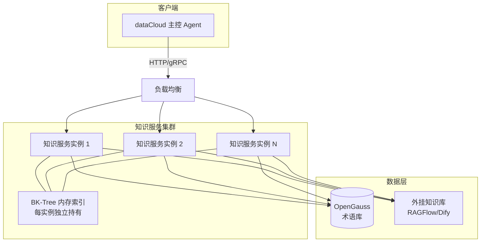

**部署说明：**

| 组件 | 部署形式 | 说明 |
|------|---------|------|
| 知识服务 | 多实例水平扩展 | 无状态服务（BK-Tree 每实例独立加载），支持滚动升级 |
| BK-Tree 索引 | 进程内内存 | 启动时从数据库加载，术语变更时通过消息通知各实例增量更新 |
| OpenGauss | 主从部署 | 术语数据持久化，读写分离（读走从库） |
| 外挂知识库 | 独立服务 | 提供长文本的语义检索能力，承接 `semantic_match` 流量 |

### 3.6 接口
#### 3.6.1 术语服务接口

##### 1) 术语API查询接口

用于根据术语类型、关键字和标签数组查询术语列表。

| 属性 | 说明 |
|------|------|
| **接口路径** | `POST /term/api/search` |
| **接口说明** | 根据术语类型、关键字和标签数组查询术语列表 |

**请求参数：**

| 参数名 | 类型 | 必填 | 说明 |
|--------|------|------|------|
| term_type | string | 否 | 术语类型编码（如 OBJ、VIEW、FUNC 等） |
| keyword | string | 否 | 搜索关键字，匹配术语名称、别名、描述摘要 |
| tags | array | 否 | 标签数组，格式 `[{"key": "...", "value": "...", "type": "..."}]` |
| library_id | string | 否 | 术语库ID，限制查询范围 |
| page_num | int | 否 | 页码，默认 1 |
| page_size | int | 否 | 每页条数，默认 20 |

**请求示例：**
```json
{
  "term_type": "LIST",
  "keyword": "王小明",
  "tags": [
    {"key": "TERM_LEVEL", "value": "M1", "type": "TEXT"},
    {"key": "TERM_LOCATION", "value": "杭州", "type": "TEXT"}
  ],
  "page_num": 1,
  "page_size": 10
}
```

**响应参数：**

| 参数名 | 类型 | 说明 |
|--------|------|------|
| code | int | 响应码，200 表示成功 |
| message | string | 响应信息 |
| data | object | 响应数据 |
| data.total | int | 总条数 |
| data.list | array | 术语列表 |
| data.list[].term_id | string | 术语ID |
| data.list[].term_name | string | 术语标准名称 |
| data.list[].term_type_code | string | 术语类型编码 |
| data.list[].term_type_name | string | 术语类型名称 |
| data.list[].desc_summary | string | 描述摘要 |
| data.list[].term_tags | object | 标签属性（JSONB） |
| data.list[].library_id | string | 术语库ID |
| data.list[].library_name | string | 术语库名称 |
| data.list[].created_time | string | 创建时间 |
| data.list[].updated_time | string | 更新时间 |

---

##### 2) 术语知识查询接口

用于**通过各种条件查询术语本身及其一跳关联知识**。这是术语知识查询的原子能力，**只处理一跳关系**，复杂多跳由上层 Agent 通过多次调用本接口自行决策实现。

| 属性 | 说明 |
|------|------|
| **接口路径** | `POST /term/knowledge/query` |
| **接口说明** | 通过各种条件查询术语及其一跳关联知识，支持精确匹配和语义匹配 |

**设计哲学：**

```
┌─────────────────────────────────────────────────────────────────┐
│  术语知识查询接口 = 查询术语本身 + 查询其一跳关系                  │
│  • 支持多种方式定位源术语（精确ID/名称/语义描述/标签等）          │
│  • 支持多种方式约束一跳关系（目标类型/标签/动作/语义等）          │
│  • 只返回一跳关系，多跳由 Agent 自主决策何时查、查几跳            │
└─────────────────────────────────────────────────────────────────┘
```

**查询模式：**

| 模式 | 说明 | 适用场景 |
|------|------|----------|
| **精确模式** | 通过 `source_term_id` 或 `term_word` 精确定位源术语 | 已知术语ID或名称 |
| **语义模式** | 通过 `source_desc_semantic` 语义描述匹配源术语 | 用户用自然语言描述想找什么术语 |
| **标签模式** | 通过 `source_term_tags` 筛选源术语 | 按属性查找术语 |

**请求参数：**

| 参数名 | 类型 | 必填 | 说明 |
|--------|------|------|------|
| **【源术语定位 - 以下四选一】** ||||
| source_term_id | string | 否 | 源术语ID（精确匹配） |
| term_word | string | 否 | 术语词（标准名称或别名，精确匹配） |
| source_desc_semantic | string | 否 | 源术语描述语义（向量匹配） |
| source_term_tags | array | 否 | 源术语标签筛选，如 `[{"key": "TERM_LEVEL", "op": "=", "value": "M1"}]` |
| **【源术语类型过滤】** ||||
| source_term_types | array | 否 | 源术语类型编码列表，如 `["LIST", "VIEW"]` |
| **【一跳关系约束】** ||||
| relation_query | object | 否 | 关系查询条件（详见下表） |
| include_relations | boolean | 否 | 是否返回一跳关联知识，默认 true |
| **【返回控制】** ||||
| include_tags | boolean | 否 | 是否返回术语标签，默认 true |
| include_desc | boolean | 否 | 是否返回描述详情，默认 true |
| limit | int | 否 | 返回源术语数量限制，默认 10 |
| relation_limit | int | 否 | 每个源术语返回的关系数量限制，默认 50 |

**relation_query 关系查询条件：**

| 参数名 | 类型 | 说明 |
|--------|------|------|
| target_term_id | string | 目标术语ID（精确匹配） |
| target_term_types | array | 目标术语类型编码列表，如 `["VIEW", "OBJ"]` |
| target_term_tags | array | 目标术语标签筛选，格式同 `source_term_tags` |
| target_desc_semantic | string | 目标术语描述语义约束（向量匹配） |
| relation_names | array | 关系名称列表，支持通配符如 `["*_属于_*", "员工_关联_*"]` |
| actions | array | 动作描述列表，模糊匹配如 `["查询", "统计"]` |
| direction | string | 方向：`"out"`(出边)、`"in"`(入边)、`"both"`(双向)，默认 `"both"` |

**术语标签筛选语法（TagFilter）：**

```json
{
  "key": "TERM_LEVEL",        // 标签键名
  "op": "=",                   // 操作符：=, !=, >, <, >=, <=, LIKE, IN
  "value": "M1",               // 标签值
  "value_type": "TEXT"         // 值类型：TEXT, NUMBER, DATE, DATETIME, BOOLEAN, TERM_REF
}
```

**请求示例1 - 精确查询术语及其关系：**
```json
{
  "term_word": "王小明",
  "include_tags": true,
  "include_desc": true,
  "relation_query": {
    "direction": "out",
    "target_term_types": ["VIEW", "OBJ"]
  }
}
```

**请求示例2 - 语义查询源术语：**
```json
{
  "source_desc_semantic": "员工个人绩效数据",
  "source_term_types": ["VIEW"],
  "relation_query": {
    "target_term_types": ["LIST", "OBJ"],
    "actions": ["查询", "统计"]
  }
}
```

**请求示例3 - 根据动作查询关系：**
```json
{
  "source_term_id": "TERM_EMP",
  "relation_query": {
    "direction": "out",
    "actions": ["签订", "考核"],
    "target_desc_semantic": "合同和绩效相关数据"
  }
}
```

**请求示例4 - 查询术语与其术语类型的关系：**
```json
{
  "source_term_id": "TERM_XIAOMING",
  "relation_query": {
    "relation_names": ["*_属于_*"],
    "target_term_types": ["OBJ"]
  }
}
// 返回：王小明 --属于--> 员工（类型术语）
// 然后再用员工术语去查它的关联数据
```

**请求示例5 - 按标签筛选源术语和目标术语：**
```json
{
  "source_term_tags": [
    { "key": "TERM_DEPT", "op": "=", "value": "销售部", "value_type": "TEXT" }
  ],
  "source_term_types": ["LIST"],
  "relation_query": {
    "target_term_tags": [
      { "key": "DATA_CATEGORY", "op": "=", "value": "PERFORMANCE", "value_type": "TEXT" }
    ]
  }
}
```

**响应参数：**

| 参数名 | 类型 | 说明 |
|--------|------|------|
| code | int | 响应码，200 表示成功 |
| message | string | 响应信息 |
| data | array | 术语知识列表（每个源术语一项） |
| data[].source_term | object | 源术语知识 |
| data[].source_term.term_id | string | 术语ID |
| data[].source_term.term_name | string | 术语标准名称 |
| data[].source_term.term_type_code | string | 术语类型编码 |
| data[].source_term.term_type_name | string | 术语类型名称 |
| data[].source_term.desc_summary | string | 描述摘要 |
| data[].source_term.desc_detail | string | 详细描述 |
| data[].source_term.term_tags | object | 标签属性 |
| data[].source_term.semantic_score | float | 语义匹配分数（语义查询时返回） |
| data[].relations | array | 一跳关联知识列表 |
| data[].relations[].relation_id | string | 关系ID |
| data[].relations[].relation_name | string | 关系名称 |
| data[].relations[].action | string | 动作描述 |
| data[].relations[].direction | string | 方向：in(入)/out(出) |
| data[].relations[].target_term | object | 目标术语信息 |
| data[].relations[].target_term.term_id | string | 目标术语ID |
| data[].relations[].target_term.term_name | string | 目标术语名称 |
| data[].relations[].target_term.term_type_code | string | 目标术语类型编码 |
| data[].relations[].target_term.desc_summary | string | 目标术语描述摘要 |
| data[].relations[].semantic_score | float | 语义匹配分数（目标语义查询时返回） |

**响应示例：**
```json
{
  "code": 200,
  "message": "success",
  "data": [
    {
      "source_term": {
        "term_id": "TERM_XIAOMING",
        "term_name": "王小明",
        "term_type_code": "LIST",
        "term_type_name": "列表术语",
        "desc_summary": "员工王小明，销售部M1级别员工",
        "term_tags": {
          "TERM_LEVEL": { "type": "TEXT", "value": "M1" },
          "TERM_DEPT": { "type": "TEXT", "value": "销售部" }
        }
      },
      "relations": [
        {
          "relation_id": "REL_001",
          "relation_name": "王小明_属于_员工",
          "action": "根据王小明查询员工信息",
          "direction": "out",
          "target_term": {
            "term_id": "TERM_EMP",
            "term_name": "员工",
            "term_type_code": "OBJ",
            "desc_summary": "企业员工信息表"
          }
        },
        {
          "relation_id": "REL_015",
          "relation_name": "王小明_关联_KPI视图",
          "action": "查询王小明的KPI数据",
          "direction": "out",
          "target_term": {
            "term_id": "TERM_KPI_VIEW",
            "term_name": "KPI考核视图",
            "term_type_code": "VIEW",
            "desc_summary": "员工KPI绩效考核数据视图"
          },
          "semantic_score": 0.92
        }
      ]
    }
  ]
}
```

**实现逻辑：**

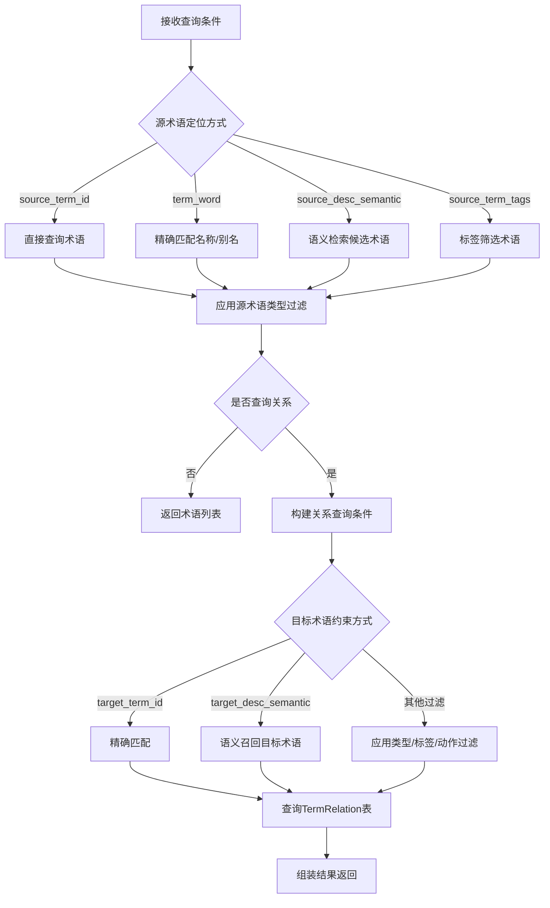

**使用说明：**

1. **源术语定位优先级**：`source_term_id` > `term_word` > (`source_desc_semantic` + `source_term_tags`)
2. **多跳查询由 Agent 实现**：
   ```
   Agent 决策示例：
   Step1: 调用 /term/knowledge/query
          {source_term_id: "TERM_XIAOMING", relation_query: {relation_names: ["*_属于_*"]}}
          → 得到：王小明 --属于--> 员工
   
   Step2: Agent 决定继续查员工的关系
          调用 /term/knowledge/query  
          {source_term_id: "TERM_EMP", relation_query: {target_term_types: ["VIEW"]}}
          → 得到：员工 --关联--> KPI视图、合同视图...
   
   Step3: Agent 根据业务逻辑决定何时停止或继续扩展
   ```
3. **查术语类型关系的方法**：通过 `relation_names: ["*_属于_*"]` 配合 `target_term_types: ["OBJ"]` 可以找到实例术语与其概念术语类型的关系
4. **语义查询与精确查询可结合**：如先用语义找到源术语，再精确约束目标术语类型

---
##### 3) 数据意图识别接口（结合Agent流式输出）

用于识别用户数据查询意图，结合Agent流式输出能力，逐步分析并返回数据查询计划。本接口本质上是**找知识**的过程，应与术语知识查询接口协同工作。

| 属性 | 说明 |
|------|------|
| **接口路径** | `POST /term/intent/recognize` 或 `POST /term/intent/recognize/stream` |
| **接口说明** | 识别用户数据查询意图，结合Agent流式输出，生成数据查询计划 |
| **流式支持** | 支持SSE流式输出，实时返回分析过程 |

**Agent驱动的查询流程设计：**

数据意图识别接口采用Agent驱动的逐步分析流程：

```
用户查询: "王小明作为销售是否优秀？"
    ↓ Agent意图识别流程

步骤1: 分词召回术语
  - 对用户查询进行术语库全分词，去掉虚词
  - 匹配术语: ["王小明(列表术语)", "销售(字典术语)"]
  - 流式事件: term_recalled
  - Agent可展示召回的术语给用户确认

步骤2: BFS关系探索找相关知识
  - 子步骤2.1: 王小明(列表术语) → 通过关系"属于"找到术语"员工"
  - 子步骤2.2: 员工 → 通过关系"关联"找到 {合同, 商机, 客户, 日报, KPI, 考勤}
  - 子步骤2.3: 销售(字典术语) → 获取描述《销售评优管理办法》
  - 流式事件: relation_exploring → knowledge_found（每发现知识即输出）

步骤3: 意图确认
  - 分析查询类型: 评估/分析类查询
  - 确定涉及数据对象: [合同, 商机, KPI, 考勤]
  - 流式事件: intent_confirmed
  - 如意图不明确，输出: clarification_needed

步骤4: 生成数据查询计划
  - 构建查询路径: 王小明 → 员工 → [合同, 商机, KPI]
  - 确定筛选标签: 从tag_keys中提取（如合同金额、KPI类型等）
  - 流式事件: plan_generating → plan_completed
```

**场景示例：**

**场景1（分词+关系探索路径）：**
```
用户查询: "王小明作为销售是否优秀？"
步骤1: 分词召回 {王小明, 销售}
步骤2: 王小明(列表术语) --属于--> 员工 --关联--> {合同, 商机, 客户, 日报, KPI, 考勤}
步骤3: 销售(字典术语) 描述:《销售评优管理办法》
步骤4: 生成数据查询计划，包含上述数据对象和评估依据
```

**场景2（语义直接匹配视图）：**
```
用户查询: "张岩作为销售员工的商机签单和业绩"
步骤1: 语义匹配 员工视图(相似度0.91)
步骤2: 员工视图包含 {合同, 商机, 客户, 日报, KPI, 考勤}
步骤3: 意图: 查询员工业务数据
步骤4: 直接使用员工视图生成查询计划
```

**请求参数：**

| 参数名 | 类型 | 必填 | 说明 |
|--------|------|------|------|
| query | string | 是 | 用户自然语言查询 |
| context | object | 否 | 上下文信息（如当前领域、历史查询等） |
| stream | boolean | 否 | 是否流式输出，默认 true |
| top_k | int | 否 | 返回推荐意图数量，默认 3 |
| max_hops | int | 否 | 术语关系探索最大跳数，默认 2 |
| enable_clarification | boolean | 否 | 是否需要澄清步骤，默认 true |

**流式输出事件类型：**

| 事件类型 | 说明 | 输出时机 |
|---------|------|---------|
| `term_recalled` | 分词召回的术语结果，包含tag_keys供用户选择 | 步骤1完成时 |
| `relation_exploring` | 正在探索术语关系，显示当前探索进度 | 步骤2进行时 |
| `knowledge_found` | 发现相关知识（术语、关联数据、描述等） | 步骤2发现知识时 |
| `intent_confirmed` | 意图已确认，包含意图类型和置信度 | 步骤3完成时 |
| `clarification_needed` | 需要用户澄清（展示可选的tag_keys或术语） | 意图不明确时 |
| `plan_generating` | 正在生成数据查询计划 | 步骤4进行时 |
| `plan_completed` | 数据查询计划生成完成，包含完整查询路径 | 步骤4完成时 |
| `error` | 错误信息 | 发生错误时 |

**流式输出示例（SSE格式）：**

```
event: term_recalled
data: {"recalled_terms": [{"term_id": "TERM_XIAOMING", "term_name": "王小明", "term_type_code": "LIST", "tag_keys": ["TERM_LEVEL", "TERM_LOCATION"], "recall_source": "segmentation"}, {"term_id": "TERM_SALES", "term_name": "销售", "term_type_code": "DICT", "tag_keys": [], "recall_source": "segmentation"}], "message": "通过分词召回2个术语"}

event: relation_exploring
data: {"current_step": "BFS遍历", "current_term": "王小明", "hop": 1, "message": "正在查找王小明所属的概念术语..."}

event: knowledge_found
data: {"knowledge_type": "concept_term", "source_term": "王小明", "found_term": {"term_id": "TERM_EMP", "term_name": "员工", "term_type_code": "OBJ"}, "relation": "王小明_属于_员工", "action": "根据王小明查询员工信息"}

event: relation_exploring
data: {"current_step": "BFS遍历", "current_term": "员工", "hop": 2, "message": "正在查找员工关联的数据对象..."}

event: knowledge_found
data: {"knowledge_type": "related_objects", "source_term": "员工", "found_terms": [{"term_id": "TERM_CONTRACT", "term_name": "合同", "tag_keys": ["CONTRACT_AMOUNT", "CONTRACT_DATE", "CONTRACT_STATUS"]}, {"term_id": "TERM_OPPORTUNITY", "term_name": "商机", "tag_keys": ["OPP_AMOUNT", "OPP_STATUS"]}, {"term_id": "TERM_KPI", "term_name": "KPI", "tag_keys": ["KPI_TYPE", "KPI_PERIOD", "KPI_SCORE"]}], "relation": "员工_关联_业务数据"}

event: knowledge_found
data: {"knowledge_type": "dict_desc", "source_term": "销售", "desc_summary": "销售岗位定义及评优标准", "ext_system": "RAGFLOW", "ext_kb_id": "KB_HR_001", "ext_doc_id": "DOC_SALES_POLICY", "doc_name": "《销售评优管理办法》"}

event: intent_confirmed
data: {"intent_type": "ANALYZE", "confidence": 0.92, "matched_terms": ["王小明", "销售"], "message": "意图识别：分析王小明作为销售的业绩表现"}

event: plan_generating
data: {"message": "正在组装数据查询计划...", "involved_objects": ["合同", "商机", "KPI"]}

event: plan_completed
data: {"query_plan": {"query_id": "QP_001", "query_target": "评估王小明作为销售的优秀程度", "start_term": {"term_id": "TERM_XIAOMING", "term_name": "王小明", "tag_keys": ["TERM_LEVEL", "TERM_LOCATION"]}, "data_objects": [{"term_id": "TERM_CONTRACT", "term_name": "合同", "query_action": "查询王小明的合同", "available_tags": ["CONTRACT_AMOUNT", "CONTRACT_DATE", "CONTRACT_STATUS"]}, {"term_id": "TERM_KPI", "term_name": "KPI", "query_action": "查询王小明的KPI", "available_tags": ["KPI_TYPE", "KPI_PERIOD", "KPI_SCORE"]}], "evaluation_basis": {"doc_id": "DOC_SALES_POLICY", "doc_name": "《销售评优管理办法》"}, "query_path": [{"step": 1, "action": "王小明_属于_员工", "source": "王小明", "target": "员工"}, {"step": 2, "action": "员工_签订_合同", "source": "员工", "target": "合同", "suggested_filters": ["CONTRACT_AMOUNT"]}, {"step": 3, "action": "员工_关联_KPI", "source": "员工", "target": "KPI", "suggested_filters": ["KPI_SCORE"]}], "suggested_clarifications": [{"type": "tag_selection", "term": "合同", "options": ["CONTRACT_AMOUNT", "CONTRACT_DATE", "CONTRACT_STATUS"], "message": "您想筛选合同的哪些属性？"}]}}
```

**请求示例：**
```json
{
  "query": "帮我查一下王小明签订的合同",
  "context": {
    "domain_id": "DOMAIN_003",
    "user_role": "manager"
  },
  "stream": true,
  "top_k": 3,
  "max_hops": 2,
  "enable_clarification": true
}
```

**非流式响应参数：**

| 参数名 | 类型 | 说明 |
|--------|------|------|
| code | int | 响应码 |
| message | string | 响应信息 |
| data | object | 响应数据 |
| data.query_id | string | 查询计划ID |
| data.query_target | string | 查询目标描述 |
| data.confidence | float | 整体置信度（0-1） |
| data.intents | array | 识别到的意图列表 |
| data.intents[].intent_type | string | 意图类型（QUERY/AGGREGATE/COMPARE/ANALYZE等） |
| data.intents[].confidence | float | 置信度（0-1） |
| data.intents[].matched_terms | array | 匹配到的术语列表（包含tag_keys） |
| data.intents[].query_plan | object | 数据查询计划 |
| data.intents[].query_plan.start_term | object | 起始术语（含tag_keys供澄清） |
| data.intents[].query_plan.data_objects | array | 涉及的数据对象列表（含tag_keys供筛选） |
| data.intents[].query_plan.query_path | array | 查询路径（多跳关系链） |
| data.intents[].query_plan.evaluation_basis | object | 评估依据文档（如有） |
| data.intents[].query_plan.suggested_clarifications | array | 建议的澄清项（供Agent展示） |
| data.intents[].reason | string | 推荐理由 |

**非流式响应示例：**
```json
{
  "code": 200,
  "message": "success",
  "data": {
    "query_id": "QP_20250214001",
    "query_target": "查询王小明签订的合同",
    "confidence": 0.95,
    "intents": [
      {
        "intent_type": "QUERY",
        "confidence": 0.95,
        "matched_terms": [
          {
            "term_id": "TERM_XIAOMING",
            "term_name": "王小明",
            "term_type_code": "LIST",
            "tag_keys": ["TERM_LEVEL", "TERM_LOCATION"]
          },
          {
            "term_id": "TERM_CONTRACT",
            "term_name": "合同",
            "term_type_code": "OBJ",
            "tag_keys": ["CONTRACT_AMOUNT", "CONTRACT_DATE", "CONTRACT_STATUS"]
          }
        ],
        "query_plan": {
          "start_term": {
            "term_id": "TERM_XIAOMING",
            "term_name": "王小明",
            "tag_keys": ["TERM_LEVEL", "TERM_LOCATION"]
          },
          "data_objects": [
            {
              "term_id": "TERM_CONTRACT",
              "term_name": "合同",
              "query_action": "查询王小明签订的合同",
              "available_tags": ["CONTRACT_AMOUNT", "CONTRACT_DATE", "CONTRACT_STATUS"]
            }
          ],
          "query_path": [
            {"step": 1, "action": "王小明_属于_员工", "source": "王小明", "target": "员工"},
            {"step": 2, "action": "员工_签订_合同", "source": "员工", "target": "合同", "suggested_filters": ["CONTRACT_AMOUNT"]}
          ],
          "suggested_clarifications": [
            {
              "type": "tag_selection",
              "term": "合同",
              "options": ["CONTRACT_AMOUNT", "CONTRACT_DATE", "CONTRACT_STATUS"],
              "message": "您想筛选合同的哪些属性？"
            }
          ]
        },
        "reason": "通过术语关系路径：王小明→员工→合同，找到用户查询的目标数据"
      }
    ]
  }
}
```

---

##### 4) 术语分词召回接口

用于对用户输入文本进行自然语言分词，并召回文本中包含的术语。

| 属性 | 说明 |
|------|------|
| **接口路径** | `POST /term/recall` |
| **接口说明** | 文本分词并召回术语 |

**请求参数：**

| 参数名 | 类型 | 必填 | 说明 |
|--------|------|------|------|
| text | string | 是 | 输入文本 |
| limit | int | 否 | 返回数量限制，默认 10 |

**响应参数：**

| 参数名 | 类型 | 说明 |
|--------|------|------|
| code | int | 响应码 |
| data | array | 召回术语列表 |
| data[].word | string | 分词词语 |
| data[].term_id | string | 匹配到的术语ID |
| data[].term_name | string | 术语标准名称 |
| data[].term_type_code | string | 术语类型编码 |
| data[].match_type | string | 匹配类型（EXACT=精确, SYNONYM=同义词, FUZZY=模糊） |
| data[].score | float | 匹配置信度 |

##### 5) 近似术语推荐接口

用于当用户输入的术语无法精确匹配时，基于编辑距离、拼音、三元组等算法推荐近似的术语。为场景 4.3 提供底层支持。

| 属性 | 说明 |
|------|------|
| **接口路径** | `POST /term/fuzzy-recommend` |
| **接口说明** | 基于编辑距离/拼音推荐近似术语 |

**请求参数：**

| 参数名 | 类型 | 必填 | 说明 |
|--------|------|------|------|
| query | string | 是 | 用户输入的错误术语文本 |
| limit | int | 否 | 返回数量限制，默认 5 |

**响应参数：**

| 参数名 | 类型 | 说明 |
|--------|------|------|
| code | int | 响应码 |
| data | array | 推荐术语列表 |
| data[].term_id | string | 术语ID |
| data[].term_name | string | 术语标准名称 |
| data[].score | float | 相似度分数 |

**请求示例：**
```json
{
  "query": "王大名",
  "limit": 5
}
```

**响应示例：**
```json
{
  "code": 200,
  "data": [
    {
      "term_id": "TERM_XIAOMING",
      "term_name": "王小明",
      "score": 0.95
    }
  ]
}
```


##### 6) 文档查询接口（供本体服务调用）

用于本体服务查询文档（如合同附件）的详细信息，支持按术语库、文档类型、关联合同ID等多维度筛选。通过 `doc_type` 判断文档类型，如 `CONTRACT_ATTACHMENT` 表示合同附件，`CONTRACT` 表示合同主文档，`PRODUCT_DOC` 表示产品文档。

| 属性 | 说明 |
|------|------|
| **接口路径** | `POST /doc/query` |
| **接口说明** | 文档查询接口，供本体服务调用，返回文档（含附件）的详细信息 |

**请求参数：**

| 参数名 | 类型 | 必填 | 说明 |
|--------|------|------|------|
| library_id | string | 否 | 术语库ID（如合同库、产品文档库） |
| doc_type | string | 否 | 文档类型编码：CONTRACT_ATTACHMENT=合同附件，CONTRACT=合同主文档，PRODUCT_DOC=产品文档 |
| contract_id | string | 否 | 关联合同ID（标签过滤：TERM_CONTRACT_ID） |
| file_id | string | 否 | 精确匹配文件ID（标签过滤：TERM_FILE_ID） |
| keyword | string | 否 | 搜索关键字，匹配文档术语名称、别名、描述摘要 |
| include_content_sample | boolean | 否 | 是否返回内容样例，默认 true |
| content_sample_length | int | 否 | 内容样例长度，默认 500 字符 |
| page_num | int | 否 | 页码，默认 1 |
| page_size | int | 否 | 每页条数，默认 20 |

**请求示例：**
```json
{
  "library_id": "LIB_CONTRACT",
  "doc_type": "CONTRACT_ATTACHMENT",
  "contract_id": "CONT_20240315_001",
  "keyword": "数智运营",
  "include_content_sample": true,
  "content_sample_length": 1000,
  "page_num": 1,
  "page_size": 10
}
```

**响应参数：**

| 参数名 | 类型 | 说明 |
|--------|------|------|
| code | int | 响应码，200 表示成功 |
| message | string | 响应信息 |
| data | object | 响应数据 |
| data.total | int | 总条数 |
| data.list | array | 文档列表 |
| data.list[].term_id | string | 文档术语ID |
| data.list[].term_name | string | 文档名称（如"B市数智运营项目合同_附件1_技术方案.pdf"） |
| data.list[].term_type_code | string | 术语类型编码（固定为 DOC） |
| data.list[].term_type_name | string | 术语类型名称（文档名称） |
| data.list[].desc_summary | string | 文档描述摘要 |
| data.list[].library_id | string | 所属术语库ID |
| data.list[].library_name | string | 术语库名称 |
| data.list[].file_id | string | 文件ID（从 term_tags.TERM_FILE_ID 提取） |
| data.list[].file_name | string | 文件名称（同 term_name） |
| data.list[].file_type | string | 文件类型（从文件名后缀提取，如 pdf、doc、xlsx） |
| data.list[].doc_type | string | 文档类型（从 term_tags.DOC_TYPE 提取）：CONTRACT_ATTACHMENT=合同附件，CONTRACT=合同主文档，PRODUCT_DOC=产品文档 |
| data.list[].contract_id | string | 关联合同ID（从 term_tags.TERM_CONTRACT_ID 提取） |
| data.list[].contract_name | string | 关联合同名称（从 term_tags.TERM_CONTRACT_NAME 提取） |
| data.list[].content_sample | string | 内容样例（从 desc_summary 或外挂知识库 chunk 提取） |
| data.list[].term_tags | object | 完整标签属性（JSONB） |
| data.list[].created_time | string | 创建时间 |
| data.list[].updated_time | string | 更新时间 |

**实现说明：**

1. **术语类型**：文档术语的 `term_type_code` 固定为 `DOC`（对应 TermType.type=4）
2. **标签约定**：
   - `TERM_FILE_ID`：文件唯一标识ID
   - `TERM_CONTRACT_ID`：关联合同ID
   - `TERM_CONTRACT_NAME`：关联合同名称
   - `DOC_TYPE`：文档子类型（CONTRACT_ATTACHMENT=合同附件, CONTRACT=合同主文档, PRODUCT_DOC=产品文档）
3. **内容样例来源**：
   - 优先从 `desc_summary` 字段截取
   - 如有外挂三元组（`TermKnowledge.ext_doc_id`），可委托外挂知识库提取 chunk 作为样例
4. **SQL 查询逻辑**：
   ```sql
   SELECT 
       t.term_id,
       t.term_name,
       t.desc_summary,
       t.term_tags,
       t.library_id,
       t.created_time,
       t.updated_time
   FROM term t
   WHERE t.term_type_code = 'DOC'
     AND (:library_id IS NULL OR t.library_id = :library_id)
     AND (:doc_type IS NULL OR t.term_tags @> '{"DOC_TYPE": {"type": "TEXT", "value": "' || :doc_type || '"}}'::jsonb)
     AND (:contract_id IS NULL OR t.term_tags @> '{"TERM_CONTRACT_ID": {"type": "TEXT", "value": "' || :contract_id || '"}}'::jsonb)
     AND (:file_id IS NULL OR t.term_tags @> '{"TERM_FILE_ID": {"type": "TEXT", "value": "' || :file_id || '"}}'::jsonb)
     AND (:keyword IS NULL OR t.term_name ILIKE '%' || :keyword || '%' OR t.desc_summary ILIKE '%' || :keyword || '%')
   ORDER BY t.created_time DESC
   LIMIT :page_size OFFSET :offset;
   ```


##### 7) 图谱遍历查询接口

提供基于图结构的深度遍历（K-Hop）和两点间最短路径查询能力。

| 属性 | 说明 |
|------|------|
| **接口路径** | `POST /term/graph/query` |
| **接口说明** | 图谱遍历与路径查询（支持 K-Hop 和最短路径） |

**请求参数：**

| 参数名 | 类型 | 必填 | 说明 |
|--------|------|------|------|
| start_term_id | string | 是 | 起始术语ID |
| type | string | 是 | 查询类型：`k_hop`（K跳邻居）或 `shortest_path`（最短路径） |
| max_depth | int | 否 | 最大深度，默认 3（k_hop）或 10（shortest_path） |
| end_term_id | string | 否 | 终点术语ID（`shortest_path` 类型必填） |
| relation_names | array | 否 | 关系名称过滤列表，支持通配符 |
| direction | string | 否 | 遍历方向：`out`（出边）、`in`（入边）、`both`（双向，默认） |
| limit | int | 否 | 返回数量限制（仅对 `k_hop` 有效），默认 200 |

**响应参数（type=k_hop）：**

| 参数名 | 类型 | 说明 |
|--------|------|------|
| code | int | 响应码 |
| data | array | 路径关系列表 |
| data[].relation_id | string | 关系ID |
| data[].source_term_id | string | 源术语ID |
| data[].target_term_id | string | 目标术语ID |
| data[].relation_name | string | 关系名称 |
| data[].depth | int | 深度（1 表示直接相连） |
| data[].path_nodes | array | 路径节点ID数组 |

**响应参数（type=shortest_path）：**

| 参数名 | 类型 | 说明 |
|--------|------|------|
| code | int | 响应码 |
| data | object | 最短路径信息 |
| data.path_ids | array | 路径上的术语ID序列（有序） |
| data.path_names | array | 路径上的关系名称序列（有序） |
| data.depth | int | 路径总跳数 |

**请求示例（K跳查询）：**
```json
{
  "start_term_id": "TERM_XIAOMING",
  "type": "k_hop",
  "max_depth": 2,
  "direction": "out"
}
```

**请求示例（最短路径）：**
```json
{
  "start_term_id": "TERM_CEO",
  "end_term_id": "TERM_XIAOMING",
  "type": "shortest_path"
}
```


#### 3.6.2 术语构建接口

##### 1) 术语类型管理接口

###### 批量新增术语类型

| 属性 | 说明 |
|------|------|
| **接口路径** | `POST /term-type/batch/create` |
| **接口说明** | 批量新增术语类型 |

**请求参数：**

| 参数名 | 类型 | 必填 | 说明 |
|--------|------|------|------|
| types | array | 是 | 术语类型列表 |
| types[].type_code | string | 是 | 类型编码（唯一） |
| types[].type_name | string | 是 | 类型名称 |
| types[].type_desc | string | 否 | 类型描述 |
| types[].type | int | 是 | 大分类：1=列表,2=字典,3=本体,4=文档 |
| types[].type_term_id | string | 否 | 关联的术语ID，术语类型本身也是术语 |

**请求示例：**
```json
{
  "types": [
    {
      "type_code": "CUSTOM_TYPE_001",
      "type_name": "自定义对象",
      "type_desc": "用户自定义的对象类型",
      "type": 3
    }
  ]
}
```

###### 批量修改术语类型

| 属性 | 说明 |
|------|------|
| **接口路径** | `POST /term-type/batch/update` |
| **接口说明** | 批量修改术语类型 |

**请求参数：**

| 参数名 | 类型 | 必填 | 说明 |
|--------|------|------|------|
| types | array | 是 | 术语类型列表 |
| types[].type_code | string | 是 | 类型编码（主键） |
| types[].type_name | string | 否 | 类型名称 |
| types[].type_desc | string | 否 | 类型描述 |
| types[].type_term_id | string | 否 | 关联的术语ID，术语类型本身也是术语 |

> **说明**：修改 `type_term_id` 时，会同步更新术语类型与术语的关联关系；如果置空，则解除关联。

###### 批量删除术语类型

| 属性 | 说明 |
|------|------|
| **接口路径** | `POST /term-type/batch/delete` |
| **接口说明** | 批量删除术语类型（需检查是否被术语引用） |

**请求参数：**

| 参数名 | 类型 | 必填 | 说明 |
|--------|------|------|------|
| type_codes | array | 是 | 类型编码列表 |
| force | boolean | 否 | 是否强制删除（级联删除关联术语），默认 false |

**请求示例：**
```json
{
  "type_codes": ["CUSTOM_TYPE_001"],
  "force": false
}
```

---

##### 2) 术语管理接口

###### 批量新增术语

| 属性 | 说明 |
|------|------|
| **接口路径** | `POST /term/batch/create` |
| **接口说明** | 批量新增术语（含名称、标签等） |

**请求参数：**

| 参数名 | 类型 | 必填 | 说明 |
|--------|------|------|------|
| terms | array | 是 | 术语列表 |
| terms[].term_id | string | 否 | 术语ID（不传则自动生成） |
| terms[].term_name | string | 是 | 术语标准名称 |
| terms[].term_type_code | string | 是 | 术语类型编码 |
| terms[].domain_id | string | 否 | 所属领域ID |
| terms[].library_id | string | 否 | 所属术语库ID |
| terms[].desc_summary | string | 否 | 描述摘要（快速展示用） |
| terms[].term_tags | object | 否 | 标签属性（JSON对象） |
| terms[].names | array | 否 | 别名列表（包含标准名称的所有别名） |
| terms[].names[].name_text | string | 是 | 名称文本 |

> **注意**：术语关联知识（外挂文档三元组、内部知识内容）通过独立的 `TermKnowledge` 接口管理，不在本接口传入。

**请求示例：**
```json
{
  "terms": [
    {
      "term_name": "张三",
      "term_type_code": "LIST",
      "domain_id": "DOMAIN_002",
      "library_id": "LIB_001",
      "desc_summary": "销售员工张三",
      "term_tags": {
        "TERM_LEVEL": {"type": "TEXT", "value": "M2"},
        "TERM_LOCATION": {"type": "TEXT", "value": "北京"}
      },
      "names": [
        {"name_text": "张三"},
        {"name_text": "张经理"}
      ]
    }
  ]
}
```

> **注意**：`names` 数组中不再包含 `name_type` 字段，系统会自动判定：name_text 等于 term_name 时为标准名称，其他为别名。

###### 批量修改术语

| 属性 | 说明 |
|------|------|
| **接口路径** | `POST /term/batch/update` |
| **接口说明** | 批量修改术语信息 |

**请求参数：**

| 参数名 | 类型 | 必填 | 说明 |
|--------|------|------|------|
| terms | array | 是 | 术语列表 |
| terms[].term_id | string | 是 | 术语ID（主键） |
| terms[].term_name | string | 否 | 术语标准名称 |
| terms[].term_type_code | string | 否 | 术语类型编码 |
| terms[].domain_id | string | 否 | 所属领域ID |
| terms[].library_id | string | 否 | 所属术语库ID |
| terms[].desc_summary | string | 否 | 描述摘要（快速展示用） |
| terms[].term_tags | object | 否 | 标签属性（全量替换或增量更新） |
| terms[].tag_update_mode | string | 否 | 标签更新模式：replace（全量替换，默认）/merge（合并） |

**请求示例：**
```json
{
  "terms": [
    {
      "term_id": "TERM_ZHANGSAN",
      "term_name": "张三（更新）",
      "term_tags": {
        "TERM_LEVEL": {"type": "TEXT", "value": "M3"}
      },
      "tag_update_mode": "merge"
    }
  ]
}
```

###### 批量删除术语

| 属性 | 说明 |
|------|------|
| **接口路径** | `POST /term/batch/delete` |
| **接口说明** | 批量删除术语（级联删除名称、关系） |

**请求参数：**

| 参数名 | 类型 | 必填 | 说明 |
|--------|------|------|------|
| term_ids | array | 是 | 术语ID列表 |
| cascade | boolean | 否 | 是否级联删除关联数据（名称、关系），默认 true |

**请求示例：**
```json
{
  "term_ids": ["TERM_ZHANGSAN", "TERM_LISI"],
  "cascade": true
}
```

---

##### 3) 术语关系管理接口

###### 批量新增术语关系

| 属性 | 说明 |
|------|------|
| **接口路径** | `POST /term-relation/batch/create` |
| **接口说明** | 批量新增术语之间的关系 |

**请求参数：**

| 参数名 | 类型 | 必填 | 说明 |
|--------|------|------|------|
| relations | array | 是 | 关系列表 |
| relations[].source_term_id | string | 是 | 源术语ID |
| relations[].target_term_id | string | 是 | 目标术语ID |
| relations[].relation_name | string | 是 | 关系名称（如「员工_属于_组织」） |
| relations[].action | string | 否 | 关系产生的动作（如「根据员工查询组织」） |

**请求示例：**
```json
{
  "relations": [
    {
      "source_term_id": "TERM_ZHANGSAN",
      "target_term_id": "TERM_EMP",
      "relation_name": "张三_属于_员工",
      "action": "根据张三查询员工信息"
    },
    {
      "source_term_id": "TERM_EMP",
      "target_term_id": "TERM_CONTRACT",
      "relation_name": "员工_签订_合同",
      "action": "根据员工查询合同"
    }
  ]
}
```

###### 批量修改术语关系

| 属性 | 说明 |
|------|------|
| **接口路径** | `POST /term-relation/batch/update` |
| **接口说明** | 批量修改术语关系 |

**请求参数：**

| 参数名 | 类型 | 必填 | 说明 |
|--------|------|------|------|
| relations | array | 是 | 关系列表 |
| relations[].relation_id | string | 是 | 关系ID（主键） |
| relations[].relation_name | string | 否 | 关系名称 |
| relations[].action | string | 否 | 关系动作 |

###### 批量删除术语关系

| 属性 | 说明 |
|------|------|
| **接口路径** | `POST /term-relation/batch/delete` |
| **接口说明** | 批量删除术语关系 |

**请求参数：**

| 参数名 | 类型 | 必填 | 说明 |
|--------|------|------|------|
| relation_ids | array | 是 | 关系ID列表 |

**请求示例：**
```json
{
  "relation_ids": ["REL_001", "REL_002"]
}
```


---

#### 3.6.3 接口汇总表

| 模块 | 接口名称 | 路径 (Path) | 请求方式 | 描述 |
| :--- | :--- | :--- | :--- | :--- |
| **术语服务** | 术语API查询 | `/term/api/search` | POST | 基础列表查询，支持类型、关键字、标签过滤，适用于管理后台或列表展示 |
| | **术语知识查询** | `/term/knowledge/query` | POST | **核心原子接口**，支持通过ID/名称/语义/标签定位源术语，并返回一跳关联知识，供Agent多跳探索使用 |
| | **图谱遍历查询** | `/term/graph/query` | POST | 提供基于图结构的深度遍历(K-Hop)和最短路径查询能力 |
| | **数据意图识别** | `/term/intent/recognize` | POST | 识别用户自然语言查询意图，结合Agent流式输出，生成数据查询计划（支持SSE） |
| | 术语分词召回 | `/term/recall` | POST | 对输入文本进行分词，并召回包含的术语，支持同义词匹配 |
| | 近似术语推荐 | `/term/fuzzy-recommend` | POST | 基于编辑距离、拼音、三元组等算法推荐近似术语，用于纠错 |
| | 文档查询 | `/doc/query` | POST | 供本体服务调用，支持按术语库、类型、关联ID查询文档及附件 |
| **术语构建** | 术语类型管理 | `/term-type/batch/{create,update,delete}` | POST | 批量增删改术语类型定义 |
| | 术语管理 | `/term/batch/{create,update,delete}` | POST | 批量增删改术语实体（包含标签属性、别名等） |
| | 术语关系管理 | `/term-relation/batch/{create,update,delete}` | POST | 批量增删改术语之间的关联关系 |


## 4 用例设计

本章节详细阐述四个核心业务场景的交互流程，重点展示 Agent 如何通过调用原子化的知识服务接口（`query_term_knowledge`）来实现复杂的业务逻辑。

### 4.1 场景一：术语知识查询（Agent 编排多跳）

**场景描述：**
用户提问：“王小明作为销售是否优秀？”
Agent 需要理解“王小明”和“销售”这两个术语，并进一步探索它们的关联知识（如王小明是员工，员工有绩效考核），最终结合“销售”的评优标准（字典术语描述）来回答用户。

**时序图：**

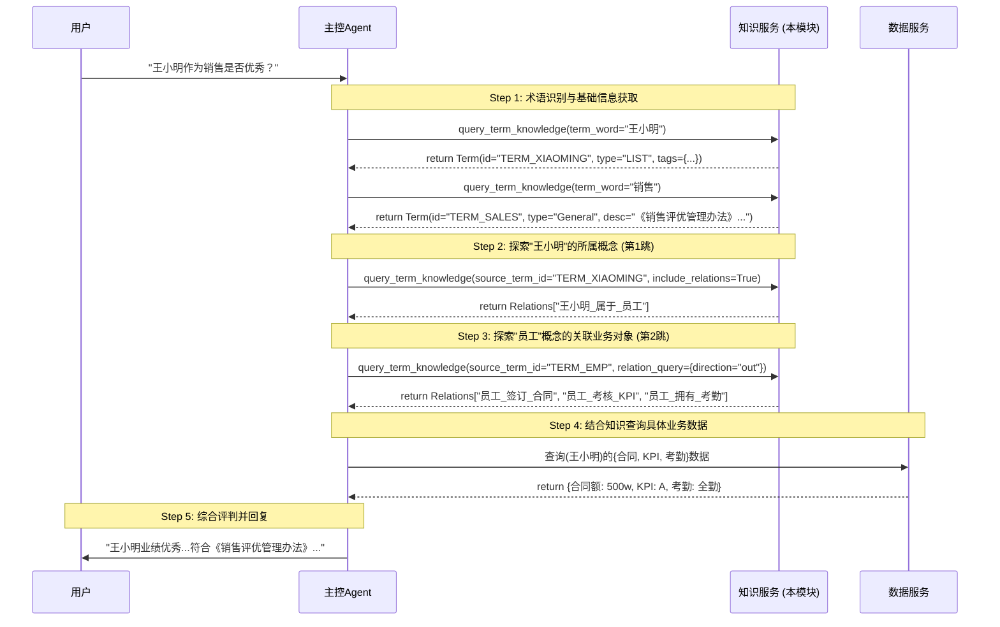

**阐述：**
1.  **原子化查询**：知识服务不直接处理“王小明是否优秀”这个复杂问题，而是提供关于“王小明”是谁（术语信息）、他属于什么（关系知识）、“销售”是什么（描述知识）的原子信息。
2.  **Agent 编排**：Agent 负责将这些原子调用串联起来。它先查“王小明”，发现是员工，再查“员工”有哪些业务数据（合同、KPI），最后决定去数据服务查具体数值。
3.  **上下文增强**：知识服务返回的“销售”术语描述包含了评优办法，为 Agent 提供了推理的上下文依据。

---

### 4.2 场景二：语义匹配查找通过视图

**场景描述：**
用户提问：“王小明作为销售是否优秀？”或者用户有模糊的查询意图，Agent 尝试通过语义检索找到最匹配的数据视图（View）。

**时序图：**

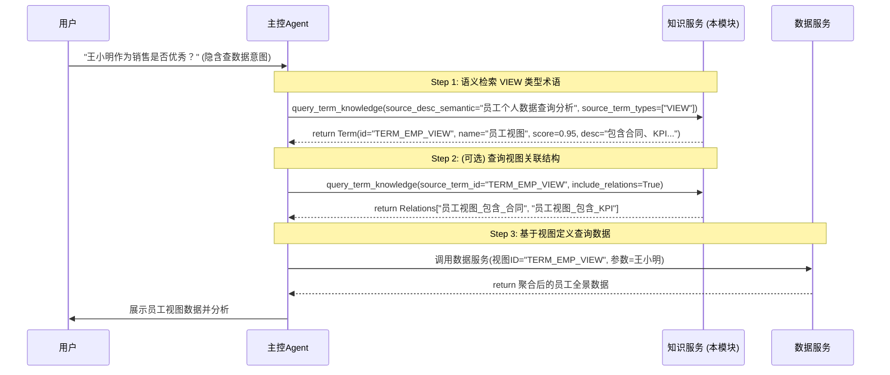

**阐述：**
1.  **语义入口**：当无法通过精确名称匹配术语时，或者为了直接找到聚合好的“视图”，Agent 使用 `source_desc_semantic` 参数调用 `query_term_knowledge`。
2.  **外挂知识库支持**：底层通过 `TermKnowledge` 外挂三元组（`ext_system + ext_kb_id + ext_doc_id`）关联外挂知识库进行向量检索，返回语义最相似的术语（如“员工视图”）。
3.  **简化流程**：相比场景一的逐步探索，直接找到“视图”术语可以快速获取定义好的数据集合，提高查询效率。

---

### 4.3 场景三：术语校验与近似推荐

**场景描述：**
用户输入存在拼写错误（如“王大名”），系统无法精确匹配，通过近似推荐功能引导用户纠错。

**时序图：**

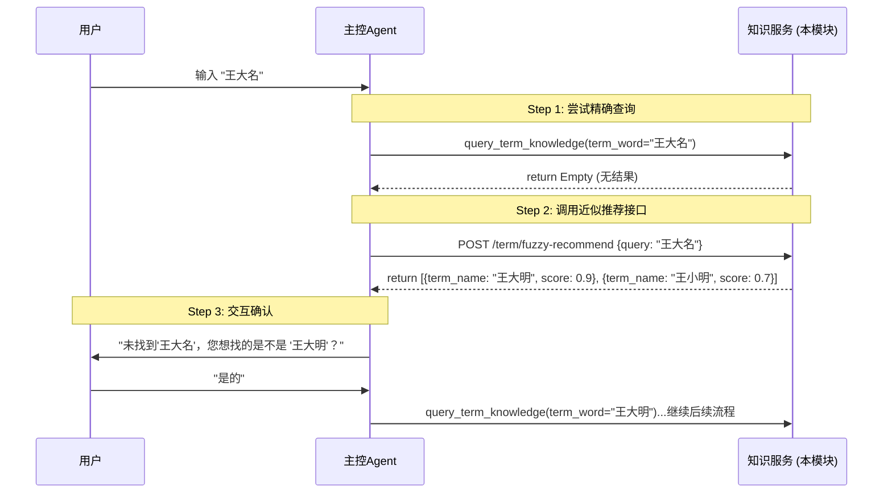

**阐述：**
1.  **容错机制**：在精确查找失败后，Agent 主动调用 `/term/fuzzy-recommend` 接口。
2.  **混合算法**：后端结合了 pg_trgm（三元组相似度）和 BK-Tree/拼音匹配算法，能有效处理同音字、形近字和编辑距离较小的错误。
3.  **人机协作**：推荐结果由 Agent 呈现给用户确认，确保后续查询的准确性。

---

### 4.4 场景四：带约束条件的术语查询（标签筛选）

**场景描述：**
用户提问：“帮我找到王小明签订的金额大于500万属于移动客户的合同”。
Agent 通过分词识别实体，探索关系获取标签定义，最后解析出结构化约束条件，利用标签筛选功能精准定位术语。

**时序图：**

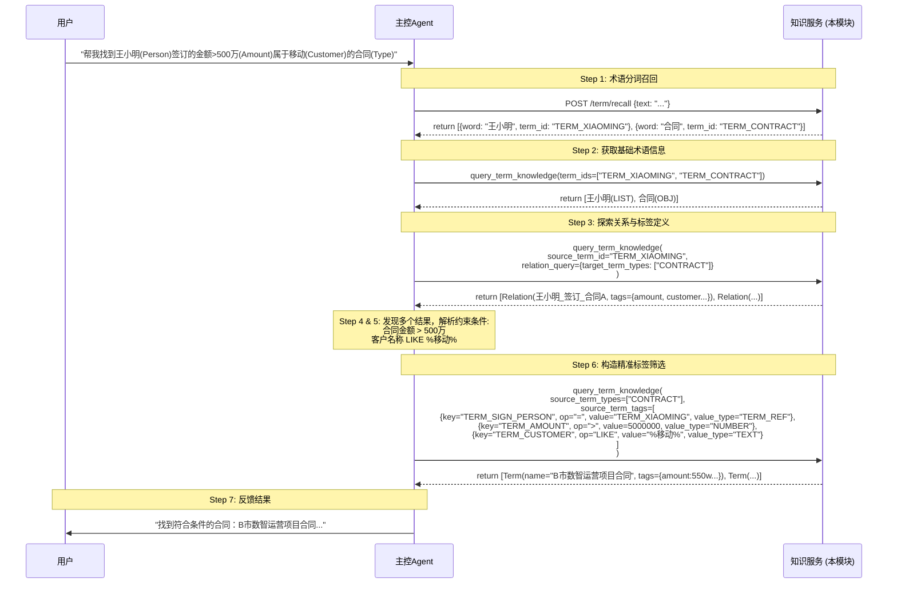

**阐述：**
1.  **分词与实体识别**：Agent 首先调用 `/term/recall` 接口从长句中识别出“王小明”和“合同”两个关键术语。
2.  **关系探索与元数据发现**：通过查询“王小明”到“合同”的关系，Agent 不仅确认了两者关联，还获取了目标术语（合同）的标签结构（如金额、客户等），为后续解析约束条件提供依据。
3.  **结构化筛选**：最终调用 `query_term_knowledge` 接口，利用 `source_term_tags` 参数进行多维度组合筛选（`TERM_REF`、`NUMBER`、`TEXT` 等类型）。

## 5 开发计划

第一周，初始化仓库，对接opengauss,建表，各种CRUD接口，对接知识库（或者mock,或者用开源）
第二周，1）术语api查询接口：入参术语类型、关键字、标签数组[{"key": val}]
2）术语知识查询接口：根据术语返回1跳的知识。

### 5.1 第1周：基础架构与CRUD接口（2026-03-02 ~ 2026-03-07）

| 任务 | 优先级 | 预估工时 | 产出物 | 状态 |
|------|--------|----------|--------|------|
| 初始化仓库、项目结构搭建 | P0 | 0.5d | Git仓库、Python项目骨架、requirements.txt | **待开始** |
| OpenGauss数据库对接 | P0 | 0.5d | 数据库连接配置、连接池管理、ORM集成 | **待开始** |
| 数据库建表 | P0 | 0.5d | 表结构：term_library, domain, term_type, term, term_relation, term_name, term_vocabulary | **待开始** |
| 基础CRUD接口开发 | P0 | 1d | 术语库、领域、类型、术语、名称、关系等基础管理接口 | **待开始** |
| 对接知识库（Mock/开源/自建） | P0 | 1d | 知识库连接层（KBClient），支持Mock或实际接入，实现文档/描述的向量化与检索基础 | **待开始** |

**第1周里程碑：** 基础数据管理接口全部可用，数据库与知识库底层连接打通。

---

### 5.2 第2周：核心查询与知识探索能力（2026-03-09 ~ 2026-03-14）

| 任务 | 优先级 | 预估工时 | 产出物 | 状态 |
|------|-------|--------|----------|--------|
| 术语API查询接口 | P0 | 2d | **接口路径**：`/term/api/search`<br>**核心入参**：`term_type`, `keyword`, `tags`（含`type`,`value`）, `library_id`<br>**功能**：根据术语类型、关键字、标签属性等多维条件查询术语列表 | **待开始** |
| 术语知识查询接口（1跳知识） | P0 | 2d | **接口路径**：`/term/knowledge/query`<br>**核心入参**：`source_term_id`/`term_word`/`source_desc_semantic`/`source_term_tags`（四选一定位源）、`relation_query`（关系筛选）<br>**功能**：支持通过精确ID/名称/语义/标签定位源术语，并返回术语详情及其直接的一跳关联知识 | **待开始** |
| 核心接口测试与联调 | P0 | 1d | 针对上述两个核心接口的单元测试、集成测试及联调 | **待开始** |

**第2周里程碑：** 完成术语多维检索与基于图结构的知识探索能力。


### 5.3 第3周： 意图识别接口（结合agent做流式）

### 5.4 第4周：准确率优化